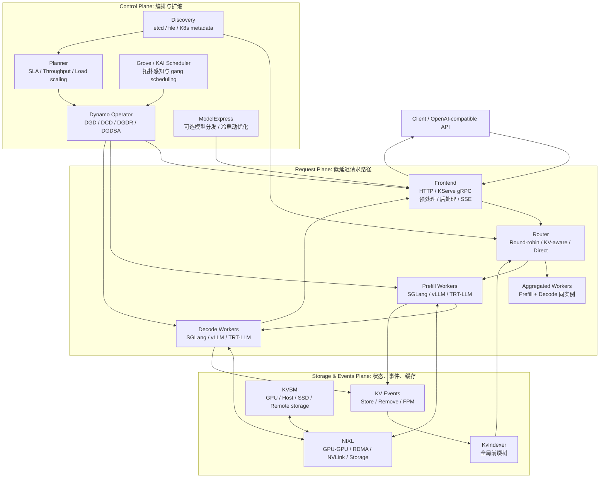
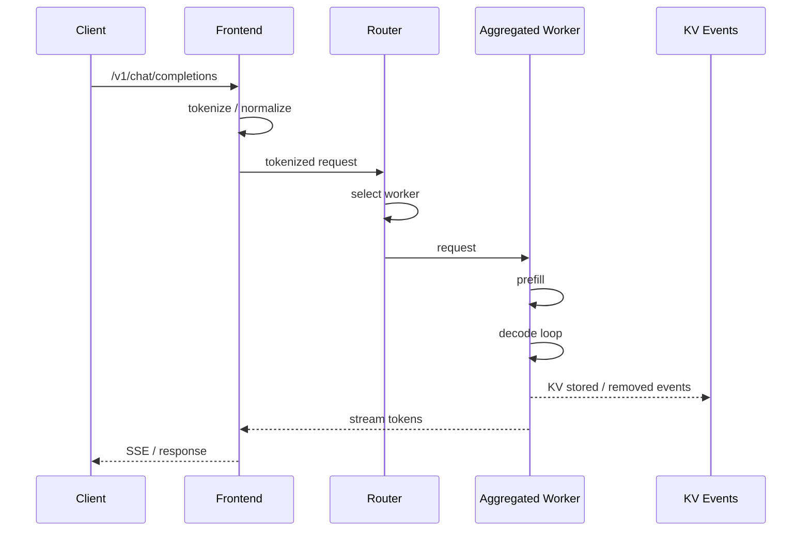
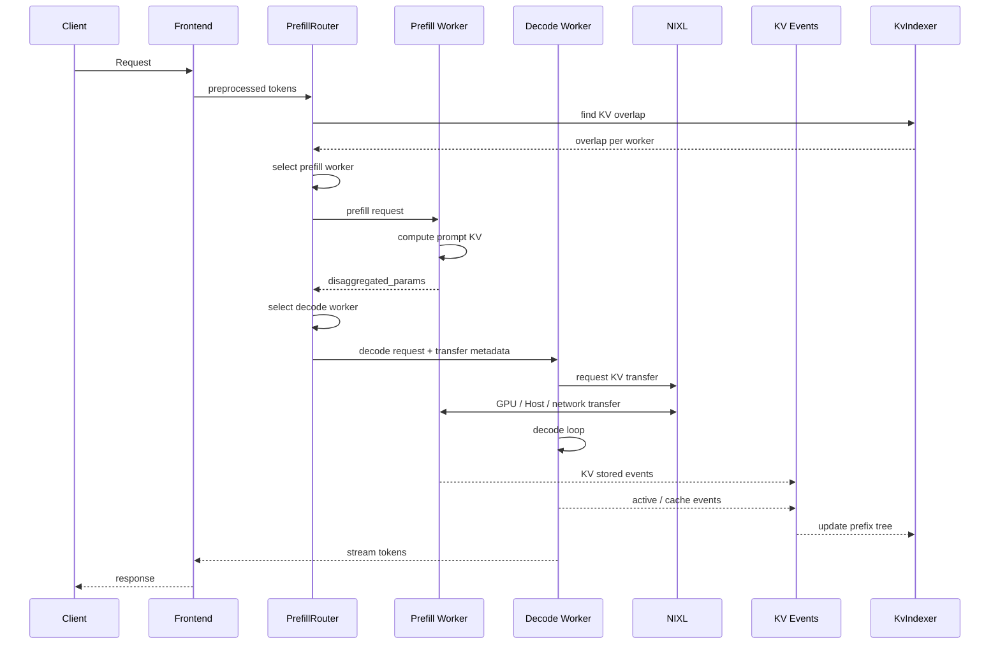
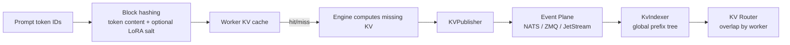
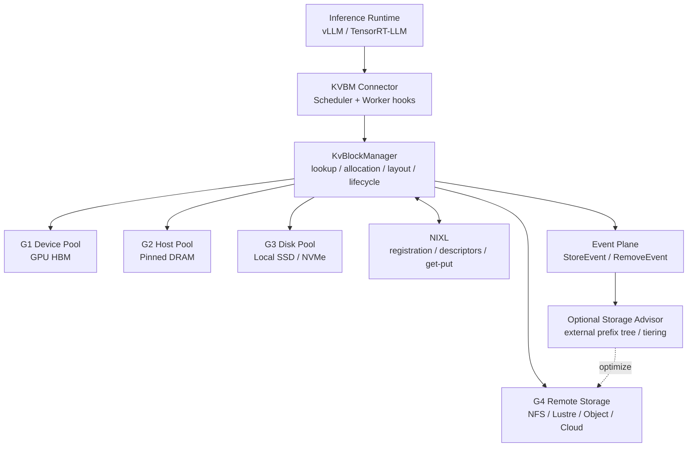
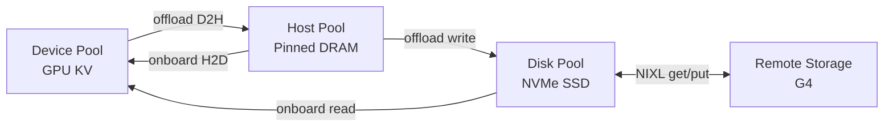
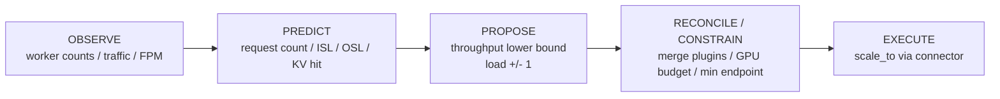
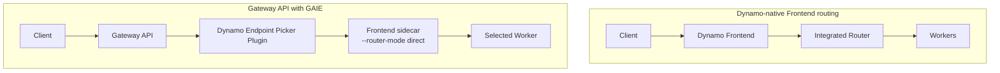
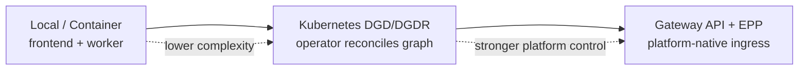
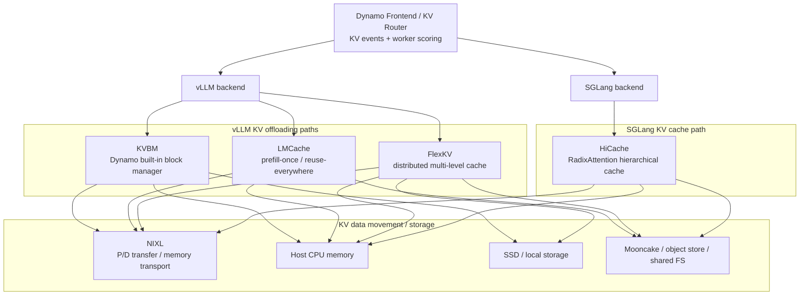

# Dynamo 深度技术文档

> **面向数据中心级 LLM 推理的编排、路由、KV 缓存与弹性伸缩架构解析**
>
> 基于 Dynamo 官方仓库与文档整理：<https://github.com/ai-dynamo/dynamo>
>
> 文档快照：main 分支 `cc5cf40db46a673bd0087dd1a34eda7a80000813`，整理日期：2026-07-09

---

## 目录

- [自动生成目录占位](#自动生成目录占位)

---

## 第一章：Dynamo 的定位

### 1.1 Dynamo 是什么

Dynamo 是一个开源的、面向数据中心规模的推理栈。它的核心定位不是替代 vLLM、SGLang 或 TensorRT-LLM，而是在这些推理引擎之上提供一个分布式编排层，把多个 GPU、多个节点、多个推理阶段组织成一个可路由、可缓存、可扩缩、可观测的推理系统。

用一句话概括：

> **推理引擎负责“怎么在一组 GPU 上执行模型”；Dynamo 负责“怎么把很多推理引擎实例组织成稳定、高效、可扩展的服务”。**

Dynamo 官方 README 对其定位非常明确：它是 inference engines 上方的 orchestration layer。它不会让 vLLM/SGLang/TRT-LLM 失去价值，而是把这些引擎连接成一个多节点系统，并在上层加入：

| 能力 | 解决的问题 |
|------|------------|
| Disaggregated Serving | Prefill 与 Decode 资源特征不同，需要分池扩缩 |
| KV-Aware Routing | 避免重复 Prefill，提升 TTFT 与吞吐 |
| KVBM | 将 KV Cache 扩展到 GPU、Host、SSD、远端存储 |
| Planner | 用 LLM 特定指标做弹性伸缩，而不是只看 CPU/QPS |
| Operator / CRDs | 在 Kubernetes 中声明式部署推理图 |
| NIXL | 为 KV 传输、远端内存访问、存储读写提供高速数据移动层 |

### 1.2 什么时候应该用 Dynamo

Dynamo 适合以下场景：

| 场景 | 为什么 Dynamo 有价值 |
|------|----------------------|
| 多 GPU 或多节点服务 | 需要服务发现、路由、组件编排、跨节点 KV 传输 |
| 长上下文或多轮会话 | KV Cache 复用和分层存储可以减少重复计算 |
| Prefill/Decode 压力不均 | 可以把 Prefill 和 Decode 拆成独立 worker 池 |
| 多租户或突发流量 | Planner 可以用 TTFT/ITL/SLA 目标调节副本 |
| 生产 Kubernetes 集群 | Operator、DGD、DGDR、Gateway API 集成降低部署复杂度 |
| 需要快速扩容和冷启动优化 | ModelExpress、Checkpoint、Grove 等生态能力可以配合使用 |

如果只是单机、单模型、单 GPU 的轻量推理，直接使用 vLLM/SGLang/TRT-LLM 通常更简单。Dynamo 的收益来自分布式协调、缓存复用和生产控制面能力，单点小规模场景未必值得引入。

### 1.3 Dynamo 解决的核心矛盾

现代 LLM 推理系统的问题不只是“模型算得慢”，而是多个资源瓶颈叠加：

**Prefill 与 Decode 的资源画像不同。** Prefill 处理输入 token，计算密集，适合大 batch 和高算力吞吐；Decode 逐 token 生成，受内存带宽、KV Cache 容量和并发序列数影响更大。混在同一组 worker 上会造成资源配置难以优化。

**KV Cache 决定了长上下文服务效率。** 同一个系统提示词、工具上下文、RAG 前缀或多轮会话历史，如果路由到没有缓存的 worker，就会重复 Prefill。KV Cache 是否可见、可复用、可转移，直接影响 TTFT 和 GPU 成本。

**传统弹性伸缩指标不适合 LLM。** Web 服务可以用 CPU、QPS、队列长度粗略扩缩，但 LLM 的一个请求可能是 200 token，也可能是 200K token；输出长度、KV 命中率、Prefill/Decode 比例都会改变真实负载。

**生产集群需要声明式生命周期。** 多 worker、多组件、多模型、多租户的场景中，手写脚本启动前端、路由和 worker 不够稳定，需要 CRD、Operator、健康检查、滚动更新、伸缩接口和观测体系。

### 1.4 设计目标

官方架构文档把 Dynamo 的目标归纳为五类：

| 目标 | 解释 |
|------|------|
| Latency stability | 在突发流量、混合长度请求下维持 TTFT 和 ITL 稳定 |
| GPU efficiency | 分离 Prefill/Decode，让不同阶段独立扩缩 |
| Compute reuse | 通过 KV-aware routing 和缓存生命周期管理减少重复 Prefill |
| Operational resilience | 把 worker 崩溃、重启、过载视为常态并自动恢复 |
| Deployment portability | 同时支持 Kubernetes-native 和非 Kubernetes 运行方式 |

---

## 第二章：总体架构

### 2.1 三个平面

Dynamo 可以按三个平面理解：Request Plane、Control Plane、Storage & Events Plane。



### 2.2 Request Plane：请求执行路径

Request Plane 是用户请求实际流经的路径，必须低延迟、低额外开销。主要组件包括：

| 组件 | 职责 |
|------|------|
| Frontend | 暴露 OpenAI-compatible HTTP、KServe gRPC，处理 tokenization、请求归一化、响应流式返回 |
| Router | 根据策略选择 worker；可用 round-robin、random、least-loaded、device-aware-weighted、kv、direct |
| Prefill Worker | 在分离式部署中专门计算 prompt KV |
| Decode Worker | 在分离式部署中专门逐 token 生成 |
| Aggregated Worker | 在聚合式部署中同时负责 Prefill 和 Decode |

Frontend 本身不需要模型权重，但需要访问模型配置和 tokenizer 文件。对于 Hugging Face 模型，Frontend 可以下载配置文件；对于私有模型，需要保证 Frontend 和 backend 可访问相同路径下的模型配置文件。

### 2.3 Control Plane：期望状态与扩缩

Control Plane 负责把“希望系统长什么样”转化为实际 worker、服务和资源：

| 组件 | 职责 |
|------|------|
| Planner | 根据流量预测、ForwardPassMetrics、SLA、GPU budget 给出副本目标 |
| Dynamo Operator | 监听 Dynamo CRD，创建或更新 Deployment、Service、DCD 等资源 |
| Discovery | 管理 worker 注册、下线和可发现性 |
| Grove / KAI Scheduler | 多节点或 NVL72 等场景下做拓扑感知放置和 grouped scaling |
| ModelExpress | 可选模型管理与权重流式分发能力，用于降低冷启动成本 |

### 2.4 Storage & Events Plane：KV 状态与数据移动

Storage & Events Plane 让系统知道“KV 在哪里、还能不能复用、如何移动”：

| 组件 | 职责 |
|------|------|
| KV Events | worker 发出 KV block 创建/删除事件，也承载 FPM 等运行时事件 |
| KvIndexer | Router 侧维护全局 prefix tree，查询每个 worker 的 KV overlap |
| KVBM | 管理 KV block 在 GPU、Host、SSD、远端存储之间的生命周期 |
| NIXL | 为 GPU-GPU、RDMA/NVLink、Host、SSD、远端存储提供数据传输抽象 |

这也是 Dynamo 区别于简单负载均衡器的关键：路由决策不是只看请求数，而是结合 KV overlap、active decode blocks、prefill cost、worker load 和事件状态。

### 2.5 Aggregated 与 Disaggregated

Dynamo 支持两类服务形态：

| 形态 | 请求执行 | 适用场景 |
|------|----------|----------|
| Aggregated | 同一个 worker 同时做 Prefill 和 Decode | 简单部署、小模型、调试、低复杂度服务 |
| Disaggregated | Prefill worker 和 Decode worker 分离 | 长上下文、高并发、大模型、需要独立扩缩 Prefill/Decode 的生产服务 |

聚合式部署不需要跨 worker 传 KV，因此路径短、实现简单。分离式部署的代价是需要高效 KV transfer，但收益是 Prefill/Decode 可以使用不同 TP、不同副本数、不同硬件布局，并避免长 Prefill 阻塞正在 Decode 的请求。

---

## 第三章：端到端请求生命周期

### 3.1 Aggregated 模式请求路径

Aggregated 模式中，Frontend 接收请求后交给 Router，Router 选一个 worker，worker 在同一个引擎实例内完成 Prefill 和 Decode。



这种模式最容易启动，也最接近传统推理引擎服务。缺点是 Prefill 与 Decode 资源被绑在一起，长 prompt 可能拖慢同 worker 上的 Decode。

### 3.2 Disaggregated 模式请求路径

分离式 serving 将一个请求拆成 Prefill 和 Decode 两段。Dynamo 的 `PrefillRouter` 负责编排这个流程。



官方设计文档将分离式请求概括为三步：

1. Prefill engine 计算 prompt 阶段并生成 KV Cache。
2. Prefill engine 将 KV Cache 传给 Decode engine。
3. Decode engine 执行逐 token 生成。

高性能的关键在第二步。Dynamo 使用 NIXL 做 KV transfer，目标是从 Prefill worker 的 VRAM 直接传到 Decode worker 的 VRAM，并尽量做到非阻塞，使 GPU forward pass 可以继续服务其他请求。

### 3.3 后端转移元数据差异

不同推理引擎暴露的 KV transfer 机制不同，因此 Dynamo 的 disaggregated metadata 也不同：

| 后端 | Metadata | 行为特征 |
|------|----------|----------|
| SGLang | `bootstrap_info`，包含 host、port、room_id | 用于 RDMA bootstrap；Prefill 可以作为后台任务运行，Decode 可更早进入并行流程 |
| vLLM | `kv_transfer_params`，包含 block IDs 和远端连接信息 | Prefill 同步运行；Decode 通常等待 Prefill 完成后继续 |
| TensorRT-LLM | `opaque_state`，序列化 TRT-LLM 内部状态 | Prefill 同步运行；Decode 等待 Prefill 完成 |

这说明 Dynamo 的抽象不是把所有后端强行改成同一种实现，而是在统一流程下适配每个后端已有的 KV transfer 能力。

### 3.4 xPyD：Prefill/Decode 比例可变

Dynamo 的 disaggregated serving 支持运行期可重配的 xPyD，其中 x 是 Prefill worker 数，y 是 Decode worker 数。例如：

| 拓扑 | 含义 | 适用倾向 |
|------|------|----------|
| 1P1D | 1 个 Prefill worker，1 个 Decode worker | 小规模验证 |
| 2P2D | Prefill 与 Decode 均衡扩展 | 混合长度流量 |
| 1P4D | Decode 更重 | 输出长、并发高、Decode 压力大 |
| 4P1D | Prefill 更重 | 输入长、RAG/工具上下文多、TTFT 压力大 |

新增 worker 时，worker 注册到 discovery 并发布 `RuntimeConfig`，包括 KV capacity 等信息。删除 worker 时，worker 需要 drain 活跃请求并从 discovery 注销。Router 通过 discovery 动态感知这些变化。

---

## 第四章：KV-Aware Router

### 4.1 Router 的核心思想

普通负载均衡会问：“哪个 worker 最空？” Dynamo KV Router 还会问：“哪个 worker 已经有这个请求的前缀 KV？”

KV-aware routing 的目标是在延迟和负载之间做平衡：

| 信号 | 含义 |
|------|------|
| Cached Blocks | 某 worker 上已经存在、可复用的前缀 KV blocks |
| Active Decoding Blocks | 某 worker 正在服务的 decode KV 负载 |
| Potential New Prefill Blocks | 如果请求路由到某 worker，需要新计算的 blocks |
| Queue / Busy 状态 | worker 或 router 队列压力 |
| DP rank / device 过滤 | 特定并行部署下的候选 worker 限制 |

### 4.2 成本函数

官方 Router 设计文档给出的核心成本公式可以抽象为：

```text
adjusted_prefill_blocks = max(
    prefill_blocks
    - overlap_score_credit * device_overlap_blocks
    - host_cache_hit_weight * host_overlap_blocks
    - disk_cache_hit_weight * disk_overlap_blocks
    - shared_cache_multiplier * shared_beyond_blocks,
    0,
)

cost = prefill_load_scale * adjusted_prefill_blocks + decode_blocks
```

解释：

| 项 | 作用 |
|----|------|
| `prefill_blocks` | 原始需要计算的 prompt blocks |
| `device_overlap_blocks` | 目标 worker GPU 本地命中的 blocks |
| `host_overlap_blocks` | Host 层可复用 blocks |
| `disk_overlap_blocks` | Disk 层可复用 blocks |
| `shared_beyond_blocks` | 共享缓存中更深层可复用 blocks |
| `decode_blocks` | 活跃 decode KV 负载 |
| `overlap_score_credit` | 越高越偏向 KV 复用，越低越偏向负载均衡 |
| `prefill_load_scale` | 调整 Prefill 成本相对 Decode 的权重 |

Router 选择成本最低的 worker。如果配置了非零 `router_temperature`，也可以用 softmax sampling 在低成本候选中引入随机性，缓解过度集中。

### 4.3 KvIndexer 与全局前缀树

KV Router 的全局视图来自两个系统：

| 系统 | 数据来源 | 用途 |
|------|----------|------|
| Active Decoding Blocks | Router 本地跟踪请求生命周期 | 估计当前 worker decode 负载 |
| Cached Blocks | worker 通过 KVPublisher 发事件，KvIndexer 建 prefix tree | 查询每个 worker 的 KV overlap |

KV block 管理流程大致如下：

1. 请求 prompt 被 tokenization。
2. token 序列按固定 block size 切分。
3. 每个 block 基于 token 内容计算 hash；如果使用 LoRA，adapter 名称也会参与 hash，避免不同 adapter 的 KV 混用。
4. worker 查询本地 KV cache 是否已有这些 block。
5. 未命中则分配新 block 并计算 KV。
6. block 存储完成后，KVPublisher 发出 stored event。
7. block 被驱逐或生命周期结束时，KVPublisher 发出 removed event。
8. KvIndexer 消费事件，更新 prefix tree。
9. 后续请求进入时，Router 用 token blocks 查询 prefix tree，得到每个 worker 的命中数。



### 4.4 事件传输模式

Dynamo Router 支持两类 KV event 传输模式：

| 模式 | 特点 | 适用场景 |
|------|------|----------|
| NATS Core / ZMQ + Local Indexer | 默认；worker 本地维护 radix tree，Router 从 event plane 消费事件，缺失事件时可向 worker 查询补齐 | 简单、低延迟、无 JetStream 依赖 |
| JetStream durable events | worker 向持久化 NATS JetStream 发布，router 作为 durable consumer 消费，并可通过 object store 保存快照 | 多 router、副本一致性、生产环境需要事件持久化 |

JetStream 需要 Frontend 和所有 workers 同时设置 `--durable-kv-events`，否则发布侧和消费侧不匹配。

### 4.5 Router 副本之间的同步

在多 Router 部署中，每个 Router 只能看到自己接收的请求。如果不交换状态，多个 Router 会对 active load 产生不同估计。Dynamo 使用三类事件同步：

| 事件 | 含义 |
|------|------|
| `AddRequest` | 某 Router 将请求分配给 worker，其他 Router 更新该 worker 活跃块估计 |
| `MarkPrefillCompleted` | 首 token 返回，说明 Prefill 结束，Prefill 侧负载可以更新 |
| `Free` | 请求完成，释放活跃块引用 |

这些事件带有 router ID，避免自己处理自己发出的同步事件。

### 4.6 配置与限制

典型启动命令：

```bash
python -m dynamo.frontend --router-mode kv --http-port 8000
```

Kubernetes 中可以在 Frontend 服务设置：

```bash
DYN_ROUTER_MODE=kv
```

常用参数：

| 参数 | 默认 | 说明 |
|------|------|------|
| `--router-mode kv` | `round-robin` | 启用 KV-aware routing |
| `--load-aware` | disabled | 不使用 cache reuse signal，只使用 KV active-load 路由；隐含启用 kv 模式 |
| `--router-kv-overlap-score-credit` | `1.0` | device-local 前缀命中 credit，0.0 到 1.0 |
| `--router-prefill-load-scale` | `1.0` | Prefill load 相对 Decode blocks 的权重 |
| `--router-kv-events` / `--no-router-kv-events` | events enabled | 是否消费 worker KV events |
| `--router-queue-threshold` | `16.0` | backpressure queue threshold |
| `--router-queue-policy` | `fcfs` | `fcfs`、`wspt`、`lcfs` |
| `--no-router-track-prefill-tokens` | disabled | 路由负载中忽略 prompt-side Prefill tokens |

限制：

| 限制 | 说明 |
|------|------|
| 需要动态 endpoint | worker 需要用 `register_model()` 注册，并设置 `ModelInput.Tokens` |
| backend 接收 token_ids | KV Router 要求后端处理预 tokenized 请求 |
| static endpoint 不支持 KV routing | 因为 Router 需要跟踪 worker 实例和 KV 状态 |
| approximate 模式不是完整事件一致性 | `--no-router-kv-events` 可用于近似预测；部分实现中会用 TTL 过期近似状态，但不等同于真实 KV 生命周期事件 |

---

## 第五章：Dynamo 的缓存管理

### 5.1 两类缓存管理不要混淆

Dynamo 中与 KV Cache 相关的能力至少分成两层：

| 层次 | 组件 | 管什么 | 不管什么 |
|------|------|--------|----------|
| 路由可见性 | Router + KvIndexer + KV Events | 哪个 worker 拥有哪些前缀 block，当前路由到哪里更划算 | 不直接负责把 KV 从 GPU 移到 SSD |
| 存储与迁移 | KVBM + NIXL + pools | block 生命周期、分层存储、offload/onboard、远端访问 | 不直接决定用户请求路由到哪个 worker |

KV-aware routing 让系统“知道缓存在哪里并用它做调度”。KVBM 让系统“把缓存放到更多层级并在需要时搬回来”。两者互补，但不是同一个模块。

### 5.2 KVBM 的定位

Dynamo KV Block Manager 是统一的 KV block 内存层和 write-through cache。官方组件文档把它描述为跨 GPU、pinned host memory、远端 RDMA memory、本地/分布式 SSD、远端文件/对象/云存储的统一 memory API。

它主要解决四类问题：

| 问题 | KVBM 作用 |
|------|-----------|
| GPU HBM 放不下所有 KV | 把冷 KV offload 到 Host 或 SSD |
| 长会话反复访问大前缀 | 把可复用 prefix block 注册、匹配、onboard |
| 多 worker 或多节点共享 KV | 通过 NIXL 交换远端 block descriptors 和 memory views |
| 存储厂商或外部系统想参与治理 | 通过 event plane 订阅 Store/Remove events，建立自有索引和冷热策略 |

### 5.3 KVBM 分层

KVBM 官方设计把 KV 存储抽象为 G1 到 G4：

| 层 | 名称 | 典型介质 | 作用 |
|----|------|----------|------|
| G1 | Device Pool | GPU HBM | 正在计算或马上要用的 KV block |
| G2 | Host Pool | CPU pinned memory | GPU 压力大时承接 offload，支持 H2D/D2H 高效复制 |
| G3 | Disk Pool | 本地 NVMe SSD | 更大容量，承接 Host->Disk offload，并可 Disk->Device onboard |
| G4 | Remote Storage | 远端文件系统、对象存储、云存储、远端 RDMA memory | 跨节点/跨实例/更大容量的持久或半持久 KV 存储 |



### 5.4 Block 生命周期

KVBM 中的 block 生命周期是强状态机，核心状态包括：

| 状态 | 含义 | 典型动作 |
|------|------|----------|
| Reset | block 未初始化或已被重置，可复用 | allocator 从 inactive pool 取出 |
| Partial | 正在填充 token，尚未完成 | `add_token()` / `add_tokens()` |
| Complete | 已完成但尚未对外可见 | `commit()` |
| Registered | 已注册，可被 lookup 和复用 | `register()`；drop 时发 Remove event |

典型过程：

1. sequence 请求一个新 KV block。
2. allocator 从 inactive pool 弹出 Reset block。
3. `init_sequence()` 将其转为 Partial。
4. token 写满后 `commit()`，状态变为 Complete。
5. `register()` 后进入 Registered，并根据 `sequence_hash` 进入 dedup/lookup 表。
6. block 被驱逐、释放或注册句柄 drop 时，触发 Remove event，block 回到 Reset。

官方设计强调 RAII：注册句柄持有生命周期，句柄 drop 时自动触发 Remove event。这避免了手动释放遗漏导致的 stale metadata。

### 5.5 KVBM 的数据流

KVBM 的主要数据流有四条：

| 流向 | 触发 | 数据移动 |
|------|------|----------|
| Device -> Host | connector scheduler 显式请求 offload，或策略判断 GPU 压力大 | CUDA D2H 或自定义 kernel copy |
| Host -> Disk | Host block 注册后或显式 offload | NIXL Write，POSIX 或 GDS 可用时使用 |
| Host -> Device | 请求需要复用 Host 上的 block | CUDA H2D 或自定义 kernel copy |
| Disk -> Device | 请求需要直接从 SSD 回载 | NIXL Read，可能经 GDS 直达 GPU |



### 5.6 NIXL 在缓存管理中的作用

NIXL 是 Dynamo 的数据移动层。对 KVBM 来说，它提供：

| 能力 | 说明 |
|------|------|
| memory registration | 将本地 GPU/Host/Storage 区域注册成可访问 descriptor |
| descriptor serialization | 把 layout、地址、stride、device ID、dtype 等信息序列化交换 |
| remote block import/export | 让另一个 worker 理解远端 block 的布局 |
| RDMA / NVLink / storage I/O | 根据环境选择合适传输路径 |
| get/put abstraction | 对远端存储或 block device 提供块级访问接口 |

跨节点 KV transfer 不只是“知道地址”。不同 worker 可能 TP 配置不同、layout stride 不同、layer 切片不同。如果没有 layout metadata 交换，直接读远端地址会造成错位或数据损坏。因此 KVBM/NIXL 的 descriptor 包含 block layout、base offset、物理 memory descriptor、device ID、memory type 等信息。

### 5.7 缓存治理策略

Dynamo 文档公开描述了 KVBM 具备 block reuse、eviction policy、offload/recall 和事件驱动生命周期能力，但不要把它误读为所有层都有一个统一的、用户直接配置的 LRU/TTL 开关。

更准确的理解是：

| 治理点 | 机制 |
|--------|------|
| GPU HBM 压力 | Device block 可以 offload 到 Host 或 Disk，释放 GPU 空间 |
| Host/Disk 容量 | Host/Disk pool 注册 immutable blocks，并可由实现策略决定淘汰或迁移 |
| KV 可见性失效 | Registered block 生命周期结束时通过 Remove event 通知订阅者 |
| Router 近似状态 | 在未消费真实 KV events 的 approximate 模式下，可以依赖近似写入和 TTL 过期 |
| 外部存储治理 | storage provider 可订阅 Store/Remove events，自建 prefix tree、LRU index、冷热迁移、压缩整理 |

对生产设计的含义：

1. **短生命周期热 KV 应尽量留在 G1/G2。** 频繁 onboard/offload 会增加数据移动开销。
2. **长前缀、共享 prompt、RAG 模板适合进入 G2/G3/G4。** 复用收益大于传输成本时才划算。
3. **G4 远端存储更适合容量扩展和跨实例复用。** 它不应该被当作等价于 GPU cache 的低延迟层。
4. **Remove event 是元数据清理信号，不等同于底层存储立刻物理擦除。** 外部存储系统需要自己定义物理文件、对象、块设备空间的清理策略。
5. **Router 的 KV 命中视图依赖事件质量。** 如果 event 丢失、延迟或配置不一致，路由决策会偏离真实缓存状态。

### 5.8 KVBM 支持矩阵

根据当前官方组件文档：

| 维度 | 支持情况 |
|------|----------|
| Local deployment | 支持 |
| Kubernetes | 支持 |
| vLLM | 支持 |
| TensorRT-LLM | 支持 |
| SGLang | KVBM 文档中标为不支持；SGLang 侧可使用 HiCache 等路径 |
| Aggregated serving | 支持 |
| Disaggregated serving | 支持 |

注意：Dynamo README 的高层 feature matrix 对 KVBM 标注可能随版本演进，组件页明确给出的 KVBM 当前框架支持应作为更细粒度参考。实际部署前应以所用 release 的 feature matrix 和 backend 文档为准。

### 5.9 适用场景

KVBM 或 KV offloading 最适合：

| 场景 | 原因 |
|------|------|
| 长会话、多轮对话 | 大前缀反复使用，减少重复 Prefill |
| 高并发 | 不活跃会话可移出 GPU，让活跃请求继续运行 |
| 共享系统 prompt / 模板 / RAG 前缀 | 跨用户共享命中率高 |
| GPU 显存紧张 | 用 Host/SSD 扩展有效 KV 容量 |
| 成本敏感服务 | 用更便宜的内存/存储减少 GPU 扩容需求 |

不适合：

| 场景 | 原因 |
|------|------|
| prompt 很短且重复率低 | 传输/管理开销可能超过复用收益 |
| 极低延迟单轮请求 | HBM 本地命中更重要，offload 会引入尾延迟 |
| 缺少高速网络或本地 SSD | G3/G4 的收益会被 I/O 放大抵消 |
| 事件面不稳定 | Router/KVBM 视图不一致会导致错误决策或低命中 |

---

## 第六章：Planner 弹性伸缩

### 6.1 为什么 HPA/KEDA 不够

LLM 推理不是普通 Web 服务。传统 HPA/KEDA 常用 CPU、内存、QPS 或队列长度做扩缩，但这些指标无法直接表达：

| LLM 变量 | 影响 |
|----------|------|
| ISL，即输入长度 | 影响 Prefill 时间和 TTFT |
| OSL，即输出长度 | 影响 Decode 占用时间 |
| 当前并发序列数 | 影响 Decode KV 负载与 ITL |
| KV hit rate | 改变实际 Prefill 计算量 |
| Speculative accept length | 改变 decode 有效吞吐 |
| Prefill/Decode 比例 | 决定应该扩哪个 worker 池 |

GPU worker 扩容还很慢：调度 Pod、拉镜像、下载模型、加载权重、注册 endpoint 都可能需要分钟级时间。因此 Planner 不能只在负载已经爆了以后反应，还需要预测和容量下界。

### 6.2 两种扩缩模式

Planner 支持 throughput-based 和 load-based 两类控制循环。

| 模式 | 频率 | 数据来源 | 目标 |
|------|------|----------|------|
| Throughput-based | 较慢，默认约 180s | traffic metrics、profiling、AI Configurator、perf model | 为未来一段时间需求设置容量下界 |
| Load-based | 较快，默认约 5s | ForwardPassMetrics、队列、在线回归 | 对突发和短期 SLA 压力快速反应 |

两者一起启用时，throughput-based scaling 给出下界，load-based scaling 可以在下界之上加副本，但不会把容量降到预测下界以下。

### 6.3 Runtime pipeline

Planner 的运行管线分为五个阶段：



| 阶段 | 说明 |
|------|------|
| OBSERVE | 收集 worker 数量、流量、forward-pass metrics |
| PREDICT | 预测下一窗口请求数、平均 ISL/OSL、KV hit rate 等 |
| PROPOSE | throughput proposer 和 load proposer 各自给出扩缩建议 |
| RECONCILE / CONSTRAIN | 合并建议，施加 GPU budget、min_endpoint 等约束 |
| EXECUTE | 通过 KubernetesConnector 或 VirtualConnector 应用副本目标 |

### 6.4 Optimization target

Planner 用户侧提供三个 `optimization_target`：

| Target | 含义 | 是否需要 SLA | 是否需要 profiling |
|--------|------|--------------|---------------------|
| `throughput` | 默认；根据队列和 KV cache 利用率最大化吞吐 | 否 | 否 |
| `latency` | 更激进地保持低队列和低延迟 | 否 | 否 |
| `sla` | 以 TTFT/ITL 目标做精确扩缩 | 是 | 推荐 |

SLA 模式的典型配置：

```yaml
features:
  planner:
    optimization_target: sla
    enable_throughput_scaling: true
    enable_load_scaling: true
    ttft_ms: 500.0
    itl_ms: 50.0
    pre_deployment_sweeping_mode: rapid
```

### 6.5 Connector

Planner 通过 connector 把扩缩决策应用到运行环境：

| Connector | 作用 |
|-----------|------|
| KubernetesConnector | PATCH DGD 资源，Operator 负责将变更落实到组件部署 |
| VirtualConnector | 面向非 Kubernetes 或自定义 orchestrator；Planner 写入决策，外部系统读取并确认完成 |

VirtualConnector 的典型流程是：

1. Planner 写入 `(num_prefill, num_decode, decision_id)`。
2. 外部系统通过 client 读取决策。
3. 外部系统执行扩缩。
4. 外部系统回报 `complete(decision)`。
5. Planner 观察到 decision 已完成，再继续下一轮。

### 6.6 已知限制

| 限制 | 影响 |
|------|------|
| 扩缩间隔不能短于实际扩容耗时 | 否则下一轮 tick 会看到 in-progress transition 并 hold |
| throughput-based 使用平均 ISL/OSL | 对双峰或重尾请求分布可能估计不准 |
| 每个 Planner 主要管理单个 DGD | 多 DGD 共享集群需要 Global Planner 等额外路径 |
| scale-down 不等待所有 in-flight 请求完成 | 被终止 worker 上的请求可能失败；需要设置合理 `min_endpoint` 和保守 scale-down sensitivity |

---

## 第七章：后端集成

### 7.1 总览

Dynamo 支持的核心后端是 SGLang、TensorRT-LLM 和 vLLM。它们仍然保留自己的引擎参数、执行模型和优化能力，Dynamo 在上层接入服务发现、路由、KV events、P/D disaggregation、Planner 和 Kubernetes 生命周期。

| 能力 | SGLang | TensorRT-LLM | vLLM |
|------|--------|--------------|------|
| Disaggregated Serving | 支持 | 支持 | 支持 |
| KV-Aware Routing | 支持 | 支持 | 支持 |
| SLA-Based Planner | 支持 | 支持 | 支持 |
| KVBM | KVBM 组件页标为不支持；可关注 HiCache 路径 | 支持 | 支持 |
| Multimodal | 支持 | 支持 | 支持 |
| Tool Calling | 支持 | 支持 | 支持 |

### 7.2 vLLM

Dynamo vLLM 后端将 vLLM engine 接入 Dynamo runtime。关键点：

| 能力 | 说明 |
|------|------|
| Disaggregated serving | 使用 NIXL 做 KV transfer |
| KV-aware routing | 利用 vLLM 原生 KV events 与 Dynamo Router |
| KVBM | 支持 KVBM、LMCache、FlexKV 等 KV offloading 路径 |
| Observability | 支持 backend 指标、ForwardPassMetrics 等 |
| DP rank routing | 支持外部 DP rank 控制 |

本地快速启动通常需要先启动 etcd/NATS：

```bash
docker compose -f dev/docker-compose.yml up -d
cd $DYNAMO_HOME/examples/backends/vllm
bash launch/agg.sh
```

Quickstart 也提供了 `--discovery-backend file` 的轻量路径，避免本地先启动 etcd。

### 7.3 SGLang

Dynamo SGLang 后端支持 LLM、embedding、multimodal vision 和 diffusion generation 等能力。关键点：

| 能力 | 说明 |
|------|------|
| Disaggregated serving | 支持 P/D 分离；小模型测试时 transport overhead 可能掩盖收益 |
| KV-aware routing | 支持 |
| Planner | 支持 SLA/负载相关路径 |
| Request cancellation | 聚合式完整支持；分离式 decode-only 有限制 |
| HiCache | SGLang 自身的分层缓存路径，可与 NIXL 相关能力结合 |

示例：

```bash
cd $DYNAMO_HOME/examples/backends/sglang
./launch/agg.sh
./launch/disagg.sh
```

### 7.4 TensorRT-LLM

Dynamo TensorRT-LLM 后端支持 disaggregated serving、KV-aware routing、多节点部署、request cancellation，以及 TensorRT-LLM 自身的高性能推理特性。

| 能力 | 说明 |
|------|------|
| Disaggregated serving | 支持 |
| KV-aware routing | 支持 |
| SLA-Based Planner | 支持 |
| KVBM | 支持 |
| Attention DP / WideEP / GB200 | 官方后端文档中有相关支持项 |

容器和驱动版本需要严格匹配，实际部署前应查对应 release 的 support matrix。

---

## 第八章：Kubernetes 与 Operator

### 8.1 为什么 Kubernetes 是生产主路径

Dynamo 不是 Kubernetes-only，但它的生产主路径是 Kubernetes-native。原因是大规模推理服务需要：

| 能力 | Kubernetes/Dynamo 提供的机制 |
|------|------------------------------|
| 声明式部署 | DGD / DGDR |
| 多组件生命周期 | Operator -> DCD -> Pods / Services |
| 弹性伸缩 | DGDSA、Planner、HPA/KEDA 集成 |
| GPU 调度 | GPU Operator、Grove/KAI Scheduler |
| 网关与路由 | Dynamo Frontend 或 Gateway API + EPP |
| 观测与健康 | Prometheus、Grafana、health probes |

### 8.2 CRD 体系

| CRD | 含义 | 常见使用方式 |
|-----|------|--------------|
| `DynamoGraphDeployment` (DGD) | 活跃推理图，是最终服务资源 | 直接编写或由 DGDR 生成 |
| `DynamoComponentDeployment` (DCD) | DGD 拆出的组件部署，如 frontend、worker、planner | 通常由 Operator 创建，排障时查看 |
| `DynamoGraphDeploymentRequest` (DGDR) | deploy-by-intent 请求，可 profiling 并生成 DGD | 希望 Dynamo 帮忙生成初始部署时使用 |
| `DynamoGraphDeploymentScalingAdapter` (DGDSA) | 单组件扩缩接口，暴露 Scale subresource | Planner/HPA/KEDA 驱动副本 |
| `DynamoModel` | 模型和 adapter 生命周期 | 加载/卸载 LoRA 等 |
| `DynamoCheckpoint` | GPU worker checkpoint/restore 元数据 | 用于 warm restore、降低冷启动 |
| `DynamoWorkerMetadata` | worker discovery metadata | 由系统写入，供 discovery 和 routing 使用 |

### 8.3 Operator 控制器

Operator 中主要 controller：

| Controller | 监听对象 | 职责 |
|------------|----------|------|
| DynamoGraphDeploymentController | DGD | 编排整个推理图 |
| DynamoComponentDeploymentController | DCD | 管理单个组件部署 |
| DynamoGraphDeploymentRequestController | DGDR | profiling/generation 流程，生成 DGD |
| DynamoGraphDeploymentScalingAdapterController | DGDSA | 为 Planner/外部 autoscaler 提供扩缩适配 |
| DynamoModelController | DynamoModel | 模型和 adapter 生命周期 |
| DynamoCheckpointController | DynamoCheckpoint | checkpoint/restore 工作流 |

### 8.4 请求入口拓扑

Dynamo 支持两种 Kubernetes 请求入口拓扑。

| 拓扑 | 请求路径 | 适用场景 |
|------|----------|----------|
| Dynamo-native Frontend routing | Client -> Frontend -> Router -> Workers | 本地开发、单集群、希望 Dynamo 全权管理入口 |
| Gateway API + GAIE | Client -> Gateway -> EPP -> Frontend sidecar direct -> Workers | 集群平台已有 Gateway API、边缘统一做 auth/rate limit/observability |



### 8.5 三种部署视角

从使用复杂度看，可以把 Dynamo 部署分成三种常见模式：

| 模式 | 入口 | 控制面 | 适用场景 |
|------|------|--------|----------|
| 本地/容器模式 | `python -m dynamo.frontend` + backend worker | file discovery 或本地 etcd/NATS | 快速试用、开发、单机验证 |
| Kubernetes DGD/DGDR 模式 | Dynamo Frontend | Operator + CRDs + Planner 可选 | 生产主路径、Dynamo 管理入口 |
| Kubernetes Gateway API 模式 | Gateway API + EPP | Operator + CRDs + Gateway API | 平台统一入口、多租户边缘治理 |



---

## 第九章：部署与运行入口

### 9.1 容器 quickstart

官方 quickstart 的最短路径是拉取对应后端容器，在容器内启动 Frontend 和 worker。

SGLang 示例：

```bash
docker run --gpus all --network host --rm -it nvcr.io/nvidia/ai-dynamo/sglang-runtime:1.2.1

python3 -m dynamo.frontend --http-port 8000 --discovery-backend file > /dev/null 2>&1 &
python3 -m dynamo.sglang --model-path Qwen/Qwen3-0.6B --discovery-backend file &
```

发送请求：

```bash
curl -s localhost:8000/v1/chat/completions \
  -H "Content-Type: application/json" \
  -d '{
    "model": "Qwen/Qwen3-0.6B",
    "messages": [{"role": "user", "content": "Hello!"}],
    "max_tokens": 100
  }' | jq
```

vLLM worker 示例：

```bash
python3 -m dynamo.vllm --model Qwen/Qwen3-0.6B --discovery-backend file \
  --kv-events-config '{"enable_kv_cache_events": false}'
```

### 9.2 Frontend 常用入口

HTTP:

```bash
python -m dynamo.frontend --http-port 8000
```

KServe gRPC:

```bash
python -m dynamo.frontend --kserve-grpc-server
```

KV Router:

```bash
python -m dynamo.frontend --router-mode kv --http-port 8000
```

直接路由模式通常用于 Gateway API + EPP 选好 worker 后，由 sidecar 直接转发：

```bash
python -m dynamo.frontend --router-mode direct
```

### 9.3 Kubernetes quickstart

安装平台：

```bash
export NAMESPACE=dynamo-system
helm install dynamo-platform \
  oci://helm.ngc.nvidia.com/nvidia/ai-dynamo/charts/dynamo-platform \
  --version "1.0.2" \
  --namespace "$NAMESPACE" \
  --create-namespace
```

DGDR 示例：

```yaml
apiVersion: nvidia.com/v1beta1
kind: DynamoGraphDeploymentRequest
metadata:
  name: qwen3-quickstart
spec:
  model: Qwen/Qwen3-0.6B
  backend: auto
  image: "nvcr.io/nvidia/ai-dynamo/dynamo-planner:1.2.1"
```

应用：

```bash
kubectl apply -f qwen3-quickstart.yaml -n $NAMESPACE
kubectl get dgdr qwen3-quickstart -n $NAMESPACE -w
kubectl get dynamographdeployment -n $NAMESPACE
kubectl get dynamocomponentdeployment -n $NAMESPACE
```

### 9.4 示例目录

官方仓库中有大量 examples：

| 路径 | 说明 |
|------|------|
| `examples/backends/vllm/deploy/agg.yaml` | vLLM 聚合式 Kubernetes 部署 |
| `examples/backends/vllm/deploy/disagg.yaml` | vLLM P/D 分离部署 |
| `examples/backends/vllm/deploy/disagg_kvbm.yaml` | vLLM + KVBM |
| `examples/backends/sglang/deploy/disagg.yaml` | SGLang P/D 分离 |
| `examples/backends/trtllm/deploy/disagg.yaml` | TensorRT-LLM P/D 分离 |
| `examples/backends/*/deploy/*planner*.yaml` | 带 Planner 的部署样例 |
| `examples/deployments/GKE` / `EKS` / `AKS` | 云厂商部署示例 |

---

## 第十章：可观测性、容错与性能

### 10.1 可观测性

Dynamo 的可观测性覆盖多个层次：

| 层 | 指标或工具 |
|----|------------|
| Frontend | request count、duration、TTFT、ITL、input/output sequence length |
| Router | KV hit rate、router request metrics、queue、routing decisions |
| Planner | replica counts、predicted replicas、estimated TTFT/ITL、GPU hours、decision reason |
| Operator | reconciliation duration、success/error rate、webhook metrics、resource inventory |
| Backend | engine metrics、ForwardPassMetrics、trace、Grafana dashboard |
| KVBM | block/offload/onboard 相关 metrics、KVBM Grafana dashboard |

Planner 还支持 HTML diagnostics reports，使用 Plotly 输出自包含报告，用于观察实际副本、推荐副本、SLA 估计、请求形态和扩缩决策时间线。Advisory mode 下尤其有价值，因为它可以先观察 Planner 会怎么建议扩缩，而不真正修改部署。

### 10.2 容错路径

Dynamo 的容错并不是单点机制，而是多层协同：

| 层 | 机制 | 效果 |
|----|------|------|
| Request | request migration、cancellation | in-flight work 可以继续或有意识终止 |
| Worker | health checks、graceful shutdown、endpoint draining | 终止或不健康 worker 不再接新请求 |
| System | request rejection / load shedding | 防止过载扩散 |
| Infrastructure | discovery lease expiry、event-path recovery | 移除 stale membership，恢复事件状态 |
| Router | event gap detection、local indexer dump | worker 事件缺失时补齐状态 |

### 10.3 性能收益来源

Dynamo 的性能收益主要来自四个方面：

| 来源 | 机制 |
|------|------|
| P/D 分离 | Prefill 和 Decode 独立扩缩，避免长 Prefill 阻塞 Decode |
| KV-aware routing | 请求路由到已有前缀缓存的 worker，减少重复 Prefill |
| KVBM | 扩大有效 KV 容量，减少长上下文和多轮对话的重复计算 |
| Planner | 用 TTFT/ITL 和 workload shape 调整副本，减少过载或过度扩容 |

值得注意的是，这些能力并非总是叠加收益。小模型、短 prompt、低并发场景中，P/D 传输开销可能高于分离收益；缓存复用率低时，KV-aware routing 也可能退化成带额外元数据管理的负载均衡。因此生产评估必须使用真实 ISL/OSL 分布、KV 命中率和并发曲线。

---

## 第十一章：与周边系统的关系

### 11.1 Dynamo 与推理引擎

Dynamo 不替代推理引擎：

| 推理引擎 | Dynamo 关系 |
|----------|-------------|
| vLLM | 保留 vLLM native engine args，接入 routing、events、P/D、KVBM |
| SGLang | 保留 SGLang server args，接入 Dynamo runtime、routing、P/D |
| TensorRT-LLM | 保留 TRT-LLM 高性能 engine 能力，接入 Dynamo 编排 |

如果把推理引擎看成“执行器”，Dynamo 就是“集群级控制器 + 路由器 + KV 状态协调器”。

### 11.2 Dynamo 与 Mooncake

官方 architecture 文档把 Mooncake 列为相关和启发性工作之一。两者关注点有交集，但层级不同：

| 维度 | Dynamo | Mooncake |
|------|--------|----------|
| 核心定位 | 数据中心级推理编排栈 | 以 KVCache 为中心的分离式推理与缓存/传输系统 |
| 主要接口 | Frontend、Router、Planner、Operator、Backend integrations | Transfer Engine、Mooncake Store、Conductor、HiCache 等 |
| Kubernetes 生命周期 | 强，Operator/CRDs 是生产主路径 | 取决于集成方式 |
| 多后端编排 | 明确支持 SGLang/TRT-LLM/vLLM | 更偏 KV cache/传输/存储基础设施 |
| 关系 | 可以吸收 KV cache 系统思想，并与 LMCache/FlexKV等集成 | 属于 KV-centric serving 方向的代表系统 |

粗略理解：Mooncake 更像 KV cache 与数据移动基础设施的深挖，Dynamo 更像完整推理服务控制平面和运行时编排层。

### 11.3 vLLM KV cache offloading 总览

Dynamo vLLM backend 把 KV cache offloading 明确拆成三条路径：

| 路径 | 来源 | 核心定位 |
|------|------|----------|
| KVBM | Dynamo 内置 | Dynamo 自带 KV Block Manager，和 Dynamo routing、P/D disaggregation、NIXL 原生集成 |
| LMCache | LMCache 项目 | prefill-once、reuse-everywhere 的通用 KV cache engine |
| FlexKV | Tencent Cloud TACO / FlexKV | 分布式多级 KV cache runtime，面向 CPU、SSD、云存储和跨节点复用 |

三者都通过 vLLM connector 接入 Dynamo vLLM worker，但边界不同：

| 维度 | KVBM | LMCache | FlexKV |
|------|------|---------|--------|
| Dynamo 亲和度 | 最高，Dynamo built-in | 中等，通过 vLLM connector 与 sidecar/connector 集成 | 中等，通过 vLLM connector 与 FlexKV runtime 集成 |
| 典型缓存层 | GPU、CPU、Disk | L1 memory、L2 POSIX/GDS/HF3FS/Object/Azure 等 | GPU、CPU、SSD、scalable/cloud storage |
| 典型复用目标 | Dynamo 内 worker KV block 复用、offload/onboard | 跨请求、跨实例复用重复文本的 KV | 跨节点分布式 KV 复用和多级存储 |
| P/D 分离 | 原生支持 | 需要和 NIXL connector 组合 | 实验性，需要 `PdConnector` 组合 FlexKV 和 NIXL |
| 适合场景 | 想先用 Dynamo 官方内置能力 | 已采用 LMCache 生态或强调 repeated context reuse | 需要 SSD/GDS/io_uring、分布式 RadixTree、多节点 KV 池 |



这张图的重点是：**Dynamo Router 负责让缓存状态进入调度决策，KVBM/LMCache/FlexKV/HiCache 负责不同层级和不同后端的 KV 存储与搬运。**不要把 KV-aware routing 和具体 offloading backend 混为一谈。

### 11.4 KVBM：Dynamo 内置 KV Block Manager

KVBM 是 Dynamo 自带的 KV cache offloading 系统。官方 vLLM 文档把它定义为 Dynamo built-in KV cache offloading，提供三层结构：

| 层 | 作用 |
|----|------|
| LLM runtime layer | vLLM、TensorRT-LLM 等 runtime 通过 connector 接入 KVBM |
| KVBM logic layer | 管理 table lookup、block layout、allocation、状态转换、reuse、eviction |
| NIXL transport layer | 负责跨设备、跨节点、跨内存层的数据移动 |

KVBM 的价值在于它和 Dynamo 的控制面天然对齐：

| 维度 | 说明 |
|------|------|
| KV-aware routing | Router 可以把 worker 事件和 block residency 用于调度 |
| P/D disaggregation | Prefill worker 可以用 KVBM offload KV，Decode 通过 NIXL 拉取 |
| 多级容量 | 支持 CPU cache 和 disk cache |
| 观测 | 有 KVBM metrics 和 Grafana dashboard |
| 内置发布 | Dynamo vLLM/TRT-LLM 容器路径中可直接使用 |

KVBM cache tier 主要用环境变量配置：

```bash
export DYN_KVBM_CPU_CACHE_GB=4
export DYN_KVBM_DISK_CACHE_GB=8
```

也可以用 block 数覆盖：

```bash
export DYN_KVBM_CPU_CACHE_OVERRIDE_NUM_BLOCKS=<blocks>
export DYN_KVBM_DISK_CACHE_OVERRIDE_NUM_BLOCKS=<blocks>
```

KVBM 是 write-through cache，容量配置不能只看“可用多少 CPU/SSD”。官方 guide 特别提醒：开启更多层级时容量应逐层增加。如果 GPU KV 容量是 100GB，而 `DYN_KVBM_CPU_CACHE_GB` 小于 100GB，KVBM 可能在每次 forward 后反复从 GPU offload 到 CPU，导致 churn 和性能下降，而不是收益。

Disk offloading 默认带 SSD lifespan protection：只有频率满足条件的 block 才会从 CPU 写到 disk。需要关闭时可以设置：

```bash
export DYN_KVBM_DISABLE_DISK_OFFLOAD_FILTER=true
```

对 DeepSeek 等 MLA 模型，KVBM 还提供 NCCL replicated mode：rank 0 从 G2/G3 加载 KV block，再通过 NCCL 广播给其他 GPU，避免每张 GPU 重复加载。

### 11.5 LMCache：vLLM 侧 prefill-once / reuse-everywhere 缓存层

LMCache 是独立 KV cache engine。Dynamo 的 LMCache integration 重点不是替代 Dynamo Router，而是让 vLLM worker 通过 LMCache connector 获得重复文本 KV 复用能力。

LMCache 的核心语义是：

| 能力 | 说明 |
|------|------|
| prefill-once | 同一段可复用文本只做一次 prefill |
| reuse-everywhere | KV 可以被其他请求或 engine instance 复用，不限于严格前缀 |
| 多级存储 | CPU RAM、local storage、Redis、GDS、InfiniStore、Mooncake 等 |
| MP sidecar | Dynamo 推荐 out-of-process `lmcache server` 模式 |

聚合式 serving 推荐路径是启动 `lmcache server`，再让 vLLM worker 使用 `LMCacheMPConnector`：

```bash
lmcache server --l1-size-gb 100 --eviction-policy LRU &

python -m dynamo.vllm \
  --model <model_name> \
  --disable-hybrid-kv-cache-manager \
  --kv-transfer-config '{"kv_connector":"LMCacheMPConnector","kv_role":"kv_both"}'
```

MP sidecar 模式的结构是：

| 组件 | 作用 |
|------|------|
| `lmcache server` | 独立 cache engine，提供 L1 memory 和可选 L2 adapter |
| vLLM worker | 通过 `LMCacheMPConnector` 读写 KV |
| Dynamo frontend/router | 仍负责请求入口、routing 和 worker 选择 |

LMCache MP server 的 L2 adapter 可接 POSIX、GDS/GDS_MT、HF3FS、Object Store、Azure Blob 等。Dynamo 文档还保留 legacy in-process 和 multiprocess metrics 脚本，但当前推荐路径是 MP sidecar。

在 P/D 分离中，LMCache 通常需要和 NIXL 组合：

| Worker | Connector 语义 |
|--------|----------------|
| Decode worker | 主要依赖 NIXL 拉取 Prefill 产生的 KV |
| Prefill worker | `PdConnector` 包装 LMCache connector 和 `NixlConnector`，既做 KV offloading，也服务 P/D transfer |

需要注意版本兼容：Dynamo 文档指出 `LMCacheMPConnector` 对 vLLM 0.20+ 的 GPU KV format 需要 LMCache 侧对应修复；在正式 release 尚未包含修复时，需要从 LMCache main 或指定 PR 构建。

### 11.6 FlexKV：分布式多级 KV cache runtime

FlexKV 是面向推理引擎的分布式 KV cache runtime。Dynamo FlexKV integration 侧重把 FlexKV 接入 vLLM backend，让 worker 获得 CPU/SSD/scalable storage 的分层 offloading 和跨节点复用能力。

FlexKV 的核心模块：

| 模块 | 作用 |
|------|------|
| StorageEngine | 初始化 GPU -> CPU -> SSD/Cloud 三级缓存，以 block 粒度保存 KV |
| GlobalCacheEngine | 控制面，负责 RadixTree prefix matching、空间管理和 eviction |
| TransferEngine | 数据面，执行多线程、异步、高性能 I/O 数据搬运 |

启用 FlexKV 的最小方式：

```bash
export DYNAMO_USE_FLEXKV=1
python -m dynamo.vllm \
  --model Qwen/Qwen3-0.6B \
  --kv-transfer-config '{"kv_connector":"FlexKVConnectorV1","kv_role":"kv_both"}'
```

常见配置：

| 配置 | 作用 |
|------|------|
| `DYNAMO_USE_FLEXKV=1` | 启用 Dynamo vLLM FlexKV integration |
| `FLEXKV_CPU_CACHE_GB` | CPU memory cache 容量 |
| `FLEXKV_CONFIG_PATH` | 指向 FlexKV YAML 配置 |
| `ssd_cache_gb` / `ssd_cache_dir` | SSD tier 容量和目录 |
| `enable_gds` | SSD I/O 启用 GPU Direct Storage |

FlexKV 的差异化在跨节点复用：

| 能力 | 说明 |
|------|------|
| Distributed RadixTree | 各节点维护全局索引的本地快照 |
| Lease mechanism | 保障跨节点数据有效性 |
| RDMA transfer | 分布式复用可借助 Mooncake Transfer Engine |
| io_uring / GDS | 提升 SSD 和 GPU 相关数据路径性能 |

P/D 分离下 FlexKV 仍属实验性路径。官方文档强调 Prefill worker 不能只把 `FlexKVConnectorV1` 放在顶层，而要用 `PdConnector` 包装两个子 connector：

```json
{
  "kv_connector": "PdConnector",
  "kv_role": "kv_both",
  "kv_connector_extra_config": {
    "connectors": [
      {"kv_connector": "FlexKVConnectorV1", "kv_role": "kv_both"},
      {"kv_connector": "NixlConnector", "kv_role": "kv_both"}
    ]
  },
  "kv_connector_module_path": "kvbm.vllm_integration.connector"
}
```

这里 FlexKV 负责 KV offload/onboard，NIXL 负责 P/D worker 之间的 KV transfer。

### 11.7 SGLang HiCache：RadixAttention 的分层缓存扩展

SGLang 路径与 vLLM 不同。Dynamo SGLang integration 更强调 SGLang 原生 HiCache，而不是 vLLM connector 生态。

HiCache 是 SGLang 对 RadixAttention 的分层扩展：

| Tier | 作用 |
|------|------|
| L1 GPU HBM | 热 KV page，最快访问 |
| L2 Host memory | GPU cache 满时透明 demote 到 host |
| L3 External backend | 可选外部后端，例如 Mooncake |

启动 SGLang HiCache 的参数是 SGLang-native，Dynamo 透传：

```bash
python -m dynamo.sglang \
  --model-path Qwen/Qwen3-0.6B \
  --page-size 64 \
  --enable-hierarchical-cache \
  --hicache-ratio 2 \
  --hicache-write-policy write_through \
  --hicache-storage-backend nixl \
  --skip-tokenizer-init
```

如果只是单 worker、无 shared external pool，Dynamo 不需要额外配置；worker 正常上报 KV events，Router 按已有逻辑工作。

多 worker 共享 Mooncake 等外部池时，Dynamo 可以做 tier-aware shared cache routing：

| Dynamo 增强 | 说明 |
|-------------|------|
| tier-aware routing | Router 识别 block 位于 GPU、Host、External 哪个 tier |
| shared-pool awareness | Router 并行查询 Mooncake 等共享池，把“可从外部取回”的 block 纳入评分 |
| scoring discount | `shared-cache-multiplier` 表示 shared hit 相对重新 prefill 的成本折扣 |

默认 Router 的 radix tree 只看 worker GPU HBM 上的 block。HiCache 会把 block demote 到 host 或 Mooncake，如果 Router 不知道这些 tier，就会把“可毫秒级取回的 block”和“必须重新 prefill 的 block”都当成 cold miss。Dynamo 的 HiCache integration 通过 tier 事件和 shared-pool 查询修正这个问题。

启用 shared cache routing 的前端参数：

```bash
python -m dynamo.frontend \
  --http-port 8000 \
  --router-mode kv \
  --shared-cache-type hicache \
  --shared-cache-multiplier 0.5
```

前提是 SGLang worker 以 Mooncake backend 启动，并在 registration metadata 中发布 `sglang_hicache_mooncake` 相关信息。Dynamo 文档要求 SGLang 0.5.11 或更高版本，因为早期版本不会为 host-tier residency 发送 `medium=CPU_PINNED` 事件。

### 11.8 四种路径对比与选型

| 场景 | 推荐起点 | 原因 |
|------|----------|------|
| vLLM + Dynamo 官方内置路径 | KVBM | 和 Dynamo Router、NIXL、P/D 分离、metrics 集成最直接 |
| vLLM + 重复上下文/RAG/多轮对话 | LMCache | prefill-once / reuse-everywhere 语义更贴合重复文本复用 |
| vLLM + SSD/GDS/io_uring/跨节点 KV runtime | FlexKV | 分布式 RadixTree、多级存储和高性能 I/O 是核心优势 |
| SGLang backend + 分层 RadixAttention cache | HiCache | SGLang-native，Dynamo 主要增强 tier-aware routing |
| 单 worker、短 prompt、低复用率 | 不一定开启 offload | offload/onboard 和事件维护可能超过收益 |

落地时应先回答四个问题：

| 问题 | 决策影响 |
|------|----------|
| 后端是 vLLM 还是 SGLang？ | vLLM 选 KVBM/LMCache/FlexKV，SGLang 优先看 HiCache |
| 缓存命中来自哪里？ | 前缀复用、重复文本、跨会话、跨节点，分别适合不同路径 |
| 容量瓶颈在哪？ | GPU HBM、Host memory、SSD、外部共享池 |
| Router 是否知道缓存位置？ | 不知道 tier/location 时，offloading 只能省显存，不能充分优化调度 |

共性风险：

| 风险 | 说明 |
|------|------|
| KV-aware routing 不等于 offloading backend | Router 需要事件视图，backend 负责存储和搬运 |
| 多级缓存不是免费扩容 | CPU/SSD/L3 onboard/offload 会影响 TTFT/ITL |
| 外部池需要一致元数据 | page size、TP/PP layout、split-head layout、master address 等必须一致 |
| connector 组合容易配错 | P/D 场景通常要组合 offload connector 与 NIXL connector |
| 版本强相关 | Dynamo、vLLM、SGLang、LMCache、FlexKV 的 connector API 都会随 release 演进 |

---

## 第十二章：实践建议

### 12.1 选型路径

| 目标 | 建议起点 |
|------|----------|
| 快速试用 | container quickstart + `--discovery-backend file` |
| 单后端生产服务 | Kubernetes DGD + Dynamo-native Frontend |
| 长上下文服务 | KV Router + KVBM 或后端对应 KV offload |
| Prefill/Decode 压力明显不同 | Disaggregated serving + Planner |
| 平台统一入口 | Gateway API + GAIE + EPP |
| 评估 Planner | 先用 advisory mode 观察建议，再允许执行 |

### 12.2 常见误区

| 误区 | 正确理解 |
|------|----------|
| Dynamo 可以替代 vLLM/SGLang/TRT-LLM | Dynamo 是上层编排层，仍依赖后端引擎执行模型 |
| KV-aware routing 等于 KVBM | Router 负责路由可见性，KVBM 负责 block 存储与迁移 |
| P/D 分离一定更快 | 小模型或短 prompt 中传输开销可能超过收益 |
| 开启 KVBM 就能无限上下文 | 容量扩大不等于零成本，onboard/offload 会影响延迟 |
| 用 QPS 扩缩即可 | LLM 需要考虑 ISL、OSL、KV hit、TTFT、ITL |
| JetStream 可只在 Frontend 开启 | durable KV events 需要 Frontend 和所有 workers 一致配置 |

### 12.3 生产落地检查清单

| 类别 | 检查项 |
|------|--------|
| 后端 | 确认所选 release 的 backend feature matrix |
| 路由 | 动态 endpoint、`ModelInput.Tokens`、worker KV events 配置正确 |
| 缓存 | 明确 G1/G2/G3/G4 容量、清理策略、offload 成本 |
| 网络 | 确认 NIXL 所需 RDMA/NVLink/UCX/GDS 等能力 |
| Kubernetes | GPU Operator、Dynamo Operator、CRD、webhook、Prometheus 可用 |
| Planner | SLA 目标、GPU budget、`min_endpoint`、scale-down sensitivity 合理 |
| 观测 | Frontend/Router/Backend/Planner/Operator 指标接入 Grafana |
| 容错 | graceful shutdown、request cancellation/migration、discovery lease 行为已测试 |

---

## 附录：关键命令与参考资料

### A.1 常用命令

Frontend：

```bash
python -m dynamo.frontend --http-port 8000
python -m dynamo.frontend --router-mode kv --http-port 8000
python -m dynamo.frontend --kserve-grpc-server
```

SGLang：

```bash
python3 -m dynamo.sglang --model-path Qwen/Qwen3-0.6B --discovery-backend file
```

vLLM：

```bash
python3 -m dynamo.vllm --model Qwen/Qwen3-0.6B --discovery-backend file
```

TensorRT-LLM：

```bash
python3 -m dynamo.trtllm --model-path Qwen/Qwen3-0.6B --discovery-backend file
```

Kubernetes：

```bash
helm install dynamo-platform \
  oci://helm.ngc.nvidia.com/nvidia/ai-dynamo/charts/dynamo-platform \
  --version "1.0.2" \
  --namespace dynamo-system \
  --create-namespace
```

### A.2 官方参考

| 主题 | 链接 |
|------|------|
| GitHub 仓库 | <https://github.com/ai-dynamo/dynamo> |
| 官方文档 | <https://docs.nvidia.com/dynamo/> |
| README | <https://github.com/ai-dynamo/dynamo/blob/main/README.md> |
| Overall Architecture | <https://github.com/ai-dynamo/dynamo/blob/main/docs/design-docs/architecture.md> |
| Disaggregated Serving | <https://github.com/ai-dynamo/dynamo/blob/main/docs/design-docs/disagg-serving.md> |
| Router Design | <https://github.com/ai-dynamo/dynamo/blob/main/docs/design-docs/router-design.md> |
| KVBM Design | <https://github.com/ai-dynamo/dynamo/blob/main/docs/design-docs/kvbm-design.md> |
| Planner Design | <https://github.com/ai-dynamo/dynamo/blob/main/docs/design-docs/planner-design.md> |
| Router Component | <https://github.com/ai-dynamo/dynamo/blob/main/docs/components/router/README.md> |
| KVBM Component | <https://github.com/ai-dynamo/dynamo/blob/main/docs/components/kvbm/README.md> |
| vLLM KV Cache Offloading | <https://github.com/ai-dynamo/dynamo/blob/main/docs/backends/vllm/vllm-kv-offloading.md> |
| LMCache Integration | <https://github.com/ai-dynamo/dynamo/blob/main/docs/integrations/lmcache-integration.md> |
| FlexKV Integration | <https://github.com/ai-dynamo/dynamo/blob/main/docs/integrations/flexkv-integration.md> |
| SGLang HiCache | <https://github.com/ai-dynamo/dynamo/blob/main/docs/backends/sglang/sglang-hicache.md> |
| SGLang HiCache Design | <https://docs.sglang.ai/advanced_features/hicache_design.html> |
| Planner Component | <https://github.com/ai-dynamo/dynamo/blob/main/docs/components/planner/README.md> |
| Dynamo Operator | <https://github.com/ai-dynamo/dynamo/blob/main/docs/kubernetes/dynamo-operator.md> |
| Kubernetes Quickstart | <https://github.com/ai-dynamo/dynamo/blob/main/docs/kubernetes/README.md> |
| Container Quickstart | <https://github.com/ai-dynamo/dynamo/blob/main/docs/getting-started/quickstart.mdx> |
