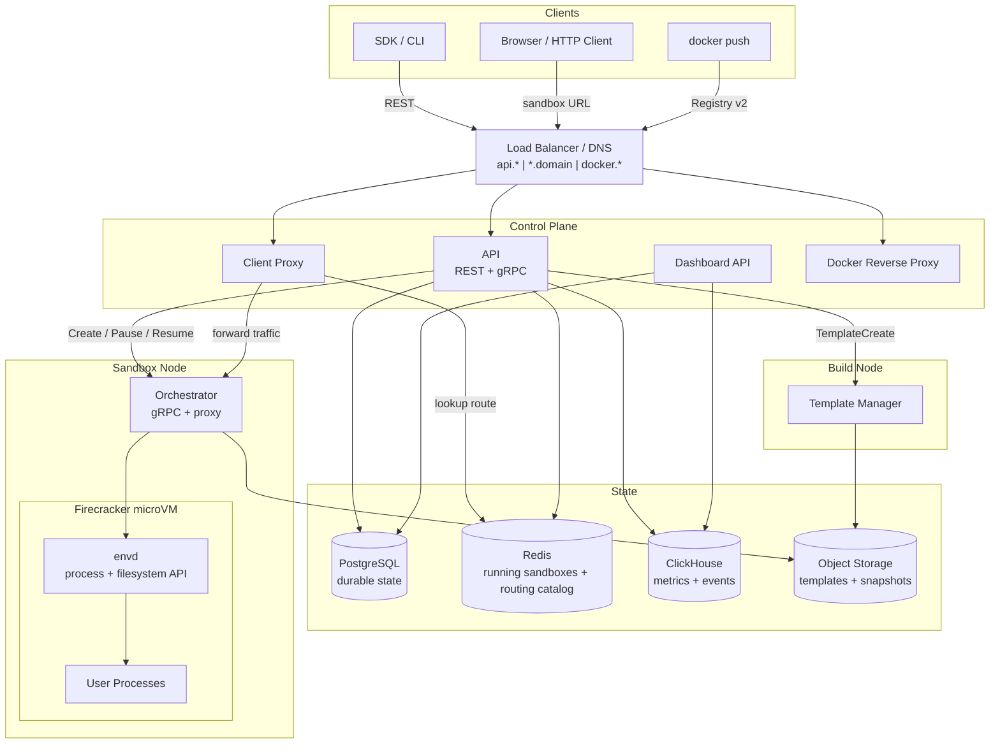
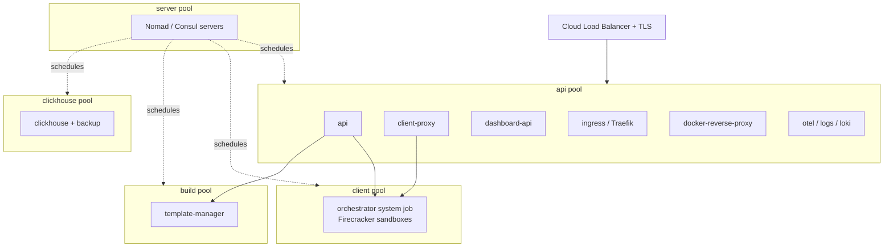
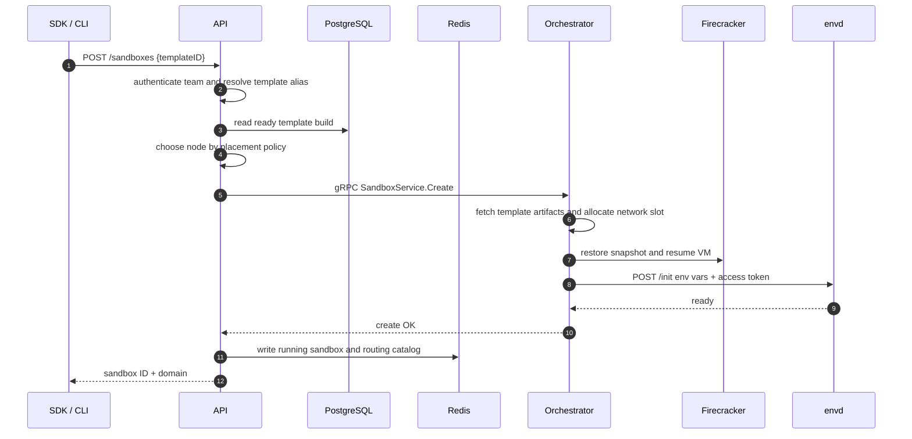
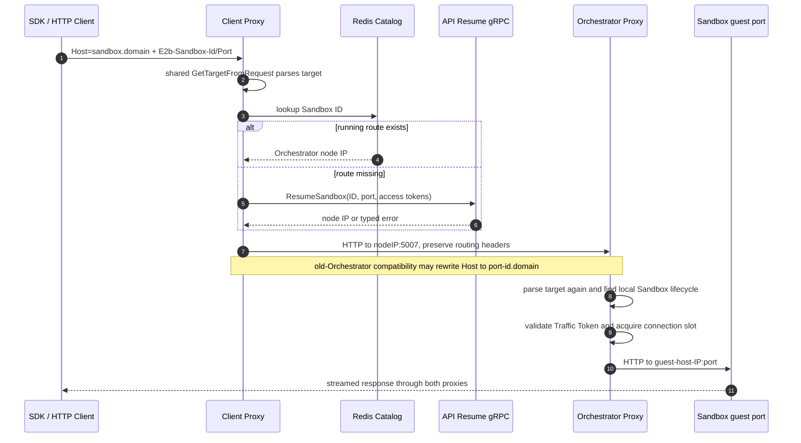
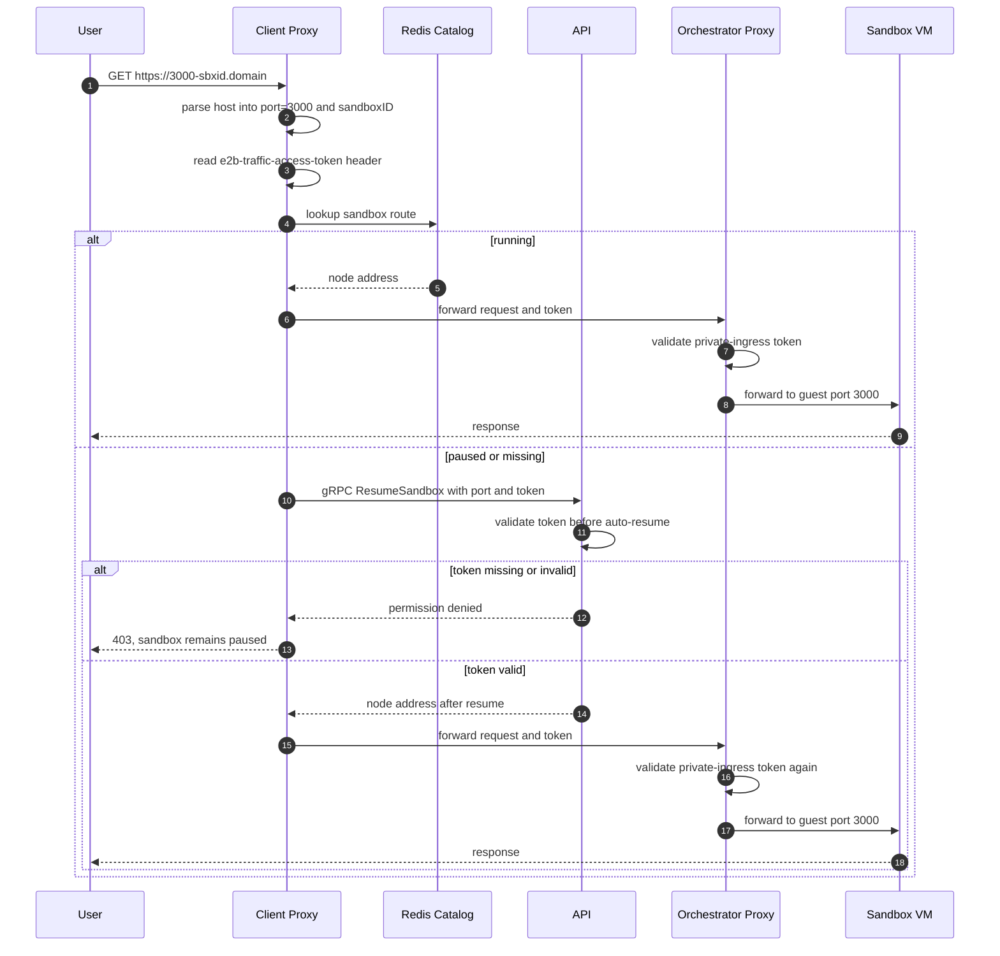
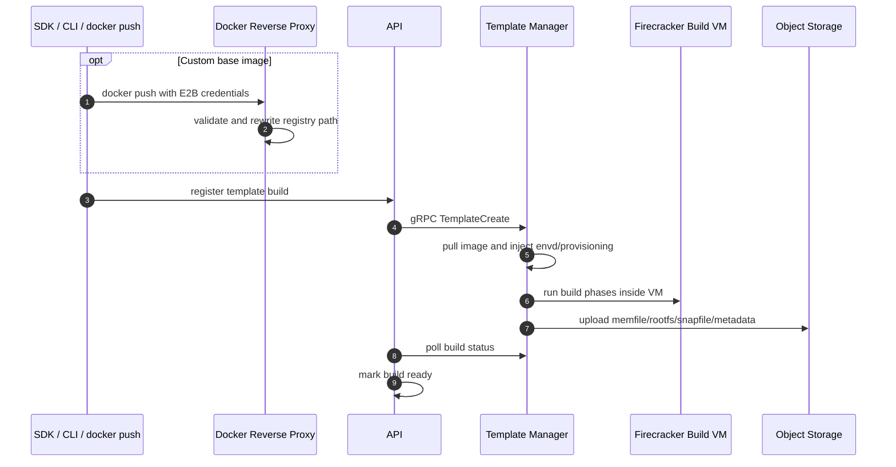
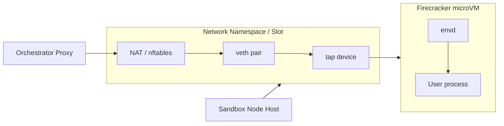
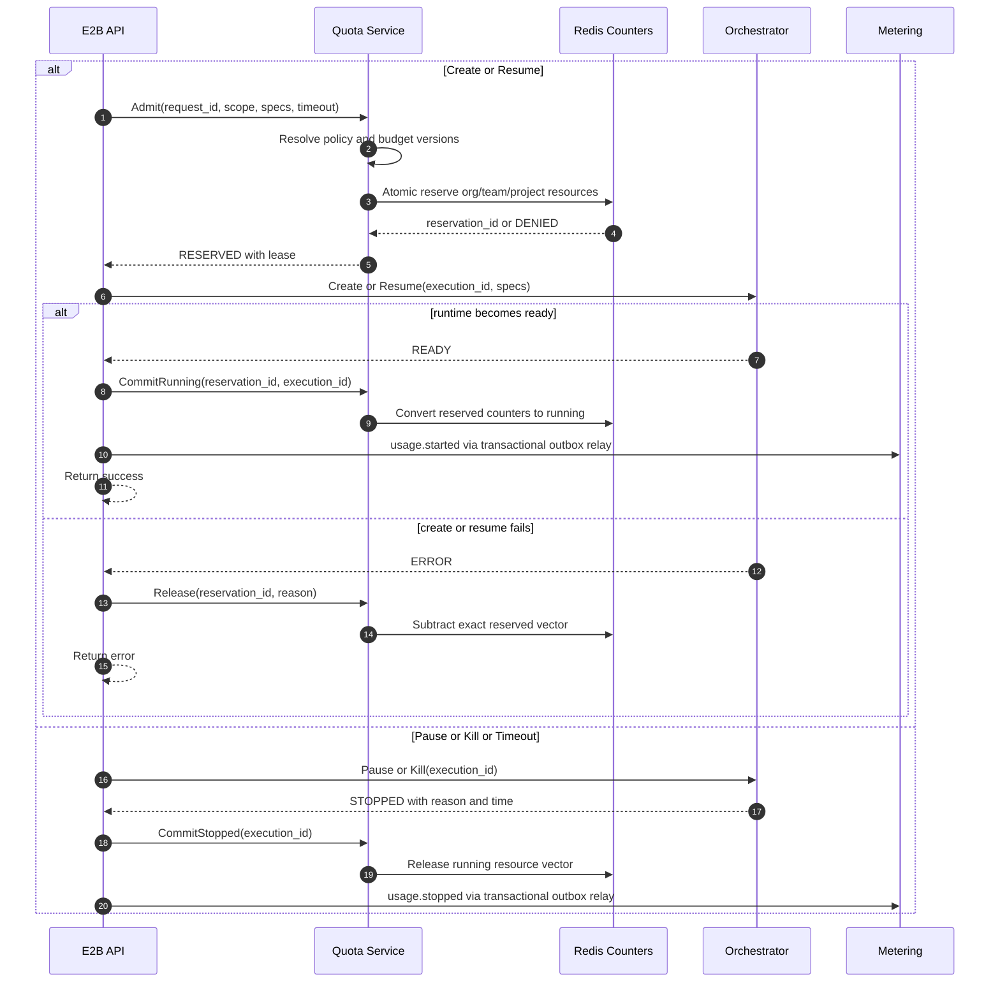

# E2B 深度技术文档

> **AI Sandbox、Firecracker microVM、Orchestrator、envd 与自托管架构解析**
>
> 基于 E2B 官方基础设施仓库整理：<https://github.com/e2b-dev/infra>
>
> 稳定版本基线：`2026.29@557445ffddda8d9a27f6f529a3f4d7732cf81a13`；SDK 未发布主线快照 `main@5a56c87e9db0e221b138662805af7743e75f1082`；Agent Sandbox 稳定对照 `v1.0.0@bb72f49d79f009a960eed2ae6c32e1cc082399c5`；审校日期：2026-09-06。正文中的 E2B 产品能力与支持状态仅以 E2B 官方仓库和官方文档为依据；SDK 主线与 Agent Sandbox 对照均不扩大 Infra 稳定兼容承诺。

---

## 目录

- [自动生成目录占位](#自动生成目录占位)

---

## 第一章：E2B 的定位

### 1.1 E2B 是什么

E2B 是面向 AI Agent、代码解释器和自动化执行任务的 **Sandbox 基础设施**。它提供的核心能力不是“运行一个普通容器”，而是快速创建一个隔离的 Linux 执行环境，让 LLM 生成的代码、脚本、文件操作和长时间任务可以在受控环境中运行。

一句话概括：

> **E2B 是一个以 Firecracker microVM 为隔离单元、以快照恢复为启动路径、以 API/SDK 暴露给 Agent 的云端 Sandbox 运行时平台。**

它的典型使用方式是：

| 使用者 | 入口 | E2B 提供的能力 |
|--------|------|----------------|
| AI Agent / Code Interpreter | SDK、CLI、REST API | 创建 sandbox、运行代码、读写文件、暴露端口 |
| 平台团队 | API、Dashboard、模板构建链路 | 统一管理模板、团队、密钥、配额、指标和日志 |
| 基础设施团队 | Terraform、Nomad、Orchestrator | 部署 Firecracker 运行节点、对象存储、路由、监控 |

### 1.2 E2B 解决什么问题

让 AI 自动执行代码时，普通容器或直接宿主机执行会遇到一组生产化问题：

| 问题 | 直接用容器/Pod 时的难点 | E2B 的处理方式 |
|------|------------------------|----------------|
| 隔离 | AI 生成代码不可完全信任，容器隔离边界有限 | 每个 sandbox 是独立 Firecracker microVM |
| 启动速度 | 完整 VM 冷启动慢，容器预热也难携带完整状态 | 从预启动模板快照恢复 |
| 状态保存 | 运行过程中的内存、文件系统、进程状态难持久化 | pause/checkpoint 生成增量快照 |
| 文件和进程 API | 需要给 SDK 暴露稳定的执行、文件、PTY、流式日志接口 | VM 内部运行 envd agent |
| 端口访问 | 用户进程随机监听端口，需要安全转发 | client-proxy + orchestrator proxy + sandbox URL |
| 多节点调度 | 节点容量、模板缓存、快照位置会影响启动延迟 | API 做节点发现、placement 和路由表维护 |
| 私有化 | 需要将数据、模板、网络、认证放入自有环境 | 官方支持 GCP/AWS Terraform，自托管需处理依赖取舍 |

### 1.3 E2B 不是什么

| 不是 | 说明 |
|------|------|
| 不是 Kubernetes 模型推理平台 | E2B 运行任意代码 sandbox，不负责模型推理调度，和 KServe/Dynamo/Mooncake 的定位不同 |
| 不是通用容器编排器 | E2B 自身用 Nomad 调度服务，但它对用户暴露的是 sandbox API，不是容器 API |
| 不是单个二进制服务 | 生产部署至少涉及 API、Orchestrator、Client Proxy、PostgreSQL、Redis、对象存储和负载均衡 |
| 不是纯 serverless 函数平台 | sandbox 可长时间运行、暂停、恢复、暴露端口并保留文件系统状态 |

### 1.4 与 Daytona、Jupyter、Kubernetes Job 的区别

| 系统 | 主要目标 | 隔离/运行单元 | 与 E2B 的差异 |
|------|----------|---------------|---------------|
| Daytona | 开发环境与 workspace 管理 | 容器/K8s/远程环境 | 更偏 IDE/workspace 生命周期，E2B 更偏 Agent runtime |
| Jupyter | 交互式 notebook | Kernel 进程 | Jupyter 不是强隔离 sandbox 基础设施 |
| Kubernetes Job | 批任务调度 | Pod | Pod 生命周期粗粒度，不提供 E2B 的模板快照、envd SDK API 和 sandbox URL |
| Firecracker 原生 | microVM 虚拟化 | microVM | Firecracker 只提供虚拟化底座，E2B 提供完整控制面、数据面和开发者 API |

---

## 第二章：总体架构

### 2.1 控制面与数据面

E2B 的架构最重要的边界是 **控制面** 和 **数据面** 分离：

| 平面 | 主要组件 | 职责 |
|------|----------|------|
| 控制面 | API、Dashboard API、PostgreSQL、Redis、ClickHouse、Nomad/Consul | 鉴权、模板与团队管理、sandbox 生命周期、节点选择、运行态记录、指标查询 |
| 数据面 | Orchestrator、Firecracker、envd、Client Proxy、Orchestrator Proxy | 创建 VM、恢复快照、网络转发、进程/文件 API、用户流量代理 |

API 决定 **sandbox 在哪里运行**，Orchestrator 决定 **sandbox 如何运行**。用户访问 sandbox 暴露端口时，流量不经过 API，而是从 Client Proxy 转到对应节点的 Orchestrator Proxy。



### 2.2 部署拓扑

官方自托管路径用 Terraform 部署到云上，并用 Nomad/Consul 组织服务。GCP 是官方主要路径，AWS 在官方文档中标为 Beta；Azure 和通用 Linux 机器不是官方完成状态。



生产上通常要分出三类节点：

| 节点池 | 运行内容 | 原因 |
|--------|----------|------|
| server pool | Nomad/Consul server | 调度和服务发现控制面需要稳定 quorum |
| api pool | API、Client Proxy、Dashboard API、Ingress、日志采集 | 承接外部流量和控制面请求 |
| client pool | Orchestrator、Firecracker sandbox | 需要 KVM、root 权限、网络 namespace、NBD、cgroup、本地模板缓存 |
| build pool | Template Manager | 模板构建使用同一个 orchestrator 二进制的不同角色，和 sandbox 运行节点隔离更安全 |
| clickhouse pool | ClickHouse | 指标/事件写入量和查询压力与控制面不同 |

### 2.3 仓库结构

官方 `e2b-dev/infra` 仓库不是一个单服务项目，而是一套完整基础设施代码：

| 路径 | 内容 |
|------|------|
| `packages/api` | 公共 REST API、sandbox 生命周期、模板、团队、配额、鉴权 |
| `packages/orchestrator` | Firecracker sandbox runtime、template-manager 角色、gRPC 服务 |
| `packages/envd` | VM 内部 agent，提供进程、文件、端口和健康检查能力 |
| `packages/client-proxy` | sandbox URL 到具体节点的边缘路由 |
| `packages/dashboard-api` | Web Dashboard 后端 |
| `packages/docker-reverse-proxy` | Docker Registry v2 认证与路径重写代理 |
| `packages/shared` | protobuf、存储客户端、feature flags、proxy 公共逻辑 |
| `packages/db` | PostgreSQL migration 和 sqlc queries |
| `packages/clickhouse` | ClickHouse schema、写入和查询客户端 |
| `spec` | OpenAPI 规格 |
| `iac` | Terraform、Nomad jobs、云 provider 模块 |
| `tests/integration` | 面向真实部署的集成测试 |

---

## 第三章：核心组件

### 3.1 API

API 是 E2B 控制面的入口。它面向 SDK/CLI/Dashboard，负责把“创建 sandbox”这样的外部请求转成节点选择、模板解析、gRPC 调用和状态写入。

| 维度 | 说明 |
|------|------|
| 主要职责 | sandbox create/list/kill/pause/resume/connect，模板和构建管理，team/API key/access token，quota，metrics/logs |
| 外部接口 | REST API，OpenAPI 源位于 `spec/openapi.yml` |
| 内部接口 | gRPC，用于 client-proxy auto-resume 等内部调用 |
| 关键状态 | PostgreSQL 存模板、团队、构建、快照等持久对象；Redis 存运行中 sandbox 和路由表 |
| 调度逻辑 | 通过 Nomad/Kubernetes/static 等发现来源拿到节点，再按容量和 feature flag 参数做 placement |

API 的一个关键设计是：它只在控制路径参与 sandbox 生命周期，不在用户流量路径中转发请求。因此 API 故障不应直接中断已经建立的 sandbox 端口流量，但会影响新建、暂停、恢复、列表和指标查询。

### 3.2 Orchestrator

Orchestrator 是每个 sandbox 节点上最关键的组件。它以 root 权限运行，直接操作 Firecracker、网络 namespace、tap/veth、NBD、cgroup、模板缓存和快照文件。

| 子系统 | 作用 |
|--------|------|
| Firecracker 管理 | 为每个 sandbox 启动一个 microVM，配置 machine、drive、network、MMDS、snapshot restore |
| lazy memory / UFFD | 恢复时不一次性加载全部内存，由 userfaultfd 在 page fault 时从 memfile 读取 |
| COW rootfs | 模板 rootfs 只读，sandbox 写入进入 per-sandbox copy-on-write cache |
| 网络 slot | 为 sandbox 分配 host-side IP、network namespace、tap/veth、NAT 和 egress firewall |
| Sandbox proxy | 接收 client-proxy 转发请求，检查 token，再转到 VM 内对应端口 |
| Template cache | 从对象存储、本地磁盘、NFS 或 peer 节点获取模板和 snapshot artifact |
| 指标与事件 | 写入 ClickHouse，导出 OTel metrics |

官方实现中 Orchestrator 和 Template Manager 使用同一个 Go 二进制，通过 `ORCHESTRATOR_SERVICES` 选择角色。生产上通常把两个角色放在不同节点池，避免端口、权限和资源争用。

### 3.3 Template Manager

Template Manager 负责把模板定义、Docker image、构建步骤和启动命令转成可快速恢复的 Firecracker snapshot。它不是简单地 `docker build` 一个镜像，而是会在构建过程中启动真实 VM，执行 provision/user/finalize/optimize 等阶段，并把最终产物上传到对象存储。

模板构建的产物通常包括：

| Artifact | 用途 |
|----------|------|
| `memfile` | 模板 VM 内存镜像 |
| `rootfs.ext4` | 模板根文件系统 |
| `snapfile` | Firecracker VM 状态 |
| `metadata.json` | 资源、版本、启动参数、envd 信息等元数据 |
| `.header` / diff index | 用于增量层、快照链和 lazy 读取 |

### 3.4 envd

envd 是每个 VM 内部启动的 agent。SDK 执行代码、读写文件、连接进程、上传下载文件，最终都需要通过 envd 或它暴露的协议进入 sandbox。

| 能力 | 说明 |
|------|------|
| Process API | 启动进程、列出进程、连接 stdout/stderr/stdin、PTY、signal |
| Filesystem API | stat、list、make、move、remove、watch、文件上传下载 |
| 初始化 | Orchestrator 在 VM boot/resume 后调用 `/init` 注入 env vars、access token 和元数据 |
| 认证 | envd 检查 `X-Access-Token`，token 由 Orchestrator 经 Firecracker MMDS 传递 |
| 端口发现 | 扫描 guest ports，使用户进程监听端口能通过 sandbox URL 访问 |

envd 的版本很重要。官方架构文档强调 envd 行为变化要更新版本，因为 API 和 Orchestrator 会根据模板构建中记录的 envd 版本做能力判断。

### 3.5 Client Proxy

Client Proxy 是 sandbox 对外流量的边缘入口。用户访问的域名通常形如：

```text
https://<port>-<sandboxID>.<domain>
```

Client Proxy 通常从 Host 中解析端口和 sandbox ID；在共享 `sandbox.<domain>`、`localhost` 或 IP Host 上，也可以从固定路由 Header 解析目标。随后它查 Redis routing catalog，找到 sandbox 所在 Orchestrator 节点，再把请求转发到该节点的 Orchestrator Proxy。如果 Redis 中找不到运行态记录，Client Proxy 可以通过 API 的 gRPC resume 能力触发自动恢复。两种寻址方式的优先级与安全边界见 4.2.1。

### 3.6 Dashboard API 与 Docker Reverse Proxy

Dashboard API 面向 Web 管理界面，不是 SDK 主路径。它读取 PostgreSQL 和 ClickHouse，用于 team、template、build、admin bootstrap 等管理场景。

Docker Reverse Proxy 是模板自定义镜像链路的一部分。用户用 E2B 凭证推送镜像时，它负责校验凭证、替换为真实 registry 凭据，并把路径改写到云侧 artifact registry。

---

## 第四章：Sandbox 生命周期

### 4.1 创建 Sandbox

创建 sandbox 不是冷启动一台新 VM，而是恢复一个预构建模板快照。这个设计是 E2B 启动速度的基础。



关键点：

| 阶段 | 关键行为 |
|------|----------|
| 模板解析 | API 将 template alias 解析为 ready build |
| 节点选择 | API 结合节点健康、容量、调度标签和 feature flag 选择 Orchestrator |
| 快照恢复 | Orchestrator 恢复 Firecracker snapshot，准备 lazy memfile 和 COW rootfs |
| envd 初始化 | Orchestrator 等待 VM 内 envd ready，并注入 token、metadata、环境变量 |
| 路由登记 | API 将 sandbox ID 到节点的映射写入 Redis，供 Client Proxy 查询 |

#### 4.1.1 2026.29 原生 Sandbox fork

Infra 2026.29 新增 `POST /sandboxes/{sandboxID}/fork`。它不是复制一条数据库记录：API 先把**运行中**的原 Sandbox 原地短暂停顿并做一次完整内存 checkpoint，再在原节点恢复原实例；随后所有 fork 从这一个不可变 snapshot 并行启动。原 Sandbox 保持自己的 ID、过期时间、execution ID 和并发 reservation，不会因 fork 被替换或延长。

请求体可选 `timeout` 与 `count`。`timeout` 是新 fork 的 TTL，默认 `15s` 且不能超过 Team 的最大运行时长；`count` 默认 `1`、范围 `1..100`，还必须小于 Team 的 Sandbox 并发上限。HTTP `201` 返回与请求数量相同的结果数组，每项恰好包含 `sandbox` 或 `error`，因此部分 fork 可以成功、部分因 reservation/placement/启动失败而失败；非 `201` 表示尚未开始任何 fork，不能把整个请求当作全有或全无事务。

| 边界 | 2026.29 行为 |
| --- | --- |
| 原实例状态 | 仅接受 running Sandbox；paused 返回 `409`，不存在、已结束或跨 Team 访问表现为 `404` |
| 快照 | 每次请求只捕获一次完整内存状态；envd 必须支持 snapshot，旧版本会在 fork 前返回 `400` |
| 并发与计量 | 原实例继续占一个槽；每个 fork 通过正常 `startSandbox` 路径独立申请槽，并得到新的 execution ID |
| 网络与卷 | 继承 snapshot 中的 egress/ingress、auto-resume、volume mounts 与 auto-pause 配置，不应假设 fork 自动放宽隔离 |
| 凭证 | secure fork 按新 Sandbox ID 重新生成 envd access token；private ingress 也按新 ID 生成自己的 Traffic Token，不能复用原实例 token |
| 失败恢复 | checkpoint 前失败不会创建 fork；单个 fork 启动失败只写入该结果项，调用方必须逐项处理和清理成功实例 |

### 4.2 访问 Sandbox 端口

用户进程在 VM 内监听端口后，外部访问路径如下：

`Sandbox.getHost(port)` 只负责把端口、Sandbox ID 和 sandbox domain 编码成可路由的主机名，不负责把凭证附加到请求上。非 debug 模式下，官方 TypeScript/Python SDK 的返回值是：

```text
<port>-<sandbox-id>.<sandbox-domain>
```

因此完整的 HTTPS 地址是：

```text
https://<port>-<sandbox-id>.<sandbox-domain>
```

例如 `sandbox.getHost(8080)` 返回 `8080-iabc123.sandbox.example.com`，调用方再组合为 `https://8080-iabc123.sandbox.example.com`。端口寻址和 ingress 鉴权是两件事，拿到 host 并不意味着请求已经通过鉴权。

#### 4.2.1 Host 与 Header 两种寻址方式

Infra 2026.29 的 Client Proxy 支持两种目标寻址形式，Header 路由是常规 Host 编码路由的补充，不是另一套鉴权协议：

| 寻址方式 | 请求 Host | 目标来源 | 典型用途 |
| --- | --- | --- | --- |
| Host 编码路由 | `<port>-<sandbox-id>.<domain>` | Host 最左侧子域名中的端口和 Sandbox ID | `Sandbox.getHost(port)` 暴露的业务端口、浏览器可直接打开的公开 ingress |
| Header 路由 | `sandbox.<domain>`、字面量 `localhost` 或任意 IPv4/IPv6 地址，可带监听端口 | `E2b-Sandbox-Id` 与 `E2b-Sandbox-Port` | SDK 的 envd 控制流量、稳定共享域名、本地调试、绕过 DNS 直接访问 Client Proxy IP |

共享解析函数的门控、优先级和失败行为如下：

1. 只有 Host 是字面量 `localhost`、任意 IP，或主机名以 `sandbox.` 开头且后面仍有域名时，才允许 Header 路由。并且至少出现一个非空路由 Header 后，代理才进入 Header 解析。
2. `E2b-Sandbox-Id` 和 `E2b-Sandbox-Port` 必须成对提供；只提供任意一个都会返回 HTTP `400`。Sandbox ID 只能包含小写字母和数字，端口必须能按十进制解析为 `uint64`，否则同样返回 `400`。
3. 常规 `<port>-<sandbox-id>.<domain>` Host 不允许 Header 覆盖目标。即使请求携带伪造或冲突的路由 Header，解析器也会忽略它们，以 Host 中的端口和 Sandbox ID 为准。
4. 允许 Header 路由的 Host 如果没有出现路由 Header，解析器仍会回退到 Host 解析；但 `sandbox.<domain>`、`localhost` 或纯 IP 本身没有编码目标，最终会以无效 Host 返回 `400`。

通过共享域名访问公开 Sandbox 业务端口时，可以显式提供目标：

```bash
curl --fail-with-body \
  -H "E2b-Sandbox-Id: <sandbox-id>" \
  -H "E2b-Sandbox-Port: 8080" \
  "https://sandbox.<domain>/healthz"
```

HTTP Header 名称大小写不敏感，但本文沿用源码中的规范拼写。**这一固定版本不支持 `X-Sandbox-ID` 和 `X-Sandbox-Port`，它们不是兼容别名。** 如果企业网关对外采用自定义 `X-*` 名称，必须在进入 Client Proxy 前显式重写为 `E2b-Sandbox-Id` 和 `E2b-Sandbox-Port`。

私有 ingress 还必须同时携带 Traffic Token；路由 Header 不是凭证，不提供认证或授权：

```bash
# TRAFFIC_ACCESS_TOKEN 由受信任的后端安全注入。
curl --fail-with-body \
  -H "E2b-Sandbox-Id: <sandbox-id>" \
  -H "E2b-Sandbox-Port: 8080" \
  -H "e2b-traffic-access-token: ${TRAFFIC_ACCESS_TOKEN}" \
  "https://sandbox.<domain>/healthz"
```

三组 Header 的职责必须分开理解：

| Header | 用途 | 校验位置 | 是否为凭证 |
| --- | --- | --- | --- |
| `E2b-Sandbox-Id`、`E2b-Sandbox-Port` | 选择 Sandbox 和 guest port | Client Proxy 与 Orchestrator Proxy 的共享目标解析器 | 否，属于用户可控路由元数据 |
| `e2b-traffic-access-token` | 访问 `allowPublicTraffic=false` 的业务 ingress | 运行态由 Orchestrator Proxy 校验，自动恢复前由 API 校验 | 是，Sandbox 级 bearer token |
| `X-Access-Token` | 访问 `secure=true` 的 envd 控制 API | envd | 是，envd 控制面 token |

固定 SDK 提交中的 TypeScript 与 Python 实现会在 Sandbox 初始化/连接时，为 SDK 自己发往 envd 的请求自动附加官方路由 Header；在受支持的托管域名上，envd URL 可以选择稳定的 `sandbox.<domain>` 共享 Host。这个行为只覆盖 SDK 构造的控制流量。面向用户业务端口的 `Sandbox.getHost(port)` 仍返回 `<port>-<sandbox-id>.<domain>`，调用方不会因为调用 `getHost()` 自动获得或附加路由 Header。

Client Proxy 和 Orchestrator Proxy 调用同一个目标解析函数。Client Proxy 的标准反向代理不会删除这两个端到端 Header，因此它们会随请求到达 Orchestrator Proxy 并被再次解析。边缘 LB、Ingress 或服务网格不得无意剥离它们；同时也不应把它们加入 secret 管理或当作可信身份，因为公网调用方可以自行构造。真正私有的业务端口仍必须由 `e2b-traffic-access-token` 保护。

##### Docker image 与 guest 应用的适配边界

Header 寻址协议终止在代理层，而不是容器或 microVM 内的业务进程：`E2b-Sandbox-Id`、`E2b-Sandbox-Port` 由 Client Proxy 和 Orchestrator Proxy 解析，Docker image 或 guest 应用不需要解析路由 Header，也不需要新增环境变量、启动参数或专用监听协议。`E2b-Sandbox-Port: 8080` 只告诉代理连接 guest 的 `8080` 端口；它不会启动 guest 服务、执行镜像命令或把未监听端口自动“开放”。镜像仍必须自行在所选端口实际运行一个可访问的服务。

端口与调用结果可以按下表判断：

| 请求与 guest 状态 | E2B 解析/转发结果 | 调用方通常看到的结果 |
| --- | --- | --- |
| 官方 Header 成对指定 `8080`，guest 的 `8080` 已有可达服务 | 两级代理解析目标并连接该端口 | 返回 guest 服务的响应 |
| 官方 Header 成对指定 `8080`，但 guest 的 `8080` 没有进程监听 | Header 寻址成功，但 Orchestrator Proxy 到 guest 的建连重试最终失败 | `502`；Header 不会替应用启动服务 |
| 对共享 Host 只发送 Agent Router 的 `X-Sandbox-ID`、`X-Sandbox-Port` | E2B 看不到官方路由 Header，回退解析不含目标的共享 Host | `400`；这不是 E2B 可用调用示例 |

监听地址也不是 Header 契约的一部分，**不绝对要求所有服务监听 `0.0.0.0`**。直接监听 guest 可达地址最简单，例如 `0.0.0.0`、`::` 或对应 guest 接口地址，Orchestrator Proxy 可以直接连接。只监听 `127.0.0.1`、`localhost` 或 `::1` 也受固定 E2B 运行时支持：envd 每 `1s` 扫描 loopback 上的 TCP listener，再启动 `socat` 将 guest 可达地址的同端口转发到 localhost。扫描周期之外还有 `socat` 启动时间，因此服务刚开始监听后的首次连接可能有短暂就绪延迟；Orchestrator→guest 的默认最多 5 次建连尝试和 `100/200/300/400ms` 线性退避正是为这条路径准备。依赖该机制的镜像必须保留正常运行的 envd 与 `socat`，若自定义运行时移除了它们，就应改为直接监听 guest 可达地址。

E2B 的 ReverseProxy 不主动剥离官方路由 Header，所以 guest 应用可能看到 `E2b-Sandbox-Id`、`E2b-Sandbox-Port`；应用必须把它们视为用户可控路由元数据，不得用于身份认证或授权。严格 Header allowlist、WAF、服务网格和日志系统可以显式治理这些字段：Header 路由入口在到达两级代理前必须放行官方名称，完成路由后则可按应用策略过滤或记录；无论保留还是过滤，这都属于应用与网关治理，不是 Docker image 对路由协议的适配。

##### 两级代理中的实际执行路径

这里的“E2B Router”是逻辑概念，Infra 2026.29 没有名为 Router 的独立服务；路由由 Client Proxy 与每个节点上的 Orchestrator Proxy 两级完成：



Client Proxy 解析目标后不会直接连接 guest。它先用 Sandbox ID 查询 Redis catalog；命中后得到 Orchestrator 节点 IP，未命中则可携带 Traffic Token 与 envd token 调用 API 的 `ResumeSandbox`。节点目标固定为 `http://<orchestrator-ip>:5007`。Orchestrator Proxy 再次解析同一请求，从本地 Sandbox map 中取得当前 lifecycle、guest host IP 和网络 ingress 配置，最后连接 `http://<guest-host-ip>:<port>`。

共享 Host 还有一层滚动升级兼容逻辑：当请求使用 `sandbox.<domain>`，但 `orch-accepts-combined-host` feature flag 表示下游 Orchestrator 尚不能接受共享 Host 时，Client Proxy 会把发往节点的 Host 改写为 `<port>-<sandbox-id>.<domain>`，并在 `X-Forwarded-Host` 保存原始共享 Host。这样旧 Orchestrator 可以走 Host 编码解析；支持共享 Host 后则保留原 Host 和路由 Header。该逻辑用于新旧代理版本共存，不等于允许外部 Header 覆盖普通编码 Host。

##### HTTP、WebSocket 与 Header 处理

两级代理共用 Go `httputil.ReverseProxy`。Agent Sandbox 的旧 Python Router 才分别实现 FastAPI HTTP endpoint 和专用 WebSocket relay；新快照中的顶层 Go Router 也改用 `httputil.ReverseProxy`，但它仍有不同的 Header、目标发现和鉴权契约：

| 行为 | Infra 2026.29 实现 | 运维含义 |
| --- | --- | --- |
| HTTP body/response | 交给标准 ReverseProxy 转发和流式复制，不先在 E2B 业务代码中完整缓冲 | 文件上传、流式响应和长请求仍受最外层 LB、客户端与 guest 应用限制 |
| WebSocket/协议升级 | 没有独立的 E2B WebSocket handler，使用 ReverseProxy 的通用 HTTP upgrade 路径 | 不存在 Agent Router 的独立 `1008/1009/1011` relay 状态机；必须让每一层 LB 支持 upgrade |
| hop-by-hop Header | 由 Go ReverseProxy 按 HTTP 代理规则处理 | 不应依赖 `Connection`、`Upgrade` 等逐跳字段被当作普通业务 Header 传递 |
| 路由与 token Header | E2B 代码没有在转发前删除 `E2b-Sandbox-*`、`e2b-traffic-access-token` 或 `X-Access-Token` | 路由 Header 必须到达第二级代理；guest 应用和日志系统也不能把它们当作可信用户身份，token 必须脱敏 |
| 普通业务 Header | 默认随请求转发；固定测试验证自定义 `E2b-Testing` Header 可到达后端 | 与 Agent Router 主动剥离 `Authorization` 和所有 `X-Sandbox-*` 的策略不同 |
| Host | 默认保留入站 Host；启用 `maskRequestHost` 时改写为配置值，并用 `X-Forwarded-Host` 保存原 Host；`${PORT}` 会替换成目标端口 | 需要保留应用原始 Host 时不要误启用 mask；需要绕过 guest source-host 检查时可按端口改写 |
| Forwarded 链 | E2B Rewrite 明确不调用 `SetXForwarded()`，只在 Host mask 时设置 `X-Forwarded-Host` | 固定版本没有 Agent Router 的 `TRUSTED_PROXY_CIDRS` 与按真实客户端 IP 限流逻辑 |

因此，不能把 Agent Sandbox Router 的 Header 过滤策略直接推断为 E2B 行为。尤其是 `Authorization` 在 E2B 中不是 Router 专用 Bearer Token，固定代理代码也没有主动删除它；业务应用如使用该 Header，应在端到端入口、日志和 guest 应用之间统一定义责任。路由 Header 本身仍不是认证凭证。

##### 连接池、超时、重试与限流

E2B 的代理参数是固定源码常量和 feature flag 组合，不支持 Agent Router 的请求级 `X-Sandbox-Timeout`：

| 机制 | Client Proxy → Orchestrator Proxy | Orchestrator Proxy → guest |
| --- | --- | --- |
| 上游 idle connection timeout | `610s` | `620s` |
| 下游 HTTP server idle timeout | `620s`，比上游多 `10s` | `630s`，比上游多 `10s` |
| 活跃请求读写 deadline | `ReadTimeout=0`、`WriteTimeout=0`、`ResponseHeaderTimeout=0` | 相同；这些 `0` 表示代理自身不设置对应 deadline，不代表外层 LB 没有超时 |
| TCP 建连 | `30s` dial timeout、`20s` TCP keepalive | 相同 |
| 建连尝试 | `1` 次，由 Orchestrator 层处理 guest 端口转发延迟 | 最多 `5` 次，失败间隔线性退避 `100/200/300/400ms` |
| HTTP keep-alive | 开启并复用节点连接 | 关闭；guest 服务可能重启，且同宿主机重连成本较低 |
| 连接池隔离键 | 所有节点路由共用 `client-proxy` key | 使用每次 Sandbox lifecycle 的唯一 ID，避免网络 slot/IP:port 复用后串到旧连接 |
| 入站并发限制 | 未配置共享 handler 限流器 | `sandbox-max-incoming-connections` 按 Sandbox lifecycle 计数；默认 `-1` 不限，`0` 全部阻断，超限返回 `429` |

这里的 `610s/620s` 是空闲连接参数，不是一次业务请求的最大执行时间。固定版本没有 `E2b-Sandbox-Timeout`、`X-Sandbox-Timeout` 或其他调用方可控的 Router deadline Header。长任务和 WebSocket 的有效生命周期还取决于 GCP/自建 LB、Ingress、客户端 timeout、guest server timeout 和 Sandbox 生命周期。Sandbox 被释放时，Orchestrator 会按 lifecycle 清理连接限流计数，并在生命周期终止路径关闭对应代理连接池，防止新 Sandbox 复用旧 socket。

Orchestrator Proxy 的限流也不同于 Agent Router：它限制的是某个 Sandbox lifecycle 的全部入站代理连接，不读取 `X-Forwarded-For`，也不按客户端 IP 分桶。需要租户或客户端维度限流时，应放在可信的边缘网关，并继续把 Sandbox 级限制作为 guest 保护层。

##### 错误映射与 Agent Sandbox Router 对照

共享 handler 会把路由和生命周期错误转换为稳定的 HTTP 结果：

| 场景 | HTTP 状态 |
| --- | --- |
| Header 缺字段、Host 无效、Sandbox ID/Port 非法 | `400` |
| 私有 ingress token 缺失/错误，或自动恢复凭证不足 | `403` |
| Sandbox 正在 pause/resume 等状态转换 | `409` |
| Sandbox 并发连接超限或恢复触发资源上限 | `429` |
| catalog/目标 Sandbox 不存在、guest port 未开放、上游连接失败 | `502` |
| 未分类的路由内部错误 | `500` |

参考 Agent Sandbox Router 时，应只借鉴“静态入口 + Header 选择动态目标”的架构思想，HTTP 契约仍以 E2B 固定源码为准。对照材料升级为 Agent Sandbox 稳定版 `v1.0.0@bb72f49d79f009a960eed2ae6c32e1cc082399c5`；该 annotated tag 的 tag object 是 `317ccfdc84eec781eca3fcc45e699c54b8607d5e`，正文链接使用 peeled source commit。v1.0.0 保留 legacy Python Router，并正式发布顶层 Go Router；后者默认 `allow-all`，可选 TokenReview 或把 `(namespace, name, exp)` 绑定到 HMAC-SHA256 token 的 `scoped-token`。这些都不是 E2B Infra 2026.29 的能力：

| 维度 | E2B Infra 2026.29 | Agent Sandbox v1.0.0 Go Router（对照，不是 E2B 能力） |
| --- | --- | --- |
| 路由组件 | Client Proxy + Orchestrator Proxy 两级 | Kubernetes 中央 Router Deployment |
| 路由 Header | `E2b-Sandbox-Id`、`E2b-Sandbox-Port` | `X-Sandbox-ID`、Namespace、Port、Pod-IP、Timeout |
| 目标发现 | Redis catalog → Orchestrator local map → guest IP | Kubernetes Service DNS 或 Pod IP |
| Router 认证 | 路由元数据与 Traffic/envd token 分离 | 默认 allow-all；可选 TokenReview 或绑定目标 identity 的 scoped-token |
| Header 策略 | 路由 Header 跨两级代理保留；没有 Agent 风格 allow/deny list | Go Router 消费 Host/Authorization，并在 scoped-token 模式拒绝 Pod-IP/UID override |
| WebSocket | 标准 Go ReverseProxy upgrade | Go ReverseProxy upgrade；旧 Python Router 才使用专用双向 relay |
| 限流/观测 | Sandbox lifecycle 入站连接数 | Router request/latency/upstream/authz 指标，不等同于 E2B lifecycle connection limit |

Agent Sandbox Router 的 `X-Sandbox-Port` 在 Pod 外由中央 Router 解析为目标端口；旧 Python 实现会剥离路由 Header，新 Go 实现则明确删除 `Authorization`、改写 Host 并消费目标 Header。两者都不要求进入 Pod 的容器镜像解析 `X-Sandbox-Port`。这是 Agent Router 自己的容器侧行为，不应反推 E2B guest 也收不到其官方 Header。

新对照快照还修复了旧 Python Router 的 raw escaped path 保真：它优先从 ASGI `scope.raw_path` 和 `query_string` 构造上游 URL，使 `%2E` / `%2E%2E` 不会在代理跳转前被 URL 对象解码、规范化为 `.` / `..`；非 ASCII raw bytes 才回退到已解析 URL。该修复同时用于 HTTP 与 WebSocket，但只属于 Agent Sandbox 的旧 Python Router。E2B Infra 2026.29 使用 Go ReverseProxy 和自己的目标解析链，本文不据此推断或改写 E2B 的 path normalization 契约。

Agent Sandbox v1.0.0 还把 browser path-based routing、session-cookie bootstrap、SameSite 与 Origin 校验纳入 Go Router：启用 `--path-routing-prefix` 后可用 `<prefix>/<namespace>/<id>/<port>/...` 服务浏览器、iframe 与 WebSocket；cookie auth 必须配置允许的 Origin，只有在可信 TLS 终止代理之后才考虑 `--authz-trust-forwarded-proto`。这套 URL、cookie 与 CSWSH 防护是 Agent Sandbox Router 的协议，不是 E2B 的 `getHost()`、Traffic Token 或路由 Header。

#### Agent Sandbox v1.0.0 API 与迁移边界

Agent Sandbox 的 core `agents.x-k8s.io` 与 extension `extensions.agents.x-k8s.io` CRD 在 v1.0.0 只 serve `v1beta1`，`v1alpha1` 和 conversion webhook 基础设施均被移除。该变化减少 informer cache sync 和写入时的 conversion round-trip，也消除了证书轮换或私有集群防火墙导致的 conversion webhook 故障，但这是一次需要存储迁移的 breaking change：

1. `< v0.5.0` 不能直接升到 v1.0.0；先升级到 `v0.5.2+`，按 v0.5.x 指南把所有已存对象重写为 `v1beta1` 并清除 `v1alpha1` stored version。
2. 升级前逐一确认 `sandboxes.agents.x-k8s.io`、`sandboxclaims.extensions.agents.x-k8s.io`、`sandboxtemplates.extensions.agents.x-k8s.io`、`sandboxwarmpools.extensions.agents.x-k8s.io` 的 `status.storedVersions` 只剩 `v1beta1`；否则 API Server 会拒绝 v1.0.0 CRD。
3. Helm 不会自动升级 `crds/`，必须先 `kubectl apply -f helm/crds/`，再执行 `helm upgrade`。反过来会先删除 webhook Service，而旧 CRD 仍引用 conversion webhook。
4. 升级后清理 namespaced webhook Service、cert Secret、Role 与 RoleBinding；同名 cluster-scoped `ClusterRole`/`ClusterRoleBinding` 仍被 controller 使用，不得删除。OLM 和 Helm 自动清理的对象不同，统一脚本也必须带 namespace 和精确资源类型。

v1.0.0 的 SDK/runtime 对照同时增加 opt-in `sandboxd`（REST filesystem `:8080`、gRPC ProcessService `:9090`）、Go `Files.WriteReader`/`Sandbox.WriteReader` streaming upload、claim 环境变量注入和 Python 非幂等 `/execute` POST 不重试。`FileEntry` schema 也发生 breaking change：Go `ModTime` 改为 `time.Time` 并增加 `Mode`，Python `mod_time` 改名为 `modified: datetime` 并增加 `mode`。这些 SDK、CRD、Router 和 runtime 能力都属于 Agent Sandbox，不属于 E2B。

此前主线观察到的 WarmPool status、ServiceMonitor、PodScheduled image、Pi 示例和 Podman kind 支持已包含在 v1.0.0 对照源码中。v1.0.0 还去掉 controller 对新 Sandbox 写入 `agents.x-k8s.io/pod-name` annotation 的动作；外部脚本应改读 `.metadata.name`，旧对象上的 annotation 只作过渡读取。官方基准称此项减少额外 reconcile/PATCH，但这个性能数据及其 CRD 行为都不能回填成 E2B Infra `2026.29` 的能力。

`X-Sandbox-Port` 不是 E2B 的兼容 Header。E2B 固定版本不支持 `X-Sandbox-Namespace`、`X-Sandbox-Pod-IP`、`X-Sandbox-Timeout`，也没有 `TRUSTED_PROXY_CIDRS` 或 Router Bearer Token。企业网关若对外暴露 `X-Sandbox-ID`、`X-Sandbox-Port`，必须在请求进入 Client Proxy 前成对转换为 `E2b-Sandbox-Id`、`E2b-Sandbox-Port`，并在可信边界内完成目标授权；不能把其他自定义 Header 原样映射成未经授权的内部寻址能力。

共享域名可以减少 SDK 控制流量或自定义服务端客户端对高基数通配子域名的依赖，但不会自动替代所有 `getHost()` 业务 URL。部署仍需让 `sandbox.<domain>` 的 DNS、TLS、负载均衡和 Client Proxy 路由同时生效；若继续暴露编码 Host，还要保留对应的 wildcard DNS 与证书。官方 GCP IaC 中的 Cloud Armor 会识别小写形式 `e2b-sandbox-id`、`e2b-sandbox-port`，但对应规则是 `preview=true` 的观测/限流规则，不是认证策略，也不能替代 Traffic Token。

#### 4.2.2 Public 与 Private ingress

Infra 2026.29 的 `network.allowPublicTraffic` 默认值是 `true`。未设置或显式设为 `true` 时，业务端口（非 envd 控制端口）可以匿名访问；显式设为 `false` 时，创建响应会返回 `trafficAccessToken`，每次业务端口请求都必须在 `e2b-traffic-access-token` header 中携带它。

| 创建参数 | `trafficAccessToken` | 业务端口请求 | 说明 |
| --- | --- | --- | --- |
| 未设置或 `allowPublicTraffic=true` | 通常为 `null`/未定义 | 不需要 Traffic Token | host 仍然只负责寻址 |
| `allowPublicTraffic=false` | 返回 Sandbox 级 bearer token | 必须发送 `e2b-traffic-access-token` | 缺失或错误均返回 `403` |

私有 ingress 不能只设置 `allowPublicTraffic=false`：Infra 2026.29 还要求创建请求启用 `secure=true`，否则 API 会拒绝创建，因为 envd 控制面必须有独立的 `envdAccessToken`。这两个开关保护不同路径，不能互相替代。

下面的示例使用官方 SDK 当前实现说明调用形态；SDK 示例提交固定为 `e2b-dev/e2b@5a56c87e9db0e221b138662805af7743e75f1082`，不改变本文的 Infra 稳定基线。

```typescript
import { Sandbox } from "e2b"

const sandbox = await Sandbox.create({
  secure: true,
  network: { allowPublicTraffic: false },
})
await sandbox.commands.run("python3 -m http.server 8080", { background: true })

const trafficToken = sandbox.trafficAccessToken
if (!trafficToken) throw new Error("private sandbox did not return traffic token")

const url = `https://${sandbox.getHost(8080)}`
const response = await fetch(url, {
  headers: { "e2b-traffic-access-token": trafficToken },
})
console.log(response.status)
```

该 SDK 快照的 Python 实现已把 REST API、envd RPC 和 envd HTTP API 逐步迁到 pyqwest transport，并按 proxy/streaming 维度复用线程安全连接池；同步 Sandbox 也只创建一个普通 envd HTTP client，交给 Filesystem、Commands 和 Pty 共用，流式下载另用带 60 秒 idle-read bound 的 sibling client。这是客户端连接与 transport 重构，不改变上面 `getHost()`、共享 envd URL、官方路由 Header、Traffic Token 或 Infra 端代理契约。

SDK 的 MCP 创建流程也增加了补偿边界：远端 Sandbox 已创建但 `mcp-gateway` 启动失败时，JavaScript 和 Python SDK 会 best-effort `kill()` 已分配实例，再抛出带 stderr 的 `SandboxError` / `SandboxException`；异步 Python 不吞掉 cleanup 中的 `CancelledError`。这避免调用者拿不到 Sandbox 对象时留下运行中实例，但它是 SDK 主线行为，不代表 Infra 2026.29 新增了控制面事务或原子创建语义。

审校时的 SDK `main@5a56c87e9db0e221b138662805af7743e75f1082` 还包含一组与云端身份和网络回调有关的未发布能力：Sandbox 可声明 IAM workload identity，TypeScript `Secret` 暴露 `iamToken`，Python 对应属性为 `iam_token`；network transform callback 会收到 token placeholder，供受信任的网络变换器在发送请求时填充，而不是把长期凭据写进 Sandbox URL。SDK 同时对 token name 做格式校验，非法名称在客户端被拒绝。Python SDK 的 `http2` transport 参数允许调用方显式选择 HTTP/2，但服务端是否支持仍由 Infra 部署和入口代理决定。

这些 IAM、`Secret.iamToken`/`iam_token`、callback token placeholder、token name validation 与 `http2` 变化都只属于未发布 SDK 主线；它们不扩大 E2B Infra `2026.29` 的稳定兼容承诺，也不意味着现有自托管 API 已经提供同名字段。

```python
import httpx
from e2b import Sandbox

sandbox = Sandbox.create(
    secure=True,
    network={"allow_public_traffic": False},
)
sandbox.commands.run("python3 -m http.server 8080", background=True)

traffic_token = sandbox.traffic_access_token
if traffic_token is None:
    raise RuntimeError("private sandbox did not return traffic token")

url = f"https://{sandbox.get_host(8080)}"
response = httpx.get(
    url,
    headers={"e2b-traffic-access-token": traffic_token},
)
print(response.status_code)
```

不使用 SDK 时，token 应由受信任的后端从创建响应中读取并注入进程环境，而不是写到 URL query：

```bash
# TRAFFIC_ACCESS_TOKEN 由后端安全注入；不要把 token 放进 URL。
export TRAFFIC_ACCESS_TOKEN
curl --fail-with-body \
  -H "e2b-traffic-access-token: ${TRAFFIC_ACCESS_TOKEN}" \
  "https://8080-<sandbox-id>.<sandbox-domain>/healthz"
```



这条路径解释了为什么 Redis routing catalog 很关键：它是 Client Proxy 找到 sandbox 所在节点的快速路径。多节点部署如果没有共享 Redis，只能退回单节点或内存模式，无法可靠支撑跨节点路由。对于运行中的 sandbox，Orchestrator Proxy 在转发到 guest port 前校验 token；对于暂停或路由缺失的 sandbox，API 的 `ResumeSandbox` 会先校验 token，只有校验通过才允许自动恢复。缺失/错误 token 不会因为触发了 auto-resume 而绕过鉴权。

#### 4.2.3 浏览器、WebSocket 与 BFF

浏览器地址栏、`iframe`、`img` 和原生浏览器 `WebSocket` 构造器不能为请求附加任意 `e2b-traffic-access-token` header。浏览器 `fetch` 虽然可以设置该 header，但跨域时会触发 CORS 预检；预检请求本身不携带 Traffic Token，而 Infra 2026.29 的 Orchestrator Proxy 会在业务应用之前校验所有非 envd 请求，所以预检可能直接得到 `403`。不能假设只配置 Sandbox 应用的 CORS 就能解决。Node.js、Python 或其他服务端 HTTP/WebSocket 客户端可以显式发送 header。

推荐让后端/BFF 保存短生命周期的访问上下文并代为访问 E2B，再向浏览器返回经过业务鉴权和响应过滤的数据或建立受控 WebSocket 转发。不要把 Traffic Token 放到 query、fragment、前端 bundle、localStorage 或长期 cookie 中；它是 Sandbox 级 bearer credential，没有用户级 RBAC、scope 或逐端口权限，泄露后可访问该 Sandbox 允许的所有业务端口。

### 4.3 暂停、恢复与 Checkpoint

暂停时，API 先记录 snapshot，再请求 Orchestrator 对 VM 做 pause。Orchestrator 会冻结 VM、导出内存和 rootfs 的增量变化、保留本地缓存，并异步上传到对象存储。

恢复时，系统尽量优先选择原节点。如果 snapshot 仍在原节点本地缓存，恢复就可以避免大量对象存储读取。Checkpoint 可以理解为“保存当前状态但继续运行”，用于把运行中的 sandbox 状态持久化。

| 操作 | 效果 | 对 Redis 路由表的影响 |
|------|------|----------------------|
| Create | 从模板快照创建运行态 sandbox | 写入 running sandbox 和 route |
| Pause | 生成 snapshot，释放运行态资源 | 移除或更新运行态 route |
| Resume | 从 snapshot 恢复到某个节点 | 写回 route |
| Checkpoint | 保存状态并继续运行 | route 保持可用 |
| Kill/Delete | 终止 VM，清理运行态资源 | 删除 route |

### 4.4 为什么快

E2B 的启动速度来自多个层次叠加：

| 技术 | 作用 |
|------|------|
| 预启动模板快照 | 创建 sandbox 等价于恢复已有 VM 状态，而不是从零启动 Linux |
| lazy memory / userfaultfd | 内存页按需读取，避免恢复时一次性读完整 memfile |
| COW rootfs | 模板只读共享，sandbox 只保存写入差异 |
| 本地模板缓存 | 常用模板留在节点磁盘，减少对象存储读取 |
| optimize phase | 构建阶段记录恢复热页，后续可以预取 |
| origin node 优先 | paused sandbox 恢复时优先使用原节点本地 snapshot |

---

## 第五章：模板构建链路

### 5.1 构建流程

模板是 E2B 的关键资产。没有模板，sandbox 每次都要冷启动、安装依赖、初始化环境；有了模板，就可以直接恢复到预热后的状态。



### 5.2 分层构建

官方 Orchestrator 的模板构建是分阶段、可缓存的。典型阶段包括 base、user steps、finalize 和 optimize。每个未命中缓存的阶段都会在真实 Firecracker VM 中执行，然后把 pause diff 作为下一层。

这种设计有两个价值：

| 价值 | 说明 |
|------|------|
| 构建可复用 | 只有 recipe 中变化的步骤需要重新执行 |
| 运行更接近真实环境 | 构建阶段就在 VM 中完成，不只是容器文件系统转换 |
| 启动更快 | optimize 阶段能记录恢复时的热页信息 |

### 5.3 私有化时要关注的模板存储

对象存储是模板和 snapshot 的事实存储。官方云路径使用 GCS 或 S3；私有化时常见替代包括 S3 兼容存储、MinIO 或本地/NFS 目录。

| 方案 | 适合场景 | 风险 |
|------|----------|------|
| GCS/S3 | 官方 Terraform 云部署 | 依赖云账号、权限、跨区域成本 |
| S3 兼容存储/MinIO | 私有化、内网对象存储 | 需要验证 SDK 兼容性、TLS、权限和大文件吞吐 |
| NFS/本地目录 | 小规模或单机验证 | 多节点一致性、性能、故障恢复能力弱 |

模板构建和 sandbox 恢复都强依赖 artifact 可读性。生产部署前应至少验证：基础模板构建、sandbox 创建、pause、resume、跨节点恢复、对象存储故障恢复。

---

## 第六章：数据与状态模型

### 6.1 PostgreSQL

PostgreSQL 是持久控制面状态的核心数据库。典型数据包括：

| 数据 | 说明 |
|------|------|
| teams / users / tiers | 团队、用户、配额和计费层级 |
| envs / env_builds / aliases | 模板、构建记录、别名和版本 |
| snapshots | paused sandbox 和 checkpoint 记录 |
| team_api_keys / access_tokens | API key 和访问 token |
| volumes | 持久卷元数据 |
| clusters | 多集群/部署集群信息 |

PostgreSQL 没有实际替代方案。生产私有化可以选择自建 HA PostgreSQL、云数据库或企业内部数据库服务，但必须保证 migration、连接池、备份恢复和时钟一致性。

### 6.2 Redis

Redis 存的是运行态和快速查询数据。对多节点 E2B 来说，它是必需组件。

| 数据 | 作用 |
|------|------|
| Running sandbox store | 当前运行中的 sandbox 状态 |
| Routing catalog | sandbox ID 到 Orchestrator 节点的映射 |
| Team/template/snapshot cache | 控制面缓存，降低数据库压力 |
| Rate limiting | API 或团队级限流 |
| P2P chunk registry | 节点之间共享模板 chunk 信息 |

官方 release 的服务配置和源码把 Redis 用于运行态 catalog、路由和缓存。生产多节点部署应提供所有 API/Proxy 实例都能访问的共享 Redis，并按该 release 实际使用的客户端模式配置普通、Cluster 或其他高可用入口；官方自托管配置未声明支持的连接模式不能仅凭 Redis 服务端能力推定可用。

### 6.3 ClickHouse 与 Loki

ClickHouse 用于 metrics、sandbox events、host stats 等时序/分析数据。API 和 Dashboard API 会读取它来展示团队或 sandbox 指标。没有 ClickHouse 时，核心 sandbox 生命周期可以降级运行，但指标能力会缺失或变成 no-op。

Loki 用于日志聚合。它不是创建 sandbox 的硬依赖，但没有日志系统时，用户和运维排障会明显变难。

### 6.4 Object Storage

对象存储保存模板和 snapshot artifact，是运行时恢复和暂停恢复的关键依赖。典型 key 形态围绕 build ID 或 snapshot build ID 组织，包含内存、rootfs、snapfile、metadata 和索引文件。

| 风险点 | 影响 |
|--------|------|
| 对象存储延迟高 | sandbox 创建和恢复变慢 |
| artifact 丢失 | 模板或 snapshot 无法恢复 |
| 权限不一致 | 构建能上传但运行节点无法读取 |
| 跨区域访问 | 成本和启动延迟上升 |

### 6.5 Consul 与网络 slot

在官方 Nomad/Consul 部署中，Consul 不只是服务发现组件，还可用于网络 slot 分配的协调。Orchestrator 需要为 sandbox 分配不冲突的 IP、namespace 和转发表项。单节点可以使用本地 namespace storage；多节点如果不用 Consul，需要替代的分布式锁或每节点独立 IP 池规划。

---

## 第七章：网络、安全与隔离

### 7.1 隔离模型

E2B 的隔离边界主要由 Firecracker microVM 提供。每个 sandbox 有自己的 VM、kernel 视角、rootfs overlay、network namespace、cgroup 和访问 token。



这种模型比“在宿主机上跑子进程”安全得多，也比普通容器更适合执行不可信代码。但它不是绝对安全边界：宿主机内核、KVM、Firecracker、网络策略、对象存储权限、token 管理仍然需要按生产标准维护。

### 7.2 访问控制

E2B 中有多层 token 和凭证：

| 层级 | 作用 |
|------|------|
| Team API Key | SDK/CLI 调用 E2B API |
| API access token / OAuth credential | 控制面 API 或内部 gRPC 的调用身份，具体 scope 由 API 配置决定 |
| `envdAccessToken` | `secure=true` 时由 API/Orchestrator 注入 VM，访问 envd 控制面时通过 `X-Access-Token` 校验 |
| `trafficAccessToken` | `allowPublicTraffic=false` 时由 Orchestrator Proxy 校验 Sandbox 业务端口访问 |
| Volume token | 访问持久卷或相关资源 |
| Registry credential | Docker Reverse Proxy 推送模板镜像时使用 |

`secure=true` 保护的是 envd 的进程、文件、PTY 等控制 API，以及对应的 envd 端口；它不等于业务端口 ingress 已经私有化。反过来，`allowPublicTraffic=false` 只要求业务端口带 `e2b-traffic-access-token`，不替代 envd token。Infra 2026.29 在私有 ingress 创建时强制同时启用 `secure`，但两种 token 仍由不同代理和不同 header 校验。

Traffic Token 的边界需要明确：它是 Sandbox 级 bearer credential，不携带用户身份，不提供用户级 RBAC、scope、租户切换或逐端口权限。拿到它的调用者可以访问该 Sandbox 所暴露的所有受保护业务端口，因此应只在受信任的服务端保存和转发。

#### 7.2.1 Infra 2026.29 的生成与轮换

固定 release 的实现使用部署级环境变量 `SANDBOX_ACCESS_TOKEN_HASH_SEED` 作为 HMAC-SHA256 key，并以 Sandbox ID 生成确定性 token：

```text
traffic token = HMAC-SHA256(seed, "sandbox-traffic-" + sandboxID)
```

源码返回十六进制摘要，没有 JWT `exp` 或其他显式过期字段；token 是否还能使用取决于 Sandbox 是否存在、端口路由是否有效以及部署的 seed 是否仍一致。API 在暂停态自动恢复前重新计算并比较 token，Orchestrator Proxy 在运行态转发前则比较创建/恢复时下发给该 Sandbox 的 token。

更换 seed 会改变同一个 Sandbox ID 的派生值，但影响不是原子切换：尚未重建的运行态 Sandbox 可能暂时仍接受旧 token，API 的暂停态恢复校验则会按新 seed 计算，随后恢复的 Sandbox 会接收新 token。轮换必须安排所有 API 实例、Sandbox 生命周期、Orchestrator 下发配置和调用方的协调窗口，不能只滚动重启单个 API 实例。

官方 2026.29 路径由 API 持有 seed、生成 Traffic Token，再把 token 配置下发给 Orchestrator；Orchestrator 不应自行生成第二套 token。若私有化改造让 Orchestrator 也参与生成或重算，API 与 Orchestrator 必须显式共享同一个 seed、算法和 Sandbox ID 规范。

私有化时常见误区是只保护 API 域名，却忽略 wildcard sandbox 域名、docker registry 域名、Dashboard、Nomad UI、对象存储 bucket 和内部 gRPC 端口。生产上应把外部入口、内部服务网段、节点安全组、防火墙和 TLS 证书统一规划。

### 7.3 DNS 与通配域名

常规 Sandbox URL 依赖通配域名，Header 路由还可以使用稳定共享域名。常见划分如下：

| 域名 | 指向 | 用途 |
|------|------|------|
| `api.<domain>` | API / ingress | SDK 和 CLI 控制面请求 |
| `*.sandbox.<domain>` 或 `*.domain` | Client Proxy | Host 编码的 Sandbox 端口访问 |
| `sandbox.<domain>` | Client Proxy | 携带 `E2b-Sandbox-Id`、`E2b-Sandbox-Port` 的共享 Host 访问 |
| `docker.<domain>` | Docker Reverse Proxy | 模板镜像 push |
| `dashboard.<domain>` | Dashboard UI/API | Web 管理 |
| `nomad.<domain>` | Nomad UI | 运维入口，必须限制访问 |

常规 Client Proxy 路由从 Host 解析端口和 Sandbox ID，因此负载均衡、TLS 通配证书和 wildcard DNS 必须覆盖编码域名。共享 Host 路由可以降低高基数通配子域名依赖，但也必须单独配置 `sandbox.<domain>` 的 DNS、TLS、LB 转发，并确保沿途代理保留官方路由 Header；两种入口最终都要到达 Client Proxy。

### 7.4 出站网络控制

Orchestrator 的网络子系统会为 sandbox 建立 NAT 和 nftables 规则，并支持按域名或地址做出站控制。对企业私有化来说，这部分能力决定了 sandbox 能否访问互联网、内网资源、包管理镜像、对象存储和私有 registry。

建议在生产前明确：

| 问题 | 建议 |
|------|------|
| sandbox 是否能访问公网 | 默认最小权限，按模板或团队放行 |
| 是否能访问内网 | 不要把 sandbox 网络直接放进核心业务网段 |
| 依赖下载走哪里 | 使用内网镜像、缓存或代理，降低不确定性 |
| DNS 由谁解析 | 统一指向受控 resolver，便于审计和策略 |

---

## 第八章：官方自托管路径

### 8.1 前置条件

官方 `self-host.md` 的主路径是 Terraform 云部署。共通前置条件包括：

| 类别 | 要求 |
|------|------|
| 工具 | Packer、Terraform 1.7.5、Go、Docker、Docker Buildx、npm |
| 账号 | 云账号、Cloudflare 账号、Cloudflare 托管域名、PostgreSQL 数据库 |
| 可选服务 | Grafana stack、PostHog |
| 基础能力 | KVM/nested virtualization、足够 CPU/磁盘配额、可访问对象存储和 registry |

### 8.2 GCP 路径

GCP 是官方文档中最完整的自托管路径：

1. 创建 GCP project，并确认 SSD 和 CPU quota。
2. 从 `.env.gcp.template` 生成 `.env.prod`、`.env.staging` 或 `.env.dev`。
3. 配置 PostgreSQL connection string、Cloudflare 域名、区域、bucket 等变量。
4. 执行 `make set-env ENV=...`。
5. 执行 `make provider-login` 和 `make init`。
6. 执行 `make build-and-upload`。
7. 执行 `make copy-public-builds`，复制 kernel、Firecracker、busybox 等公共构建物。
8. 在 Secret Manager 中填充 Cloudflare token、PostgreSQL connection string、可选监控密钥。
9. 先 `make plan-without-jobs && make apply`，再 `make plan && make apply`。
10. 执行 `make prep-cluster` 创建初始用户、team 和 base template。

### 8.3 AWS 路径

AWS 路径在官方文档中标为 Beta。主要差异是：

| 步骤 | AWS 关注点 |
|------|------------|
| `.env.aws.template` | 需要 `AWS_PROFILE`、`AWS_ACCOUNT_ID`、`AWS_REGION`、`PREFIX`、`DOMAIN_NAME` |
| `make init` | 创建 Terraform state S3、VPC、ECR、模板/内核/build/backup bucket、Secrets、Cloudflare DNS/TLS |
| AMI | 需要用 Packer 构建 Nomad cluster node AMI |
| 实例类型 | Firecracker 需要 bare metal 或 nested virtualization 支持 |
| Redis | 可选择 managed Redis/ElastiCache |
| 后续步骤 | 同样需要 build/upload、公有构建物复制、plan/apply、prep-cluster |

### 8.4 Make 命令速查

| 命令 | 用途 |
|------|------|
| `make set-env ENV=prod` | 选择当前环境配置 |
| `make provider-login` | 登录 GCP 或 AWS registry/CLI |
| `make init` | 初始化 Terraform state、基础资源和 provider |
| `make build-and-upload` | 构建并上传服务镜像、二进制和磁盘镜像 |
| `make copy-public-builds` | 复制 kernel、Firecracker、busybox 等公共构建物 |
| `make plan-without-jobs` | 只规划基础设施，不部署 Nomad jobs |
| `make plan` | 规划完整基础设施和 jobs |
| `make apply` | 应用上一次 plan |
| `make prep-cluster` | 初始化用户、team、base template |
| `make seed-db` | 创建更多测试用户和团队 |
| `make destroy` | 销毁环境，生产需谨慎 |

---

## 第九章：私有化部署取舍

### 9.1 官方支持路径与二次工程边界

`e2b-dev/infra` 2026.29 的官方自托管路径是 Terraform + Nomad + 云 provider。仓库 README 将 GCP 标为支持、AWS 标为 Beta，同时把 Azure 和通用 Linux 机器列为未完成。Kubernetes、Ansible 或纯手工部署属于自行维护的二次工程，不能视为该 release 的官方交付路径。

本文后续的组件取舍和 Kubernetes 改造内容是基于官方组件边界给出的工程分析，不构成 E2B 官方支持声明。涉及字段、端口、服务发现或高可用模式时，仍须回到固定 release 的 Terraform、Nomad job 和组件源码验证。

### 9.2 组件必要性

| 组件 | 单节点 PoC | 多节点生产 | 私有化建议 |
|------|------------|------------|------------|
| PostgreSQL | 必需 | 必需 | 使用 HA PostgreSQL 或云数据库，做好 migration 和备份 |
| Redis | 可降级 | 必需 | 多节点必须共享 routing catalog |
| Nomad | 可省 | 官方路径必需 | 不用 Nomad 需替换服务发现和调度 |
| Consul | 可本地降级 | 视网络 slot 方案而定 | 可用本地独立 IP 池或替代分布式锁 |
| ClickHouse | 可省 | 推荐 | 没有它会缺少指标和事件分析 |
| Loki | 可省 | 推荐 | 没有它会影响日志排障 |
| LaunchDarkly | 可省 | 可省 | 有默认值/离线模式时可不部署 |
| Supabase | 可省 | 视 Dashboard/用户认证而定 | 私有化通常替换为自建 OIDC/JWT 或仅保留 API Key |
| Dashboard | 可省 | 可选 | 运维和团队管理友好，但不是 sandbox 生命周期硬依赖 |
| Template Manager | 可省 | 推荐 | 不允许用户自定义模板时可减少部署面 |

### 9.3 最小化、标准化、企业级

| 方案 | 目标 | 组件 |
|------|------|------|
| 最小化 PoC | 验证 sandbox 创建、执行、端口访问 | API、Orchestrator、PostgreSQL、可选 Redis、本地存储、本地 DNS/hosts |
| 标准多节点 | 支撑基本生产流量 | API 多实例、Client Proxy 多实例、Orchestrator 多节点、PostgreSQL HA、Redis、对象存储、LB、TLS |
| 企业级 | 支撑审计、HA、监控、模板构建和多团队 | 标准多节点 + Template Manager、ClickHouse、Loki、Dashboard、自建认证、备份恢复、灰度和容量规划 |

### 9.4 Kubernetes 改造注意事项

官方 infra 的稳定路径不是 Kubernetes。要把 E2B 改造成 Kubernetes 原生部署，至少要自行处理：

| 改造点 | 原因 |
|--------|------|
| Orchestrator DaemonSet | 需要特权、KVM、NBD、cgroup、network namespace 和宿主机路径 |
| 服务发现 | API 原本依赖 Nomad/本地模式，需要 K8s Pod/Endpoint discovery |
| 网络 slot 协调 | 多节点 IP 池、分布式锁或每节点 CIDR 规划不能冲突 |
| Template Manager 调度 | 构建节点和运行节点最好隔离，端口也需规划 |
| 对象存储 | 需要 S3/GCS/MinIO/NFS 中的一种稳定实现 |
| 安全边界 | privileged Pod、host network、host path、内核模块会显著提升集群风险 |

因此 K8s 方案更适合作为二次工程项目，而不是直接替代官方 `make plan && make apply`。

---

## 第十章：自托管配额与计费架构

本章先给出结论：E2B Infra 2026.29 已经具备 **Team 级规格上限、Sandbox/模板构建并发上限、创建与 fork 并发预留、按 Team/路由的 API 限流，以及带 `execution_id` 的生命周期事件和 ClickHouse 分析数据**。这些能力可以作为自托管配额与计量的基础，但它们还不是一套完整的多层聚合配额、预算控制或财务计费系统。

因此，下文严格使用两个标签：

- **E2B 原生**：能在固定源码 `2026.29@557445ffddda8d9a27f6f529a3f4d7732cf81a13` 中找到实现。
- **建议自建**：自托管方为组织/项目配额、可靠计量、内部成本分摊或商业账单补充的架构，不声称已经存在于 E2B Infra，也不推导未经源码证明的开源 API。

### 10.1 配额、限流、预算、计量与计费的边界

这五个概念作用在不同阶段，混在一个“余额”字段里会导致并发超卖、账单不可追溯或 Redis 故障时错误放行。

| 能力 | 回答的问题 | 所在路径 | E2B Infra 2026.29 | 自托管生产建议 |
| --- | --- | --- | --- | --- |
| 配额（quota） | 允许创建多大、同时运行多少、总共占多少资源 | Create/Resume/Build 准入之前 | 有 Team 级单实例规格、最大时长和并发数量 | 增加组织/Team/Project 层级、聚合 vCPU/内存、存储等硬配额 |
| 限流（rate limit） | 某条 API 在时间窗口内能调用多快 | API middleware | 有按 Team + route 的 Redis 限流 | 按路由风险分组，明确 Redis 故障时的 fail-open/fail-closed 策略 |
| 预算（budget） | 当前周期还能承诺多少成本 | 准入与持续观察 | 固定源码未提供通用自托管预算控制器 | 基于已入账、未结区间和成本预留做软/硬阈值 |
| 计量（metering） | 实际用了多少 vCPU-second、GiB-second、存储和流量 | 生命周期与资源采样之后 | 有生命周期事件、execution 规格/时长和 ClickHouse 指标 | 用 durable outbox、幂等事件和不可变 Usage Ledger 建财务级事实层 |
| 计价（rating） | 每个用量单位按哪版规则换算为金额 | 计量之后 | 固定源码不构成通用自托管价格引擎 | 使用版本化 Price Book，并按生效时间切分跨版本区间 |
| 结算/账单（settlement/invoice） | 谁承担成本、是否形成应收账款 | 月结、对账、财务系统 | 不属于自托管运行时默认能力 | 按 showback、chargeback 或商业账单选择不同控制与合规强度 |

官方云的商业套餐、赠送额度、折扣和公开价格是 E2B 云服务的动态商业条款；自托管方承担的是计算节点、数据库、Redis、ClickHouse、对象存储、网络、可观测性和运维人力等基础设施成本。**不能把官方云公开价格写成自托管默认单价，也不能仅因为源码出现 tier、addon 或 billing 链接，就假设开源 Infra 已提供完整开票系统。** 本章不固定任何美元价格，Price Book 中的币种和单价由部署方自己的财务或 FinOps 规则决定。

### 10.2 原生 tier、addon 与 Team limits

E2B 的持久控制面以 `teams.tier` 关联 `tiers`，再通过 `addons` 为某个 Team 增加临时或长期额度。`team_limits` 是有效上限的数据库视图，不是用量账本。

| 来源 | 固定版本字段 | 含义与边界 |
| --- | --- | --- |
| `tiers` | `max_length_hours`、`concurrent_instances`、`concurrent_template_builds`、`max_vcpu`、`max_ram_mb`、`disk_mb`、`events_ttl_days` | Team 的基础上限；CPU/内存是单 Sandbox 规格上限，磁盘额度进入模板构建/运行规格，事件 TTL 只控制事件保留 |
| `addons` | `extra_concurrent_sandboxes`、`extra_concurrent_template_builds`、`extra_max_vcpu`、`extra_max_ram_mb`、`extra_disk_mb`、`extra_events_ttl_days` | 在基础 tier 上做加法，不记录实际消费 |
| addon 有效期 | `valid_from`、`valid_to` | 仅聚合 `valid_from <= now()` 且 `valid_to IS NULL OR valid_to > now()` 的记录 |
| `team_limits` | tier 基值 + 当前有效 addon 的逐项 `SUM` | API/Auth 读取的有效 Team 上限；不包含组织、Project 或成本中心层级 |
| Dashboard Team 响应 | `concurrentSandboxes`、`concurrentTemplateBuilds`、`maxVcpu`、`maxRamMb`、`diskMb`、`maxLengthHours`、`eventsTtlDays` | 管理界面可以展示有效上限，但这些字段不是预算、已用量或剩余额度 |

原生执行位置也要分开理解：

- Create/Resume 在 API 中校验最大运行时长，并为每次启动生成新的 `execution_id`。
- CPU 和内存请求会与 Team 的 `max_vcpu`、`max_ram_mb` 比较；这仍是 **单实例规格** 校验，不会限制一个 Team 所有实例的 vCPU/内存总和。
- Sandbox 并发使用后述 Redis 原子预留；模板构建并发根据正在进行的 build 数量与 `concurrent_template_builds` 比较。
- `events_ttl_days` 决定 ClickHouse 生命周期事件的保留时间，不代表账本或发票必须保留多久。

由此可见，原生 `team_limits` 很适合表达“这个 Team 最多创建什么规格、同时启动多少个实例”，但不能回答“组织下所有 Team 合计用了多少 vCPU”“某 Project 本月还能花多少”或“上月账单为何是这个金额”。

### 10.3 原生并发预留与 API 限流

#### 10.3.1 Sandbox 并发预留

Infra 2026.29 的 Redis reservation Lua 把两个集合放在同一次原子执行中统计：

```text
effective_concurrency = SCARD(running_storage_index) + ZCARD(pending_creation_zset)
```

在比较 Team 的 `concurrent_sandboxes` 前，脚本先清理超过 90 秒的 pending 项，再检查 Sandbox 是否已经运行或正在创建，最后才把新的 Sandbox ID 写入 pending ZSET。创建成功或失败后，完成脚本移除 pending 并写入短 TTL 结果；API 实例崩溃留下的 pending 会由后续预留清理。这个设计避免多个 API 实例同时看到相同空余名额而超卖，并能让同一 Sandbox 的并发启动请求等待同一个结果。

它的边界同样明确：

- 预留维度是 Team 的 **Sandbox 数量**，不是聚合 vCPU、内存、磁盘、网络或成本。
- Redis 执行失败时 Create/Resume 返回错误，而不是绕过并发上限；这一准入路径实质上是 fail-closed。
- pending 超时是启动协调的泄漏保护，不是财务事件保留策略；若真实启动超过清理窗口，仍要依赖 Sandbox ID 幂等和运行态索引避免重复实例。
- Redis 数据整体丢失后，不能把空计数当成“全部有额度”，必须先从 API 状态、Orchestrator inventory 和持久快照重建。

#### 10.3.2 Team + route 限流

通用 rate-limit middleware 在鉴权后取得 Team，把 Gin 的完整路由模板 `c.FullPath()` 与 Team ID 组成 Redis key。每条已配置路由可以设置 `rate`、`burst` 和 `period_s`；未配置路由不施加限制。命中限制时返回 `429` 以及标准 `RateLimit-*`/`Retry-After` header。

固定版本的 API 主程序以 `FailOpen: true` 初始化该 middleware：Redis 限流器故障时请求继续进入 handler。这个选择适合把限流当作抗突发和公平性保护，却不能代替硬配额或硬预算。建议采用下面的故障语义：

| 控制 | Redis/Quota Service 不可用时 | 原因 |
| --- | --- | --- |
| 普通读取 API 限流 | 可 fail-open，并告警 | 可用性优先，放行不会分配昂贵资源 |
| Create/Resume/Build 速率保护 | 可沿用 E2B 原生 fail-open，但后续硬配额仍必须通过 | rate limit 不是资源授权 |
| Sandbox 数量或聚合资源硬配额 | fail-closed | 否则会在故障窗口超卖 |
| 硬预算 | fail-closed；软预算可仅告警 | 无法确认余额时不能新增成本承诺 |

### 10.4 建议的组织、Team、Project 三级模型

**以下全部是建议自建扩展。** E2B 原生 Team ID 仍作为运行时租户键；组织、Project、成本中心和财务主体由企业身份/资源目录映射，不应伪装成 E2B 已有字段。

推荐继承关系为 `Organization -> Team -> Project`：父级给出硬天花板，子级给出可分配份额，临时 override 必须有审批人、原因、生效时间和失效时间。一次请求的有效额度取所有适用层级中最严格的剩余额度；不能因为 Project 仍有余额就突破 Team 或 Organization 上限。

| 维度 | 单实例限制 | 聚合/周期限制 | 准入动作 |
| --- | --- | --- | --- |
| Sandbox 规格 | max vCPU、max memory、max disk、max timeout | running + creating Sandbox 数 | Create/Resume 前拒绝超规格或超并发请求 |
| 运行资源 | 单 Sandbox 规格上限 | reserved + running vCPU、memory MiB | 原子预留全部层级的增量 |
| 模板构建 | 单 build 规格/超时 | pending + running builds、build vCPU/memory | Build 前预留，完成/失败后释放 |
| API 速率 | 不适用 | Team/Project/route 的 rate、burst | 在昂贵 handler 前限流 |
| 存储 | 单对象/卷/快照大小 | template、snapshot、volume 的 retained bytes | 写入前预估，落盘后按实际值调整 |
| 网络 | 单请求/body 上限 | egress bytes 或带宽窗口 | 网关限速；计量层记录实际流量 |
| 预算 | 单次预计成本上限（可选） | 日/月预算、软阈值、硬阈值 | 把已入账 + 未结用量 + 新承诺与预算比较 |

建议的数据模型保持“策略、预留、用量、价格、账本”分层：

| 概念表 | 最小职责 | 关键约束 |
| --- | --- | --- |
| `quota_policy` | 保存各资源维度的 limit、窗口和 policy version | 版本不可原地覆盖；新版本按 `effective_at` 生效 |
| `tenant_policy_binding` | 把 Organization/Team/Project 绑定到策略 | 同一 scope、dimension、时间段的优先级确定且可审计 |
| `quota_override` | 有时限地提升或降低某项额度 | 必须有 reason、approver、valid_from、valid_to |
| `quota_reservation` | 记录请求预留、状态、lease、资源向量和幂等键 | `request_id`/`reservation_id` 唯一；状态单向迁移 |
| `usage_events` | 保存去重后的标准 Usage Event | `event_id` 唯一；原始 payload 和接收时间不可丢 |
| `usage_intervals` | 将 start/stop 事件配成 execution 计费区间 | `execution_id` 唯一；保留 estimated/reconciled 质量标记 |
| `price_book` | 保存版本化计量单位、币种、费率和生效区间 | 已使用版本不可修改，只能新增后继版本 |
| `ledger_entries` | 保存 rated usage、借贷/归属、调整和冲销 | append-only；修正用 reversal/adjustment，不 UPDATE 历史金额 |
| `budgets` | 保存 scope、周期、软硬阈值和动作 | 币种、时区、窗口和预算版本必须固定 |
| `reconciliation_runs` | 记录对账范围、输入水位、差异和修复结果 | 每次运行可重放，有 owner、状态和证据链接 |

`quota_reservation` 的持久记录和 Redis 快速计数各有用途：PostgreSQL/可靠数据库负责恢复与审计，Redis 负责高并发原子准入。两者无法与远端 Orchestrator 调用组成单个 ACID 事务，所以要按 saga 处理，并让 reservation lease 与 reconciliation 收敛不确定状态。

下面是 **概念级 Redis Lua 伪代码**，只说明聚合预留需要原子检查多个维度，不是 E2B Infra 已存在的脚本或 API：

```lua
-- KEYS: org/team/project counters and one reservation key
-- ARGV: reservation_id, lease_ms, requested resource vector, policy version
-- Redis Cluster 中所有 key 必须用同一 hash tag，或改由单租户分片执行。

for each scope in {organization, team, project} do
  for each dimension in {sandboxes, vcpu, memory_mib, builds} do
    local used = tonumber(redis.call("HGET", scope.counter, dimension) or "0")
    local ask = request[dimension]
    local cap = policy[scope][dimension]
    if used + ask > cap then
      return {"DENIED", scope.name, dimension, used, ask, cap}
    end
  end
end

for each scope in {organization, team, project} do
  redis.call("HINCRBY", scope.counter, "sandboxes", request.sandboxes)
  redis.call("HINCRBY", scope.counter, "vcpu", request.vcpu)
  redis.call("HINCRBY", scope.counter, "memory_mib", request.memory_mib)
end
redis.call("HSET", reservation_key, "state", "RESERVED", "policy_version", policy.version)
redis.call("PEXPIRE", reservation_key, lease_ms)
return {"RESERVED", reservation_id}
```

生产实现还要保存完整资源向量，保证 release 与 reserve 完全对称；续租、提交和释放必须按 `reservation_id` 幂等，禁止用“当前请求规格”反推释放量。

### 10.5 Create/Resume/Pause/Kill 的准入与释放

Create 和 Resume 都会形成新的运行区间，也都会重新占用运行资源；Pause 和 Kill 才会释放聚合运行配额。Checkpoint 在替换运行实例后继续运行，不应该释放配额或停止计费区间。



推荐状态机如下：

| 操作 | 准入/预留 | 提交点 | 释放点 | 异常补偿 |
| --- | --- | --- | --- | --- |
| Create | 校验单实例、层级聚合配额、速率和预算；写 `RESERVED` | Orchestrator READY 且运行态可寻址后转 `RUNNING` | 创建失败立即释放；成功后等 stop | API 超时但节点可能已启动时标 `UNKNOWN`，先查 inventory，不能直接释放 |
| Resume | 与 Create 相同，并为新 execution 预留 | 新 execution READY 后提交 | 恢复失败释放；成功后等 stop | 旧快照仍保留，不计作运行资源，但继续计存储 |
| Pause | 不新增运行预留；可预检快照存储额度 | pause 成功并确认旧 VM 停止 | 释放该 execution 的运行资源 | snapshot 已写但终止事件缺失时，由 snapshot/节点状态补发 stop |
| Kill/Delete | 不新增预留 | VM/路由进入终态 | 释放运行资源；按对象策略另行释放存储 | 节点失联时先标 `STOP_PENDING`，由回收器确认终止时间 |
| Timeout/Auto-pause | 使用与 Pause/Kill 相同的终止路径 | 控制面确认到期动作 | 按实际停止时间释放 | 不用 reservation lease 到期时间冒充 execution 停止时间 |
| Checkpoint | 保持原运行资源；检查新增快照存储 | 新运行实例接管且保持同一 execution | 不释放运行资源 | 失败时按真实运行状态处理，不能生成虚假 stop/start |

Quota Service 在提交/释放失败时应拒绝新的同 scope 资源承诺并进入 reconciliation，而不是“先返回成功以后再算”。对用户可见的 API 状态码和 reason code 由自托管扩展定义；不要声称这是 E2B 现有 OpenAPI 的一部分。

### 10.6 以 execution_id 为运行计费区间

固定版本的 API 在每次 start/resume 前生成一个新的 `execution_id`，注释也明确其范围是“from start/resume to stop/pause”。因此同一个 `sandbox_id` 可以跨多次暂停/恢复，而每个 `execution_id` 只描述一个连续运行区间：

```text
sandbox_id = sbx-1

execution A: create READY ---------------- pause STOPPED
execution B: resume READY -------- timeout/kill STOPPED
```

推荐计费边界为：

| 生命周期动作 | execution_id | 运行计费处理 |
| --- | --- | --- |
| Create | 新建 | Sandbox READY/可用时开始；不要从收到 HTTP 请求时计费 |
| Resume | 新建 | 恢复 READY 时开始新的 interval |
| Pause | 结束当前 execution | VM 停止占用运行资源时停止 |
| Kill/Delete | 结束当前 execution | 实际终止时停止，并记录 request/admin/timeout/orphaned 等原因 |
| Timeout/Auto-pause | 结束当前 execution | 按控制面确认的实际停止时间停止 |
| Checkpoint | 保持同一 execution | **不停止运行计费**；只增加快照写入与存储相关用量 |
| Update timeout | 保持同一 execution | 不切 interval，只更新预计结束时间/预算承诺 |

Orchestrator 生命周期事件已经携带 `sandbox_execution_id`；pause/kill 事件的 `event_data.execution` 还包含 `started_at`、`vcpu_count`、`memory_mb` 和 `execution_time`。API 侧 analytics start/stop 消息也携带 execution ID、CPU、RAM、磁盘，stop 消息带运行 duration。这些字段可以用于核验，但财务计量应优先使用可靠状态转换生成的标准 Usage Event，并把源码事件保留为 reconciliation 证据。

### 10.7 Usage Event、可靠账本与分析层

#### 10.7.1 为什么 ClickHouse 事件不能直接作为唯一账本

Infra 2026.29 的 Orchestrator 在 Create/Resume/Pause/Kill/Checkpoint 等路径中用后台 goroutine 发布 Sandbox Event；Events Service 再扇出到 ClickHouse 或 Redis Stream，ClickHouse delivery 进入内存 batcher 后批量写入。事件有 UUID、版本、时间戳、Team/Sandbox/execution 标识，也有按 Team limit 设置并被上限截断的 TTL。Fork 本身没有单独的账本事件类型：原实例的 checkpoint 沿用原 execution ID，每个成功 fork 通过标准创建路径获得新的 execution ID；计量系统必须逐个记录成功结果，不能用一次 fork API 调用替代多条运行区间。

这套路径适合 Dashboard 查询、使用趋势、审计展示和故障分析，但不能直接充当唯一财务账本：

- 后台发布与批处理不和控制面状态转换处于同一持久事务，进程崩溃可能留下状态已变而事件未落盘的窗口。
- delivery 错误以日志报告，固定实现没有展示财务账本所需的端到端确认、永久重试和人工挂账流程。
- ClickHouse 行会按 `events_ttl_days` 到期删除，默认分析保留期与法务/财务留存期不是同一概念。
- ClickHouse 适合聚合查询，不应承担不可变复式分录、冲销链和账单冻结职责。

#### 10.7.2 transactional outbox 与标准事件

建议 Quota/Metering 控制面在持久化 `quota_reservation` 或 `usage_intervals` 状态转换的同一个数据库事务中写 transactional outbox。Relay 至少一次投递；消费者用 `event_id` 去重。这个事务不能覆盖 Redis、Orchestrator 和数据库三方，因此外层仍是 saga，但它消除了“数据库状态已提交、进程在发消息前崩溃”的本地双写窗口。

标准 Usage Event 示例：

```json
{
  "event_id": "018f6f6a-6f7d-7b7e-9d3e-0f4b8dbd9a21",
  "event_type": "usage.execution.stopped",
  "event_sequence": 2,
  "organization_id": "org-platform",
  "team_id": "8df3e6d5-4f57-4bc2-a9d5-719a13e10291",
  "project_id": "agent-evaluation",
  "sandbox_id": "sbx-01J2EXAMPLE",
  "execution_id": "5b48e99c-9170-45af-9305-b5ad73985162",
  "occurred_at": "2026-07-20T10:42:31.482Z",
  "observed_at": "2026-07-20T10:42:31.731Z",
  "server_time_source": "quota-control-plane",
  "stop_reason": "pause",
  "resources": {
    "vcpu": 4,
    "memory_mib": 8192,
    "disk_mib": 20480,
    "execution_duration_ms": 912345
  },
  "policy_version": "quota-2026-07-20.1",
  "price_version": "internal-cost-2026-07.1",
  "source": "e2b-api"
}
```

约束建议：

- `event_id` 全局唯一，重复投递只确认、不重复入账。
- `event_sequence` 在同一 `execution_id` 内单调递增；stop 先于 start 到达时暂存，不能凭接收顺序计算负时长。
- `occurred_at` 是状态发生时间，`observed_at` 是计量服务接收时间；两者都由受信任服务端产生，客户端时间只作为 metadata。
- 规格必须随事件固化，不能月结时再读取已变化的 template/tier。
- `policy_version` 和 `price_version` 都必须进入 interval/ledger；配额策略变化不应悄悄改变已发生用量的价格。

#### 10.7.3 分层存储与聚合

推荐数据流为：

```text
control state + transactional outbox
        -> durable event transport
        -> immutable usage_events
        -> paired usage_intervals
        -> rating with versioned price_book
        -> append-only ledger_entries
        -> ClickHouse analytics copy
        -> hourly / daily / monthly aggregates
```

`usage_events` 保存原始事实，`usage_intervals` 保存配对后的连续区间，`ledger_entries` 保存已按 Price Book 计价的不可变分录。ClickHouse 从事实/账本异步复制，可构建小时、日、月物化聚合与 Dashboard；任何聚合都必须能追溯到 event、interval、price version 和 ledger entry。月结冻结后收到的迟到事件不修改旧行，而是生成本期 adjustment，并关联被修正的原分录。

### 10.8 计量公式与三种落地层级

设某个 execution 的有效运行区间为 `[t_start, t_stop)`，`d = max(0, t_stop - t_start)` 秒：

```text
vcpu_seconds       = allocated_vcpu * d
gib_seconds        = (allocated_memory_mib / 1024) * d
disk_gib_seconds   = (allocated_runtime_disk_mib / 1024) * d        # 若本地运行盘纳入成本
snapshot_gib_hours = sum(snapshot_version_bytes * retained_hours) / 2^30
network_egress_gib = billable_egress_bytes / 2^30
rated_amount       = sum(quantity_by_unit * price_book[unit, effective_time])
```

关键口径：

- vCPU/内存按 **分配规格** 还是实际 cgroup 使用量计价必须在 Price Book 中声明。容量回收通常按分配规格更稳定；实际利用率适合另做效率分析，不能在月末临时切换口径。
- Snapshot/模板/Volume 存储是随时间变化的阶梯函数。创建、覆盖、删除和生命周期回收都要产生对象版本事件，再积分得到 GiB-hour；不能只拿月末大小乘整月。
- 模板构建可以按 build vCPU-second + GiB-second + 构建产物存储计量，也可以使用“每次成功 build”的内部标准成本，但必须固定 unit、成功/失败规则和 cache hit 规则。
- 网络流量应在可信出口网关/云账单侧计量，明确排除内部控制流量、重传、跨区流量和免费方向的口径。
- Checkpoint 不结束 execution；它可能另外产生 snapshot 写入与对象存储用量。

不同组织不一定都需要“账单”：

| 层级 | 目标 | 必需能力 | 不应过度建设的部分 |
| --- | --- | --- | --- |
| Showback | 让 Team/Project 看见资源与估算成本 | 可靠 usage、归属标签、内部 Price Book、趋势报表 | 不需要应收、税务、付款和发票 |
| Chargeback | 把成本分摊到成本中心 | 月结冻结、调整分录、审批、财务科目映射、对账 | 通常不需要外部客户支付流程 |
| 商业账单 | 对外形成合同账单 | 客户主体、币种/税率、折扣、最低消费、信用控制、发票、支付、退款和法定留存 | 不能只靠 ClickHouse 聚合和一张价格表实现 |

自托管平台通常先做到 showback，再按企业治理要求升级 chargeback。只有确有对外经营需求时才建设商业账单；官方云价格不能替代部署方的基础设施成本模型或合同条款。

### 10.9 预算软硬阈值

预算计算至少包含三部分：

```text
budget_exposure = posted_ledger_amount
                + rated_but_unposted_usage
                + active_execution_commitment
                + new_request_reservation
```

只比较已落账金额会在大量长任务运行时严重滞后。`active_execution_commitment` 可以按请求 timeout 的剩余上限、滚动时间窗，或经审批的最大承诺计算；选择哪种方法必须写入预算策略版本。

| 阈值 | 推荐动作 |
| --- | --- |
| 软阈值 | 告警 owner/成本中心，在 Dashboard 标记，允许 Create/Resume，记录 override 使用 |
| 接近硬阈值 | 缩短新任务最大 timeout、要求审批或只允许白名单 Project；不改变已运行 execution |
| 硬阈值 | 默认拒绝新的 Create、Resume 和 Build；返回稳定的内部 reason code，保留读取、Pause、Kill 和导出能力 |
| 超额后恢复 | 等释放/入账调整/预算 override 生效后重新准入；所有 override 必须有时限和审计记录 |

默认策略应是 **不强杀已运行任务**。强杀可能损坏用户数据、产生不完整快照，还会让“预算保护”变成业务事故。需要紧急止损时，应把 kill 作为独立、显式、可审批的治理动作，记录终止原因并正常生成 stop event。预算服务无法确认硬额度时采用 fail-closed；只有纯告警型软预算可以 fail-open。

### 10.10 reconciliation 与补偿规则

可靠计费依赖“可重放、可解释、可修正”，而不是假设事件永不丢失。建议周期性比较 API/Redis 运行态、Orchestrator inventory、snapshot/object inventory、`usage_intervals` 和 `ledger_entries`，并把每次扫描的水位、差异与修复写入 `reconciliation_runs`。

| 异常 | 检测依据 | 补偿规则 |
| --- | --- | --- |
| 重复事件 | 相同 `event_id`，或相同 execution + sequence + type | 幂等确认；只保留第一份原始事实，记录 payload hash 冲突 |
| 乱序事件 | sequence 缺口、stop 早于 start 到达 | 暂存到可配置水位；配对后再计价，不用接收顺序替代发生顺序 |
| 缺失终止事件 | execution 已超过 end time、路由消失或节点 inventory 不存在，但 interval 仍 open | 从控制面终态/节点回收时间生成 `estimated_stop`，标记证据；迟到真实 stop 用 adjustment 修正 |
| 节点失联 | 心跳中断且 API 无法确认 VM 状态 | 先标 `STOP_PENDING` 并冻结新预留；按故障策略和最后可信证据确定估算 stop，不直接用告警时间入最终账 |
| Redis reservation 泄漏 | lease 到期但无 running execution | 查询 API/Orchestrator；确认未运行后按原资源向量释放，运行中则重建 counter |
| Redis 全量丢失 | counters 与运行态 inventory 差异巨大或 epoch 改变 | Create/Resume fail-closed；从持久 reservation、API 状态和所有 Orchestrator inventory 重建并校验后开放 |
| API 成功但 quota commit 未确认 | 节点存在 execution，reservation 为 `UNKNOWN` | 以 inventory 为准提交 RUNNING 并补 start event；绝不能直接释放造成超卖 |
| 跨月运行 | interval 覆盖 UTC/财务时区月界 | 在结算边界切分 usage/ledger，但不停止 Sandbox，也不更换 execution ID |
| 价格变更 | interval 覆盖 `price_book.effective_at` | 按生效时间拆段，各段引用自己的 `price_version` |
| 时钟偏差/负时长 | `t_stop < t_start` 或 occurred/observed 偏差超阈值 | 使用受信任服务端时间与 runtime duration 交叉校验；先隔离，不静默按绝对值计费 |
| 存储删除迟到 | DB 已标删除但对象仍存在，或反向情况 | 以对象 inventory 和生命周期完成时间为成本事实，生成差异/调整分录 |
| 月结后迟到事件 | event 落在已冻结周期 | 不重写冻结账本；在开放周期生成 reversal/adjustment 并引用原 entry |

每个自动修复都要保留 `source_evidence`、算法版本和前后值；超出容差的差异进入人工队列。财务账本的保留期应独立于 E2B `events_ttl_days`，否则 ClickHouse TTL 到期后将失去复核基础。

### 10.11 分阶段实施路径

1. **阶段一：硬配额**。复用 E2B Team 单实例/并发限制，新增组织/Project 绑定、聚合 vCPU/内存和 `quota_reservation`；实现 lease、幂等 reserve/commit/release、Redis 丢失重建与 fail-closed。此阶段不需要价格。
2. **阶段二：可靠计量**。引入 transactional outbox、标准 `usage_events`、`execution_id` 区间配对、不可变 Usage Ledger、ClickHouse 分析副本和 reconciliation；用故障注入验证重复、乱序、漏 stop、节点失联和跨月。
3. **阶段三：成本分摊**。上线版本化 Price Book、小时/日/月聚合、预算软硬阈值、showback 和成本中心 chargeback；所有分录可追溯到 usage 与价格版本。
4. **阶段四：商业账单**。仅在确需外部收费时增加合同、折扣、税务、信用、发票、支付、退款、账单冻结和法定留存。该阶段是独立财务产品，不应伪装成 E2B runtime 的简单配置项。

每阶段都应先稳定事实层再开放下一阶段：配额计数不可靠时不要做硬预算，Usage Ledger 不可重放时不要做 chargeback，调整和对账不完整时不要对外开票。

---

## 第十一章：运维、验证与排障

### 11.1 健康检查端点

| 组件 | 默认端口 | 检查方式 |
|------|----------|----------|
| API | HTTP 3000 或 Nomad 分配端口 | `GET /health` |
| API gRPC | 5009 / edge 5109 | gRPC health |
| Client Proxy | proxy 3002，health 3003 | `GET /health` |
| Orchestrator | gRPC 5008，proxy 5007 | gRPC health、Nomad allocation 状态 |
| Dashboard API | 3010 | `GET /health` |
| Loki | 3100 | `GET /ready` |
| Nomad | 4646 | `/v1/status/leader`、`nomad server members` |
| PostgreSQL | 5432 | `SELECT 1`、migration 状态 |
| Redis | 6379 | `PING`、route key 检查 |

### 11.2 最小验收链路

生产或私有化环境上线前，建议至少完成这组验收：

1. API health 正常。
2. Client Proxy health 正常。
3. Orchestrator 节点在 API 的发现结果中可见。
4. PostgreSQL migration 完成。
5. Redis 可写入、可读取 routing catalog。
6. 对象存储能上传和读取模板 artifact。
7. base template 构建成功。
8. SDK 创建 sandbox 成功。
9. SDK 在 sandbox 内执行命令成功。
10. sandbox 内启动 HTTP server 后，外部通过 sandbox URL 访问成功。
11. pause 后 route 清理符合预期。
12. resume 后文件系统和进程状态符合预期。
13. kill/delete 后 VM、网络 slot 和 Redis route 被清理。
14. 节点重启后本地 cache 和状态恢复行为符合预期。

### 11.3 常见故障

| 现象 | 优先检查 |
|------|----------|
| sandbox 创建很慢 | 模板是否命中本地缓存、对象存储延迟、UFFD/lazy restore 是否正常、节点 CPU/IO |
| 创建失败 | Orchestrator 日志、Firecracker binary/kernel、KVM 权限、rootfs/memfile/snapfile 是否存在 |
| 端口访问失败 | 按入口模式检查 wildcard 或共享域名 DNS、TLS、Client Proxy Host/Header 解析、Redis route、Orchestrator proxy、guest 进程监听地址；Header 路由确认 `E2b-Sandbox-Id` 与 `E2b-Sandbox-Port` 成对保留，私有 ingress 还要确认 `e2b-traffic-access-token` 未被代理剥离 |
| 私有端口返回 `403` | 确认请求使用的是 `trafficAccessToken` 而不是 `envdAccessToken`，检查 token 是否属于同一个 Sandbox、API/Orchestrator 的 `SANDBOX_ACCESS_TOKEN_HASH_SEED` 是否一致；暂停态还要检查恢复前的 API 校验日志 |
| pause/resume 失败 | snapshot row、对象存储上传、origin node 缓存、dirty block/memory diff |
| 多节点路由错乱 | Redis routing catalog、节点 ID、服务发现、负载均衡健康检查 |
| 模板构建失败 | Docker Reverse Proxy、registry 权限、Template Manager 节点、构建阶段日志 |
| 指标缺失 | ClickHouse schema/migration、OTel collector、orchestrator metrics 写入 |
| 日志缺失 | Loki URL、Vector/logs collector、API 查询配置 |

### 11.4 容量规划

容量规划要按 sandbox 规格和启动行为估算，而不是只看 API QPS：

| 资源 | 影响因素 |
|------|----------|
| CPU | sandbox vCPU、并发用户进程、模板构建、压缩/上传 snapshot |
| 内存 | sandbox memory、lazy page cache、host cache、ClickHouse/Redis |
| 磁盘 | 本地模板 cache、COW rootfs、snapshot 临时文件、ClickHouse 数据 |
| 网络 | 对象存储读写、sandbox 入出站流量、模板构建拉镜像 |
| Redis | route 查询、运行态写入、cache、rate limit |
| PostgreSQL | 模板/构建/snapshot/team 查询和 migration |

API 节点和 sandbox 节点的瓶颈不同。API 节点通常受 HTTP/gRPC、数据库连接池和 Redis 影响；sandbox 节点通常受 KVM、内存、磁盘 IO、网络 namespace、NBD 和对象存储影响。

### 11.5 上线检查清单

| 类别 | 检查项 |
|------|--------|
| 域名 | `api.*`、sandbox wildcard、`docker.*`、Dashboard、Nomad UI |
| TLS | 通配证书、证书续期、内部 gRPC 是否需要 TLS |
| 认证 | API key、admin token、Dashboard/OIDC、`trafficAccessToken`、`envdAccessToken`、volume token；私有 ingress 不把 token 放入 URL，也不向前端暴露长期 bearer token |
| 凭据治理 | `SANDBOX_ACCESS_TOKEN_HASH_SEED` 由 Secret Manager/Vault 等部署级密钥系统托管；所有参与创建/恢复的 API 实例使用一致 seed，Orchestrator 只接收该部署下发的 token 配置；轮换前评估既有 Sandbox token 失效影响 |
| 数据 | PostgreSQL 备份、Redis HA、对象存储生命周期、ClickHouse TTL |
| 节点 | KVM、nested virtualization、内核模块、cgroup、hugepages、本地磁盘 |
| 网络 | 安全组、防火墙、egress allowlist、NAT、DNS resolver |
| 运维 | health checks、日志、指标、告警、容量面板；代理访问日志和 Sandbox 应用日志脱敏 `e2b-traffic-access-token`，不记录完整 token |
| 演练 | sandbox create/kill、pause/resume、节点重启、对象存储慢请求、Redis failover |

---

## 第十二章：选型结论

### 12.1 什么时候适合 E2B

E2B 适合这些场景：

| 场景 | 原因 |
|------|------|
| AI Agent 需要执行不可信代码 | Firecracker microVM 比普通进程隔离更合适 |
| 需要快速启动带完整运行环境的 sandbox | 模板快照恢复比冷启动安装依赖快 |
| 需要文件、进程、PTY、端口访问 API | envd 和 SDK 提供了上层开发者体验 |
| 需要暂停/恢复执行环境 | snapshot 能保存运行状态 |
| 需要私有化运行 Agent runtime | 官方 infra 提供 Terraform/Nomad 自托管路径，但仍需验证所选云 provider 的支持状态 |

### 12.2 什么时候要谨慎

| 场景 | 原因 |
|------|------|
| 只需要短生命周期批任务 | Kubernetes Job 或容器队列可能更简单 |
| 不需要强隔离 | 普通容器或进程池运维成本更低 |
| 没有 KVM/nested virtualization 条件 | Firecracker 路径会受阻 |
| 团队不想运维 Nomad/对象存储/Redis/PostgreSQL | E2B 的基础设施复杂度不低 |
| 希望直接跑在 Kubernetes 且不改代码 | 官方主路径不是 K8s，需要额外工程 |

### 12.3 实施建议

推荐分三步落地：

1. **先跑通官方 Terraform 路径或最小 PoC**：验证基础模板、sandbox 创建、端口访问、pause/resume。
2. **再确定私有化边界**：哪些组件必须自建，哪些可以用云服务，是否需要 Dashboard、ClickHouse、Loki、自建认证。
3. **最后做高可用和安全演练**：节点故障、Redis failover、PostgreSQL 备份恢复、对象存储慢请求、证书续期、出站网络策略。

不要一开始就把 E2B 改造成 Kubernetes、替换认证、替换服务发现、替换存储和上 HA。E2B 的核心难点在 Firecracker runtime、模板快照和流量路由，先把这条主链路跑稳，再逐步替换外围依赖。

---

## 附录 A：固定版本与官方来源

本文的服务端兼容边界固定在 E2B Infra `2026.29@557445ffddda8d9a27f6f529a3f4d7732cf81a13`。SDK 链接固定到官方 monorepo 未发布主线快照 `5a56c87e9db0e221b138662805af7743e75f1082`，只用于证明 `getHost()`、`trafficAccessToken`、示例调用形态，以及记录 transport/MCP cleanup/IAM 客户端边界；Host 编码、共享 envd URL、官方路由 Header 注入与 token 属性的观察不改变 Infra 2026.29 的稳定承诺。Agent Sandbox `v1.0.0@bb72f49d79f009a960eed2ae6c32e1cc082399c5` 只作 Kubernetes Sandbox、Router 与迁移契约对照。

| 主题 | 官方固定快照 |
| --- | --- |
| Infra 2026.29 完整源码 | [e2b-dev/infra@557445f](https://github.com/e2b-dev/infra/tree/557445ffddda8d9a27f6f529a3f4d7732cf81a13) |
| Infra 2026.29 Release | <https://github.com/e2b-dev/infra/releases/tag/2026.29> |
| OpenAPI、fork 与网络 schema | [`spec/openapi.yml`](https://github.com/e2b-dev/infra/blob/557445ffddda8d9a27f6f529a3f4d7732cf81a13/spec/openapi.yml) |
| Sandbox fork handler | [`sandbox_fork.go`](https://github.com/e2b-dev/infra/blob/557445ffddda8d9a27f6f529a3f4d7732cf81a13/packages/api/internal/handlers/sandbox_fork.go) |
| Snapshot resume/fork metadata | [`sandbox_resume.go`](https://github.com/e2b-dev/infra/blob/557445ffddda8d9a27f6f529a3f4d7732cf81a13/packages/api/internal/handlers/sandbox_resume.go) |
| Fork 集成测试 | [`sandbox_fork_test.go`](https://github.com/e2b-dev/infra/blob/557445ffddda8d9a27f6f529a3f4d7732cf81a13/tests/integration/internal/tests/api/sandboxes/sandbox_fork_test.go) |
| addon 表与 `team_limits` 基础视图 | [`20251011200438_create_addons_table.sql`](https://github.com/e2b-dev/infra/blob/557445ffddda8d9a27f6f529a3f4d7732cf81a13/packages/db/migrations/20251011200438_create_addons_table.sql) |
| 事件 TTL 与最终 `team_limits` 视图 | [`20260702120000_add_events_ttl_days.sql`](https://github.com/e2b-dev/infra/blob/557445ffddda8d9a27f6f529a3f4d7732cf81a13/packages/db/migrations/20260702120000_add_events_ttl_days.sql) |
| Dashboard 有效 Team limits 响应 | [`dashboard-api/internal/handlers/teams_list.go`](https://github.com/e2b-dev/infra/blob/557445ffddda8d9a27f6f529a3f4d7732cf81a13/packages/dashboard-api/internal/handlers/teams_list.go) |
| Sandbox 并发 reservation Lua | [`sandbox/reservations/redis/scripts.go`](https://github.com/e2b-dev/infra/blob/557445ffddda8d9a27f6f529a3f4d7732cf81a13/packages/api/internal/sandbox/reservations/redis/scripts.go) |
| Team/route API rate-limit middleware | [`middleware/ratelimit/ratelimit.go`](https://github.com/e2b-dev/infra/blob/557445ffddda8d9a27f6f529a3f4d7732cf81a13/packages/api/internal/middleware/ratelimit/ratelimit.go) |
| 每次 Create/Resume/Fork 生成 execution ID | [`api/internal/handlers/sandbox.go`](https://github.com/e2b-dev/infra/blob/557445ffddda8d9a27f6f529a3f4d7732cf81a13/packages/api/internal/handlers/sandbox.go) |
| Sandbox 生命周期事件类型与字段 | [`shared/pkg/events/sandbox.go`](https://github.com/e2b-dev/infra/blob/557445ffddda8d9a27f6f529a3f4d7732cf81a13/packages/shared/pkg/events/sandbox.go) |
| Orchestrator 后台发布生命周期事件 | [`orchestrator/pkg/server/sandboxes.go`](https://github.com/e2b-dev/infra/blob/557445ffddda8d9a27f6f529a3f4d7732cf81a13/packages/orchestrator/pkg/server/sandboxes.go) |
| ClickHouse Sandbox Event schema | [`20250725223340_add_sandbox_events_local.sql`](https://github.com/e2b-dev/infra/blob/557445ffddda8d9a27f6f529a3f4d7732cf81a13/packages/clickhouse/migrations/20250725223340_add_sandbox_events_local.sql) |
| ClickHouse 事件 TTL schema | [`20260702120000_add_sandbox_events_ttl_days.sql`](https://github.com/e2b-dev/infra/blob/557445ffddda8d9a27f6f529a3f4d7732cf81a13/packages/clickhouse/migrations/20260702120000_add_sandbox_events_ttl_days.sql) |
| ClickHouse 生命周期事件批处理写入 | [`clickhouse/pkg/events/delivery.go`](https://github.com/e2b-dev/infra/blob/557445ffddda8d9a27f6f529a3f4d7732cf81a13/packages/clickhouse/pkg/events/delivery.go) |
| API Orchestrator 发布 execution 规格与运行时长 | [`api/internal/orchestrator/analytics.go`](https://github.com/e2b-dev/infra/blob/557445ffddda8d9a27f6f529a3f4d7732cf81a13/packages/api/internal/orchestrator/analytics.go) |
| HMAC token 生成 | [`sandbox_envd_secret.go`](https://github.com/e2b-dev/infra/blob/557445ffddda8d9a27f6f529a3f4d7732cf81a13/packages/api/internal/sandbox/sandbox_envd_secret.go) |
| Host/Header 路由名称、门控、优先级与校验 | [`shared/pkg/proxy/host.go`](https://github.com/e2b-dev/infra/blob/557445ffddda8d9a27f6f529a3f4d7732cf81a13/packages/shared/pkg/proxy/host.go) |
| 共享域名、IP、缺失字段和冲突 Header 测试 | [`shared/pkg/proxy/host_test.go`](https://github.com/e2b-dev/infra/blob/557445ffddda8d9a27f6f529a3f4d7732cf81a13/packages/shared/pkg/proxy/host_test.go) |
| Sandbox ID 小写字母与数字校验 | [`shared/pkg/id/id.go`](https://github.com/e2b-dev/infra/blob/557445ffddda8d9a27f6f529a3f4d7732cf81a13/packages/shared/pkg/id/id.go) |
| 路由解析错误到 HTTP 400 的映射 | [`shared/pkg/proxy/handler.go`](https://github.com/e2b-dev/infra/blob/557445ffddda8d9a27f6f529a3f4d7732cf81a13/packages/shared/pkg/proxy/handler.go) |
| Client Proxy 到 Orchestrator Proxy 的 Header 转发 | [`shared/pkg/proxy/pool/client.go`](https://github.com/e2b-dev/infra/blob/557445ffddda8d9a27f6f529a3f4d7732cf81a13/packages/shared/pkg/proxy/pool/client.go) |
| 共享 HTTP server timeout 与连接指标 | [`shared/pkg/proxy/proxy.go`](https://github.com/e2b-dev/infra/blob/557445ffddda8d9a27f6f529a3f4d7732cf81a13/packages/shared/pkg/proxy/proxy.go) |
| lifecycle 隔离的 ReverseProxy 连接池 | [`shared/pkg/proxy/pool/pool.go`](https://github.com/e2b-dev/infra/blob/557445ffddda8d9a27f6f529a3f4d7732cf81a13/packages/shared/pkg/proxy/pool/pool.go) |
| Header/Host 改写、重试与并发限制测试 | [`shared/pkg/proxy/proxy_test.go`](https://github.com/e2b-dev/infra/blob/557445ffddda8d9a27f6f529a3f4d7732cf81a13/packages/shared/pkg/proxy/proxy_test.go) |
| Sandbox lifecycle 连接限流器 | [`shared/pkg/connlimit/limiter.go`](https://github.com/e2b-dev/infra/blob/557445ffddda8d9a27f6f529a3f4d7732cf81a13/packages/shared/pkg/connlimit/limiter.go) |
| Sandbox 入站连接上限 feature flag | [`shared/pkg/featureflags/flags.go`](https://github.com/e2b-dev/infra/blob/557445ffddda8d9a27f6f529a3f4d7732cf81a13/packages/shared/pkg/featureflags/flags.go) |
| Client Proxy 路由与暂停态 token 转发 | [`client-proxy/internal/proxy/proxy.go`](https://github.com/e2b-dev/infra/blob/557445ffddda8d9a27f6f529a3f4d7732cf81a13/packages/client-proxy/internal/proxy/proxy.go) |
| API 自动恢复前鉴权 | [`api/internal/handlers/proxy_grpc.go`](https://github.com/e2b-dev/infra/blob/557445ffddda8d9a27f6f529a3f4d7732cf81a13/packages/api/internal/handlers/proxy_grpc.go) |
| Orchestrator Proxy 运行态鉴权 | [`orchestrator/pkg/proxy/proxy.go`](https://github.com/e2b-dev/infra/blob/557445ffddda8d9a27f6f529a3f4d7732cf81a13/packages/orchestrator/pkg/proxy/proxy.go) |
| Traffic Token 集成与自动恢复测试 | [`traffic_access_token_test.go`](https://github.com/e2b-dev/infra/blob/557445ffddda8d9a27f6f529a3f4d7732cf81a13/tests/integration/internal/tests/proxies/traffic_access_token_test.go) |
| GCP Cloud Armor 路由 Header preview 限流 | [`iac/provider-gcp/nomad-cluster/network/main.tf`](https://github.com/e2b-dev/infra/blob/557445ffddda8d9a27f6f529a3f4d7732cf81a13/iac/provider-gcp/nomad-cluster/network/main.tf) |
| envd loopback 端口扫描与 `socat` 转发 | [`envd/internal/port/forward.go`](https://github.com/e2b-dev/infra/blob/557445ffddda8d9a27f6f529a3f4d7732cf81a13/packages/envd/internal/port/forward.go) |
| envd `1s` 扫描周期与转发器启动 | [`envd/main.go`](https://github.com/e2b-dev/infra/blob/557445ffddda8d9a27f6f529a3f4d7732cf81a13/packages/envd/main.go) |
| guest 各类监听地址可达性集成测试 | [`localhost_bind_test.go`](https://github.com/e2b-dev/infra/blob/557445ffddda8d9a27f6f529a3f4d7732cf81a13/tests/integration/internal/tests/envd/localhost_bind_test.go) |
| Agent Sandbox v1.0.0 exact source | [`agent-sandbox` v1.0.0@bb72f49](https://github.com/kubernetes-sigs/agent-sandbox/tree/bb72f49d79f009a960eed2ae6c32e1cc082399c5) |
| Agent Sandbox v1.0.0 migration guide | [`docs/api-migration-guide.md`](https://github.com/kubernetes-sigs/agent-sandbox/blob/bb72f49d79f009a960eed2ae6c32e1cc082399c5/docs/api-migration-guide.md) |
| Agent Sandbox Go Router 对照说明 | [`sandbox-router/README.md`](https://github.com/kubernetes-sigs/agent-sandbox/blob/bb72f49d79f009a960eed2ae6c32e1cc082399c5/sandbox-router/README.md) |
| Agent Sandbox path routing 与 browser session | [`proxy/pathroute.go`](https://github.com/kubernetes-sigs/agent-sandbox/blob/bb72f49d79f009a960eed2ae6c32e1cc082399c5/sandbox-router/proxy/pathroute.go)、[`proxy/browsersession.go`](https://github.com/kubernetes-sigs/agent-sandbox/blob/bb72f49d79f009a960eed2ae6c32e1cc082399c5/sandbox-router/proxy/browsersession.go) |
| Agent Sandbox Go Router Header/target 解析 | [`proxy/headers.go`](https://github.com/kubernetes-sigs/agent-sandbox/blob/bb72f49d79f009a960eed2ae6c32e1cc082399c5/sandbox-router/proxy/headers.go) |
| Agent Sandbox Go Router 代理与鉴权边界 | [`proxy/proxy.go`](https://github.com/kubernetes-sigs/agent-sandbox/blob/bb72f49d79f009a960eed2ae6c32e1cc082399c5/sandbox-router/proxy/proxy.go) |
| Agent Sandbox `sandboxd` 用户指南 | [`packages/sandboxd/USER_GUIDE.md`](https://github.com/kubernetes-sigs/agent-sandbox/blob/bb72f49d79f009a960eed2ae6c32e1cc082399c5/packages/sandboxd/USER_GUIDE.md) |
| Agent Sandbox legacy Python Router | [`sandbox_router.py`](https://github.com/kubernetes-sigs/agent-sandbox/blob/bb72f49d79f009a960eed2ae6c32e1cc082399c5/clients/python/agentic-sandbox-client/sandbox-router/sandbox_router.py) |
| TypeScript SDK 共享 envd URL 与 `getHost()` 边界 | [`packages/js-sdk/src/connectionConfig.ts`](https://github.com/e2b-dev/e2b/blob/5a56c87e9db0e221b138662805af7743e75f1082/packages/js-sdk/src/connectionConfig.ts) |
| TypeScript Sandbox 初始化、路由 Header 与 MCP cleanup | [`packages/js-sdk/src/sandbox/index.ts`](https://github.com/e2b-dev/e2b/blob/5a56c87e9db0e221b138662805af7743e75f1082/packages/js-sdk/src/sandbox/index.ts) |
| TypeScript SDK 私有 ingress 测试 | [`packages/js-sdk/tests/sandbox/network.test.ts`](https://github.com/e2b-dev/e2b/blob/5a56c87e9db0e221b138662805af7743e75f1082/packages/js-sdk/tests/sandbox/network.test.ts) |
| Python SDK 共享 envd URL 与 `get_host()` 边界 | [`packages/python-sdk/e2b/connection_config.py`](https://github.com/e2b-dev/e2b/blob/5a56c87e9db0e221b138662805af7743e75f1082/packages/python-sdk/e2b/connection_config.py) |
| Python pyqwest transport 与共享 envd client | [`packages/python-sdk/e2b/api/client_sync/__init__.py`](https://github.com/e2b-dev/e2b/blob/5a56c87e9db0e221b138662805af7743e75f1082/packages/python-sdk/e2b/api/client_sync/__init__.py) |
| Python envd RPC transport 边界 | [`packages/python-sdk/e2b/envd/client_shared.py`](https://github.com/e2b-dev/e2b/blob/5a56c87e9db0e221b138662805af7743e75f1082/packages/python-sdk/e2b/envd/client_shared.py) |
| Python Sandbox 初始化、路由 Header 与 MCP cleanup | [`packages/python-sdk/e2b/sandbox_sync/main.py`](https://github.com/e2b-dev/e2b/blob/5a56c87e9db0e221b138662805af7743e75f1082/packages/python-sdk/e2b/sandbox_sync/main.py) |
| Python SDK host 与 token 属性 | [`packages/python-sdk/e2b/sandbox/main.py`](https://github.com/e2b-dev/e2b/blob/5a56c87e9db0e221b138662805af7743e75f1082/packages/python-sdk/e2b/sandbox/main.py) |
| Python SDK 私有 ingress 测试 | [`packages/python-sdk/tests/sync/sandbox_sync/test_network.py`](https://github.com/e2b-dev/e2b/blob/5a56c87e9db0e221b138662805af7743e75f1082/packages/python-sdk/tests/sync/sandbox_sync/test_network.py) |
