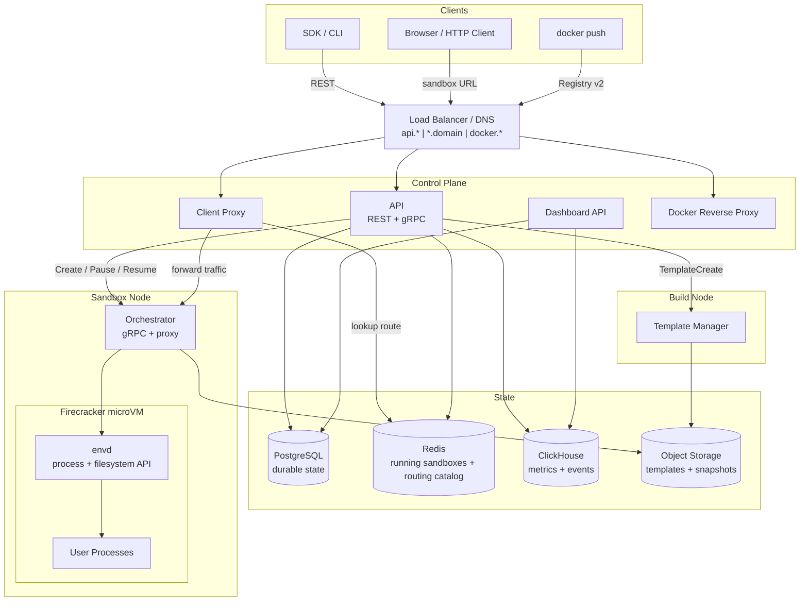
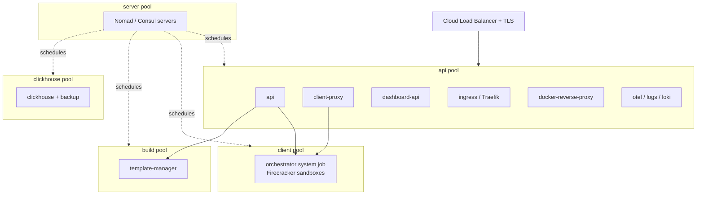
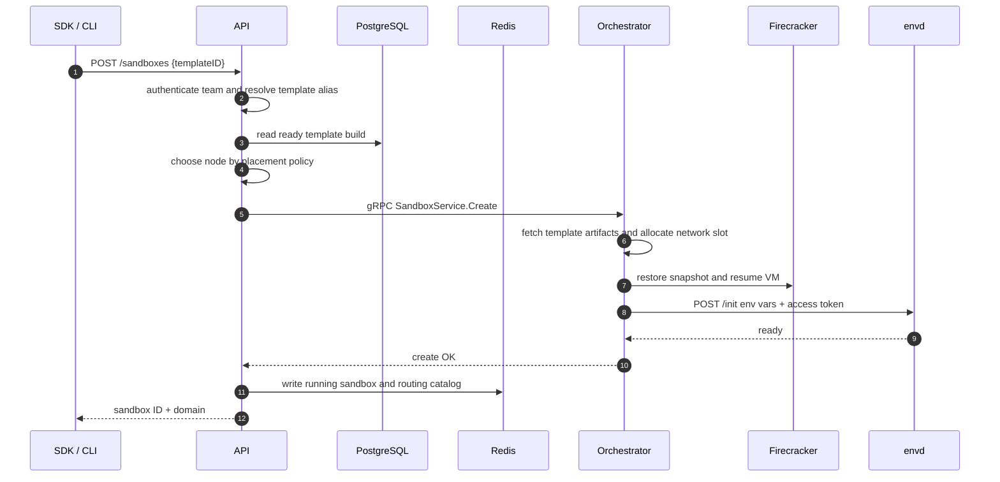
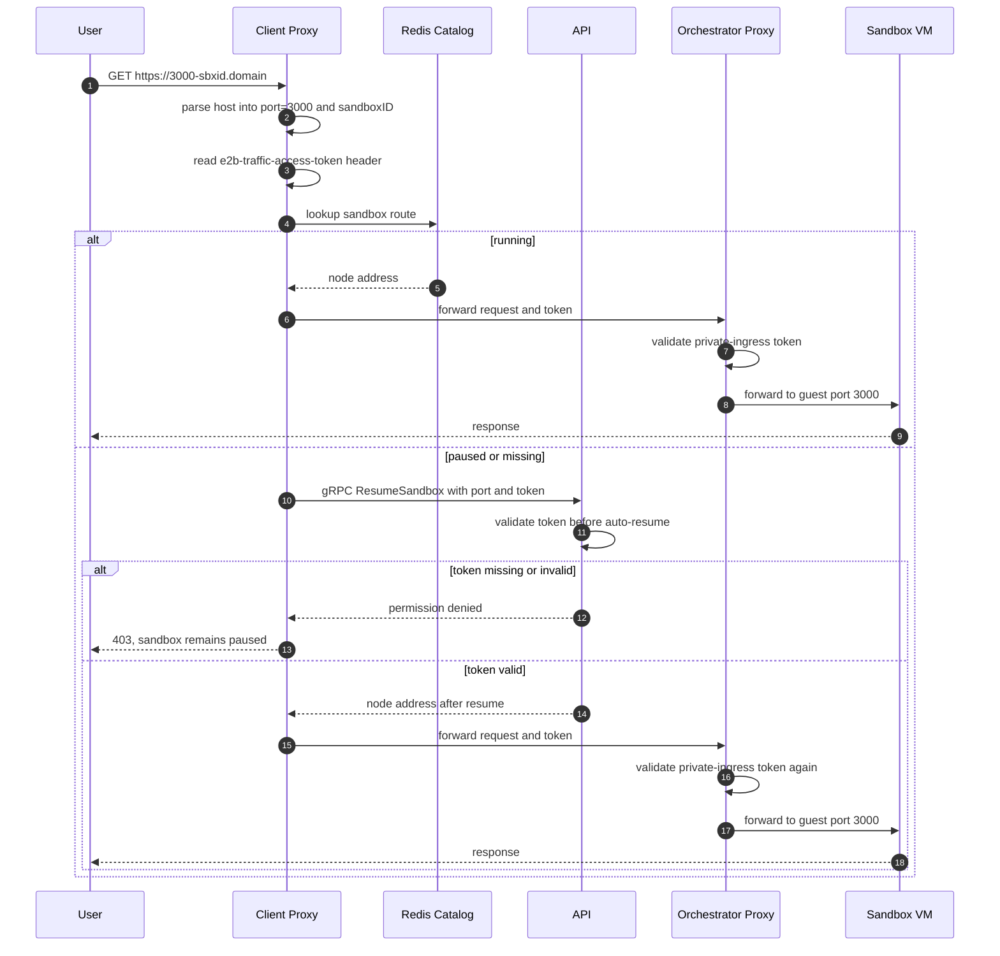
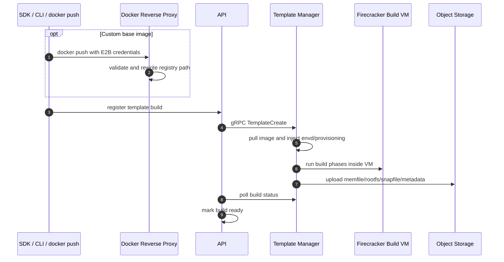
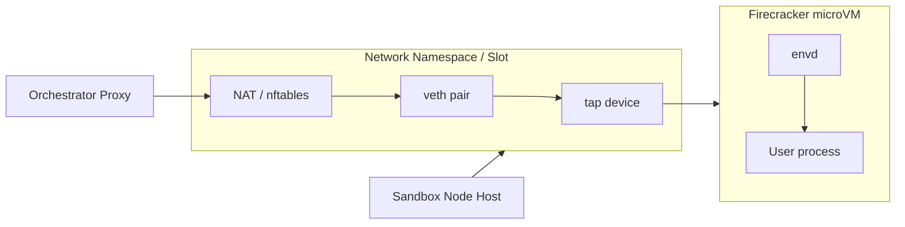

# E2B 深度技术文档

> **AI Sandbox、Firecracker microVM、Orchestrator、envd 与自托管架构解析**
>
> 基于 E2B 官方基础设施仓库整理：<https://github.com/e2b-dev/infra>
>
> 稳定版本基线：`2026.28@fda7bef1095afb909197e272c0a8a123797f0bfb`，审校日期：2026-07-20。正文中的产品能力与支持状态仅以 E2B 官方仓库和官方文档为依据。

---

## 目录

- [自动生成目录占位](#自动生成目录占位)

---

## 第一章：E2B 的定位

### 1.1 E2B 是什么

E2B 是面向 AI Agent、代码解释器和自动化执行任务的 **Sandbox 基础设施**。它提供的核心能力不是“运行一个普通容器”，而是快速创建一个隔离的 Linux 执行环境，让 LLM 生成的代码、脚本、文件操作和长时间任务可以在受控环境中运行。

一句话概括：

> **E2B 是一个以 Firecracker microVM 为隔离单元、以快照恢复为启动路径、以 API/SDK 暴露给 Agent 的云端 Sandbox 运行时平台。**

它的典型使用方式是：

| 使用者 | 入口 | E2B 提供的能力 |
|--------|------|----------------|
| AI Agent / Code Interpreter | SDK、CLI、REST API | 创建 sandbox、运行代码、读写文件、暴露端口 |
| 平台团队 | API、Dashboard、模板构建链路 | 统一管理模板、团队、密钥、配额、指标和日志 |
| 基础设施团队 | Terraform、Nomad、Orchestrator | 部署 Firecracker 运行节点、对象存储、路由、监控 |

### 1.2 E2B 解决什么问题

让 AI 自动执行代码时，普通容器或直接宿主机执行会遇到一组生产化问题：

| 问题 | 直接用容器/Pod 时的难点 | E2B 的处理方式 |
|------|------------------------|----------------|
| 隔离 | AI 生成代码不可完全信任，容器隔离边界有限 | 每个 sandbox 是独立 Firecracker microVM |
| 启动速度 | 完整 VM 冷启动慢，容器预热也难携带完整状态 | 从预启动模板快照恢复 |
| 状态保存 | 运行过程中的内存、文件系统、进程状态难持久化 | pause/checkpoint 生成增量快照 |
| 文件和进程 API | 需要给 SDK 暴露稳定的执行、文件、PTY、流式日志接口 | VM 内部运行 envd agent |
| 端口访问 | 用户进程随机监听端口，需要安全转发 | client-proxy + orchestrator proxy + sandbox URL |
| 多节点调度 | 节点容量、模板缓存、快照位置会影响启动延迟 | API 做节点发现、placement 和路由表维护 |
| 私有化 | 需要将数据、模板、网络、认证放入自有环境 | 官方支持 GCP/AWS Terraform，自托管需处理依赖取舍 |

### 1.3 E2B 不是什么

| 不是 | 说明 |
|------|------|
| 不是 Kubernetes 模型推理平台 | E2B 运行任意代码 sandbox，不负责模型推理调度，和 KServe/Dynamo/Mooncake 的定位不同 |
| 不是通用容器编排器 | E2B 自身用 Nomad 调度服务，但它对用户暴露的是 sandbox API，不是容器 API |
| 不是单个二进制服务 | 生产部署至少涉及 API、Orchestrator、Client Proxy、PostgreSQL、Redis、对象存储和负载均衡 |
| 不是纯 serverless 函数平台 | sandbox 可长时间运行、暂停、恢复、暴露端口并保留文件系统状态 |

### 1.4 与 Daytona、Jupyter、Kubernetes Job 的区别

| 系统 | 主要目标 | 隔离/运行单元 | 与 E2B 的差异 |
|------|----------|---------------|---------------|
| Daytona | 开发环境与 workspace 管理 | 容器/K8s/远程环境 | 更偏 IDE/workspace 生命周期，E2B 更偏 Agent runtime |
| Jupyter | 交互式 notebook | Kernel 进程 | Jupyter 不是强隔离 sandbox 基础设施 |
| Kubernetes Job | 批任务调度 | Pod | Pod 生命周期粗粒度，不提供 E2B 的模板快照、envd SDK API 和 sandbox URL |
| Firecracker 原生 | microVM 虚拟化 | microVM | Firecracker 只提供虚拟化底座，E2B 提供完整控制面、数据面和开发者 API |

---

## 第二章：总体架构

### 2.1 控制面与数据面

E2B 的架构最重要的边界是 **控制面** 和 **数据面** 分离：

| 平面 | 主要组件 | 职责 |
|------|----------|------|
| 控制面 | API、Dashboard API、PostgreSQL、Redis、ClickHouse、Nomad/Consul | 鉴权、模板与团队管理、sandbox 生命周期、节点选择、运行态记录、指标查询 |
| 数据面 | Orchestrator、Firecracker、envd、Client Proxy、Orchestrator Proxy | 创建 VM、恢复快照、网络转发、进程/文件 API、用户流量代理 |

API 决定 **sandbox 在哪里运行**，Orchestrator 决定 **sandbox 如何运行**。用户访问 sandbox 暴露端口时，流量不经过 API，而是从 Client Proxy 转到对应节点的 Orchestrator Proxy。



### 2.2 部署拓扑

官方自托管路径用 Terraform 部署到云上，并用 Nomad/Consul 组织服务。GCP 是官方主要路径，AWS 在官方文档中标为 Beta；Azure 和通用 Linux 机器不是官方完成状态。



生产上通常要分出三类节点：

| 节点池 | 运行内容 | 原因 |
|--------|----------|------|
| server pool | Nomad/Consul server | 调度和服务发现控制面需要稳定 quorum |
| api pool | API、Client Proxy、Dashboard API、Ingress、日志采集 | 承接外部流量和控制面请求 |
| client pool | Orchestrator、Firecracker sandbox | 需要 KVM、root 权限、网络 namespace、NBD、cgroup、本地模板缓存 |
| build pool | Template Manager | 模板构建使用同一个 orchestrator 二进制的不同角色，和 sandbox 运行节点隔离更安全 |
| clickhouse pool | ClickHouse | 指标/事件写入量和查询压力与控制面不同 |

### 2.3 仓库结构

官方 `e2b-dev/infra` 仓库不是一个单服务项目，而是一套完整基础设施代码：

| 路径 | 内容 |
|------|------|
| `packages/api` | 公共 REST API、sandbox 生命周期、模板、团队、配额、鉴权 |
| `packages/orchestrator` | Firecracker sandbox runtime、template-manager 角色、gRPC 服务 |
| `packages/envd` | VM 内部 agent，提供进程、文件、端口和健康检查能力 |
| `packages/client-proxy` | sandbox URL 到具体节点的边缘路由 |
| `packages/dashboard-api` | Web Dashboard 后端 |
| `packages/docker-reverse-proxy` | Docker Registry v2 认证与路径重写代理 |
| `packages/shared` | protobuf、存储客户端、feature flags、proxy 公共逻辑 |
| `packages/db` | PostgreSQL migration 和 sqlc queries |
| `packages/clickhouse` | ClickHouse schema、写入和查询客户端 |
| `spec` | OpenAPI 规格 |
| `iac` | Terraform、Nomad jobs、云 provider 模块 |
| `tests/integration` | 面向真实部署的集成测试 |

---

## 第三章：核心组件

### 3.1 API

API 是 E2B 控制面的入口。它面向 SDK/CLI/Dashboard，负责把“创建 sandbox”这样的外部请求转成节点选择、模板解析、gRPC 调用和状态写入。

| 维度 | 说明 |
|------|------|
| 主要职责 | sandbox create/list/kill/pause/resume/connect，模板和构建管理，team/API key/access token，quota，metrics/logs |
| 外部接口 | REST API，OpenAPI 源位于 `spec/openapi.yml` |
| 内部接口 | gRPC，用于 client-proxy auto-resume 等内部调用 |
| 关键状态 | PostgreSQL 存模板、团队、构建、快照等持久对象；Redis 存运行中 sandbox 和路由表 |
| 调度逻辑 | 通过 Nomad/Kubernetes/static 等发现来源拿到节点，再按容量和 feature flag 参数做 placement |

API 的一个关键设计是：它只在控制路径参与 sandbox 生命周期，不在用户流量路径中转发请求。因此 API 故障不应直接中断已经建立的 sandbox 端口流量，但会影响新建、暂停、恢复、列表和指标查询。

### 3.2 Orchestrator

Orchestrator 是每个 sandbox 节点上最关键的组件。它以 root 权限运行，直接操作 Firecracker、网络 namespace、tap/veth、NBD、cgroup、模板缓存和快照文件。

| 子系统 | 作用 |
|--------|------|
| Firecracker 管理 | 为每个 sandbox 启动一个 microVM，配置 machine、drive、network、MMDS、snapshot restore |
| lazy memory / UFFD | 恢复时不一次性加载全部内存，由 userfaultfd 在 page fault 时从 memfile 读取 |
| COW rootfs | 模板 rootfs 只读，sandbox 写入进入 per-sandbox copy-on-write cache |
| 网络 slot | 为 sandbox 分配 host-side IP、network namespace、tap/veth、NAT 和 egress firewall |
| Sandbox proxy | 接收 client-proxy 转发请求，检查 token，再转到 VM 内对应端口 |
| Template cache | 从对象存储、本地磁盘、NFS 或 peer 节点获取模板和 snapshot artifact |
| 指标与事件 | 写入 ClickHouse，导出 OTel metrics |

官方实现中 Orchestrator 和 Template Manager 使用同一个 Go 二进制，通过 `ORCHESTRATOR_SERVICES` 选择角色。生产上通常把两个角色放在不同节点池，避免端口、权限和资源争用。

### 3.3 Template Manager

Template Manager 负责把模板定义、Docker image、构建步骤和启动命令转成可快速恢复的 Firecracker snapshot。它不是简单地 `docker build` 一个镜像，而是会在构建过程中启动真实 VM，执行 provision/user/finalize/optimize 等阶段，并把最终产物上传到对象存储。

模板构建的产物通常包括：

| Artifact | 用途 |
|----------|------|
| `memfile` | 模板 VM 内存镜像 |
| `rootfs.ext4` | 模板根文件系统 |
| `snapfile` | Firecracker VM 状态 |
| `metadata.json` | 资源、版本、启动参数、envd 信息等元数据 |
| `.header` / diff index | 用于增量层、快照链和 lazy 读取 |

### 3.4 envd

envd 是每个 VM 内部启动的 agent。SDK 执行代码、读写文件、连接进程、上传下载文件，最终都需要通过 envd 或它暴露的协议进入 sandbox。

| 能力 | 说明 |
|------|------|
| Process API | 启动进程、列出进程、连接 stdout/stderr/stdin、PTY、signal |
| Filesystem API | stat、list、make、move、remove、watch、文件上传下载 |
| 初始化 | Orchestrator 在 VM boot/resume 后调用 `/init` 注入 env vars、access token 和元数据 |
| 认证 | envd 检查 `X-Access-Token`，token 由 Orchestrator 经 Firecracker MMDS 传递 |
| 端口发现 | 扫描 guest ports，使用户进程监听端口能通过 sandbox URL 访问 |

envd 的版本很重要。官方架构文档强调 envd 行为变化要更新版本，因为 API 和 Orchestrator 会根据模板构建中记录的 envd 版本做能力判断。

### 3.5 Client Proxy

Client Proxy 是 sandbox 对外流量的边缘入口。用户访问的域名通常形如：

```text
https://<port>-<sandboxID>.<domain>
```

Client Proxy 从 Host 中解析出端口和 sandbox ID，查 Redis routing catalog，找到 sandbox 所在 Orchestrator 节点，然后把请求转发到该节点的 Orchestrator Proxy。如果 Redis 中找不到运行态记录，Client Proxy 可以通过 API 的 gRPC resume 能力触发自动恢复。

### 3.6 Dashboard API 与 Docker Reverse Proxy

Dashboard API 面向 Web 管理界面，不是 SDK 主路径。它读取 PostgreSQL 和 ClickHouse，用于 team、template、build、admin bootstrap 等管理场景。

Docker Reverse Proxy 是模板自定义镜像链路的一部分。用户用 E2B 凭证推送镜像时，它负责校验凭证、替换为真实 registry 凭据，并把路径改写到云侧 artifact registry。

---

## 第四章：Sandbox 生命周期

### 4.1 创建 Sandbox

创建 sandbox 不是冷启动一台新 VM，而是恢复一个预构建模板快照。这个设计是 E2B 启动速度的基础。



关键点：

| 阶段 | 关键行为 |
|------|----------|
| 模板解析 | API 将 template alias 解析为 ready build |
| 节点选择 | API 结合节点健康、容量、调度标签和 feature flag 选择 Orchestrator |
| 快照恢复 | Orchestrator 恢复 Firecracker snapshot，准备 lazy memfile 和 COW rootfs |
| envd 初始化 | Orchestrator 等待 VM 内 envd ready，并注入 token、metadata、环境变量 |
| 路由登记 | API 将 sandbox ID 到节点的映射写入 Redis，供 Client Proxy 查询 |

### 4.2 访问 Sandbox 端口

用户进程在 VM 内监听端口后，外部访问路径如下：

`Sandbox.getHost(port)` 只负责把端口、Sandbox ID 和 sandbox domain 编码成可路由的主机名，不负责把凭证附加到请求上。非 debug 模式下，官方 TypeScript/Python SDK 的返回值是：

```text
<port>-<sandbox-id>.<sandbox-domain>
```

因此完整的 HTTPS 地址是：

```text
https://<port>-<sandbox-id>.<sandbox-domain>
```

例如 `sandbox.getHost(8080)` 返回 `8080-iabc123.sandbox.example.com`，调用方再组合为 `https://8080-iabc123.sandbox.example.com`。端口寻址和 ingress 鉴权是两件事，拿到 host 并不意味着请求已经通过鉴权。

#### 4.2.1 Public 与 Private ingress

Infra 2026.28 的 `network.allowPublicTraffic` 默认值是 `true`。未设置或显式设为 `true` 时，业务端口（非 envd 控制端口）可以匿名访问；显式设为 `false` 时，创建响应会返回 `trafficAccessToken`，每次业务端口请求都必须在 `e2b-traffic-access-token` header 中携带它。

| 创建参数 | `trafficAccessToken` | 业务端口请求 | 说明 |
| --- | --- | --- | --- |
| 未设置或 `allowPublicTraffic=true` | 通常为 `null`/未定义 | 不需要 Traffic Token | host 仍然只负责寻址 |
| `allowPublicTraffic=false` | 返回 Sandbox 级 bearer token | 必须发送 `e2b-traffic-access-token` | 缺失或错误均返回 `403` |

私有 ingress 不能只设置 `allowPublicTraffic=false`：Infra 2026.28 还要求创建请求启用 `secure=true`，否则 API 会拒绝创建，因为 envd 控制面必须有独立的 `envdAccessToken`。这两个开关保护不同路径，不能互相替代。

下面的示例使用官方 SDK 当前实现说明调用形态；SDK 示例提交固定为 `e2b-dev/e2b@36639f532114f4b34e01b96319a7e00bf6404cf9`，不改变本文的 Infra 稳定基线。

```typescript
import { Sandbox } from "e2b"

const sandbox = await Sandbox.create({
  secure: true,
  network: { allowPublicTraffic: false },
})
await sandbox.commands.run("python3 -m http.server 8080", { background: true })

const trafficToken = sandbox.trafficAccessToken
if (!trafficToken) throw new Error("private sandbox did not return traffic token")

const url = `https://${sandbox.getHost(8080)}`
const response = await fetch(url, {
  headers: { "e2b-traffic-access-token": trafficToken },
})
console.log(response.status)
```

```python
import httpx
from e2b import Sandbox

sandbox = Sandbox.create(
    secure=True,
    network={"allow_public_traffic": False},
)
sandbox.commands.run("python3 -m http.server 8080", background=True)

traffic_token = sandbox.traffic_access_token
if traffic_token is None:
    raise RuntimeError("private sandbox did not return traffic token")

url = f"https://{sandbox.get_host(8080)}"
response = httpx.get(
    url,
    headers={"e2b-traffic-access-token": traffic_token},
)
print(response.status_code)
```

不使用 SDK 时，token 应由受信任的后端从创建响应中读取并注入进程环境，而不是写到 URL query：

```bash
# TRAFFIC_ACCESS_TOKEN 由后端安全注入；不要把 token 放进 URL。
export TRAFFIC_ACCESS_TOKEN
curl --fail-with-body \
  -H "e2b-traffic-access-token: ${TRAFFIC_ACCESS_TOKEN}" \
  "https://8080-<sandbox-id>.<sandbox-domain>/healthz"
```



这条路径解释了为什么 Redis routing catalog 很关键：它是 Client Proxy 找到 sandbox 所在节点的快速路径。多节点部署如果没有共享 Redis，只能退回单节点或内存模式，无法可靠支撑跨节点路由。对于运行中的 sandbox，Orchestrator Proxy 在转发到 guest port 前校验 token；对于暂停或路由缺失的 sandbox，API 的 `ResumeSandbox` 会先校验 token，只有校验通过才允许自动恢复。缺失/错误 token 不会因为触发了 auto-resume 而绕过鉴权。

#### 4.2.2 浏览器、WebSocket 与 BFF

浏览器地址栏、`iframe`、`img` 和原生浏览器 `WebSocket` 构造器不能为请求附加任意 `e2b-traffic-access-token` header。浏览器 `fetch` 虽然可以设置该 header，但跨域时会触发 CORS 预检；预检请求本身不携带 Traffic Token，而 Infra 2026.28 的 Orchestrator Proxy 会在业务应用之前校验所有非 envd 请求，所以预检可能直接得到 `403`。不能假设只配置 Sandbox 应用的 CORS 就能解决。Node.js、Python 或其他服务端 HTTP/WebSocket 客户端可以显式发送 header。

推荐让后端/BFF 保存短生命周期的访问上下文并代为访问 E2B，再向浏览器返回经过业务鉴权和响应过滤的数据或建立受控 WebSocket 转发。不要把 Traffic Token 放到 query、fragment、前端 bundle、localStorage 或长期 cookie 中；它是 Sandbox 级 bearer credential，没有用户级 RBAC、scope 或逐端口权限，泄露后可访问该 Sandbox 允许的所有业务端口。

### 4.3 暂停、恢复与 Checkpoint

暂停时，API 先记录 snapshot，再请求 Orchestrator 对 VM 做 pause。Orchestrator 会冻结 VM、导出内存和 rootfs 的增量变化、保留本地缓存，并异步上传到对象存储。

恢复时，系统尽量优先选择原节点。如果 snapshot 仍在原节点本地缓存，恢复就可以避免大量对象存储读取。Checkpoint 可以理解为“保存当前状态但继续运行”，用于把运行中的 sandbox 状态持久化。

| 操作 | 效果 | 对 Redis 路由表的影响 |
|------|------|----------------------|
| Create | 从模板快照创建运行态 sandbox | 写入 running sandbox 和 route |
| Pause | 生成 snapshot，释放运行态资源 | 移除或更新运行态 route |
| Resume | 从 snapshot 恢复到某个节点 | 写回 route |
| Checkpoint | 保存状态并继续运行 | route 保持可用 |
| Kill/Delete | 终止 VM，清理运行态资源 | 删除 route |

### 4.4 为什么快

E2B 的启动速度来自多个层次叠加：

| 技术 | 作用 |
|------|------|
| 预启动模板快照 | 创建 sandbox 等价于恢复已有 VM 状态，而不是从零启动 Linux |
| lazy memory / userfaultfd | 内存页按需读取，避免恢复时一次性读完整 memfile |
| COW rootfs | 模板只读共享，sandbox 只保存写入差异 |
| 本地模板缓存 | 常用模板留在节点磁盘，减少对象存储读取 |
| optimize phase | 构建阶段记录恢复热页，后续可以预取 |
| origin node 优先 | paused sandbox 恢复时优先使用原节点本地 snapshot |

---

## 第五章：模板构建链路

### 5.1 构建流程

模板是 E2B 的关键资产。没有模板，sandbox 每次都要冷启动、安装依赖、初始化环境；有了模板，就可以直接恢复到预热后的状态。



### 5.2 分层构建

官方 Orchestrator 的模板构建是分阶段、可缓存的。典型阶段包括 base、user steps、finalize 和 optimize。每个未命中缓存的阶段都会在真实 Firecracker VM 中执行，然后把 pause diff 作为下一层。

这种设计有两个价值：

| 价值 | 说明 |
|------|------|
| 构建可复用 | 只有 recipe 中变化的步骤需要重新执行 |
| 运行更接近真实环境 | 构建阶段就在 VM 中完成，不只是容器文件系统转换 |
| 启动更快 | optimize 阶段能记录恢复时的热页信息 |

### 5.3 私有化时要关注的模板存储

对象存储是模板和 snapshot 的事实存储。官方云路径使用 GCS 或 S3；私有化时常见替代包括 S3 兼容存储、MinIO 或本地/NFS 目录。

| 方案 | 适合场景 | 风险 |
|------|----------|------|
| GCS/S3 | 官方 Terraform 云部署 | 依赖云账号、权限、跨区域成本 |
| S3 兼容存储/MinIO | 私有化、内网对象存储 | 需要验证 SDK 兼容性、TLS、权限和大文件吞吐 |
| NFS/本地目录 | 小规模或单机验证 | 多节点一致性、性能、故障恢复能力弱 |

模板构建和 sandbox 恢复都强依赖 artifact 可读性。生产部署前应至少验证：基础模板构建、sandbox 创建、pause、resume、跨节点恢复、对象存储故障恢复。

---

## 第六章：数据与状态模型

### 6.1 PostgreSQL

PostgreSQL 是持久控制面状态的核心数据库。典型数据包括：

| 数据 | 说明 |
|------|------|
| teams / users / tiers | 团队、用户、配额和计费层级 |
| envs / env_builds / aliases | 模板、构建记录、别名和版本 |
| snapshots | paused sandbox 和 checkpoint 记录 |
| team_api_keys / access_tokens | API key 和访问 token |
| volumes | 持久卷元数据 |
| clusters | 多集群/部署集群信息 |

PostgreSQL 没有实际替代方案。生产私有化可以选择自建 HA PostgreSQL、云数据库或企业内部数据库服务，但必须保证 migration、连接池、备份恢复和时钟一致性。

### 6.2 Redis

Redis 存的是运行态和快速查询数据。对多节点 E2B 来说，它是必需组件。

| 数据 | 作用 |
|------|------|
| Running sandbox store | 当前运行中的 sandbox 状态 |
| Routing catalog | sandbox ID 到 Orchestrator 节点的映射 |
| Team/template/snapshot cache | 控制面缓存，降低数据库压力 |
| Rate limiting | API 或团队级限流 |
| P2P chunk registry | 节点之间共享模板 chunk 信息 |

官方 release 的服务配置和源码把 Redis 用于运行态 catalog、路由和缓存。生产多节点部署应提供所有 API/Proxy 实例都能访问的共享 Redis，并按该 release 实际使用的客户端模式配置普通、Cluster 或其他高可用入口；官方自托管配置未声明支持的连接模式不能仅凭 Redis 服务端能力推定可用。

### 6.3 ClickHouse 与 Loki

ClickHouse 用于 metrics、sandbox events、host stats 等时序/分析数据。API 和 Dashboard API 会读取它来展示团队或 sandbox 指标。没有 ClickHouse 时，核心 sandbox 生命周期可以降级运行，但指标能力会缺失或变成 no-op。

Loki 用于日志聚合。它不是创建 sandbox 的硬依赖，但没有日志系统时，用户和运维排障会明显变难。

### 6.4 Object Storage

对象存储保存模板和 snapshot artifact，是运行时恢复和暂停恢复的关键依赖。典型 key 形态围绕 build ID 或 snapshot build ID 组织，包含内存、rootfs、snapfile、metadata 和索引文件。

| 风险点 | 影响 |
|--------|------|
| 对象存储延迟高 | sandbox 创建和恢复变慢 |
| artifact 丢失 | 模板或 snapshot 无法恢复 |
| 权限不一致 | 构建能上传但运行节点无法读取 |
| 跨区域访问 | 成本和启动延迟上升 |

### 6.5 Consul 与网络 slot

在官方 Nomad/Consul 部署中，Consul 不只是服务发现组件，还可用于网络 slot 分配的协调。Orchestrator 需要为 sandbox 分配不冲突的 IP、namespace 和转发表项。单节点可以使用本地 namespace storage；多节点如果不用 Consul，需要替代的分布式锁或每节点独立 IP 池规划。

---

## 第七章：网络、安全与隔离

### 7.1 隔离模型

E2B 的隔离边界主要由 Firecracker microVM 提供。每个 sandbox 有自己的 VM、kernel 视角、rootfs overlay、network namespace、cgroup 和访问 token。



这种模型比“在宿主机上跑子进程”安全得多，也比普通容器更适合执行不可信代码。但它不是绝对安全边界：宿主机内核、KVM、Firecracker、网络策略、对象存储权限、token 管理仍然需要按生产标准维护。

### 7.2 访问控制

E2B 中有多层 token 和凭证：

| 层级 | 作用 |
|------|------|
| Team API Key | SDK/CLI 调用 E2B API |
| API access token / OAuth credential | 控制面 API 或内部 gRPC 的调用身份，具体 scope 由 API 配置决定 |
| `envdAccessToken` | `secure=true` 时由 API/Orchestrator 注入 VM，访问 envd 控制面时通过 `X-Access-Token` 校验 |
| `trafficAccessToken` | `allowPublicTraffic=false` 时由 Orchestrator Proxy 校验 Sandbox 业务端口访问 |
| Volume token | 访问持久卷或相关资源 |
| Registry credential | Docker Reverse Proxy 推送模板镜像时使用 |

`secure=true` 保护的是 envd 的进程、文件、PTY 等控制 API，以及对应的 envd 端口；它不等于业务端口 ingress 已经私有化。反过来，`allowPublicTraffic=false` 只要求业务端口带 `e2b-traffic-access-token`，不替代 envd token。Infra 2026.28 在私有 ingress 创建时强制同时启用 `secure`，但两种 token 仍由不同代理和不同 header 校验。

Traffic Token 的边界需要明确：它是 Sandbox 级 bearer credential，不携带用户身份，不提供用户级 RBAC、scope、租户切换或逐端口权限。拿到它的调用者可以访问该 Sandbox 所暴露的所有受保护业务端口，因此应只在受信任的服务端保存和转发。

#### 7.2.1 Infra 2026.28 的生成与轮换

固定 release 的实现使用部署级环境变量 `SANDBOX_ACCESS_TOKEN_HASH_SEED` 作为 HMAC-SHA256 key，并以 Sandbox ID 生成确定性 token：

```text
traffic token = HMAC-SHA256(seed, "sandbox-traffic-" + sandboxID)
```

源码返回十六进制摘要，没有 JWT `exp` 或其他显式过期字段；token 是否还能使用取决于 Sandbox 是否存在、端口路由是否有效以及部署的 seed 是否仍一致。API 在暂停态自动恢复前重新计算并比较 token，Orchestrator Proxy 在运行态转发前则比较创建/恢复时下发给该 Sandbox 的 token。

更换 seed 会改变同一个 Sandbox ID 的派生值，但影响不是原子切换：尚未重建的运行态 Sandbox 可能暂时仍接受旧 token，API 的暂停态恢复校验则会按新 seed 计算，随后恢复的 Sandbox 会接收新 token。轮换必须安排所有 API 实例、Sandbox 生命周期、Orchestrator 下发配置和调用方的协调窗口，不能只滚动重启单个 API 实例。

官方 2026.28 路径由 API 持有 seed、生成 Traffic Token，再把 token 配置下发给 Orchestrator；Orchestrator 不应自行生成第二套 token。若私有化改造让 Orchestrator 也参与生成或重算，API 与 Orchestrator 必须显式共享同一个 seed、算法和 Sandbox ID 规范。

私有化时常见误区是只保护 API 域名，却忽略 wildcard sandbox 域名、docker registry 域名、Dashboard、Nomad UI、对象存储 bucket 和内部 gRPC 端口。生产上应把外部入口、内部服务网段、节点安全组、防火墙和 TLS 证书统一规划。

### 7.3 DNS 与通配域名

Sandbox URL 依赖通配域名。常见划分如下：

| 域名 | 指向 | 用途 |
|------|------|------|
| `api.<domain>` | API / ingress | SDK 和 CLI 控制面请求 |
| `*.sandbox.<domain>` 或 `*.domain` | Client Proxy | sandbox 端口访问 |
| `docker.<domain>` | Docker Reverse Proxy | 模板镜像 push |
| `dashboard.<domain>` | Dashboard UI/API | Web 管理 |
| `nomad.<domain>` | Nomad UI | 运维入口，必须限制访问 |

Client Proxy 的 host 解析依赖端口和 sandbox ID 编码在域名中。负载均衡、TLS 通配证书和 DNS 记录如果没有覆盖这类域名，sandbox 端口访问会失败。

### 7.4 出站网络控制

Orchestrator 的网络子系统会为 sandbox 建立 NAT 和 nftables 规则，并支持按域名或地址做出站控制。对企业私有化来说，这部分能力决定了 sandbox 能否访问互联网、内网资源、包管理镜像、对象存储和私有 registry。

建议在生产前明确：

| 问题 | 建议 |
|------|------|
| sandbox 是否能访问公网 | 默认最小权限，按模板或团队放行 |
| 是否能访问内网 | 不要把 sandbox 网络直接放进核心业务网段 |
| 依赖下载走哪里 | 使用内网镜像、缓存或代理，降低不确定性 |
| DNS 由谁解析 | 统一指向受控 resolver，便于审计和策略 |

---

## 第八章：官方自托管路径

### 8.1 前置条件

官方 `self-host.md` 的主路径是 Terraform 云部署。共通前置条件包括：

| 类别 | 要求 |
|------|------|
| 工具 | Packer、Terraform 1.7.5、Go、Docker、Docker Buildx、npm |
| 账号 | 云账号、Cloudflare 账号、Cloudflare 托管域名、PostgreSQL 数据库 |
| 可选服务 | Grafana stack、PostHog |
| 基础能力 | KVM/nested virtualization、足够 CPU/磁盘配额、可访问对象存储和 registry |

### 8.2 GCP 路径

GCP 是官方文档中最完整的自托管路径：

1. 创建 GCP project，并确认 SSD 和 CPU quota。
2. 从 `.env.gcp.template` 生成 `.env.prod`、`.env.staging` 或 `.env.dev`。
3. 配置 PostgreSQL connection string、Cloudflare 域名、区域、bucket 等变量。
4. 执行 `make set-env ENV=...`。
5. 执行 `make provider-login` 和 `make init`。
6. 执行 `make build-and-upload`。
7. 执行 `make copy-public-builds`，复制 kernel、Firecracker、busybox 等公共构建物。
8. 在 Secret Manager 中填充 Cloudflare token、PostgreSQL connection string、可选监控密钥。
9. 先 `make plan-without-jobs && make apply`，再 `make plan && make apply`。
10. 执行 `make prep-cluster` 创建初始用户、team 和 base template。

### 8.3 AWS 路径

AWS 路径在官方文档中标为 Beta。主要差异是：

| 步骤 | AWS 关注点 |
|------|------------|
| `.env.aws.template` | 需要 `AWS_PROFILE`、`AWS_ACCOUNT_ID`、`AWS_REGION`、`PREFIX`、`DOMAIN_NAME` |
| `make init` | 创建 Terraform state S3、VPC、ECR、模板/内核/build/backup bucket、Secrets、Cloudflare DNS/TLS |
| AMI | 需要用 Packer 构建 Nomad cluster node AMI |
| 实例类型 | Firecracker 需要 bare metal 或 nested virtualization 支持 |
| Redis | 可选择 managed Redis/ElastiCache |
| 后续步骤 | 同样需要 build/upload、公有构建物复制、plan/apply、prep-cluster |

### 8.4 Make 命令速查

| 命令 | 用途 |
|------|------|
| `make set-env ENV=prod` | 选择当前环境配置 |
| `make provider-login` | 登录 GCP 或 AWS registry/CLI |
| `make init` | 初始化 Terraform state、基础资源和 provider |
| `make build-and-upload` | 构建并上传服务镜像、二进制和磁盘镜像 |
| `make copy-public-builds` | 复制 kernel、Firecracker、busybox 等公共构建物 |
| `make plan-without-jobs` | 只规划基础设施，不部署 Nomad jobs |
| `make plan` | 规划完整基础设施和 jobs |
| `make apply` | 应用上一次 plan |
| `make prep-cluster` | 初始化用户、team、base template |
| `make seed-db` | 创建更多测试用户和团队 |
| `make destroy` | 销毁环境，生产需谨慎 |

---

## 第九章：私有化部署取舍

### 9.1 官方支持路径与二次工程边界

`e2b-dev/infra` 2026.28 的官方自托管路径是 Terraform + Nomad + 云 provider。仓库 README 将 GCP 标为支持、AWS 标为 Beta，同时把 Azure 和通用 Linux 机器列为未完成。Kubernetes、Ansible 或纯手工部署属于自行维护的二次工程，不能视为该 release 的官方交付路径。

本文后续的组件取舍和 Kubernetes 改造内容是基于官方组件边界给出的工程分析，不构成 E2B 官方支持声明。涉及字段、端口、服务发现或高可用模式时，仍须回到固定 release 的 Terraform、Nomad job 和组件源码验证。

### 9.2 组件必要性

| 组件 | 单节点 PoC | 多节点生产 | 私有化建议 |
|------|------------|------------|------------|
| PostgreSQL | 必需 | 必需 | 使用 HA PostgreSQL 或云数据库，做好 migration 和备份 |
| Redis | 可降级 | 必需 | 多节点必须共享 routing catalog |
| Nomad | 可省 | 官方路径必需 | 不用 Nomad 需替换服务发现和调度 |
| Consul | 可本地降级 | 视网络 slot 方案而定 | 可用本地独立 IP 池或替代分布式锁 |
| ClickHouse | 可省 | 推荐 | 没有它会缺少指标和事件分析 |
| Loki | 可省 | 推荐 | 没有它会影响日志排障 |
| LaunchDarkly | 可省 | 可省 | 有默认值/离线模式时可不部署 |
| Supabase | 可省 | 视 Dashboard/用户认证而定 | 私有化通常替换为自建 OIDC/JWT 或仅保留 API Key |
| Dashboard | 可省 | 可选 | 运维和团队管理友好，但不是 sandbox 生命周期硬依赖 |
| Template Manager | 可省 | 推荐 | 不允许用户自定义模板时可减少部署面 |

### 9.3 最小化、标准化、企业级

| 方案 | 目标 | 组件 |
|------|------|------|
| 最小化 PoC | 验证 sandbox 创建、执行、端口访问 | API、Orchestrator、PostgreSQL、可选 Redis、本地存储、本地 DNS/hosts |
| 标准多节点 | 支撑基本生产流量 | API 多实例、Client Proxy 多实例、Orchestrator 多节点、PostgreSQL HA、Redis、对象存储、LB、TLS |
| 企业级 | 支撑审计、HA、监控、模板构建和多团队 | 标准多节点 + Template Manager、ClickHouse、Loki、Dashboard、自建认证、备份恢复、灰度和容量规划 |

### 9.4 Kubernetes 改造注意事项

官方 infra 的稳定路径不是 Kubernetes。要把 E2B 改造成 Kubernetes 原生部署，至少要自行处理：

| 改造点 | 原因 |
|--------|------|
| Orchestrator DaemonSet | 需要特权、KVM、NBD、cgroup、network namespace 和宿主机路径 |
| 服务发现 | API 原本依赖 Nomad/本地模式，需要 K8s Pod/Endpoint discovery |
| 网络 slot 协调 | 多节点 IP 池、分布式锁或每节点 CIDR 规划不能冲突 |
| Template Manager 调度 | 构建节点和运行节点最好隔离，端口也需规划 |
| 对象存储 | 需要 S3/GCS/MinIO/NFS 中的一种稳定实现 |
| 安全边界 | privileged Pod、host network、host path、内核模块会显著提升集群风险 |

因此 K8s 方案更适合作为二次工程项目，而不是直接替代官方 `make plan && make apply`。

---

## 第十章：运维、验证与排障

### 10.1 健康检查端点

| 组件 | 默认端口 | 检查方式 |
|------|----------|----------|
| API | HTTP 3000 或 Nomad 分配端口 | `GET /health` |
| API gRPC | 5009 / edge 5109 | gRPC health |
| Client Proxy | proxy 3002，health 3003 | `GET /health` |
| Orchestrator | gRPC 5008，proxy 5007 | gRPC health、Nomad allocation 状态 |
| Dashboard API | 3010 | `GET /health` |
| Loki | 3100 | `GET /ready` |
| Nomad | 4646 | `/v1/status/leader`、`nomad server members` |
| PostgreSQL | 5432 | `SELECT 1`、migration 状态 |
| Redis | 6379 | `PING`、route key 检查 |

### 10.2 最小验收链路

生产或私有化环境上线前，建议至少完成这组验收：

1. API health 正常。
2. Client Proxy health 正常。
3. Orchestrator 节点在 API 的发现结果中可见。
4. PostgreSQL migration 完成。
5. Redis 可写入、可读取 routing catalog。
6. 对象存储能上传和读取模板 artifact。
7. base template 构建成功。
8. SDK 创建 sandbox 成功。
9. SDK 在 sandbox 内执行命令成功。
10. sandbox 内启动 HTTP server 后，外部通过 sandbox URL 访问成功。
11. pause 后 route 清理符合预期。
12. resume 后文件系统和进程状态符合预期。
13. kill/delete 后 VM、网络 slot 和 Redis route 被清理。
14. 节点重启后本地 cache 和状态恢复行为符合预期。

### 10.3 常见故障

| 现象 | 优先检查 |
|------|----------|
| sandbox 创建很慢 | 模板是否命中本地缓存、对象存储延迟、UFFD/lazy restore 是否正常、节点 CPU/IO |
| 创建失败 | Orchestrator 日志、Firecracker binary/kernel、KVM 权限、rootfs/memfile/snapfile 是否存在 |
| 端口访问失败 | wildcard DNS、TLS、Client Proxy host 解析、Redis route、Orchestrator proxy、guest 进程监听地址；私有 ingress 还要确认 `e2b-traffic-access-token` header 是否存在且未被代理剥离 |
| 私有端口返回 `403` | 确认请求使用的是 `trafficAccessToken` 而不是 `envdAccessToken`，检查 token 是否属于同一个 Sandbox、API/Orchestrator 的 `SANDBOX_ACCESS_TOKEN_HASH_SEED` 是否一致；暂停态还要检查恢复前的 API 校验日志 |
| pause/resume 失败 | snapshot row、对象存储上传、origin node 缓存、dirty block/memory diff |
| 多节点路由错乱 | Redis routing catalog、节点 ID、服务发现、负载均衡健康检查 |
| 模板构建失败 | Docker Reverse Proxy、registry 权限、Template Manager 节点、构建阶段日志 |
| 指标缺失 | ClickHouse schema/migration、OTel collector、orchestrator metrics 写入 |
| 日志缺失 | Loki URL、Vector/logs collector、API 查询配置 |

### 10.4 容量规划

容量规划要按 sandbox 规格和启动行为估算，而不是只看 API QPS：

| 资源 | 影响因素 |
|------|----------|
| CPU | sandbox vCPU、并发用户进程、模板构建、压缩/上传 snapshot |
| 内存 | sandbox memory、lazy page cache、host cache、ClickHouse/Redis |
| 磁盘 | 本地模板 cache、COW rootfs、snapshot 临时文件、ClickHouse 数据 |
| 网络 | 对象存储读写、sandbox 入出站流量、模板构建拉镜像 |
| Redis | route 查询、运行态写入、cache、rate limit |
| PostgreSQL | 模板/构建/snapshot/team 查询和 migration |

API 节点和 sandbox 节点的瓶颈不同。API 节点通常受 HTTP/gRPC、数据库连接池和 Redis 影响；sandbox 节点通常受 KVM、内存、磁盘 IO、网络 namespace、NBD 和对象存储影响。

### 10.5 上线检查清单

| 类别 | 检查项 |
|------|--------|
| 域名 | `api.*`、sandbox wildcard、`docker.*`、Dashboard、Nomad UI |
| TLS | 通配证书、证书续期、内部 gRPC 是否需要 TLS |
| 认证 | API key、admin token、Dashboard/OIDC、`trafficAccessToken`、`envdAccessToken`、volume token；私有 ingress 不把 token 放入 URL，也不向前端暴露长期 bearer token |
| 凭据治理 | `SANDBOX_ACCESS_TOKEN_HASH_SEED` 由 Secret Manager/Vault 等部署级密钥系统托管；所有参与创建/恢复的 API 实例使用一致 seed，Orchestrator 只接收该部署下发的 token 配置；轮换前评估既有 Sandbox token 失效影响 |
| 数据 | PostgreSQL 备份、Redis HA、对象存储生命周期、ClickHouse TTL |
| 节点 | KVM、nested virtualization、内核模块、cgroup、hugepages、本地磁盘 |
| 网络 | 安全组、防火墙、egress allowlist、NAT、DNS resolver |
| 运维 | health checks、日志、指标、告警、容量面板；代理访问日志和 Sandbox 应用日志脱敏 `e2b-traffic-access-token`，不记录完整 token |
| 演练 | sandbox create/kill、pause/resume、节点重启、对象存储慢请求、Redis failover |

---

## 第十一章：选型结论

### 11.1 什么时候适合 E2B

E2B 适合这些场景：

| 场景 | 原因 |
|------|------|
| AI Agent 需要执行不可信代码 | Firecracker microVM 比普通进程隔离更合适 |
| 需要快速启动带完整运行环境的 sandbox | 模板快照恢复比冷启动安装依赖快 |
| 需要文件、进程、PTY、端口访问 API | envd 和 SDK 提供了上层开发者体验 |
| 需要暂停/恢复执行环境 | snapshot 能保存运行状态 |
| 需要私有化运行 Agent runtime | 官方 infra 提供 Terraform/Nomad 自托管路径，但仍需验证所选云 provider 的支持状态 |

### 11.2 什么时候要谨慎

| 场景 | 原因 |
|------|------|
| 只需要短生命周期批任务 | Kubernetes Job 或容器队列可能更简单 |
| 不需要强隔离 | 普通容器或进程池运维成本更低 |
| 没有 KVM/nested virtualization 条件 | Firecracker 路径会受阻 |
| 团队不想运维 Nomad/对象存储/Redis/PostgreSQL | E2B 的基础设施复杂度不低 |
| 希望直接跑在 Kubernetes 且不改代码 | 官方主路径不是 K8s，需要额外工程 |

### 11.3 实施建议

推荐分三步落地：

1. **先跑通官方 Terraform 路径或最小 PoC**：验证基础模板、sandbox 创建、端口访问、pause/resume。
2. **再确定私有化边界**：哪些组件必须自建，哪些可以用云服务，是否需要 Dashboard、ClickHouse、Loki、自建认证。
3. **最后做高可用和安全演练**：节点故障、Redis failover、PostgreSQL 备份恢复、对象存储慢请求、证书续期、出站网络策略。

不要一开始就把 E2B 改造成 Kubernetes、替换认证、替换服务发现、替换存储和上 HA。E2B 的核心难点在 Firecracker runtime、模板快照和流量路由，先把这条主链路跑稳，再逐步替换外围依赖。

---

## 附录 A：固定版本与官方来源

本文的服务端兼容边界固定在 E2B Infra `2026.28@fda7bef1095afb909197e272c0a8a123797f0bfb`。SDK 链接固定到 2026-07-20 审校时的官方 monorepo 提交 `36639f532114f4b34e01b96319a7e00bf6404cf9`，只用于证明 `getHost()`、`trafficAccessToken` 和示例调用形态，不把该 SDK 主线提交中的其他能力计入 Infra 2026.28 的稳定承诺。

| 主题 | 官方固定快照 |
| --- | --- |
| Infra 2026.28 完整源码 | [e2b-dev/infra@fda7bef](https://github.com/e2b-dev/infra/tree/fda7bef1095afb909197e272c0a8a123797f0bfb) |
| OpenAPI 默认值与响应字段 | [`spec/openapi.yml`](https://github.com/e2b-dev/infra/blob/fda7bef1095afb909197e272c0a8a123797f0bfb/spec/openapi.yml) |
| HMAC token 生成 | [`sandbox_envd_secret.go`](https://github.com/e2b-dev/infra/blob/fda7bef1095afb909197e272c0a8a123797f0bfb/packages/api/internal/sandbox/sandbox_envd_secret.go) |
| Client Proxy 路由与暂停态 token 转发 | [`client-proxy/internal/proxy/proxy.go`](https://github.com/e2b-dev/infra/blob/fda7bef1095afb909197e272c0a8a123797f0bfb/packages/client-proxy/internal/proxy/proxy.go) |
| API 自动恢复前鉴权 | [`api/internal/handlers/proxy_grpc.go`](https://github.com/e2b-dev/infra/blob/fda7bef1095afb909197e272c0a8a123797f0bfb/packages/api/internal/handlers/proxy_grpc.go) |
| Orchestrator Proxy 运行态鉴权 | [`orchestrator/pkg/proxy/proxy.go`](https://github.com/e2b-dev/infra/blob/fda7bef1095afb909197e272c0a8a123797f0bfb/packages/orchestrator/pkg/proxy/proxy.go) |
| Traffic Token 集成与自动恢复测试 | [`traffic_access_token_test.go`](https://github.com/e2b-dev/infra/blob/fda7bef1095afb909197e272c0a8a123797f0bfb/tests/integration/internal/tests/proxies/traffic_access_token_test.go) |
| TypeScript SDK `getHost()` 与 token 字段 | [`packages/js-sdk/src/sandbox/index.ts`](https://github.com/e2b-dev/e2b/blob/36639f532114f4b34e01b96319a7e00bf6404cf9/packages/js-sdk/src/sandbox/index.ts) |
| TypeScript SDK 私有 ingress 测试 | [`packages/js-sdk/tests/sandbox/network.test.ts`](https://github.com/e2b-dev/e2b/blob/36639f532114f4b34e01b96319a7e00bf6404cf9/packages/js-sdk/tests/sandbox/network.test.ts) |
| Python SDK host 与 token 属性 | [`packages/python-sdk/e2b/sandbox/main.py`](https://github.com/e2b-dev/e2b/blob/36639f532114f4b34e01b96319a7e00bf6404cf9/packages/python-sdk/e2b/sandbox/main.py) |
| Python SDK 私有 ingress 测试 | [`packages/python-sdk/tests/sync/sandbox_sync/test_network.py`](https://github.com/e2b-dev/e2b/blob/36639f532114f4b34e01b96319a7e00bf6404cf9/packages/python-sdk/tests/sync/sandbox_sync/test_network.py) |
