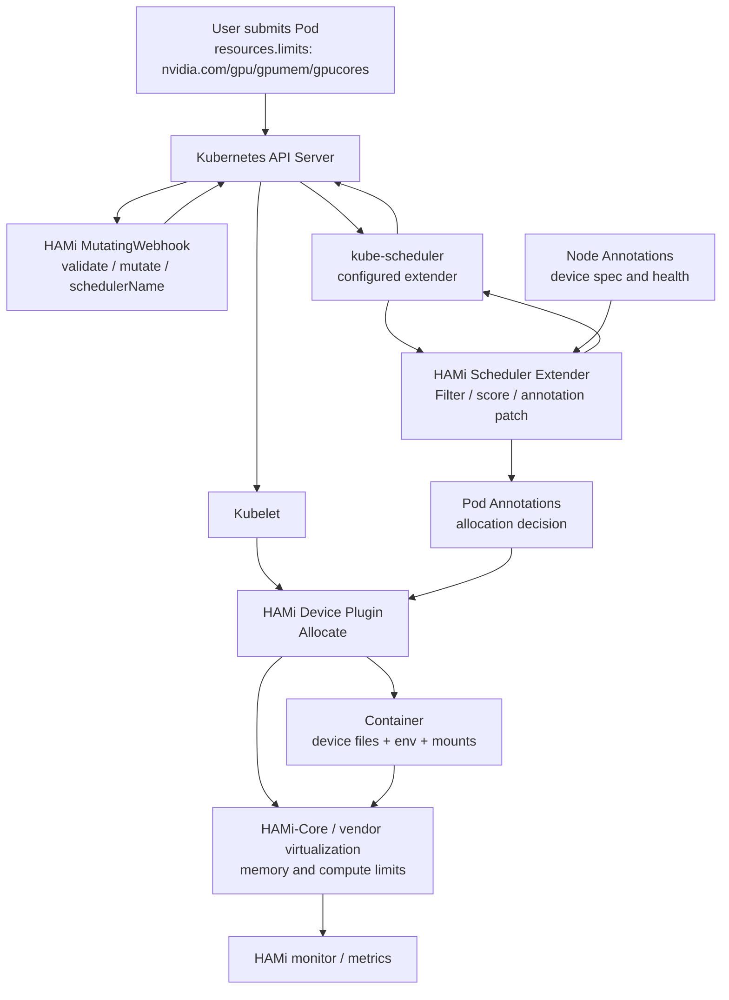
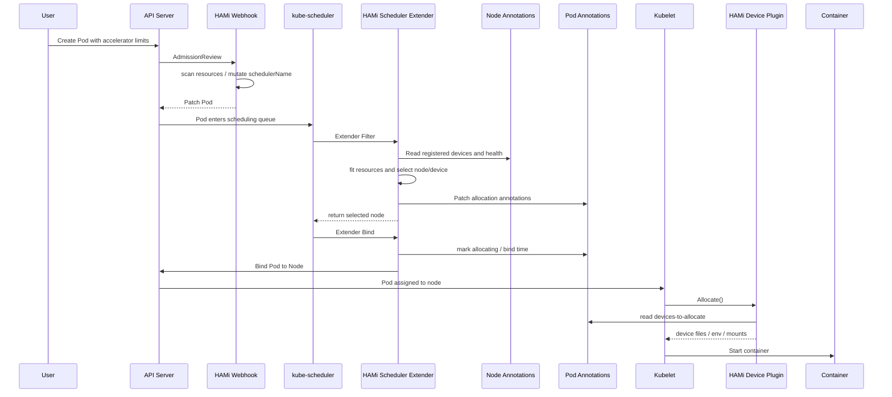
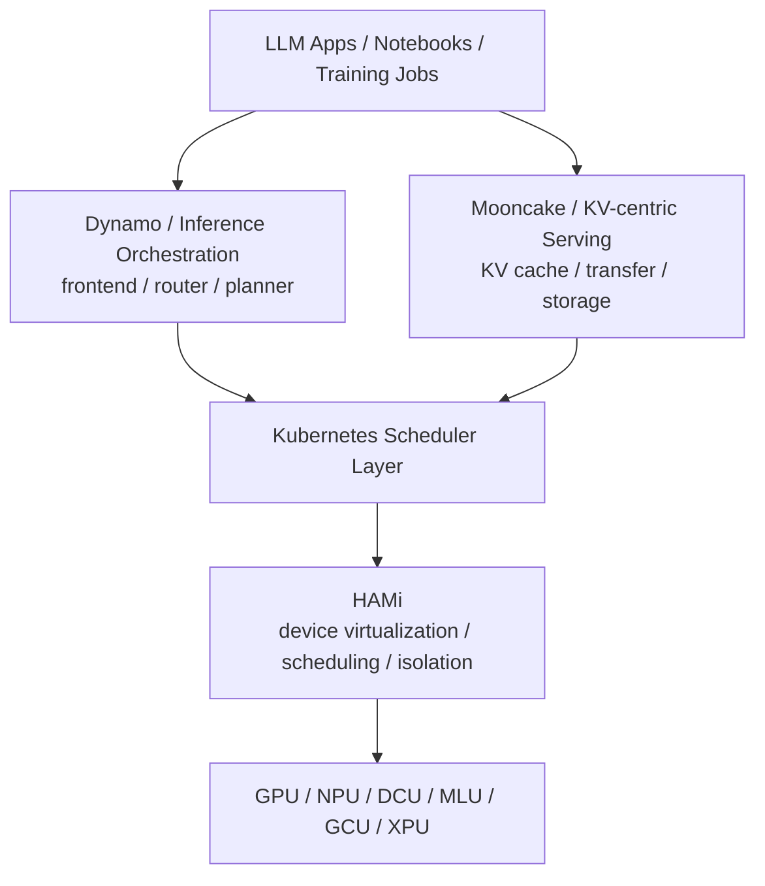

# HAMi 深度技术文档

> **Kubernetes 上的异构 AI 计算虚拟化、中间件调度与 GPU 共享机制解析**
>
> 基于 HAMi 官方仓库与官网文档整理：<https://github.com/Project-HAMi/HAMi>
>
> 稳定版本基线：`v2.10.0@4707fb02c91c545bc7343ce26dba4c32919f9a3e`，审校日期：2026-08-22。主线中的后续实现不作为 v2.10.0 的稳定能力。

---

## 目录

- [自动生成目录占位](#自动生成目录占位)

---

## 第一章：HAMi 的定位

### 1.1 HAMi 是什么

HAMi 全称 **Heterogeneous AI Computing Virtualization Middleware**，中文可理解为“异构 AI 计算虚拟化中间件”。它的前身是 `k8s-vGPU-scheduler`，目标是在 Kubernetes 集群中让 GPU、NPU、DCU、MLU、GCU、XPU 等异构 AI 加速器可以被更细粒度地共享、隔离和调度。

一句话概括：

> **Kubernetes 默认只能按整数个设备调度 GPU；HAMi 在 Kubernetes 之上补齐“显存、算力、设备型号、UUID、拓扑、厂商差异”等设备语义，并在容器内执行资源隔离。**

HAMi 不是一个训练框架，也不是推理引擎。它主要服务平台层：

| 层次 | HAMi 作用 |
|------|-----------|
| Kubernetes 调度层 | 让调度器知道设备细节，并按显存/算力/拓扑做设备选择 |
| Device Plugin 层 | 向 kubelet 注册虚拟化后的设备资源，并按调度结果注入设备 |
| 容器运行时层 | 注入 HAMi-Core 或厂商特定虚拟化组件，限制容器内显存和算力 |
| 多厂商适配层 | 把 NVIDIA、Ascend、Cambricon、Hygon、Iluvatar、MetaX、Mthreads、Enflame 等设备接入统一调度工作流 |

### 1.2 为什么 Kubernetes 原生 GPU 调度不够

Kubernetes 的标准 Device Plugin 机制可以让硬件厂商向 kubelet 注册扩展资源，例如 `nvidia.com/gpu`。但它有一个根本限制：**ListAndWatch 主要向 kubelet 报告设备数量，调度器只能看到整数个设备，不知道设备内部容量和拓扑细节。**

这带来几个问题：

| 问题 | 表现 |
|------|------|
| 整卡分配浪费 | 推理服务可能只用 20% 到 40% GPU 算力，却独占整张卡 |
| 无显存配额 | 标准 `nvidia.com/gpu: 1` 不表达“只需要 10GiB 显存” |
| 无设备细节 | 调度器看不到 GPU 型号、UUID、NUMA、MIG 模式、显存容量 |
| 多租户隔离弱 | 普通 time-slicing 可共用设备，但不能严格阻止显存互相挤爆 |
| 异构设备分散 | 不同厂商 device plugin 的资源语义、调度行为和隔离能力不统一 |

HAMi 的设计思路是绕开这些限制：Device Plugin 仍然负责向 kubelet 注册资源，但更丰富的设备规格通过 **Node Annotations** 传给 HAMi Scheduler；调度结果通过 **Pod Annotations** 传给 HAMi Device Plugin；真正的显存和算力限制在容器内由 HAMi-Core 或厂商组件执行。

### 1.3 HAMi 适合哪些场景

| 场景 | HAMi 的价值 |
|------|-------------|
| 多租户 Notebook | 多个用户共享同一 GPU，按显存/算力分配 |
| vLLM / 推理服务 | 多个小模型或低负载服务共用一张 GPU |
| 训练/推理混部 | 小任务不再整卡占用，提高集群利用率 |
| 私有 AI 云平台 | 提供统一的 GPU 配额、设备选择和隔离能力 |
| 多厂商异构集群 | 用统一调度路径管理 NVIDIA、昇腾、寒武纪、海光等设备 |
| 批处理队列 | 与 Volcano、Kueue 等系统协作处理 AI batch workload |

不适合或需要谨慎的场景：

| 场景 | 原因 |
|------|------|
| 强隔离安全边界 | 软件层 API 拦截不能等价于硬件虚拟化或 MIG 的强边界 |
| 对性能抖动极敏感 | 多 workload 共卡可能引入资源争用和尾延迟 |
| 未被支持的驱动/硬件组合 | 隔离能力依赖具体厂商后端 |
| 需要完整硬件可见性 | 容器内 `nvidia-smi` 等工具会被虚拟化显示，排障时要理解视角差异 |

### 1.4 与 NVIDIA Time-Slicing、MIG、MPS 的关系

| 技术 | 共享方式 | 隔离强度 | 适用性 |
|------|----------|----------|--------|
| NVIDIA Time-Slicing | 多 Pod 时间片共享 GPU | 无显存硬隔离 | 简单共享，但一个任务 OOM 可能影响同卡任务 |
| NVIDIA MIG | 硬件切分 GPU 实例 | 强隔离 | A100/H100 等支持 MIG 的数据中心卡 |
| NVIDIA MPS | 多进程共享 CUDA context/资源 | 中等，偏计算共享 | 适合部分 CUDA 多进程场景 |
| HAMi-Core | CUDA/NVML API 拦截与限额 | 软件层隔离 | 不改应用，适合更广泛的共享场景 |
| HAMi Dynamic MIG | 按需求动态选择 MIG profile | 依赖 MIG 硬隔离 | 希望在 MIG 和 HAMi-Core 间统一调度 |

HAMi 的核心价值不是取代所有机制，而是把这些机制纳入 Kubernetes 调度语义，并在 Pod 级别提供统一资源请求方式。

---

## 第二章：总体架构

### 2.1 四个核心组件

HAMi 的官方架构由四类组件组成：

| 组件 | 形态 | 职责 |
|------|------|------|
| HAMi MutatingWebhook | Admission webhook，嵌在 scheduler 服务中 | 扫描 Pod 资源请求，必要时改写 `schedulerName`，注入运行时配置 |
| HAMi Scheduler Extender | 调度扩展服务，通常与 kube-scheduler 同 Pod | 实现 Filter/Bind，维护全局设备视图，选择节点和具体设备 |
| HAMi Device Plugin | DaemonSet，每个设备节点运行 | 注册虚拟资源，读取 Pod annotations，向容器注入设备、环境变量和挂载 |
| In-container control | HAMi-Core 或厂商特定组件 | 在容器内限制显存、算力，提供监控和硬/软隔离 |



### 2.2 调度控制面

HAMi Scheduler 本质上是 kube-scheduler 的 extender。Helm chart 默认会在 `hami-scheduler` Pod 中同时运行 kube-scheduler 容器和 extender 容器：

| 组件 | 默认配置 |
|------|----------|
| `schedulerName` | `hami-scheduler` |
| kube-scheduler enabled | `true` |
| scheduler extender image | `projecthami/hami` |
| Admission webhook | enabled |
| leader election | enabled |
| metrics bind address | `:9395` |
| service monitor port | `31993` |

这种部署方式的优点是：HAMi 可以拥有一个独立 schedulerName，不必替换集群默认 scheduler；MutatingWebhook 只会把 HAMi 能识别的设备 workload 改写到 `hami-scheduler`。

### 2.3 节点代理面

每个 GPU/加速器节点上运行 HAMi Device Plugin。它承担两类任务：

1. **向 kubelet 注册可调度资源。** 对 NVIDIA，默认资源名包括 `nvidia.com/gpu`、`nvidia.com/gpumem`、`nvidia.com/gpumem-percentage`、`nvidia.com/gpucores`。
2. **向 HAMi Scheduler 报告设备细节。** 通过 node annotations 周期性写入设备 UUID、虚拟切分数量、总显存、总算力、型号、NUMA、健康状态、模式等信息。

### 2.4 容器内隔离面

对 NVIDIA，HAMi-Core 通过 `libvgpu.so` 等组件在容器内拦截 CUDA/NVML 相关调用。典型注入内容包括：

| 注入内容 | 作用 |
|----------|------|
| `/dev/nvidia*` 设备文件 | 让容器访问分配到的物理 GPU |
| `libvgpu.so` | CUDA/NVML API 拦截与限额 |
| `/etc/ld.so.preload` | 让容器内进程透明加载 `libvgpu.so` |
| `CUDA_DEVICE_MEMORY_LIMIT_<index>` | 每个容器视角下的显存上限 |
| `CUDA_DEVICE_SM_LIMIT` | GPU compute/SM 使用上限 |
| `NVIDIA_VISIBLE_DEVICES` | 控制容器可见设备 |

如果容器设置 `CUDA_DISABLE_CONTROL=true`，部分注入/控制会被跳过，应谨慎使用。

---

## 第三章：端到端工作流

### 3.1 Pod 提交流程

官方 README 将 HAMi 的工作流概括为：

```text
Pod submission
  -> HAMi mutating webhook
  -> HAMi scheduler filter / score / bind
  -> device allocation written to pod annotations
  -> device plugin Allocate()
  -> container runtime environment
  -> HAMi monitor and metrics
```

更细地展开：



### 3.2 MutatingWebhook

Webhook 的职责不是分配设备，而是判断这个 Pod 是否应该走 HAMi 路径。

代码中的行为包括：

| 行为 | 说明 |
|------|------|
| 解码 Pod | AdmissionReview 进入后解析 Pod |
| 检查 containers | 没有容器则拒绝 |
| 尊重已有 schedulerName | 如果用户显式指定了不同 scheduler，且未允许强制覆盖，则跳过 |
| 遍历设备后端 | 每个后端执行 `MutateAdmission()` |
| 改写 schedulerName | 如果发现 HAMi 资源，并配置了 schedulerName，则设为 `hami-scheduler` |
| 资源配额检查 | 对 NVIDIA memory/core 等做 namespace quota 适配 |

Helm 中 `scheduler.forceOverwriteDefaultScheduler=true`，意味着默认 schedulerName 可以被 HAMi 覆盖；如果用户显式指定了其他 scheduler，则通常不会强行接管。

### 3.3 Scheduler Filter

HAMi 的 Filter 阶段不是单纯过滤候选节点。它会完成大量实际决策：

1. 从 Pod containers 解析设备请求。
2. 从 scheduler 缓存拿到各节点设备状态。
3. 按 nodeSelector、taints、affinity、unschedulable 等规则过滤。
4. 为每个候选节点构造 `NodeUsage`。
5. 逐容器、逐设备类型调用设备后端的 `Fit()`。
6. 在节点内部选择具体设备 UUID。
7. 计算节点分数。
8. 排序后选择目标节点。
9. 将目标节点、时间戳、设备分配结果写入 Pod annotations。
10. 将分配写入 scheduler 本地 PodManager 和 QuotaManager 缓存。
11. 返回单个目标 node 给 kube-scheduler。

这意味着 HAMi 的“Filter”实际上承担了 **Filter + Score + Reserve-like + Annotation Patch** 的复合职责。

### 3.4 Scheduler Bind

Bind 阶段继续做保护性操作：

| 步骤 | 说明 |
|------|------|
| 读取当前 Pod | 从 informer cache 获取最新 Pod |
| 获取目标 Node | 从 node lister 获取 node |
| LockNode | 对涉及的设备类型加节点锁，避免并发分配冲突 |
| Patch Pod annotations | 写入 `allocating` 阶段与 `bind-time` |
| 调用 Kubernetes Bind | 创建 `corev1.Binding`，绑定 Pod 到 Node |
| 失败回滚 | 释放 node lock，记录失败事件 |

节点锁对多 Pod 并发调度非常关键。HAMi 的调度状态不完全依赖 kube-scheduler 原生 Reserve 插件，因此需要额外同步来避免同一设备被重复分配。

### 3.5 Device Plugin Allocate

当 kubelet 在目标节点上启动 Pod 时，会调用该节点 HAMi Device Plugin 的 `Allocate()`。Device Plugin 读取 scheduler 写入的 annotations，做以下工作：

| 工作 | 说明 |
|------|------|
| 解析设备分配结果 | 读取 `hami.io/*-devices-to-allocate` |
| 注入设备文件 | 挂载对应 `/dev/*` |
| 注入环境变量 | 如显存限制、算力限制、可见设备 |
| 注入虚拟化库 | NVIDIA 路径挂载 `libvgpu.so` 和 `ld.so.preload` |
| 更新 annotations | 分配完成后清理或更新 to-allocate 状态 |
| 生成监控视图 | 供 HAMi monitor 读取容器用量 |

---

## 第四章：资源模型

### 4.1 NVIDIA 默认资源名

Helm chart 中 NVIDIA 默认资源名：

| 资源名 | 含义 |
|--------|------|
| `nvidia.com/gpu` | 请求物理 GPU 数量；安装 HAMi 后节点上注册值默认为 vGPU 数量 |
| `nvidia.com/gpumem` | 每个请求 GPU 分配的显存，单位通常按 MiB/MB 理解 |
| `nvidia.com/gpumem-percentage` | 每个请求 GPU 分配的显存百分比 |
| `nvidia.com/gpucores` | 每个请求 GPU 分配的计算能力百分比 |
| `nvidia.com/priority` | 任务优先级，供监控/反馈逻辑使用 |

最小示例：

```yaml
apiVersion: v1
kind: Pod
metadata:
  name: gpu-pod
spec:
  containers:
    - name: ubuntu-container
      image: ubuntu:22.04
      command: ["bash", "-c", "sleep 86400"]
      resources:
        limits:
          nvidia.com/gpu: 1
          nvidia.com/gpumem: 3000
          nvidia.com/gpucores: 30
```

### 4.2 `nvidia.com/gpu` 的语义变化

HAMi 安装后，节点向 Kubernetes 注册的 `nvidia.com/gpu` 默认是虚拟化后的数量。例如一张物理 GPU 可以按 `deviceSplitCount=10` 注册成 10 个可调度 slot。

但 Pod 中的资源语义需要注意：

| 位置 | `nvidia.com/gpu` 含义 |
|------|----------------------|
| Node allocatable | 由 HAMi device plugin 上报的 vGPU slot 数量，默认每物理卡 10 |
| Pod limits | 当前 Pod 需要几张物理 GPU 上的分配份额，常见写 1 |
| Scheduler 内部 | 结合 gpumem/gpucores 判断这份额能否放到某物理卡 |

官方 README 特别提示：安装 HAMi 后节点注册的 `nvidia.com/gpu` 默认为 vGPU 数；Pod 申请时 `nvidia.com/gpu` 表示当前 Pod 所需物理 GPU 数量。

### 4.3 显存请求：绝对值与百分比

HAMi 支持两种显存表达：

| 方式 | 示例 | 适用场景 |
|------|------|----------|
| 绝对显存 | `nvidia.com/gpumem: 3000` | 需要固定显存上限，例如模型推理服务 |
| 百分比显存 | `nvidia.com/gpumem-percentage: 50` | 希望按卡容量比例分配，适配不同显存型号 |

如果同时不设置显存，代码路径会使用默认配置；若没有默认显存，则可能按 100% 处理。生产中建议显式写出显存请求，避免不同节点、不同卡型上行为不一致。

### 4.4 算力请求

`nvidia.com/gpucores` 对 NVIDIA 表达的是 compute/SM 使用上限百分比。例：

```yaml
nvidia.com/gpucores: 30
```

HAMi-Core 通过内核提交拦截和速率限制，使容器整体 GPU compute 使用收敛到限制值附近。需要注意：

| 事实 | 影响 |
|------|------|
| 它是软件层限速 | 不等同于硬件级 SM 物理切分 |
| 对 workload 形态敏感 | 不同 kernel、batch、框架可能有不同抖动 |
| core > 100 会被限制到 100 | 代码中会记录错误并夹到 100 |
| 独占语义 | 当 `gpucores=100` 且设备已被使用时，不允许冲突分配 |

### 4.5 默认补全逻辑

NVIDIA 后端有几个容易忽略的默认行为：

| 行为 | 说明 |
|------|------|
| 只写 gpumem/gpucores | 如果 `DefaultGPUNum > 0`，Webhook 可补 `nvidia.com/gpu` |
| 请求整卡显存或未设置显存 | 如果没有显式 `gpucores`，可能补 `gpucores=100` 形成独占 compute 语义 |
| `gpumem-percentage` 必须 0 到 100 | 超出范围 Admission 阶段会报错 |
| `gpumem-percentage` 内部哨兵值 101 | 代码用 101 表示未设置百分比 |

建议生产 Pod 模板总是显式写出 `gpu`、`gpumem` 或 `gpumem-percentage`、`gpucores`，避免依赖默认推断。

### 4.6 指定设备类型和 UUID

NVIDIA 后端支持通过 annotations 约束设备选择：

| Annotation | 含义 |
|------------|------|
| `nvidia.com/use-gputype` | 只使用匹配型号关键字的 GPU |
| `nvidia.com/nouse-gputype` | 排除匹配型号关键字的 GPU |
| `nvidia.com/use-gpuuuid` | 只使用指定 GPU UUID |
| `nvidia.com/nouse-gpuuuid` | 排除指定 GPU UUID |
| `nvidia.com/numa-bind` | 要求多卡选择时按 NUMA 约束 |
| `nvidia.com/vgpu-mode` | 指定 `hami-core`、`mig`、`mps` 等模式 |

这些约束会在设备后端的 `Fit()` 逻辑中参与过滤。

---

## 第五章：Node 与 Pod Annotation 协议

### 5.1 为什么需要 Annotation 协议

标准 Device Plugin 上报给 kubelet 的信息过少，无法携带完整设备属性；kube-scheduler 原生分配给 device plugin 的也主要是设备 ID，而不携带 HAMi 所需的显存/算力限额。因此 HAMi 用 annotations 建立自己的控制协议：

| 通道 | 方向 | 作用 |
|------|------|------|
| Node annotations | Device Plugin -> Scheduler | 报告设备规格、健康状态、握手状态 |
| Pod annotations | Scheduler -> Device Plugin | 传递调度结果、设备 UUID、显存和算力限制 |

### 5.2 设备注册协议

设计文档中的通用协议：

```text
hami.io/node-handshake-{device-type}: Reported_{device_node_current_timestamp}
hami.io/node-{device-type}-register: {Device 1}:{Device2}:...:{Device N}
```

每个设备字段：

```text
{Device UUID},{device split count},{device memory limit},{device core limit},{device type},{device numa},{healthy}
```

当前代码中 NVIDIA 更常见的 annotation 是：

| Annotation | 内容 |
|------------|------|
| `hami.io/node-handshake` | NVIDIA 设备握手状态 |
| `hami.io/node-nvidia-register` | NVIDIA device info JSON |
| `hami.io/node-nvidia-score` | GPU pair topology score |

`DeviceInfo` 中包含：

| 字段 | 含义 |
|------|------|
| `id` | 设备 UUID |
| `index` | 设备 index |
| `count` | 可切分/可共享数量 |
| `devmem` | 总显存 |
| `devcore` | 总算力，NVIDIA 常为 100 |
| `type` | 型号或厂商类型 |
| `numa` | NUMA 节点 |
| `mode` | `hami-core` / `mig` / `mps` |
| `health` | 健康状态 |
| `devicepairscore` | 多 GPU 拓扑评分 |

### 5.3 健康检查与握手

Scheduler 会周期性检查 node annotations。设计文档写的是 5 分钟超时，当前代码里也有 `nodeLockExpire` 等配置；具体握手健康判断还会结合 allocatable 和 handshake 状态。

握手状态大致含义：

| 状态 | 含义 |
|------|------|
| `Reported_*` | device plugin 主动报告设备状态 |
| `Requesting_*` | scheduler 请求节点更新设备状态 |
| `Deleted_*` | 设备或节点状态已被清理，可能等待恢复 |

如果设备节点长时间没有更新注册信息，scheduler 会将对应设备视为不可用或从缓存清理，避免把 workload 调度到不可靠设备上。

### 5.4 调度结果协议

Scheduler 写入 Pod annotations，典型 key：

| Annotation | 含义 |
|------------|------|
| `hami.io/vgpu-node` | Scheduler 选择的目标节点 |
| `hami.io/vgpu-time` | 调度时间戳 |
| `hami.io/bind-time` | Bind 阶段时间戳 |
| `hami.io/vgpu-devices-to-allocate` | 待 device plugin 处理的分配结果 |
| `hami.io/vgpu-devices-allocated` | 已分配设备记录 |
| `hami.io/vgpu-bind-phase` | 分配阶段，例如 `allocating` |

NVIDIA 分配结果格式：

```text
GPU-uuid,NVIDIA,3000,30:;
```

字段依次是：

| 字段 | 含义 |
|------|------|
| `GPU-uuid` | 物理 GPU UUID，MIG 时可能带模板/实例后缀 |
| `NVIDIA` | 设备类型 |
| `3000` | 分配显存 |
| `30` | 分配算力百分比 |
| `:` | 同一 container 多设备分隔 |
| `;` | 同一 Pod 多 container 分隔 |

### 5.5 多容器 Pod 的索引保持

代码中特别注意：解析 Pod devices annotation 时不能跳过空 container entry。原因是 annotation 使用 `;` 分隔容器，如果某个容器不用设备，也必须保留空占位，否则分配结果和 container index 会错位。

这对 sidecar 模式很重要。例如 vLLM benchmark 的 Pod 可能包含 server 和 client 两个容器，只有 server 需要 GPU，annotation 仍要保留容器索引关系。

---

## 第六章：调度策略

### 6.1 两级调度策略

HAMi 将调度策略分为两个维度：

| 维度 | 控制对象 | 默认值 |
|------|----------|--------|
| `node-scheduler-policy` | 选择哪个节点 | `binpack` |
| `gpu-scheduler-policy` | 节点内选择哪张卡 | `spread` |

Helm 默认：

```yaml
scheduler:
  defaultSchedulerPolicy:
    nodeSchedulerPolicy: binpack
    gpuSchedulerPolicy: spread
```

Pod 可以通过 annotations 覆盖：

```yaml
metadata:
  annotations:
    hami.io/node-scheduler-policy: "spread"
    hami.io/gpu-scheduler-policy: "binpack"
```

### 6.2 Node binpack / spread

节点分数综合设备数量、算力和显存使用率：

```text
Node Score = (Used Devices / Total Devices
            + Used Compute / Total Compute
            + Used VRAM / Total VRAM) * 10
```

策略含义：

| 策略 | 选择倾向 | 适合 |
|------|----------|------|
| node binpack | 选更满的节点 | 集中负载，释放空闲节点，利于缩容 |
| node spread | 选更空的节点 | 分散热点，降低单节点争用 |

代码中的排序逻辑与这个语义一致：spread 倾向低使用率，binpack 倾向高使用率。

### 6.3 GPU binpack / spread

设备分数综合请求后的使用率：

```text
GPU Score = ((request.core + used.core) / allocatable.core
           + (request.mem + used.mem) / allocatable.mem) * 10
```

策略含义：

| 策略 | 选择倾向 | 适合 |
|------|----------|------|
| GPU binpack | 尽量把多个 workload 放到同一张卡 | 集中碎片，保留完整空卡 |
| GPU spread | 尽量分散到不同 GPU | 降低同卡争用，默认策略 |

### 6.4 Topology-aware

NVIDIA 后端支持 `hami.io/node-nvidia-score` 表示 GPU pair score。调度时如果启用 topology 相关策略，多 GPU 请求会从候选设备组合中选择更优组合。

典型场景：

| 请求 | 策略 |
|------|------|
| 单卡请求 | 可选择与其他卡连接较弱的卡，保留高互联组合 |
| 多卡请求 | 选择互联更优的卡组合 |
| NUMA-sensitive workload | 配合 `nvidia.com/numa-bind` 约束 |

### 6.5 调度失败原因

NVIDIA `Fit()` 路径会记录多种不满足原因：

| 原因类型 | 含义 |
|----------|------|
| card not healthy | 设备不健康 |
| card type mismatch | 型号或模式不匹配 |
| card UUID mismatch | use/no-use UUID 约束不满足 |
| time slicing exhausted | device split count 已用完 |
| insufficient memory | 剩余显存不足 |
| insufficient core | 剩余算力不足 |
| exclusive conflict | 请求独占但设备已有 workload |
| quota not fit | namespace quota 不满足 |
| custom filter rule not fit | MIG 或厂商特定规则不满足 |

这些原因会进入调度事件，便于排障。

---

## 第七章：NVIDIA 虚拟化与 HAMi-Core

### 7.1 显存隔离

HAMi-Core 在容器内通过 CUDA/NVML API 拦截实现显存视图和分配限制：

| 拦截方向 | 效果 |
|----------|------|
| `nvmlDeviceGetMemoryInfo` | 让 `nvidia-smi` 等工具看到分配给容器的显存上限 |
| `cuMemAlloc*` | 分配前检查当前使用量 + 新请求是否超过限额 |
| OOM 返回 | 超过限额时返回 CUDA OOM，而不是占用整张物理卡显存 |

这就是为什么容器内 `nvidia-smi` 可能显示一张 V100 只有 10GiB 显存：这不是物理卡变小，而是 HAMi-Core 虚拟化后的视角。

### 7.2 算力限制

对 compute limit，HAMi-Core 会拦截 kernel submission，并通过速率限制控制 kernel 提交节奏：

| 机制 | 说明 |
|------|------|
| 拦截 `cuLaunchKernel` 等调用 | kernel 提交前进入 limiter |
| 维护全局 token/counter | 用 kernel grid 等粒度消耗配额 |
| 后台线程补充配额 | 根据实际 GPU utilization 和上限动态补充 |
| 超额时等待 | 通过 sleep/spin 等方式推迟提交 |

这是一种软件层的使用率控制，目标是让容器整体 compute 使用收敛到 `CUDA_DEVICE_SM_LIMIT`，不是硬件物理隔离。

### 7.3 `libvgpu.so` 注入路径

官方 GPU virtualization 文档中描述的注入链路：

1. Device Plugin 在 Allocate 响应中返回设备文件。
2. 将 host 上的 `libvgpu.so` 挂载进容器。
3. 将 host 上的 `ld.so.preload` 挂载到容器 `/etc/ld.so.preload`。
4. 容器进程启动时 Linux dynamic linker 自动预加载 `libvgpu.so`。
5. `libvgpu.so` 覆盖 `dlsym`，拦截 `cu*`、`nvml*` 等函数。

优势是无需修改应用代码；代价是它依赖动态链接和 CUDA/NVML 调用路径，对某些静态链接、非标准 runtime 或直接访问底层设备的工具可能不完全生效。

### 7.4 Monitor 与共享内存

HAMi monitor 会读取容器路径下的 cache 文件和共享内存结构，采集容器级用量。代码中 `pkg/monitor/nvidia/v1/spec.go` 包含共享区域字段，例如：

| 字段 | 含义 |
|------|------|
| `limit` | 每设备显存限制 |
| `smLimit` | SM/compute 限制 |
| `procs` | 容器内进程槽 |
| `deviceUtil` | SM/编码/解码等利用率 |
| `priority` | 任务优先级 |
| `lastKernelTime` | 最近 kernel 时间 |

这些信息支撑 HAMi 的监控和 Grafana 展示。

---

## 第八章：Dynamic MIG、MPS 与 DRA

### 8.1 Dynamic MIG 的目标

NVIDIA MIG 的 profile 是固定组合，传统做法通常要提前配置实例。HAMi Dynamic MIG 的目标是：用户仍然按 HAMi 资源方式请求 `nvidia.com/gpu` 和 `nvidia.com/gpumem`，系统根据需求选择合适 MIG geometry，必要时动态创建 MIG slice。

设计文档目标包括：

| 目标 | 说明 |
|------|------|
| CPU/Memory/GPU 联合调度 | 不只看 GPU |
| GPU dynamic slice | 支持 HAMi-Core 和 MIG 两种切分 |
| node-level binpack/spread | 按 GPU memory、CPU、Mem 做节点策略 |
| 统一 vGPU pool | 对不同虚拟化技术提供统一池化抽象 |
| workload 可选择模式 | Pod 可指定只用 MIG、只用 HAMi-Core 或两者 |

### 8.2 MIG 配置

Dynamic MIG 依赖 config map 中的 `knownMigGeometries`：

```yaml
nvidia:
  resourceCountName: nvidia.com/gpu
  resourceMemoryName: nvidia.com/gpumem
  resourceCoreName: nvidia.com/gpucores
  knownMigGeometries:
  - models: ["A100-40GB-PCIe"]
    allowedGeometries:
      - 
        - name: 1g.5gb
          memory: 5120
          count: 7
      - 
        - name: 2g.10gb
          memory: 10240
          count: 3
        - name: 1g.5gb
          memory: 5120
          count: 1
```

节点还可以指定 operating mode：

```yaml
nodeconfig:
  - name: nodeA
    operatingmode: hami-core
  - name: nodeB
    operatingmode: mig
```

### 8.3 Pod 选择模式

示例：

```yaml
metadata:
  annotations:
    nvidia.com/vgpu-mode: "mig"
spec:
  containers:
    - resources:
        limits:
          nvidia.com/gpu: 2
          nvidia.com/gpumem: 8000
```

当节点上有空 A100-PCIE-40GB，且请求两个 8GiB vGPU 时，Dynamic MIG 可能选择 `2g.10gb` profile，给容器分配两个 2g.10gb 实例。

### 8.4 MPS

NVIDIA 后端代码中定义了 `mps` 模式。MPS 的核心价值是提升多 CUDA 进程共享 GPU 的效率，但它不是所有 workload 的万能方案。实际是否使用 MPS，需要看设备模式、驱动、Pod annotations 和 HAMi 配置。

### 8.5 DRA 方向

Kubernetes Dynamic Resource Allocation 在 v1.34 进入 GA。DRA 提供 `ResourceClaim`、`DeviceClass`、`ResourceSlice` 等 API，让调度器能直接读取设备属性。HAMi v2.10.0 的默认路径仍是 Device Plugin + annotations，但 chart 已包含默认关闭的 `dra.enabled` 和 `hami-dra` subchart；启用后不会部署原 scheduler extender/device plugin 路径。

这说明 HAMi 正在向 Kubernetes 原生细粒度设备 API 演进：

| v2.10.0 默认路径 | DRA 路径 |
|----------|----------|
| Node annotations 承载设备规格 | ResourceSlice 承载设备属性 |
| Pod annotations 传递分配结果 | ResourceClaim 表达资源声明 |
| Scheduler extender 读取自定义协议 | Scheduler 读取 DRA API |
| 对旧 Kubernetes 友好 | 需要 Kubernetes 1.34+ |

---

## 第九章：异构设备支持

### 9.1 官方支持矩阵

HAMi 官网 v2.10.0 支持矩阵列出的设备包括：

| 类型 | 厂商 | 型号 | 显存隔离 | 算力隔离 | 多卡支持 |
|------|------|------|----------|----------|----------|
| GPU | NVIDIA | All | Yes | Yes | Yes |
| MLU | Cambricon | 370, 590 | Yes | Yes | No |
| DCU | Hygon | All | Yes | Yes | No |
| NPU | Huawei Ascend | 910B, 910B3, 910C, 310P | Yes | Yes | No |
| GPU | Iluvatar | All | Yes | Yes | No |
| GPU | Mthreads | MTT S4000 | Yes | Yes | No |
| GPU | MetaX | MXC500 | Yes | Yes | No |
| GCU | Enflame | S60 | Yes | Yes | No |
| XPU | Kunlunxin | P800 | Yes | Yes | No |
| GPU | Vastai | VA16 | Yes | Yes | No |
| DPU | Teco | Checking | In progress | In progress | No |

实际能力会随硬件型号、驱动和厂商插件变化，生产前应以所用 HAMi release 的官网支持矩阵与对应设备文档为准。

### 9.2 多厂商后端代码结构

仓库中 `pkg/device` 下包含多个后端：

| 路径 | 设备 |
|------|------|
| `pkg/device/nvidia` | NVIDIA GPU |
| `pkg/device/ascend` | Huawei Ascend NPU |
| `pkg/device/cambricon` | Cambricon MLU |
| `pkg/device/hygon` | Hygon DCU |
| `pkg/device/iluvatar` | Iluvatar GPU |
| `pkg/device/metax` | MetaX GPU / sGPU |
| `pkg/device/mthreads` | Moore Threads GPU |
| `pkg/device/enflame` | Enflame GCU |
| `pkg/device/kunlun` | Kunlunxin XPU |
| `pkg/device/awsneuron` | AWS Neuron |
| `pkg/device/biren` | Biren GPU |
| `pkg/device/vastai` | Vastai VA |
| `pkg/device/amd` | AMD GPU 设计/实现方向 |

### 9.3 资源名差异

Helm values 中默认资源名：

| 厂商 | 设备数量资源 | 显存资源 | 算力资源 |
|------|--------------|----------|----------|
| NVIDIA | `nvidia.com/gpu` | `nvidia.com/gpumem` / `nvidia.com/gpumem-percentage` | `nvidia.com/gpucores` |
| Cambricon | `cambricon.com/vmlu` | `cambricon.com/mlu.smlu.vmemory` | `cambricon.com/mlu.smlu.vcore` |
| Hygon | `hygon.com/dcunum` | `hygon.com/dcumem` | `hygon.com/dcucores` |
| MetaX | `metax-tech.com/sgpu` | `metax-tech.com/vmemory` | `metax-tech.com/vcore` |
| Enflame | `enflame.com/drs-gcu` | `enflame.com/gcu-memory` | `enflame.com/gcu-core` |
| Kunlunxin | `kunlunxin.com/xpu` / `kunlunxin.com/vxpu` | `kunlunxin.com/vxpu-memory` | 依后端 |
| Vastai | `vastaitech.com/va` | 依后端 | 依后端 |
| Biren | `birentech.com/gpu` | 依后端 | 依后端 |

### 9.4 AMD 方向的特殊点

AMD 设计文档提出使用 `LD_AUDIT` 而不是 `LD_PRELOAD`，原因是在 ROCm 7.x 原型中 `LD_PRELOAD` 拦截 HIP 符号会导致递归重入。AMD 方案还提出通过 `ROC_GLOBAL_CU_MASK` 做 CU 级别分配。

限制包括：

| 限制 | 说明 |
|------|------|
| `amd-smi` / `rocm-smi` 不虚拟化 | 这些工具读取 sysfs/drm，不走 HIP 拦截路径 |
| CU mask 非重叠是目标 | 但零干扰不保证 |
| node lock enforcement 仍有 TODO | 设计文档中说明相关实现待完善 |

---

## 第十章：安装、配置与运行

### 10.1 前置条件

NVIDIA 路径常见前置条件：

| 组件 | 要求 |
|------|------|
| NVIDIA Driver | README 写 >= 440 |
| CUDA | 官网 Helm guide 写 v10.2+ |
| nvidia-docker / nvidia-container-toolkit | 需要配置 NVIDIA runtime |
| Kubernetes | README 写 >= 1.23；官网 Helm guide 对 kubectl 写 v1.16+ |
| Helm | v3+ |
| 节点标签 | 可按示例使用 `gpu=on` 限制调度范围；chart 默认 selector 为空 |

### 10.2 Helm 安装

如果希望 HAMi 只处理显式标记的 GPU 节点，可以先标记节点：

```bash
kubectl label nodes <node-name> gpu=on
```

添加 Helm 仓库：

```bash
helm repo add hami-charts https://project-hami.github.io/HAMi/
helm repo update
```

安装：

```bash
helm install hami hami-charts/hami -n kube-system
```

官网 Helm guide 建议设置 kube-scheduler image tag 与集群版本匹配。例如 Kubernetes 1.29.0：

```bash
helm install hami hami-charts/hami \
  --set scheduler.kubeScheduler.imageTag=v1.29.0 \
  -n kube-system
```

验证：

```bash
kubectl get pods -n kube-system
```

期望 `hami-device-plugin` 和 `hami-scheduler` 处于 Running。

### 10.3 关键 Helm 配置

| 配置 | 默认 | 说明 |
|------|------|------|
| `global.imageTag` | `v2.10.0` | chart 默认镜像 tag |
| `schedulerName` | `hami-scheduler` | Webhook 改写的 schedulerName |
| `scheduler.defaultSchedulerPolicy.nodeSchedulerPolicy` | `binpack` | 默认节点策略 |
| `scheduler.defaultSchedulerPolicy.gpuSchedulerPolicy` | `spread` | 默认 GPU 策略 |
| `scheduler.admissionWebhook.enabled` | `true` | 是否安装 webhook |
| `scheduler.admissionWebhook.failurePolicy` | `Ignore` | webhook 异常时是否阻断 |
| `devicePlugin.deviceSplitCount` | `10` | 单 GPU 默认切分 slot 数 |
| `devicePlugin.migStrategy` | `none` | MIG 策略 |
| `devicePlugin.disablecorelimit` | `false` | 是否禁用 core limit |
| `devicePlugin.deviceListStrategy` | `envvar` | 设备列表传递策略 |
| `dra.enabled` | `false` | 是否启用 DRA 路径 |

### 10.4 Webhook 选择器

Chart 支持 namespace 和 object 选择器：

| 配置 | 作用 |
|------|------|
| `scheduler.admissionWebhook.whitelistNamespaces` | 排除命名空间 |
| `scheduler.admissionWebhook.namespaceSelector` | 控制哪些 namespace 应用 webhook |
| `scheduler.admissionWebhook.objectSelector` | 控制哪些 Pod 应用 webhook |

默认注释中提示可以用 `hami.io/webhook: ignore` 之类标签排除 webhook。

### 10.5 与 NVIDIA GPU Operator 共存

HAMi README 明确提到可以与 NVIDIA GPU Operator 共存：GPU Operator 负责驱动等底层组件，HAMi 负责调度和共享。实际部署时要避免两个 device plugin 注册同名资源冲突，确保由 HAMi 的设备插件负责 `nvidia.com/gpu` 等资源。

---

## 第十一章：可观测性与 WebUI

### 11.1 Metrics

HAMi 暴露 Prometheus metrics。安装后 scheduler monitor endpoint 默认：

```text
http://<scheduler-ip>:<monitor-port>/metrics
```

默认端口：

| 配置 | 默认 |
|------|------|
| `scheduler.service.monitorPort` | `31993` |
| `scheduler.service.monitorTargetPort` | `9395` |
| `scheduler.metricsBindAddress` | `:9395` |

仓库中的 `pkg/metrics/metrics.go` 定义了 `hami_build_info`，用于暴露版本、revision、build date、Go 版本、编译器和平台等信息。

### 11.2 NVIDIA 容器用量监控

HAMi monitor 会扫描容器目录，例如 Helm 默认：

```yaml
devicePlugin:
  monitor:
    ctrPath: /usr/local/vgpu/containers
```

它会读取容器 cache 和共享内存区域，聚合：

| 指标方向 | 含义 |
|----------|------|
| device memory context/module/buffer/offset/total | 容器 GPU 显存使用拆分 |
| SM utilization | 容器侧计算利用率 |
| memory limit | 容器分配显存上限 |
| SM limit | 容器分配 compute 上限 |
| process slots | 容器内进程级信息 |

### 11.3 Grafana 与 WebUI

HAMi 提供：

| 组件 | 作用 |
|------|------|
| HAMi-WebUI | 可视化集群和设备管理 |
| Grafana dashboard | 展示 vGPU 使用、显存、利用率等 |
| benchmark material | 对比 HAMi vGPU 与 native NVIDIA device plugin |

### 11.4 Benchmark

仓库 `benchmarks/README.md` 提供 vLLM benchmark，用 sidecar Pod 运行：

| 容器 | 作用 |
|------|------|
| `vllm-server` | 运行 OpenAI-compatible vLLM server |
| `benchmark-client` | 发送 streaming 请求，记录 TTFT 和 per-token latency |

它支持对比：

| 部署 | 说明 |
|------|------|
| `job-on-hami.yml` | HAMi vGPU 路径 |
| `job-on-nvidia-device-plugin.yml` | 原生 NVIDIA device plugin baseline |

这类 benchmark 适合评估共享 GPU 对 TTFT、per-token latency 和尾延迟的影响。

---

## 第十二章：生态集成

### 12.1 vLLM

vLLM 是 HAMi 的典型推理场景。通过显存上限，可以让多个 vLLM server 或多个小模型共用一张 GPU。

实践建议：

| 建议 | 原因 |
|------|------|
| 明确设置 `gpumem` | vLLM 的 KV Cache 会吃显存，必须留足上限 |
| 控制并发和 max model length | 防止 vLLM 内部调度突破 HAMi 配额后频繁 OOM |
| benchmark 真实负载 | 共享后的 TTFT/ITL 与 batch、prompt 长度高度相关 |
| 区分开发和生产策略 | 开发可 spread，生产可按碎片/缩容目标选择 binpack |

### 12.2 Volcano

HAMi 可与 Volcano 配合，用于 batch-oriented AI workload：

| Volcano 能力 | 与 HAMi 结合方式 |
|--------------|------------------|
| Gang scheduling | 多 Pod 训练任务整体调度 |
| Queue | 多租户队列管理 |
| Batch scheduling | 作业级调度 |
| HAMi vGPU | 设备细粒度资源共享和隔离 |

### 12.3 Kueue

README 提到 Kueue 可通过 ResourceTransformation 暴露 HAMi 资源，实现 batch job queueing。适合希望用 Kubernetes 原生 batch queue 管理 AI 资源的团队。

### 12.4 Prometheus / Grafana

HAMi 原生暴露 metrics，并提供 dashboard 样例。生产落地时建议至少监控：

| 指标类别 | 关注点 |
|----------|--------|
| 节点设备注册 | 是否有节点设备未上报或健康异常 |
| Pod 分配状态 | 是否长期停留 allocating |
| GPU 显存用量 | 是否接近配额或物理上限 |
| GPU 利用率 | 是否共享后争用明显 |
| 调度失败原因 | 是否大量 memory/core/type/UUID 不匹配 |
| Webhook 错误 | 是否 Admission 异常导致 Pod 未被 HAMi 接管 |

---

## 第十三章：生产实践与限制

### 13.1 生产落地检查清单

| 类别 | 检查项 |
|------|--------|
| Runtime | NVIDIA runtime 是否配置为默认 runtime，或 runtimeClass 是否正确 |
| 节点标签 | GPU 节点是否有 `gpu=on` 或 chart 指定 selector |
| 资源名 | 是否只有 HAMi device plugin 注册 `nvidia.com/gpu` |
| Webhook | namespace/object selector 是否覆盖目标 workload |
| Scheduler | `schedulerName` 是否为 `hami-scheduler` |
| Helm image | kube-scheduler image tag 是否匹配集群版本 |
| 设备注册 | node annotations 是否有 `hami.io/node-nvidia-register` |
| Pod 分配 | pod annotations 是否有 `vgpu-devices-allocated` |
| 隔离验证 | 容器内 `nvidia-smi` 显示的显存上限是否符合请求 |
| 监控 | Prometheus 是否采集 scheduler/device plugin/monitor 指标 |

### 13.2 常见误区

| 误区 | 正确理解 |
|------|----------|
| HAMi 等于 MIG | HAMi-Core 是软件层隔离；MIG 是硬件切分；HAMi 可以调度 MIG |
| `nvidia.com/gpu: 1` 永远表示一整张卡 | HAMi 安装后节点 allocatable 是 vGPU slot；Pod 里还要结合 gpumem/gpucores |
| 只看 kubelet allocatable 就能知道显存 | 显存和设备属性主要在 HAMi node annotations 中 |
| `nvidia-smi` 看到的显存就是物理显存 | 容器内可能是 HAMi-Core 虚拟化后的视图 |
| 软件限速等于硬件隔离 | compute limit 是软件层控制，不能完全消除干扰 |
| 所有厂商能力一致 | 支持矩阵显示各厂商显存/算力/多卡能力不同 |

### 13.3 限制与风险

| 限制 | 说明 |
|------|------|
| 软件拦截边界 | 对不经过 CUDA/NVML/HIP 等标准路径的访问可能不生效 |
| 驱动/框架兼容性 | CUDA、ROCm、厂商 runtime 版本会影响拦截和监控 |
| 调度状态一致性 | Scheduler cache、Pod annotations、Device Plugin Allocate 需要保持一致 |
| 共享性能抖动 | 多 workload 共享同卡会引入 cache、memory bandwidth、SM 争用 |
| 故障恢复复杂 | Pod 删除、节点删除、handshake 过期、annotation 残留都可能影响资源回收 |
| 多厂商差异 | 不同设备后端功能成熟度不一，不能按 NVIDIA 路径类推 |

### 13.4 排障路径

如果 Pod Pending：

1. 查看 Pod events，确认是否由 `hami-scheduler` 调度。
2. 查看 Pod annotations 是否被 webhook 改写。
3. 查看 node labels 是否匹配 `gpu=on`。
4. 查看 node annotations 是否存在设备注册信息。
5. 查看 scheduler 日志中的 failed reason。
6. 检查是否有显存、算力、UUID、型号、NUMA 或 quota 不满足。

如果 Pod Running 但隔离不生效：

1. 查看 Device Plugin Allocate 日志。
2. 检查容器内 `/etc/ld.so.preload`。
3. 检查 `CUDA_DISABLE_CONTROL` 是否被设置。
4. 检查 `CUDA_DEVICE_MEMORY_LIMIT_*` 和 `CUDA_DEVICE_SM_LIMIT`。
5. 确认应用是否走 CUDA/NVML 动态链接路径。
6. 对 AMD/其他厂商检查对应 runtime 环境变量和厂商插件。

---

## 第十四章：与 Mooncake、Dynamo 的关系

### 14.1 分层关系

HAMi、Dynamo、Mooncake 关注的层次不同：

| 系统 | 主要层次 | 解决什么 |
|------|----------|----------|
| HAMi | Kubernetes 设备虚拟化和调度 | GPU/异构设备共享、隔离、调度、监控 |
| Dynamo | 数据中心推理编排 | LLM Frontend、Router、Prefill/Decode、KV-aware routing、Planner |
| Mooncake | KV Cache / 数据移动系统 | KVCache 存储、传输、路由、分离式推理优化 |

可以把 HAMi 看作更底层的 GPU 资源池管理能力；Dynamo/Mooncake 是更上层的 LLM 推理系统。三者在一个 AI 平台里可以互补：



### 14.2 与推理服务共用时的关注点

如果用 HAMi 承载 vLLM/SGLang/TensorRT-LLM 推理：

| 关注点 | 建议 |
|--------|------|
| 显存上限 | 模型权重 + KV Cache + runtime buffer 必须小于 `gpumem` |
| PagedAttention / KV Cache | 配额过小会导致频繁 OOM 或吞吐下降 |
| 多实例共卡 | 每个实例 batch/concurrency 需要收敛到配额 |
| 监控视角 | 容器内和节点物理视角要同时看 |
| 性能隔离 | 软件层算力限制不保证完全无干扰，要基准测试 |

---

## 附录：关键命令与参考资料

### A.1 常用命令

安装：

```bash
kubectl label nodes <node-name> gpu=on
helm repo add hami-charts https://project-hami.github.io/HAMi/
helm repo update
helm install hami hami-charts/hami -n kube-system
```

指定 kube-scheduler image：

```bash
helm install hami hami-charts/hami \
  --set scheduler.kubeScheduler.imageTag=v1.29.0 \
  -n kube-system
```

查看组件：

```bash
kubectl get pods -n kube-system | grep hami
```

查看节点设备注册：

```bash
kubectl get node <node-name> -o jsonpath='{.metadata.annotations.hami\.io/node-nvidia-register}'
```

查看 Pod 分配：

```bash
kubectl get pod <pod-name> -o yaml | grep -A8 "hami.io"
```

查看 metrics：

```bash
curl http://<scheduler-ip>:31993/metrics
```

### A.2 官方参考

| 主题 | 链接 |
|------|------|
| GitHub 仓库 | <https://github.com/Project-HAMi/HAMi> |
| v2.10.0 源码快照 | <https://github.com/Project-HAMi/HAMi/tree/v2.10.0> |
| 官网文档 | <https://project-hami.io/docs> |
| HAMi 是什么 | <https://project-hami.io/docs/> |
| 架构 | <https://project-hami.io/docs/core-concepts/architecture> |
| GPU Virtualization Principles | <https://project-hami.io/docs/core-concepts/gpu-virtualization> |
| Helm 安装 | <https://project-hami.io/docs/get-started/deploy-with-helm> |
| 支持设备矩阵 | <https://project-hami.io/docs/userguide/device-supported> |
| README | <https://github.com/Project-HAMi/HAMi/blob/v2.10.0/README.md> |
| 中文 README | <https://github.com/Project-HAMi/HAMi/blob/v2.10.0/README_cn.md> |
| Design | <https://github.com/Project-HAMi/HAMi/blob/v2.10.0/docs/develop/design.md> |
| Protocol | <https://github.com/Project-HAMi/HAMi/blob/v2.10.0/docs/develop/protocol.md> |
| Scheduler Policy | <https://github.com/Project-HAMi/HAMi/blob/v2.10.0/docs/develop/scheduler-policy.md> |
| Dynamic MIG | <https://github.com/Project-HAMi/HAMi/blob/v2.10.0/docs/develop/dynamic-mig.md> |
| Helm Chart Values | <https://github.com/Project-HAMi/HAMi/blob/v2.10.0/charts/hami/README.md> |
