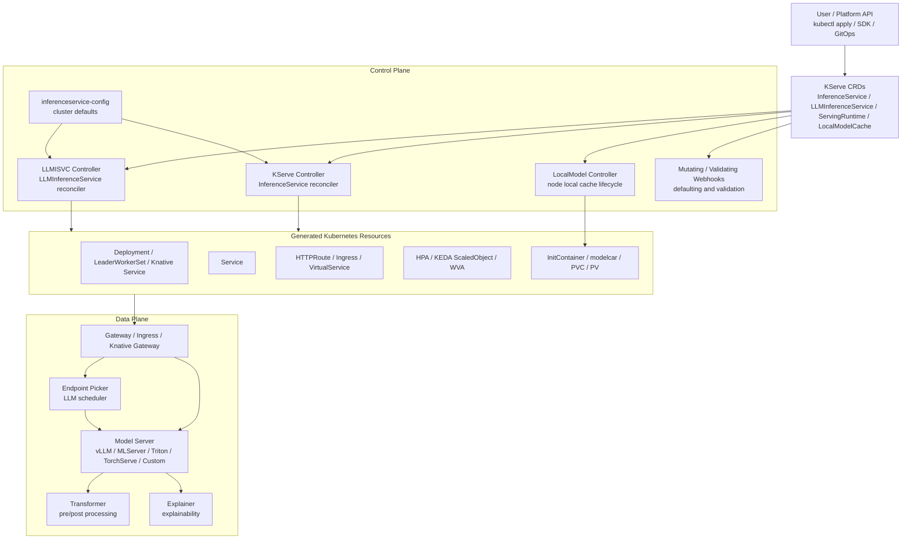
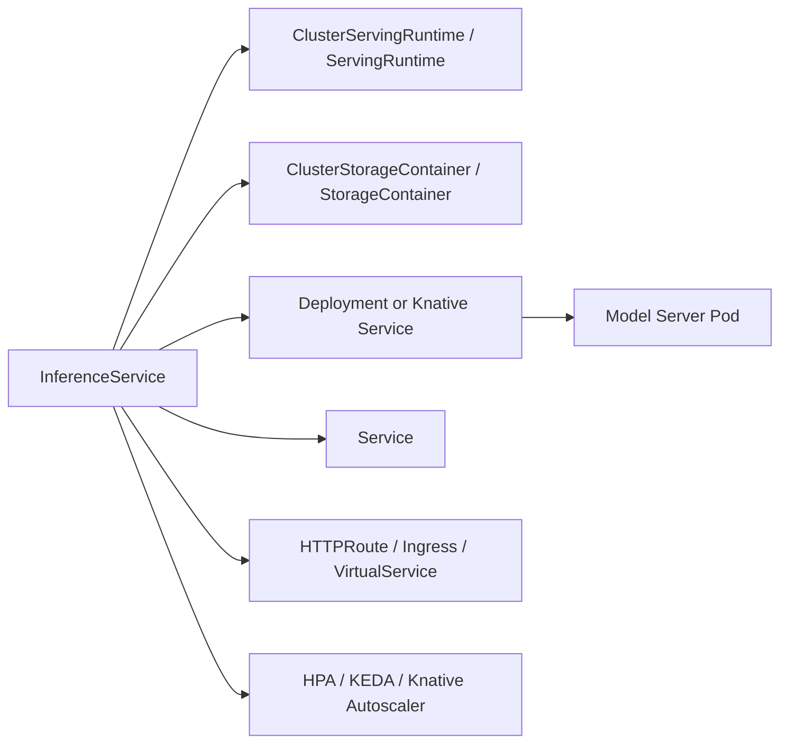
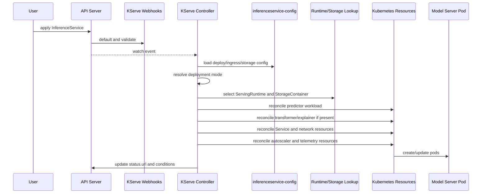
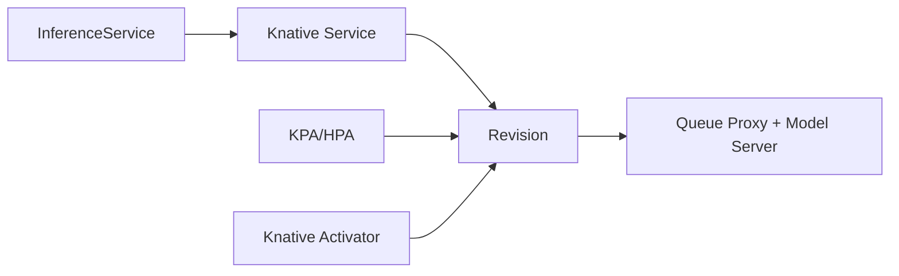
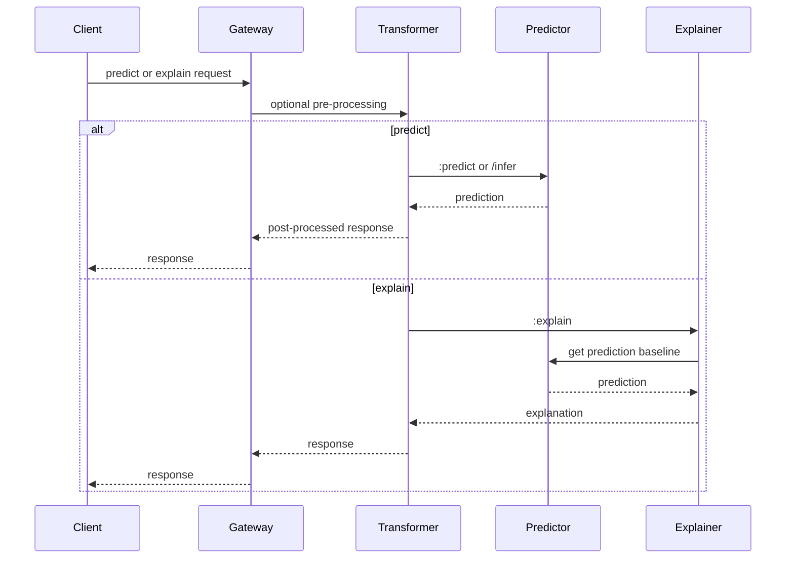
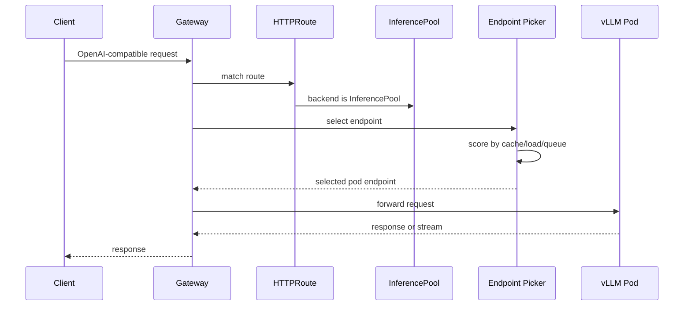
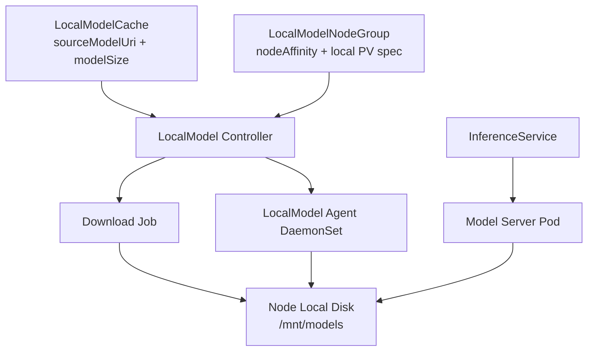
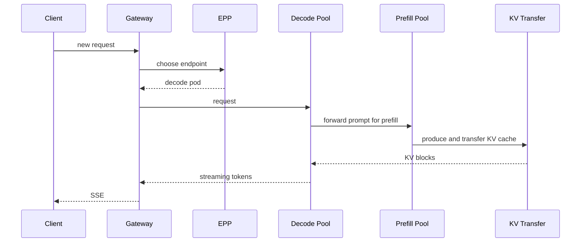
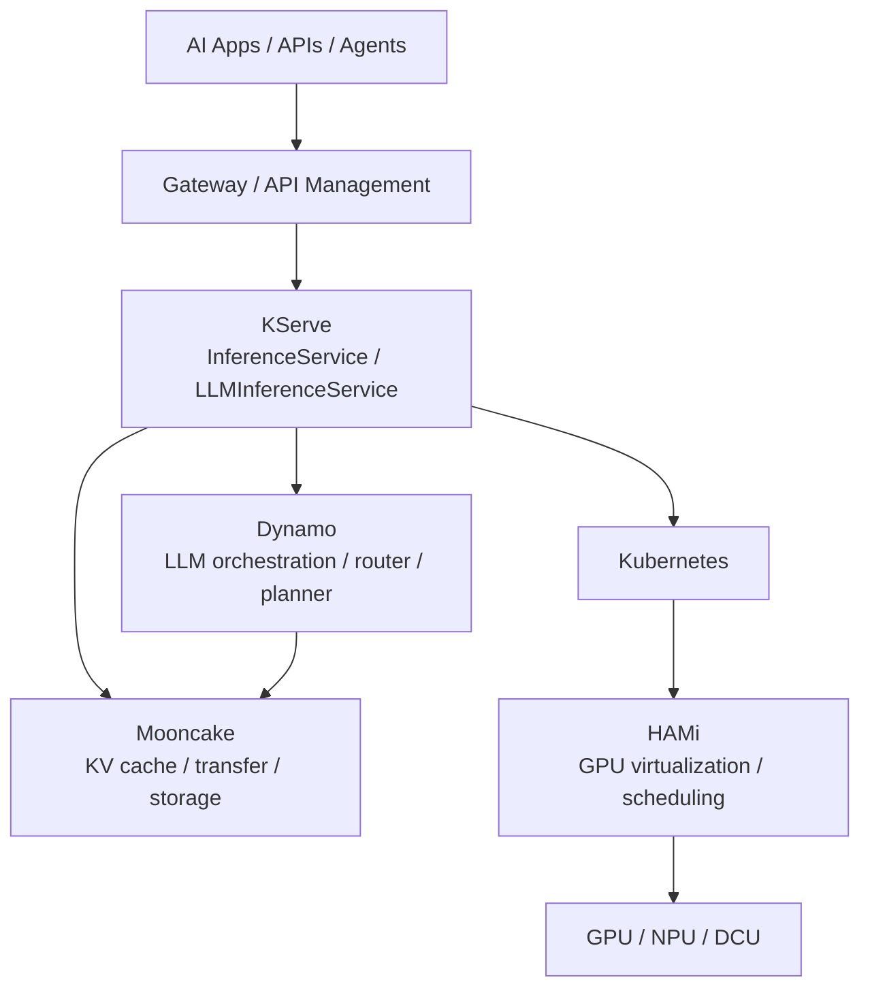

# KServe 深度技术文档

> **Kubernetes 上统一的生成式 AI 与预测式 AI 推理服务平台解析**
>
> 基于 KServe 官方仓库与官网文档整理：<https://github.com/kserve/kserve>
>
> 文档快照：`kserve/kserve` master 分支 `9f680738c3e09f57bbee4336e9e2401a99202fd7`，`kserve/website` main 分支 `f4f7147b9c6401a91ee94af9ddd4ba0f9fb0937a`，整理日期：2026-07-09

---

## 目录

- [自动生成目录占位](#自动生成目录占位)

---

## 第一章：KServe 的定位

### 1.1 KServe 是什么

用户写的 “kserver” 对应的官方项目名是 **KServe**。KServe 是一个 Kubernetes 原生的 AI 推理平台，目标是用 Kubernetes CRD 把模型服务声明成资源对象，再由控制器自动生成 Deployment、Service、Gateway/Ingress、Autoscaler、Storage Initializer、Model Cache 等运行时资源。

一句话概括：

> **KServe 不是模型推理引擎，而是 Kubernetes 上的模型服务控制面和数据面封装层。它负责把模型、运行时、流量入口、弹性伸缩、存储下载、灰度发布和监控能力组合成一个可运维的推理服务。**

它同时覆盖两类推理：

| 推理类型 | 典型模型 | KServe 资源路径 | 重点能力 |
|----------|----------|----------------|----------|
| Predictive AI | scikit-learn、XGBoost、TensorFlow、PyTorch、ONNX、Triton | `InferenceService` | 标准预测协议、transformer、explainer、canary、scale-to-zero |
| Generative AI | vLLM、Hugging Face LLM、llm-d | `InferenceService` 或 `LLMInferenceService` | OpenAI-compatible API、流式响应、GPU、模型缓存、KV cache、智能路由 |

### 1.2 KServe 解决什么问题

直接用 Kubernetes 部署模型服务并不难，但生产化后会遇到一组重复问题：

| 问题 | 没有 KServe 时的表现 | KServe 提供的抽象 |
|------|----------------------|------------------|
| 运行时差异 | 每种框架都要写不同 Deployment/容器参数 | `ServingRuntime` 和内置 runtime |
| 模型下载 | 每个服务都要处理 S3/GCS/HF/PVC/OCI 下载和凭证 | `storageInitializer`、`StorageContainer`、modelcar |
| 推理协议 | 不同 server API 不一致 | V1、V2/Open Inference Protocol、OpenAI-compatible API |
| 流量入口 | Ingress/Gateway/Knative/Istio 配置分散 | Controller 生成或引用入口资源 |
| 弹性伸缩 | HPA/KEDA/Knative 配置重复 | 通过 `InferenceService`/`LLMInferenceService` 声明 |
| 多组件推理 | 预处理、预测、解释链路难统一 | predictor、transformer、explainer、InferenceGraph |
| LLM 生产能力 | KV cache、P/D 分离、multi-node、GPU 调度复杂 | `LLMInferenceService` + Gateway API Inference Extension + LeaderWorkerSet |

### 1.3 双轨策略：InferenceService 与 LLMInferenceService

KServe 当前呈现明显的双轨策略：

| 资源 | API 版本 | 面向场景 | 是否推荐给 LLM |
|------|----------|----------|----------------|
| `InferenceService` | `serving.kserve.io/v1beta1` | 通用单模型 serving，预测式模型，标准 LLM serving | 可以用于基础 LLM |
| `LLMInferenceService` | 当前 master storage version 为 `serving.kserve.io/v1alpha2` | 高级 LLM serving，prefix-aware routing，P/D 分离，多节点 | 高级 LLM 推荐 |

官网部分示例仍使用 `v1alpha1` 的 `LLMInferenceService`，而当前 master 代码已经包含 `v1alpha2` 类型与转换逻辑。实际落地时应以目标 release 的 CRD 和文档为准，不要混用 master 字段和旧 release YAML。

### 1.4 KServe 不是什么

| 不是 | 说明 |
|------|------|
| 不是 vLLM/Triton/TensorFlow Serving 的替代品 | KServe 调度和管理这些 model server，而不是替代核心推理执行 |
| 不是 GPU 虚拟化系统 | GPU 共享/隔离仍依赖 Kubernetes device plugin、DRA、HAMi、MIG、MPS 等底层能力 |
| 不是 KV cache 系统本身 | KServe 可以集成 LMCache、vLLM KV transfer、llm-d routing，但不等于 Mooncake 或 Dynamo KVBM |
| 不是只适合 serverless | 当前生产 LLM 更推荐 Standard Kubernetes Deployment + Gateway API |

---

## 第二章：总体架构

### 2.1 两个平面

KServe 可以按 Control Plane 和 Data Plane 理解。



控制面负责把期望状态变成 Kubernetes 对象；数据面负责处理真实推理请求。控制面故障通常不应中断已经运行的模型服务，但会影响扩缩容、滚动更新和新资源创建。

### 2.2 核心组件

| 组件 | 形态 | 职责 |
|------|------|------|
| KServe Controller | Deployment | watch `InferenceService`、`ServingRuntime` 等资源，生成 workload/network/autoscaler/storage 资源 |
| LLMISVC Controller | Deployment，可单独安装 | watch `LLMInferenceService` 和 `LLMInferenceServiceConfig`，生成 LLM workload、router、scheduler |
| LocalModel Controller | Deployment | 管理 `LocalModelCache`、`LocalModelNodeGroup`、`LocalModelNode`，协调模型预热和本地盘缓存 |
| LocalModel Agent | DaemonSet | 运行在缓存节点上，检查本地模型目录和下载状态 |
| Storage Initializer | InitContainer | 从 `s3://`、`gs://`、`hf://`、`pvc://`、`oci://` 等位置准备模型文件 |
| Model Server | Container | 真正执行推理，例如 vLLM、MLServer、Triton、TorchServe、自定义容器 |
| Gateway / Ingress / Knative | 网络入口 | 负责外部流量进入和转发 |
| Endpoint Picker | LLM scheduler pod | 通过 Gateway API Inference Extension 为 LLM 请求选择具体 endpoint |

### 2.3 资源生成关系

KServe 的核心模式是声明式资源编排：



`InferenceService` 是面向用户的入口资源；大多数底层对象都由 controller 持有 ownerReference，因此删除 `InferenceService` 后可被 Kubernetes 垃圾回收。

---

## 第三章：CRD 与 API 模型

### 3.1 InferenceService

`InferenceService` 是 KServe 最核心、最成熟的 CRD。它的顶层 spec 很清晰：

| 字段 | 必填 | 作用 |
|------|------|------|
| `spec.predictor` | 是 | 模型推理主体 |
| `spec.transformer` | 否 | 预测前后的预处理/后处理 |
| `spec.explainer` | 否 | 模型解释 |

`predictor` 内部是 1-of 语义，也就是通常只能选择一个模型实现：

| Predictor 类型 | 说明 |
|----------------|------|
| `sklearn` | scikit-learn server |
| `xgboost` | XGBoost server |
| `tensorflow` | TensorFlow Serving |
| `pytorch` | TorchServe |
| `triton` | NVIDIA Triton Inference Server |
| `onnx` | ONNX Runtime |
| `huggingface` | Hugging Face runtime，常用于 GenAI |
| `model` | 任意模型格式 + runtime 自动选择 |
| custom container | 用户自带容器，通常容器名为 `kserve-container` |

典型 `InferenceService`：

```yaml
apiVersion: serving.kserve.io/v1beta1
kind: InferenceService
metadata:
  name: sklearn-iris
spec:
  predictor:
    model:
      modelFormat:
        name: sklearn
      storageUri: gs://kfserving-examples/models/sklearn/1.0/model
```

### 3.2 ServingRuntime 与 ClusterServingRuntime

`ServingRuntime` 定义“某种模型格式应该用哪个容器、哪些参数、哪些协议来服务”。

| 资源 | Scope | 用途 |
|------|-------|------|
| `ClusterServingRuntime` | Cluster | 集群级 runtime，所有 namespace 可复用 |
| `ServingRuntime` | Namespace | namespace 内 runtime，可覆盖或自定义 |

核心字段：

| 字段 | 说明 |
|------|------|
| `supportedModelFormats` | 支持的模型格式、版本、是否允许 autoSelect、priority |
| `protocolVersions` | 支持 V1、V2、gRPC V1/V2 等协议 |
| `containers` | 运行模型 server 的容器模板 |
| `workerSpec` | 多节点/多 GPU runtime 支持 |
| `multiModel` | 是否用于 ModelMesh 多模型场景 |

KServe 默认 runtime 中，`kserve-vllmserver` 支持 `vLLM` model format，容器命令是 `python -m vllm.entrypoints.openai.api_server`，默认端口 `8080`，readiness/startup probe 使用 `/v1/models`。

### 3.3 StorageContainer

`ClusterStorageContainer` 和 `StorageContainer` 用于定义模型下载容器和支持的 URI 前缀。它解决两个问题：

1. 不同存储后端需要不同的认证和下载逻辑。
2. LocalModel download job、storage initializer、modelcar 等场景可能需要不同的容器规格。

常见 URI 类型包括：

| URI | 场景 |
|-----|------|
| `s3://` | AWS S3、MinIO、Ceph RGW |
| `gs://` | Google Cloud Storage |
| `hf://` | Hugging Face Hub |
| `pvc://` | 已经在 PVC 中准备好的模型 |
| `oci://` | OCI image 格式的模型分发 |

### 3.4 InferenceGraph

`InferenceGraph` 用于把多个 `InferenceService` 组合成推理图，支持链式、条件路由、ensemble 等模式。它适合传统模型 pipeline，比如：

```text
request -> preprocess model -> classifier -> postprocess -> response
```

对于 LLM 多阶段推理，KServe 当前更偏向 `LLMInferenceService`、Gateway API Inference Extension 和 llm-d 路线，而不是用 `InferenceGraph` 手写 Prefill/Decode。

### 3.5 LLMInferenceService

`LLMInferenceService` 是 KServe 面向高级 LLM serving 的新 CRD。它把 LLM 相关能力直接放进资源模型：

| 字段 | 作用 |
|------|------|
| `spec.model` | 模型 URI、请求中的模型名、LoRA adapters、confidential serving |
| `spec.storageInitializer` | 是否创建 storage initializer |
| `spec.template` | 单节点 workload 或 decode workload 的 PodSpec |
| `spec.worker` | 存在时触发 LeaderWorkerSet 多节点模式 |
| `spec.prefill` | 存在时创建单独 prefill workload |
| `spec.router` | Gateway、HTTPRoute、InferencePool、scheduler/EPP |
| `spec.parallelism` | tensor、pipeline、data、dataLocal、expert parallelism 等 |
| `spec.scaling` | WVA + HPA/KEDA autoscaling |
| `spec.kvCacheOffloading` | CPU/文件系统/PVC KV cache offloading |
| `spec.baseRefs` | 引用多个 `LLMInferenceServiceConfig` 做配置组合 |

最小化示例：

```yaml
apiVersion: serving.kserve.io/v1alpha2
kind: LLMInferenceService
metadata:
  name: llama-3-8b
spec:
  model:
    uri: hf://meta-llama/Llama-3.1-8B-Instruct
    name: meta-llama/Llama-3.1-8B-Instruct
  replicas: 3
  template:
    containers:
      - name: main
        image: vllm/vllm-openai:latest
        resources:
          limits:
            nvidia.com/gpu: "1"
            cpu: "8"
            memory: 32Gi
  router:
    gateway: {}
    route: {}
    scheduler: {}
```

### 3.6 LocalModelCache

LocalModel 系列 CRD 用于把大模型提前下载到节点本地盘，减少 cold start：

| 资源 | Scope | 作用 |
|------|-------|------|
| `LocalModelCache` | Cluster | 定义一个集群级模型缓存，可供所有 namespace 的 InferenceService 使用 |
| `LocalModelNamespaceCache` | Namespace | namespace 级模型缓存，用于多租户隔离 |
| `LocalModelNodeGroup` | Cluster | 定义哪些节点参与缓存、PV/PVC 规格、本地路径和容量 |
| `LocalModelNode` | Cluster | 记录某个节点上的模型缓存状态 |

关键字段：

| 字段 | 说明 |
|------|------|
| `sourceModelUri` | 原始模型地址，例如 `hf://...` 或 `s3://...` |
| `modelSize` | 用于容量治理，确保不超过 node group 预留空间 |
| `nodeGroups` | 目标缓存节点组 |
| `serviceAccountName` / `storage` | 下载凭证 |

---

## 第四章：InferenceService 控制面

### 4.1 Reconcile 主流程

`InferenceService` controller 的核心流程可以理解为：



源码中 `InferenceServiceReconciler` 会先读取 `inferenceservice-config` ConfigMap，然后解析 deployment mode，再为 predictor、transformer、explainer 分别创建 component reconciler。

### 4.2 部署模式

KServe `InferenceService` 支持多种部署模式：

| 模式 | 生成资源 | 优点 | 限制 |
|------|----------|------|------|
| Standard | Deployment、Service、HTTPRoute/Ingress、HPA/KEDA | 依赖少、资源可控、适合 GPU/LLM | HTTP 请求 scale from zero 当前不支持 |
| Knative/Serverless | Knative Service、Revision、KPA/HPA、VirtualService | scale-to-zero、revision/canary 体验好 | 依赖 Knative/Istio/Kourier，LLM 长连接和 GPU 管理更复杂 |
| ModelMesh | ModelMesh runtime 和 trained model 路径 | 大量小模型、高密度、多模型频繁变更 | 不适合所有 LLM 场景，和普通 predictor reconcile 有差异 |

当前 `inferenceservice-config` 默认配置仍是 `"defaultDeploymentMode": "Serverless"`，但官方管理文档对生产 LLM 明确推荐 Standard 模式。实际安装时经常通过 Helm 或 ConfigMap 把默认模式改为 Standard：

```bash
kubectl patch configmap/inferenceservice-config -n kserve --type=strategic \
  -p '{"data": {"deploy": "{\"defaultDeploymentMode\": \"Standard\"}"}}'
```

也可以用 annotation 在服务级别覆盖：

```yaml
metadata:
  annotations:
    serving.kserve.io/deploymentMode: Standard
```

### 4.3 Standard 模式生成什么

Standard 模式下，controller factory 会创建三类 reconciler：

| Reconciler | 生成资源 |
|------------|----------|
| WorkloadReconciler | `Deployment` |
| ServiceReconciler | `Service` |
| IngressReconciler | `HTTPRoute` 或 `Ingress` |

如果 `enableGatewayApi=true`，使用 Gateway API `HTTPRoute`；否则使用 Kubernetes `Ingress`。Gateway API 是当前推荐方式，尤其是 LLM streaming、长连接、路径/权重路由、扩展调度场景。

### 4.4 Knative 模式生成什么

Knative 模式下，KServe 创建 Knative Service，由 Knative Serving 接管 revision、pod autoscaling、scale-to-zero 和 traffic splitting：



Knative 模式适合短请求、CPU 或轻量 GPU predictive workload；对于大模型、长上下文、SSE streaming、多 GPU，Standard 模式通常更容易控制。

### 4.5 状态与条件

`InferenceService` status 中会暴露：

| 字段 | 说明 |
|------|------|
| `status.url` | 对外访问 URL |
| `Ready` condition | 整体 ready 状态 |
| `components.predictor` | predictor component 状态、traffic 信息 |
| `components.transformer` | transformer 状态 |
| `components.explainer` | explainer 状态 |
| `deploymentMode` | 实际解析后的部署模式 |

排障时不要只看 Pod Running，应同时看：

```bash
kubectl get isvc
kubectl describe isvc <name>
kubectl get events --sort-by=.metadata.creationTimestamp
```

---

## 第五章：数据面与协议

### 5.1 Predictive Inference 数据面

传统 predictive 路径由 predictor、transformer、explainer 组成：



其中 predictor 是唯一必填组件，transformer/explainer 是可选组件。Transformer 适合做在线特征、格式转换、业务校验、后处理；Explainer 适合 TrustyAI、Alibi 等解释能力。

### 5.2 Predictive 协议

KServe 支持：

| 协议 | 说明 |
|------|------|
| V1 | KServe/KFServing 传统 predict/explain 风格 |
| V2 / Open Inference Protocol | Triton、MLServer 等支持的标准化 infer 协议 |
| gRPC V1/V2 | 高性能内部或服务间调用 |

实际协议由 `protocolVersion`、runtime 能力和 model server 实现共同决定。

### 5.3 Generative Inference 数据面

KServe GenAI 数据面支持 OpenAI-compatible API：

| API | Endpoint | 说明 |
|-----|----------|------|
| Chat Completion | `/v1/chat/completions` | 多轮对话 |
| Completion | `/v1/completions` | 文本补全 |
| Embeddings | `/v1/embeddings` | 向量嵌入 |
| Score | `/v1/score` | KServe 扩展能力，不属于 OpenAI 标准 |

对于 LLM，数据面关注的不只是 HTTP 请求，还包括：

| 维度 | 关注点 |
|------|--------|
| Streaming | SSE token-by-token 返回，网关超时和缓冲必须正确 |
| KV cache | 缓存命中决定 TTFT 和 GPU 成本 |
| GPU memory | 权重、KV cache、activation、runtime buffer 都会占显存 |
| Request length | prompt 长度、输出长度、batch 策略共同决定负载 |
| Routing | round-robin 可能破坏 prefix cache locality |

### 5.4 Gateway API Inference Extension

对高级 LLM，KServe 使用 Gateway API Inference Extension，把普通 Gateway 路由扩展成“先问 Endpoint Picker，再转发到具体 endpoint”：



EPP 的价值是让 LLM 请求路由不再只是 kube-proxy 轮询，而是可以感知 prefix cache、pod load、queue depth、LoRA affinity 等推理指标。

---

## 第六章：模型加载与存储

### 6.1 Storage Initializer

Storage Initializer 是 KServe 最关键的生产能力之一。它作为 initContainer 运行，在主模型容器启动前把模型准备到 `/mnt/models` 或指定路径。

工作流：

```text
Pod scheduled
  -> storage-initializer starts
  -> reads storageUri and credentials
  -> downloads model artifacts
  -> writes to shared volume
  -> model server starts and loads /mnt/models
```

优点是 runtime 可以假设模型已经在本地文件系统，缺点是大模型冷启动会非常慢。LLM 场景中，几十 GB 到几百 GB 权重下载可能成为主要启动瓶颈。

### 6.2 凭证管理

KServe 支持通过 ConfigMap/Secret/ServiceAccount 管理存储凭证。常见模式：

| 模式 | 适合场景 |
|------|----------|
| `storage-config` Secret | 集群或 namespace 统一存储配置 |
| serviceAccountName | 按 service account 注入 S3/HF/GCS 凭证 |
| `StorageContainer` env | 对特定 URI 前缀定义下载容器和凭证 |
| inline storage parameters | 单个模型覆盖 region、endpoint、key 等 |

生产上建议避免把 token 直接写在 `InferenceService` YAML 中，而是通过 Secret 和 ServiceAccount 管理。

### 6.3 OCI model 与 modelcar

KServe 支持 `oci://` 模型分发路径，并提供 modelcar/native/fetch 等实现模式。它适合把模型版本和镜像供应链绑定起来：

| 模式 | 思路 | 注意点 |
|------|------|--------|
| modelcar | 用 sidecar 容器挂载模型镜像内容 | 需要额外容器，资源请求要满足 LimitRange |
| native ImageVolume | 使用 Kubernetes ImageVolume 能力 | 依赖 Kubernetes 版本和特性门 |
| fetch | initContainer 拉取 OCI 内容 | 仍然有下载冷启动成本 |

当前 controller 代码会在配置使用 OCI native 模式时检查集群 Kubernetes 版本，并在 status 中给出兼容性提示。

### 6.4 Local Model Cache

LocalModelCache 面向大模型冷启动优化。它把模型提前下载到节点本地 NVMe 或本地盘，并用 PV/PVC 暴露给模型 Pod。



几个关键限制：

| 限制 | 说明 |
|------|------|
| 默认关闭 | `inferenceservice-config` 中 `localModel.enabled=false` |
| hostPath 要一致 | `LocalModelNodeGroup.persistentVolumeSpec.local.path` 必须和 agent DaemonSet `hostPath` 一致 |
| 容量靠声明治理 | `modelSize` 和 `storageLimit` 用于容量判断，但本地盘真实清理仍要有策略 |
| 多租户隔离 | 跨 namespace 可用 `LocalModelNamespaceCache` 做隔离 |
| 节点调度耦合 | 模型服务 Pod 需要调度到已有缓存的节点，否则仍可能下载或 miss |

### 6.5 LocalModelCache 清理与防误删策略

LocalModelCache 的清理不能简单理解成“目录旧了就删”。KServe 当前实现里，真正落到节点本地盘的目录不是直接用 `LocalModelCache.metadata.name`，而是根据 `sourceModelUri` 生成稳定的 storage key。相同 `sourceModelUri` 可以共享同一个本地目录，因此清理对象应按：

```text
sourceModelUri -> storageKey(hash) -> 节点本地目录
```

来判断，而不是按缓存 CR 名称、目录 mtime 或人工命名直接删除。

KServe 控制面提供了几个必须纳入判断的状态源：

| 状态源 | 用途 |
|--------|------|
| `LocalModelCache.status.inferenceServices` | 哪些 `InferenceService` 正在引用该缓存 |
| `LocalModelCache.status.llmInferenceServices` | 哪些 `LLMInferenceService` 正在引用该缓存 |
| `LocalModelNode.spec.localModels` | 某个节点期望保留哪些模型 |
| `LocalModelNode.status.modelStatus` | 某个节点上模型是否 `ModelDownloaded`、`ModelDownloading` 或失败 |
| download Job | 是否还有作业正在向目标目录写入 |
| Pod / PVC / PV | 是否还有运行中、待调度或 terminating 的 Pod 挂载目标模型卷 |

一个安全的删除条件应至少满足：

```text
1. 没有任何 LocalModelCache / LocalModelNamespaceCache 指向相同 sourceModelUri
2. 没有任何 InferenceService / LLMInferenceService 的 storageUri 匹配该模型
3. 目标节点的 LocalModelNode.spec.localModels 已不再包含该模型
4. 没有 active download Job 正在写入该目录
5. 没有 Running / Pending / Terminating Pod 挂载目标 PVC 或运行在目标节点并声明使用该模型
6. 上述状态连续多个 reconcile 周期成立，并经过 grace period
```

推荐使用两阶段清理：

```text
Mark/Evicting
  -> 从调度可用集合摘除
  -> 禁止新 Pod 绑定该缓存
  -> 等待 grace period
  -> 再次检查 CRD / Service / Pod / Job 引用
  -> rename 到 quarantine 或 trash 目录
  -> 延迟物理删除
```

生产上不要直接执行按时间清理的脚本，例如 `find /mnt/models -mtime +7 -delete`。这类脚本无法识别模型是否仍被 Pod mmap、是否被另一个 namespace 的缓存复用、是否处在滚动更新或 terminating 阶段。更稳妥的做法是由清理控制器维护引用计数或 lease，并把每次删除的 `sourceModelUri`、storage key、节点、引用检查结果和原因写入审计日志。

容量压力下的淘汰顺序也要保守：

| 优先级 | 可淘汰对象 |
|--------|------------|
| 1 | 下载失败且没有 active Job 的半成品目录 |
| 2 | 不在任何 `LocalModelNode.spec.localModels` 中的孤儿目录 |
| 3 | 无任何 CRD、服务、Pod 引用且超过 grace period 的目录 |
| 4 | 多副本缓存中超出需求的节点副本 |
| 5 | 低频模型，但必须先摘除调度、等待 Pod 退出并保留最小可用副本 |

核心原则是：**先证明没有引用，再隔离，最后删除**。LocalModelCache 可以降低冷启动，但不能替代平台侧的容量治理、引用校验和回收审计。

### 6.6 冷启动治理建议

| 场景 | 建议 |
|------|------|
| 小模型、CPU predictive | 普通 storage initializer 足够 |
| 中等模型、稳定副本 | PVC 或 modelcar 可以减少重复下载 |
| 大 LLM、多副本、频繁扩缩 | LocalModelCache + 节点本地 NVMe |
| 私有模型、严格版本 | OCI model 分发，结合镜像签名和 registry |
| 多租户 Hugging Face | namespace 级 cache + Secret/ServiceAccount 隔离 |

---

## 第七章：LLMInferenceService 深入

### 7.1 为什么需要独立 CRD

LLM 和传统预测模型有显著不同：

| 差异 | 对平台的影响 |
|------|--------------|
| 权重巨大 | 冷启动、镜像/模型分发、节点缓存成为关键 |
| GPU 显存敏感 | KV cache 和 batch 决定并发上限 |
| 请求长度差异大 | QPS 不能代表负载 |
| 流式输出 | 网关、超时、连接保持必须支持 SSE |
| Prefix cache | 路由必须考虑缓存 locality |
| 多节点 | 需要 LeaderWorkerSet、RDMA/NCCL、TP/DP/EP 配置 |
| Prefill/Decode 资源画像不同 | 需要 P/D 分离和独立扩缩 |

把这些能力塞进 `InferenceService` 会让传统 ML API 复杂化，因此 KServe 引入 `LLMInferenceService`。

### 7.2 配置组合：LLMInferenceServiceConfig

`LLMInferenceServiceConfig` 是 LLMISVC 的可组合配置片段。和 `ServingRuntime -> InferenceService` 的 1:N 不同，`LLMInferenceServiceConfig -> LLMInferenceService` 是 M:1：一个服务可以通过 `baseRefs` 引用多个配置片段。

```yaml
apiVersion: serving.kserve.io/v1alpha2
kind: LLMInferenceService
metadata:
  name: qwen-service
spec:
  baseRefs:
    - name: kserve-config-llm-template
    - name: kserve-config-llm-scheduler
  model:
    uri: hf://Qwen/Qwen2.5-7B-Instruct
    name: Qwen/Qwen2.5-7B-Instruct
  replicas: 4
```

合并规则要点：

| 规则 | 说明 |
|------|------|
| 多个 baseRefs 顺序合并 | 后面的 config 覆盖前面的 config |
| 当前 LLMInferenceService spec 优先级最高 | 用户服务级字段覆盖 config |
| config 可复用 | model、workload、router、scheduler、tracing 可以拆开 |
| condition 可暴露错误 | config 缺失或合并失败会进入 status condition |

### 7.3 Workload 选择逻辑

当前代码的 workload 选择可以简化为：

```text
spec.worker present?
  yes -> create LeaderWorkerSet for main/decode workload
  no  -> create Deployment for main/decode workload

spec.prefill present?
  yes -> create separate prefill workload
        if prefill.worker present -> LeaderWorkerSet
        else -> Deployment
  no  -> main workload role is both prefill and decode
```

对应表：

| 配置 | 生成资源 | 适合场景 |
|------|----------|----------|
| 只有 `template` | Deployment | 单节点 LLM |
| `template` + `worker` | LeaderWorkerSet | 多节点 TP/DP/EP |
| `template` + `prefill.template` | Decode Deployment + Prefill Deployment | 单节点 P/D 分离 |
| `worker` + `prefill.worker` | Decode LWS + Prefill LWS | 大模型多节点 P/D 分离 |

### 7.4 LeaderWorkerSet 与并行度

当 `spec.worker` 存在时，KServe 创建 LeaderWorkerSet。`parallelism` 表达分布式推理策略：

| 字段 | 说明 |
|------|------|
| `tensor` | Tensor parallelism，模型层内张量切分 |
| `pipeline` | Pipeline parallelism，模型层间流水切分 |
| `data` | Data parallelism 总规模 |
| `dataLocal` | 单节点本地 data parallelism 规模 |
| `expert` | MoE expert parallelism |

LeaderWorkerSet 适合 vLLM/llm-d 的多节点服务；它比普通 Deployment 更适合“一组 pod 作为一个副本”的生命周期管理。

### 7.5 Router 与 Scheduler

`spec.router` 管理外部流量：

| 字段 | 作用 |
|------|------|
| `gateway` | 创建或引用 Gateway |
| `route` | 创建或引用 HTTPRoute，可带 group/weight |
| `ingress` | 创建或引用 Ingress，和 Gateway API 互斥 |
| `scheduler` | 创建 EPP、Service、InferencePool |

Scheduler 开启后，KServe 会创建：

| 资源 | 说明 |
|------|------|
| EPP Deployment | 运行 llm-d endpoint picker |
| EPP Service | 暴露 gRPC、health、metrics、ZMQ 等端口 |
| InferencePool | Gateway API Inference Extension 后端池 |
| RBAC/ServiceAccount | EPP 发现 pods、InferencePool、metrics 等 |

KServe 当前还包含从 InferencePool v1alpha2 向 v1 迁移的逻辑：HTTPRoute 会根据 Gateway 是否支持 v1/v1alpha2 选择 backendRef API group，并用 annotation 记录迁移状态。

### 7.6 Prefix cache-aware routing

LLM scheduler 的核心价值是缓存感知。vLLM pod 通过 ZMQ 发布 KV cache block 事件，EPP 构建索引：

```text
{modelName, blockHash} -> {podID, deviceTier}
```

请求进入时，EPP 计算各 endpoint 分数：

| Scorer | 目的 |
|--------|------|
| Prefix cache scorer | 优先路由到已有相同 prefix KV cache 的 pod |
| Load-aware scorer | 避免所有请求压到同一个 pod |
| Queue scorer | 根据队列深度做调度 |
| LoRA affinity scorer | 带 LoRA adapter 的请求优先路由到已加载 adapter 的 pod |

这和普通 Kubernetes Service 的 round-robin 最大区别在于：它不是把请求平均打散，而是尽量让重复 prompt、系统提示词、RAG 前缀命中已有 KV cache。

### 7.7 Prefill/Decode 分离

P/D 分离把 prompt 处理和 token generation 拆成不同资源池：



适用场景：

| 场景 | 为什么有价值 |
|------|--------------|
| 长 prompt、短输出 | Prefill 成本高，单独扩容更划算 |
| 高并发对话 | Decode 池维持 token 生成吞吐 |
| 不同 GPU 型号混部 | Prefill/Decode 可用不同资源规格 |
| 需要 RDMA/NIXL | 跨节点 KV transfer 减少重复计算 |

限制也很明显：网络、RDMA、NCCL、vLLM 版本、KV transfer connector 都会影响稳定性，排障复杂度高于单池部署。

### 7.8 KV Cache Offloading

KServe 支持两条 KV cache 路线：

| 路线 | 适用资源 | 说明 |
|------|----------|------|
| LMCache integration | `InferenceService` + HuggingFace/vLLM backend | 通过 LMCache + Redis/LMCache server 做远端 KV cache |
| `spec.kvCacheOffloading` | `LLMInferenceService` | controller 将配置转成 vLLM `--kv-transfer-config`，支持 CPU 和 filesystem/PVC tier |

`LLMInferenceService` 当前 `KVCacheOffloadingSpec` 包括：

| 字段 | 说明 |
|------|------|
| `cpu` | 主 CPU KV cache tier 容量，例如 `10Gi` |
| `evictionPolicy` | `lru` 或 `arc`，默认 `lru` |
| `secondary[].fileSystem.emptyDir` | 节点本地临时文件系统二级 cache |
| `secondary[].fileSystem.pvc.spec` | controller 管理的 ephemeral PVC |
| `secondary[].fileSystem.pvc.ref` | 引用用户已有 PVC |

示意：

```yaml
spec:
  kvCacheOffloading:
    cpu: 20Gi
    evictionPolicy: lru
    secondary:
      - fileSystem:
          emptyDir:
            size: 200Gi
```

注意：KV cache offloading 不是越大越好。CPU/disk 命中会降低 GPU 重算，但也会引入序列化、传输和 IO 延迟；需要按 TTFT、ITL、吞吐和 GPU 利用率做基准测试。

### 7.9 Autoscaling：WVA、HPA、KEDA

LLMISVC 支持 `spec.scaling`，使用 Workload Variant Autoscaler 产生期望副本数，再由 HPA 或 KEDA 执行扩缩：

| 组件 | 作用 |
|------|------|
| WVA | 基于 KV cache utilization、queue depth 等推理指标计算 desired replicas |
| HPA actuator | 通过 external metrics API 读取 `wva_desired_replicas` |
| KEDA actuator | 直接查询 Prometheus，可配置 cooldown、fallback、idleReplicaCount |

约束：

| 约束 | 原因 |
|------|------|
| `replicas` 和 `scaling` 互斥 | 避免 controller 和 autoscaler 同时写副本数 |
| HPA 需要 Prometheus Adapter | 否则 external metric 不可用 |
| KEDA 需要 Prometheus URL | 由相关 config 指定 |
| P/D 可分别扩缩 | decode 和 prefill workload 可独立配置 scaling |

### 7.10 LoRA adapter

`LLMInferenceService` 支持在 `spec.model.lora.adapters` 中声明多个 LoRA adapter：

```yaml
spec:
  model:
    uri: hf://Qwen/Qwen2.5-7B-Instruct
    name: Qwen/Qwen2.5-7B-Instruct
    lora:
      adapters:
        - name: sql-adapter
          uri: hf://my-org/qwen-sql-lora
        - name: code-adapter
          uri: s3://my-bucket/adapters/code-lora
```

它适合多租户和领域微调场景，但要关注：

| 关注点 | 说明 |
|--------|------|
| adapter 数量 | 过多 adapter 会消耗 CPU/GPU memory |
| per-request 路由 | 需要模型名/header 规则匹配到 adapter |
| 冷加载延迟 | 首次加载 adapter 可能影响请求 |
| 版本治理 | adapter 和 base model 必须可追溯 |

---

## 第八章：部署与依赖

### 8.1 当前 master 快照中的版本信号

当前 `kserve-deps.env` 中包含：

| 项 | 当前值 |
|----|--------|
| `KSERVE_VERSION` | `v0.19.0` |
| `GATEWAY_API_VERSION` | `v1.5.1` |
| `GIE_VERSION` | `v1.5.0` |
| `LWS_VERSION` | `v0.8.0` |
| `LLMD_ROUTER_VERSION` | `v0.9.0` |
| `WVA_VERSION` | `v0.7.0` |
| `KEDA_VERSION` | `2.18.0` |
| `KNATIVE_SERVING_VERSION` | `1.21.1` |

官网部分安装页面仍展示 `v0.18.0` 命令；这不代表当前 master 还停留在 v0.18。生产安装应固定一个 KServe release，并使用同版本 CRD、chart、runtime image 和文档。

### 8.2 Standard InferenceService 安装依赖

Standard 模式依赖较少：

| 依赖 | 用途 |
|------|------|
| Kubernetes | 官方文档当前写 1.32+ |
| cert-manager | webhook 证书 |
| Gateway API 或 Ingress controller | 外部流量入口 |
| KEDA | 可选，自定义指标 autoscaling |

Helm 安装思路：

```bash
helm install kserve-crd oci://ghcr.io/kserve/charts/kserve-crd --version v0.19.0
helm install kserve oci://ghcr.io/kserve/charts/kserve-resources --version v0.19.0 \
  --set kserve.controller.deploymentMode=Standard \
  --set kserve.controller.gateway.ingressGateway.enableGatewayApi=true
```

### 8.3 LLMInferenceService 安装依赖

LLMISVC 依赖更重：

| 依赖 | 为什么需要 |
|------|------------|
| Gateway API | 定义 Gateway/HTTPRoute |
| Gateway API Inference Extension | 定义 InferencePool/InferenceModel，让 Gateway 调用 EPP |
| Gateway provider | 实际执行流量转发，例如 Envoy Gateway |
| Envoy AI Gateway | LLM API gateway 能力 |
| LeaderWorkerSet | 多节点分布式推理 |
| WVA/KEDA/Prometheus | LLM 指标驱动 autoscaling |
| cert-manager | webhook 和 LWS 证书 |

安装顺序很重要：GIE CRD 应在 Gateway provider 之前安装，否则 provider 启动时可能不会发现 Inference Extension，需要重启 provider。

### 8.4 三种常见部署选择

| 目标 | 推荐方式 | 原因 |
|------|----------|------|
| 传统 ML、多框架预测 | `InferenceService` Standard 或 Knative | API 成熟，runtime 丰富 |
| 基础 LLM 单节点 | `InferenceService` Standard + vLLM/HuggingFace runtime | 简单，兼容 OpenAI API |
| 生产 LLM、大规模优化 | `LLMInferenceService` + Gateway API + EPP + LWS | 支持 prefix routing、P/D 分离、多节点和 WVA |

---

## 第九章：流量、灰度与弹性伸缩

### 9.1 Gateway API 与 HTTPRoute

Standard 模式推荐 Gateway API。相比传统 Ingress，Gateway API 更适合 KServe：

| 能力 | Gateway API 价值 |
|------|------------------|
| 多 listener | HTTP/HTTPS、不同端口和 host 更清晰 |
| HTTPRoute | 路径、header、backendRef、timeout 表达能力更强 |
| 权重路由 | 适合 canary、A/B testing |
| 扩展后端 | InferencePool 可作为 backendRef |
| LLM streaming | 更容易配置长连接、超时和网关策略 |

### 9.2 Canary 与流量切分

传统 `InferenceService` 通过 Knative revision 或 Standard 模式下的路由机制支持灰度。常见策略：

| 策略 | 做法 |
|------|------|
| 版本灰度 | 新模型版本逐步分配流量 |
| A/B testing | 不同模型或参数按权重接收请求 |
| Shadow | 请求复制到新模型但不影响用户响应 |
| Rollback | condition 或业务指标异常后回切 |

LLMISVC 的 `route.group` 和 `route.weight` 更贴近 Gateway API backendRef 权重语义，适合多个 LLMISVC 成员共享一组路由。

### 9.3 弹性伸缩选择

| 场景 | 推荐 autoscaling |
|------|------------------|
| Knative predictive | KPA/HPA，支持 scale-to-zero |
| Standard predictive | HPA 或 KEDA |
| 基础 LLM | KEDA，自定义 GPU/队列/请求指标 |
| 高级 LLMISVC | WVA + KEDA/HPA |

对于 LLM，不建议只看 CPU。更有价值的指标包括：

| 指标 | 意义 |
|------|------|
| queue depth | 请求堆积 |
| TTFT | 首 token 延迟 |
| ITL / token latency | token 生成延迟 |
| running requests | 活跃请求数 |
| KV cache utilization | cache 压力 |
| GPU memory | 显存是否接近上限 |
| GPU utilization | 计算利用率 |

---

## 第十章：可观测性、安全与运维

### 10.1 日志与 payload logging

`InferenceService` 支持 logger 相关配置，可以把 request/response 或全部 payload 发送到指定 URL 或存储。生产上需要注意：

| 风险 | 建议 |
|------|------|
| PII/敏感数据 | 默认不要记录完整 prompt/response |
| 成本膨胀 | 大模型 response 很长，日志量可非常大 |
| 延迟影响 | logger/marshaller 不应阻塞主推理路径 |
| 合规 | 明确保留周期和访问控制 |

### 10.2 Metrics

KServe 组件和 model server 都可能暴露指标：

| 来源 | 指标类型 |
|------|----------|
| KServe controller | reconcile 错误、webhook、controller runtime metrics |
| model server | request latency、throughput、model load、GPU metrics |
| vLLM | token throughput、KV cache、queue、scheduler 指标 |
| EPP | route decision、endpoint score、cache hit、gRPC metrics |
| LocalModel | download job、cache ready、node 状态 |
| Gateway | HTTP status、连接、路由、重试、超时 |

### 10.3 Tracing

`LLMInferenceService` 支持 `spec.tracing`，配置存在时 controller 会向 server 和 scheduler 注入 OpenTelemetry 环境变量。典型用途：

| 用途 | 说明 |
|------|------|
| 端到端请求追踪 | 从 Gateway 到 EPP 再到 model server |
| 定位 TTFT | 区分排队、prefill、decode、网络 |
| P/D 分离排障 | 查看 prefill 到 decode 的转发和 KV transfer |
| 多租户审计 | 结合 request metadata |

### 10.4 安全边界

| 维度 | 建议 |
|------|------|
| 镜像安全 | 固定 digest、启用镜像扫描和签名 |
| 模型供应链 | 模型 URI、版本、hash、license 可追溯 |
| Secret | HF/S3/GCS token 使用 Secret 和 ServiceAccount，不写入 Git |
| 网络 | Gateway auth、mTLS、NetworkPolicy、namespace 隔离 |
| Pod 安全 | 非 root、drop capabilities、readOnlyRootFilesystem |
| 多租户 | namespace、quota、runtime class、GPU 资源隔离 |
| Prompt/response | 日志脱敏和访问控制 |

---

## 第十一章：生产实践与限制

### 11.1 生产落地检查清单

| 类别 | 检查项 |
|------|--------|
| 版本 | KServe、CRD、chart、controller image、runtime image 是否同一 release |
| 部署模式 | LLM 是否使用 Standard/Gateway API 或 LLMISVC |
| Gateway | GatewayClass、Gateway、HTTPRoute 是否 Ready |
| Webhook | cert-manager 证书和 webhook 是否可用 |
| Runtime | ServingRuntime 是否支持目标 modelFormat 和 protocol |
| Storage | 模型 URI、Secret、ServiceAccount、下载权限是否正确 |
| GPU | device plugin/DRA/HAMi/MIG 是否与资源请求一致 |
| Autoscaling | HPA/KEDA/WVA 指标链路是否可用 |
| Cold start | 大模型是否启用 LocalModelCache、PVC 或 OCI 分发 |
| Observability | Gateway、controller、runtime、GPU、EPP 指标是否采集 |
| Rollback | 模型版本和路由权重是否可快速回退 |

### 11.2 常见误区

| 误区 | 正确理解 |
|------|----------|
| KServe 会自动优化所有 LLM | KServe 提供编排能力，核心性能仍取决于 vLLM/Triton/GPU/网络 |
| Knative 是默认就一定适合生产 | 默认不等于推荐；LLM 通常更适合 Standard |
| `InferenceService` 和 `LLMInferenceService` 可以随意替换 | 两者 API、依赖和生成资源不同 |
| LocalModelCache 等于无限缓存 | 需要容量治理、引用校验和两阶段清理，避免误删仍被 Pod 或服务使用的模型 |
| Gateway API 只是 Ingress 替代品 | 对 LLMISVC，它还是 InferencePool/EPP 的基础 |
| 只看 QPS 就能扩容 LLM | token 长度、KV cache、queue、GPU memory 更关键 |

### 11.3 限制与风险

| 限制 | 说明 |
|------|------|
| API 演进快 | LLMISVC 当前仍在 alpha 路径，字段和依赖随 release 变化 |
| 依赖复杂 | LLMISVC 需要 Gateway API、GIE、Envoy、LWS、WVA/KEDA 等 |
| 冷启动成本高 | 大模型下载和加载可能是分钟级 |
| 多节点网络复杂 | RDMA、NCCL、RoCE、GPU topology 都会影响稳定性 |
| KV cache 不是免费 | offload 命中收益和 IO/传输开销需要压测 |
| 多租户安全 | 模型、prompt、adapter、GPU 隔离需要平台额外治理 |

### 11.4 排障路径

如果 `InferenceService` 不 Ready：

1. `kubectl describe isvc <name>` 看 condition 和 event。
2. 检查 `serving.kserve.io/deploymentMode` 和 `inferenceservice-config`。
3. 检查 ServingRuntime 是否被选中。
4. 检查 storage initializer 日志和模型 URI 凭证。
5. 检查 generated Deployment/Knative Service/HTTPRoute/Ingress。
6. 检查 model server readiness probe。

如果 `LLMInferenceService` 不 Ready：

1. `kubectl get llmisvc <name> -o yaml` 看 WorkloadReady、RouterReady、GatewaysReady、HTTPRoutesReady。
2. 检查 Gateway API、GIE、LWS CRD 是否存在。
3. 检查 EPP Deployment/Service/InferencePool。
4. 检查 model server 是否监听 8000，EPP gRPC 端口是否正常。
5. 检查 vLLM 参数、模型路径、LoRA adapter、KV transfer config。
6. 如果启用 P/D 分离，检查 prefill 和 decode 两组 workload 的状态。
7. 如果启用 WVA/KEDA，检查 Prometheus 指标和 ScaledObject/HPA 状态。

---

## 第十二章：与 Mooncake、Dynamo、HAMi 的关系

### 12.1 分层关系

| 系统 | 层次 | 解决什么 |
|------|------|----------|
| HAMi | Kubernetes 设备虚拟化和调度 | GPU/异构设备共享、隔离、细粒度资源 |
| KServe | Kubernetes 推理服务平台 | 模型服务 CRD、runtime、流量、伸缩、存储、LLM serving |
| Dynamo | 数据中心 LLM 推理编排 | KV-aware routing、Prefill/Decode、KVBM、Planner、分布式推理图 |
| Mooncake | KV cache 和数据移动 | KVCache 存储、传输、缓存治理、分离式推理优化 |

可以这样理解：



KServe 可以作为平台入口，把模型服务声明、Gateway、Pod 生命周期和 runtime 参数管理起来；Dynamo/Mooncake 更偏向 LLM 推理系统内部的调度、KV cache 和数据移动；HAMi 更偏底层设备资源池。

### 12.2 组合使用场景

| 场景 | 组合方式 |
|------|----------|
| 多租户 LLM 平台 | KServe 管服务生命周期，HAMi 管 GPU 配额，Gateway 管 API |
| 高级 LLM 推理 | KServe LLMISVC 管 Kubernetes 资源，Dynamo/Mooncake 管 KV-aware serving |
| 大模型冷启动优化 | KServe LocalModelCache + OCI model + 节点本地 NVMe |
| 共享 GPU 小模型 | KServe InferenceService + HAMi vGPU |
| 长上下文服务 | KServe 入口 + LMCache/Mooncake/Dynamo KV cache 能力 |

### 12.3 边界判断

| 需求 | 更应该看 |
|------|----------|
| “如何声明一个模型服务、暴露 URL、灰度、扩缩容？” | KServe |
| “如何让多个模型/请求复用 KV cache？” | Dynamo、Mooncake、KServe LLMISVC scheduler |
| “如何把 GPU 切给多个 Pod？” | HAMi、MIG、DRA、device plugin |
| “如何把 Prefill 和 Decode 作为分布式服务编排？” | KServe LLMISVC、Dynamo |
| “如何做模型下载和节点本地缓存？” | KServe LocalModelCache |

---

## 附录：关键命令与参考资料

### A.1 常用命令

安装 CRD 和资源：

```bash
helm install kserve-crd oci://ghcr.io/kserve/charts/kserve-crd --version v0.19.0
helm install kserve oci://ghcr.io/kserve/charts/kserve-resources --version v0.19.0
```

查看核心 CRD：

```bash
kubectl get crd | grep serving.kserve.io
kubectl get crd | grep inference.networking
kubectl get crd | grep leaderworkerset
```

查看 InferenceService：

```bash
kubectl get isvc
kubectl describe isvc <name>
kubectl get deploy,svc,httproute,ingress -l serving.kserve.io/inferenceservice=<name>
```

查看 LLMInferenceService：

```bash
kubectl get llmisvc
kubectl get llmisvc <name> -o yaml
kubectl get deploy,lws,svc,httproute,inferencepool -l app.kubernetes.io/name=<name>
```

查看 LocalModel：

```bash
kubectl get localmodelcache
kubectl get localmodelnodegroup
kubectl get localmodelnode
kubectl get daemonset -n kserve kserve-localmodelnode-agent
```

### A.2 官方参考

| 主题 | 链接 |
|------|------|
| GitHub 仓库 | <https://github.com/kserve/kserve> |
| 官网文档 | <https://kserve.github.io/website/> |
| KServe Concepts | <https://kserve.github.io/website/docs/concepts> |
| Control Plane | <https://kserve.github.io/website/docs/concepts/architecture/control-plane> |
| Data Plane | <https://kserve.github.io/website/docs/concepts/architecture/data-plane/data-plane> |
| Resources | <https://kserve.github.io/website/docs/concepts/resources> |
| Standard Kubernetes Deployment | <https://kserve.github.io/website/docs/admin-guide/kubernetes-deployment> |
| LLMInferenceService 安装 | <https://kserve.github.io/website/docs/admin-guide/kubernetes-deployment-llmisvc> |
| LLMInferenceService Overview | <https://kserve.github.io/website/docs/model-serving/generative-inference/llmisvc/llmisvc-overview> |
| Local Model Cache | <https://kserve.github.io/website/docs/model-serving/generative-inference/modelcache/localmodel> |
| KV Cache Offloading | <https://kserve.github.io/website/docs/model-serving/generative-inference/kvcache-offloading/kvcache-offloading> |
| API Reference | <https://kserve.github.io/website/docs/reference/crd-api> |
