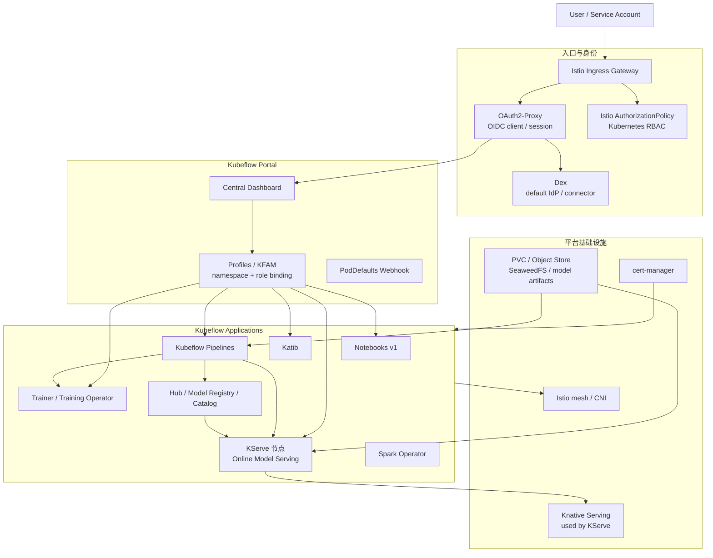
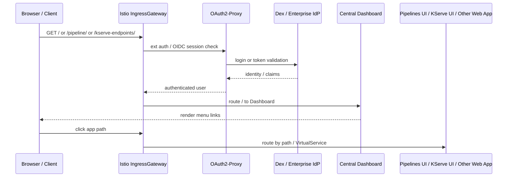
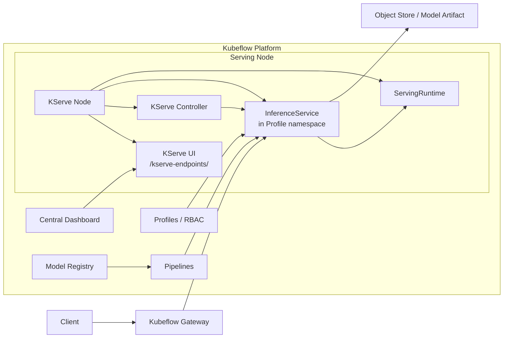
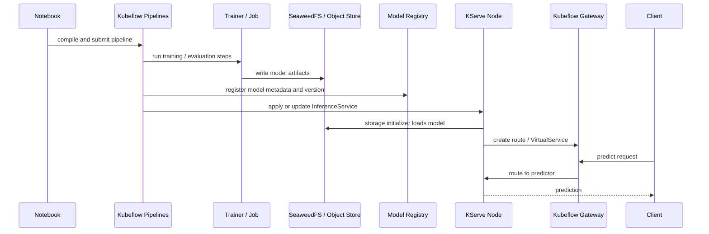
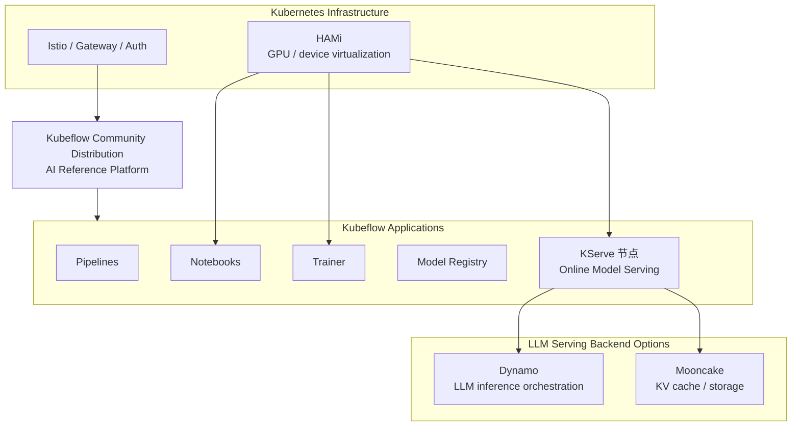

# Kubeflow Community Distribution 深度技术文档

> **以 `kubeflow/community-distribution` 为核心，详解 Kubeflow 平台技术，并将 KServe 作为 Kubeflow 在线推理节点展开分析**
>
> 基于 Kubeflow Community Distribution 官方仓库整理：<https://github.com/kubeflow/community-distribution>
>
> 稳定版本基线：Community Distribution `26.03.1@f09f3eeaa25cc852665f460497a42b7fc68639ac`，审校日期：2026-09-06。组件矩阵以该 release 的 manifests 为准；本轮复核稳定 Release 未变化。

---

## 目录

- [自动生成目录占位](#自动生成目录占位)

---

## 第一章：定位与阅读方式

### 1.1 本文如何理解 KServe

KServe 在 Kubeflow 生态中是在线推理节点。本文主线不会把 KServe 当成独立于 Kubeflow 的外部系统来讲，而是把它作为 Kubeflow Community Distribution 里的一个正式应用节点；同时在第七章单独分析部署 Kubeflow 后再拆分 KServe / Istio 的可行性和风险：

| 角色 | 在 Kubeflow 中的位置 |
|------|----------------------|
| KServe controller | `kubeflow` namespace 内的 serving 控制面 |
| KServe CRD | `InferenceService`、`ServingRuntime`、`ClusterServingRuntime`、`LLMInferenceService` 等 |
| KServe UI | Central Dashboard 菜单 `/kserve-endpoints/` |
| KServe route | 通过 Kubeflow Gateway / Istio / Knative 暴露模型服务 |
| KServe tenant boundary | 跟随 Kubeflow Profile namespace 和 RBAC |

因此本文的主线是：**Kubeflow 是端到端 AI 平台，KServe 是其中的在线推理节点**。两者并重，但层级不同。

### 1.2 Kubeflow Community Distribution 是什么

`kubeflow/community-distribution` 是 Kubeflow 社区维护的参考发行版仓库。它不是单个组件，也不是某个云厂商托管服务，而是一组可通过 Kustomize 安装到 Kubernetes 集群的 manifests，用于组合完整 Kubeflow 平台。

一句话概括：

> **Kubeflow Community Distribution 把 Dashboard、Profiles、Pipelines、Notebooks、Katib、Trainer、Hub、KServe、Istio、Dex、OAuth2-Proxy、Knative、cert-manager 等组件组织成一个端到端机器学习平台。**

它解决的是平台层问题：

| 平台问题 | Kubeflow 对应能力 |
|----------|-------------------|
| 用户从哪里进入平台 | Central Dashboard |
| 用户和团队如何隔离 | Profile、namespace、KFAM、RBAC |
| Notebook、Pipeline、训练、推理如何统一 | Kubeflow Applications |
| Web 和 API 怎么统一入口 | Istio Gateway、OAuth2-Proxy、Dex |
| 模型训练产物怎么流转到 serving | Pipelines、artifact store、Hub/Registry、KServe |
| 多组件证书和 webhook 怎么工作 | cert-manager、组件 patch、Kustomize |
| 平台如何安装、升级、裁剪 | `example/kustomization.yaml`、release、overlay |

### 1.3 它不是什么

| 不是 | 说明 |
|------|------|
| 不是 Kubeflow Pipelines 单组件 | Pipelines 只是平台中的 workflow 节点 |
| 不是 KServe 的替代品 | KServe 是平台内的模型服务节点 |
| 不是训练框架 | 训练仍由 PyTorch、MPI、XGBoost、Trainer、Training Operator 等实现 |
| 不是云厂商托管服务 | 它是社区 manifests；生产化仍需企业自定义 |
| 不是零配置生产平台 | 默认 Dex 用户、HTTP port-forward、Kind 参数都需要替换 |

### 1.4 和旧 kubeflow/manifests 的关系

历史资料常引用 `kubeflow/manifests`。当前 Community Distribution 的意义更接近“社区参考平台发行版”：

| 维度 | Community Distribution 特征 |
|------|-----------------------------|
| 仓库职责 | 汇总 Kubeflow 官方组件和通用基础设施 manifests |
| 维护方式 | 各工作组维护组件，Distribution 维护集成与发行 |
| 安装方式 | Kustomize 为主，实验性 Helm 位于 `experimental/helm/` |
| 测试方式 | GitHub Actions 做完整 Kubeflow 集成测试 |
| 发行节奏 | Calendar Versioning，目标一年两个 base release |
| 使用建议 | 生产倾向 stable release，跟踪新能力可看 master |

---

## 第二章：仓库结构与发行内容

### 2.1 三类目录

仓库 README 将 manifests 分为三类：

| 目录 | 职责 | 典型内容 |
|------|------|----------|
| `applications` | Kubeflow 官方功能组件 | Dashboard、Pipelines、Notebooks、Katib、Trainer、KServe、Hub、Spark |
| `common` | 平台通用基础设施 | cert-manager、Istio、OAuth2-Proxy、Dex、Knative、Kubeflow roles、user namespace |
| `experimental` | 第三方或新能力实验 | Helm、Ray、Workspaces 等 |

高层结构：

```text
community-distribution/
  applications/
    dashboard/
    hub/
    katib/
    kserve/
    notebooks-v1/
    pipeline/
    spark/
    trainer/
    training-operator/
    workspaces/
  common/
    cert-manager/
    dex/
    istio/
    knative/
    kubeflow-namespace/
    kubeflow-roles/
    oauth2-proxy/
    user-namespace/
  experimental/
    helm/
    ray/
  example/
    kustomization.yaml
  tests/
    *_install.sh
    *_test.sh
```

### 2.2 文档快照组件矩阵

`26.03.1@f09f3eeaa25cc852665f460497a42b7fc68639ac` 的 README 给出的主要组件版本和资源信号如下：

| 组件 | 本地路径 | 上游版本 | 角色 |
|------|----------|----------|------|
| Training Operator | `applications/training-operator/upstream` | `v1.9.2` | 训练任务 CRD |
| Trainer | `applications/trainer/upstream` | `v2.2.0` | 新一代训练控制面 |
| Kubeflow Notebooks | `applications/notebooks-v1/upstream` | `v1.11.0` | 交互式开发 |
| Kubeflow Dashboard | `applications/dashboard/upstream` | `v2.0.0` | 平台门户 |
| Katib | `applications/katib/upstream` | `v0.19.0` | HPO / NAS |
| KServe Models Web App | `applications/kserve/models-web-app` | `v0.18.0` | 模型 endpoint UI |
| KServe | `applications/kserve/kserve` | `v0.18.0` | 在线推理节点 |
| Kubeflow Pipelines | `applications/pipeline/upstream` | `2.16.1` | 工作流和 artifact |
| Kubeflow Hub | `applications/hub/upstream` | `v0.3.9` | Model Registry / Catalog |
| Spark Operator | `applications/spark/spark-operator` | `2.5.0` | Spark 任务 |
| Istio | `common/istio` | `1.30.1` | 网格、入口、授权 |
| Knative | `common/knative` | `v1.22.0` | KServe serverless 基础 |
| cert-manager | `common/cert-manager` | `1.20.2` | webhook 证书 |
| Dex | `common/dex` | `2.45.1` | 默认 OIDC IdP |
| OAuth2-Proxy | `common/oauth2-proxy` | `7.15.2` | OIDC client 和入口会话 |

README 给出的总资源粗略信号是 CPU `4380m`、内存 `12341Mi`、PVC `65GB`。这不是生产 sizing，而是让安装者理解完整平台并不等于轻量单服务。

### 2.3 example/kustomization.yaml 的意义

`example/kustomization.yaml` 是单命令安装入口，也是理解平台依赖顺序的最佳地图。它大体按以下顺序组合：

1. cert-manager
2. Istio CRD、Istio namespace、Istio CNI overlay
3. OAuth2-Proxy
4. Dex
5. Knative Serving
6. cluster-local gateway
7. Kubeflow namespace、roles、Istio resources
8. Pipelines
9. Katib
10. Dashboard
11. Notebooks v1
12. Trainer
13. User namespace / Profile 示例
14. **KServe + KServe UI**
15. Spark Operator
16. Hub Model Registry / Model Catalog
17. 可选 Ray、Workspaces

这说明 KServe 不是“后装的外部服务”，而是 Community Distribution 默认平台图中的一个 Kubeflow application。

---

## 第三章：Kubeflow 技术架构

### 3.1 总体平台视图



Kubeflow 的技术核心不是某一个 controller，而是 **Kubernetes 原生对象 + Web 门户 + 多租户身份边界 + 多个 ML 应用节点** 的组合。

### 3.2 三层控制面

| 层级 | 组件 | 管理对象 |
|------|------|----------|
| Platform control plane | Dashboard、Profiles、KFAM、Kubeflow Roles | 用户、namespace、RBAC、菜单、Web 应用入口 |
| Workflow / training control plane | Pipelines、Katib、Trainer、Spark | pipeline run、experiment、trial、training job、Spark job |
| Serving control plane | **KServe controller、KServe UI** | `InferenceService`、runtime、route、predictor pod、endpoint 状态 |

KServe 属于第三层，但它依赖第一层提供用户入口和租户边界，也依赖第二层把训练产物和模型元数据推到 serving。

### 3.3 命名空间模型

Kubeflow 的多租户基本单元是 `Profile`。示例 Profile：

```yaml
apiVersion: kubeflow.org/v1beta1
kind: Profile
metadata:
  name: kubeflow-user-example-com
spec:
  owner:
    kind: User
    name: user@example.com
```

Profile controller 会创建用户 namespace，并给 owner 绑定权限。典型 namespace 分工：

| Namespace | 职责 |
|-----------|------|
| `kubeflow` | Dashboard、KServe controller、Pipelines、Katib、Trainer、Hub 等系统组件 |
| `kubeflow-user-example-com` | 默认用户 Profile，运行 Notebook、Pipeline workload、InferenceService 等 |
| `istio-system` | Istio control plane、Ingress Gateway |
| `auth` | Dex |
| `oauth2-proxy` | OAuth2-Proxy |
| `knative-serving` | Knative Serving |
| `cert-manager` | cert-manager |

KServe controller 运行在系统 namespace，但用户的 `InferenceService` 应部署在 Profile namespace。这是它作为 Kubeflow 节点时最重要的租户边界。

### 3.4 数据流与控制流

Kubeflow 平台同时处理三类流量：

| 流量 | 路径 | 说明 |
|------|------|------|
| 用户 Web 流量 | Browser -> Istio Gateway -> OAuth2-Proxy -> Dashboard / Web App | 包括 Notebooks、Pipelines、KServe UI |
| 控制面流量 | Web App / SDK -> Kubernetes API / component API | 创建 Profile、Pipeline Run、InferenceService 等 |
| 模型数据流量 | Client -> Gateway -> KServe route -> predictor pod | 在线推理请求 |

KServe 和 Kubeflow 的耦合主要发生在第一类和第三类流量：用户从 Dashboard 进入 KServe UI，模型请求通过 Kubeflow Gateway 进入 KServe route。

---

## 第四章：安装链路与访问模型

### 4.1 单命令安装

README 推荐的单命令安装是：

```bash
while ! kustomize build example | kubectl apply --server-side --force-conflicts -f -; do
  echo "Retrying to apply resources"
  sleep 20
done
```

反复 apply 是 Kubernetes CRD/CR/webhook 安装顺序的现实处理方式：CRD ready、webhook certificate 注入、controller 启动都不是一次 apply 能稳定完成的同步过程。

### 4.2 分组件安装

分组件安装更适合定位问题和生产裁剪：

| 阶段 | 组件 | 目的 |
|------|------|------|
| 1 | Kubeflow namespace | 系统命名空间 |
| 2 | cert-manager | webhook 证书基础 |
| 3 | Istio CNI | 网格、入口、授权 |
| 4 | OAuth2-Proxy + Dex | 身份认证 |
| 5 | Knative + cluster-local gateway | KServe serverless 依赖 |
| 6 | Kubeflow roles / Istio resources | 多租户授权和 gateway |
| 7 | Dashboard / Profiles | 用户入口和 namespace 生命周期 |
| 8 | Pipelines / Katib / Trainer / Notebooks | 训练和工作流能力 |
| 9 | **KServe + KServe UI** | 模型服务节点 |
| 10 | Hub / Spark / optional apps | 模型资产和扩展能力 |

这个顺序也解释了为什么 KServe 不能孤立理解：它在 Kubeflow 里需要 Istio、Knative、cert-manager、Profiles/RBAC、Dashboard 菜单和 OAuth2-Proxy 一起工作。

### 4.3 访问 Dashboard

本地访问方式：

```bash
kubectl port-forward svc/istio-ingressgateway -n istio-system 8080:80
```

然后访问：

```text
http://localhost:8080
```

默认用户只适合测试：

```text
user@example.com / 12341234
```

生产必须替换默认用户、密码、OAuth2-Proxy secret、Dex connector，并使用 HTTPS。README 明确提示非 localhost 暴露 Kubeflow 时需要 HTTPS，否则 Secure Cookies 相关行为会异常。

### 4.4 入口请求链路



Dashboard 提供菜单和导航入口，不是应用请求的反向代理。KServe UI 复用 Kubeflow Gateway、OAuth2-Proxy 和 Istio routing，因此它不是一个绕过 Kubeflow 身份体系的外部页面。

---

## 第五章：身份、授权与多租户技术

### 5.1 Authentication：OAuth2-Proxy + Dex

Kubeflow 使用 OAuth2-Proxy 作为入口 OIDC client，Dex 作为默认 identity provider。Dex 可接静态用户，也可接 LDAP、GitHub、Google、Microsoft、OIDC、SAML 等企业身份源。

关键点：

| 技术点 | 说明 |
|--------|------|
| Web session | OAuth2-Proxy 处理用户登录和 cookie |
| OIDC provider | Dex 默认提供，也可替换成企业 IdP |
| M2M auth | OAuth2-Proxy overlay 支持 service account token 通过 gateway 鉴权 |
| Authorization | 认证不是授权，授权还依赖 Kubernetes RBAC 和 Istio AuthorizationPolicy |

### 5.2 Authorization：Kubeflow 聚合角色

Kubeflow 使用聚合 ClusterRole：

| ClusterRole | 语义 |
|-------------|------|
| `kubeflow-admin` | 管理权限 |
| `kubeflow-edit` | 编辑 workload 和用户资源 |
| `kubeflow-view` | 只读 |

组件通过 `aggregate-to-kubeflow-edit=true` 等标签把自己的权限聚合进去。KServe UI 能否列出某个 namespace 的 `InferenceService`，最终依赖这些 RBAC 规则和用户在 Profile namespace 中的角色绑定。

### 5.3 Profile / KFAM

Profile 是 Kubeflow 多租户隔离核心：

| 对象 | 作用 |
|------|------|
| `Profile` CR | 声明用户或团队工作区 |
| Profile controller | 创建 namespace、owner role binding |
| KFAM | 管理 Profile 成员和权限 |
| Dashboard | 给用户展示当前可访问 namespace |

KServe 的租户行为应遵循 Profile：

| KServe 对象 | 推荐位置 |
|-------------|----------|
| KServe controller | `kubeflow` 系统 namespace |
| `InferenceService` | 用户 Profile namespace |
| predictor pod | 用户 Profile namespace |
| KServe UI API 查询 | 只查询用户有权访问的 namespace |

### 5.4 PodDefaults

PodDefaults webhook 用于给用户 workload 注入环境变量、volume、secret 等配置。它对 Notebook、Pipeline step、训练任务有直接价值；对 KServe 则常用于模型访问凭据、对象存储 endpoint、镜像拉取 secret 等配套治理。

---

## 第六章：核心应用节点

### 6.1 Central Dashboard

Dashboard 是 Kubeflow 的平台门面。当前 overlay 中菜单包含：

| 菜单 | 路径 | 节点 |
|------|------|------|
| Notebooks | `/jupyter/` | Notebook UI |
| TensorBoards | `/tensorboards/` | TensorBoard |
| Volumes | `/volumes/` | PVC 管理 |
| Katib Experiments | `/katib/` | Katib UI |
| **KServe Endpoints** | `/kserve-endpoints/` | **KServe UI** |
| Model Registry | `/model-registry/` | Hub / Registry |
| Pipelines | `/pipeline/#/...` | KFP UI |

这就是“将 KServe 作为 Kubeflow 节点”的用户可见证据：KServe endpoint 是 Dashboard 聚合菜单的一项，而不是独立入口。

### 6.2 Kubeflow Pipelines

Community Distribution 26.03.1 使用 Kubeflow Pipelines `2.16.1`。该 release 默认使用 SeaweedFS 作为 S3-compatible artifact store，而不是旧 MinIO。

Pipelines 的技术角色：

| 能力 | 说明 |
|------|------|
| DAG 编排 | pipeline task 依赖、缓存、重试 |
| 运行记录 | Experiments、Runs、Recurring Runs |
| 元数据 | Artifacts、Executions、ML Metadata |
| 产物存储 | SeaweedFS / 对象存储 |
| 发布桥接 | 训练结束后创建或更新 KServe `InferenceService` |

### 6.3 Notebooks

Notebooks v1 提供交互式开发环境。它和 KServe 的关系不是直接控制，而是开发链路上游：

```text
Notebook 开发/调试 -> Pipeline 固化训练流程 -> Registry 记录模型 -> KServe 发布 endpoint
```

### 6.4 Katib

Katib 负责超参数搜索、NAS、early stopping 和 trial 管理。它的结果通常进入训练或 pipeline 后续步骤，而不是直接承担 serving。

```text
Katib Experiment -> Trial Jobs -> metrics collector -> best parameters -> Pipeline / Trainer
```

### 6.5 Trainer 与 Training Operator

当前 example 默认启用 `applications/trainer/overlays`，Training Operator v1 路径注释。Trainer v2 是 roadmap 重点之一。

训练节点解决：

| 问题 | 说明 |
|------|------|
| 分布式训练 | 多 worker/job 管理 |
| 弹性/重试 | 训练任务失败恢复 |
| 资源调度 | GPU/CPU/内存请求 |
| SDK 集成 | Python SDK 提交任务 |

### 6.6 Hub、Model Registry 与 Model Catalog

当前 example 同时安装：

| 节点 | 路径 | 作用 |
|------|------|------|
| Model Registry | `applications/hub/overlays/model-registry` | per-tenant 模型版本和元数据 |
| Model Catalog | `applications/hub/overlays/model-catalog` | cluster-wide 模型目录 |

它们是 KServe 发布前的重要治理节点：模型先进入 Registry/Catalog，再由 Pipeline 或人工流程发布到 KServe。

### 6.7 KServe 节点

KServe 是 Kubeflow 的在线推理节点。它在 Kubeflow 中有两个安装子路径：

| 路径 | 作用 |
|------|------|
| `applications/kserve/kserve` | KServe CRD、controller、cluster resources |
| `applications/kserve/kserve-ui` | KServe Models Web Application |

在 Kubeflow 中，KServe 提供：

| 能力 | 说明 |
|------|------|
| `InferenceService` | 预测模型和基础 LLM 服务 |
| `ServingRuntime` / `ClusterServingRuntime` | 模型 runtime 抽象 |
| `LLMInferenceService` | 高级 LLM serving CRD，但在发行版中受安全补丁限制 |
| KServe UI | Dashboard 菜单 `/kserve-endpoints/` |
| Path-based routing | `/serving/<namespace>/<name>/...` |
| Host-based routing | `<isvc>.<namespace>.example.com` |

---

## 第七章：KServe 作为 Kubeflow 节点

### 7.1 节点位置



这张图强调三点：

1. KServe UI 是 Dashboard 的子入口。
2. KServe workload 的租户边界是 Profile namespace。
3. KServe endpoint 通过 Kubeflow Gateway 暴露，而不是另建一套平台入口。

### 7.2 安装到 kubeflow namespace

`applications/kserve/kserve/kustomization.yaml` 使用：

```yaml
resources:
- ./upstream/kserve_kubeflow.yaml
- ./upstream/kserve-cluster-resources.yaml
```

这说明 Community Distribution 使用 KServe 的 Kubeflow 定制安装清单，把 KServe 控制面作为 Kubeflow 系统组件安装到 `kubeflow` namespace。

### 7.3 证书补丁

KServe upstream manifests 中部分 cert-manager `inject-ca-from` 默认指向 `kserve/<cert-name>`。Kubeflow 发行版将 KServe 安装到 `kubeflow` namespace，因此需要修正：

| 证书 | Kubeflow 补丁目标 |
|------|-------------------|
| serving cert | `kubeflow/serving-cert` |
| LLMISVC cert | `kubeflow/llmisvc-serving-cert` |
| LocalModel cert | `kubeflow/localmodel-serving-cert` |

同时修正 webhook Certificate SAN：

| Webhook service | SAN |
|-----------------|-----|
| `kserve-webhook-server-service` | `kserve-webhook-server-service.kubeflow.svc` |
| `llmisvc-webhook-server-service` | `llmisvc-webhook-server-service.kubeflow.svc` |
| `localmodel-webhook-server-service` | `localmodel-webhook-server-service.kubeflow.svc` |

如果这些补丁缺失，KServe webhook 可能出现 `certificate signed by unknown authority` 或 SAN mismatch。

### 7.4 安全补丁和能力裁剪

Kubeflow 发行版对 KServe 做了安全相关裁剪：

| 补丁 | 原因 |
|------|------|
| 删除 `kserve-localmodelnode-agent` DaemonSet | 该 DaemonSet 使用 privileged、hostPID、hostNetwork |
| 给 controller manager 加 `seccompProfile: RuntimeDefault` | 对齐 Pod Security Standards |
| 删除不安全 `LLMInferenceServiceConfig` | 涉及 `IPC_LOCK`、`SYS_RAWIO`、`NET_RAW`、`runAsNonRoot: false` |
| 删除 LLM config validating webhook | 注释说明 webhook server 未运行会产生 EOF |

结论：Kubeflow Community Distribution 26.03.1 中固定的是 KServe v0.18.0，不能等同于独立安装 KServe v0.19.0，也不能据此假设已完整启用其 LLM 高级能力。生产如果要独立升级并启用 LLMISVC、LocalModelCache 或节点本地模型缓存，需要重新评估 CRD/controller 所有权、PSS、安全上下文、DaemonSet 权限和 webhook 可用性。

### 7.5 Path-based routing

Kubeflow 发行版把 KServe `inferenceservice-config` 中的 ingress 配置 patch 为：

```json
{
  "enableGatewayApi": false,
  "kserveIngressGateway": "kserve/kserve-ingress-gateway",
  "ingressGateway": "kubeflow/kubeflow-gateway",
  "localGateway": "knative-serving/knative-local-gateway",
  "localGatewayService": "knative-local-gateway.istio-system.svc.cluster.local",
  "ingressDomain": "example.com",
  "ingressClassName": "istio",
  "domainTemplate": "{{ .Name }}-{{ .Namespace }}.{{ .IngressDomain }}",
  "urlScheme": "http",
  "disableIstioVirtualHost": false,
  "disableIngressCreation": false,
  "pathTemplate": "/serving/{{ .Namespace }}/{{ .Name }}"
}
```

结果是 KServe 可以自动生成 path-based URL：

```text
/serving/<namespace>/<inferenceservice>/v1/models/<model>:predict
```

这对 Kubeflow 很重要：用户从统一 Kubeflow 入口域名进入后，可以在同一个 gateway 下访问模型 endpoint，而不一定依赖额外 wildcard DNS 或 Host header。

### 7.6 Host-based routing 与 VirtualService 冲突

KServe 仍支持 host-based route：

```text
Host: <inferenceservice>.<namespace>.example.com
```

但 `common/istio/README.md` 专门说明了 KServe path-based routing 与 Kubeflow wildcard VirtualService 的冲突：

| 问题 | 表现 |
|------|------|
| Kubeflow 使用 `hosts: ["*"]` 的 VirtualService | Dashboard 等路径正常 |
| KServe 生成 specific-host VirtualService | 某些域名路由可能返回 404 |
| Istio 匹配行为 | wildcard 与 specific host 混用时可能异常 |

仓库给出的 workaround 是使用 Kyverno policy，把 KServe 创建的、绑定 `kubeflow-gateway` 的 VirtualService hosts 对齐为 `*`，并排除 mesh gateway。

### 7.7 KServe UI API 与 RBAC

KServe UI 暴露在：

```text
/kserve-endpoints/
```

CI 中访问：

```text
/kserve-endpoints/api/namespaces/<namespace>/inferenceservices
```

并验证未授权 service account token 无法读取用户 namespace 的 `InferenceService`。这体现了 KServe UI 与 Kubeflow 多租户 RBAC 的整合：KServe UI 不是简单展示全局 endpoint，而是受用户 namespace 权限约束。

### 7.8 部署 Kubeflow 后，KServe / Istio 独立部署可行性

部署 Kubeflow 以后再把 KServe 或 Istio 当成“独立组件”处理是可行的，但不能理解成简单换 namespace 再安装一遍。KServe、Istio、Knative、cert-manager、OAuth2-Proxy、Dex、Profile/RBAC 和 Dashboard 在 Community Distribution 中已经形成一组共享控制面和入口约定。

| 架构模式 | 可行性 | 适用场景 | 主要风险 | 推荐结论 |
|----------|--------|----------|----------|----------|
| 复用 Kubeflow 内置 KServe / Istio | 高 | 预测模型 serving、Dashboard 内查看 endpoint、Profile 多租户 | LLMISVC、LocalModelCache 等能力受 Kubeflow 安全补丁影响 | 默认推荐 |
| 同集群独立安装一套 KServe | 中 | 需要 upstream KServe 新版本、Standard/Gateway API、独立 serving 配置 | CRD、webhook、ClusterRole、controller 是集群级资源，可能和 Kubeflow 内置 KServe 冲突 | 只能保留一个 KServe CRD/controller 所有者 |
| 同集群额外安装一套 Istio control plane | 低到中 | 明确采用 revision、多控制面迁移或网格隔离 | Istio CNI、sidecar 注入、MutatingWebhook、Gateway、AuthorizationPolicy、VirtualService 容易互相影响 | 不建议作为普通后装方案 |
| 企业平台先独立安装 Istio / Gateway，Kubeflow 复用 | 高 | 统一入口、统一证书、统一零信任和审计 | 需要在安装 Kubeflow 前规划 overlay、gateway、auth policy | 生产环境更合理 |
| KServe 放到独立 serving 集群 | 高 | LLM、高级 Gateway API、Envoy Gateway、独立升级和 GPU 资源池 | 失去 Kubeflow KServe UI 的原生集成，需要额外发布链路 | 隔离要求高时推荐 |

关键判断是：**namespace 拆分不等于控制面隔离**。

| 资源类型 | 为什么会影响独立部署 |
|----------|----------------------|
| KServe CRD | `InferenceService`、`ServingRuntime`、`ClusterServingRuntime`、`LLMInferenceService` 是集群范围 API；两个版本的 CRD 不能安全并存 |
| KServe webhook | admission webhook 绑定 Service、CA bundle 和证书 SAN；Kubeflow 已把证书注入 namespace patch 到 `kubeflow` |
| KServe controller | 多个 controller 同时 reconcile 同一类 CRD 会产生状态覆盖、重复生成 workload 或路由 |
| Istio CNI / webhook | CNI、sidecar injector、revision label 和 namespace label 会影响所有被纳入 mesh 的 Pod |
| Gateway / VirtualService | Kubeflow 使用 `kubeflow-gateway` 和 wildcard/path-based route；KServe host-based route 可能触发匹配冲突 |
| OAuth2-Proxy / Dex / RBAC | Kubeflow 的入口认证不等于独立 KServe endpoint 自动具备相同授权语义 |

如果确实要拆分，先把职责边界定义清楚：

| 边界 | 需要明确的问题 |
|------|----------------|
| KServe 所有权 | CRD、webhook、controller、ClusterRole 由 Kubeflow overlay 还是独立 KServe release 持有 |
| 流量入口 | 模型 endpoint 继续走 `kubeflow-gateway`，还是迁移到独立 Gateway / Gateway API |
| 身份与授权 | 继续复用 Kubeflow OAuth2-Proxy/Dex/RBAC，还是让 serving 栈使用独立认证授权 |
| 发布链路 | Kubeflow Pipelines 直接 apply `InferenceService`，还是通过 GitOps、平台 API 或独立 kubeconfig 发布 |
| 升级节奏 | KServe、Istio、Knative、cert-manager 是否跟随 Kubeflow release，独立升级策略见第十章 `Serving 链路组件独立升级策略` |

推荐结论：

1. 已经部署 Kubeflow 后，**最稳妥的是复用 Kubeflow 内置 Istio，并只保留一套 KServe 控制面**。
2. 如果目标是 LLM serving、高级 Gateway API、独立 GPU 池或快速跟进 upstream KServe，**更推荐独立 serving 集群或预先规划的平台级 Gateway/Istio**。
3. 同集群后装第二套 Istio 或第二套 KServe 不是不可行，但它是控制面治理问题，不是普通应用部署问题；本节只判断部署边界，独立升级流程由第 10.4 节承载。

---

## 第八章：端到端 MLOps 路径

### 8.1 Notebook 到 KServe



这个流程体现 Kubeflow 的平台价值：Notebook、Pipeline、训练、artifact、Registry 和 KServe 并不是割裂工具，而是可以组成模型从开发到上线的闭环。

### 8.2 InferenceService 示例

Kubeflow CI 使用 sklearn 模型作为 smoke test：

```yaml
apiVersion: serving.kserve.io/v1beta1
kind: InferenceService
metadata:
  name: isvc-sklearn
  namespace: kubeflow-user-example-com
spec:
  predictor:
    sklearn:
      storageUri: gs://kfserving-examples/models/sklearn/1.0/model
      resources:
        requests:
          cpu: 50m
          memory: 128Mi
        limits:
          cpu: 100m
          memory: 256Mi
```

关键点：

| 字段 | Kubeflow 语义 |
|------|---------------|
| `namespace` | Profile namespace，决定租户和 RBAC 边界 |
| `storageUri` | 模型 artifact 位置，生产中通常来自 Pipeline 或 Registry |
| `resources` | 与 Kubernetes quota、GPU/CPU 治理联动 |
| `predictor` | KServe runtime 选择 |

### 8.3 请求路径

path-based 请求：

```bash
curl -H "Authorization: Bearer ${TOKEN}" \
  -H "Content-Type: application/json" \
  http://localhost:8080/serving/kubeflow-user-example-com/isvc-sklearn/v1/models/isvc-sklearn:predict \
  -d '{"instances": [[6.8, 2.8, 4.8, 1.4]]}'
```

host-based 请求：

```bash
curl -H "Authorization: Bearer ${TOKEN}" \
  -H "Host: isvc-sklearn.kubeflow-user-example-com.example.com" \
  -H "Content-Type: application/json" \
  http://localhost:8080/v1/models/isvc-sklearn:predict \
  -d '{"instances": [[6.8, 2.8, 4.8, 1.4]]}'
```

CI 同时验证无 token 请求会被拒绝，有效 token 请求进入模型服务。这说明 KServe 节点继承的是 Kubeflow Gateway 和 AuthorizationPolicy 的入口安全模型。

### 8.4 KServe CI 覆盖面

`tests/kserve_test.sh` 覆盖：

| 测试 | 说明 |
|------|------|
| Python SDK 部署 sklearn `InferenceService` | 创建、预测、删除 |
| path-based routing | `/serving/<namespace>/<name>/...` |
| host-based routing | `Host: isvc-sklearn.<namespace>.example.com` |
| AuthorizationPolicy | 验证 token 和未授权访问 |
| KServe UI API | `/kserve-endpoints/api/namespaces/<ns>/inferenceservices` |
| Knative cluster-local gateway auth | 验证内部服务访问控制 |

因此，KServe 在 Kubeflow 中不是只安装 CRD/controller，而是被纳入 UI、入口、鉴权、CI 和多租户验证。

---

## 第九章：安全与 Pod Security Standards

### 9.1 Istio CNI

Community Distribution 默认使用 Istio CNI，而不是标准 Istio initContainer 注入模式：

| 好处 | 说明 |
|------|------|
| 无需 privileged initContainer | 更符合 Pod Security Standards |
| 兼容 PSS | 对 restricted/baseline 策略更友好 |
| native sidecars | Kubernetes 1.28+ 生命周期更好 |
| 启动更简洁 | 减少 initContainer 网络配置复杂度 |

GKE 因 `/opt/cni/bin` 只读，需要使用 GKE overlay。Ambient mode 也存在，但 Istio README 提醒 ambient 需要 `istio-system` 使用 privileged PSS，这和默认安全目标不同。

### 9.2 PSS 对 Kubeflow 应用的影响

Roadmap 提到系统 namespace 目标是 `restricted`，用户 profile namespace 目标是 `baseline`。影响包括：

| 组件 | 影响 |
|------|------|
| Notebook | 镜像需要支持合适的 user/securityContext |
| Pipeline step | 用户容器不能默认依赖 privileged/root |
| Trainer | 分布式训练 launcher/worker 需要符合 namespace 策略 |
| KServe LocalModel | privileged/hostPID/hostNetwork agent 默认被删除 |
| KServe LLMISVC | 不安全 capability config 被删除 |

### 9.3 默认凭证风险

默认 Dex 用户：

```text
user@example.com / 12341234
```

生产必须：

1. 替换默认静态密码 hash。
2. 或改用企业 IdP。
3. 检查 OAuth2-Proxy cookie secret、client secret。
4. 启用 HTTPS。
5. 避免公网暴露未加固入口。

### 9.4 Machine-to-machine auth

OAuth2-Proxy overlay 提供不同模式：

| overlay | 说明 |
|---------|------|
| `m2m-dex-only` | 多数集群可用，但不允许外部使用 K8s service account token |
| `m2m-dex-and-kind` | Kind/K3D/Rancher/GKE 等可配置 K8s JWT gateway auth |
| `m2m-dex-and-eks` | EKS 相关 issuer/JWKS 配置 |

KServe CI 使用：

```bash
kubectl -n <namespace> create token default-editor
```

然后用 Bearer token 访问模型 endpoint 和 KServe UI API。

---

## 第十章：升级、扩展与裁剪

### 10.1 不要直接改 upstream manifests

README 的升级建议很明确：不要直接编辑 upstream manifests，而是用 Kustomize overlays/components：

```text
base/community-distribution manifests
  + your overlays
  + your patches
  + image replacements
  + labels for prune
```

这样升级到新 release 时，只要切换 base 引用，再调整企业 overlay。

### 10.2 不可变字段错误

Kubernetes 中 Deployment selector 等字段不可变。升级时如果 upstream 改了 immutable field，会出现：

```text
spec.selector: Invalid value: field is immutable
```

解决方式通常是先删除该资源，再重新 apply。release upgrade notes 对 JobSet、KServe、Dashboard 等组件都有类似提示。

### 10.3 KServe 节点升级注意事项

README upgrade notes 对 KServe 写了两个重点：

| 项 | 操作 |
|----|------|
| KServe LLMiSVC RoleBinding | KServe 0.16.x 到 0.17.0+ 重构 role binding，需要删除旧 `llmisvc-manager-rolebinding` |
| KServe Models Web Application | 旧 `kserve-models-web-app` 命名栈需要删除，否则会占用 `/kserve-endpoints` 路由并导致 RBAC 403 |

KServe 节点升级时要特别关注：

| 风险 | 说明 |
|------|------|
| CRD 升级 | `InferenceService`、`LLMInferenceService`、runtime 类型变化 |
| RBAC 重构 | KServe UI 和 LLM controller 访问权限 |
| Web app 路由 | `/kserve-endpoints/` 路由冲突 |
| webhook 证书 | namespace、SAN、`inject-ca-from` |
| 安全裁剪 | LLMISVC/LocalModel 补丁是否仍符合企业策略 |

### 10.4 Serving 链路组件独立升级策略

KServe 可以从 Kubeflow 发行版中拆出来独立升级，但不能只替换 controller image。生产上应把 Serving 链路拆成几个升级单元，并为每个单元明确所有权、兼容边界和回滚方式。

| 组件 | 是否适合独立升级 | 升级边界 | 必须验证 |
|------|------------------|----------|----------|
| KServe CRD + controller + webhook | 适合，但必须成组升级 | `InferenceService`、`LLMInferenceService`、runtime CRD、controller manager、admission webhook、ClusterRole | CRD conversion、webhook TLS、现有 `InferenceService` reconcile、controller 日志 |
| KServe UI | 可相对独立 | Dashboard 菜单、`/kserve-endpoints/` route、UI backend API、RBAC | 用户只能看到有权限的 namespace，旧 `kserve-models-web-app` 不占用路由 |
| ServingRuntime / ClusterServingRuntime | 可单独调整 | runtime image、protocol、resource、storage initializer 参数 | 字段兼容目标 KServe release，已有模型服务能重建 pod |
| Knative Serving | 有条件独立升级 | 仅在 KServe serverless 模式下强相关 | Knative Service、cluster-local gateway、KPA/HPA、KServe path-based route |
| Istio | 不建议只为 KServe 单独升级 | Istio CRD、CNI、sidecar injector、Gateway、VirtualService、AuthorizationPolicy | Dashboard、KServe endpoint、M2M auth、wildcard/specific-host route |
| cert-manager | 可独立升级 | Certificate、Issuer、CA injection、webhook caBundle | KServe webhook 证书 SAN、`inject-ca-from` namespace、caBundle 自动注入 |
| Gateway API / Ingress provider | 视部署模式独立升级 | GatewayClass、Gateway、HTTPRoute、Ingress controller、Envoy Gateway | KServe Standard/Gateway API、LLMISVC、streaming 请求、路由权重 |

推荐升级路径：

1. **先建立版本矩阵**：记录当前 Kubeflow release、KServe release、KServe UI、Knative、Istio、cert-manager、Gateway API CRD 和 runtime image 版本，不混用 master 字段与旧 release YAML。
2. **先升级 CRD，再升级 controller/webhook**：KServe 跨 minor 升级时，先 apply 新 CRD 并确认 conversion/served/storage version，再滚动升级 controller manager 和 webhook。
3. **再升级 runtime/UI**：runtime image 和 `ServingRuntime` 字段变化会直接影响 predictor pod；KServe UI 升级后要验证 `/kserve-endpoints/` 和 namespace RBAC。
4. **基础设施组件走平台级流程**：Istio、Knative、cert-manager 不应作为 KServe 的普通依赖热替换；应有 staging、canary/revision、回滚窗口和入口流量验证。
5. **LLM 高级能力单独评估**：如果升级目标是 LLMISVC、Gateway API Inference Extension、Envoy Gateway 或 LocalModelCache，优先评估独立 serving 栈或独立集群。

升级前检查：

| 检查项 | 说明 |
|--------|------|
| 所有权 | 明确 CRD、webhook、controller、Gateway、auth policy 由 Kubeflow overlay 还是独立 KServe release 持有 |
| 备份 | 导出现有 `InferenceService`、`ServingRuntime`、`ClusterServingRuntime`、KServe ConfigMap、VirtualService/HTTPRoute |
| 兼容 | 对照目标 release 的 breaking changes、CRD 字段变化、webhook 证书 namespace patch |
| 回滚 | 保留旧 release manifests、runtime image、ConfigMap 和 controller image；确认 CRD 降级是否可行 |

升级后 smoke test 至少覆盖：

| 场景 | 验证点 |
|------|--------|
| predictive `InferenceService` | Ready condition、predictor pod、storage initializer、`/serving/<namespace>/<name>/...` |
| KServe UI | Dashboard 菜单、`/kserve-endpoints/api/namespaces/<ns>/inferenceservices`、RBAC 403/200 |
| host-based route | `Host: <name>.<namespace>.example.com` 与 Kubeflow wildcard VirtualService 不冲突 |
| webhook | 创建/更新非法资源能被拒绝，合法资源不出现 TLS 或 EOF 错误 |
| serverless 模式 | Knative Service、Revision、Activator、cluster-local gateway |
| LLM/LocalModel | LLMISVC、Gateway API、LocalModelCache agent 和 PSS/securityContext 是否符合企业策略 |

### 10.5 裁剪建议

如果资源有限或只需要部分能力，可从 `example/kustomization.yaml` 注释组件：

| 目标 | 可考虑保留 | 可考虑移除 |
|------|------------|------------|
| Notebook + Pipeline 平台 | Dashboard、Profiles、Notebooks、Pipelines、Istio/Auth | Katib、Spark、KServe、Hub |
| 模型服务平台 | Dashboard、Profiles、KServe、KServe UI、Istio/Auth、Knative | Pipelines、Katib、Spark、Notebooks |
| 训练平台 | Dashboard、Profiles、Trainer、Pipelines、Katib | KServe、KServe UI、Hub |
| 本地 demo | 核心组件 + 单用户 namespace | Spark、Hub、Workspaces、部分训练组件 |

---

## 第十一章：生产化建议

### 11.1 安装前决策

| 决策 | 推荐问题 |
|------|----------|
| Release | 用 stable release 还是 master？ |
| 入口 | 企业 HTTPS 域名、LB、Ingress 怎么接 Istio Gateway？ |
| 身份 | Dex 静态用户、Dex connector，还是 OAuth2-Proxy 直连 IdP？ |
| 多租户 | Profile namespace、quota、RBAC、PSS 怎么定义？ |
| 存储 | Pipeline artifacts、Notebook PVC、模型对象存储用什么？ |
| GPU | KServe/Trainer/Notebook GPU 由谁治理？NVIDIA plugin、DRA、HAMi、MIG？ |
| Serving | KServe 只做 predictive，还是启用 LLMISVC/LocalModel？ |
| Serving 架构 | 复用 Kubeflow 内置 KServe/Istio，还是外置 serving 栈或独立集群？ |
| 安全 | PSS、NetworkPolicy、image mirror、CVE 扫描怎么落地？ |

### 11.2 KServe 作为节点的生产建议

| 场景 | 建议 |
|------|------|
| 预测模型 serving | 使用 `InferenceService`，保留 Kubeflow path-based routing |
| LLM 基础 serving | 先评估 KServe Standard/Gateway API 与 Kubeflow 当前 Istio/Knative 集成差异 |
| LLMISVC 高级能力 | 不默认认为 Kubeflow 发行版完整启用，先检查安全补丁 |
| LocalModelCache | 默认 LocalModel agent 被删除；启用前重做 PSS/security review |
| 独立 KServe | 同集群只能保留一个 CRD/controller 所有者；需要独立升级时优先规划替换而不是叠加安装 |
| 独立 Istio | 避免在已部署 Kubeflow 的集群直接后装第二套 control plane；必要时使用 revision、独立 Gateway 和明确 namespace label |
| 独立 serving 集群 | 适合 LLM、高级 Gateway API、独立 GPU 池和独立升级节奏；Kubeflow 通过 Pipeline/GitOps/API 发布 |
| 独立升级 | 在 staging 先验证版本矩阵、CRD/webhook/controller 成组升级、入口路由和 KServe UI RBAC；不要在生产只替换单个 manifest |
| 多租户模型服务 | 每个 Profile namespace 中部署 `InferenceService`，通过 Kubeflow RBAC 控制 UI/API |
| 路由 | 同时验证 `/serving/<namespace>/<name>/...` 和 host-based route |

### 11.3 观测与运维

| 组件 | 需要观测 |
|------|----------|
| Dashboard | 登录错误、iframe/web app 访问、Profile API |
| OAuth2-Proxy/Dex | OIDC 回调、cookie、session、token exchange |
| Istio | AuthorizationPolicy、VirtualService、Gateway route、sidecar |
| Pipelines | API server、workflow controller、SeaweedFS、MLMD |
| Notebooks | notebook pod readiness、PVC、PodDefaults injection |
| Katib | experiment/trial status、metrics collector |
| Trainer | job status、worker pod、GPU utilization |
| KServe | `InferenceService` condition、predictor pod、KServe UI API、VirtualService |

### 11.4 Air-gapped 环境

README FAQ 说明可以在 air-gapped 环境使用，但需要：

1. 提取镜像清单。
2. 镜像到私有 registry。
3. 用 Kustomize overlays/components 替换 image references。
4. 或用 Kyverno admission policy 在运行时替换 image registry。
5. 额外处理模型、pipeline artifact、notebook image、KServe runtime image。

---

## 第十二章：与 Mooncake、Dynamo、HAMi、KServe 文档的关系

### 12.1 分层关系

| 系统 | 层级 | 在 Kubeflow 中的位置 |
|------|------|----------------------|
| Kubeflow Community Distribution | 平台发行版 | 顶层 AI reference platform |
| KServe | 在线推理节点 | Kubeflow application，Dashboard 菜单 `/kserve-endpoints/` |
| HAMi | GPU/异构设备虚拟化 | Kubernetes 底层资源治理能力，可服务 Notebook/Trainer/KServe |
| Dynamo | 数据中心 LLM 推理编排 | 可作为 KServe 后端 runtime 或独立 LLM serving 栈接入 |
| Mooncake | KV cache / 分离式推理存储 | 可作为 LLM serving 后端能力，不属于 Kubeflow 默认组件 |



### 12.2 组合建议

| 目标 | 推荐组合 |
|------|----------|
| 端到端 ML 平台 | Kubeflow + Pipelines + Notebooks + Katib + Trainer + KServe |
| 多租户 GPU 平台 | Kubeflow Profiles + HAMi + quota/RBAC/PSS |
| LLM 推理平台 | Kubeflow Dashboard + KServe node + Dynamo/Mooncake 或 KServe LLMISVC |
| 模型治理平台 | Kubeflow Hub/Registry + Pipelines + KServe deployment |
| 研究/教学环境 | Kubeflow single-command install + 默认 Profile + Notebooks/Pipelines |

### 12.3 KServe 节点边界

KServe 在 Kubeflow 中负责在线 serving lifecycle，但不自动解决所有推理系统问题：

| 问题 | 应看 |
|------|------|
| `InferenceService` 如何创建和路由 | KServe/Kubeflow KServe 节点 |
| LLM prefix cache、P/D 分离、KV 路由 | KServe LLMISVC、Dynamo、Mooncake |
| GPU 切分和多租户隔离 | HAMi、MIG、DRA、NVIDIA device plugin |
| Pipeline 到 serving 的自动发布 | Kubeflow Pipelines + KServe |
| 模型版本、审批和目录 | Hub / Model Registry / Model Catalog |

---

## 第十三章：排障路径

### 13.1 平台安装不完整

检查组件 namespace：

```bash
kubectl get pods -n cert-manager
kubectl get pods -n istio-system
kubectl get pods -n auth
kubectl get pods -n oauth2-proxy
kubectl get pods -n knative-serving
kubectl get pods -n kubeflow
kubectl get pods -n kubeflow-user-example-com
```

常见原因：

| 症状 | 可能原因 |
|------|----------|
| CR not found | CRD 未 ready，重新 apply |
| webhook TLS 错误 | cert-manager 未 ready 或 caBundle 未注入 |
| Dashboard 403 | Istio/OAuth2-Proxy/RBAC/KFAM 问题 |
| Pod 被 PSS 拒绝 | 镜像或 securityContext 不符合 baseline/restricted |
| PVC Pending | storageClass 不存在或容量不足 |

### 13.2 Dashboard 无法访问

排查：

```bash
kubectl get gateway,virtualservice -A
kubectl get pods -n istio-system
kubectl get pods -n oauth2-proxy
kubectl get pods -n auth
kubectl logs -n oauth2-proxy deploy/oauth2-proxy
kubectl logs -n auth deploy/dex
```

重点：

| 检查 | 说明 |
|------|------|
| port-forward | `svc/istio-ingressgateway -n istio-system 8080:80` |
| Dex static password | 是否改了 secret 但未重启 Dex |
| Secure Cookies | 非 localhost HTTP 会出问题 |
| OAuth redirect URI | 企业 IdP 必须匹配外部域名 |

### 13.3 KServe endpoint 不通

排查：

```bash
kubectl get inferenceservice -n <profile-ns>
kubectl describe inferenceservice <name> -n <profile-ns>
kubectl get virtualservice -A | grep <name>
kubectl get authorizationpolicy -n <profile-ns>
kubectl logs -n kubeflow deploy/kserve-controller-manager
kubectl logs -n kubeflow deploy/kserve-models-web-application
```

判断路径：

| 路由 | 请求方式 |
|------|----------|
| path-based | `/serving/<namespace>/<name>/...` |
| host-based | `Host: <name>.<namespace>.example.com` |
| KServe UI | `/kserve-endpoints/` |

如果 KServe 返回 404，但 Dashboard 正常，重点检查 VirtualService host 冲突、`pathTemplate`、`kubeflow-gateway` 绑定和 AuthorizationPolicy。

### 13.4 Pipeline 运行失败

排查：

```bash
kubectl get pods -n kubeflow
kubectl get workflows -A
kubectl get pvc -A
kubectl logs -n kubeflow deploy/ml-pipeline
kubectl logs -n kubeflow deploy/ml-pipeline-ui
```

重点：

| 检查 | 说明 |
|------|------|
| SeaweedFS | artifact store 是否 ready |
| Argo workflow | workflow controller 是否正常 |
| user namespace token | pipeline 是否有权限访问 profile namespace |
| PodDefaults | 是否注入了错误凭证 |
| KServe 发布步骤 | 是否有权限 apply `InferenceService` |

---

## 附录：关键命令与参考资料

### A.1 常用安装命令

创建 Kind 集群：

```bash
./tests/install_KinD_create_KinD_cluster_install_kustomize.sh
kind get kubeconfig --name kubeflow > /tmp/kubeflow-config
export KUBECONFIG=/tmp/kubeflow-config
```

单命令安装：

```bash
while ! kustomize build example | kubectl apply --server-side --force-conflicts -f -; do
  echo "Retrying to apply resources"
  sleep 20
done
```

访问 Dashboard：

```bash
kubectl port-forward svc/istio-ingressgateway -n istio-system 8080:80
```

KServe 安装和测试：

```bash
./tests/kserve_install.sh
./tests/kserve_test.sh kubeflow-user-example-com
```

### A.2 官方参考

| 主题 | 链接 |
|------|------|
| Community Distribution 仓库 | <https://github.com/kubeflow/community-distribution> |
| 26.03.1 源码快照 | <https://github.com/kubeflow/community-distribution/tree/26.03.1> |
| Kubeflow 官网 | <https://www.kubeflow.org/> |
| Kubeflow Community | <https://www.kubeflow.org/docs/about/community/> |
| Kubeflow Releases | <https://github.com/kubeflow/community-distribution/releases> |
| KServe 官方文档 | <https://kserve.github.io/website/> |
| Kubeflow Pipelines | <https://www.kubeflow.org/docs/components/pipelines/> |
| Kubeflow Notebooks | <https://www.kubeflow.org/docs/components/notebooks/> |
| Kubeflow Katib | <https://www.kubeflow.org/docs/components/katib/> |
| Kubeflow Training | <https://www.kubeflow.org/docs/components/training/> |
| Istio VirtualService 与 KServe path routing 排障 | <https://github.com/kubeflow/community-distribution/blob/26.03.1/common/istio/README.md#virtualservice-conflicts-with-kserve-path-based-routing> |
| KServe Kubernetes Deployment Installation Guide | <https://kserve.github.io/website/docs/admin-guide/kubernetes-deployment> |
| Istio Kubernetes Gateway API | <https://istio.io/latest/docs/tasks/traffic-management/ingress/gateway-api/> |
