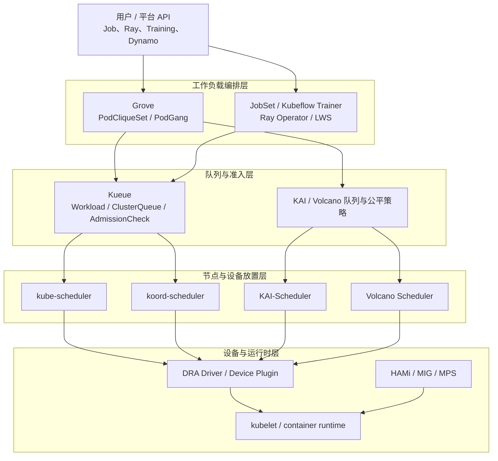
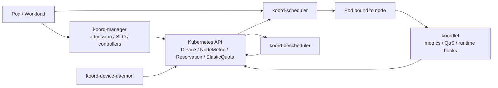
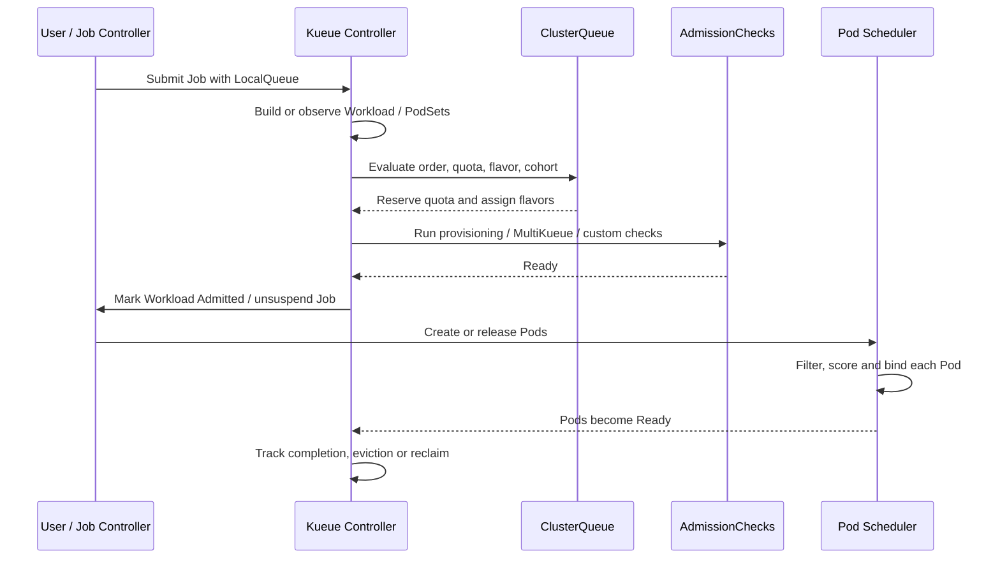
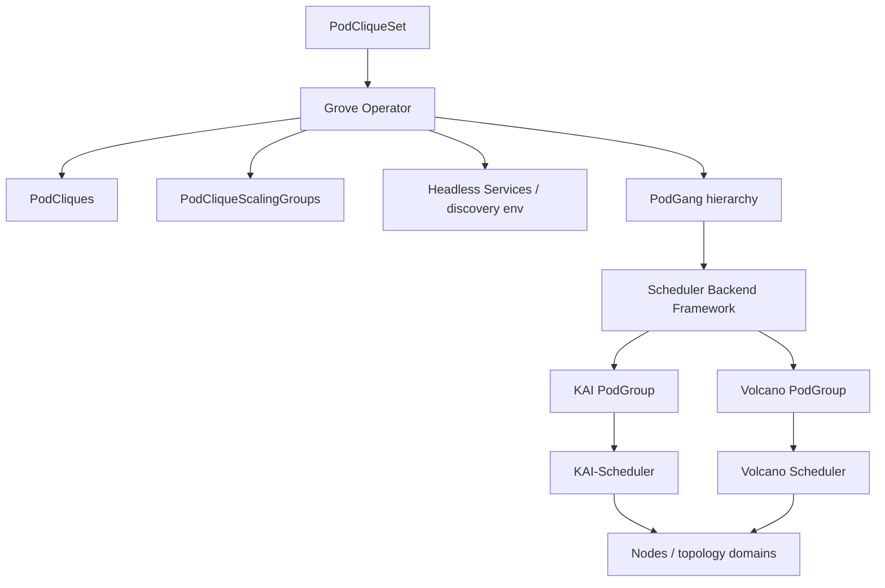
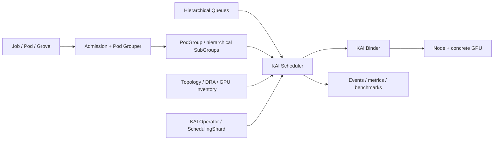
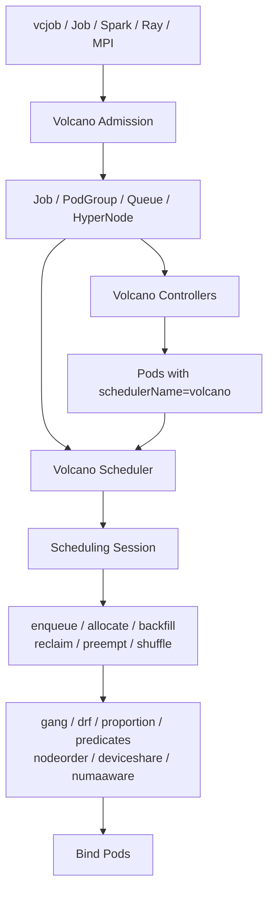
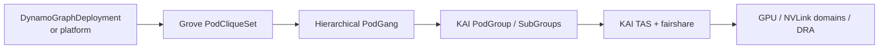

# Kubernetes AI 调度器深度技术文档

> **Koordinator、Kueue、Grove、KAI-Scheduler 与 Volcano 的架构、调度语义和生产选型解析**
>
> 基于五个项目的官方仓库、官方文档和 CNCF 资料整理
>
> 稳定版本基线：Koordinator `v1.8.0@989ca85`、Kueue `v0.19.0@911a822`、Grove `v0.1.0-alpha.11@8fa3ece`、KAI-Scheduler `v0.17.0@f218c69`、Volcano `v1.15.1@0a56ed3`；审校日期：2026-08-07。

---

## 目录

- [自动生成目录占位](#自动生成目录占位)

---

## 第一章：先明确“调度器”的边界

### 1.1 五个项目并不处于同一层

Koordinator、Kueue、Grove、KAI-Scheduler 和 Volcano 经常一起出现在 Kubernetes AI 平台选型中，但把它们都叫作“调度器”会掩盖最重要的架构差异。

| 项目 | 核心定位 | 是否负责最终节点绑定 | 主要决策对象 |
|------|----------|----------------------|--------------|
| Koordinator | Kubernetes QoS、混部和精细资源编排系统 | 是，`koord-scheduler` 是独立 scheduler profile | Pod、Reservation、设备、NUMA、ElasticQuota |
| Kueue | Job 级队列、配额和准入控制器 | 通常否，准入后仍由 kube-scheduler 或其他调度器放置 Pod | Workload、PodSet、ClusterQueue、ResourceFlavor |
| Grove | 复杂 AI 推理工作负载的声明式编排 API | 否，通过 KAI、Volcano 等 scheduler backend 执行放置 | PodCliqueSet、PodClique、ScalingGroup、PodGang |
| KAI-Scheduler | 面向 GPU/AI 集群的批调度器 | 是，使用独立 `schedulerName` | PodGroup、Queue、Pod、GPU、拓扑域 |
| Volcano | 面向 AI/HPC/大数据的 Kubernetes 批处理系统 | 是，`volcano` scheduler 完成节点绑定 | Volcano Job、PodGroup、Queue、Pod、HyperNode |

一句话概括：

> **Kueue 决定工作负载什么时候可以开始，Grove 决定复杂推理系统由哪些协同组件组成，Koordinator/KAI/Volcano 更接近决定 Pod 最终放到哪里。**

它们不是必然互斥。例如 Kueue 可以负责多租户队列准入，Koordinator 负责准入后的节点、NUMA 和设备放置；Grove 可以表达一个多节点 Prefill/Decode 系统，再把 PodGang 翻译成 KAI 的 PodGroup。

### 1.2 Kubernetes 原生稳定能力还缺什么

标准 kube-scheduler 擅长对单个 Pending Pod 执行 Filter、Score、Reserve、Permit、PreBind 和 Bind。Kubernetes v1.35/v1.36 已引入 Workload/PodGroup、Gang、Topology-Aware Workload Scheduling 和 workload-aware preemption，但在 v1.36.3 中这些工作负载级能力仍为默认关闭的 Alpha feature。因此，以默认稳定能力为生产基线时，AI 与批处理工作负载通常还有六类集群级问题：

| 问题 | v1.36.3 默认稳定能力的缺口 |
|------|----------------------------|
| 多 Pod 原子启动 | 默认仍逐 Pod 调度；原生 PodGroup/Gang 可解决部分问题，但为 Alpha 且默认关闭 |
| 团队队列和配额 | `ResourceQuota` 限制命名空间总量，但不直接提供集群队列、公平借用和排队顺序 |
| GPU 精细语义 | DRA 核心已稳定，但具体 GPU driver、共享容量、隔离和部分高级设备能力仍需额外实现 |
| 通信拓扑 | 普通 affinity 难以表达整体可容纳性；原生 PodGroup TAS 为 v1.36 Alpha，且拓扑标签仍需可靠数据源 |
| 弹性任务 | 训练或推理副本往往有最小可运行规模、最大规模和成组扩缩关系 |
| 混部治理 | 在线服务、批任务和系统进程需要不同 QoS、资源超卖、驱逐与运行时隔离策略 |

这些问题分属不同控制层，不能靠一个 `schedulerName` 全部解决。

kube-scheduler 的完整调度周期、默认插件、DRA、原生 PodGroup/Gang/TAS 成熟度及与本篇五个项目的逐项对比，见 [Kubernetes 原生调度器深度技术文档](/Kubernetes-Native-Scheduler-Deep-Dive.html)。

### 1.3 统一分层模型



### 1.4 Gang Scheduling 与队列准入不是一回事

这两个概念经常被混用：

- **队列准入**先判断整个工作负载是否拥有配额、资源 flavor 和外部许可。Kueue 的核心就在这里。
- **Gang Scheduling**保证一组 Pod 达到最小成员数后才整体进入绑定/运行阶段，避免只占住一部分资源。
- **层次化 Gang**进一步表达“一个服务由多个角色构成，每个角色内部又有多 Pod 实例”的约束。Grove + KAI 重点解决这一类推理系统。
- **All-or-nothing admission**不一定等于调度事务。Kueue 可以预留总配额并等待 Pods Ready，但最终 Pod 仍可能由另一个调度器逐个放置。

生产设计必须同时回答三个问题：工作负载何时获准启动、多少 Pod 一起启动、获准后放到哪些节点和设备。

---

## 第二章：五个项目的快速对照

### 2.1 定位总表

| 维度 | Koordinator | Kueue | Grove | KAI-Scheduler | Volcano |
|------|-------------|-------|-------|---------------|---------|
| 首要目标 | 混部效率与精细资源调度 | Job 排队、配额和准入 | 复杂推理系统编排 | GPU/AI 批调度 | 通用批处理与 HPC |
| 控制面形态 | Scheduler + Manager + Koordlet + Descheduler | Controller Manager + Webhook | Operator + PodGang Controller + backend | Scheduler + Binder + Admission + Controllers | Scheduler + Controllers + Admission |
| 核心 API | ElasticQuota、Reservation、Device、NodeMetric | Workload、LocalQueue、ClusterQueue、ResourceFlavor、Topology | PodCliqueSet、PodClique、PodCliqueScalingGroup、PodGang | PodGroup、Queue、Config、SchedulingShard | Job、PodGroup、Queue、HyperNode、JobFlow |
| Gang | Coscheduling | 准入及 PodsReady 机制 | 层次化 Gang 描述 | 原生 PodGroup 与层次化 PodGroup | 原生 PodGroup/Gang plugin |
| 队列 | ElasticQuota 多树 | LocalQueue/ClusterQueue/Cohort | 依赖 backend/上层平台 | 层级队列与公平共享 | Queue + DRF/Proportion/Capacity |
| GPU | 设备共享、联合分配、NVLink/NUMA | GPU 作为配额资源，支持 DRA/TAS | 描述资源与拓扑需求 | GPU sharing、DRA、拓扑、reservation | DeviceShare、Dynamic MIG、NUMA、拓扑 |
| 多集群 | 不是核心能力 | MultiKueue | 不是核心能力 | 不是核心能力 | HyperJob 等方向在演进 |
| 在线/离线混部 | 核心能力 | 可管理 batch 与部分长运行 workload | 面向推理组件 | 支持训练、推理和交互任务 | 以批任务/HPC 为主，含混部扩展 |

### 2.2 最常见的误选

| 需求 | 容易误选 | 原因 |
|------|----------|------|
| 只需要团队配额和排队 | 直接替换 kube-scheduler | 节点算法不是主要问题，Kueue 的准入层更贴近需求 |
| 需要多节点推理组件成组扩缩 | 只部署 KAI/Volcano | 调度器能放 Pod，但不天然拥有完整推理系统的组件模型和启动顺序 |
| 需要显存硬隔离 | 只部署任一调度器 | 调度决策不等于容器内隔离，仍需 MIG、HAMi-Core 或厂商 DRA/runtime 能力 |
| 需要在线离线混部 | 只看 Gang/Queue | 还需要节点指标、QoS、cgroup、资源回收和驱逐闭环，Koordinator 更完整 |
| 需要 HPC 风格 Job 生命周期 | 只部署 Kueue | Kueue 管准入，不提供 Volcano Job 那样的完整任务状态机和插件体系 |

### 2.3 选型前先问的五个问题

1. 平台需要的是“排队”还是“替换节点调度器”？
2. 调度对象是单 Pod、普通 Job、分布式训练，还是多组件推理图？
3. 配额需要静态上限，还是跨团队借用、公平回收和历史公平性？
4. 拓扑只到机架，还是需要 NVLink、NUMA、GPU/NIC 联合分配和多节点 NVLink？
5. 设备份额由谁执行隔离，调度器、DRA driver、MIG、MPS 与 HAMi 的边界是否明确？

---

## 第三章：Koordinator

### 3.1 定位与适用范围

Koordinator 是一个基于 QoS 的 Kubernetes 工作负载编排系统，目标是在同一集群中安全地提高在线服务和批任务的部署密度、资源利用率与性能稳定性。它不只是一个调度器，而是一套从控制面到节点运行时的资源治理系统。

Koordinator 更适合以下场景：

- 在线服务、离线训练、数据处理任务共用节点，需要资源超卖和干扰控制。
- GPU/异构设备需要按显存、算力、型号、PCIe、NUMA 或 NVLink 关系选择。
- 调度需要使用实时/历史节点负载，而不只看 requests。
- 平台需要 Reservation、细粒度 CPU/NUMA 编排、重调度和多层配额。

如果目标只是让 Job 进入队列并按部门配额控制开始时间，引入整套 Koordinator 通常比使用 Kueue 更重。

### 3.2 总体架构

| 组件 | 运行位置 | 核心职责 |
|------|----------|----------|
| `koord-scheduler` | 控制面 | 基于 Kubernetes Scheduling Framework 执行负载感知、设备、NUMA、Reservation、Coscheduling 等插件 |
| `koord-manager` | 控制面 | 管理 CRD、SLO、资源画像、弹性配额、迁移和 admission 逻辑 |
| `koordlet` | 每个节点 | 采集资源指标、管理 cgroup/QoS、执行资源抑制、驱逐和 runtime hooks |
| `koord-descheduler` | 控制面 | 识别不合理放置并通过迁移/驱逐恢复期望状态 |
| `koord-device-daemon` | 设备节点 | 发现和上报 GPU 等异构设备信息 |



### 3.3 Scheduler Framework 插件

Koordinator v1.8.0 中的关键 scheduler plugins 包括：

| 插件 | 作用 |
|------|------|
| `loadaware` | 根据 NodeMetric 和估算负载过滤/打分，避免 requests 看起来空闲但实际繁忙的节点 |
| `coscheduling` | 使用 PodGroup 或 annotation 实现 Gang/Coscheduling |
| `elasticquota` | 多层 ElasticQuota 树、配额借用和运行时配额管理 |
| `reservation` | 将预留资源建模为一等对象，支持资源预留、复用和抢占 |
| `deviceshare` | 选择具体 GPU/RDMA 等设备，支持份额和设备拓扑约束 |
| `nodenumaresource` | 按 NUMA、CPU topology 和 kubelet Topology Manager 策略放置 |
| `noderesourcefitplus` | 为不同资源配置更细的 Fit/Score 策略 |
| `scarceresourceavoidance` | 避免普通任务消耗稀缺硬件节点 |
| `schedulinghint` | 利用队列提示降低无效重试 |

Koordinator 复用上游 Scheduling Framework，因此其扩展点仍遵循 PreFilter、Filter、Score、Reserve、Permit、PreBind 等 kube-scheduler 语义，而不是另起一套 Session/Action 框架。

### 3.4 设备模型与 GPU 调度

Koordinator 使用节点级 `Device` CR 保存设备实例信息，并通过 Pod annotations 传递精细分配意图和结果。常用资源包括：

| 资源/接口 | 含义 |
|-----------|------|
| `koordinator.sh/gpu` | 组合 GPU 资源语义 |
| `koordinator.sh/gpu-core` | GPU 算力比例 |
| `koordinator.sh/gpu-memory` | GPU 显存绝对量 |
| `koordinator.sh/gpu-memory-ratio` | GPU 显存比例 |
| `koordinator.sh/device-allocate-hint` | 型号、设备选择、拓扑和分配策略提示 |
| `koordinator.sh/device-joint-allocate` | GPU、RDMA 等设备联合分配 |
| `koordinator.sh/gpu-partition-spec` | GPU 分区/NVLink 分组偏好或强约束 |

DeviceShare 可以在 Device、PCIe、NUMA Node、Node 等层级表达拓扑范围，也可以选择 NVIDIA、AMD、Hygon、Ascend 等已接入后端。它负责“选择哪张设备”，但是否严格限制显存仍取决于 MIG、HAMi-Core 或厂商运行时。

### 3.5 Gang 与弹性配额

Koordinator 的 Coscheduling 支持两种常见入口：

- 使用兼容 scheduler-plugins 的 `PodGroup` CRD。
- 通过 gang name、min available、wait time 等 annotations 让普通控制器生成的 Pods 成组调度。

ElasticQuota 不只是命名空间硬上限。它可以形成多层 quota tree，表达团队、项目、子项目之间的 `min`、`max`、共享权重和运行时可借用额度。多棵 quota tree 还能隔离不同资源池或组织域。

### 3.6 Reservation 与 NUMA

`Reservation` 把“未来要给某类工作负载使用的一组资源”建模为独立对象。典型用途包括：

- 为即将启动的大训练任务预留整机或 GPU。
- 让多个 owner 匹配并复用预留资源。
- 预留 CPU、内存和设备的组合，而不是仅靠假 Pod 占位。
- 在抢占和重调度过程中保持资源意图。

NodeNUMAResource 会结合 CPU Manager、Topology Manager 和 NodeResourceTopology 信息，完成 CPU socket/NUMA 对齐、独占 CPU、放大资源与设备亲和。它适合对 PCIe/NUMA 跨域延迟敏感的训练和推理工作负载。

### 3.7 最小示例

以下示例请求一张完整 GPU，并明确使用 Koordinator 调度器：

```yaml
apiVersion: v1
kind: Pod
metadata:
  name: koord-gpu-demo
spec:
  schedulerName: koord-scheduler
  containers:
  - name: worker
    image: nvcr.io/nvidia/cuda:12.8.0-base-ubuntu22.04
    command: ["bash", "-c", "nvidia-smi && sleep 3600"]
    resources:
      limits:
        koordinator.sh/gpu-core: "100"
        koordinator.sh/gpu-memory-ratio: "100"
```

实际资源名和隔离方式必须与已安装的 Koordinator release、device daemon 和 GPU runtime 配置一致。

### 3.8 优势与限制

**优势：** 调度、节点 QoS、混部、设备、NUMA、Reservation 和重调度形成闭环；适合平台工程团队做统一资源治理。

**限制：** 组件多、策略面广，部署和参数治理成本高；队列准入和 Job 生命周期不是它唯一或最强的抽象；部分新能力依赖 proposal、feature gate 或特定硬件上报链路，必须按 release 验证。

---

## 第四章：Kueue

### 4.1 Kueue 不是 kube-scheduler 的替代品

Kueue 是 Kubernetes SIG Scheduling 项目，官方定义是 Job queueing 的 API 和 controller。它在 Job/Workload 层决定：

- 工作负载是否进入某个队列。
- 当前是否有足够配额和合适的 ResourceFlavor。
- 是否需要等待云资源供给、多集群调度或其他 AdmissionCheck。
- 何时允许 Job 创建/恢复活动 Pods，以及何时停止并释放配额。

Kueue 通常不选择具体节点，也不执行 Bind。工作负载被 admitted 后，Pod 继续交给 `default-scheduler`、`koord-scheduler` 或其他 scheduler。

### 4.2 核心对象

| 对象 | 作用域 | 作用 |
|------|--------|------|
| `LocalQueue` | Namespace | 用户提交入口，指向一个 ClusterQueue |
| `ClusterQueue` | Cluster | 定义可用资源、flavor、队列策略、namespace 范围和抢占策略 |
| `Workload` | Namespace | Kueue 的统一调度对象，包含一个或多个 PodSet 及其总资源需求 |
| `ResourceFlavor` | Cluster | 把配额映射到某类节点、污点、GPU 型号或容量来源 |
| `Cohort` | Cluster | 让多个 ClusterQueue 在治理边界内借出/借入闲置配额 |
| `WorkloadPriorityClass` | Cluster | 独立于 Pod PriorityClass 的排队优先级 |
| `AdmissionCheck` | Cluster | 将外部容量供给、MultiKueue 或自定义审批接入准入流程 |
| `Topology` | Cluster | 定义机房、block、rack、host 等层级标签 |

当前快照中生产 API 已进入 `kueue.x-k8s.io/v1beta2`，README 要求 Kubernetes 1.29 或更新版本。升级时需要按 Kueue 的 API 迁移和 Kubernetes deprecation policy 处理旧版对象。

### 4.3 端到端准入流程



Kueue 把不同框架的 Job 转换成统一 Workload 视图。内建集成包括 Kubernetes Job、JobSet、Kubeflow Training Jobs、RayJob/RayCluster/RayService、LeaderWorkerSet、普通 Pod/PodGroup、Deployment 和 StatefulSet 等；不同集成的 suspend、PodSet 和 completion 语义并不完全相同。

### 4.4 配额、Flavor 与 Cohort

ClusterQueue 的 `resourceGroups` 把一组资源和多个 flavor 关联起来。例如 CPU、内存和 `nvidia.com/gpu` 可绑定到 `a100`、`h100`、`spot-h100` 等 flavor。每个资源可配置：

- `nominalQuota`：队列名义拥有的额度。
- `borrowingLimit`：最多可从 Cohort 其他队列借多少。
- `lendingLimit`：最多允许其他队列借走多少。

Flavor fungibility 策略决定首选 flavor 不足时是尝试抢占，还是先尝试下一个 flavor。Cohort 则为配额共享定义边界，避免把所有团队放进一个全局争用池。

### 4.5 排队、公平与抢占

Kueue 提供 `StrictFIFO` 和 `BestEffortFIFO` 等队列策略：

- StrictFIFO 强调队首顺序，但大作业可能造成 head-of-line blocking。
- BestEffortFIFO 允许暂时跳过当前无法准入的工作负载，提高资源利用率。

抢占策略可处理同队列优先级、Cohort 内借用回收以及公平共享。Fair Sharing 使用队列 share 衡量资源占用，让长期超占的队列更可能成为回收目标。它解决的是准入配额，而不是节点级 Pod 抢占的全部细节。

### 4.6 Topology-Aware Scheduling

Kueue TAS 在准入时计算每个 topology domain 的可用容量，为 PodSet 写入 topology assignment，再通过 node selector/affinity 约束最终调度。当前快照中 `TopologyAwareScheduling` 为 Beta 且默认开启。

用户可表达：

- preferred topology：尽量收敛到给定层级，放不下时逐级放宽。
- required topology：必须位于指定 topology domain。
- unconstrained topology：只要求整体容量可容纳，不限制收敛域。
- PodSet group：多个 PodSet 共同在同一拓扑域内拟合。
- slice/multi-layer constraints：为大规模训练表达分片和多层拓扑需求，具体成熟度受 feature gate 限制。

TAS 先做容量准入，再让 kube-scheduler 执行最终绑定，因此集群中其他非 Kueue Pod、节点变化和调度插件仍可能影响结果。`waitForPodsReady` 与失败恢复配置用于处理已准入但迟迟无法 Ready 的情况。

v0.19.0 将 `TASAssignmentsEncodingByHostnamePrefix` 与 `TASMultiLayerTopology` 提升为 Beta 并默认开启；前者压缩 hostname-level assignment，可支撑远超旧单 slice 上限的节点规模，后者允许 workload 表达多层 slice constraint。升级前要确认自研 controller/审计工具能读取新 encoding，不能依赖旧 assignment 的逐 hostname 展开形态。

### 4.7 AdmissionCheck 与 MultiKueue

AdmissionCheck 是 Kueue 的重要扩展边界：配额已预留，不代表立即启动。工作负载还可以等待：

- Cluster Autoscaler 的 ProvisioningRequest 创建新节点。
- MultiKueue 在多个 worker cluster 中寻找容量并分发 Job。
- 外部许可、数据就绪、合规审批或平台自定义 controller。

临时失败可释放配额、重新排队并退避重试；永久失败会拒绝并停用 Workload，避免无限占用准入状态。

v0.19.0 的 MultiKueue `ClusterProfile` 优先使用 `accessProviders`；旧 `credentialsProviders` 仍可读但已弃用，且二者不能同时设置。incremental dispatcher 按 `MultiKueueConfig.spec.clusters` 顺序选择 worker cluster，并支持 `stepSize`，可显式表达 on-prem 优先、公有云溢出等策略；新增 dispatched/admitted metrics 用于区分“已创建远端 Workload”和“远端已准入”。

### 4.8 最小示例

管理员创建 flavor、ClusterQueue 和 LocalQueue：

```yaml
apiVersion: kueue.x-k8s.io/v1beta2
kind: ResourceFlavor
metadata:
  name: h100
spec:
  nodeLabels:
    accelerator: nvidia-h100
---
apiVersion: kueue.x-k8s.io/v1beta2
kind: ClusterQueue
metadata:
  name: research
spec:
  namespaceSelector: {}
  queueingStrategy: BestEffortFIFO
  resourceGroups:
  - coveredResources: ["cpu", "memory", "nvidia.com/gpu"]
    flavors:
    - name: h100
      resources:
      - name: cpu
        nominalQuota: "256"
      - name: memory
        nominalQuota: 2Ti
      - name: nvidia.com/gpu
        nominalQuota: "32"
---
apiVersion: kueue.x-k8s.io/v1beta2
kind: LocalQueue
metadata:
  namespace: team-a
  name: gpu-queue
spec:
  clusterQueue: research
```

用户只需把 Job 指向 LocalQueue：

```yaml
apiVersion: batch/v1
kind: Job
metadata:
  namespace: team-a
  name: training
  labels:
    kueue.x-k8s.io/queue-name: gpu-queue
spec:
  suspend: true
  template:
    spec:
      restartPolicy: Never
      containers:
      - name: trainer
        image: registry.k8s.io/e2e-test-images/agnhost:2.53
        resources:
          requests:
            cpu: "4"
            memory: 16Gi
            nvidia.com/gpu: "1"
```

### 4.9 优势与限制

**优势：** 不需要替换现有 scheduler；API 与 Kubernetes Job 生态结合紧密；配额、flavor、Cohort、MultiKueue 和 AdmissionCheck 适合公有云与多租户平台。

**限制：** 不直接解决具体 GPU/NUMA 设备选择和运行时隔离；复杂 Gang 的最终原子放置仍依赖 Pod scheduler 或 PodsReady 恢复策略；集成对象多，升级前要检查对应 Job framework 的版本和 suspend 语义。

### 4.10 v0.19.0 升级前置与默认值

| 项目 | v0.19.0 变化 | 升级动作 |
|------|--------------|----------|
| DRA gate | 删除旧 `DynamicResourceAllocation` gate，改用 `KueueDRAIntegration`；ExtendedResource/PartitionableDevices 为 Beta 默认开 | 清理旧 gate，核对 `deviceClassMappings` 与 counter source 配置 |
| WaitForPodsReady | 新装和未显式配置的升级实例默认开启，timeout/recovery timeout 均为 30 分钟 | 先按作业启动时间显式配置；临时回退可使用 `DisableWaitForPodsReady` gate |
| MultiKueue path kubeconfig | `locationType=Path` 限制在 `/etc/multikueue/kubeconfigs` | 移动文件，或迁移到 Secret/ClusterProfile；删除 insecure kubeconfig gate |
| Kueue Populator Helm | 新 chart 不会接管旧 hook 创建的 ConfigMap/RBAC | 升级前定向删除旧 `*-kueue-hook-*` 与 `*-kueue-resources` 对象 |
| Ray quota | autoscaler sidecar、SidecarMode submitter 资源开始计入 head PodSet | 为 ClusterQueue 补 CPU/内存 headroom，避免升级后 Workload 无法准入 |
| API/library | 自研 integration 调用 `RestorePodSetsInfo` 时必须传 Kubernetes context；API 使用 `SchemeGroupVersion` | 先重新编译 out-of-tree integration，再升级 controller |
| Workload shape | 单 Workload 最大 PodSets 从 10 提升到 18；负 `subGroupCount` 先 warning，v0.20 将拒绝 | 修复非法对象，不把 warning 当长期兼容承诺 |

v0.19.0 还提高默认 client QPS/burst 与 Workload/LQ/CQ reconcile concurrency。大型集群可能受益，但 API Server 较小或 webhook 较慢的环境应监控 throttling、workqueue depth 和 reconciliation latency，而不是无条件沿用新并发值。

---

## 第五章：Grove

### 5.1 Grove 是推理编排 API，不是通用队列调度器

Grove 的口号是“One API. Any inference architecture”。它允许用户用一个 `PodCliqueSet` 描述单 Pod、单节点、多节点、Prefill/Decode 分离或包含路由器的完整推理系统，并由 operator 生成一组有关联的控制器、Pod、Service 和 PodGang。

Grove 主要补齐 Kubernetes Deployment/StatefulSet 不擅长表达的四件事：

1. 多 Pod 才构成一个可用副本，扩缩单位不是单 Pod。
2. 一个推理服务内部存在多层 Gang，例如整个 P/D pipeline 和每个多节点 worker 都有最小成员约束。
3. leader、worker、router、prefill、decode 之间可能有明确启动顺序。
4. 组件需要按 NVLink 域、机架或其他网络拓扑整体放置。

### 5.2 四个核心概念

| 概念 | 语义 |
|------|------|
| `PodClique` | 相同 Pod 模板的一组副本，代表 frontend、leader、worker、prefill 或 decode 等角色 |
| `PodCliqueScalingGroup` | 多个 PodClique 按固定关系共同扩缩，适合一个 leader + N workers 的多节点实例 |
| `PodCliqueSet` | 顶层服务对象，包含组成完整系统的 cliques 和 scaling groups |
| `PodGang` | Grove 调度 API，描述一个或多个 Pod group 的最小可用成员，交给 scheduler backend |

三级扩缩对应不同业务含义：

- 扩 `PodCliqueSet`：复制整个推理系统实例。
- 扩 `PodCliqueScalingGroup`：增加一套多节点组件实例。
- 扩 `PodClique`：调整某个角色的 Pod 数量。

### 5.3 控制器与调度后端



Grove scheduler backend 的职责是：

- 将 Grove PodGang 翻译为后端调度器理解的 PodGroup/API。
- 给 Pods 设置正确的 `schedulerName`、group 标记和 scheduling gates。
- 同步创建、更新和删除后端资源。
- 将 Grove 的拓扑绑定映射到后端 topology API。

Grove v0.1.0-alpha.11 已提供可插拔 scheduler backend profile，API 列出的有效 profile 包括 `default-scheduler`、`kai-scheduler`、`volcano` 和 `lpx-scheduler`。该版本仍是 Alpha，各 backend 对 Gang、拓扑和状态回传的语义并不完全等价，部署前必须按固定 release 的 backend 文档和 CRD 验证。

### 5.4 启动顺序与服务发现

PodClique 支持同配置 Pod 的稳定命名，Grove 还能注入环境变量，使组件发现同 clique、父 PodCliqueSet 和其他角色。启动类型包括：

- `AnyOrder`：各 clique 可并行启动。
- `InOrder`：按声明顺序启动。
- `Explicit`：通过 `startsAfter` 表达依赖图。

调度成功与应用就绪是两回事。启动顺序负责控制 Pod 何时解除 gate/创建，readiness probe 和应用协议仍负责确认 worker、router 或 rendezvous 服务真正可用。

### 5.5 拓扑与多节点 NVLink

Grove 通过 ClusterTopologyBinding 建立自己的拓扑层级与后端 topology resource 的映射。它可以描述从广到窄的层级，例如 zone、rack、host、NVLink domain，并决定后端资源由 Grove 管理还是由平台外部管理。

对 GB200/GB300 等 Multi-Node NVLink 场景，v0.1.0-alpha.11 的 API 和设计文档已经包含 DRA `ResourceClaimTemplate`、ComputeDomain 和多 Pod 共享 claim，但 `autoMNNVLEnabled` 默认关闭。这类 Alpha 能力涉及三层契约：

1. Grove 表达哪些组件共享资源声明。
2. scheduler backend 保证这些组件按 Gang 和拓扑放置。
3. NVIDIA DRA driver 等设备驱动实际分配 compute domain 和设备。

### 5.6 最小示例

```yaml
apiVersion: grove.io/v1alpha1
kind: PodCliqueSet
metadata:
  name: disaggregated-demo
spec:
  replicas: 1
  template:
    cliques:
    - name: frontend
      spec:
        roleName: frontend
        replicas: 1
        podSpec:
          containers:
          - name: frontend
            image: example.invalid/frontend:v1
    - name: decode-leader
      spec:
        roleName: decode-leader
        replicas: 1
        podSpec:
          containers:
          - name: leader
            image: example.invalid/decode:v1
    - name: decode-worker
      spec:
        roleName: decode-worker
        replicas: 3
        podSpec:
          containers:
          - name: worker
            image: example.invalid/decode:v1
    podCliqueScalingGroups:
    - name: decode-group
      cliqueNames: ["decode-leader", "decode-worker"]
      replicas: 1
```

示例只展示对象关系；字段细节和 backend 配置应以目标 Grove release 的 API reference 与 samples 为准，不能直接把概念示例当成生产清单。

### 5.7 滚动更新与扩缩边界

普通 Deployment 可以多创建一个 Pod 再删除旧 Pod，但多节点推理副本必须成组更新。Grove 的 rolling update 需要保持 clique/scaling group 的一致性、Gang 可用性和启动顺序。当前路线还包括更节省资源的 rolling update、topology spread 和自动拓扑发现。

自动扩缩也不是简单对所有组件设相同 HPA：PodClique、ScalingGroup 和 PodCliqueSet 三个层次有不同 selector 与最小规模约束。生产中必须指定由谁拥有每个层次的副本数，避免 HPA、Dynamo Planner 和人工修改同时写同一字段。

### 5.8 优势与限制

**优势：** 用单一 CR 表达多组件、多节点推理系统；层次化 Gang、成组扩缩、启动顺序和服务发现比手写多个 Deployment 更一致；与 Dynamo/KAI 的组合紧密。

**限制：** API 仍以 `v1alpha1` 为主，迭代速度快；它不提供 Kueue 式全局配额，也不独立完成节点放置；backend、拓扑和 DRA 能力必须按具体版本核对。

---

## 第六章：KAI-Scheduler

### 6.1 项目沿革与治理

KAI-Scheduler 是面向大规模 GPU 集群和高吞吐 AI/ML 工作负载的 Kubernetes scheduler。项目源自 Run:ai Scheduler；Run:ai 被 NVIDIA 收购后，项目曾在 NVIDIA GitHub 组织和 NVIDIA/Run:ai 团队推动下开源，随后贡献给 CNCF，目前位于 `kai-scheduler` 组织并成为 CNCF Sandbox 项目。

因此，“KAI-Scheduler 由 NVIDIA 捐赠”描述的是其进入 CNCF 的项目贡献和治理变化；技术沿革仍应注明最初来自 Run:ai，不能简单写成 NVIDIA 从零创建。

KAI 可与集群其他 scheduler 并存，只有指定其 `schedulerName` 或被 admission/pod grouper 接管的工作负载走 KAI 调度路径。

### 6.2 总体架构

| 组件 | 职责 |
|------|------|
| Scheduler | 维护集群快照，执行 allocate、reclaim、preempt、consolidation 等调度动作 |
| Queue Controller | 管理层级 Queue、配额、状态和默认队列 |
| Pod Grouper | 将 Job、JobSet、Grove 等工作负载归并为 PodGroup/SubGroup |
| Binder | 执行 PreBind/Bind、GPU sharing reservation 和设备分配信息注入 |
| Admission | 校验/变更 Pod、队列和 GPU 份额相关字段 |
| Operator | 通过 Config、SchedulingShard 等 API 部署和管理 KAI 组件 |
| Node Scale Adjuster | 为 GPU sharing workload 构造扩容信号，协同 Cluster Autoscaler |



### 6.3 PodGroup 与 Gang Scheduling

KAI 基于 kube-batch 演进，PodGroup 是核心调度单元。它记录最小成员、队列、优先级、资源需求和状态。Scheduler 只有在组满足可调度条件时才整体分配，避免分布式任务部分启动。

层次化 PodGroup 使用 SubGroup 表达多级结构。例如一个 Grove 服务可以是：

```text
PodCliqueSet gang
  prefill scaling group
    leader subgroup
    worker subgroup
  decode scaling group
    leader subgroup
    worker subgroup
  frontend subgroup
```

每一层都能有 `minMember` 或最小子组约束。这比只有一个扁平 `minAvailable` 更适合 P/D 分离、agentic pipeline 和多个多节点模型组成的系统。

### 6.4 层级队列与公平共享

KAI 的 Queue 可以构成组织层级，并配置：

- quota：队列保障额度。
- limit：最大可使用资源。
- over-quota weight：分享剩余资源的权重。
- priority：队列间的相对优先级。
- reclaim/preempt policy：何时回收跨队列借用或抢占任务。

公平算法以 Dominant Resource Fairness 为基础，同时支持 priority-based、time-based fairshare 等扩展。Time-based Fairshare 把历史使用量和时间衰减纳入当前 share，避免团队通过短时释放资源重置公平状态；这是比只看瞬时 usage 更复杂的治理模型，需要可靠的 metrics/TSDB 和明确的失效降级策略。

### 6.5 优先级、抢占与最小运行时间

KAI 将“调度优先级”和“是否可被抢占”分成可独立配置的策略，避免高优先级自动等于不可抢占。调度器可以执行：

- queue 内高优任务抢占低优任务。
- 回收其他队列超出保障额度的借用资源。
- consolidation，通过迁移可抢占 workload 减少 GPU 碎片。
- minimum guaranteed runtime，在任务启动后的一段时间内抑制 reclaim/preempt。

生产中必须为 checkpoint 成本、训练恢复时间和在线推理 SLO 设置合理保护期，否则提高公平性可能以频繁重启和 GPU 空转为代价。

v0.17.0 又增加了 preemption delay，用于解决 Pending workload、Cluster Autoscaler 和抢占之间的竞态。Pod/owner annotation `kai.scheduler/preemption-delay: "5m"` 或 PodGroup `spec.preemptionDelay: 5m` 会设置最小等待窗口；窗口内 workload 不能通过 preempt、reclaim 或 consolidation 驱逐别人，但仍可使用空闲容量，也仍可在运行后被其他 workload 驱逐。窗口从 PodGroup 创建时间起算；每次 eviction 后，scheduler 写入 `kai.scheduler/last-eviction-timestamp` 并重新计时，给下一次 autoscaler 扩容新的机会。

### 6.6 GPU Sharing、DRA 与隔离

KAI 支持整卡和 fractional GPU 调度，Binder 为共享 GPU 创建 reservation/分配信息。当前文档还包含与 HAMi-Core 集成的显存限制路径。

关键边界：

- GPU sharing 的“份额记账”不自动等于 CUDA 显存隔离。
- 使用 HAMi-Core 时，KAI 把份额转换为显存限制并由注入库执行；小数换算可能有取整误差。
- 使用 MPS 时，需要节点预先运行 MPS server，并理解其隔离模型。
- 使用 DRA 时，ResourceClaim/ComputeDomain 由对应 driver 分配，KAI 负责把 claim 和 PodGroup 调度约束纳入决策。

### 6.7 Topology-Aware Scheduling

KAI TAS 可以按节点标签/拓扑树计算 workload 是否能装入目标域，并为层次化 PodGroup 做组合放置。典型目标包括 host、rack、NVLink domain 和多节点 NVLink compute domain。

拓扑优化必须与 Gang 一起考虑：单独给每个 Pod 选“局部最优节点”，可能让最后一个 worker 无法放入同一域。KAI 先以 workload/subgroup 为单位评估域容量，再选择具体节点，可减少这类碎片。

### 6.8 Scheduling Shards 与规模

KAI Operator 使用 `SchedulingShard` 管理调度分片。不同 shard 可以按 node pool、scheduler profile 或工作负载范围隔离缓存和调度循环，面向数千节点、高提交吞吐的场景降低单实例压力。

分片不是无成本水平扩展：队列公平、全局资源视图、PodGroup 归属和 node pool 标签必须有唯一规则，避免同一 Pod 或节点被多个 shard 同时管理。KAI 提供持续 scale tests 和 benchmark dashboard，生产容量仍应使用自己的对象规模、队列深度和 topology 复杂度压测。

### 6.9 最小示例

KAI 通常由 Pod Grouper 根据上层 Job 自动创建 PodGroup。以下 Job 由 Pod Grouper 自动归组，并通过 `batch-min-member` 要求至少两个 Pod 构成可调度 Gang：

```yaml
apiVersion: batch/v1
kind: Job
metadata:
  name: kai-training
  annotations:
    kai.scheduler/batch-min-member: "2"
spec:
  parallelism: 4
  completions: 4
  template:
    metadata:
      labels:
        kai.scheduler/queue: default-queue
    spec:
      schedulerName: kai-scheduler
      restartPolicy: Never
      containers:
      - name: worker
        image: nvcr.io/nvidia/cuda:12.8.0-base-ubuntu22.04
        command: ["bash", "-c", "nvidia-smi && sleep 3600"]
        resources:
          limits:
            nvidia.com/gpu: "1"
```

如果 PodGroup 由 Grove 等外部控制器创建，则 Pod template 使用 `pod-group-name` annotation 关联，并设置 `kai.scheduler/skip-podgrouper: "true"` 防止 KAI Pod Grouper 覆盖外部状态。PodGroup API group、labels/annotations 和自动分组行为在版本间有演进，生产清单必须以安装版本的 quickstart、CRD 和 migration guide 为准。

### 6.10 优势与限制

**优势：** GPU 优先的资源模型、层级队列、公平回收、层次化 PodGroup、拓扑、DRA 和 Grove 集成覆盖现代训练与分离式推理；可与其他 scheduler 并存。

**限制：** 项目快速演进且 API/Helm migration 需要持续跟踪；GPU sharing 的隔离依赖外部运行时；相比 Volcano，其通用 HPC Job 生命周期和非 AI 生态覆盖更窄。

### 6.11 v0.16.5 至 v0.16.7 补丁修复

| 版本 | 修复 | 生产影响 |
|------|------|----------|
| v0.16.5 | `ResourceVector.SetMax` 可扩展到较长资源向量 | 只存在于部分节点的 extended resource 不再因 Node map 迭代顺序被误判为全局不可用 |
| v0.16.5 | root-level queue 跨 hierarchy branch reclaim message 不再 panic | reclaim 控制循环不会因空 `ParentQueue` 构造 eviction message 崩溃 |
| v0.16.5 | GPU-sharing volume name 对含点号 Pod 做合法化且保持 ConfigMap 引用 | 修复 fractional GPU Pod 因非法 volume name 无法创建的问题 |
| v0.16.5 | scheduler snapshot 在 cycle 间也携带 plugin config | `/get-snapshot` 输出不再让 replay tool 因 `config: null` panic |
| v0.16.5 | PyTorch/LWS 拒绝负 replica/worker index，并限制 block segmentation 最多 10,000 subgroups | 防止非法索引与无界 PodGroup fan-out |
| v0.16.6 | segmented PyTorch/LWS PodGrouper 在 parent SubGroup 使用 `minSubGroup` | 修复 admission webhook 拒绝分段 PodGroup 的问题 |
| v0.16.7 | segmented elastic PyTorchJob 只把 `minReplicas` 覆盖到的 worker segments 标为必需 | 不再因每个 worker segment 的 `MinAvailable` 都大于 0 而要求全部 workers 到齐 |

`v0.16.7` 先计算 `workerMinAvailable = max(0, totalMinAvailable - masterReplicas)`，再以 `mandatorySegments = ceil(workerMinAvailable / segmentSize)` 决定必需分段；超过该范围的分段设为 `MinAvailable=0`。例如 1 个 master、8 个 workers、`elasticPolicy.minReplicas=5`、segment size 为 2 时，4 个 worker segments 的 `MinAvailable` 依次为 `2, 2, 0, 0`。总 PodGroup 的 `MinAvailable` 仍为 5，parent worker subgroup 的 `MinSubGroup` 仍记录全部 4 个子分段；修复的是 elastic segments 不再阻塞调度，而不是取消层次化分组约束。

这些 patch 不改变 KAI 的总体架构，但直接影响资源可见性、reclaim 可用性、GPU sharing 和分组对象合法性。使用 PyTorch/LWS segmentation 或异构 extended resource 的集群不应停留在 v0.16.4；使用 segmented elastic PyTorchJob 的集群不应停留在 v0.16.6。升级到 v0.16.7 后，应同时重放 `minReplicas` 不是 segment size 整数倍、`minReplicas` 小于 worker replicas，以及 master/worker 数量不同的案例。该修复不改变普通非 elastic Job 的分组语义，也不取消 parent `minSubGroup`。

### 6.12 v0.17.0 稳定增量

| 能力或修复 | 生产影响 |
|------------|----------|
| Preemption delay | 为 autoscaler 预留扩容窗口；只延迟 workload 发起 eviction，不延迟空闲容量分配，也不是运行后免抢占保护 |
| Topology level alias | workload 可用 `rack` 等 alias 代替原始 node label key；alias 在同一 Topology 内必须唯一，且不能与 `nodeLabel` 冲突 |
| DRA-backed extended resources | 支持 KEP-5004 的 `DeviceClass.extendedResourceName` 请求路径，不要求 workload 显式创建 ResourceClaim |
| NUMA-aware scoring 与场景去重 | 偏好占用更少 NUMA zone，并跳过同一 Pending Job 已失败的等价 victim set，减少重复 simulation |
| Karta fallback podgrouper | 可把 Karta `gangScheduling.podGroup` 指令转换成 KAI PodGroup/SubGroups；原生 KAI plugin 优先 |
| FIPS 与 GitOps 安装 | 发布 `<version>-fips` 镜像，并增加 ArgoCD/离线渲染与外部管理 ServiceAccount、Namespace、PriorityClass 的 Helm 开关 |

v0.17.0 同时修复 operator 全集群缓存导致的内存增长、DRA device count 溢出、root queue reclaim panic、异构 extended resource 丢失、GPU sharing 资源上限判断、部分节点 GPU memory 计算、reclaim victim 排序和 401 token 失效后无限重试等问题。升级验证除原有 segmented workload 外，还应覆盖 preemption delay 到期/重置、Topology alias webhook、DRA extended resource、NUMA 与大规模 reclaim 内存曲线。

---

## 第七章：Volcano

### 7.1 定位

Volcano 是 CNCF Incubating 项目，定位为 Kubernetes 原生批处理系统，面向机器学习、深度学习、HPC、生物信息和大数据任务。它不仅提供 scheduler，还提供 Volcano Job、队列、admission、controllers、JobFlow 和插件化调度框架。

Volcano 同样源于 kube-batch，但经过多年演进形成了自己的 Session、Action、Plugin 模型和广泛框架集成。

### 7.2 三个核心控制面组件

| 组件 | 职责 |
|------|------|
| `volcano-scheduler` | 监听 PodGroup/Queue/Node，按 actions 和 plugins 执行分配、回收、抢占和绑定 |
| `volcano-controllers` | 管理 Volcano Job、Queue、PodGroup、JobFlow、HyperNode 等对象生命周期 |
| `volcano-admission` | 校验和变更 Volcano CRD、Pod/PodGroup，阻止非法配置进入系统 |



### 7.3 核心 CRD

| CRD | 用途 |
|-----|------|
| `batch.volcano.sh/Job` | 批任务模板、多个 Task、最小可用成员、生命周期和 plugin 配置 |
| `scheduling.volcano.sh/PodGroup` | Gang 调度单元，也可由其他 Job controller 使用 |
| `scheduling.volcano.sh/Queue` | 队列权重、保障/容量、层级和状态 |
| `topology.volcano.sh/HyperNode` | 描述机房网络或硬件的层次化性能域 |
| `nodeinfo.volcano.sh/Numatopology` | NUMA 资源视图 |
| `flow.volcano.sh/JobFlow` | 表达多个 Job 的依赖和工作流 |
| `flow.volcano.sh/JobTemplate` | 可复用 Job 模板 |

Volcano Job 可以包含多个 Task，例如 parameter server、worker 和 chief，并为每个 Task 配置副本、策略和退出行为。对于已有 JobSet、Spark、Ray 或 Kubeflow Training Operator，也可以只使用 Volcano PodGroup/scheduler，而不强制改成 Volcano Job。

### 7.4 Session、Action 与 Plugin

每个调度周期创建 Session，加载当前 Node、Queue、Job/PodGroup 和 Task 快照。Action 决定调度周期做什么，Plugin 为 Action 提供排序、过滤、资源公平和可抢占判断。

Volcano v1.15.1 的主要 actions 延续 v1.15.0 基线，包括：

| Action | 作用 |
|--------|------|
| `enqueue` | 判断 Job 是否可以进入可调度状态 |
| `allocate` | 为待调度 Task 分配节点 |
| `backfill` | 利用暂时空闲资源运行不阻塞高优任务的小任务 |
| `reclaim` | 从超用队列回收资源给应获得保障的队列 |
| `preempt` | 在 Job/Queue 内为高优先级 Task 选择 victims |
| `gangreclaim` / `gangpreempt` | 以 Gang 语义执行回收和抢占 |
| `shuffle` | 重新整理任务放置以改善碎片或策略目标 |

常用 plugins 包括 gang、drf、proportion、capacity、predicates、nodeorder、binpack、priority、deviceshare、numaaware、network-topology-aware、task-topology、resourcequota、overcommit 和 sla。插件顺序和启用组合会直接改变行为，不应照搬示例配置到生产。

### 7.5 Gang、DRF 与队列

Gang plugin 根据 PodGroup `minMember` 和 `minResources` 判断任务组是否拥有整体启动条件。它与 enqueue/allocate 配合，避免未达到最低规模的 Job 消耗节点。

队列公平可以采用不同模型：

- DRF 比较每个 Job/Queue 的 dominant share，适合 CPU、内存、GPU 混合资源。
- Proportion 按 queue weight、deserved、allocated 和 request 计算应得份额，并支持层级队列方向。
- Capacity 更接近 Kubernetes capacity scheduling 的保障/借用模型。
- Reclaim/Preempt 决定如何把已借出的资源拿回来。

选择算法前应先定义组织规则：保障额度、最大额度、借用、优先级和抢占成本。如果这些规则没有定清，切换 DRF 或 Proportion 只会改变不可预测性的形式。

### 7.6 拓扑、NUMA 与设备

Volcano 的拓扑能力覆盖多个层次：

- NUMA-aware plugin 使用 Numatopology 和 CPU/内存视图减少跨 NUMA 分配。
- Network Topology Aware Scheduling 使用 HyperNode 表达 rack、switch、block 等层次，并支持 hard/soft、highest-tier-allowed 等放置策略。
- DeviceShare 可扩展 GPU sharing、Dynamic MIG 和厂商设备分配。
- task-topology 表达 Job 内 Task 的 affinity/anti-affinity 顺序。

这些能力依赖节点发现、设备插件和 CRD 数据准确性。调度器看到的 topology 如果落后于物理网络或 MIG 重配置状态，算法再复杂也会做出错误判断。

### 7.7 生态集成

Volcano 的优势之一是批处理生态覆盖广。官方仓库列出 Spark、Flink、KubeRay、PyTorch、TensorFlow、Kubeflow Trainer、MPI、Horovod、PaddlePaddle、Argo、LeaderWorkerSet 等集成。

集成通常有三种方式：

1. 框架直接生成 `schedulerName: volcano` 和 PodGroup。
2. 使用 Volcano Job plugin 驱动框架任务。
3. 由 admission/controller 为普通 workload 创建 PodGroup。

选型时要核实所用框架版本真正支持哪一种，不要只根据生态列表判断兼容性。

### 7.8 最小示例

```yaml
apiVersion: batch.volcano.sh/v1alpha1
kind: Job
metadata:
  name: volcano-training
spec:
  minAvailable: 2
  schedulerName: volcano
  queue: default
  policies:
  - event: PodEvicted
    action: RestartJob
  tasks:
  - replicas: 2
    name: worker
    template:
      spec:
        restartPolicy: Never
        containers:
        - name: worker
          image: nvcr.io/nvidia/cuda:12.8.0-base-ubuntu22.04
          command: ["bash", "-c", "nvidia-smi && sleep 3600"]
          resources:
            limits:
              nvidia.com/gpu: "1"
```

### 7.9 安装、升级与兼容性事实

官方提供两条主要安装路径：release manifest，以及独立 `volcano-sh/helm-charts` 仓库中的 Helm chart。源码仓库也保留开发用 chart。官方 README 给出了 Volcano release 与 Kubernetes 版本兼容矩阵，升级前应以目标 release 的矩阵为准。

需要准确区分以下事实：

- 官方文档提供 `helm install` 和 `helm uninstall`，但这不等于官方声明每次升级都必须先卸载。
- 官方资料没有对任意跨版本、任意安装方式作“无中断平滑升级”的统一承诺。
- Volcano 包含多个 CRD、validating/mutating webhook、scheduler/controller 配置和存量 Job/PodGroup，升级验证不能只看 Deployment 是否滚动成功。
- 是否能直接 `helm upgrade` 取决于源版本、目标版本、chart 来源、CRD/schema 变化和 release notes。不能把某一版本的现场问题泛化成所有版本都不支持原地升级。

生产升级至少应先在 staging 复制以下对象和场景：Queue、运行中的 Volcano Job、外部 controller 创建的 PodGroup、HyperNode/NUMA 对象、webhook certificate、scheduler ConfigMap、Helm ownership 和回滚行为。若目标版本官方 release notes 要求迁移或重装，则按该版本步骤执行。

v1.8.2 到 v1.15.1 的跨度还包含两次默认 Queue plugin 变化、admission hook/Secret 生命周期修复、可选 Volcano Agent、`ColocationConfiguration` CRD、v1.15.0 的 DRA Queue quota 与 gang-aware eviction actions，以及 v1.15.1 的安全和调度补丁。v1.15.1 升级 `golang.org/x/crypto` 以纳入 SSH 安全修复，并修复 PVC informer race、PrePredicate 失败后的继续分配、DRA device count 溢出、scheduler nil panic、HAMi/Ascend 设备记账和 scalar milli-unit 计算等问题。逐版本矩阵、Feature 组合边界和定向处置命令见独立专篇：[Volcano 升级与 Feature 兼容性深度文档](/Volcano-Upgrade-Compatibility-Deep-Dive.html)。

### 7.10 优势与限制

**优势：** 完整批处理系统、成熟 Gang/Queue/DRF 插件、HPC/大数据生态广、Job 生命周期和拓扑能力丰富。

**限制：** 控制面和 CRD 面较大，插件组合需要专业治理；不同历史安装方式、chart 和 CRD 使升级测试复杂；对现代多组件推理的声明式层次模型不如 Grove 专门。

---

## 第八章：关键能力深度对比

### 8.1 调度与准入路径

| 能力 | Koordinator | Kueue | Grove | KAI-Scheduler | Volcano |
|------|-------------|-------|-------|---------------|---------|
| Job 排队 | 通过 ElasticQuota/外部系统组合 | 核心能力 | 不负责 | 核心能力 | 核心能力 |
| 配额预留后再建 Pod | 非主要模型 | 是 | 由 backend/上层决定 | PodGroup/Gang 路径 | PodGroup/Gang 路径 |
| 最终 Bind | 是 | 否 | 否 | 是 | 是 |
| 独立 schedulerName | `koord-scheduler` | 沿用 workload 指定值 | 由 backend 写入 | `kai-scheduler` | `volcano` |
| 普通 kube-scheduler 共存 | 是 | 天然共存 | 是 | 是 | 是 |
| 调度框架 | Kubernetes Scheduling Framework | Controller reconciliation | Operator + backend framework | kube-batch 衍生 session/actions | 自有 Session/Action/Plugin |

### 8.2 Gang 与弹性

| 维度 | Koordinator | Kueue | Grove | KAI-Scheduler | Volcano |
|------|-------------|-------|-------|---------------|---------|
| 扁平 PodGroup | 支持 | 支持 plain Pod/PodGroup 集成 | 生成 PodGang | 支持 | 支持 |
| 层次化 Gang | GangGroup 等组合能力 | PodSet group/TAS 侧重准入 | 核心抽象 | 核心集成能力 | 传统模型以扁平 PodGroup 为主，层次方向在演进 |
| 最小成员 | 支持 | Workload/PodSet 总量与 PodsReady | 每层 group 可定义 | PodGroup/SubGroup | `minMember` / `minAvailable` |
| Partial Admission | 非主要能力 | 原生支持部分 Job | 可按层扩缩 | 弹性 workload | Elastic Scheduler/Job scale 能力 |
| 成组扩缩 | 依赖 workload controller | 调整准入并动态回收 | 三级扩缩 | 支持弹性 PodGroup | Job/Elastic plugin |
| 启动顺序 | 不负责应用角色顺序 | 依赖 Job controller | 原生 clique 顺序/依赖 | 与层次 PodGroup/Grove 协作 | Task/plugin/policy 组合 |

### 8.3 队列与公平性

| 维度 | Koordinator | Kueue | KAI-Scheduler | Volcano |
|------|-------------|-------|---------------|---------|
| 层级队列 | ElasticQuota tree | ClusterQueue/Cohort，可构建层级 Cohort | 原生层级 Queue | Queue hierarchy/proportion 方向 |
| 名义保障 | `min` | `nominalQuota` | quota | deserved/capability 配置 |
| 最大上限 | `max` | flavor quota + borrowing limit | limit | capability 等策略 |
| 借用 | runtime quota | Cohort borrowing/lending | over-quota | proportion/capacity + reclaim |
| 公平算法 | quota runtime 计算 | Fair Sharing | DRF、priority/time-based fairshare | DRF、Proportion、Capacity |
| 队首阻塞控制 | 依赖组合策略 | StrictFIFO/BestEffortFIFO | 调度动作和队列排序 | enqueue/job order plugins |
| 历史用量公平 | 非核心 | 主要看当前 share | 支持 time-based 方向 | 默认算法主要看当前 session/state |

Grove 没有列入此表，因为它有 workload 层次，却没有独立的全局租户队列和公平分配系统。

### 8.4 GPU 与拓扑

| 能力 | Koordinator | Kueue | Grove | KAI-Scheduler | Volcano |
|------|-------------|-------|-------|---------------|---------|
| GPU 数量配额 | 支持 | 支持 | 透传 Pod requests | 支持 | 支持 |
| 选择具体 GPU | DeviceShare | 交给最终 scheduler/DRA | 交给 backend/DRA | Binder/TAS/DRA | DeviceShare/plugins |
| Fractional GPU | 支持资源份额 | 可对扩展资源计配额 | 不执行隔离 | 支持，隔离依赖 runtime | 支持，依赖设备插件/runtime |
| MIG | 分区/设备模型组合 | 通过 flavor/DRA 管理配额 | 通过 DRA/backend | DRA/设备路径 | Dynamic MIG/device sharing |
| NUMA | 强 | TAS 不等同机内 NUMA | 依赖 backend/DRA | NUMA/DRA 方向 | NUMA-aware |
| NVLink/设备拓扑 | GPU partition、joint allocation | Topology 到节点域，设备靠 DRA | ClusterTopologyBinding + backend | TAS + DRA ComputeDomain | HyperNode/device plugins |
| 多层网络拓扑 | NetworkTopologyAware | Topology/TAS | 核心编排需求 | TAS | HyperNode/network topology plugin |

### 8.5 API 与运维成熟度

| 项目 | API 特征 | 主要升级关注点 |
|------|----------|----------------|
| Koordinator | 多组 `v1alpha1` CRD 与 Kubernetes 扩展 API | feature gate、CRD、scheduler profile、koordlet/runtime hooks |
| Kueue | 核心 API 已到 `v1beta2`，遵循 Kubernetes deprecation policy | API conversion、Job integration、feature gates、支持的 Kubernetes 版本 |
| Grove | 主体为 `v1alpha1`，变化快 | CRD schema、backend contract、rolling update、DRA/topology API |
| KAI-Scheduler | PodGroup/Queue/Operator APIs 持续演进 | migration guide、Helm hooks、CRD upgrader、旧 annotations、支持分支 |
| Volcano | 历史较长，多组 `v1alpha1`/`v1beta1` CRD | chart 来源、CRD/webhook、scheduler plugins、Kubernetes 兼容矩阵 |

---

## 第九章：组合架构

### 9.1 Kueue + kube-scheduler

这是最轻的 Kubernetes 原生批任务队列方案：

```text
Job -> Kueue LocalQueue -> ClusterQueue admission
    -> unsuspend Job -> kube-scheduler -> Nodes
```

适合不需要替换节点算法，只需要团队配额、GPU flavor、优先级、云节点供给和多集群分发的平台。需要 Gang 时可结合 JobSet、LeaderWorkerSet、scheduler-plugins Coscheduling 或 Kueue PodsReady 策略。

### 9.2 Kueue + Koordinator

```text
Kueue: Workload/PodSet 配额、Flavor、Cohort、AdmissionCheck
Koordinator: Pod 节点、GPU、NUMA、Reservation、实时负载和混部 QoS
```

这是职责互补最清晰的组合之一。配置重点是确保 Kueue 准入时看到的资源 flavor 与 Koordinator 实际可分配设备语义一致，并让 workload 的 `schedulerName` 在 suspend/unsuspend 前后保持为 `koord-scheduler`。

### 9.3 Grove + KAI-Scheduler



该组合面向多节点、P/D 分离和 agentic inference：Grove 管组件结构、扩缩和启动顺序，KAI 管层次化 Gang、队列公平与拓扑放置。必须按 Grove/KAI 的版本矩阵检查 externally-created PodGroup、skip-podgrouper annotation 和 SubGroup 支持。

### 9.4 Grove + Volcano

Grove 的 scheduler backend framework 正在支持 Volcano PodGroup 映射。该组合适合已有 Volcano 集群，希望复用其 Queue、Gang 和批处理运维体系来承载 Grove 推理对象的平台。

需要重点验证：

- 所用 Grove release 是否已经包含可用的 Volcano backend，而不只是设计 proposal。
- Grove 的层次化 Gang 意图如何降级或映射到 Volcano PodGroup。
- topology API 由谁拥有，ClusterTopologyBinding 与 HyperNode 如何同步。
- 删除、滚动更新和 backend 切换时，旧 PodGroup 是否被正确清理。

### 9.5 HAMi 与五个项目的关系

HAMi 主要位于设备调度/运行时隔离层，不替代 Job queue 或推理编排：

| 组合 | 关注点 |
|------|--------|
| Kueue + HAMi | Kueue 对 HAMi 扩展资源做配额和 flavor，最终设备选择由 HAMi 路径执行 |
| Koordinator + HAMi-Core | Koordinator 选择设备，HAMi-Core 可作为 GPU 显存隔离 provider；避免两个 scheduler 同时分配同一设备 |
| KAI + HAMi-Core | KAI 记账 fractional GPU，HAMi-Core 执行 CUDA 显存限制 |
| Volcano + HAMi | Volcano DeviceShare/vGPU 路径与 HAMi 设备注册、资源名和隔离组件必须使用官方集成方案 |
| Grove + HAMi | Grove 只透传资源需求，真正的设备语义取决于选定 backend 与 HAMi 集成 |

任何组合都应只有一个组件拥有“具体设备分配”决定，多个 webhook、scheduler extender 或 binder 同时改写设备 annotation 会导致状态冲突。

---

## 第十章：生产部署与升级

### 10.1 上线前建立资源语义合同

平台团队应先写清楚以下合同，再安装调度器：

| 项目 | 必须明确的内容 |
|------|----------------|
| 资源名 | `nvidia.com/gpu`、fractional GPU、MIG、HAMi 和 DRA claim 分别代表什么 |
| 容量来源 | Node allocatable、Device CR、ResourceSlice、NodeMetric、HyperNode 谁是 source of truth |
| 队列规则 | 保障、上限、借用、优先级、公平和抢占成本 |
| Gang 规则 | 最小成员、超时、部分准入、失败重试和退出策略 |
| 拓扑规则 | required/preferred、域层级、数据更新者和故障域退化方式 |
| 隔离边界 | 调度记账、显存限制、算力限制、安全隔离分别由谁执行 |

### 10.2 多调度器共存

多 scheduler 共存并不复杂，复杂的是 admission ownership。建议：

- 每类 workload 明确唯一 `schedulerName`，并对默认值建立 policy。
- 审计所有 mutating webhooks，确认不会相互覆盖 `schedulerName`、resources、gates 和 annotations。
- 系统组件、调度器自身 Pod 和普通 Deployment 保留明确的默认调度路径。
- 每个 scheduler 使用独立 ServiceAccount、leader election resource 和 metrics endpoint。
- 对同一个 PodGroup 只允许一个 controller 创建/更新，Grove/KAI 集成尤其需要配置 skip-podgrouper。

### 10.3 高可用不等于调度无中断

控制器通常通过 leader election 部署多个 replicas，但 failover 仍会有 informer 重建、cache 恢复和正在进行的 bind/reconcile 重试。需要测试：

- leader 在 Allocate/Bind 中间退出。
- webhook 不可用时 API Server 的 failurePolicy 行为。
- scheduler cache 与实际 Pod/Node/Device 状态不一致后的恢复。
- PodGroup 已 admitted，但部分 Pod 被删除或节点失联。
- Queue/ClusterQueue 被停用或删除时存量 workload 的行为。

### 10.4 升级标准流程

1. 锁定源版本、目标版本、Kubernetes 版本和 chart 来源，阅读全部 migration/release notes。
2. 导出 CRD schema、所有自定义资源、webhook、RBAC、ConfigMap、Helm values 和镜像 digest。
3. 对比 API group/version、字段默认值、conversion webhook、废弃 annotation 和 feature gate。
4. 在 staging 使用真实对象规模验证排队、Gang、抢占、拓扑、运行中任务和回滚。
5. 暂停会改变全局状态的自动化，例如大规模抢占、consolidation 或批量扩缩。
6. 先确认新旧控制面不会同时管理同一对象，再按官方顺序升级 CRD、webhook、controllers 和 scheduler。
7. 验证 metrics、events、queue usage、pending reason、PodGroup 状态和设备分配，而不只看 Pod Ready。
8. 保留回滚所需旧镜像和配置；如果 CRD storage version 已迁移，确认回滚是否仍然兼容。

### 10.5 Volcano 升级的准确处理

Volcano 的官方兼容矩阵和目标 release 说明是唯一可泛化依据。现场曾出现的 webhook、CRD、Helm ownership 或存量对象问题，应记录为带源版本、目标版本、安装方式和复现步骤的内部 runbook，不能直接推导成“Volcano 一律不支持平滑升级”。

如果某个目标 release 的官方步骤明确要求卸载或迁移，则执行该步骤；否则先在 staging 验证 `helm upgrade`/manifest apply 和回滚。卸载控制面前还必须确认 Helm 是否会删除 CRD、Queue、Job、PodGroup 或其他持久对象，禁止把“重装组件”误操作成“删除业务状态”。

对 v1.8.2 到 v1.15.1，应把成功标准拆为 Helm/Manifest 更新、webhook 可用、CRD/API 可读写、存量 Job 连续推进、Queue 行为不变和 Agent 节点状态可回滚六层。完整证据与检查清单见 [Volcano 升级与 Feature 兼容性专篇](/Volcano-Upgrade-Compatibility-Deep-Dive.html)，本章不重复其版本和组合矩阵。

### 10.6 可观测性

至少建立以下仪表盘和告警：

| 层次 | 指标/状态 |
|------|-----------|
| 准入 | pending Workloads、admission latency、quota reservation、AdmissionCheck failures |
| 队列 | nominal/borrowed/used、dominant share、reclaim/preempt 次数、队首阻塞 |
| 调度 | scheduling attempts、E2E latency、unschedulable reason、cache size、bind errors |
| Gang | PodGroup phase、minMember gap、等待时长、partial ready、超时重排 |
| 拓扑 | 每域容量、assignment failures、fallback 层级、HyperNode/Topology freshness |
| 设备 | GPU allocation、显存/算力用量、fragmentation、MIG/DRA claim 状态 |
| 控制面 | leader changes、reconcile errors、webhook latency、workqueue depth、API throttling |

Kueue v0.19.0 可额外采集 `kueue_unadmitted_workloads`、`kueue_local_queue_unadmitted_workloads`、`kueue_pod_scheduling_gate_removal_seconds`、`multikueue_workloads_dispatched_total` 与 `multikueue_workloads_admitted_total`。前两类详细 pending reason 受 `UnadmittedWorkloadsObservability` gate 控制；显式初始化 `QuotaReserved=False`/`Admitted=False` 还需要 `UnadmittedWorkloadsExplicitStatus`，不能在 gate 关闭时期待指标和 condition 自动出现。

Events 必须作为排障入口，但不能作为长期时序存储。关键 pending reason 和队列状态应采集到 Prometheus 或平台数据库。

---

## 第十一章：场景化选型

### 11.1 决策表

| 场景 | 首选 | 组合建议 | 选择理由 |
|------|------|----------|----------|
| Kubernetes 原生 Job 排队与部门配额 | Kueue | Kueue + 默认 scheduler | 控制面轻，不替换节点调度，Job 集成和多集群强 |
| 云上 GPU flavor、自动扩容与多集群溢出 | Kueue | Kueue + ProvisioningRequest + MultiKueue | AdmissionCheck 和 ResourceFlavor 贴近云容量模型 |
| 在线离线混部与资源超卖 | Koordinator | Kueue + Koordinator | Koordinator 管节点 QoS/设备，Kueue 管租户准入 |
| 精细 GPU/NUMA/NVLink 放置 | Koordinator 或 KAI | 结合 DRA/HAMi/MIG | 两者均强调 AI 设备与拓扑，按队列和混部需求选择 |
| 大规模 GPU 训练、多级公平队列 | KAI-Scheduler | KAI + JobSet/Kubeflow | GPU 优先、DRF/历史公平、拓扑和高吞吐 |
| P/D 分离、多节点推理系统 | Grove + KAI | Dynamo + Grove + KAI + DRA | 编排、层次化 Gang、拓扑和推理扩缩职责完整 |
| 已有 Volcano 的 Grove 推理接入 | Grove + Volcano | 先验证 backend release | 复用现有队列和运维体系，注意层次语义映射 |
| Spark/Flink/MPI/HPC 统一批平台 | Volcano | Volcano + 对应 operator | Job 生命周期、插件和成熟生态更完整 |
| 只需要 GPU 显存共享 | HAMi/MIG/MPS | 再按需增加 Kueue | 隔离是设备层问题，不必先引入完整批调度器 |

### 11.2 选择 Kueue 还是完整批调度器

选择 Kueue，当你希望：

- 保留 kube-scheduler 或现有 scheduler。
- 用 Kubernetes API 管理队列、quota 和 flavor。
- 复用各类 Job controller，不引入新的 Job 生命周期。
- 使用 AdmissionCheck、Cluster Autoscaler 和 MultiKueue。

选择 KAI 或 Volcano，当你需要：

- scheduler 以 Job/PodGroup 为一等调度单元。
- 节点放置、Gang、抢占、回收和队列公平在同一个调度周期内联合求解。
- 对 GPU/topology 或 HPC plugin 有更强控制。

两者也可组合，但必须避免 Kueue quota 与下层 Queue quota 形成两套互不一致的资源承诺。一个常见原则是：Kueue 管跨集群/租户 admission，下层 scheduler queue 只做必要的 Gang/placement；或者只选其中一层做全局公平。

### 11.3 选择 Koordinator 还是 KAI-Scheduler

| 更偏 Koordinator | 更偏 KAI-Scheduler |
|------------------|-------------------|
| 在线与离线混部、节点 QoS 是核心 | GPU 批任务队列、公平共享是核心 |
| 需要 koordlet runtime hooks、资源抑制和干扰治理 | 需要 PodGroup、层级队列、历史公平和 workload consolidation |
| CPU/NUMA/Reservation 与 GPU 同等重要 | GPU topology、fractional GPU、DRA compute domain 更重要 |
| 希望紧贴 Kubernetes Scheduling Framework | 接受独立的批调度 action/session 模型 |

### 11.4 选择 KAI-Scheduler 还是 Volcano

| 更偏 KAI-Scheduler | 更偏 Volcano |
|--------------------|-------------|
| GPU/AI 是绝对主场景 | AI、HPC、Spark/Flink/MPI 等混合批处理 |
| Grove/Dynamo、层次化 PodGroup、现代推理拓扑重要 | Volcano Job、JobFlow、广泛框架集成重要 |
| 需要 time-based fairshare、GPU reservation/consolidation | 需要成熟 DRF/Proportion/Capacity 插件组合 |
| 可以跟随较快 API 和 migration 节奏 | 接受更大的历史 API/插件面和升级验证成本 |

### 11.5 建议的评测方法

不要只比较“每秒调度多少 Pod”。至少覆盖：

1. 1、8、64、512 Pod 的 Gang 在不同碎片率下的等待时间和成功率。
2. 小 Job 洪峰与大 Job 共存时的队首阻塞、公平性和 GPU 利用率。
3. 队列借用后高优团队回收资源的时间、victim 数和 checkpoint 损失。
4. 8 GPU 单机、跨机架、多节点 NVLink 域的放置质量和通信性能。
5. 节点失联、scheduler failover、webhook 超时和 API throttling 下的恢复。
6. 目标版本升级和回滚时，运行中 Job、PodGroup、Queue 和 CRD storage 的一致性。
7. 设备实际用量与 scheduler 记账偏差，尤其 fractional GPU 和动态 MIG。

---

## 第十二章：常见误区与技术趋势

### 12.1 常见误区

| 误区 | 正确理解 |
|------|----------|
| Kueue 是另一个 kube-scheduler | Kueue 核心是 Job 准入和配额，通常不 Bind Pod |
| Grove 可以单独完成 GPU 调度 | Grove 表达推理系统，节点放置依赖 scheduler backend 和设备驱动 |
| Gang 保证应用已经可用 | Gang 只保证调度/启动条件，应用 readiness 和 rendezvous 仍需独立处理 |
| GPU sharing 天然有显存硬隔离 | 份额记账与隔离分属调度层和 runtime/hardware 层 |
| Topology-aware 一定提高利用率 | 强拓扑约束可能增加碎片和等待，需要结合 SLO 选择 required 或 preferred |
| 装两个 scheduler 会自动协同 | schedulerName 可以隔离 Pod，但 quota、webhook、device ownership 仍需显式设计 |
| Volcano 官方要求所有升级卸载重装 | 官方没有这一普遍结论，应按具体版本、chart、CRD 和 release notes 验证 |
| KAI 完全由 NVIDIA 从零创建 | 项目源自 Run:ai，在 NVIDIA/Run:ai 推动下开源并贡献给 CNCF |
| CRD 是 YAML，所以升级天然安全 | schema、默认值、storage version、webhook 和 controller 语义都可能变化 |

### 12.2 Kubernetes 原生能力正在上移

Kubernetes v1.36.3 中，DRA 核心已在 v1.34 GA，并从 v1.35 起锁定为默认开启；Workload/PodGroup 与 Gang Scheduling 是 v1.35 Alpha，Topology-Aware Workload Scheduling 和 workload-aware preemption 是 v1.36 Alpha，均默认关闭。它们正在把一部分批调度与设备语义带入上游，但成熟度不能混写。

这不会立刻淘汰五个项目，但会改变它们的边界：

- Kueue 可以更直接地对 Workload 和 DRA claim 做准入。
- Koordinator、KAI 和 Volcano 可减少私有设备协议，更多复用 DRA。
- Grove 可以用共享 ResourceClaimTemplate 表达多 Pod compute domain。
- Gang 的基础语义可能由上游提供，第三方项目继续竞争队列、公平、拓扑和运维能力。

原生能力的 API、feature gate 和算法边界见 [Kubernetes 原生调度器深度技术文档](/Kubernetes-Native-Scheduler-Deep-Dive.html)。

### 12.3 未来选型应关注接口而不是项目口号

最可持续的架构不是押注一个“全能调度器”，而是让层间合同稳定：

```text
Workload API / PodSets
  -> Queue admission contract
  -> Gang and topology assignment contract
  -> Pod scheduling contract
  -> DRA/device allocation contract
  -> runtime isolation and telemetry contract
```

当这些接口清晰时，可以替换某一层而不重写整个 AI 平台；当所有语义都塞进 annotations 和 webhook 隐式改写时，即使单个组件功能强，也会形成难以升级和排障的系统。

---

## 附录：快照、命令与官方参考

### A.1 稳定版本快照

| 项目 | Release | 提交 |
|------|---------|------|
| Koordinator | `v1.8.0` | `989ca85c62abcca92b303aa12fd2ccff2ed30fed` |
| Kueue | `v0.19.0` | `911a822a49bcfd99c9c62203a009efa4130ad604` |
| Grove | `v0.1.0-alpha.11` | `8fa3ece93434d7c0005605b7dc4b0e23610af88b` |
| KAI-Scheduler | `v0.17.0` | `f218c69bee5e5fc6031273ba555d09916b1ca89a` |
| Volcano | `v1.15.1` | `0a56ed331897f5455916a44d3075671376d731d6` |

除明确标为 Alpha 的 Grove 外，正文按表中稳定 release 审校。生产仍须核对各项目的 Kubernetes compatibility、migration guide、Chart 和镜像 digest。

### A.2 通用排障命令

```bash
# 查看不同 scheduler 管理的 Pod
kubectl get pods -A -o custom-columns='NS:.metadata.namespace,NAME:.metadata.name,SCHEDULER:.spec.schedulerName,NODE:.spec.nodeName'

# 查看调度失败事件
kubectl get events -A --field-selector reason=FailedScheduling --sort-by=.lastTimestamp

# 查看常见队列/Gang 对象；未安装的 CRD 会返回 resource type not found
kubectl get workloads.kueue.x-k8s.io -A
kubectl get clusterqueues.kueue.x-k8s.io
kubectl get podgroups.scheduling.volcano.sh -A
kubectl get queues.scheduling.volcano.sh
kubectl get podcliquesets.grove.io -A

# 升级前导出 CRD 和自定义资源
kubectl get crd -o yaml > crds-backup.yaml
helm get values <release> -n <namespace> -a > helm-values-backup.yaml
helm get manifest <release> -n <namespace> > helm-manifest-backup.yaml
```

### A.3 Koordinator 官方参考

| 主题 | 链接 |
|------|------|
| GitHub | <https://github.com/koordinator-sh/koordinator> |
| 官方文档 | <https://koordinator.sh/docs/next> |
| Custom Scheduling Policies | <https://koordinator.sh/docs/next/developer-guide/custom-scheduling-policies> |
| Gang Scheduling | <https://koordinator.sh/docs/next/user-manuals/gang-scheduling> |
| Fine-grained Device Scheduling | <https://koordinator.sh/docs/next/user-manuals/fine-grained-device-scheduling> |
| Fine-grained CPU Orchestration | <https://koordinator.sh/docs/next/best-practices/fine-grained-cpu-orchestration> |
| Reservation | <https://koordinator.sh/docs/next/user-manuals/resource-reservation> |

### A.4 Kueue 官方参考

| 主题 | 链接 |
|------|------|
| GitHub | <https://github.com/kubernetes-sigs/kueue> |
| v0.19.0 Release | <https://github.com/kubernetes-sigs/kueue/releases/tag/v0.19.0> |
| 官方文档 | <https://kueue.sigs.k8s.io/docs/> |
| Overview | <https://kueue.sigs.k8s.io/docs/overview/> |
| Workload | <https://kueue.sigs.k8s.io/docs/concepts/workload/> |
| ClusterQueue | <https://kueue.sigs.k8s.io/docs/concepts/cluster_queue/> |
| AdmissionCheck | <https://kueue.sigs.k8s.io/docs/concepts/admission_check/> |
| Topology-Aware Scheduling | <https://kueue.sigs.k8s.io/docs/concepts/topology_aware_scheduling/> |
| MultiKueue | <https://kueue.sigs.k8s.io/docs/concepts/multikueue/> |
| API Reference | <https://kueue.sigs.k8s.io/docs/reference/kueue.v1beta2/> |

### A.5 Grove 官方参考

| 主题 | 链接 |
|------|------|
| GitHub | <https://github.com/ai-dynamo/grove> |
| Core Concepts | <https://github.com/ai-dynamo/grove/tree/v0.1.0-alpha.11/docs/user-guide/01_core-concepts> |
| Operator API | <https://github.com/ai-dynamo/grove/blob/v0.1.0-alpha.11/docs/api-reference/operator-api.md> |
| Scheduler API | <https://github.com/ai-dynamo/grove/blob/v0.1.0-alpha.11/docs/api-reference/scheduler-api.md> |
| Topology-Aware Scheduling | <https://github.com/ai-dynamo/grove/blob/v0.1.0-alpha.11/docs/user-guide/topology-aware-scheduling.md> |
| Scheduler Backend Framework | <https://github.com/ai-dynamo/grove/blob/v0.1.0-alpha.11/docs/proposals/375-scheduler-backend-framework/README.md> |
| Volcano Backend Proposal | <https://github.com/ai-dynamo/grove/blob/v0.1.0-alpha.11/docs/proposals/376-volcano-scheduler-backend/README.md> |

### A.6 KAI-Scheduler 官方参考

| 主题 | 链接 |
|------|------|
| GitHub | <https://github.com/kai-scheduler/KAI-Scheduler> |
| v0.17.0 Release | <https://github.com/kai-scheduler/KAI-Scheduler/releases/tag/v0.17.0> |
| Quickstart | <https://github.com/kai-scheduler/KAI-Scheduler/tree/f218c69bee5e5fc6031273ba555d09916b1ca89a/docs/quickstart> |
| Batch Scheduling | <https://github.com/kai-scheduler/KAI-Scheduler/tree/f218c69bee5e5fc6031273ba555d09916b1ca89a/docs/batch> |
| Queues | <https://github.com/kai-scheduler/KAI-Scheduler/tree/f218c69bee5e5fc6031273ba555d09916b1ca89a/docs/queues> |
| Fairness | <https://github.com/kai-scheduler/KAI-Scheduler/tree/f218c69bee5e5fc6031273ba555d09916b1ca89a/docs/fairness> |
| Topology | <https://github.com/kai-scheduler/KAI-Scheduler/tree/f218c69bee5e5fc6031273ba555d09916b1ca89a/docs/topology> |
| GPU Sharing | <https://github.com/kai-scheduler/KAI-Scheduler/tree/f218c69bee5e5fc6031273ba555d09916b1ca89a/docs/gpu-sharing> |
| Preemption Delay | <https://github.com/kai-scheduler/KAI-Scheduler/blob/f218c69bee5e5fc6031273ba555d09916b1ca89a/docs/preemption-delay/README.md> |
| Preemption Delay API | <https://github.com/kai-scheduler/KAI-Scheduler/blob/f218c69bee5e5fc6031273ba555d09916b1ca89a/pkg/apis/scheduling/v2alpha2/podgroup_types.go> |
| Migration Guides | <https://github.com/kai-scheduler/KAI-Scheduler/tree/f218c69bee5e5fc6031273ba555d09916b1ca89a/docs/migrationguides> |
| segmented elastic PyTorchJob 修复源码 | <https://github.com/kai-scheduler/KAI-Scheduler/blob/f218c69bee5e5fc6031273ba555d09916b1ca89a/pkg/podgrouper/podgrouper/plugins/kubeflow/pytorch/pytorch_grouper.go> |
| CNCF Sandbox 申请 | <https://github.com/cncf/sandbox/issues/372> |
| CNCF Landscape | <https://landscape.cncf.io/?item=orchestration-management--scheduling-orchestration--kai-scheduler> |

### A.7 Volcano 官方参考

| 主题 | 链接 |
|------|------|
| GitHub | <https://github.com/volcano-sh/volcano> |
| v1.15.1 Release | <https://github.com/volcano-sh/volcano/releases/tag/v1.15.1> |
| v1.15.1 源码快照 | <https://github.com/volcano-sh/volcano/tree/0a56ed331897f5455916a44d3075671376d731d6> |
| 官网固定快照 | <https://github.com/volcano-sh/website/tree/0ef50ca74346b4ef89576f9d864089b5b6b341df> |
| Helm Charts 固定快照 | <https://github.com/volcano-sh/helm-charts/tree/c2050e3debe58dbcdf9bb75b667799eec9409513> |
| 官方文档 | <https://volcano.sh/en/docs/> |
| Architecture | <https://volcano.sh/en/docs/architecture/> |
| Scheduler | <https://volcano.sh/en/docs/schduler_introduction/> |
| Gang Scheduling | <https://volcano.sh/en/docs/gang_schedule/> |
| Queue | <https://volcano.sh/en/docs/queue/> |
| Network Topology Aware Scheduling | <https://volcano.sh/en/docs/network_topology_aware_scheduling/> |
| Helm Charts | <https://github.com/volcano-sh/helm-charts> |
| Releases | <https://github.com/volcano-sh/volcano/releases> |
| CNCF Project Page | <https://www.cncf.io/projects/volcano/> |

### A.8 CNCF AI 调度参考

| 主题 | 链接 |
|------|------|
| CNCF Cloud Native AI Scheduling Challenges Whitepaper | <https://github.com/cncf/toc/tree/main/initiatives/1641_Cloud_Native_AI_Scheduling_Challenges_Whitepaper> |
| Kubernetes Scheduling, Eviction and Node Feasibility | <https://kubernetes.io/docs/concepts/scheduling-eviction/> |
| Dynamic Resource Allocation | <https://kubernetes.io/docs/concepts/scheduling-eviction/dynamic-resource-allocation/> |
| Kubernetes 原生调度器深度技术文档 | [仓库内专篇](/Kubernetes-Native-Scheduler-Deep-Dive.html) |
