# Kubernetes 原生调度器深度技术文档

> **kube-scheduler 架构、Scheduling Framework、工作负载级调度与 AI 调度器对比**
>
> 基于 Kubernetes 官方 Scheduling、Preemption and Eviction 文档、调度配置参考与 v1.36.3 源码整理
>
> 版本基线：Kubernetes `v1.36.3@0f29094e5b73085e3802ecc1298ecae13866bfe6`；审校日期：2026-07-28。

---

## 目录

- [自动生成目录占位](#自动生成目录占位)

---

## 第一章：先明确 kube-scheduler 的边界

### 1.1 调度器真正负责什么

Kubernetes 调度是把尚未分配节点的 Pod 与合适的 Node 匹配，并把选择结果写回 API Server。默认实现 `kube-scheduler` 运行在控制面，核心输入是 Pod 的资源请求、调度约束和集群快照，核心输出是 Pod 到 Node 的绑定。

一次普通调度可以概括为：

```text
Pending Pod
  -> 进入调度队列
  -> Filter 找可行节点
  -> Score 对可行节点排序
  -> Reserve / Permit / PreBind
  -> Bind Pod 到 Node
  -> kubelet 观察到绑定并启动 Pod
```

调度器不负责拉取镜像、创建容器、执行健康检查，也不保证应用已经 Ready。它只决定 Pod 应该由哪个 kubelet 接管，并协调卷、设备等在绑定前必须完成的控制面动作。

### 1.2 调度、抢占、驱逐和 descheduler 不是一回事

| 机制 | 触发方 | 核心动作 | 是否由 kube-scheduler 主导 |
|------|--------|----------|----------------------------|
| Scheduling | 新建或重新进入队列的未绑定 Pod | 选择 Node 并绑定 | 是 |
| Preemption | 高优先级 Pod 无法调度 | 提名节点并删除较低优先级 Pod | 是，默认由 `DefaultPreemption` 执行 |
| API-initiated Eviction | 管理员、控制器或工具调用 Eviction API | 请求驱逐 Pod，遵守 PDB 等规则 | 否 |
| Node-pressure Eviction | kubelet 检测内存、磁盘、PID 压力 | 从本节点终止 Pod | 否 |
| Taint-based Eviction | 节点控制器或独立 controller | 根据 `NoExecute` taint 驱逐 | 否 |
| Descheduling | descheduler 发现已有放置不理想 | 驱逐 Pod，等待调度器重新放置 | 否，重新放置仍由 scheduler 完成 |

一个常见误解是“调度器会持续优化所有运行中 Pod”。默认 kube-scheduler 不会主动搬迁已经绑定的 Pod；集群状态变化后，需要 eviction、descheduler、控制器重建等机制让 Pod 再次进入调度路径。

### 1.3 控制面中的位置

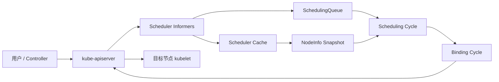

生产上通常运行多个 kube-scheduler 副本并开启 leader election，但同一时刻只有 leader 执行默认调度。这种高可用解决的是进程故障接管，不等于多个副本并行提高调度吞吐。

### 1.4 原生能力的三个层次

讨论“原生调度器能否承载 AI”时，需要分开三个层次：

| 层次 | v1.36.3 原生能力 | 成熟度 |
|------|-----------------|--------|
| 单 Pod 放置 | Scheduling Framework、亲和性、污点、拓扑分布、优先级、卷、DRA | 主体稳定 |
| 多 Pod 工作负载放置 | Workload/PodGroup、Gang、TAS、workload-aware preemption | v1.35/v1.36 Alpha，默认关闭 |
| 租户队列与应用编排 | 团队配额借用、公平排队、多集群准入、推理组件图和启动顺序 | 不是 kube-scheduler 的完整职责 |

因此，“原生完全没有 Gang”在 v1.36 已不准确；但“原生 Alpha Gang 已可无条件替代成熟批调度器”同样不准确。

---

## 第二章：从 Pod 到 Node 的完整数据流

### 2.1 Pod 如何进入调度队列

kube-scheduler 通过 informer 观察 Pod、Node、PersistentVolume、PVC、StorageClass、ResourceClaim 等对象。未指定 `.spec.nodeName` 且 `.spec.schedulerName` 匹配某个 profile 的 Pod，才是该 scheduler 的候选对象。

调度队列不是单一 FIFO：

| 逻辑区域 | 含义 |
|----------|------|
| activeQ | 可以立即尝试调度，按 `queueSort` 插件排序 |
| backoffQ | 最近失败，需要等待退避时间后重试 |
| unschedulablePods | 已确认当前条件下不可调度，等待相关集群事件或超时刷新 |
| gated | 被 `PreEnqueue` 或 `schedulingGates` 阻止，尚未真正进入调度尝试 |

默认 `PrioritySort` 先比较 Pod Priority，再结合进入队列时间保持顺序。高优先级只影响先尝试谁，并不自动保证它一定能放置；资源、亲和性、卷和设备约束仍必须满足。

### 2.2 SchedulingGates 避免无效重试

Pod Scheduling Readiness 在 v1.30 已稳定。控制器可以在 Pod 创建时写入 `.spec.schedulingGates`，等外部条件准备好后删除 gate。带 gate 的 Pod 不进入正常调度循环，可避免自动扩容、配额准入或应用编排尚未完成时反复产生 `FailedScheduling`。

```yaml
apiVersion: v1
kind: Pod
metadata:
  name: gated-worker
spec:
  schedulingGates:
  - name: platform.example.com/quota-ready
  containers:
  - name: worker
    image: registry.k8s.io/pause:3.10
```

gate 只能在 Pod 创建时添加，后续只能删除，不能再新增。这使其适合作为准入层到节点调度层的单向交接信号。

### 2.3 Cache、Snapshot 与 API 状态的关系

调度热路径不会为每个候选节点同步查询 API Server。informer 把对象送入本地 cache，调度周期从 cache 创建一致的 `NodeInfo` snapshot，再对 snapshot 运行插件。

这带来两个重要语义：

- 调度依据是最终一致的本地视图，不是对 API Server 的强一致事务查询。
- Filter 看到的“可用资源”主要是 Node allocatable 减去已绑定和已 assumed Pod 的 requests，不是瞬时 CPU/GPU 利用率。

如果要按实时负载调度，需要自定义插件或 Koordinator 一类额外系统提供指标与资源治理；仅观察 requests 无法识别一个 request 很大但实际空闲的 Pod。

### 2.4 调度算法的主路径

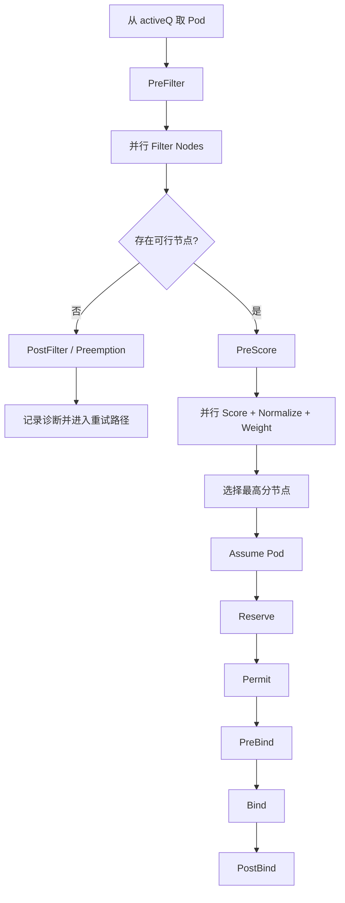

Filter 得到 feasible nodes；Score 插件通常把每个节点归一到框架分数区间，再乘插件权重求和。若多个节点最终总分相同，scheduler 从最高分候选中选择一个，而不应依赖固定的节点字典序。

### 2.5 Assume 为什么重要

选定节点后，scheduler 先在本地 cache 中把 Pod 标记为 assumed，并写入目标 `nodeName`，然后异步执行 binding cycle。这样下一个调度周期会把该 Pod 的资源算作已占用，不必等待 API Server 完成 Bind。

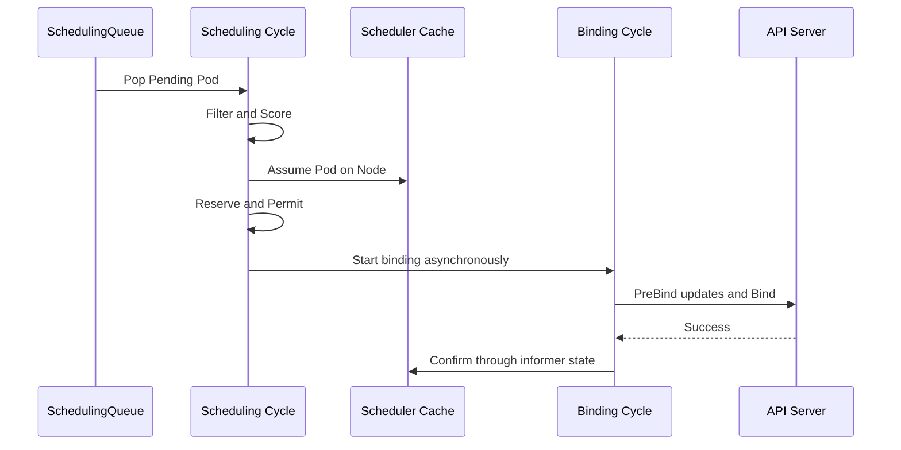

普通 Pod 的 scheduling cycle 串行执行，以便每次决策都能看到前一个 assumed Pod；binding cycle 可以并发。如果 Reserve、Permit、PreBind 或 Bind 失败，框架按逆序调用 `Unreserve`，并从 cache 中 Forget assumed Pod，释放乐观占用。

### 2.6 失败重试与 QueueingHint

调度失败会记录是哪些插件判定 Unschedulable。插件可以注册与自己相关的集群事件和 QueueingHint，例如 Node label 改变、Pod 删除、PVC 完成绑定。事件到来时，仅把可能因此变得可调度的 Pod 移回 activeQ/backoffQ，减少全队列无差别重试。

诊断时要区分：

- `Unschedulable`：当前集群条件不满足，是正常调度结果。
- `UnschedulableAndUnresolvable`：抢占等动作也不能解决，例如必须的 node label 根本不存在。
- `Error`：插件、API 调用或内部处理失败，需要排查控制面。
- `Wait`：Permit/PreBind 等扩展点有意等待外部批准，不等同于失败。

---

## 第三章：Scheduling Framework

### 3.1 两个周期与扩展点

Scheduling Framework 把调度拆为插件扩展点。v1.36.3 的主要扩展点如下：

| 扩展点 | 所在阶段 | 作用 | 失败后的关键行为 |
|--------|----------|------|------------------|
| `preEnqueue` | 入队前 | 决定 Pod 是否可进入 activeQ | 留在 gated/unschedulable 路径 |
| `queueSort` | 队列 | 定义 Pending Pod 顺序 | 一个 scheduler 只能有一套兼容排序 |
| `preFilter` | 调度周期 | 预计算状态或提前拒绝 Pod | 不再遍历节点 |
| `filter` | 调度周期 | 判断单个 Node 是否可行 | 汇总失败插件与原因 |
| `postFilter` | 无可行节点后 | 尝试抢占或其他补救 | 成功时重新进入后续调度 |
| `preScore` | 评分前 | 为评分预计算共享状态 | 中止本次尝试 |
| `score` | 调度周期 | 为 feasible Node 打分并归一化 | 中止本次尝试 |
| `reserve` | 调度周期末 | 为选定节点预留外部/内部状态 | 失败或后续失败调用 `Unreserve` |
| `permit` | 两周期之间 | 批准、拒绝或等待绑定 | Reject 时 Unreserve；Wait 后异步批准 |
| `preBind` | 绑定周期 | 绑定前准备资源或写 API | 失败时 Unreserve/Forget |
| `bind` | 绑定周期 | 执行 Pod 到 Node 的绑定 | 首个成功处理的 Bind 插件终止链路 |
| `postBind` | 绑定后 | 通知、指标等收尾 | 不改变已完成绑定 |
| `placementGenerate` | PodGroup Alpha 路径 | 为一组 Pod 生成候选节点集合 | 依赖工作负载级 feature gate |
| `placementScore` | PodGroup Alpha 路径 | 对候选 placement 整体打分 | 依赖工作负载级 feature gate |

`multiPoint` 不是运行时阶段，而是配置字段：一个插件若实现多个扩展点，可以一次启用到全部适用位置。具体扩展点的显式配置优先级更高，可覆盖 MultiPoint 展开结果。

### 3.2 v1.36.3 默认插件

默认 profile 通过 MultiPoint 加载以下核心插件。权重是 v1.36.3 源码默认值，不应直接套用到其他版本：

| 插件 | 主要职责 | Score 权重或特殊说明 |
|------|----------|----------------------|
| `SchedulingGates` | 阻止未就绪 Pod 入队 | 不评分 |
| `PrioritySort` | 按优先级和时间排序 | `queueSort` |
| `NodeUnschedulable` | 排除不可调度节点 | 不评分 |
| `NodeName` | 检查显式 `.spec.nodeName` | 不评分 |
| `TaintToleration` | 检查 taint/toleration 并偏好更少软 taint | 3 |
| `NodeAffinity` | nodeSelector、required/preferred node affinity | 2 |
| `NodePorts` | 检查 hostPort 冲突 | 不评分 |
| `NodeResourcesFit` | 资源可容纳性与资源评分 | 1 |
| `VolumeRestrictions` | 卷提供方限制 | 不评分 |
| `NodeVolumeLimits` | CSI 可挂载卷数量限制 | 不评分 |
| `VolumeBinding` | 延迟绑定、容量和拓扑协同 | 特定 feature 下参与评分 |
| `VolumeZone` | 卷 zone 约束 | 不评分 |
| `PodTopologySpread` | 拓扑分布约束 | 2 |
| `InterPodAffinity` | Pod 亲和与反亲和 | 2 |
| `DefaultPreemption` | 无可行节点时执行默认抢占 | `postFilter` |
| `NodeResourcesBalancedAllocation` | 偏好 CPU/内存占用比例更均衡 | 1 |
| `ImageLocality` | 偏好已有镜像的节点 | 1 |
| `DefaultBinder` | 调用默认 Bind | 至少需要一个 Bind 插件 |

DRA 稳定且默认开启时，`DynamicResources` 插件会进入默认集合；它在 PostFilter 中位于 `DefaultPreemption` 之前，优先尝试释放空闲 ResourceClaim，而不是先驱逐正在工作的 Pod。

Gang、TAS 插件只有相应 Alpha feature gate 开启后才加入：`GangScheduling`、`TopologyPlacement` 和 `PodGroupPodsCount` 不属于默认生产路径。

### 3.3 Framework Status 与短路

插件链不是“所有插件总会执行”：

- Filter 插件一旦确定节点不可行，可短路该节点的后续 Filter。
- PostFilter 按配置顺序尝试补救；某插件把 Pod 变回可调度后，后续插件不再执行。
- Bind 插件返回 Skip 时继续找下一个；某插件完成绑定后终止 Bind 链。
- Reserve 的 `Unreserve` 以与 Reserve 相反的顺序执行，插件必须把它设计成幂等操作。
- Permit 的 Wait 允许外部 controller 在超时前批准或拒绝 Pod，是实现 coscheduling 的传统扩展点之一，但等待一批已 assumed Pod 会占用 scheduler cache 中的资源。

### 3.4 扩展 kube-scheduler 的四条路径

| 方式 | 特征 | 适用场景 | 风险 |
|------|------|----------|------|
| 配置内置插件 | 不编译代码，调整权重和参数 | 资源装箱、亲和性、拓扑等常规策略 | 改错默认插件可能使 Pod 永久 Pending |
| 编译 out-of-tree Framework 插件 | 与 scheduler 进程内运行 | 低延迟、需要 Reserve/Permit/Bind 的深度扩展 | 必须跟随 Kubernetes/Framework API 版本构建和升级 |
| Scheduler Extender | HTTP 调用外部 Filter/Prioritize/Bind | 兼容旧集成、厂商设备方案 | 网络延迟、有限接口、状态一致性与故障处理更复杂 |
| 独立 scheduler | 自有 Deployment 和 `schedulerName` | 完整不同的批调度或设备调度模型 | HA、缓存、RBAC、升级和对象所有权都需独立治理 |

多个 scheduler 可以共存，但每个 Pod 只能由 `.spec.schedulerName` 选中一个最终调度器。多个 webhook、extender 或 binder 同时声称拥有具体 GPU 分配，很容易产生重复分配或 annotation 冲突。

---

## 第四章：配置、Profile 与策略

### 4.1 KubeSchedulerConfiguration v1

调度器配置使用稳定的 `kubescheduler.config.k8s.io/v1`。旧 `v1beta3` 已在 Kubernetes v1.29 移除，不能因为旧博客仍有示例就继续使用。

下面的配置展示两个 profile，并调整默认资源评分。它是说明结构的最小示例，生产中还需合并发行版提供的认证、leader election 和 kubeconfig 设置：

```yaml
apiVersion: kubescheduler.config.k8s.io/v1
kind: KubeSchedulerConfiguration
leaderElection:
  leaderElect: true
clientConnection:
  kubeconfig: /etc/kubernetes/scheduler.conf
percentageOfNodesToScore: 50
profiles:
- schedulerName: default-scheduler
- schedulerName: ai-binpack-scheduler
  plugins:
    score:
      enabled:
      - name: NodeResourcesFit
        weight: 5
  pluginConfig:
  - name: NodeResourcesFit
    args:
      scoringStrategy:
        type: MostAllocated
        resources:
        - name: cpu
          weight: 1
        - name: memory
          weight: 1
        - name: nvidia.com/gpu
          weight: 4
```

使用第二个 profile 的 Pod：

```yaml
apiVersion: v1
kind: Pod
metadata:
  name: gpu-worker
spec:
  schedulerName: ai-binpack-scheduler
  containers:
  - name: worker
    image: registry.k8s.io/pause:3.10
    resources:
      limits:
        nvidia.com/gpu: 1
```

### 4.2 多 Profile 的真实边界

一个 kube-scheduler 进程可以运行多个 profile，每个 profile 有唯一 `schedulerName` 和插件配置。但它们共享同一个 pending queue，因此所有 profile 必须使用相同的 `queueSort` 插件和参数。

这意味着 profile 适合表达“同一调度引擎中的几套放置策略”，不适合表达彼此完全独立的租户队列和公平算法。若需要分片、独立故障域或不同全局队列，通常要评估独立 scheduler 或 Kueue/KAI/Volcano 等系统。

### 4.3 修改默认插件的安全规则

配置可用 `disabled: [{name: "*"}]` 清空某扩展点，也能重新启用插件改变顺序或权重。生产操作要遵守：

1. 至少保留一个可处理请求的 Bind 插件，否则 Pod 无法完成绑定。
2. 禁用 Filter 插件不会移除对应 API 约束的风险；它可能让 Pod 被放到运行时无法工作的节点。
3. Score 权重只改变可行节点之间的偏好，不能让 Filter 已拒绝的节点复活。
4. `MostAllocated` 是装箱策略，不代表节点实际利用率高；它依据 requests 计算。
5. 修改插件集合后用真实 Pod 约束回放，不只验证配置文件能启动。

### 4.4 `schedulerName` 与绕过调度器

- 未设置 `.spec.schedulerName` 时，API Server 默认写入 `default-scheduler`。
- 设置不存在的 scheduler 名称时，Pod 会长期 Pending，且不会被默认 scheduler 接管。
- 直接设置 `.spec.nodeName` 会绕过正常 scheduler 选点；NodeName 绑定还可能绕过部分调度约束，应只用于非常受控的系统场景。
- `nodeSelector`、node affinity 和 taint toleration 是约束 scheduler 的方式，不等同于直接指定 nodeName。

---

## 第五章：资源、亲和性、拓扑与卷

### 5.1 scheduler 计算的是 requests

对普通 app container，scheduler 以有效 requests 做容量判断；若只设置 limit，准入/defaulting 可能使 request 等于 limit，具体取决于资源和集群策略。Pod 的调度资源还要考虑：

- app containers 的 requests 总和。
- init containers 的有效峰值，而不是简单把全部 init request 相加。
- Pod overhead，例如 RuntimeClass 对 sandbox 的额外开销。
- 已绑定和已 assumed Pod 的 requests。
- DRA 设备分配对节点可用性的约束。

`kubectl top` 显示的是运行时使用量，不能直接解释 `Insufficient cpu`。排查时应对比 Node allocatable、Pod requests 和 scheduler cache 观察到的对象。

### 5.2 Node 选择约束

| API | 语义 | 强制程度 |
|-----|------|----------|
| `nodeSelector` | 所有 label 键值都必须匹配 | required |
| `requiredDuringSchedulingIgnoredDuringExecution` | 布尔组合的 node affinity | required |
| `preferredDuringSchedulingIgnoredDuringExecution` | 匹配项增加 Score | preferred |
| `nodeName` | 直接指定 kubelet 节点 | 绕过常规选点 |

`IgnoredDuringExecution` 表示节点 label 后续变化时，已经运行的 Pod 通常不会因此自动驱逐。若安全隔离依赖 label，必须同时治理谁能修改节点标签，并使用受 NodeRestriction 保护的 label 前缀。

### 5.3 Taint 与 Toleration

Taint 是节点排斥，toleration 只是允许 Pod 不被对应 taint 拒绝，并不保证 Pod 会选择该节点：

| effect | 调度/运行语义 |
|--------|---------------|
| `NoSchedule` | 新 Pod 若不容忍则不能调度到节点 |
| `PreferNoSchedule` | 软约束，评分时尽量避开 |
| `NoExecute` | 不仅阻止新 Pod，还可驱逐不容忍的已有 Pod |

GPU 节点常用 taint 防止普通 Pod 占用昂贵节点，再配合 node affinity 或 ResourceFlavor 选择节点类别。只有 toleration 而没有正向选择条件时，Pod 仍可能落到普通节点。

### 5.4 Pod 亲和与反亲和

InterPodAffinity 根据已有 Pod label 和 topologyKey 约束共置或分散。它表达力强，但需要扫描匹配 Pod 和拓扑域，大规模集群中比简单 node affinity 更昂贵。

AI 场景应谨慎区分：

- “worker 与 driver 在同一 zone”可以使用 Pod affinity。
- “8 个 worker 必须同时启动”是 Gang，不是 affinity。
- “8 个 GPU 位于同一 NVLink fabric”需要设备/拓扑模型，普通 node label 不一定足够。
- “副本跨 zone 均匀分布”更适合 topology spread constraints。

### 5.5 Pod Topology Spread

Topology spread 以 label selector、`topologyKey`、`maxSkew` 和 `whenUnsatisfiable` 控制分布：

- `DoNotSchedule` 是硬约束，可能让 Pod Pending。
- `ScheduleAnyway` 是软偏好，通过 Score 改善分布。
- 多条 constraint 是合取关系，必须同时满足。
- 缺失 topology label 的节点可能被排除或形成意外域，节点标签治理是前提。

它解决的是同类 Pod 在拓扑域间的偏斜，不等于对一个多 Pod workload 做原子选址。v1.36 Alpha TAS 的 placement 是另一个层级。

### 5.6 卷与节点选择是联合问题

`VolumeBinding` 协调 Pod 节点选择与 PVC/PV 拓扑。StorageClass 使用 `WaitForFirstConsumer` 时，卷绑定或动态供给推迟到 scheduler 已评估 Pod 的 node affinity、资源与 zone 之后，避免先把卷固定在不可用 zone。

调度失败可能来自：

- PVC 未绑定或 StorageClass 不匹配。
- PV node affinity 与 Pod 可行节点没有交集。
- CSI node volume limit 已满。
- 所在 zone 没有可供给容量。

因此看到 `FailedScheduling` 时不能只查 CPU/GPU；卷插件的失败原因同样属于调度诊断。

---

## 第六章：评分、装箱与性能

### 6.1 Score 不是单一算法

每个 Score 插件独立评价 feasible nodes，框架归一化后乘权重求和。默认结果同时包含资源空闲、CPU/内存平衡、软 taint、node affinity、Pod affinity、拓扑分布和镜像本地性等信号。

一个节点“GPU 最合适”仍可能因 topology spread、taint 或 affinity 总分落后。生产调优应该查看具体插件分数或用 scheduler simulator 重放，而不是只观察最终节点猜测算法。

### 6.2 NodeResourcesFit 三种策略

| 策略 | 倾向 | 典型目标 | 主要风险 |
|------|------|----------|----------|
| `LeastAllocated` | 选择 request 占用较低的节点 | 分散负载、保留余量 | 容易扩大活跃节点数量 |
| `MostAllocated` | 选择 request 占用较高但仍可容纳的节点 | 装箱、给 autoscaler 留出整节点 | 可能形成热点，仍需运行时隔离与监控 |
| `RequestedToCapacityRatio` | 自定义利用率到分数的曲线 | 针对不同资源设计非线性偏好 | 配置和验证复杂 |

扩展资源可以参与评分。例如给 `nvidia.com/gpu` 更高权重可增强 GPU 装箱，但标准扩展资源通常只表示整数数量，不能自动理解 GPU 型号、显存、NVLink 路径或 MIG 实例之间的关系。

### 6.3 `percentageOfNodesToScore`

大集群不必为每个 Pod 给所有节点评分。scheduler 找到足够多 feasible nodes 后可以停止 Filter：

- 未显式配置时，自动公式在 100 节点约为 50%，5000 节点约为 10%，自动值下限 5%。
- 少于 100 个 feasible nodes 时仍会检查全部节点。
- 设置 100 表示对全部节点评分。
- 设得过低可提高吞吐，但最佳节点可能根本未进入 Score，放置质量会下降。

节点遍历使用轮转起点，并在多 zone 间交错，避免每次只让列表前部节点获得候选机会。调优应同时观察调度 p99、吞吐、碎片率和业务 SLO，不能只追求单次延迟。

### 6.4 Opportunistic Batching

v1.36.3 中 `OpportunisticBatching` 为 Beta 且默认开启。对连续到达、调度约束等价的 Pod，scheduler 可以短时复用 Filter/Score 结果，减少重复计算。

当前能力有明确限制：带 inter-Pod affinity、topology spread、DRA claim、DRA backing extended resource 等 Pod 不适用；自定义插件还需要正确实现签名相关接口。它是吞吐优化，不改变 Gang 的原子语义。

---

## 第七章：优先级、抢占与中断

### 7.1 PriorityClass 的两个作用

Pod Priority 同时影响：

1. `PrioritySort` 的队列顺序，高优先级 Pod 更早尝试。
2. 无可行节点时的 preemption，高优先级 Pod 可能驱逐较低优先级 Pod。

`preemptionPolicy: Never` 可以让高优先级 Pod 排在队列前面，但禁止它通过抢占获得资源。它仍会遵守调度 backoff，不会无限紧循环。

### 7.2 默认抢占流程

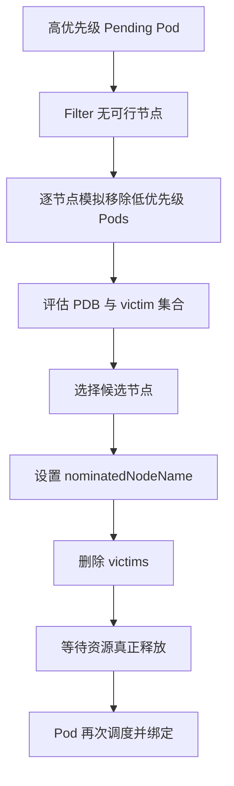

抢占不是同步搬迁事务。`nominatedNodeName` 是提示而非资源锁；victim 终止期间集群仍会变化，提名 Pod 可能再次失败或改选节点。

### 7.3 PDB 不是绝对保护

默认抢占会尽量选择不违反 PodDisruptionBudget 的 victim 组合，但在没有其他可行办法时，抢占仍可能违反 PDB。PDB 也不约束节点故障、kubelet node-pressure eviction 等所有非自愿中断。

AI 平台不应把 PDB 当作训练 checkpoint 或推理副本保护的唯一机制。需要结合 controller 重建、checkpoint、优雅终止、优先级分层和队列策略。

### 7.4 为什么 Pod 级抢占不等于 Job 级公平

默认抢占一次主要为一个 Pod 找空间。它不了解团队累计用量、Job 是否只差最后一个 worker、租户是否长期超额，也没有 DRF/Cohort/层次队列语义。

对分布式训练，逐 Pod 抢占可能让低优先级 Job 只丢部分成员，既无法继续工作又残留资源。v1.36 的 workload-aware preemption 开始补足 PodGroup 语义，但仍是默认关闭的 Alpha 能力。

---

## 第八章：GPU 与 Dynamic Resource Allocation

### 8.1 Device Plugin 扩展资源路径

传统 Device Plugin 把设备数量作为 Node allocatable 扩展资源，例如 `nvidia.com/gpu`。Pod 通常在 limits 中请求整数设备，scheduler 用 `NodeResourcesFit` 判断数量是否足够，kubelet 再让 device plugin 选择并注入具体设备。

这条路径简单成熟，但调度器看到的信息有限：

- 通常只看到资源名和整数容量。
- 具体 device ID 多在 kubelet Allocate 阶段决定。
- 设备属性、共享容量、跨设备约束和网络拓扑难以统一表达。
- 调度记账不自动提供容器内显存或算力硬隔离。

MIG、MPS、HAMi 或厂商 device plugin/runtime 仍可能是必要组成部分。DRA 不是 Device Plugin 的简单改名：它把“选哪台节点”和“选哪些具体设备”放进同一个 scheduler 决策，但不替代设备驱动与运行时隔离。

### 8.2 DRA 对象模型与 source of truth

Dynamic Resource Allocation 的核心 API 在 v1.34 GA，`DynamicResourceAllocation` 从 v1.35 起锁定为开启。v1.36.3 的稳定 API 是 `resource.k8s.io/v1`，五类对象共同构成声明、库存、分配和消费链路：

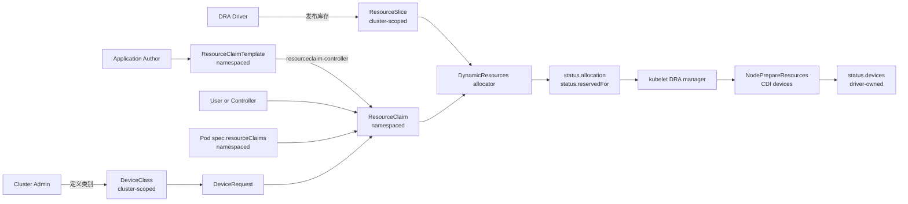

| 对象或字段 | Scope | 主要写入者 | source of truth 与关键约束 |
|------|-------|------------|-----------------------------|
| `ResourceSlice` | Cluster | DRA driver/controller | 设备库存、属性、容量、pool generation 和节点可访问范围；不是用户请求 |
| `DeviceClass` | Cluster | 管理员或受信任的 driver controller | 稳定类别名、CEL selectors、driver config；spec 可变，但只影响后续分配 |
| `ResourceClaim` | Namespace | 用户、resourceclaim-controller、scheduler、driver | 不可变 spec 是请求真相；scheduler 写 allocation/reservation，driver 写各自的 device status |
| `ResourceClaimTemplate` | Namespace | 应用作者/controller | 不可变模板；控制面复制其 spec 创建 claim，之后不持续同步模板变更 |
| Pod `spec.resourceClaims` | Namespace | 用户/controller | Pod 内逻辑名到同 namespace claim/template 的引用；字段不可变 |
| Pod `status.resourceClaimStatuses` | Namespace | resourceclaim-controller | template 实际生成的 claim 名；不能把模板名当成最终 claim 名 |

`ResourceSlice` 和 `DeviceClass` 是 cluster-scoped；`ResourceClaim`、`ResourceClaimTemplate`、Pod 与后文的 Workload/PodGroup 都是 namespaced，而且 claim 引用不能跨 namespace。对象的“所有者”也不能混写：driver 拥有库存事实，管理员拥有类别策略，应用/controller 拥有请求，scheduler 拥有分配与 reservation 决策，节点 driver 只拥有 `status.devices` 中属于自己的条目。

### 8.3 从 ResourceSlice 到 Pod 的完整 API 链

下面使用通用 accelerator 演示真实字段。driver 先发布两个 node-local 设备；`pool.generation` 与 `resourceSliceCount` 描述同一代 pool 的完整性：

```yaml
apiVersion: resource.k8s.io/v1
kind: ResourceSlice
metadata:
  name: node-a-accelerators-07
spec:
  driver: accelerator.example.com
  pool:
    name: node-a
    generation: 7
    resourceSliceCount: 1
  nodeName: node-a
  devices:
  - name: accel-0
    attributes:
      model:
        string: x200
      fabric:
        string: fabric-a
      numa:
        int: 0
    capacity:
      memory:
        value: 80Gi
  - name: accel-1
    attributes:
      model:
        string: x200
      fabric:
        string: fabric-a
      numa:
        int: 1
    capacity:
      memory:
        value: 80Gi
```

管理员再用 `DeviceClass` 把 vendor-specific 属性封装成稳定类别。CEL 中不应直接读取一个可能不存在的属性；生产表达式应先检查字段是否存在：

```yaml
apiVersion: resource.k8s.io/v1
kind: DeviceClass
metadata:
  name: high-memory-accelerator
spec:
  selectors:
  - cel:
      expression: >-
        device.driver == "accelerator.example.com" &&
        has(device.capacity["accelerator.example.com"].memory) &&
        device.capacity["accelerator.example.com"].memory.compareTo(quantity("64Gi")) >= 0
  config:
  - opaque:
      driver: accelerator.example.com
      parameters:
        runtimeProfile: compute
```

用户可以直接创建 `ResourceClaim`，也可以通过 template 为每个 Pod 或 PodGroup 生成 claim。下面的 template 同时展示 `exactly`、`count`、claim-level constraint、driver config 和 prioritized subrequests。API 中没有名为 `Exact` 的字段：字段叫 `exactly`，计数模式叫 `ExactCount`；文中“Exact 请求”只是机制简称。

```yaml
apiVersion: resource.k8s.io/v1
kind: ResourceClaimTemplate
metadata:
  name: training-accelerators
spec:
  spec:
    devices:
      requests:
      - name: workers
        exactly:
          deviceClassName: high-memory-accelerator
          allocationMode: ExactCount
          count: 2
          selectors:
          - cel:
              expression: device.attributes["accelerator.example.com"].model == "x200"
      - name: coordinator
        firstAvailable:
        - name: high-memory
          deviceClassName: high-memory-accelerator
          count: 1
        - name: compatible
          deviceClassName: compatible-accelerator
          count: 1
      constraints:
      - requests:
        - workers
        matchAttribute: accelerator.example.com/fabric
      config:
      - requests:
        - workers
        opaque:
          driver: accelerator.example.com
          parameters:
            mode: exclusive
```

Pod 引用 template 后，resourceclaim-controller 创建一个由该 Pod 拥有的 `ResourceClaim`，并把实际名字写入 Pod status。容器必须再通过 `resources.claims` 指明需要访问 claim 中的哪些 request；仅在 Pod 顶层引用 claim 不代表所有容器自动获得设备：

```yaml
apiVersion: v1
kind: Pod
metadata:
  name: trainer-0
spec:
  resourceClaims:
  - name: accelerators
    resourceClaimTemplateName: training-accelerators
  containers:
  - name: trainer
    image: registry.k8s.io/pause:3.10
    resources:
      claims:
      - name: accelerators
        request: workers
      - name: accelerators
        request: coordinator
```

这些字段的语义边界如下：

| 字段 | 调度语义 | 容易误解之处 |
|------|----------|--------------|
| `exactly` + `ExactCount` | 从指定 class 选精确 `count` 个满足全部 selectors 的设备；默认 count 为 1 | `exactly` 不是按设备 ID 精确点名 |
| `allocationMode: All` | 选择某个 pool 内所有匹配设备，至少要有一个，普通请求遇到已占设备会失败 | 不是“跨集群所有设备”；完整 pool 视图是必要条件 |
| `selectors` | DeviceClass selectors 与 request selectors 全部为 AND，逐设备执行 CEL | CEL 错误会中止本次分配，不只是把该设备判为不匹配 |
| `constraints.matchAttribute` | 多个 request 分配出的设备必须共享某属性，例如 fabric/NUMA | 它不验证真实链路性能，只比较 driver 发布的属性 |
| `constraints.distinctAttribute` | 要求设备属性两两不同 | 受 `DRAConsumableCapacity` 控制，不能当作所有版本的核心字段 |
| `config` | 分配时不参与筛选；分配后把 class/claim config 交给相应 driver | opaque 参数 schema 由 driver 定义，API Server 不理解其业务含义 |
| `firstAvailable` | 按声明顺序尝试 subrequest；allocation result 用 `request/subrequest` 记录选择 | 这是优先列表，不是全局最优搜索；`Score` 只偏好更靠前的可行项 |

`All` 与 AdminAccess 的典型管理请求应隔离到专用 namespace，而不是混入普通 workload template：

```yaml
apiVersion: resource.k8s.io/v1
kind: ResourceClaim
metadata:
  name: accelerator-diagnostics
  namespace: device-admin
spec:
  devices:
    requests:
    - name: inspect
      exactly:
        deviceClassName: high-memory-accelerator
        allocationMode: All
        adminAccess: true
```

### 8.4 ResourceClaim 生命周期与状态机

一个 template claim 从创建到回收跨越 controller、scheduler、kubelet 和 driver，不能只用“Pending/Bound”两个词概括：

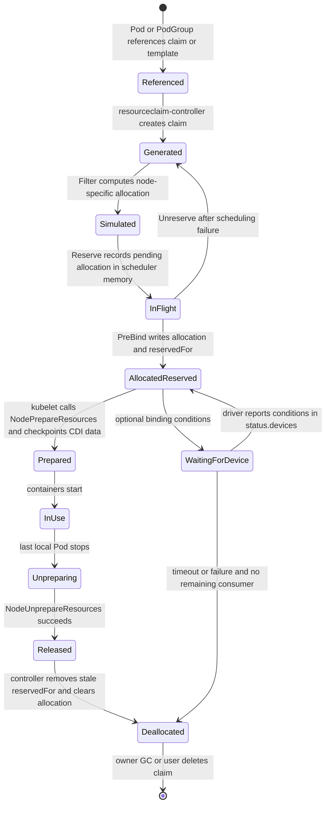

状态写入时机必须区分：

1. **生成 claim。** 对 `resourceClaimTemplateName`，kube-controller-manager 的 resourceclaim-controller 创建 claim、设置 Pod 或 PodGroup ownerReference，并把生成名写入 `pod.status.resourceClaimStatuses` 或 `podgroup.status.resourceClaimStatuses`。直接引用 `resourceClaimName` 时，claim 必须由用户/controller 预先创建。
2. **模拟分配。** `Filter` 对每个候选节点调用 structured allocator，结果只保存在该 scheduling cycle 的内存中；此时 API 上的 `status.allocation` 仍为空。
3. **内存预留。** `Reserve` 把选定结果登记为 in-flight allocation，防止并发调度周期重复使用设备；它仍不承诺 API 更新已经成功。
4. **持久化分配和消费者。** `PreBind` 先添加 Kubernetes delete-protection finalizer，再以 status update 写入 `status.allocation` 与 `status.reservedFor`。并发 scheduler 更新同一 claim 时只有满足 API resourceVersion/validation 的写入成功，失败一方回到 backoff。
5. **driver 状态。** `status.devices` 由对应 driver 写入，可包含 driver-specific data、network data 或 binding conditions。scheduler 不能把自己的 allocation 决策伪装成 driver 健康状态。
6. **节点准备。** kubelet 先验证 claim 已分配且为 Pod/PodGroup reserved，然后按 driver 批量调用 `NodePrepareResources`，保存返回的 CDI device 信息和 checkpoint，再把设备注入容器。
7. **终止与回收。** Pod 停止后 kubelet 对最后一个本地引用调用幂等的 `NodeUnprepareResources`。resourceclaim-controller 移除已终止/已删除 consumer；最后一个 reservation 消失后清空 scheduler allocation、移除 finalizer。template claim 最终随 Pod/PodGroup owner 被 GC，手工 claim 则继续存在，直到用户删除。

节点重启不会把准备状态完全交给内存猜测：kubelet DRA manager 维护 checkpoint，并周期性把不再属于 active Pod 的残留 claim 送入 Unprepare。反过来，driver 长期不可用会让 Prepare/Unprepare 重试，删除 Pod 并不保证物理设备在同一瞬间已经清理完毕。

### 8.5 DynamicResources 插件调用链

v1.36.3 的 `DynamicResources` 同时实现 `PreEnqueue`、`PreFilter`、`Filter`、`PostFilter`、`Score`、`Reserve`、`Unreserve` 和 `PreBind`。默认插件列表把它放在 `DefaultPreemption` 之前，因此无可行节点时会先尝试释放无消费者的失效 allocation，再考虑抢占普通 Pod。

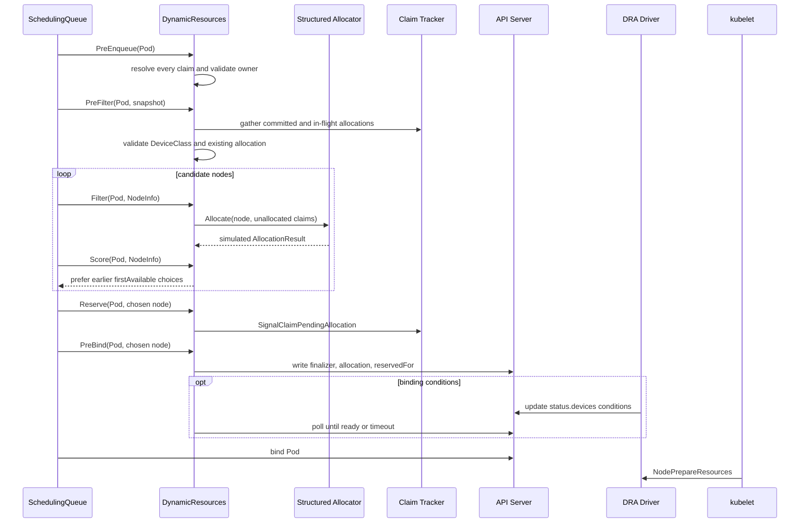

| 扩展点 | v1.36.3 行为 | 失败与恢复 |
|--------|---------------|------------|
| `PreEnqueue` | 解析 Pod 中所有 claim，验证生成 claim 的 owner、删除状态和存在性 | claim/template 尚未生成时留在 gated/unschedulable 路径，相关 claim 或 Pod status 事件重新激活 |
| `PreFilter` | 读取 claims、已有 allocation、reservation、DeviceClass、PodGroup binding；汇总 committed 与 in-flight 设备，构造 allocator | claim 已被不兼容消费者占用、class 不存在、CEL/状态非法时短路 |
| `Filter` | 对已分配 claim 检查 allocation node selector；对未分配 claim 按候选节点模拟结构化分配 | 只缓存 node-specific result，不写 API；incomplete pool 或设备不足使该节点不可行 |
| `Score` | 仅在 `DRAPrioritizedList` 启用时，根据选中的 subrequest 顺序加分并 normalize | 不替代普通 Node score，也不对任意设备组合做全局最优搜索 |
| `Reserve` | 把选定 allocation 放入 claim tracker 的 in-flight map；PodGroup 内可共享 pending allocation | 后续阶段失败时 `Unreserve` 减少 sharer、恢复 assume cache；最后一个 sharer 才真正释放 |
| `PreBind` | 以冲突重试持久化 `status.allocation` 和 consumer 到 `status.reservedFor`；可等待 binding conditions | API conflict、driver failure condition 或 timeout 返回 Error，binding cycle 调用 `Unreserve`，Pod 进入 backoff |
| `PostFilter` | 无节点可行时随机选一个无其他消费者的 unavailable claim，清空 allocation/reservation/device status；也可释放尚未被组内成员使用的 PodGroup reservation | 让下次尝试重新选设备；不会清理仍有真实 consumer 的 claim |

一个关键一致性点是：`Reserve` 的“预留”是 scheduler 本地并发保护，`PreBind` 的 status update 才是集群可见承诺。若把两者视为同一时刻，就无法解释 scheduler 崩溃、API conflict 或 Gang 统一回滚时为何没有泄漏一份已持久化 allocation。

v1.36.3 修复了结构化 allocator 在 `allocateDevice` 候选搜索中的 reserved-state 回滚：候选被拒绝或回溯时，共享 counter 的临时 reservation 必须完整撤销；共享设备的 in-use marker 也不能提前丢失，否则后续 share 会把同一 counter 重复计费。v1.36.2 的错误可能把仍有容量的 counter set 判断为耗尽，使 Pod 在本可满足的节点上持续 Pending。该修复属于默认 DRA allocator 路径，不需要新 feature gate，但升级后应重放使用 `DRAConsumableCapacity`/`DRAPartitionableDevices` 的共享设备场景。

### 8.6 ResourceSlice pool 与一致性边界

设备唯一身份是 `(driver, pool, device)` 三元组，不是 `ResourceSlice.metadata.name`。driver 可以在 reconciliation 中把同一设备移到另一个 slice，但同一 pool 内 device name 必须唯一。

| 机制 | scheduler 解释 | driver 的责任 |
|------|----------------|---------------|
| `pool.generation` | 同一 pool 只消费观察到的最高 generation，旧 slice 静默忽略 | pool 任一设备事实变化时统一提升所有新 slice 的 generation |
| `resourceSliceCount` | 当前 generation 收到的 slice 数不足即标记 incomplete，不从该 pool 分配 | 先声明准确总数，再持续 reconcile 到全部 slice 可见 |
| 节点范围 | `nodeName`、`nodeSelector`、`allNodes`、`perDeviceNodeSelection` 四选一 | 准确表达设备在哪些节点可访问；标签陈旧会直接制造错误可行性 |
| 清单有效性 | 重复 device name 等问题使 pool invalid | 修正 slice；不能指望 scheduler 自动挑一个重复项 |
| 变更传播 | informer 更新 scheduler cache；下一 scheduling cycle 重新汇总 pool | driver 必须幂等发布并处理 API Server 暂时失败 |

v1.36 默认启用的 Beta DRA 能力会选择包含确定性排序的 allocator 路径：pool 按 driver/pool 名排序，pool 内 ResourceSlice 按名字排序，然后执行 first-fit 搜索。名称因此可能影响优先命中的 pool/slice，但这不是性能评分 API；driver 不应把脆弱的命名技巧当作拓扑或健康策略。设备在单个 slice 内仍按 driver 发布顺序参与搜索，也不能据此宣称“总会选设备名最小者”。

scheduler cache 不是独立真相。它把 informer 中已持久化 allocation 与 claim tracker 中尚未到达 informer 的 in-flight/assumed allocation 合并，避免同一设备被重复选中；若采集期间检测到并发 revision 变化，会短暂重试。driver 更新期间，`generation + resourceSliceCount` 只能让 scheduler 识别“不完整”，不能提供跨多个 API 对象的事务快照。生产 driver 必须持续 reconcile，scheduler 则宁可暂时判不可分配，也不应消费半套 inventory。

### 8.7 三种 claim 所有权与共享模型

| 模式 | claim owner | `status.reservedFor` | 生命周期与适用场景 |
|------|-------------|----------------------|--------------------|
| 手工共享 claim | 无自动 owner，通常由用户/controller 管理 | 每个 Pod 一项 | 名字预先已知，可跨多个 Pod 复用；最多 256 个 reservation，最后一个 Pod 结束后 claim 可重新分配但对象不会自动删除 |
| 每 Pod template claim | Pod | 每个 claim 通常只有该 Pod 一项 | resourceclaim-controller 为每 Pod 生成；Pod 结束后清理并由 owner GC，隔离清晰但对象数量较多 |
| 每 PodGroup template/shared claim | PodGroup | 整组仅一项 PodGroup reference | `DRAWorkloadResourceClaims` Alpha；组内所有匹配 Pod 共用 claim，Pod 数可超过 256，reservation 与 allocation 持续到 PodGroup 删除 |

PodGroup 共享不是仅仅“多个 Pod 写同一个 claim 名”。PodGroup `spec.resourceClaims` 和 Pod `spec.resourceClaims` 的 `name`、`resourceClaimName`/`resourceClaimTemplateName` 必须逐字段相同；匹配时 scheduler 把 consumer 绑定到 PodGroup UID，不匹配的 Pod claim 仍按普通 Pod reservation 处理。PodGroup 最多定义 4 个共享 claim。

`reservedFor` 的 256 项上限约束的是 consumer reference 条目，不是设备数。手工 claim 给 300 个 Pod 逐一 reservation 会撞上限制；同一 PodGroup 的 300 个 Pod 只占一个 reservation，但会把设备释放时机延长到 PodGroup 删除。平台 controller 因此必须可靠删除已经结束的 PodGroup，否则共享设备会被有意保留。

### 8.8 v1.36.3 feature maturity 矩阵

主分支文档会继续演进，下面只按 `v1.36.3` 的 `defaultVersionedKubernetesFeatureGates` 与依赖表判断。`默认开启` 不等于 GA，也不代表某个具体 driver 已支持该字段。

| Feature gate | v1.36.3 状态 | 默认 | 依赖 | 影响范围 |
|--------------|---------------|------|------|----------|
| `DynamicResourceAllocation` | GA，锁定 | 开 | 无 | `resource.k8s.io/v1` 核心、scheduler/kubelet DRA 路径 |
| `DRAAdminAccess` | GA，锁定 | 开 | `DynamicResourceAllocation` | `adminAccess` 与 admin namespace 校验 |
| `DRAPrioritizedList` | GA | 开 | `DynamicResourceAllocation` | `firstAvailable` subrequests 与 DRA Score |
| `DRAConsumableCapacity` | Beta | 开 | `DynamicResourceAllocation` | 多 allocation、capacity、share ID、`distinctAttribute` |
| `DRADeviceBindingConditions` | Beta | 开 | DRA + `DRAResourceClaimDeviceStatus` | `bindsToNode`、PreBind 等待与失败恢复 |
| `DRADeviceTaints` | Beta | 开 | `DynamicResourceAllocation` | device taints/tolerations 与 NoExecute 处理 |
| `DRADeviceTaintRules` | Beta | **关** | `DRADeviceTaints` | 独立 DeviceTaintRule API；因依赖默认关闭的 Beta API 而保持关闭 |
| `DRAExtendedResource` | Beta | 开 | `DynamicResourceAllocation` | DeviceClass 映射传统 extended resource 请求 |
| `DRAPartitionableDevices` | Beta | 开 | `DynamicResourceAllocation` | per-device node selection、shared counters、动态分区 |
| `DRAResourceClaimDeviceStatus` | Beta | 开 | 对 DRA 为软依赖 | driver 写 `status.devices`；binding conditions 的硬依赖之一 |
| `DRAResourceClaimGranularStatusAuthorization` | Beta | 开 | DRA + device status | allocation/reservation 与 driver device status 的细粒度授权 |
| `DRASchedulerFilterTimeout` | Beta | 开 | `DynamicResourceAllocation` | 限制每节点 DRA Filter 计算时间 |
| `DRANodeAllocatableResources` | Alpha | 关 | `DynamicResourceAllocation` | claim 消费 CPU、内存等 node allocatable 资源 |
| `DRAListTypeAttributes` | Alpha | 关 | `DynamicResourceAllocation` | list attributes 与集合式 match/distinct 语义 |
| `DRAResourcePoolStatus` | Alpha | 关 | `DynamicResourceAllocation` | 查询 pool 完整性/可用量的附加 API |
| `DRAWorkloadResourceClaims` | Alpha | 关 | DRA + `GenericWorkload` | PodGroup 级 claim 生成、reservation 与共享 |

启用依赖 gate 需要在实际消费该字段的组件上保持一致，通常至少涉及 kube-apiserver、kube-scheduler、kube-controller-manager 和 kubelet；只打开 API Server 可能让对象可创建，却让 scheduler 或 kubelet 按旧语义处理。Alpha gate 更应使用独立集群/profile 做版本锁定和回滚演练。

### 8.9 安全边界与绕过 scheduler 的 Pod

`adminAccess: true` 会忽略普通 claim 对设备的占用，并可能让 driver 暴露额外管理权限。v1.36.3 虽已 GA，也不意味着普通租户应该获得它。API Server 要求 ResourceClaim/Template 位于带有以下精确标签的 namespace，同时调用者仍必须通过 RBAC 的 create/update 授权：

```bash
kubectl label namespace device-admin resource.kubernetes.io/admin-access=true
```

推荐把 admin namespace、ServiceAccount、ResourceQuota/准入策略和可引用 DeviceClass 一起隔离。不要仅靠 DeviceClass 名称实现权限控制：能创建任意 ResourceClaim 的用户仍可能引用其他已存在的 class；需要 RBAC、admission policy 与 namespace 边界共同约束。

`DRAResourceClaimGranularStatusAuthorization` 把 status 写入按责任拆开：scheduler/controller 更新 allocation 和 reservation 需要 synthetic `resourceclaims/binding` 权限；driver 更新 `status.devices` 使用 `resourceclaims/driver` 以及 associated-node 或 arbitrary-node 动词前缀。不要给 node plugin 对所有 claim status 的通配写权限，否则一个受陷节点可能伪造其他 driver 或其他节点的设备状态。

当 Pod 直接设置 `.spec.nodeName` 时，kube-scheduler 完全被绕过，也就没有 `DynamicResources` 为其分配或 reservation。若 claim 不存在、未 allocation 或未 reserved，目标 kubelet 会拒绝启动并周期性重查；它不会替 scheduler 自动补齐状态。可信控制器若必须预选节点，应优先写 `nodeSelector`/required node affinity 后仍交给 scheduler，或自己完整实现 claim allocation、reservation 与冲突处理。

### 8.10 故障模式与恢复

| 症状 | 机制原因 | 恢复与检查重点 |
|------|----------|----------------|
| `ResourceClaim` 不存在或 template 尚未生成 | `PreEnqueue`/`PreFilter` 无法解析 claim，或 resourceclaim-controller 失败 | 查看 Pod `status.resourceClaimStatuses`、controller 事件与 template RBAC；claim/Pod status 更新会重新激活 Pod |
| pool 长期 incomplete | 最高 generation 的 slice 数少于 `resourceSliceCount`，driver rollout 中断 | 对比同一 driver/pool 的 generation/count；修复 driver reconciliation，不能手工混用两代 slice |
| DeviceClass 存在但一直无匹配设备 | CEL 读取错误属性、类型不一致、node scope 不匹配或库存陈旧 | 检查 CEL、ResourceSlice attributes/capacity 和目标节点 label；类变更只影响新 allocation |
| 两个 Pod 竞争同一共享 claim | 两个 scheduler 都在 Reserve 模拟成功，`PreBind` status update 只有一方满足 reservation 上限/冲突检查 | 失败方执行 `Unreserve` 并进入 backoff；核对 claim UID、resourceVersion 和 `reservedFor` |
| shared counter 看似耗尽但物理容量仍在 | v1.36.2 structured allocator 在候选拒绝/回溯时可能残留 counter reservation，或丢失 in-use marker 后重复扣费 | 升级到 v1.36.3；重建相同 ResourceSlice/Claim 组合并确认候选回滚后计数恢复 |
| binding condition 超时或失败 | allocation 已写入，但 driver 未及时在 `status.devices.conditions` 报 True，或报告 failure condition | PreBind 返回 Error；下一周期把无其他 consumer 的 unavailable claim 交给 PostFilter 清空并重新分配 |
| Pod 已绑定但卡在创建容器 | kubelet 找不到 plugin、`NodePrepareResources` 失败、CDI 响应错误或 driver 崩溃 | 查看 kubelet/DRA driver 日志与 `dra_grpc_operations_duration_seconds`；kubelet 重试，scheduler 不会自动改绑已绑定 Pod |
| Pod 删除后设备未释放 | `NodeUnprepareResources` 失败、kubelet checkpoint 残留、PodGroup reservation 仍在 | 修复 driver 后让幂等 Unprepare/reconcile 重试；共享 claim 要确认 PodGroup 是否已删除 |
| 高优先级 DRA Pod 长期 Pending | v1.36 scheduler 不支持为 DRA resource 执行默认抢占 | 等待/删除冲突 Pod，或由队列准入保证容量；Priority 本身不能夺回设备 |
| `nodeName` Pod 一直起不来 | 绕过 scheduler 后 claim 没有 allocation/reservation 或设备不在该节点 | 改用 scheduler 约束；若由自研 controller 预调度，必须完成整个 DRA 协议 |

这里最重要的生产限制是：**Kubernetes v1.36 的默认抢占不支持 DRA 资源。** 正在使用 DRA device 的低优先级 Pod，不会因为另一个高优先级且同样需要该 device 的 Pod 而被 scheduler 自动抢占。队列层、容量预留或显式运维动作仍然必要。

### 8.11 可观测性与排障命令

先从 API 对象沿着 inventory、request、allocation、reservation、node preparation 的顺序检查：

```bash
# 类别和 driver 发布的库存
kubectl get deviceclasses.resource.k8s.io -o wide
kubectl get resourceslices.resource.k8s.io \
  -o custom-columns='NAME:.metadata.name,DRIVER:.spec.driver,POOL:.spec.pool.name,GEN:.spec.pool.generation,COUNT:.spec.pool.resourceSliceCount,NODE:.spec.nodeName'

# claim 的请求、具体分配、consumer 和 driver-owned device status
kubectl get resourceclaims.resource.k8s.io -A
kubectl get resourceclaim.resource.k8s.io -n <namespace> <claim> \
  -o jsonpath='{.status.allocation}{"\n"}{.status.reservedFor}{"\n"}{.status.devices}{"\n"}'

# template 生成名、PodGroup 共享名以及 Pod 是否已绑定
kubectl get pod -n <namespace> <pod> \
  -o jsonpath='{.status.resourceClaimStatuses}{"\n"}{.status.extendedResourceClaimStatus}{"\n"}{.spec.nodeName}{"\n"}'
kubectl get podgroup.scheduling.k8s.io -n <namespace> <podgroup> \
  -o jsonpath='{.status.resourceClaimStatuses}{"\n"}{.status.conditions}{"\n"}'

# 事件和关键控制面/节点日志
kubectl describe pod -n <namespace> <pod>
kubectl describe resourceclaim.resource.k8s.io -n <namespace> <claim>
kubectl -n kube-system logs <kube-scheduler-pod> --since=30m | grep -E 'DynamicResources|resourceclaim|BindingConditions'
journalctl -u kubelet --since '30 min ago' | grep -E 'dra-manager|NodePrepareResources|NodeUnprepareResources'
kubectl -n <driver-namespace> logs <dra-driver-pod> --since=30m
```

调度器通用的 `scheduler_plugin_execution_duration_seconds` 可按 `plugin="DynamicResources"` 和 extension point 分解耗时；v1.36.3 还提供以下专项指标：

| 指标 | 用途 |
|------|------|
| `scheduler_dra_bindingconditions_allocations_total` | 按 profile/driver/status 统计 binding condition 成功、失败和超时 |
| `scheduler_dra_bindingconditions_wait_duration_seconds` | PreBind 等待 driver condition 的时延 |
| `scheduler_resourceclaim_creates_total` | DRA-backed extended resource 的 scheduler claim 创建结果 |
| `dra_operations_duration_seconds` | kubelet Pod 级 PrepareResources/UnprepareResources 时延与错误 |
| `dra_grpc_operations_duration_seconds` | 按 driver/method/gRPC code 分解 kubelet 到节点插件的调用 |
| `dra_resource_claims_in_use` | kubelet 当前使用中的 claim 数，按 driver 观察 |

指标只说明“哪一步慢或失败”，不能替代对象核对。例如 scheduler 已成功写 allocation 而 kubelet Prepare 失败时，调度指标可能正常，真正信号在 kubelet/driver 指标和 Pod event。

### 8.12 GPU、NVLink 与运行时隔离边界

| 需求 | 原生基础 | 通常仍需的扩展 |
|------|----------|----------------|
| 整卡数量 | Device Plugin 扩展资源或 DRA | NVIDIA/厂商驱动与 device plugin |
| GPU 型号/属性 | Node label 或 DRA DeviceClass | 驱动准确发布属性 |
| MIG 实例 | 扩展资源或 DRA | MIG Manager、device plugin/runtime |
| 显存/算力份额 | DRA 可表达容量方向 | HAMi、MPS、厂商 runtime 隔离 |
| GPU 与 NIC/NUMA 联合选择 | DRA 与节点拓扑是基础 | topology-aware driver、NUMA/Topology Manager 集成 |
| 多节点 NVLink/NVSwitch 域 | Node label、PodGroup TAS 可表达部分域 | fabric topology controller、AI scheduler 或专用插件 |

调度成功只说明“系统分配了声明的资源”，不自动证明带宽、隔离、故障域和性能 SLO 达标。

---

## 第九章：v1.36 工作负载级原生调度

### 9.1 成熟度快照

| 能力 | 引入状态 | v1.36.3 默认 | 关键 feature gate |
|------|----------|---------------|-------------------|
| Workload / PodGroup API | v1.35 Alpha | 关闭 | `GenericWorkload` |
| Gang Scheduling | v1.35 Alpha | 关闭 | `GenericWorkload`、`GangScheduling` |
| Topology-Aware Workload Scheduling | v1.36 Alpha | 关闭 | `GenericWorkload`、`TopologyAwareWorkloadScheduling` |
| Workload-Aware Preemption | v1.36 Alpha | 关闭 | `GenericWorkload`、`GangScheduling`、`WorkloadAwarePreemption` |
| Job 自动生成 Workload/PodGroup | v1.36 Alpha | 关闭 | `GenericWorkload`、`WorkloadWithJob` |

这些对象在 v1.36.3 release 源码中是 `scheduling.k8s.io/v1alpha2`。Alpha API 和 gate 默认关闭意味着升级可能有 schema、默认值或 controller 行为变化，不能按稳定 API 的维护承诺设计长期存量对象。`DRAWorkloadResourceClaims` 也为 v1.36 Alpha、默认关闭，并依赖 `DynamicResourceAllocation + GenericWorkload`。

### 9.2 Workload PodGroup 与 Pod 对象链

四层结构分别承担模板、运行时状态和成员引用，全部位于同一 namespace：

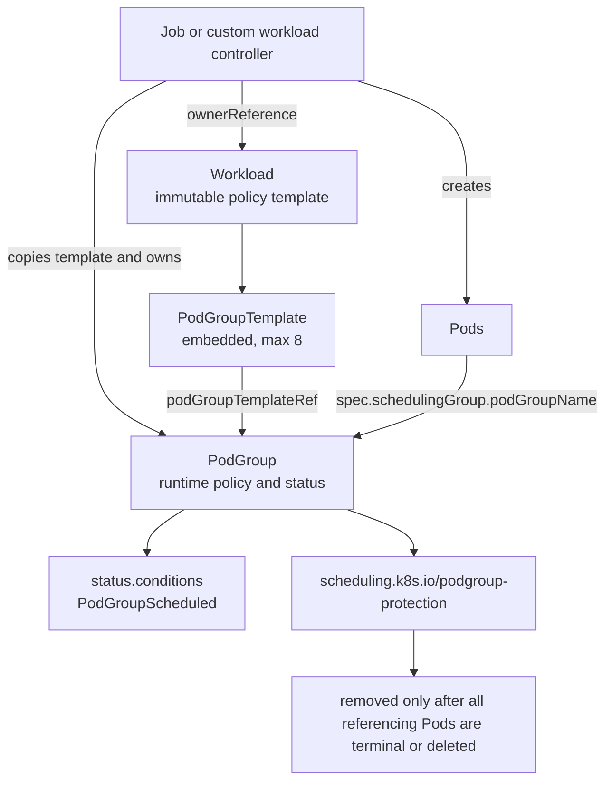

| 对象/字段 | 用途 | 所有权、可变性与限制 |
|-----------|------|----------------------|
| `Workload` | 长期调度策略入口 | namespaced；通常由 workload controller 拥有；整个 spec 不可变，最多 8 个 template |
| `PodGroupTemplate` | `Workload.spec` 内嵌模板 | 不是独立 API 对象；定义 `basic/gang`、TAS、共享 claim、priority/disruption 等策略 |
| `PodGroup` | 一次运行实例与 scheduler 状态 | namespaced；由 workload controller 拥有；policy、template ref、constraints、claim、priority/disruption 均不可变 |
| Pod `spec.schedulingGroup` | 成员到 PodGroup 的运行时引用 | Pod 创建后不可变；引用对象可以稍后出现，但同名 PodGroup 被重建可能带来策略漂移 |
| `PodGroupScheduled` | 初始组调度结果 | 成功后不会因成员后续失败、驱逐或缩容回退为 False，不是持续健康状态 |

controller 的正确创建顺序是 **Workload -> PodGroup -> Pods**。带 `podGroupTemplateRef` 的 PodGroup 若引用不存在或正在删除的 Workload，API Server 拒绝创建；Pod 先于 PodGroup 出现则会 Pending，PodGroup Add 事件再把它激活。

典型 controller 会把 Workload 和 PodGroup 都设为高层 workload 的 owner；PodGroup 还可保存指向 Workload 的非 controller ownerReference 便于追踪。API admission 在 PodGroup 创建时加入 `scheduling.k8s.io/podgroup-protection` finalizer；删除期间只要仍有非终态 Pod 引用它，保护 controller 就保留 finalizer，所有成员进入 `Succeeded/Failed` 或被删除后才解除。

完整策略与运行实例示例。它同时使用 Gang 与 TAS，必须在 API Server、scheduler 和相关 controller 上一致启用 `GenericWorkload`、`GangScheduling` 与 `TopologyAwareWorkloadScheduling`；以下 Alpha 清单只适合锁定 v1.36.3 的隔离验证环境：

```yaml
apiVersion: scheduling.k8s.io/v1alpha2
kind: Workload
metadata:
  name: training-policy
spec:
  controllerRef:
    apiGroup: batch
    kind: Job
    name: distributed-training
  podGroupTemplates:
  - name: workers
    schedulingPolicy:
      gang:
        minCount: 4
    schedulingConstraints:
      topology:
      - key: topology.example.com/fabric-block
---
apiVersion: scheduling.k8s.io/v1alpha2
kind: PodGroup
metadata:
  name: training-workers-0
spec:
  podGroupTemplateRef:
    workload:
      workloadName: training-policy
      podGroupTemplateName: workers
  schedulingPolicy:
    gang:
      minCount: 4
  schedulingConstraints:
    topology:
    - key: topology.example.com/fabric-block
---
apiVersion: v1
kind: Pod
metadata:
  name: worker-0
spec:
  schedulerName: default-scheduler
  schedulingGroup:
    podGroupName: training-workers-0
  containers:
  - name: worker
    image: registry.k8s.io/pause:3.10
    resources:
      requests:
        cpu: "4"
        memory: 16Gi
```

手工使用时必须创建足够多的同组 Pod；这个片段只展示一个成员。所有成员必须引用同一 namespace 中的 PodGroup，并使用相同 `.spec.schedulerName`。

### 9.3 basic 与 gang policy

`PodGroupSchedulingPolicy` 是 union，必须且只能设置 `basic` 或 `gang`：

| 语义 | `basic: {}` | `gang.minCount` |
|------|-------------|-----------------|
| 调度单元 | 同一 cycle 收集、观察和模拟组内 Pod | 同一 cycle 收集并以 quorum 判定可行性 |
| 部分放置 | 允许；可调度成员可以进入 binding，其余回队列 | 初次决定不足 `minCount` 时一个也不绑定 |
| 组级 constraints | 可使用 TAS 等约束 | 可使用 TAS 等约束 |
| 适用 | 统一观察、状态、共享 claim 或未来组约束，但应用能容忍部分启动 | 紧耦合 worker 至少达到最小运行规模才有价值 |

`minCount` 只表示“本次 group scheduling decision 至少要找到多少个可放置成员”，它不等于：

- controller 的期望副本数；组内可以有多于 `minCount` 的 Pod。
- 已经 Running 或 Ready 的 Pod 数；Bind、镜像拉取和容器启动发生在之后。
- Job 的 completions；弹性任务可以有完全不同的完成语义。
- 应用层 rendezvous、MPI world size 或服务发现完成；这些仍由应用/controller 保证。

当已调度成员达到 quorum 后，后来新增的 extra Pod 会在新的 cycle 中考虑已有占用并单独加入；`PodGroupScheduled=True` 不会因为 extra Pod 放不下而回退。

### 9.4 PodGroup scheduling cycle 源码路径

传统路径一次 pop 一个 Pod；启用 `GenericWorkload` 后，scheduler 对引用 PodGroup 的 Pod 组装 `QueuedPodGroupInfo`，并执行如下过程：

1. 从 scheduling queue 取出同组当前可见的 unscheduled Pods，按 Priority 和 scheduler 首次观察时间确定性排序。
2. 校验组内 `.spec.schedulerName` 一致，并选择对应 framework profile。
3. 为整个 PodGroup 更新一次 NodeInfo/PodGroupState snapshot；同一 group cycle 的每个 Pod 都读这一快照及之前的临时 assume 结果。
4. 逐 Pod 执行普通 PreFilter/Filter/Score/PostFilter。可行 Pod 被临时 Assume 并运行 Reserve；若需要默认抢占，其 nominated node 也会在模拟中当作建议位置。
5. 运行 Permit。对 gang，`GangScheduling` 根据 snapshot 中 scheduled/assumed 数判断 `minCount`；对 basic，没有 gang quorum 阻塞。
6. 模拟结束时所有临时 Assume/Reserve 都通过 deferred revert 执行 Unreserve/Forget。若组级决定成功，scheduler 再为每个成功成员准备真实 binding cycle，并异步执行 PreBind/Bind；失败则整组回 unschedulable queue/backoff。

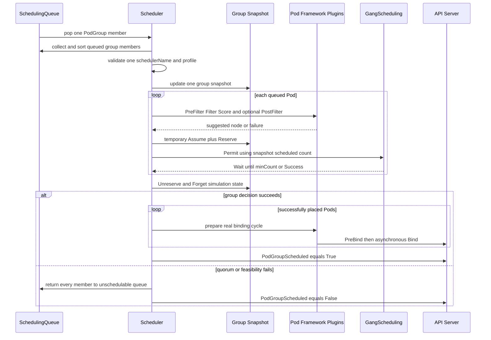

“原子”发生在**是否提交整组初始放置的 scheduler 决策**，不是 API Server 中一个包含多个 Pod binding 的 ACID 事务。成功决定之后，各 Pod 的 binding cycle 在独立 goroutine 中运行；极端的 API、PreBind 或节点故障仍可能让部分 bind 成功、部分失败。因此 controller 重建、应用容错和 reconcile 仍不可省略。

### 9.5 GangScheduling 插件与失败路径

`GangScheduling` 只实现 `PreEnqueue` 与 `Permit`，但依赖 PodGroup cycle 提供整组 snapshot 和统一提交：

| 阶段/故障 | v1.36.3 行为 | 恢复触发 |
|-----------|---------------|----------|
| PodGroup 尚未创建 | `PreEnqueue` 返回 `UnschedulableAndUnresolvable`，Pod 不进入 active queue | 匹配 PodGroup Add |
| 已创建同组 Pod 少于 `minCount` | gang Pod 在 `PreEnqueue` 等待，避免每个成员空转 | 匹配 Pod Add 使总数达到 quorum |
| PodGroup 为 `basic` | 找到 PodGroup 后插件不做 quorum 检查 | 进入 PodGroup cycle，允许部分放置 |
| schedulerName 不一致 | 无法为整组选择唯一 framework，整组拒绝 | controller 重建错误成员；字段不可变，不能原地修正 |
| 某个异构 Pod 无可行节点 | 若最终 Permit 未达到成功条件，所有初始成员回滚 | Node/Pod/claim 等相关事件或 backoff 重试 |
| 组内 affinity/anti-affinity | 固定 Pod 顺序可能错过实际存在的组合解 | 调整 workload 约束/角色拆分；当前实现不做完整组合搜索 |
| Permit 等待 | plugin 的普通 Permit timeout 为 5 分钟；group simulation 读取 Wait/Success 状态，不靠逐 Pod 长期占住节点完成原子性 | 达到 quorum 时 Allow 同组 waiting Pods；否则 cycle 回滚 |

成功与失败的资源效果可以概括为：

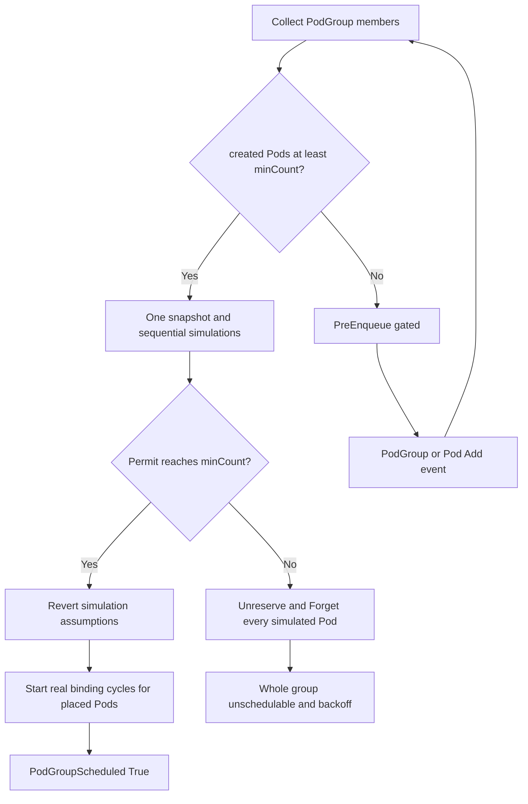

它避免两个任务各占一半资源后都无法启动的经典死锁，但不保证绑定后同时 Running/Ready，不会在一个成员后续失败时自动终止其他成员，也不替代 rendezvous、checkpoint、弹性伸缩、队列配额与公平份额。

### 9.6 Topology-Aware Workload Scheduling

TAS 是 PodGroup 的 placement algorithm，不是 PodTopologySpread 的别名。`TopologyPlacement` 以 PodGroup 唯一 topology constraint 的 label key 分组节点，生成每个 label value 对应的候选 placement；每个 placement 内再完整模拟 PodGroup，最后用 placement-level plugins 选域。

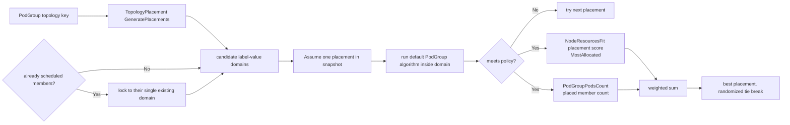

关键细节：

- API 最多允许一个 topology constraint；它表达“整组共置在同一 domain”，不表达多层 rack/host/NVLink 递归约束。
- 节点缺少该 topology label 时不属于任何候选域。标签必须由可靠 controller 发布；陈旧 fabric/机架标签会产生错误放置。
- 已有成员必须全部位于同一个 domain；新成员被锁到该域。若已有成员横跨多个域，placement generation 报错。
- `NodeResourcesFit` 的 Pod-level scoring strategy 可配置为 LeastAllocated 等，但 **placement scoring 固定用 `MostAllocated`**；CPU/内存等 resource weights 继承同一 `NodeResourcesFit` 配置。
- `NodeResourcesFit` 与 `PodGroupPodsCount` 的默认 placement weight 都是 1；后者按已有 scheduled 数加 proposed assignment 数评分，偏好容纳更多成员的域。
- `basic` policy 即使某个域只能放部分成员也可成功，`PodGroupPodsCount` 只是用分数偏好更多成员，不把部分放置升级成 Gang 保证。
- v1.36 workload-aware preemption 明确拒绝带 scheduling constraints 的 PodGroup。不要期待 TAS placement 触发跨节点组级抢占来腾空一个完整域。

对 NVLink/NVSwitch、rail、rack 或 network block，TAS 只消费 node label。它不发现真实 fabric，不检查链路健康，也不把 DRA device-level `fabric` 属性自动提升为 node topology domain；设备与节点两层 source of truth 必须由平台 controller/driver 保持一致。

### 9.7 Workload-Aware Preemption

启用 `WorkloadAwarePreemption` 后，一个无法调度的 gang PodGroup 可以作为单一 preemptor，在整个集群而非单节点范围选择 victims：

1. 读取所有 NodeInfo，把普通 Pod 作为独立 victim unit；仅当 PodGroup 的 `disruptionMode: PodGroup` 时，才把该组当前成员合并为跨节点 victim unit。默认/`Pod` 模式仍逐 Pod disruption。
2. 只保留 priority 严格低于 preemptor PodGroup 的 victim units。若任一 preemptor Pod 设置 `preemptionPolicy: Never`，整组无资格发起抢占。
3. 在 snapshot 中先移除所有潜在 victims，重新运行不含 PostFilter 的 PodGroup scheduling algorithm；仍不可行则抢占无帮助。
4. 按 PDB violation 分组，从更重要到更不重要逐个尝试 reprieve，保留尽可能多的工作负载。最终 victim 可以分布在多个节点。
5. 执行删除并给 PodGroup 写 `DisruptionTarget=True, reason=PreemptionByScheduler`，preemptor 整组回队列等待资源真正释放后重试。

victim “更重要”的严格排序是：更高 Priority；同 Priority 下 PodGroup 优先于单 Pod；两个 PodGroup 之间成员更多者优先；再以更早启动者优先。单 Pod 之间则以更早启动者优先。这个排序用于“尽量 reprieve 谁”，不是租户公平或历史用量算法。

PodGroup 的 `priorityClassName/priority` 和 `disruptionMode` 只在这条 workload-aware 路径中闭环。v1.36 的普通单 Pod 默认抢占如果把某个 PodGroup 成员当 victim，**不会尊重 PodGroup 级 priority 或 disruptionMode**；若平台依赖整组不可拆，必须避免让普通高优先级 Pod 绕过这条边界。

### 9.8 WorkloadWithJob 自动集成边界

`WorkloadWithJob` 只为满足全部条件的新 Job 自动生成对象：

- feature gate 开启，且 `GenericWorkload` 可用。
- `.spec.parallelism > 1`。
- `.spec.completionMode: Indexed`。
- `.spec.completions == .spec.parallelism`。
- Pod template 尚未设置 `spec.schedulingGroup`。
- Job 还没有 Pod、`startTime`、成功/失败计数或历史 `Suspended` condition；中途开启 gate 不接管已启动 Job。

Job controller 先创建由 Job controller-owner 的 Workload，内含一个 template；再创建同时由 Job controller-owner、并非 controller-owner 地引用 Workload 的 PodGroup；最后给 Job Pods 写 scheduling group。生成 gang 的 `minCount` 等于 parallelism。出现多个歧义 Workload/PodGroup、owner UID 不匹配或 Workload template 结构不受支持时，Alpha 实现保守回退到普通调度。

这不是所有 workload controller 的自动协议。JobSet、Ray、Kubeflow Trainer、MPI controller、Grove 或自定义训练 controller 必须明确实现 `Workload -> PodGroup -> Pods` 的创建、owner/finalizer、失败重建与版本兼容；仅给 Pod 加一个同名 annotation 不会触发上游集成。

### 9.9 DRA 与 Gang 的联合链路

`DRAWorkloadResourceClaims` 让 PodGroup 成为 claim consumer。PodGroup 和每个成员 Pod 必须使用完全匹配的 claim 定义；以下清单还要求一致启用 `GenericWorkload`、`GangScheduling` 与 `DRAWorkloadResourceClaims`：

```yaml
apiVersion: scheduling.k8s.io/v1alpha2
kind: PodGroup
metadata:
  name: training-workers
spec:
  schedulingPolicy:
    gang:
      minCount: 4
  resourceClaims:
  - name: fabric
    resourceClaimTemplateName: training-fabric
---
apiVersion: v1
kind: Pod
metadata:
  name: worker-0
spec:
  schedulingGroup:
    podGroupName: training-workers
  resourceClaims:
  - name: fabric
    resourceClaimTemplateName: training-fabric
  containers:
  - name: worker
    image: registry.k8s.io/pause:3.10
    resources:
      claims:
      - name: fabric
```

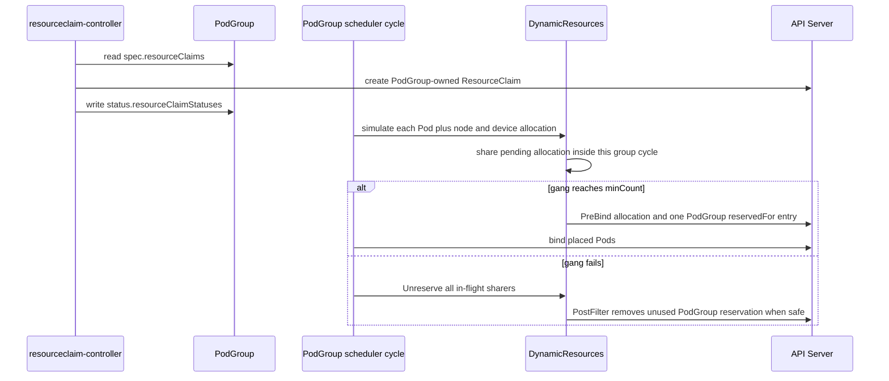

这条链路联合解决三件事：同一 snapshot 内验证 CPU/内存、节点约束与具体 device；同一 cycle 内让多个成员复用尚未持久化的 pending allocation；以一条 PodGroup reservation 避免 256 Pod 上限。它也有明确恢复语义：

- 模拟 Gang 失败时，`Unreserve` 逐 sharer 释放 in-flight allocation，最后一个 sharer 才删除 tracker 状态。
- 已持久化但组内尚无 assumed/assigned Pod 时，下一次 `PostFilter` 可移除 PodGroup reservation，让失败的 binding-condition allocation 重新选择。
- 任一成员已经真正 scheduled 后，不会为重新尝试的其他成员随意释放整组 claim。
- 成功后的 reservation 即使暂时没有 Pod 也持续到 PodGroup 删除，resourceclaim-controller 随后清理 reservation/allocation，template claim 由 owner GC。

DRA + Gang 仍不提供 Kueue 的 ClusterQueue/Cohort 配额、公平排队、Job admission，也不保证容器内显存/带宽硬隔离。前者属于队列控制面，后者属于 DRA driver、CDI/runtime、MIG/HAMi/MPS 等节点实现。

### 9.10 生产采用与升级边界

- `GenericWorkload`、Gang、TAS、workload-aware preemption、Job integration 和 workload claim 都是默认关闭的 Alpha 能力；不要只启一个 scheduler gate。
- API Server、scheduler、controller-manager 与所有相关 kubelet 需要一致的 gate/版本；mixed-version upgrade 必须先验证字段 drop、informer 和 controller 行为。
- Alpha 对象先导出并演练降级。目标版本若不再 serve `v1alpha2`，关闭 gate 之前必须明确存量 Workload/PodGroup/claim 谁来删除。
- 使用独立 scheduler profile 只能隔离 Pod 入口，不能隔离 cluster-scoped feature gate、API storage 或 controller-manager 行为。
- 真实验证需覆盖异构角色、intra-group affinity、DRA conflict、driver failure、leader 切换、PodGroup 删除保护、TAS 标签漂移和 partial Bind。
- 没有 Kueue 式 quota admission、Cohort 借用、层次队列或成熟 DRF；多角色启动顺序、服务发现和成组扩缩仍是 Grove/JobSet/Trainer 等 controller 的职责。

对生产 AI 集群，合理做法是先在隔离环境锁定 patch 版本和 driver/controller 组合，保留成熟 admission/queue 与 workload controller，并用故障注入验证上游 Alpha 路径，而不是仅凭 API 已进入主仓库就替换现有批调度控制面。

---

## 第十章：与五类 AI 调度项目对比

### 10.1 先按控制层对齐

| 项目 | 所在层 | 是否最终 Bind Pod | 核心对象/决策 |
|------|--------|-------------------|---------------|
| kube-scheduler | 节点与设备放置 | 是 | Pod、Node、PVC/PV、ResourceClaim、Alpha PodGroup |
| Koordinator | 放置 + QoS/混部治理 | 是 | Pod、Reservation、Device、NUMA、ElasticQuota |
| Kueue | Job 队列与准入 | 通常否 | Workload、ClusterQueue、LocalQueue、ResourceFlavor |
| Grove | AI 推理工作负载编排 | 否 | PodCliqueSet、PodClique、ScalingGroup、PodGang |
| KAI-Scheduler | GPU/AI 批调度 | 是 | PodGroup、Queue、Pod、GPU、拓扑域 |
| Volcano | AI/HPC 通用批系统 | 是 | Job、PodGroup、Queue、Pod、HyperNode |

把 Kueue 或 Grove 与 kube-scheduler 简化成“二选一”会得出错误结论。它们通常是上游准入/编排层，最终仍需要 kube-scheduler、Koordinator、KAI 或 Volcano 完成节点绑定。

### 10.2 能力矩阵

下表按本站固定版本比较：Kubernetes v1.36.3、Koordinator v1.8.0、Kueue v0.19.0、Grove v0.1.0-alpha.11、KAI-Scheduler v0.17.0 与 Volcano v1.15.1。“Gang 原子性”指 scheduler/admission 的组级提交语义，不代表 API Server 对多个 Pod binding 提供 ACID 事务。

| 维度 | kube-scheduler v1.36.3 | Koordinator v1.8.0 | Kueue v0.19.0 | Grove v0.1.0-alpha.11 | KAI-Scheduler v0.17.0 | Volcano v1.15.1 |
|------|------------------------|--------------------|---------------|--------------------------|-----------------------|-----------------|
| API 稳定性 | 单 Pod API 稳定；DRA `resource.k8s.io/v1`；Workload/PodGroup `v1alpha2` 且默认关闭 | 多组扩展 API/CRD 仍含 `v1alpha1`，需核对 feature gate 与 koordlet | 核心 API 为 `v1beta2`，有明确转换与弃用策略 | 主体 `v1alpha1`，本版本仍明确为 Alpha | PodGroup、Queue、Operator API 快速演进，需按 migration guide 升级 | 历史较长，多组 `v1alpha1`/`v1beta1` CRD，升级面较大 |
| 最终 Bind | 是，Scheduling Framework | 是，`koord-scheduler` | 通常否，准入后交给下游 scheduler | 否，生成/翻译编排意图给 backend | 是，独立 scheduler + Binder | 是，独立 scheduler |
| Gang 原子性 | `GenericWorkload` + `GangScheduling` Alpha；初始组级提交，真实 Bind 仍异步 | Coscheduling/PodGroup；保证取决于启用的插件与 controller 契约 | Workload/PodSet 准入和 PodsReady 恢复，不等于节点级原子 Bind | 表达层次化 PodGang；实际保证由所选 backend 决定 | PodGroup/SubGroup 是核心调度单元，支持层次化组决策 | gang + enqueue/allocate；PodGroup `minMember/minResources` 驱动组决策 |
| 队列、借用与公平 | 无完整租户队列或历史公平系统 | ElasticQuota 多树与 quota runtime | ClusterQueue/LocalQueue/Cohort、借用、Fair Sharing 是核心 | 无全局租户队列 | 层级队列、DRF、priority/time-based fairshare | Queue + DRF/Proportion/Capacity，支持 reclaim |
| Job 准入 | 不负责；`WorkloadWithJob` 只自动接入特定 Indexed Job | 非核心职责 | suspend/admit、ResourceFlavor、AdmissionCheck、MultiKueue | 依赖上游队列或 backend | 支持 Pod Grouper/批调度路径 | Volcano Job、PodGroup 和广泛 controller 集成 |
| 拓扑 | Pod/Node 约束稳定；PodGroup TAS Alpha、单 topology constraint | NetworkTopology、NUMA 与设备拓扑 | 在准入层分配 topology domain，具体节点仍由 scheduler 选择 | ClusterTopologyBinding 表达多层拓扑，落地依赖 backend | workload/SubGroup 级 TAS、GPU/NVLink domain 与 DRA | HyperNode、network-topology-aware、NUMA/task topology plugins |
| 具体设备分配 | Device Plugin 或 DRA；DRA 与节点在同一调度周期联合选择 | DeviceShare、joint allocation、NUMA；隔离仍依赖节点实现 | 对 GPU/DRA 资源做 quota/flavor 准入，不直接选择 device ID | 描述共享 claim/ComputeDomain，设备由 DRA/backend 分配 | Binder、GPU sharing、DRA/ComputeDomain、DRA-backed extended resources；隔离依赖 driver/runtime | DeviceShare、Dynamic MIG、厂商插件；v1.15.0+ 可把 DRA 纳入 Queue quota |
| 工作负载级抢占 | 默认 Pod 抢占稳定；组级抢占 Alpha，可跨节点，但不支持带 TAS 的组；默认抢占不支持 DRA device | priority/preemption 与 Reservation/QoS 组合，需按插件语义验证 | Queue/Cohort 配额层 reclaim/preemption，不等于节点 victims | 不独立抢占，由 backend 解释 PodGang | queue/PodGroup-aware reclaim、preempt、consolidation、最小运行保护与 preemption delay | preempt/reclaim 及 gangpreempt/gangreclaim actions |
| 应用编排 | 只对特定 Indexed Job 有 Alpha 自动接入；不管理多角色依赖 | 不负责应用组件图 | 依赖 Job framework/controller | 核心：clique、角色依赖、服务发现、成组扩缩与滚动更新 | 与 JobSet/Grove 等归组集成，不替代业务 controller | Volcano Job 多 Task/策略较完整，也可接外部 Job controller |
| 运行时隔离与混部 | requests/priority/kubelet 基础；DRA 不自动提供显存隔离 | koordlet/runtime hooks、QoS 与混部闭环是强项 | 不负责节点侧隔离 | 不负责 | GPU sharing 的硬隔离依赖外部 runtime | 批处理为主，设备与混部能力依赖插件/agent/runtime |

矩阵不能脱离版本使用：同名 `PodGroup`、Queue、DRA 或 TAS 在不同项目中不是同一 API，也不保证相同 rollback、preemption 和 status 语义。组合前应把准入、PodGroup owner、最终 Bind、具体设备和运行时隔离各自指定给唯一控制器。

### 10.3 kube-scheduler 与 Koordinator

两者都基于 Kubernetes Scheduling Framework 做最终放置。差异不只在插件数量：Koordinator 还有 manager、koordlet、NodeMetric、runtime hooks 和 QoS/混部闭环，能把实时负载、资源超卖、NUMA、设备与节点侧隔离连接起来。

选择原生 scheduler：约束主要是标准 CPU/内存/整卡 GPU、亲和性和拓扑分布，团队接受 requests 驱动的资源视图。

选择 Koordinator：需要在线离线混部、Reservation、细粒度设备、NUMA、实时负载感知或节点侧 QoS 治理，并愿意承担更大的控制面和升级面。

### 10.4 kube-scheduler 与 Kueue

Kueue 不替代节点选择。它在 Job 创建 Pods 或解除 suspend 之前决定工作负载何时获得 quota、ResourceFlavor、AdmissionCheck 和可能的多集群目标；准入后再由 scheduler 放置 Pod。

```text
Job -> Kueue LocalQueue/ClusterQueue admission
    -> unsuspend / admit Workload
    -> kube-scheduler Filter/Score/Bind
    -> Nodes and Devices
```

需要部门 GPU 配额、跨团队借用、公平排队或云容量联动时，`Kueue + kube-scheduler` 通常比替换 scheduler 更轻。要防止“已准入但放不下”，Kueue ResourceFlavor/TAS 所见容量必须与 scheduler/DRA 的实际约束一致。

### 10.5 kube-scheduler 与 Grove

Grove 描述复杂推理系统的组件、实例、启动依赖和成组扩缩，再通过 scheduler backend 转换 Gang/拓扑意图。kube-scheduler 决定具体 Pod 到 Node，不拥有 Prefill/Decode 或多角色服务的生命周期模型。

v1.36 Workload/PodGroup API 提供了上游统一接口的方向，但 Alpha API 还不等价于 Grove 的多层 clique 和推理编排。二者未来可能是 API 对接关系，而不是简单替代。

### 10.6 kube-scheduler 与 KAI-Scheduler

KAI 面向 GPU/AI workload，提供层次队列、公平共享、PodGroup/Gang、GPU sharing、拓扑和分片等完整批调度能力。它适合 GPU 集群中“谁先获得多少资源、整组何时运行、放到哪种拓扑”需要由同一系统强协调的场景。

原生 v1.36 Alpha Gang 不提供 KAI Pod Grouper 针对 segmented elastic PyTorchJob 的自动分组语义。KAI v0.16.7 修复了 `elasticPolicy.minReplicas` 与 segment 边界：必需 worker segments 数量为 `ceil(max(0, minReplicas - masterReplicas) / segmentSize)`，其余 segments 的 `MinAvailable` 为 0；v0.17.0 继续保留该修复，并新增 preemption delay。`kai.scheduler/preemption-delay` 或 PodGroup `spec.preemptionDelay` 只让 Pending workload 在窗口内不能通过 preempt、reclaim、consolidation 驱逐别人，仍允许它使用空闲容量，也不让它自身免于 eviction；每次 eviction 后窗口重新计时，适合给 Cluster Autoscaler 留出扩容时间。

代价是引入独立 scheduler、Binder、admission/controllers、CRD 和升级矩阵。普通在线服务或只需少量标准 GPU Pod 的集群，原生 scheduler + DRA/Device Plugin 更容易运维。

### 10.7 kube-scheduler 与 Volcano

Volcano 的 Session/Action/Plugin 模型与 Scheduling Framework 不同，除了放置还提供 Volcano Job 生命周期、Queue、PodGroup、DRF、reclaim/preempt、HyperNode 和广泛批处理集成。

v1.15.1 延续 v1.15.0 的 DRA Queue quota 与 gang-aware actions，并加入 `golang.org/x/crypto` SSH 安全更新，以及 PVC informer race、PrePredicate 后续分配、DRA device count 溢出、HAMi/Ascend 设备记账、scalar milli-unit 和 nil panic 等调度修复。它是补丁基线，不改变 Volcano 与原生 Scheduling Framework 的架构边界。

已有 Spark、MPI、HPC、训练 Job 和成熟 Queue 治理的集群更适合评估 Volcano。仅希望调整 Pod Filter/Score 时，迁移到完整 Volcano 控制面通常超过实际需求。

### 10.8 组合而不是堆叠

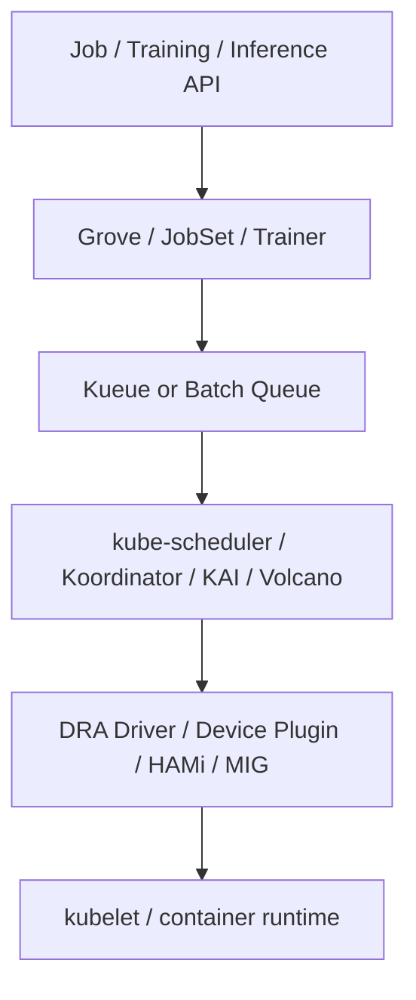

每一层都应只有明确的 source of truth：谁拥有配额、谁生成 PodGroup、谁最终 Bind、谁选择具体设备、谁执行隔离。组件数量多不代表能力自动叠加；两个系统同时改同一 Pod annotation 或 claim，通常意味着控制面冲突。

---

## 第十一章：场景化选型

### 11.1 决策表

| 场景 | 推荐起点 | 原因与前提 |
|------|----------|------------|
| 普通服务、CPU/内存 Pod | kube-scheduler | 稳定默认能力足够 |
| 少量整卡 GPU 推理 | kube-scheduler + Device Plugin/DRA | 不需要团队队列或复杂 Gang |
| 部门 GPU 配额与 Job 排队 | Kueue + kube-scheduler | 保留原生放置，补充准入与借用 |
| GPU 显存份额和硬隔离 | scheduler + HAMi/MIG/MPS 或合适 DRA driver | 调度记账与运行时隔离必须闭环 |
| 在线离线混部、NUMA、实时负载 | Koordinator | 控制面到节点侧 QoS 的完整路径 |
| 多租户大规模训练与层级公平 | KAI-Scheduler 或 Volcano | 成熟 Queue/Gang/公平/抢占语义 |
| HPC/大数据与完整 Job 生命周期 | Volcano | Job、Queue、插件和生态集成丰富 |
| 多组件、P/D 分离推理 | Grove + 合适 backend | 需要应用编排和层次化 Gang |
| 试验上游原生 Gang/TAS | 隔离环境启用 v1.36 Alpha gates | 不直接承诺生产兼容性 |

### 11.2 只用原生 scheduler 的成功条件

以下条件大部分成立时，优先保留原生调度器：

- 工作负载可以逐 Pod 启动，或应用能容忍部分成员等待。
- 无需跨团队公平队列、配额借用和 Job suspend/admission。
- GPU 使用整数资源或 DRA driver 已完整满足设备需求。
- node label、taint、affinity、topology spread 足以表达拓扑。
- requests 能代表容量需求，不要求实时负载驱动的混部。
- 平台更重视上游兼容和较小运维面。

### 11.3 何时不要靠插件继续堆功能

若需求同时包含层次队列、DRF、公平借用、多 Pod 原子启动、Job 状态机、GPU/NVLink 拓扑和成组抢占，把所有逻辑做成自研 scheduler plugins 往往等同于重新实现批调度器。

此时应评估现有 AI scheduler，并比较 API 稳定性、升级矩阵、controller 集成、设备所有权和团队运维能力，而不是只比较某一个打分算法。

### 11.4 建议的选型验证

1. 用真实 Job 规模和资源比例构造 trace，不只运行单 Pod demo。
2. 测试资源不足、碎片、跨 zone、卷等待、设备不可用和节点故障。
3. 同时记录排队时间、调度尝试、TTFT/训练启动时间、利用率和公平偏差。
4. 验证 controller 重建、scheduler leader 切换、webhook/DRA driver 故障。
5. 检查升级和回滚时 CRD、feature gate、profile、Queue/PodGroup 状态；KAI segmented elastic PyTorchJob 还要验证 `minReplicas` 到 mandatory segments 的换算。
6. 明确未获准 Job 是否创建 Pod，以及已准入但无法绑定如何回收配额。

---

## 第十二章：生产部署、可观测性与排障

### 12.1 高可用与安全

- 开启 leader election，并监控 leader 切换和 API Server 连通性。
- scheduler kubeconfig/RBAC 只授予所需对象权限；Bind、Event、Lease、PVC/PV、ResourceClaim 等权限缺失会在不同阶段失败。
- 自定义插件与 scheduler 在同一进程，插件 panic、阻塞或内存泄漏会影响整个调度器。
- Extender 是网络依赖；配置 `ignorable` 前先确认失败时跳过它不会造成设备重复分配或安全绕过。
- 多 scheduler 共存时，监控每个 `schedulerName` 是否有健康实例消费。

### 12.2 核心指标

v1.36.3 中值得建立 dashboard 的指标包括：

| 指标 | 用途 |
|------|------|
| `scheduler_pending_pods{queue=...}` | active、backoff、unschedulable、gated 队列深度 |
| `scheduler_schedule_attempts_total{result,profile}` | 成功、不可调度和内部错误速率 |
| `scheduler_scheduling_attempt_duration_seconds` | 单次尝试总延迟 |
| `scheduler_scheduling_algorithm_duration_seconds` | Filter/Score 等算法延迟 |
| `scheduler_pod_scheduling_sli_duration_seconds` | 从入队到成功的端到端延迟 |
| `scheduler_framework_extension_point_duration_seconds` | 每个扩展点总耗时 |
| `scheduler_plugin_execution_duration_seconds` | 具体插件热点 |
| `scheduler_unschedulable_pods{plugin,profile}` | 按失败插件定位积压 |
| `scheduler_preemption_attempts_total` | 抢占频率 |
| `scheduler_cache_size{type}` | Node、Pod、assumed Pod cache 状态 |

启用 GenericWorkload 后还有 Alpha 的 `scheduler_podgroup_schedule_attempts_total`、`scheduler_podgroup_scheduling_attempt_duration_seconds` 等指标，不能与普通 Pod 指标混为同一稳定性等级。

### 12.3 排障路径

```bash
# 查看 Pending Pod 使用哪个 scheduler、有什么 gate 和提名节点
kubectl get pod -A --field-selector=status.phase=Pending \
  -o custom-columns='NS:.metadata.namespace,NAME:.metadata.name,SCHED:.spec.schedulerName,GATES:.spec.schedulingGates,NOMINATED:.status.nominatedNodeName'

# 查看结构化调度条件与事件
kubectl describe pod -n <namespace> <pod>
kubectl get events -A --field-selector=reason=FailedScheduling \
  --sort-by=.lastTimestamp

# 查看节点 allocatable、taint、label 和已有 requests
kubectl describe node <node>

# 查看默认静态 Pod 部署的 scheduler 日志
kubectl logs -n kube-system -l component=kube-scheduler --tail=300

# 启用 Alpha Workload API 后查看组状态
kubectl get workloads,podgroups -A
kubectl describe podgroup -n <namespace> <podgroup>
```

### 12.4 常见 FailedScheduling 原因

| 事件片段 | 首要检查 | 不应误判为 |
|----------|----------|------------|
| `Insufficient cpu/memory` | requests、init container、overhead、allocatable | 当前 CPU/内存使用率必然很高 |
| `Insufficient nvidia.com/gpu` | resource name、Node allocatable、device plugin、已分配 requests | GPU 物理卡一定故障 |
| `untolerated taint` | taint key/value/effect 与 toleration | node affinity 问题 |
| `didn't match Pod's node affinity/selector` | label、required terms、多个表达式逻辑 | Score 权重问题 |
| `didn't match pod topology spread` | selector、topologyKey、eligible domains、maxSkew | Gang 一定失败 |
| `volume node affinity conflict` | PV zone、StorageClass、PVC 绑定模式 | 计算资源不足 |
| `preemption is not helpful` | 是否存在可由低优先级 victims 释放的可行节点 | 抢占功能未运行 |
| 一直没有 FailedScheduling | schedulerName、schedulingGates、scheduler 健康 | Filter 插件一定拒绝 |

### 12.5 升级检查

1. 锁定 Kubernetes minor/patch、发行版静态 Pod 或 Deployment 的 scheduler 参数。
2. 校验 `KubeSchedulerConfiguration` API、插件名、参数 schema 和 feature gate 状态。
3. out-of-tree 插件必须用目标版本 Framework 重新构建并通过兼容测试。
4. Alpha Workload/PodGroup 对象先导出，确认目标版本 API 是否仍可读写及是否需要转换。
5. 验证 leader 切换、assumed Pod 回收、Permit 等待项和 DRA claim 状态。
6. 对共享 counter/partitionable device 做候选回溯测试，确认 v1.36.3 的 reserved-state rollback 生效。
7. 对关键 Pod 做调度回放，比较目标版本插件默认值和分数变化。
8. 回滚方案必须同时覆盖二进制、配置、feature gate 和 Alpha API 对象。

---

## 第十三章：常见误区与结论

### 13.1 常见误区

| 误区 | 正确理解 |
|------|----------|
| scheduler 按实时 CPU/GPU 利用率选节点 | 默认主要依据 allocatable 与 requests；实时负载需要额外数据和插件 |
| toleration 会把 Pod 吸引到带 taint 节点 | toleration 只取消排斥，仍需 affinity/selector/resource 形成正向选择 |
| Score 权重可以覆盖硬约束 | Filter 拒绝的节点不会进入 Score |
| Priority 等于资源预留 | Priority 只影响顺序和抢占，不创建长期容量保证 |
| PDB 能阻止所有抢占和故障 | 默认抢占尽量尊重 PDB，但不是绝对；节点故障等也不受其完整保护 |
| DRA 稳定意味着所有设备扩展都稳定 | DRA 核心稳定，多个高级子能力仍有独立 feature state |
| v1.36 原生已完整替代批调度器 | PodGroup/Gang/TAS/组级抢占仍是 Alpha，队列公平和 Job 编排也未完整覆盖 |
| Kueue 和 kube-scheduler 二选一 | Kueue 通常负责准入，kube-scheduler 负责最终放置 |
| Grove 是 GPU scheduler | Grove 描述推理工作负载，具体节点和设备由 backend/driver 选择 |
| 多装几个 scheduler 会自动协同 | `schedulerName` 只分流 Pod，配额、webhook、设备所有权仍需显式设计 |

### 13.2 核心结论

1. kube-scheduler 是稳定、可扩展的单 Pod 放置引擎，Scheduling Framework、profile、DRA 和标准约束足以覆盖大量生产工作负载。
2. 它的热路径依赖本地 cache、snapshot、assume 和异步 binding；理解这些机制比只记 Filter/Score 更有助于定位一致性与性能问题。
3. Kubernetes v1.35/v1.36 已开始原生提供 Workload/PodGroup、Gang、TAS 和 workload-aware preemption，但 v1.36.3 中这些工作负载级能力仍是默认关闭的 Alpha 能力。
4. AI 调度的缺口往往在队列公平、工作负载原子性、设备拓扑、运行时隔离和应用编排，不应期待一个 `schedulerName` 独立解决所有层。
5. 选型的正确方式是先画清准入、编排、节点放置和设备隔离的责任边界，再决定保留原生 scheduler、组合 Kueue/Grove，还是采用 Koordinator/KAI/Volcano。

---

## 附录：版本、命令与官方参考

### A.1 版本快照

| 项目 | 快照 |
|------|------|
| Kubernetes release | `v1.36.3` |
| Annotated release tag object | `49c14f82ca9748897f0189be31cbf9c2f4085fc1` |
| Tag 解引用后的 source commit | `0f29094e5b73085e3802ecc1298ecae13866bfe6` |
| DRA | v1.34 GA；v1.35 起锁定为默认开启 |
| GenericWorkload / GangScheduling | v1.35 Alpha，默认关闭 |
| TopologyAwareWorkloadScheduling | v1.36 Alpha，默认关闭 |
| WorkloadAwarePreemption | v1.36 Alpha，默认关闭 |
| OpportunisticBatching | v1.35 Beta，v1.36.3 默认开启 |
| 审校日期 | 2026-07-28 |

`v1.36.3` 是 annotated tag：tag object 为 `49c14f82ca9748897f0189be31cbf9c2f4085fc1`，解引用后的源码 commit 为 `0f29094e5b73085e3802ecc1298ecae13866bfe6`。本文页头和站点元数据使用后者；保留 tag object 仅用于复核 Git ref，不把它当作 source commit。

本次 patch release 与本文直接相关的变更是 DRA structured allocator 共享 counter 回滚修复，以及 `DRADeviceTaintRules` 打开时 ResourceSlice 变化可能触发 scheduler panic/忽略规则更新的修复。核心 API maturity 与 v1.36.2 相同，不把补丁修复描述成新的 GA/Beta 能力。

### A.2 Kubernetes 调度官方参考

| 主题 | 官方链接 |
|------|----------|
| Scheduling, Preemption and Eviction | <https://kubernetes.io/docs/concepts/scheduling-eviction/> |
| Kubernetes Scheduler | <https://kubernetes.io/docs/concepts/scheduling-eviction/kube-scheduler/> |
| Scheduling Framework | <https://kubernetes.io/docs/concepts/scheduling-eviction/scheduling-framework/> |
| Scheduler Configuration | <https://kubernetes.io/docs/reference/scheduling/config/> |
| KubeSchedulerConfiguration v1 API | <https://kubernetes.io/docs/reference/config-api/kube-scheduler-config.v1/> |
| Scheduler Performance Tuning | <https://kubernetes.io/docs/concepts/scheduling-eviction/scheduler-perf-tuning/> |
| Pod Priority and Preemption | <https://kubernetes.io/docs/concepts/scheduling-eviction/pod-priority-preemption/> |
| Pod Scheduling Readiness | <https://kubernetes.io/docs/concepts/scheduling-eviction/pod-scheduling-readiness/> |
| Dynamic Resource Allocation | <https://kubernetes.io/docs/concepts/scheduling-eviction/dynamic-resource-allocation/> |

### A.3 工作负载级调度官方参考

| 主题 | 官方链接 |
|------|----------|
| Workload API | <https://kubernetes.io/docs/concepts/workloads/workload-api/> |
| PodGroup API | <https://kubernetes.io/docs/concepts/workloads/podgroup-api/> |
| PodGroup Scheduling | <https://kubernetes.io/docs/concepts/scheduling-eviction/podgroup-scheduling/> |
| Gang Scheduling | <https://kubernetes.io/docs/concepts/scheduling-eviction/gang-scheduling/> |
| Topology-Aware Workload Scheduling | <https://kubernetes.io/docs/concepts/scheduling-eviction/topology-aware-scheduling/> |
| Workload-Aware Preemption | <https://kubernetes.io/docs/concepts/scheduling-eviction/workload-aware-preemption/> |

### A.4 源码参考

| 主题 | v1.36.3 源码 |
|------|--------------|
| 调度与绑定主流程 | <https://github.com/kubernetes/kubernetes/blob/v1.36.3/pkg/scheduler/schedule_one.go> |
| DRA `resource.k8s.io/v1` API 类型 | <https://github.com/kubernetes/kubernetes/blob/v1.36.3/staging/src/k8s.io/api/resource/v1/types.go> |
| DynamicResources 调度插件 | <https://github.com/kubernetes/kubernetes/blob/v1.36.3/pkg/scheduler/framework/plugins/dynamicresources/dynamicresources.go> |
| ResourceClaim controller | <https://github.com/kubernetes/kubernetes/blob/v1.36.3/pkg/controller/resourceclaim/controller.go> |
| kubelet DRA manager | <https://github.com/kubernetes/kubernetes/blob/v1.36.3/pkg/kubelet/cm/dra/manager.go> |
| 默认插件集合 | <https://github.com/kubernetes/kubernetes/blob/v1.36.3/pkg/scheduler/apis/config/v1/default_plugins.go> |
| 调度指标 | <https://github.com/kubernetes/kubernetes/blob/v1.36.3/pkg/scheduler/metrics/metrics.go> |
| Workload/PodGroup API 类型 | <https://github.com/kubernetes/kubernetes/blob/v1.36.3/staging/src/k8s.io/api/scheduling/v1alpha2/types.go> |
| PodGroup scheduling cycle | <https://github.com/kubernetes/kubernetes/blob/v1.36.3/pkg/scheduler/schedule_one_podgroup.go> |
| GangScheduling 插件 | <https://github.com/kubernetes/kubernetes/blob/v1.36.3/pkg/scheduler/framework/plugins/gangscheduling/gangscheduling.go> |
| TopologyPlacement 插件 | <https://github.com/kubernetes/kubernetes/blob/v1.36.3/pkg/scheduler/framework/plugins/topologyaware/topology_placement.go> |
| Workload-aware preemption | <https://github.com/kubernetes/kubernetes/blob/v1.36.3/pkg/scheduler/framework/preemption/podgrouppreemption.go> |
| Job 自动集成 | <https://github.com/kubernetes/kubernetes/blob/v1.36.3/pkg/controller/job/job_scheduling_manager.go> |
| Feature gates | <https://github.com/kubernetes/kubernetes/blob/v1.36.3/pkg/features/kube_features.go> |

### A.5 关联文档

- [Kubernetes AI 调度器深度对比](/Kubernetes-AI-Schedulers-Deep-Dive.html)
- [HAMi 异构设备虚拟化与调度](/HAMi-Deep-Dive.html)
- [NVIDIA GPU Operator 深度技术文档](/NVIDIA-GPU-Operator-Deep-Dive.html)
- [Volcano 升级与 Feature 兼容性](/Volcano-Upgrade-Compatibility-Deep-Dive.html)
