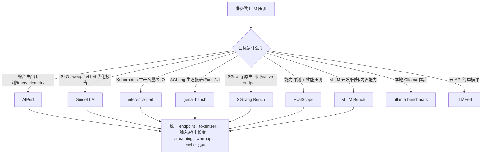

# LLM 压测工具深度对比

> **AIPerf、GuideLLM、inference-perf、genai-bench、SGLang Bench、LLMPerf、Ollama Benchmark、vLLM Bench 与 EvalScope 的定位、指标、负载模型和选型解析**
>
> 面向准备做 LLM 推理服务压测、容量评估、SLO 验证、KV cache 效果验证和多框架横向对比的工程团队。
>
> 稳定版本基线：AIPerf `v0.12.0`、GuideLLM `v0.7.3`、inference-perf `v0.6.1`、genai-bench `v0.0.5`、SGLang `v0.5.19@0bcd822377da7b5718e674eaf9c870d349424dd1`、LLMPerf `v2.0`、ollama-benchmark `v0.5.2`、vLLM `v0.28.0`、EvalScope `v1.11.1`；审校日期：2026-09-06。

---

## 目录

- [自动生成目录占位](#自动生成目录占位)

---

## 第一章：LLM 压测为什么不同于普通 HTTP 压测

普通 HTTP 压测通常关注 QPS、平均延迟、P99 延迟和错误率。LLM serving 的压力模型更复杂，因为一次请求内部包含两个性质完全不同的阶段：

| 阶段 | 主要工作 | 典型瓶颈 | 用户感知指标 |
|------|----------|----------|--------------|
| Prefill | 处理输入 prompt，构建首轮 KV cache | 计算吞吐、attention、长上下文内存 | TTFT |
| Decode | 逐 token 生成输出 | 显存带宽、KV cache 容量、batch 调度 | ITL、TPOT、输出 tokens/s |

所以，LLM 压测不能只看“请求完成得快不快”。它至少要回答：

| 问题 | 为什么重要 |
|------|------------|
| 首 token 多快出现？ | 决定流式交互体验，受 prefill、排队和调度影响 |
| 后续 token 是否稳定？ | 决定用户阅读流畅度，受 decode batch 和 KV cache 影响 |
| 单用户速度和系统总吞吐是否同时达标？ | 高吞吐可能牺牲单用户体验 |
| open-loop 下是否积压？ | 真实流量不会等服务端处理完才发下一条请求 |
| 请求长度分布是否真实？ | 200 token 与 200K token 对系统是两种工作负载 |
| prefix cache / KV cache 是否改变结果？ | 缓存命中会显著改变 TTFT、吞吐和容量边界 |
| 输出长度是否可控？ | 不控制 `ignore_eos`、`min_tokens` 时，不同工具可能测到不同输出长度 |

因此，LLM 压测工具的核心差异不是“能不能发 HTTP 请求”，而是能否准确表达 LLM workload：token 分布、到达模型、多轮上下文、缓存复用、SLO、goodput、trace replay、多模态输入和服务端观测。

---

## 第二章：核心指标与口径

### 2.1 延迟指标

| 指标 | 含义 | 常见口径 |
|------|------|----------|
| TTFT / Time To First Token | 从请求发出到收到第一个输出 token 或第一个有效 chunk | 衡量 prefill + 排队 + 首 token 生成 |
| TTST / Time To Second Token | 第一个 token 到第二个 token 的间隔 | 用于区分首 token 之后的启动抖动 |
| ITL / Inter Token Latency | 相邻输出 token 之间的时间间隔 | 衡量流式输出平稳性 |
| TPOT / Time Per Output Token | 每个输出 token 平均耗时，通常不含首 token | 常用于估算 decode 速度 |
| E2E Latency / Request Latency | 请求开始到完整响应结束 | 非流式或整体 SLA 关注 |
| TTFB / Time To First Byte | 首个 response byte 时间 | 音频、图片或无法按 token 切分时常用 |

要注意：不同工具对 TPOT/ITL 的细节可能不同。有的按 chunk 统计，有的按 token 统计；有的把第一个 token 排除，有的包含首 token。横向比较时要先固定工具口径，不能直接把两个工具默认表格的 `TPOT` 当成完全相同。

### 2.2 吞吐指标

| 指标 | 含义 | 使用方式 |
|------|------|----------|
| RPS / request throughput | 每秒完成请求数 | 用于业务请求容量估算 |
| Output tokens/s | 全局每秒输出 token 数 | 主要衡量 decode 能力 |
| Input tokens/s | 全局每秒处理输入 token 数 | 主要衡量 prefill 能力 |
| Total tokens/s | 输入 + 输出 token 总吞吐 | 适合粗略比较整体处理量 |
| tokens/s/user | 单用户输出速度 | 用户体验侧指标 |
| Goodput | 满足 SLO 的请求或 token 吞吐 | 生产容量评估更有意义 |

Raw throughput 只说明系统做了多少工作，goodput 才说明有多少工作在 SLA 内完成。例如系统在 200 RPS 下仍能完成所有请求，但 P99 TTFT 已经超过 10 秒，这个 RPS 对交互式业务没有意义。

### 2.3 统计口径

LLM 压测至少应报告：

| 统计项 | 作用 |
|--------|------|
| mean / avg | 快速观察总体水平，但容易被长尾掩盖 |
| p50 | 典型用户体验 |
| p90 / p95 | 常规尾延迟 |
| p99 / p999 | 生产 SLO 和容量边界 |
| min / max | 发现异常点和冷启动 |
| stddev | 衡量稳定性 |
| success / failed / incomplete | 判断结果是否可信 |

只报告平均延迟的压测结果基本不够用。LLM serving 的尾延迟通常由长 prompt、batch 调度、KV cache miss、模型加载、网络抖动或服务端排队造成，平均值会掩盖这些问题。

---

## 第三章：负载模型

### 3.1 closed-loop 与 open-loop

| 模型 | 行为 | 适合场景 | 风险 |
|------|------|----------|------|
| Closed-loop | 每个 client 等上一个请求完成后再发下一个 | 固定并发、用户会话模型、单用户体验 | 系统变慢时实际 RPS 会下降，可能掩盖排队崩溃 |
| Open-loop | 按目标速率发请求，不等待旧请求完成 | 真实流量、容量规划、SLO/goodput | 需要控制最大在飞请求，否则可能压垮服务 |

固定并发不是固定 QPS。一个 100 并发 closed-loop 测试，如果服务延迟从 1 秒变成 10 秒，实际 RPS 会从 100 降到 10。open-loop 才能回答“每秒固定来 100 个请求时系统会怎样”。

### 3.2 到达分布

| 到达模型 | 含义 | 适合场景 |
|----------|------|----------|
| 同步 / synchronous | 一个请求跑完再跑下一个 | 功能 smoke test、单请求 latency |
| 固定并发 / concurrent | 保持 N 个请求在飞 | 并发能力和延迟曲线 |
| 固定速率 / constant rate | 每秒固定发 R 个请求 | 稳态容量测试 |
| Poisson | 请求间隔服从指数分布 | 更贴近随机到达的线上流量 |
| sweep | 扫描并发或速率直到饱和 | 找安全工作点和容量边界 |
| trace replay | 按真实 trace 重放 | 复现生产流量、agentic workload |

### 3.3 压测前必须对齐的参数

| 类别 | 必须对齐 |
|------|----------|
| API | `/v1/chat/completions`、`/v1/completions`、`/v1/responses`、embedding/rerank endpoint |
| Streaming | 是否开启 SSE streaming；不开启通常无法测准 TTFT/ITL |
| Tokenizer | 同一 tokenizer 路径或同一模型 ID |
| 输入长度 | 固定长度、分布、数据集、prefix 长度 |
| 输出长度 | `max_tokens`、`min_tokens`、`ignore_eos` |
| Sampling | `temperature`、`top_p`、`top_k`、`seed` |
| 缓存 | prefix cache、prompt cache、KV offload 是否开启 |
| warmup | 预热请求是否计入正式指标 |
| 客户端资源 | 压测机 CPU、连接数、端口、网络是否足够 |

很多“工具 A 比工具 B 测出来快”的差异，其实来自默认参数不同：一个用了 `/v1/completions`，另一个用了 chat template；一个开启 streaming，另一个非流式；一个让模型遇 EOS 停止，另一个强制输出固定 token。

---

## 第四章：工具总览矩阵

| 工具 | 核心定位 | 最适合场景 | 不适合场景 |
|------|----------|------------|------------|
| AIPerf | 综合生产级 GenAI 压测平台 | 复杂 workload、AgentX/DAG replay、多模态、adaptive scale、telemetry、SLO/goodput | 只想快速测单个 vLLM 参数时略重 |
| GuideLLM | SLO-aware LLM benchmarking 平台 | vLLM/OpenAI-compatible 服务优化、sweep、安全工作点、标准 JSON/CSV/HTML 报告 | Kubernetes 原生部署和 WG Serving 标准化不是重点 |
| inference-perf | Kubernetes SIG/WG Serving 背景的生产压测工具 | K8s 集群、vLLM/SGLang/TGI、公平横评、10k+ QPS、goodput、OTel/trace replay | 只做本地单机小模型体验测试时偏重 |
| genai-bench | SGLang 生态友好的 token-level benchmark | SGLang/OpenAI-compatible、多任务、Live UI、Excel/plot 报告 | 复杂 trace replay 和 K8s 标准化能力不如前几类 |
| SGLang Bench | SGLang 仓库原生 `bench_serving` 在线压测脚本 | SGLang 服务回归、后端对比、Mooncake trace、PD disaggregation fake prefill、cache/profile 调试 | 跨团队报表治理和 K8s goodput 平台 |
| LLMPerf | Ray 生态早期 LLM API benchmark | 多云 API 简单横评、load test + correctness smoke test | 现代 SLO、trace、多模态和可视化能力有限 |
| ollama-benchmark | 本地 Ollama 吞吐测试 | 个人机器、本地模型 tokens/s 快速体验 | 生产 LLM serving、K8s、OpenAI-compatible 压测 |
| vLLM Bench | vLLM 内置 benchmark 工具集 | vLLM 开发、回归、serve/latency/throughput/prefix cache/multi-turn 专项 | 跨框架生产压测平台 |
| EvalScope | ModelScope 一站式评测 + 压测 + 可视化 | 中文生态、模型能力评测与性能压测结合、vLLM Bench 对齐、多轮/多模态/API 压测 | 只需要极简本地吞吐测试时偏重 |

### 4.1 能力对比

| 维度 | AIPerf | GuideLLM | inference-perf | genai-bench | SGLang Bench | LLMPerf | Ollama Bench | vLLM Bench | EvalScope |
|------|--------|----------|----------------|-------------|--------------|---------|--------------|------------|-----------|
| OpenAI-compatible | 支持 | 支持 | 支持 | 支持 | 支持 | 支持 | 不主打 | 支持 | 支持 |
| vLLM 专项 | 可测 | 强 | 已验证 | 可测 | 可测后端 | 可测 API | 不适用 | 最强 | 强 |
| SGLang 专项 | 有教程/endpoint | 可测 | 已验证 | 强 | 原生最强 | 可测 API | 不适用 | 不主打 | 可测 |
| K8s 生产压测 | 可用 | 非重点 | 强 | 非重点 | 非重点 | 非重点 | 不适用 | 非重点 | 可用 |
| fixed concurrency | 支持 | 支持 | 支持 | 支持 | 支持 | 支持 | 极简 | 支持 | 支持 |
| request rate | 支持 | 支持 | 支持 | 较弱 | 支持 | 不主打 | 不适用 | 支持 | 支持 |
| Poisson | 支持 | 支持 | 支持 | 不主打 | 支持 | 不主打 | 不适用 | 支持 | 支持 |
| sweep | 支持 | 强 | 支持 | 支持 | 需脚本封装 | 不主打 | 不适用 | 部分支持 | 支持 |
| trace replay | AgentX、DAG、生产 trace | 发展中 | 强 | 弱 | Mooncake/agentic | 弱 | 无 | 部分脚本 | workload trace、agentic/multi-turn |
| goodput/SLO | 支持 | 强 | 强 | 基础 | 弱 | 弱 | 无 | 弱 | SLA auto tune |
| 多模态 | 强 | 强 | 支持 | 支持 | 支持 image/MMMU | 弱 | 弱 | 部分 | 强 |
| 可视化 | dashboard/plot/telemetry | HTML/CSV/JSON | analysis/png | Live UI/Excel/plot | console/JSONL/term plot | JSON | console/json | console/png | WebUI/W&B/SwanLab/ClearML |

### 4.2 简化选型图



---

## 第五章：AIPerf

### 5.1 定位

AIPerf 是 ai-dynamo 生态中的综合 GenAI benchmark 工具。它不是简单脚本，而是一个面向生产压测的框架：支持多进程架构、ZMQ 服务间通信、实时 dashboard、headless 模式、插件系统、trace replay、多模态数据集、server metrics、GPU telemetry、MLflow/OpenTelemetry/W&B 等集成。

一句话概括：

> **AIPerf 适合把 LLM 压测当作生产工程来做，而不是只跑一次 CLI 看平均延迟。**

### 5.2 能力

| 能力 | 说明 |
|------|------|
| Benchmark mode | concurrency、request-rate、request-rate + max concurrency、trace replay |
| 到达分布 | constant、Poisson、gamma、fixed schedule、ramping |
| 数据集 | ShareGPT、AIMO、MMStar、MMVU、VisionArena、LLaVA-OneVision、SPEED-Bench、SpecBench、自定义、inline、raw payload |
| 多模态 | text、vision、audio、image generation、video generation |
| 协议与 agentic replay | OpenAI 系列端点、Anthropic Messages；AgentX v1.0 支持 WEKA、agentic replay 和 DAG-shaped workload |
| 负载控制 | 固定并发/速率、trace replay、ramp，以及按 SLA 单次寻找并维持边界的 adaptive scale |
| 指标 | TTFT、TTST、TTFO、ITL、ICL、request latency、Decode Duration、tokens/s、goodput、HTTP trace、GPU energy |
| 可观测 | DCGM GPU telemetry、Prometheus server metrics、OTel、MLflow、W&B |
| 扩展 | endpoint、dataset、transport、metric 等插件类别 |

### 5.3 v0.12.0 稳定增量

`v0.12.0` 把 agentic workload、协议覆盖和单次自适应压测推进到稳定 release：

| 变化 | 工程含义 |
|------|----------|
| AgentX v1.0 | 支持 WEKA、agentic replay 与 DAG-shaped workload，保留 conversation/turn 依赖和 fork 结构；应同时固定 trace corpus、随机种子、路由会话亲和及 prefix cache 状态 |
| Anthropic Messages API | `--endpoint-type messages` 直接覆盖 `/v1/messages` 的流式/非流式、top-level `system`、extended thinking、tool use 和 `raw_messages` 原样重放，不必先转换成 OpenAI Chat |
| Adaptive scale | 在一次 YAML benchmark 的 profiling phase 内按 `concurrency`、`prefill_concurrency`、`request_rate` 或 `users` 调节压力；所有 SLA filter 通过才继续升压，找到首个失败边界后在最后通过值附近 sustain |
| 多阶段与控制 | 单次 run 可定义多个 warmup/profiling phase，支持 JSON 动态 QPS、外部 router session-affinity header，并为每个 adaptive phase 输出 events、summary 和 manifest |
| 指标与分析 | 新 accumulator engine、流式响应的 client-observed Decode Duration、spec-decode per-request acceptance record，以及 `aiperf analyze` swim-lane/turn-messages viewer |

Adaptive scale 不是离线 sweep 的同义词：它在单次 run 内用窗口指标控制下一步压力，`duration`、`sustain_duration` 和至少一个 phase-level `sla` filter 都是必需项；固定 ramp 不能与同一个 control variable 并用。配置目前只支持 YAML，自动化应消费 phase-scoped `adaptive_scale_events.jsonl`、`adaptive_scale_summary.json` 与总清单，而不是依赖固定 sleep。

本版最低 Python 从 3.10 提升到 3.11，属于升级前必须检查的 breaking change。release 分支还纳入 ffmpeg CVE-2026-8461 修复、ShareGPT 批量编码超时修复、共享前缀 block 合成修复和 multi-run detailed aggregation JSONL fallback 修复；重放旧结果前应先确认依赖环境与 artifact schema。

### 5.4 典型命令

```bash
aiperf profile \
  --model "Qwen/Qwen3-0.6B" \
  --streaming \
  --endpoint-type chat \
  --tokenizer Qwen/Qwen3-0.6B \
  --url http://localhost:8000 \
  --concurrency 16 \
  --request-count 200
```

### 5.5 适用场景

| 场景 | 价值 |
|------|------|
| 生产压测基线 | 输出完整 JSON/CSV/log，可追踪历史 |
| KV cache 测试 | user-centric timing、prefix synthesis、多轮/agentic trace 有帮助 |
| 复杂数据源 | raw payload replay、生产 trace、SageMaker capture |
| 多模态压测 | 图像、视频、音频端点都可覆盖 |
| 观测闭环 | 可以把 client 侧指标与 GPU/server metrics 对齐 |

### 5.6 限制

| 限制 | 说明 |
|------|------|
| 学习成本较高 | 配置项、插件和数据模式很多 |
| 结果解释需要规范 | metric 很全，但团队需要先统一口径 |
| 客户端资源要充足 | 高并发/高请求率下压测机自身可能成为瓶颈 |

---

## 第六章：GuideLLM

### 6.1 定位

GuideLLM 是 vLLM 项目下的 SLO-aware benchmarking and evaluation platform。它重点不是 Kubernetes 部署，而是让团队围绕 SLO、traffic profile、dataset 和报告来优化 LLM inference。

一句话概括：

> **GuideLLM 适合系统化扫描 LLM 服务的安全工作点，并生成可比较的 JSON/CSV/HTML 报告。**

### 6.2 能力

| 能力 | 说明 |
|------|------|
| backend | OpenAI-compatible HTTP、vLLM Python backend |
| profile | synchronous、concurrent、throughput、constant、Poisson、sweep |
| 数据 | HuggingFace、json/csv/text file、synthetic text、synthetic image/video |
| 指标 | request status、TTFT、ITL、TPOT、request latency、output/total tokens/s、全套 percentiles |
| 输出 | console、JSON/YAML/CSV/HTML、`plot` 静态图；同一种 output 可配置多个目标文件 |
| 配置 | CLI、JSON/YAML 风格 registry 参数、scenario/config |

### 6.3 v0.7.2 增量

`v0.7.2` 把多模态合成、报告输出和跨工作点停止语义补齐到稳定版：

| 变化 | 工程含义 |
|------|----------|
| `synthetic_image` / `synthetic_video` | 安装 `guidellm[vision]` 后可控制图像分辨率、数量、格式以及视频帧数、FPS、码率；默认按请求生成不同媒体，适合绕过多模态预处理缓存做受控 VLM 压测 |
| `--output kind=plot,path=<file>` | 生成性能 dashboard 静态图，文件后缀可选 PNG、JPG/JPEG、SVG 或 PDF；重复声明相同 output kind 时不会相互覆盖 |
| `stopping_scope=all` | 一个 rate、concurrency 或 sweep strategy 触发超饱和/错误等约束后，可跳过同一 profile 中尚未执行的更高压力点，减少已失效工作点的资源消耗 |
| `guidellm export` | 原 `guidellm benchmark from-file` 提升为顶层命令；行为基本不变，但旧命令路径应从自动化脚本中迁出 |

本版也修复了 console 显示、CSV 序列化、HTML asset、默认结果目录和 CLI help 等问题。升级时应重点检查导出命令路径；若依赖旧版逐个执行所有 rate 的行为，也要确认约束是否设置了 `stopping_scope=all`。

### 6.4 v0.7.3 补丁边界

`v0.7.3` 是在上述 v0.7.2 能力之上的安全与可用性补丁，不改变 GuideLLM 的核心 profile 模型：

| 变化 | 工程含义 |
|------|----------|
| 依赖安全 | 解决 RHAI 下游传递依赖把 `transformers` 锁在 `<5.0` 后暴露 CRITICAL/HIGH CVE 的问题；tag 中直接依赖固定为 `click~=8.4.0`，部署时仍应以最终 lockfile/SBOM 扫描结果为准 |
| Plot 输出 | 正式记录 `--output kind=plot`，路径与其他 output 一样服从 `GUIDELLM_DEFAULT_RESULTS_DIR`；显式绝对路径不受该默认目录影响 |
| 结构化 chat content | OpenAI backend 支持带 metadata 的结构化 chat content，避免把非纯字符串 message content 当成不可用输入 |
| 终态错误 | worker 对没有可消费内容的终态 LLM response 给出更清楚的 unusable response 失败，而不是留下误导性状态 |

从 v0.7.2 升级时应重点验证容器/离线镜像的完整依赖解析结果、`GUIDELLM_DEFAULT_RESULTS_DIR` 下的 plot 产物位置，以及上游网关返回结构化 content 或空终态响应时的 CI 判定。

### 6.5 典型命令

```bash
guidellm run \
  --backend kind=openai_http,target=http://localhost:8000,request_format=/v1/chat/completions \
  --profile kind=sweep \
  --constraint kind=max_duration,seconds=60 \
  --data kind=synthetic_text,prompt_tokens=1024,output_tokens=256
```

固定速率示例：

```bash
guidellm run \
  --backend kind=openai_http,target=http://localhost:8000 \
  --profile kind=constant,rate=10 \
  --constraint kind=max_duration,seconds=120 \
  --data kind=synthetic_text,prompt_tokens=512,output_tokens=128
```

绘图与跨工作点提前终止示例：

```bash
guidellm run \
  --backend kind=openai_http,target=http://localhost:8000 \
  --profile '{"kind":"constant","rate":[5,10,20]}' \
  --constraint kind=max_error_rate,rate=0.05,stopping_scope=all \
  --data kind=synthetic_text,prompt_tokens=512,output_tokens=128 \
  --output kind=plot,path=results/benchmark.svg
```

### 6.6 适用场景

| 场景 | 价值 |
|------|------|
| vLLM/OpenAI-compatible 服务优化 | backend 配置简单，报告标准化 |
| SLO 容量扫描 | `sweep` profile 适合找最大安全速率 |
| CI/回归报告 | JSON/CSV/HTML 方便沉淀 |
| 受控数据实验 | synthetic + HuggingFace/file 数据都可用 |

### 6.7 限制

| 限制 | 说明 |
|------|------|
| K8s 原生能力不是重点 | 不像 inference-perf 那样面向 WG Serving/K8s 标准化 |
| 非 OpenAI/vLLM 后端需扩展 | 当前核心路径围绕 OpenAI-compatible 和 vLLM Python |

---

## 第七章：inference-perf

### 7.1 定位

inference-perf 来自 Kubernetes SIG 生态，目标是做生产规模 GenAI inference performance benchmark，并推动 Kubernetes/model server 社区的指标和工具标准化。

一句话概括：

> **inference-perf 是更偏 Kubernetes 生产容量、goodput 和标准化横评的压测工具。**

### 7.2 能力

| 能力 | 说明 |
|------|------|
| server | vLLM、SGLang、TGI 已验证，任意 OpenAI-compatible 可扩展 |
| load | constant、Poisson、concurrent、multi-stage、sweep |
| 架构 | 多进程 + 多线程，目标是 10k+ QPS loadgen |
| goodput | 支持 TTFT、TPOT、ITL、NTPOT、request latency 约束 |
| API | OpenAI Completions/Chat Completions、Anthropic Messages |
| trace | Azure trace、OpenTelemetry trace、Weka agent trace、conversation replay；保留 session 依赖、header、共享前缀和工具调用 |
| K8s | 提供 deploy guide 和 container image |
| 观测与分析 | QPS vs latency/throughput/goodput 图表、Prometheus runtime metrics、客户端与服务端 token 指标 |

### 7.3 v0.6.1 增量

`v0.6.1` 扩展了协议、服务端观测和生产 trace 的保真度：

| 变化 | 工程含义 |
|------|----------|
| Anthropic Messages API | `api.type: anthropic_messages` 可直接覆盖 `/v1/messages` 风格的流式与非流式负载，不再要求转换成 OpenAI Chat 格式 |
| 服务端 token 口径 | 报告新增 `usage.completion_tokens` 的汇总与逐请求分布；`report.request_lifecycle.use_server_output_tokens` 可让 TPOT/NTPOT、吞吐和 goodput 使用服务端计数，非流式响应也支持 |
| Prometheus runtime metrics | 可按 benchmark 生命周期采集目标 Prometheus 指标，并与 client-side latency/goodput 报告对照 |
| 阶段错误统计 | summary 与 stage 报告按错误标签聚合，并关联 request/session，便于区分某一压力阶段的超时、协议错误和会话级失败 |
| trace/session fidelity | session 数据按需加载并在完成后驱逐；conversation/shared-prefix 可注入 session header，reasoning content、tool-call replay、malformed tool call 与前序输出替换均得到修复 |

服务端 token 指标与客户端重新分词不是同一口径。生产横评应明确是否启用 `use_server_output_tokens`，并确保所有被测后端都返回可比的 usage 字段；否则工具会回退到客户端计数。

### 7.4 典型命令

```bash
inference-perf \
  --server.type vllm \
  --server.base_url http://localhost:8000 \
  --data.type random \
  --load.type constant \
  --load.stages '[{"rate": 10, "duration": 60}]' \
  --api.streaming true
```

YAML 中 goodput 约束示例：

```yaml
report:
  goodput:
    constraints:
      ttft: 0.2
      tpot: 0.02
```

### 7.5 适用场景

| 场景 | 价值 |
|------|------|
| K8s 集群容量评估 | 工具背景和部署路径都贴近 Kubernetes |
| 多框架公平横评 | server-agnostic，围绕 OpenAI-compatible 指标 |
| 真实流量重放 | OTel/Weka/conversation replay 是强项 |
| SLA 容量报告 | goodput 直接回答“满足 SLO 的吞吐是多少” |

### 7.6 限制

| 限制 | 说明 |
|------|------|
| 配置复杂度中高 | YAML、load stage、worker 参数需要理解 |
| 小规模本地测试偏重 | 如果只是本机跑一个 Ollama 模型，没必要用它 |

---

## 第八章：genai-bench

### 8.1 定位

genai-bench 是 SGLang 项目生态的 benchmark 工具，强调 token-level 指标、易用 CLI、Live UI dashboard、Excel 报告和 plot。本文固定到 `v0.0.5@4f873e03719c947a101647c6646954d5ebc3d35b`。

一句话概括：

> **genai-bench 适合 SGLang/OpenAI-compatible 服务的可视化压测和报表交付。**

### 8.2 能力

| 能力 | 说明 |
|------|------|
| API backend | OpenAI-compatible、SGLang、部分 hosted cloud backend |
| task | text-to-text、text-to-image、text-to-embeddings、text-to-rerank、text-to-speech、image-text-to-text、image-to-embeddings |
| traffic scenario | `D(input,output)`、`N(mean,std)/(mean,std)`、`U(min,max)/(min,max)`、`E(tokens)`、`R(doc,query)`、`A(chars)`、`I(width,height[,images])`，或有 dataset 时省略 scenario |
| prefix cache | `--prefix-len`、`--prefix-ratio`，用于共享前缀压测 |
| 指标 | TTFT、E2E latency、TPOT、output latency、input/output throughput、error rate；TTS 将首响应解释为 TTFB，并报告 Audio Throughput |
| 输出 | Live UI、rich logs、Excel、plot |

`v0.0.5` 相对 `v0.0.4` 新增 OpenAI/OCI OpenAI 的 text-to-speech 路径与 `A(num_input_chars)` 场景，并改进 vLLM Harmony、gpt-oss/SMG reasoning token 的流式解析；同时修复 Matplotlib 3.9+ 已移除 API 的兼容问题。原有 text-to-text 命令和 D/N/U/E/R/I 场景没有被替换。

### 8.3 典型命令

```bash
genai-bench benchmark \
  --api-backend openai \
  --api-base http://localhost:8000 \
  --api-model-name Qwen/Qwen3-0.6B \
  --model-tokenizer Qwen/Qwen3-0.6B \
  --task text-to-text \
  --traffic-scenario "D(1024,256)" \
  --num-concurrency 16 \
  --max-time-per-run 120
```

prefix cache 示例：

```bash
genai-bench benchmark \
  --task text-to-text \
  --traffic-scenario "D(2000,200)" \
  --prefix-len 1500 \
  --num-concurrency 10 \
  --api-backend sglang \
  --api-base http://localhost:8000 \
  --api-model-name meta-llama/Meta-Llama-3-8B-Instruct \
  --model-tokenizer meta-llama/Meta-Llama-3-8B-Instruct
```

TTS 使用字符数而不是 token 数塑造输入；官方 OpenAI backend 示例的默认 voice 是 `alloy`，其他 voice 通过 `--additional-request-params` 传入：

```bash
genai-bench benchmark \
  --api-backend openai \
  --api-base https://api.openai.com \
  --api-key "$OPENAI_API_KEY" \
  --api-model-name tts-1 \
  --model-tokenizer gpt2 \
  --task text-to-speech \
  --traffic-scenario "A(500)" \
  --num-concurrency 1 \
  --max-requests-per-run 10 \
  --additional-request-params '{"voice":"nova"}'
```

### 8.4 适用场景

| 场景 | 价值 |
|------|------|
| SGLang 服务压测 | 生态匹配，命令直观 |
| 报表交付 | Excel 和 plot 适合业务评审 |
| prefix cache 对比 | scenario + prefix 参数直观 |
| 多任务压测 | embedding、rerank、VLM、image generation、TTS 等任务可统一入口 |

### 8.5 限制

| 限制 | 说明 |
|------|------|
| 生产 trace 能力不如 AIPerf/inference-perf | 更偏 synthetic/file/scenario |
| K8s 原生部署不是重点 | 需要自己嵌入 Kubernetes job/CI |

---

## 第九章：SGLang Bench

### 9.1 定位

SGLang Bench 指 SGLang 仓库内置的 online serving benchmark。v0.5.19 的 Bench Serving Guide 仍保留 `python -m sglang.bench_serving` 兼容入口，但该模块只是会发出 `FutureWarning` 的包装，实现位于 `sglang.benchmark.serving`；新自动化脚本应优先使用：

```bash
python3 -m sglang.benchmark.serving
```

一句话概括：

> **SGLang Bench 适合做 SGLang 服务开发、版本回归、后端 endpoint 对比、缓存/Profiler 调试和 PD disaggregation 专项压测。**

它和 genai-bench 都来自 SGLang 生态，但侧重点不同：genai-bench 更偏“可视化报告和业务交付”，SGLang Bench 更偏“服务端开发者直接测 serving 行为”。

### 9.2 支持的后端与 endpoint

| backend | endpoint | 典型用途 |
|---------|----------|----------|
| `sglang` / `sglang-native` | `POST /generate` | SGLang native serving 压测，最直接 |
| `sglang-oai` | `POST /v1/completions` | SGLang OpenAI-compatible completions |
| `sglang-oai-chat` | `POST /v1/chat/completions` | SGLang OpenAI-compatible chat |
| `sglang-embedding` | `POST /v1/embeddings` | embedding 服务压测 |
| `vllm` / `vllm-chat` | `POST /v1/completions` 或 `/v1/chat/completions` | 用同一脚本测 vLLM endpoint |
| `vllm-embedding` | `POST /v1/embeddings` | 与 `sglang-embedding` 使用相同负载口径比较 vLLM embedding endpoint |
| `lmdeploy` / `lmdeploy-chat` | `POST /v1/completions` 或 `/v1/chat/completions` | LMDeploy endpoint 对比 |
| `trt` | `POST /v2/models/ensemble/generate_stream` | TensorRT-LLM streaming endpoint |
| `truss` | `POST /v1/models/model:predict` | Truss endpoint |
| `gserver` | custom | 脚本中保留接口，但当前未实现 |

连接目标有两种写法：

| 参数 | 用法 |
|------|------|
| `--host` + `--port` | 用默认 backend endpoint path 拼 URL，例如 SGLang native 的 `http://host:port/generate` |
| `--base-url` | 直接指定服务 base URL，例如 `http://127.0.0.1:8000`，脚本再按 backend 补 endpoint path |

`--model` 未指定时，OpenAI-compatible endpoint 会尝试查询 `GET /v1/models` 获取模型 ID。生产压测建议显式写 `--model` 和 `--tokenizer`，避免服务端别名、tokenizer 和报告口径不一致。

### 9.3 数据集与负载模型

| dataset | 说明 | 关键参数 |
|---------|------|----------|
| `sharegpt` | 默认数据集，加载 ShareGPT 风格问答对 | `--dataset-path`、`--sharegpt-context-len`、`--sharegpt-output-len` |
| `random` | 随机文本长度，适合固定 ISL/OSL 基准 | `--random-input-len`、`--random-output-len`、`--random-range-ratio` |
| `random-ids` | 随机 token id，长度控制更直接但文本可能无意义 | 同 `random` |
| `generated-shared-prefix` | 合成长共享 system prompt + 短问题，用于 prefix/KV cache 压测 | `--gsp-num-groups`、`--gsp-prompts-per-group`、`--gsp-system-prompt-len`、`--gsp-question-len`、`--gsp-output-len` |
| `image` | 构造 VLM 图像请求；支持固定 preset/尺寸和 `random:min_hxmin_w-max_hxmax_w` 随机边界，v0.5.19 延续并扩展多模态 processor 路径 | `--image-count`、`--image-resolution`、`--image-format`、`--image-content` |
| `mmmu` | MMMU Math split，多模态评测式请求 | 依赖 `datasets`、`pillow`、`pybase64` |
| `mooncake` | 用 Mooncake trace 评估大规模 KVCache 共享 | `--mooncake-workload`、`--mooncake-slowdown-factor`、`--mooncake-num-rounds`、`--use-trace-timestamps` |
| `agentic-trace` | agentic multi-turn trace | `--dataset-offset`、`--agentic-max-turns` |
| `custom` / `openai` / `longbench_v2` / `speed-bench` | 面向自定义、OpenAI 格式和长上下文/速度专项 | 按数据集格式和对应参数配置；`autobench` 已在 v0.5.17 移除，v0.5.18 又移除 22 个未维护 benchmark，不应继续依赖旧命令 |

SGLang Bench 的 `--request-rate` 是 open-loop 入口：默认 `inf` 表示起始时尽快发出所有请求；设成有限值时，请求间隔按 Poisson 过程采样。`--max-concurrency` 是最大在飞请求上限；当 `--request-rate` 与 `--max-concurrency` 同时使用时，如果服务端处理不过来，实际发送速率会被并发上限压低。

### 9.4 关键运行参数

| 参数 | 作用 |
|------|------|
| `--num-prompts` | 请求总数 |
| `--request-rate` | 目标请求到达率；有限值使用 Poisson 到达 |
| `--max-concurrency` | 最大并发在飞请求数 |
| `--disable-stream` | 切换为非流式；非流式下 TTFT 口径会退化 |
| `--warmup-requests` | 正式压测前预热请求数，默认 1 |
| `--disable-ignore-eos` | 关闭 ignore EOS；默认更偏固定输出长度压测 |
| `--temperature` / `--top-p` / `--seed` | sampling 与随机种子 |
| `--extra-request-body` | 向请求体合并额外 JSON，例如 sampling、min_tokens、top_k |
| `--apply-chat-template` | 构造 chat 请求或计数时应用 tokenizer chat template |
| `--output-file` / `--output-details` | 输出 JSONL 汇总；开启 details 会写入逐请求长度、错误、TTFT、ITL、生成文本等数组 |
| `--flush-cache` | 预热后、正式压测前清缓存；SGLang 调 `/flush_cache` 并允许服务端等待最多 10 秒进入 idle，vLLM 调 `/reset_prefix_cache`，后者要求服务端设置 `VLLM_SERVER_DEV_MODE=1` |
| `--cache-report` | 压测后收集并展示 SGLang cache 命中统计 |
| `--profile` | 调用 `/start_profile` 和 `/stop_profile`，服务端需启用 profiler |
| `--profile-prefill-url` / `--profile-decode-url` | PD 分离部署下分别 profile prefill 或 decode worker |
| `--lora-name` | 多 LoRA adapter 请求分布测试 |
| `--tokenize-prompt` | 发送 token id 而不是文本，目前只支持 `--backend sglang` |
| `--fake-prefill` | PD disaggregation decode-only 压测，需 decode server 使用 fake transfer backend |

### 9.5 指标与输出

SGLang Bench 控制台会输出：

| 指标 | 含义 |
|------|------|
| Request throughput | 完成请求数 / wall time |
| Input token throughput | 输入 token/s，包含 text 与 vision token |
| Output token throughput | 输出 token/s |
| Total token throughput | 输入 + 输出 token/s |
| Total input text tokens / vision tokens | 文本与视觉输入 token 拆分 |
| Concurrency | 所有请求耗时之和 / wall time，可看平均在飞请求强度 |
| E2E latency | 请求端到端延迟，包含 mean/median/std/p90/p95/p99 |
| TTFT | 流式首 token 延迟，包含 mean/median/std/p90/p95/p99 |
| ITL | 相邻输出 token 间隔，包含 mean/median/std/p90/p95/p99/max |
| TPOT | 首 token 后每个输出 token 平均耗时，`(latency - ttft)/(tokens - 1)` |
| Accept length | SGLang speculative decoding 可用时报告接受长度 |
| Retokenized counts | 用指定 tokenizer 重新计数生成文本，辅助发现服务端 usage 口径差异 |

v0.5.19 延续 v0.5.16 引入的 `spec_accept_length`、`spec_cap_length`、`spec_block_accept_length` 和 `spec_cap_lens_histogram` 请求结果字段；OpenAI chat 非流式路径可从响应 `meta_info` 读取这些值，SGLang native 流式路径当前只回填 `spec_accept_length`。控制台和汇总 JSON 的 `accept_length` 仍来自 `/server_info` 中的 `avg_spec_accept_length`，不能把逐请求承载字段误写成已经完整聚合的新报表指标。vLLM Kimi 风格响应的 `reasoning` fallback 也继续用于避免 retokenized output 漏算 reasoning 文本。

v0.5.19 延续 benchmark 可复现性修复：随机文本只从按 token ID 排序后的 tokenizer vocabulary 采样，避免不同 tokenizer 版本的字典迭代顺序破坏相同 `--seed`；图像数据集在 processor 初始化后重新设置 Python 和 NumPy seed，避免初始化过程消耗全局随机状态。SGLang native stream 的 JSON 解析改为直接对 SSE bytes 使用 `orjson`，这是降低单 asyncio 客户端解析开销的实现优化，不代表服务端 TTFT/ITL 本身变快。

如果指定 `--output-file`，每次 run 会追加一个 JSON 对象；开启 `--output-details` 后还会包含 `input_lens`、`output_lens`、`ttfts`、逐请求 `itls`、`generated_texts` 和 `errors`。它适合接入 CI 或自行汇总，但不像 GuideLLM/EvalScope 那样内置完整 HTML 报告和 SLO sweep。

### 9.6 典型命令

启动 SGLang native 服务：

```bash
python3 -m sglang.launch_server \
  --model-path meta-llama/Llama-3.1-8B-Instruct \
  --host 0.0.0.0 \
  --port 30000
```

固定输入/输出长度、固定最大并发：

```bash
python3 -m sglang.benchmark.serving \
  --backend sglang \
  --host 127.0.0.1 \
  --port 30000 \
  --model meta-llama/Llama-3.1-8B-Instruct \
  --tokenizer meta-llama/Llama-3.1-8B-Instruct \
  --dataset-name random \
  --random-input-len 1024 \
  --random-output-len 256 \
  --random-range-ratio 0.0 \
  --num-prompts 1000 \
  --max-concurrency 64 \
  --warmup-requests 5 \
  --output-file sglang_random.jsonl \
  --output-details
```

OpenAI-compatible chat endpoint，例如用同一脚本测 vLLM：

```bash
python3 -m sglang.benchmark.serving \
  --backend vllm-chat \
  --base-url http://127.0.0.1:8000 \
  --model Qwen2.5-0.5B-Instruct \
  --tokenizer Qwen/Qwen2.5-0.5B-Instruct \
  --dataset-name random \
  --random-input-len 1024 \
  --random-output-len 256 \
  --num-prompts 1000 \
  --max-concurrency 64 \
  --apply-chat-template
```

open-loop Poisson 到达：

```bash
python3 -m sglang.benchmark.serving \
  --backend sglang \
  --host 127.0.0.1 \
  --port 30000 \
  --model meta-llama/Llama-3.1-8B-Instruct \
  --dataset-name random \
  --random-input-len 1024 \
  --random-output-len 256 \
  --num-prompts 5000 \
  --request-rate 100 \
  --max-concurrency 512
```

共享前缀 / prefix cache 压测：

```bash
python3 -m sglang.benchmark.serving \
  --backend sglang \
  --host 127.0.0.1 \
  --port 30000 \
  --model meta-llama/Llama-3.1-8B-Instruct \
  --dataset-name generated-shared-prefix \
  --gsp-num-groups 64 \
  --gsp-prompts-per-group 16 \
  --gsp-system-prompt-len 2048 \
  --gsp-question-len 128 \
  --gsp-output-len 256 \
  --cache-report
```

Mooncake trace / KVCache sharing 压测：

```bash
python3 -m sglang.benchmark.serving \
  --backend sglang \
  --host 127.0.0.1 \
  --port 30000 \
  --model meta-llama/Llama-3.1-8B-Instruct \
  --dataset-name mooncake \
  --mooncake-workload conversation \
  --mooncake-slowdown-factor 1.0 \
  --mooncake-num-rounds 1000 \
  --use-trace-timestamps \
  --random-output-len 256
```

PD disaggregation decode-only fake prefill：

```bash
python3 -m sglang.launch_server \
  --model-path meta-llama/Llama-3.1-8B-Instruct \
  --disaggregation-mode decode \
  --disaggregation-transfer-backend fake \
  --port 30001

python3 -m sglang.benchmark.serving \
  --backend sglang \
  --host 127.0.0.1 \
  --port 30001 \
  --model meta-llama/Llama-3.1-8B-Instruct \
  --dataset-name random \
  --num-prompts 500 \
  --random-input-len 1024 \
  --random-output-len 256 \
  --fake-prefill
```

### 9.7 适用场景与限制

| 类型 | 说明 |
|------|------|
| 适合 | SGLang 版本回归、server 参数调优、native 与 OpenAI-compatible endpoint 对比、Mooncake/KV cache、PD 分离 decode-only、Profiler 调试 |
| 不适合 | 多团队标准报告、Kubernetes 原生容量平台、自动 SLO/goodput 搜索、复杂 dashboard 交付 |
| 横评风险 | 必须统一 endpoint、chat template、tokenizer、输出长度、streaming、warmup、cache 状态，否则容易把工具默认差异误判为 serving 性能差异 |
| 客户端瓶颈 | 高并发时压测机 CPU、文件描述符、端口、网络和 Python event loop 可能先到瓶颈；大规模压测要用更强客户端或分布式压测工具 |
| 兼容性 | v0.5.19 延续指南路径 `docs/docs/developer_guide/bench_serving.mdx`；指南仍展示 `sglang.bench_serving`，但源码已将其标为 deprecated，CI 应迁到 `sglang.benchmark.serving` |
| 一批请求探测 | `one_batch_server` 直连 worker 时可按 internal states 跳过超过 max-running 或 token-capacity 的组合；若目标是 PD router，拿不到 worker internal states，脚本会告警并关闭这层 skip guard，不能把它当成 router 后端的容量保护 |

### 9.8 v0.5.18 运行与升级边界

SGLang `v0.5.18` 的 benchmark 调用形态基本延续上一版，但 serving 运行环境有几个会直接影响可复现性的变化：

| 变化 | v0.5.18 行为 | 压测影响 |
| --- | --- | --- |
| 编译缓存目录 | Triton、FlashInfer、Inductor、DeepGEMM 和 CUDA driver cache 统一落到 `SGLANG_CACHE_DIR` | 升级后的首次启动会重新编译；预热镜像或独立 cache volume 必须迁移 `triton`、`flashinfer`、`deep_gemm`、`inductor` 和 `nv` 子目录 |
| CUDA 依赖 | CUDA PyTorch stack 升至 `torch 2.13.0`、`triton 3.7.1`，FlashInfer 为 `0.6.17`，CuTeDSL 为 `4.6.2`，`sgl-kernel` 为 `0.4.6.post1` | 必须重新构建 benchmark 客户端/服务端环境；不能把旧 wheel 的首次编译时间混入 steady-state 吞吐比较 |
| DeepEP 与 torchao | DeepEP 改用发布的 `sgl-deep-ep` wheel；`torchao` 集成和 `--torchao-config` 移除 | 固定依赖锁文件并移除旧启动参数，避免把 ImportError 当作服务端回归 |
| 模型/多模态 | 新增 Muse Glimmer、Intern-S2-Mobius、SANA-Video、LingBot-Video-MoE、LTX-2.5、Cosmos3 与 LongCat-Image cookbook；Qwen VL 原生 multimodal processing 和 content-addressed preprocessing cache 进入 release | 新模型和多模态结果应单独记录 processor、图像尺寸、cache 状态与模型能力，不与纯文本 TTFT 直接横比 |
| 旧 benchmark | 22 个未维护 benchmark 被移除 | CI 应先枚举 `python -m sglang.benchmark.serving --help` 的当前 dataset/backend，不再依赖旧脚本名 |

这些变更不新增“benchmark 指标口径”：TTFT、ITL、TPOT、accept length 和 open-loop 到达率仍按本章前文定义。缓存迁移、依赖重建和模型 processor 初始化必须在压测报告中作为环境前置条件记录。

### 9.9 v0.5.19 服务能力与压测边界

SGLang `v0.5.19@0bcd822377da7b5718e674eaf9c870d349424dd1` 在 serving、kernel、缓存和 Rust server 路径上有一组会直接影响容量评估的变化。它们不改变本章的指标定义，但会改变可达到的工作点和首次编译成本：

| 领域 | v0.5.19 变化 | 压测/运维影响 |
| --- | --- | --- |
| 解码与并行 | beam search、speculative decoding kernel 优化、LayerNorm sequence parallelism | beam width、accept length、输出长度和 batch 形态必须写入 manifest；beam 与 spec decode 的组合结果不能与 greedy 基线直接横比 |
| MoE 与专家并行 | DeepEP v2、Hopper W4A8 MoE 支持，DeepGEMM 相关路径更新 | 需要按 GPU 架构、量化格式、EP/TP/DP 配置分别建基线；DeepEP v2 的通信拓扑和首次编译不能混入旧版本吞吐结论 |
| Blackwell/MLA | Blackwell MLA DCP 路径增强 | Blackwell 与 Hopper 的 attention kernel、显存占用和并行切分不同，应分硬件矩阵记录 TTFT/ITL，不应把跨架构结果合并为一条曲线 |
| Radix/HiCache | unified radix tree 默认化；L3 cache 支持动态 attach/detach | 启动时记录 radix/HiCache/L3 状态、命中率和 attach 时间；cache warm/cold、L3 attach/detach 过程必须分阶段测量 |
| AMD/ROCm | AMD Lean Attention 与 ROCm DSA 相关路径更新 | ROCm 运行要固定驱动、torch/flash-attn 兼容组合并单独预热；不能用 CUDA kernel 的结果替代 AMD 基线 |
| Rust server | latency metadata 输出更完整，HTTP/2 stream/window 配置可调 | 客户端应保存 server latency metadata 与客户端 TTFT/ITL；调大 HTTP/2 window 可能改变传输排队，必须和连接数、SSE chunk 一起记录 |
| 依赖 | FlashInfer、DeepEP、DeepGEMM、Mooncake 等依赖升级 | 重新锁定 wheel/源码 commit 和 CUDA/ROCm 版本；旧 cache、旧 ABI 或旧 kernel 编译产物不可直接复用为 v0.5.19 的 steady-state 证据 |

#### v0.5.19 benchmark 运行建议

1. **入口固定**：CI 统一调用 `python -m sglang.benchmark.serving`；`python -m sglang.bench_serving` 仅作为兼容入口，并把 `FutureWarning` 视为迁移提示。
2. **缓存隔离**：设置 `SGLANG_CACHE_DIR` 到版本/硬件隔离的持久卷，首次运行单独记录 Triton、FlashInfer、DeepGEMM、Inductor 和 CUDA/ROCm 编译时间。切换 v0.5.18→v0.5.19 时不要把旧 ABI 目录直接当作命中缓存；建议先冷缓存，再热缓存重复一次。
3. **服务状态清单**：报告中记录 unified radix tree、HiCache/L3 是否启用、L3 attach/detach 时间、prefix 命中率、model processor、beam/speculative 参数、HTTP/2 window、DP/TP/EP 与 disaggregation 配置。
4. **容量曲线**：分别运行 closed-loop concurrency、open-loop Poisson `--request-rate`、beam search、PD disaggregation、DP attention 和 HiCache/L3 场景；每组先 warmup，再按固定 `num-prompts` 或 sustain duration 采集 p50/p99 TTFT、ITL、TPOT、goodput 和到达率。
5. **组合限制**：beam search 会改变 KV/cache 和调度压力；disaggregation、DP attention、HiCache/L3、speculative decoding 及多模态 processor 组合可能受模型/backend 限制。若服务端拒绝组合，应记录为 capability matrix 的“不支持”，不能回退到另一组合后继续声称同一 workload。
6. **横向可比性**：新模型、多模态 processor、L3 状态、不同 GPU 架构和新 kernel 不能与旧文本基准直接横比。跨版本比较必须固定 tokenizer、输入/输出长度分布、sampling、streaming、warmup、cache 状态、硬件和依赖 lockfile。

这些变化提升了 SGLang 的服务覆盖和优化空间，但没有自动改变 TTFT、ITL、TPOT、accept length、goodput 或 open-loop 到达率的定义；指标仍按第二章口径计算，并在结果中区分 client-observed 与 server-reported latency。

---

## 第十章：LLMPerf

### 10.1 定位

LLMPerf 是 Ray 项目下较早的 LLM API 性能评估工具。它提供 load test 和 correctness test，支持 OpenAI-compatible、Anthropic、TogetherAI、Hugging Face、LiteLLM、Vertex AI、SageMaker 等 API 路径。

一句话概括：

> **LLMPerf 适合简单云 API 横评和早期 smoke test，不适合作为现代生产压测主工具。**

### 10.2 能力

| 能力 | 说明 |
|------|------|
| load test | 并发请求，测 inter-token latency 和 generation throughput |
| correctness test | 随机数字文本转换，用于简单正确性检查 |
| 数据 | Shakespeare sonnets 行采样，按 mean/stddev 控制输入输出 token |
| backend | OpenAI、Anthropic、LiteLLM、Vertex AI、SageMaker 等 |
| tokenizer | README 描述使用 LlamaTokenizer 统一 token 计数 |

### 10.3 典型命令

```bash
python token_benchmark_ray.py \
  --model "meta-llama/Llama-2-7b-chat-hf" \
  --mean-input-tokens 550 \
  --stddev-input-tokens 150 \
  --mean-output-tokens 150 \
  --stddev-output-tokens 10 \
  --max-num-completed-requests 100 \
  --timeout 600 \
  --num-concurrent-requests 10 \
  --results-dir "result_outputs" \
  --llm-api openai \
  --additional-sampling-params '{}'
```

### 10.4 适用场景与限制

| 类型 | 说明 |
|------|------|
| 适合 | 多云 API 基础横评、快速 correctness smoke test |
| 不适合 | open-loop、SLO/goodput、复杂 trace、多模态、K8s 生产容量评估 |
| 风险 | README 自身也提示结果可能随时段、provider backend、外部负载变化，并不一定代表硬件能力 |

---

## 第十一章：ollama-benchmark

### 11.1 定位

ollama-benchmark 的包名是 `llm_benchmark`，面向本地 Ollama 模型吞吐测试。它会根据本机 RAM 选择或拉取一组 Ollama 模型，然后输出 tokens/s 等结果。

一句话概括：

> **ollama-benchmark 是本地 LLM 体验工具，不是生产推理服务压测工具。**

### 11.2 典型命令

```bash
llm_benchmark run
```

不上传系统信息：

```bash
llm_benchmark run --no-sendinfo
```

自定义模型列表：

```yaml
file_name: "custombenchmarkmodels.yml"
version: 2.0.custom
models:
  - model: "deepseek-r1:1.5b"
  - model: "qwen:0.5b"
```

```bash
llm_benchmark run --custombenchmark=path/to/custombenchmarkmodels.yml
```

### 11.3 适用场景与限制

| 类型 | 说明 |
|------|------|
| 适合 | 本机 CPU/GPU/NPU 跑 Ollama 模型时，快速看 tokens/s |
| 不适合 | vLLM/SGLang/KServe/Dynamo 生产服务压测 |
| 限制 | 没有复杂 traffic profile、SLO、trace replay、OpenAI-compatible 横评能力 |

---

## 第十二章：vLLM Bench

### 12.1 定位

vLLM 的 `benchmarks/` 目录是 vLLM 自带的性能测试工具集合。本文固定到 `v0.28.0@2cf0a6915ce544dc493a0990f2ea38d81601128a`；该 lightweight tag 直接指向所列 commit。默认 benchmark 仍通过 Python CLI 使用：

```bash
vllm bench serve
vllm bench latency
vllm bench throughput
```

一句话概括：

> **vLLM Bench 是 vLLM 自身开发和回归最直接的 benchmark 工具。**

### 12.2 工具类型

| 类型 | 说明 |
|------|------|
| `vllm bench serve` | 在线服务压测，面向 OpenAI-compatible server |
| `vllm bench latency` | 单请求/本地 latency 测量 |
| `vllm bench throughput` | 离线 batch throughput 测量 |
| `vllm-bench` | v0.26.0 新增的独立 Rust serving benchmark 客户端；v0.27.0 起也可由环境变量选择性接管 `vllm bench serve`，默认仍走 Python |
| prefix caching | `benchmark_prefix_caching.py` 等专项脚本 |
| multi-turn | `benchmarks/multi_turn/benchmark_serving_multi_turn.py`，用于 KV cache offloading / 多轮场景 |
| kernels | paged attention、MoE、FP8 GEMM、RMSNorm、ROPE 等 kernel 级 benchmark |
| structured output | structured schema / guided decoding benchmark |

### 12.3 典型命令

```bash
vllm bench serve \
  --backend openai-chat \
  --host 127.0.0.1 \
  --port 8000 \
  --endpoint /v1/chat/completions \
  --model Qwen/Qwen3-0.6B \
  --dataset-name random \
  --random-input-len 1024 \
  --random-output-len 256 \
  --num-prompts 1000 \
  --max-concurrency 64 \
  --ignore-eos
```

多轮示例来自 `benchmarks/multi_turn/`：

```bash
python benchmark_serving_multi_turn.py \
  --model /models/meta-llama/Meta-Llama-3.1-8B-Instruct \
  --served-model-name Llama \
  --input-file generate_multi_turn.json \
  --num-clients 2 \
  --max-active-conversations 6
```

### 12.4 v0.27.x benchmark 增量与边界

v0.26.0 将 `rust/src/bench` 中的原生 `vllm-bench` 纳入 release。其上游 README 将它定义为 `vllm bench serve` 的 drop-in replacement：参数和 JSON/timing 口径以 Python serving benchmark 对齐，同时增加并发/请求率 sweep、多次运行统计、多轮、结果比较和 steady-state 指标，并减少 Python 启动与高并发客户端开销。独立入口例如：

```bash
vllm-bench \
  --backend vllm \
  --base-url http://127.0.0.1:8000 \
  --model Qwen/Qwen3-0.6B \
  --dataset-name random \
  --random-input-len 1024 \
  --random-output-len 256 \
  --num-prompts 1000 \
  --max-concurrency 64
```

v0.27.0 增加了可选的 Rust CLI 委派，但不是默认切换：只有 `VLLM_USE_RUST_BENCH=1` 且 `VLLM_RUST_FRONTEND_PATH` 指向 `vllm-rs` 二进制时，`vllm bench serve` 才通过 `os.execv` 委派给 Rust；否则仍注册并运行 `vllm.benchmarks.serve`。因此不能把独立 `vllm-bench`、可选委派和默认 Python 路径混成同一个客户端。生产基线应记录实际入口，并分别验证 dataset、tokenizer、steady-state window 和输出 schema。

Rust random dataset 的 builtin tiktoken 路径也在 v0.27.0 收紧 token ID 集合：只从可解码的 base token 和已登记 special token 中采样，跳过稀疏 vocab 中未分配的 ID；同时继续演进 ordinary-text encoding、异步 tokenizer/dataset 获取和进度显示。该修复针对 Rust 客户端，不能反推 Python dataset 的实现口径完全相同。

Python `vllm bench serve` 在 v0.27.0 增加 `--probe-request-rate`。正值会以指定 RPS 并发发送单 input token、单 output token、纯文本 probe，probe 不占 `--max-concurrency` semaphore，并单独输出 completed/failed 与 median/P99/max E2EL，用来观察主流量对共享前端中无关轻请求的干扰：

```bash
vllm bench serve \
  --backend openai-chat \
  --model Qwen/Qwen2.5-VL-3B-Instruct \
  --dataset-name random-mm \
  --random-mm-bucket-config '{(2048, 2048, 1): 1.0}' \
  --request-rate 4 \
  --probe-request-rate 20
```

`--skip-tokenizer-init` 也不能被概括为“所有数据集都不需要 tokenizer”。`custom`、`custom_image`、`custom_audio` 的部分路径允许 tokenizer 为 `None`，此时只能使用退化的长度占位或数据集给定长度；`sonnet`、`hf`、`timed_trace` 及其余需要构造或精确计数 token 的数据集仍显式要求 tokenizer。跨版本结果必须记录是否跳过 tokenizer，以及由客户端还是数据集/服务端提供 token 长度。

v0.27.0 的 benchmark 文档进一步澄清 speculative decoding 指标：一个 stream chunk 可以承载多个 accepted token，ITL 只记录 chunk 之间的间隔，不为同一 chunk 内的 token 人工补零；TPOT 仍按首 token 之后的全部 output token 摊销。所以 speculative decoding 下 ITL 与 TPOT 可能显著不同，横评时应按测量点和公式解释，不能只对照指标名称。

v0.27.1 是这些 v0.27.0 benchmark 行为之上的补丁基线；它相对 v0.27.0 的代码增量主要是 quantized DSpark Markov head 支持及发布/CI 修复，没有新增 benchmark CLI 行为。release 中其他 P/D 或 serving 能力仍属于服务端：Python benchmark 没有专用的 prefill/decode 分角色模式。压测分离部署时应把请求发给统一 router/endpoint，并分别采集 prefill、decode、传输层和 router 指标。

### 12.5 v0.28.0 benchmark 增量

v0.28.0 沿用上述 CLI，同时收敛在线/离线数据集口径与流式解析；这些变化会影响复现实验，不能只替换 server image 而沿用旧客户端假设：

| 变化 | v0.28.0 行为 | 对结果的影响 |
|------|---------------|--------------|
| throughput 数据集 | `vllm bench throughput` 不再维护一套分叉的 dataset dispatcher，而是通过适配层复用 `bench serve` 的 `get_samples()`；旧 `--input-len`/`--output-len`/`--prefix-len` 会映射到共享 random/sonnet 参数，LoRA assignment 在采样后统一附加 | serve/throughput 对 dataset validation、采样和多模态门控更一致；升级仍须记录入口与 backend，`vllm-chat` 是 throughput 唯一允许通过多模态 gate 的 backend |
| timed trace | `timed_trace` 保留扩展后的预 tokenized `list[int]`，不再先 decode 成文本再由请求端重新 tokenize；`bench serve` 明确只允许 `vllm` 或 `openai` completions backend | 修正 decode→encode 不完全可逆造成的 prompt length/内容漂移；旧结果若依赖 tokenizer round-trip，应重跑，chat backend 会直接报错而非静默改变载荷 |
| Rust SSE | Rust `vllm-bench` 以 byte buffer 跨 chunk 累积 SSE，完整 message 后才执行 UTF-8 lossy conversion | 多字节字符被网络 chunk 切开时不再提前变成 replacement character；文本/JSON 输出与 Python 客户端更可比，非法 UTF-8 仍按 lossy 处理 |
| profiling | `vllm bench latency` 可显示并使用最小 Triton Proton profiler backend，输出目录来自 profiler config | profiler 本身会改变时延，结果必须标记是否开启；不能把 profile run 与无 profiler 的 latency baseline 直接比较 |

v0.28.0 同期包含 Kimi-K3、DeepSeek-V4 与 KV offload 的模型/服务端变化，它们只决定待测 server 的模型、内核与缓存前提，不是 benchmark 客户端的新通用能力。比较结果必须固定 server commit、模型 runner、KV offload 配置和 backend；本文不据此扩写 vLLM serving 功能清单。

### 12.5 适用场景与限制

| 类型 | 说明 |
|------|------|
| 适合 | vLLM 参数调优、版本回归、prefix cache、KV offload、多轮专项、kernel microbenchmark |
| 不适合 | 跨框架统一报表、K8s goodput 标准化、业务 trace 统一治理 |
| 关键优势 | 和 vLLM release/内部实现同步，定位 vLLM 性能回归最直接 |

---

## 第十三章：EvalScope

### 13.1 定位

EvalScope 是 ModelScope 社区的一站式大模型评测框架，覆盖模型能力评测、推理性能压测和可视化。它不仅能跑 MMLU、C-Eval、GSM8K、VLM/Agent/代码等能力评测，也有 `evalscope perf` 做服务压测。

一句话概括：

> **EvalScope 适合中文生态里把模型能力评测和推理压测放在同一套工具链里管理。**

### 13.2 `evalscope perf` 能力

| 能力 | 说明 |
|------|------|
| API | `openai`、`openai_responses`、`openai_embedding`、`openai_rerank`（`/v1/rerank` / `/rerank`）、`local`、`local_vllm`、自定义 API |
| 请求控制 | `--parallel`、`--number`、`--rate`、`--open-loop`、`--duration`、`--warmup-num` |
| SLA | `--sla-auto-tune`，可按并发或速率搜索满足 SLA 的边界 |
| 数据集 | random、OpenQA、LongAlpaca、line_by_line、custom、random_vl、embedding/rerank、多轮 ShareGPT/custom、`workload_trace` |
| 多轮 | `--multi-turn`，支持 random/share_gpt/custom/swe_smith 等 |
| 指标 | latency、TTFT、TPOT、ITL、RPS、output/total throughput、cache hit、speculative decode 指标 |
| 可视化 | WebUI、W&B、SwanLab、ClearML、HTML/报告文件、Dashboard 历史 performance archive |

### 13.3 v1.9.1 基线增量

`v1.9.1` 让 `evalscope perf` 更接近生产流量复现和长期结果管理：

| 变化 | 工程含义 |
|------|----------|
| `workload_trace` | 以 open-loop 按 JSONL 原始时间戳、请求体和 headers 回放生产流量，保留突发节奏、多模型路由；支持倍速、模型映射和按记录输出长度对齐 |
| 统一 `--dataset-args` | 真实文本数据可通过 `target_input_len` / `input_len_mode` 截断或严格筛选到固定 token 长度；该参数也取代已废弃的 `--multi-turn-args` |
| Rerank API | `openai_rerank` 同时识别 OpenAI/Cohere 兼容的 `/v1/rerank` 与 `/rerank`，配合 `rerank` / `random_rerank` 数据集 |
| Performance archive | Dashboard 可发现历史 perf run，查看汇总、percentile、逐请求分页和跨 run 对比，避免每次只消费一次性 HTML |

流式路径也修复了包含 `id:` / `event:` / 多行 `data:` 的 SSE block、`delta.reasoning` 未计入首个有效输出导致 TTFT 偏大的问题；模型评测侧则把中断的 stream consumption 纳入整次请求重试边界，避免持久化部分响应。

### 13.4 v1.10.0 稳定增量

`v1.10.0` 在 v1.9.1 的 workload replay 和 archive 基线上补齐长上下文构造、统计口径和报告可靠性：

| 变化 | 工程含义 |
|------|----------|
| `prefix_file` / `prefix_role` | 为真实数据集注入共享长文本前缀；必须同时配置 `target_input_len`，默认以 `system` message 注入，也可用 `user` 模式直接前置到首条用户内容 |
| 定长与缓存语义 | 前缀按 `target_input_len - prompt tokens` 预算裁切，不足时循环填充；`input_len_mode=drop` 与前缀互斥。`system` + chat template 可精确对齐，`user` 或纯文本拼接边界可能有约正负 1 token 偏差 |
| 延迟统计 | summary 明确输出 `Avg Latency (s)`，percentile 表增加 `min` 行并保留 P1/P5/P10/P25/P50/P75/P90/P95/P99/max，便于同时观察最佳、平均和尾延迟 |
| 流式指标边界 | 混合流式/非流式 run 中，TTFT/TPOT 只使用流式行，ITL 只汇总实际 chunk interval；纯非流式 run 仍保留兼容 fallback，不能把这些值解释为真实流式首 token/逐 token 指标。另修复无固定 rate 的 open-loop HTML 报告、duration deadline 停止派发和单轮 cached token 同步 |
| Web 历史记录 | performance 列表增加输入/输出 token 列并支持删除历史记录，降低长期保留多轮结果时的人工整理成本 |

长上下文注入适合用真实低熵文本构造 128K 等固定输入、验证 Prefix Cache 或 MTP；它与只对 `random` 数据集生效的随机 `--prefix-length` 不是同一能力。跨工具对比时仍需记录 chat template 开销、实际 token 数、共享前缀比例和路由会话亲和，否则“目标长度相同”不代表缓存命中路径相同。

```bash
evalscope perf \
  --model Qwen2.5-7B-Instruct \
  --url http://127.0.0.1:8000/v1/chat/completions \
  --api openai \
  --dataset openqa \
  --tokenizer-path Qwen/Qwen2.5-7B-Instruct \
  --dataset-args '{"target_input_len": 131072, "prefix_file": "/path/to/long_text.txt", "prefix_role": "system"}'
```

### 13.5 v1.11.0 与 v1.11.1 正确性增量

v1.11.1 累计包含 v1.11.0 的 metric/report 语义重构以及随后对性能压测路径的集中修复。它们会直接改变百分位、吞吐、失败耗时与流式 token 统计，升级前后不应把报表数字无条件拼接为同一时间序列。

| 层次 | 修复或变化 | 压测含义 |
|------|------------|----------|
| v1.11.0 metric/report | 引入统一 metric semantics、命名与聚合规则；保留 unavailable primary metric 和 structured metric identity，HTML/服务端报告按同一语义输出 | 指标缺失不再被伪装成 0 或换名；自动化消费者应按 metric identity 与 availability 解析，不依赖表格位置 |
| v1.11.0 流式 usage | streaming usage 独立于 `choices` 解析，`content=None` 不再破坏 token accounting；构造请求的 fatal error 直接终止，不伪装为可重试网络失败 | OpenAI-compatible server 把 usage 放在独立尾帧时仍能计数；配置/schema 错误不会被 retry 掩盖 |
| v1.11.0 shutdown | async loop shutdown 对超时和取消执行完整清理；中断的评测明确标为 incomplete | CI/批处理应检查退出状态与 incomplete 标记，不能把已有局部 report 当作完整 run |
| v1.11.1 closed-loop warmup | warmup 和 measured request 共用 dispatcher/semaphore，不在两阶段间把 server drain 到零；首次 measured request 真正发送时才启动 duration deadline，`warmup_num < parallel` 会告警 | 避免测量窗口开头同时释放 `parallel` 个 prefill 导致 P99 污染；固定长度请求仍可能形成同步 cohort，需改用输出长度范围或 open-loop |
| v1.11.1 SSE 与 timing | SSE 解析保留 U+2028/U+2029 等 Unicode line separator；metadata-only chunk 不参与首 token/ITL；stream finish/usage 与 cache 字段处理修正 | 网络分块和 usage-only 尾帧不再制造假 token interval 或丢失文本；跨版本 TTFT/ITL 需重新建基线 |
| v1.11.1 HTTP/retry | OpenAI-compatible model client 会识别 HTTP 200 中实际承载的 gateway error payload 并进入有界重试；Anthropic streaming 与通用 model retry 语义修正 | HTTP status 200 不再自动等同成功；仍须限制重试并记录原始错误，避免把网关持续故障变成重复负载 |
| v1.11.1 精度与结束流程 | percentile 改为 nearest-rank；失败请求记录完整 start/completed lifecycle 以修正 wall-time/QPS/throughput；拒绝非正 `parallel` 和 open-loop + multi-turn；SIGINT/SIGTERM 取消 pending work、完成 cleanup，并返回惯例信号退出码 | P99 与吞吐可能只因口径修正而变化；报告必须同时保留成功/失败数、版本和请求生命周期，信号中止不能作为成功样本 |

HTML 报告还同步 console theme，并避免在未配置 visualizer 时为每个请求构造快照。这些变化改善显示与客户端开销，但不会提高被测服务本身的吞吐；横评时应把 load generator CPU 和 visualizer 配置也记录在实验元数据中。

### 13.6 典型命令

```bash
evalscope perf \
  --parallel 1 10 50 100 \
  --number 10 100 500 1000 \
  --model Qwen2.5-0.5B-Instruct \
  --url http://127.0.0.1:8000/v1/chat/completions \
  --api openai \
  --dataset random \
  --max-tokens 256 \
  --min-tokens 256 \
  --min-prompt-length 1024 \
  --max-prompt-length 1024 \
  --tokenizer-path Qwen/Qwen2.5-0.5B-Instruct \
  --extra-args '{"ignore_eos": true}'
```

open-loop 示例：

```bash
evalscope perf \
  --open-loop \
  --rate 5 10 20 \
  --number 500 1000 2000 \
  --model Qwen2.5-0.5B-Instruct \
  --url http://127.0.0.1:8000/v1/chat/completions \
  --api openai \
  --dataset random \
  --max-tokens 256 \
  --min-prompt-length 1024 \
  --max-prompt-length 1024 \
  --tokenizer-path Qwen/Qwen2.5-0.5B-Instruct \
  --extra-args '{"ignore_eos": true}'
```

生产 workload trace 回放示例：

```bash
evalscope perf \
  --dataset workload_trace \
  --dataset-path trace.jsonl \
  --url http://127.0.0.1:8000/v1/chat/completions \
  --open-loop \
  --dataset-args '{"speed": 2.0, "model_mapping": {"gpt-4": "qwen-max"}}'
```

### 13.7 vLLM Bench 对齐

EvalScope 官方文档提供了 `evalscope perf` 与 `vllm bench serve` 的参数映射，关键是：

| vLLM Bench | EvalScope |
|------------|-----------|
| `--max-concurrency` | `--parallel` |
| `--num-prompts` | `--number` |
| `--backend openai-chat` + `--endpoint /v1/chat/completions` | `--api openai` + `--url http://host:port/v1/chat/completions` |
| `--dataset-name random --random-input-len N --random-output-len M` | `--dataset random --min-prompt-length N --max-prompt-length N --max-tokens M` |
| `--tokenizer` | `--tokenizer-path` |
| `--ignore-eos` | `--extra-args '{"ignore_eos": true}'` |

这使 EvalScope 很适合在中文团队中做“先用 vLLM Bench 建基线，再用 EvalScope 做多并发、多轮、可视化和能力评测联动”的流程。

### 13.8 限制

| 限制 | 说明 |
|------|------|
| 功能面很宽 | 需要区分 `eval` 能力评测与 `perf` 服务压测，不要混淆结果 |
| 依赖可选项多 | perf、service、多模态、Agent 等能力需要安装对应 extras |
| 横向压测仍需统一口径 | 与其他工具比较时仍要统一 endpoint、tokenizer、输出长度、cache 和 warmup |

---

## 第十四章：统一 vLLM endpoint 的可比压测模板

下面是一组可比性模板，用同一个 OpenAI-compatible chat endpoint 做固定输入/输出长度测试。实际运行前需替换模型名、tokenizer 和端口。

### 14.1 启动 vLLM 服务

```bash
vllm serve Qwen/Qwen2.5-0.5B-Instruct \
  --served-model-name Qwen2.5-0.5B-Instruct \
  --host 0.0.0.0 \
  --port 8000 \
  --trust-remote-code
```

统一约束：

| 参数 | 建议 |
|------|------|
| endpoint | `/v1/chat/completions` |
| prompt tokens | 1024 |
| output tokens | 256 |
| streaming | 开启 |
| output control | 使用 `ignore_eos` 或 `min_tokens` 让输出长度稳定 |
| tokenizer | `Qwen/Qwen2.5-0.5B-Instruct` |
| warmup | 每轮正式压测前先跑少量请求 |

### 14.2 vLLM Bench

```bash
vllm bench serve \
  --backend openai-chat \
  --host 127.0.0.1 \
  --port 8000 \
  --endpoint /v1/chat/completions \
  --model Qwen2.5-0.5B-Instruct \
  --dataset-name random \
  --random-input-len 1024 \
  --random-output-len 256 \
  --tokenizer Qwen/Qwen2.5-0.5B-Instruct \
  --num-prompts 1000 \
  --max-concurrency 64 \
  --ignore-eos
```

### 14.3 EvalScope

```bash
evalscope perf \
  --parallel 64 \
  --number 1000 \
  --model Qwen2.5-0.5B-Instruct \
  --url http://127.0.0.1:8000/v1/chat/completions \
  --api openai \
  --dataset random \
  --max-tokens 256 \
  --min-tokens 256 \
  --min-prompt-length 1024 \
  --max-prompt-length 1024 \
  --tokenizer-path Qwen/Qwen2.5-0.5B-Instruct \
  --extra-args '{"ignore_eos": true}'
```

### 14.4 GuideLLM

```bash
guidellm run \
  --backend '{"kind":"openai_http","target":"http://127.0.0.1:8000","model":"Qwen2.5-0.5B-Instruct","request_format":"/v1/chat/completions","stream":true,"extras":{"body":{"ignore_eos":true,"min_tokens":256}}}' \
  --profile kind=concurrent,streams=64 \
  --constraint kind=max_requests,count=1000 \
  --data kind=synthetic_text,prompt_tokens=1024,output_tokens=256 \
  --tokenizer kind=huggingface_auto,model=Qwen/Qwen2.5-0.5B-Instruct
```

### 14.5 inference-perf

```bash
inference-perf \
  --server.type vllm \
  --server.base_url http://127.0.0.1:8000 \
  --data.type random \
  --load.type concurrent \
  --load.stages '[{"num_requests": 1000, "concurrency_level": 64}]' \
  --api.streaming true
```

如果要测 open-loop 容量，把 `load.type` 改为 `constant` 或 `poisson`，用 `rate` 和 `duration` 定义 stage。

### 14.6 AIPerf

```bash
aiperf profile \
  --model Qwen2.5-0.5B-Instruct \
  --streaming \
  --endpoint-type chat \
  --tokenizer Qwen/Qwen2.5-0.5B-Instruct \
  --url http://127.0.0.1:8000 \
  --concurrency 64 \
  --request-count 1000
```

需要严格固定输入/输出长度时，建议使用 AIPerf YAML config 或 synthetic dataset 配置，把 ISL/OSL、`ignore_eos`、warmup 和随机种子写入配置文件，而不是只靠 CLI 默认值。

### 14.7 genai-bench

```bash
genai-bench benchmark \
  --api-backend openai \
  --api-base http://127.0.0.1:8000 \
  --api-model-name Qwen2.5-0.5B-Instruct \
  --model-tokenizer Qwen/Qwen2.5-0.5B-Instruct \
  --task text-to-text \
  --traffic-scenario "D(1024,256)" \
  --num-concurrency 64 \
  --max-requests-per-run 1000
```

### 14.8 SGLang Bench

```bash
python3 -m sglang.benchmark.serving \
  --backend vllm-chat \
  --base-url http://127.0.0.1:8000 \
  --model Qwen2.5-0.5B-Instruct \
  --tokenizer Qwen/Qwen2.5-0.5B-Instruct \
  --dataset-name random \
  --random-input-len 1024 \
  --random-output-len 256 \
  --random-range-ratio 0.0 \
  --num-prompts 1000 \
  --max-concurrency 64 \
  --warmup-requests 5 \
  --apply-chat-template \
  --output-file sglang_bench_vllm_chat.jsonl
```

如果测 SGLang native `/generate`，把 `--backend vllm-chat --base-url http://127.0.0.1:8000` 改为 `--backend sglang --host 127.0.0.1 --port 30000`。为了和 vLLM Bench 保持可比，必须确认 tokenizer、chat template、streaming、输出长度控制和 cache 状态一致。

---

## 第十五章：生产选型建议

### 15.1 按目标选工具

| 目标 | 推荐工具 | 原因 |
|------|----------|------|
| vLLM 版本或参数回归 | vLLM Bench | 和 vLLM 内部同步，最直接 |
| SGLang 版本或 server 参数回归 | SGLang Bench | 和 SGLang serving 代码同仓，native endpoint、cache、profile、PD fake-prefill 支持最直接 |
| vLLM/SGLang/KServe 生产容量 | inference-perf 或 AIPerf | 支持生产级 load、goodput、trace、报告 |
| 找满足 SLO 的最大安全工作点 | GuideLLM、inference-perf、EvalScope SLA auto tune | sweep/goodput/SLO 更直接 |
| 评估 prefix/KV cache 效果 | SGLang Bench、genai-bench、vLLM multi-turn、AIPerf、EvalScope multi-turn | 都能表达共享前缀或多轮；SGLang Bench 还可结合 cache report、Mooncake trace |
| 需要中文模型能力评测 + 压测 | EvalScope | 评测基准和 perf 在同一工具链 |
| SGLang 服务压测和报表 | genai-bench | 生态贴合，Excel/plot 方便；若重点是服务端回归，用 SGLang Bench |
| 本地 Ollama 模型速度 | ollama-benchmark | 简单直接 |
| 多云 API 粗略横评 | LLMPerf | provider 路径多，但现代能力有限 |

### 15.2 建议的压测流程

1. 单请求 smoke test：确认 endpoint、model name、streaming、tokenizer、输出长度都正确。
2. 低并发 warmup：排除模型加载、JIT 编译、cache 初始化。
3. fixed concurrency 扫描：看并发升高时 TTFT、ITL、TPOT、P99 如何变化。
4. open-loop rate 扫描：找固定到达率下的排队边界。
5. goodput/SLO 判定：不要只看最大吞吐，要看满足 TTFT/TPOT/P99 的吞吐。
6. 真实 workload 回放：用 ShareGPT、业务 trace、agentic multi-turn 或 prefix cache 数据验证。
7. 服务端指标对齐：同时采集 GPU 利用率、显存、KV cache hit、batch size、queue time。

### 15.3 报告模板

正式报告至少包含：

| 项目 | 内容 |
|------|------|
| 服务端版本 | vLLM/SGLang/TGI/Dynamo/KServe release、镜像、启动参数 |
| 模型 | 权重、量化、TP/PP/EP、max model len |
| 客户端 | 压测工具版本、机器规格、网络位置 |
| workload | 数据集、token 分布、streaming、sampling、warmup |
| load | closed/open loop、并发、速率、阶段、持续时间 |
| 指标 | TTFT、ITL、TPOT、latency、RPS、tokens/s、goodput、error rate |
| 缓存 | prefix cache/KV cache/offload 是否开启，命中率如何 |
| 结论 | 推荐工作点、SLO 边界、瓶颈判断、下一步优化 |

---

## 第十六章：常见误区

| 误区 | 正确做法 |
|------|----------|
| 用 QPS 代替 tokens/s | LLM 请求长度差异巨大，必须同时看 input/output tokens/s |
| 只看平均延迟 | 必须看 P90/P99/P999 和错误/超时 |
| 不固定输出长度 | 使用 `ignore_eos`、`min_tokens` 或数据集控制 OSL |
| 不开 streaming 还测 TTFT | TTFT 依赖流式 chunk，非流式只能测整体响应 |
| 混用 chat/completions 端点 | chat template 会改变输入 token，必须统一 |
| 忽略 tokenizer 差异 | 不同 tokenizer 计数不同，ISL/OSL 不可比 |
| closed-loop 结果当真实到达流量 | 真实容量要用 open-loop rate/goodput 验证 |
| 压测机太弱 | 客户端 CPU、连接数、网络会先成为瓶颈 |
| 不记录服务端参数 | 没有服务端版本和启动参数，结果不可复现 |
| 把工具默认结果直接横比 | 必须统一 endpoint、workload、sampling、cache、warmup |

---

## 附录：官方参考与当前快照

### A.1 稳定版本快照

| 工具 | Release | 提交 |
|------|---------|------|
| AIPerf | `v0.12.0` | `be53bf2953d30e46c500e6a80fc1f8b6f84bc718` |
| GuideLLM | `v0.7.3` | `39383552962841086d05e25c37b58a83ef06c758` |
| inference-perf | `v0.6.1` | `a40897e6500e4524adf563a91f7c880eb5296e12` |
| genai-bench | `v0.0.5` | `4f873e03719c947a101647c6646954d5ebc3d35b` |
| SGLang Bench | `v0.5.19` | `0bcd822377da7b5718e674eaf9c870d349424dd1` |
| LLMPerf | `v2.0` | `1eac866f91773bff401f96e74c1cf20c38778329` |
| ollama-benchmark | `v0.5.2` | `f9a5edb6554be2d425d6b16f7b740c1524d062a0` |
| vLLM Bench | `v0.28.0` | `2cf0a6915ce544dc493a0990f2ea38d81601128a` |
| EvalScope | `v1.11.1` | `203cdc93137376df91814036bf99f486b5f4f3d1` |

### A.2 关键参考

| 主题 | 链接 |
|------|------|
| AIPerf v0.12.0 Release | <https://github.com/ai-dynamo/aiperf/releases/tag/v0.12.0> |
| AIPerf README | <https://github.com/ai-dynamo/aiperf/blob/be53bf2953d30e46c500e6a80fc1f8b6f84bc718/README.md> |
| AIPerf AgentX | <https://github.com/ai-dynamo/aiperf/blob/be53bf2953d30e46c500e6a80fc1f8b6f84bc718/docs/tutorials/agentx-mvp.md> |
| AIPerf Anthropic Messages | <https://github.com/ai-dynamo/aiperf/blob/be53bf2953d30e46c500e6a80fc1f8b6f84bc718/docs/tutorials/anthropic-messages-endpoint.md> |
| AIPerf Adaptive Scale | <https://github.com/ai-dynamo/aiperf/blob/be53bf2953d30e46c500e6a80fc1f8b6f84bc718/docs/tutorials/adaptive-scale.md> |
| AIPerf Metrics | <https://github.com/ai-dynamo/aiperf/blob/be53bf2953d30e46c500e6a80fc1f8b6f84bc718/docs/metrics-reference.md> |
| GuideLLM v0.7.3 Release | <https://github.com/vllm-project/guidellm/releases/tag/v0.7.3> |
| GuideLLM README | <https://github.com/vllm-project/guidellm/blob/39383552962841086d05e25c37b58a83ef06c758/README.md> |
| GuideLLM Synthetic Visual Data | <https://github.com/vllm-project/guidellm/blob/39383552962841086d05e25c37b58a83ef06c758/docs/guides/multimodal/synthetic_vision.md> |
| GuideLLM Outputs | <https://github.com/vllm-project/guidellm/blob/39383552962841086d05e25c37b58a83ef06c758/docs/guides/outputs.md> |
| GuideLLM v0.7 Migration | <https://github.com/vllm-project/guidellm/blob/39383552962841086d05e25c37b58a83ef06c758/docs/guides/v0.7.0_migration_guide.md> |
| GuideLLM dependency declaration | <https://github.com/vllm-project/guidellm/blob/39383552962841086d05e25c37b58a83ef06c758/pyproject.toml> |
| inference-perf v0.6.1 Release | <https://github.com/kubernetes-sigs/inference-perf/releases/tag/v0.6.1> |
| inference-perf README | <https://github.com/kubernetes-sigs/inference-perf/blob/v0.6.1/README.md> |
| inference-perf Configuration | <https://github.com/kubernetes-sigs/inference-perf/blob/v0.6.1/docs/config.md> |
| inference-perf Reports | <https://github.com/kubernetes-sigs/inference-perf/blob/v0.6.1/docs/reports.md> |
| inference-perf OTel Trace Replay | <https://github.com/kubernetes-sigs/inference-perf/blob/v0.6.1/docs/otel_trace_replay.md> |
| genai-bench v0.0.5 Release | <https://github.com/sgl-project/genai-bench/releases/tag/v0.0.5> |
| genai-bench README | <https://github.com/sgl-project/genai-bench/blob/v0.0.5/README.md> |
| genai-bench Tasks | <https://github.com/sgl-project/genai-bench/blob/v0.0.5/docs/getting-started/task-definition.md> |
| genai-bench Metrics | <https://github.com/sgl-project/genai-bench/blob/v0.0.5/docs/getting-started/metrics-definition.md> |
| genai-bench Scenario | <https://github.com/sgl-project/genai-bench/blob/v0.0.5/docs/user-guide/scenario-definition.md> |
| SGLang v0.5.19 Release | <https://github.com/sgl-project/sglang/releases/tag/v0.5.19> |
| SGLang Bench Serving Guide | <https://github.com/sgl-project/sglang/blob/0bcd822377da7b5718e674eaf9c870d349424dd1/docs/docs/developer_guide/bench_serving.mdx> |
| SGLang deprecated entry wrapper | <https://github.com/sgl-project/sglang/blob/0bcd822377da7b5718e674eaf9c870d349424dd1/python/sglang/bench_serving.py> |
| SGLang benchmark serving source | <https://github.com/sgl-project/sglang/blob/0bcd822377da7b5718e674eaf9c870d349424dd1/python/sglang/benchmark/serving.py> |
| LLMPerf README | <https://github.com/ray-project/llmperf/blob/v2.0/README.md> |
| ollama-benchmark README | <https://github.com/aidatatools/ollama-benchmark/blob/v0.5.2/README.md> |
| vLLM v0.28.0 Release | <https://github.com/vllm-project/vllm/releases/tag/v0.28.0> |
| vLLM benchmarks | <https://github.com/vllm-project/vllm/tree/2cf0a6915ce544dc493a0990f2ea38d81601128a/benchmarks> |
| vLLM Python Benchmark CLI | <https://github.com/vllm-project/vllm/blob/2cf0a6915ce544dc493a0990f2ea38d81601128a/docs/benchmarking/cli.md> |
| vLLM Rust benchmark README | <https://github.com/vllm-project/vllm/blob/2cf0a6915ce544dc493a0990f2ea38d81601128a/rust/src/bench/README.md> |
| EvalScope v1.11.1 Release | <https://github.com/modelscope/evalscope/releases/tag/v1.11.1> |
| EvalScope README | <https://github.com/modelscope/evalscope/blob/203cdc93137376df91814036bf99f486b5f4f3d1/README_zh.md> |
| EvalScope Stress Test Quick Start | <https://github.com/modelscope/evalscope/blob/203cdc93137376df91814036bf99f486b5f4f3d1/docs/zh/user_guides/stress_test/quick_start.md> |
| EvalScope Parameters | <https://github.com/modelscope/evalscope/blob/203cdc93137376df91814036bf99f486b5f4f3d1/docs/zh/user_guides/stress_test/parameters.md> |
| EvalScope Examples | <https://github.com/modelscope/evalscope/blob/203cdc93137376df91814036bf99f486b5f4f3d1/docs/zh/user_guides/stress_test/examples.md> |
| EvalScope vs vLLM Bench | <https://github.com/modelscope/evalscope/blob/203cdc93137376df91814036bf99f486b5f4f3d1/docs/zh/user_guides/stress_test/vs_vllm_bench.md> |
