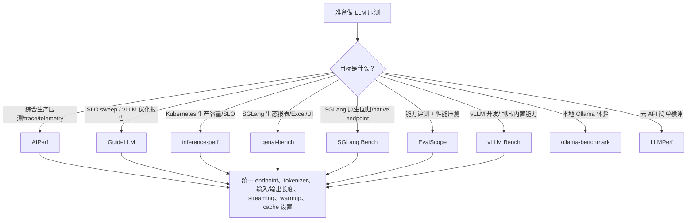

# LLM 压测工具深度对比

> **AIPerf、GuideLLM、inference-perf、genai-bench、SGLang Bench、LLMPerf、Ollama Benchmark、vLLM Bench 与 EvalScope 的定位、指标、负载模型和选型解析**
>
> 面向准备做 LLM 推理服务压测、容量评估、SLO 验证、KV cache 效果验证和多框架横向对比的工程团队。
>
> 稳定版本基线：AIPerf `v0.11.0`、GuideLLM `v0.7.1`、inference-perf `v0.6.0`、genai-bench `v0.0.5`、SGLang `v0.5.15.post1`、LLMPerf `v2.0`、ollama-benchmark `v0.5.2`、vLLM `v0.25.1`、EvalScope `v1.9.0`；审校日期：2026-07-20。

---

## 目录

- [自动生成目录占位](#自动生成目录占位)

---

## 第一章：LLM 压测为什么不同于普通 HTTP 压测

普通 HTTP 压测通常关注 QPS、平均延迟、P99 延迟和错误率。LLM serving 的压力模型更复杂，因为一次请求内部包含两个性质完全不同的阶段：

| 阶段 | 主要工作 | 典型瓶颈 | 用户感知指标 |
|------|----------|----------|--------------|
| Prefill | 处理输入 prompt，构建首轮 KV cache | 计算吞吐、attention、长上下文内存 | TTFT |
| Decode | 逐 token 生成输出 | 显存带宽、KV cache 容量、batch 调度 | ITL、TPOT、输出 tokens/s |

所以，LLM 压测不能只看“请求完成得快不快”。它至少要回答：

| 问题 | 为什么重要 |
|------|------------|
| 首 token 多快出现？ | 决定流式交互体验，受 prefill、排队和调度影响 |
| 后续 token 是否稳定？ | 决定用户阅读流畅度，受 decode batch 和 KV cache 影响 |
| 单用户速度和系统总吞吐是否同时达标？ | 高吞吐可能牺牲单用户体验 |
| open-loop 下是否积压？ | 真实流量不会等服务端处理完才发下一条请求 |
| 请求长度分布是否真实？ | 200 token 与 200K token 对系统是两种工作负载 |
| prefix cache / KV cache 是否改变结果？ | 缓存命中会显著改变 TTFT、吞吐和容量边界 |
| 输出长度是否可控？ | 不控制 `ignore_eos`、`min_tokens` 时，不同工具可能测到不同输出长度 |

因此，LLM 压测工具的核心差异不是“能不能发 HTTP 请求”，而是能否准确表达 LLM workload：token 分布、到达模型、多轮上下文、缓存复用、SLO、goodput、trace replay、多模态输入和服务端观测。

---

## 第二章：核心指标与口径

### 2.1 延迟指标

| 指标 | 含义 | 常见口径 |
|------|------|----------|
| TTFT / Time To First Token | 从请求发出到收到第一个输出 token 或第一个有效 chunk | 衡量 prefill + 排队 + 首 token 生成 |
| TTST / Time To Second Token | 第一个 token 到第二个 token 的间隔 | 用于区分首 token 之后的启动抖动 |
| ITL / Inter Token Latency | 相邻输出 token 之间的时间间隔 | 衡量流式输出平稳性 |
| TPOT / Time Per Output Token | 每个输出 token 平均耗时，通常不含首 token | 常用于估算 decode 速度 |
| E2E Latency / Request Latency | 请求开始到完整响应结束 | 非流式或整体 SLA 关注 |
| TTFB / Time To First Byte | 首个 response byte 时间 | 音频、图片或无法按 token 切分时常用 |

要注意：不同工具对 TPOT/ITL 的细节可能不同。有的按 chunk 统计，有的按 token 统计；有的把第一个 token 排除，有的包含首 token。横向比较时要先固定工具口径，不能直接把两个工具默认表格的 `TPOT` 当成完全相同。

### 2.2 吞吐指标

| 指标 | 含义 | 使用方式 |
|------|------|----------|
| RPS / request throughput | 每秒完成请求数 | 用于业务请求容量估算 |
| Output tokens/s | 全局每秒输出 token 数 | 主要衡量 decode 能力 |
| Input tokens/s | 全局每秒处理输入 token 数 | 主要衡量 prefill 能力 |
| Total tokens/s | 输入 + 输出 token 总吞吐 | 适合粗略比较整体处理量 |
| tokens/s/user | 单用户输出速度 | 用户体验侧指标 |
| Goodput | 满足 SLO 的请求或 token 吞吐 | 生产容量评估更有意义 |

Raw throughput 只说明系统做了多少工作，goodput 才说明有多少工作在 SLA 内完成。例如系统在 200 RPS 下仍能完成所有请求，但 P99 TTFT 已经超过 10 秒，这个 RPS 对交互式业务没有意义。

### 2.3 统计口径

LLM 压测至少应报告：

| 统计项 | 作用 |
|--------|------|
| mean / avg | 快速观察总体水平，但容易被长尾掩盖 |
| p50 | 典型用户体验 |
| p90 / p95 | 常规尾延迟 |
| p99 / p999 | 生产 SLO 和容量边界 |
| min / max | 发现异常点和冷启动 |
| stddev | 衡量稳定性 |
| success / failed / incomplete | 判断结果是否可信 |

只报告平均延迟的压测结果基本不够用。LLM serving 的尾延迟通常由长 prompt、batch 调度、KV cache miss、模型加载、网络抖动或服务端排队造成，平均值会掩盖这些问题。

---

## 第三章：负载模型

### 3.1 closed-loop 与 open-loop

| 模型 | 行为 | 适合场景 | 风险 |
|------|------|----------|------|
| Closed-loop | 每个 client 等上一个请求完成后再发下一个 | 固定并发、用户会话模型、单用户体验 | 系统变慢时实际 RPS 会下降，可能掩盖排队崩溃 |
| Open-loop | 按目标速率发请求，不等待旧请求完成 | 真实流量、容量规划、SLO/goodput | 需要控制最大在飞请求，否则可能压垮服务 |

固定并发不是固定 QPS。一个 100 并发 closed-loop 测试，如果服务延迟从 1 秒变成 10 秒，实际 RPS 会从 100 降到 10。open-loop 才能回答“每秒固定来 100 个请求时系统会怎样”。

### 3.2 到达分布

| 到达模型 | 含义 | 适合场景 |
|----------|------|----------|
| 同步 / synchronous | 一个请求跑完再跑下一个 | 功能 smoke test、单请求 latency |
| 固定并发 / concurrent | 保持 N 个请求在飞 | 并发能力和延迟曲线 |
| 固定速率 / constant rate | 每秒固定发 R 个请求 | 稳态容量测试 |
| Poisson | 请求间隔服从指数分布 | 更贴近随机到达的线上流量 |
| sweep | 扫描并发或速率直到饱和 | 找安全工作点和容量边界 |
| trace replay | 按真实 trace 重放 | 复现生产流量、agentic workload |

### 3.3 压测前必须对齐的参数

| 类别 | 必须对齐 |
|------|----------|
| API | `/v1/chat/completions`、`/v1/completions`、`/v1/responses`、embedding/rerank endpoint |
| Streaming | 是否开启 SSE streaming；不开启通常无法测准 TTFT/ITL |
| Tokenizer | 同一 tokenizer 路径或同一模型 ID |
| 输入长度 | 固定长度、分布、数据集、prefix 长度 |
| 输出长度 | `max_tokens`、`min_tokens`、`ignore_eos` |
| Sampling | `temperature`、`top_p`、`top_k`、`seed` |
| 缓存 | prefix cache、prompt cache、KV offload 是否开启 |
| warmup | 预热请求是否计入正式指标 |
| 客户端资源 | 压测机 CPU、连接数、端口、网络是否足够 |

很多“工具 A 比工具 B 测出来快”的差异，其实来自默认参数不同：一个用了 `/v1/completions`，另一个用了 chat template；一个开启 streaming，另一个非流式；一个让模型遇 EOS 停止，另一个强制输出固定 token。

---

## 第四章：工具总览矩阵

| 工具 | 核心定位 | 最适合场景 | 不适合场景 |
|------|----------|------------|------------|
| AIPerf | 综合生产级 GenAI 压测平台 | 复杂 workload、trace replay、多模态、telemetry、SLO/goodput、插件扩展 | 只想快速测单个 vLLM 参数时略重 |
| GuideLLM | SLO-aware LLM benchmarking 平台 | vLLM/OpenAI-compatible 服务优化、sweep、安全工作点、标准 JSON/CSV/HTML 报告 | Kubernetes 原生部署和 WG Serving 标准化不是重点 |
| inference-perf | Kubernetes SIG/WG Serving 背景的生产压测工具 | K8s 集群、vLLM/SGLang/TGI、公平横评、10k+ QPS、goodput、OTel/trace replay | 只做本地单机小模型体验测试时偏重 |
| genai-bench | SGLang 生态友好的 token-level benchmark | SGLang/OpenAI-compatible、多任务、Live UI、Excel/plot 报告 | 复杂 trace replay 和 K8s 标准化能力不如前几类 |
| SGLang Bench | SGLang 仓库原生 `bench_serving` 在线压测脚本 | SGLang 服务回归、后端对比、Mooncake trace、PD disaggregation fake prefill、cache/profile 调试 | 跨团队报表治理和 K8s goodput 平台 |
| LLMPerf | Ray 生态早期 LLM API benchmark | 多云 API 简单横评、load test + correctness smoke test | 现代 SLO、trace、多模态和可视化能力有限 |
| ollama-benchmark | 本地 Ollama 吞吐测试 | 个人机器、本地模型 tokens/s 快速体验 | 生产 LLM serving、K8s、OpenAI-compatible 压测 |
| vLLM Bench | vLLM 内置 benchmark 工具集 | vLLM 开发、回归、serve/latency/throughput/prefix cache/multi-turn 专项 | 跨框架生产压测平台 |
| EvalScope | ModelScope 一站式评测 + 压测 + 可视化 | 中文生态、模型能力评测与性能压测结合、vLLM Bench 对齐、多轮/多模态/API 压测 | 只需要极简本地吞吐测试时偏重 |

### 4.1 能力对比

| 维度 | AIPerf | GuideLLM | inference-perf | genai-bench | SGLang Bench | LLMPerf | Ollama Bench | vLLM Bench | EvalScope |
|------|--------|----------|----------------|-------------|--------------|---------|--------------|------------|-----------|
| OpenAI-compatible | 支持 | 支持 | 支持 | 支持 | 支持 | 支持 | 不主打 | 支持 | 支持 |
| vLLM 专项 | 可测 | 强 | 已验证 | 可测 | 可测后端 | 可测 API | 不适用 | 最强 | 强 |
| SGLang 专项 | 有教程/endpoint | 可测 | 已验证 | 强 | 原生最强 | 可测 API | 不适用 | 不主打 | 可测 |
| K8s 生产压测 | 可用 | 非重点 | 强 | 非重点 | 非重点 | 非重点 | 不适用 | 非重点 | 可用 |
| fixed concurrency | 支持 | 支持 | 支持 | 支持 | 支持 | 支持 | 极简 | 支持 | 支持 |
| request rate | 支持 | 支持 | 支持 | 较弱 | 支持 | 不主打 | 不适用 | 支持 | 支持 |
| Poisson | 支持 | 支持 | 支持 | 不主打 | 支持 | 不主打 | 不适用 | 支持 | 支持 |
| sweep | 支持 | 强 | 支持 | 支持 | 需脚本封装 | 不主打 | 不适用 | 部分支持 | 支持 |
| trace replay | 强 | 发展中 | 强 | 弱 | Mooncake/agentic | 弱 | 无 | 部分脚本 | 支持 agentic/multi-turn |
| goodput/SLO | 支持 | 强 | 强 | 基础 | 弱 | 弱 | 无 | 弱 | SLA auto tune |
| 多模态 | 强 | 强 | 支持 | 支持 | 支持 image/MMMU | 弱 | 弱 | 部分 | 强 |
| 可视化 | dashboard/plot/telemetry | HTML/CSV/JSON | analysis/png | Live UI/Excel/plot | console/JSONL/term plot | JSON | console/json | console/png | WebUI/W&B/SwanLab/ClearML |

### 4.2 简化选型图



---

## 第五章：AIPerf

### 5.1 定位

AIPerf 是 ai-dynamo 生态中的综合 GenAI benchmark 工具。它不是简单脚本，而是一个面向生产压测的框架：支持多进程架构、ZMQ 服务间通信、实时 dashboard、headless 模式、插件系统、trace replay、多模态数据集、server metrics、GPU telemetry、MLflow/OpenTelemetry/W&B 等集成。

一句话概括：

> **AIPerf 适合把 LLM 压测当作生产工程来做，而不是只跑一次 CLI 看平均延迟。**

### 5.2 能力

| 能力 | 说明 |
|------|------|
| Benchmark mode | concurrency、request-rate、request-rate + max concurrency、trace replay |
| 到达分布 | constant、Poisson、gamma、fixed schedule、ramping |
| 数据集 | ShareGPT、AIMO、MMStar、MMVU、VisionArena、LLaVA-OneVision、SPEED-Bench、SpecBench、自定义、inline、raw payload |
| 多模态 | text、vision、audio、image generation、video generation |
| 指标 | TTFT、TTST、TTFO、ITL、ICL、request latency、tokens/s、goodput、HTTP trace、GPU energy |
| 可观测 | DCGM GPU telemetry、Prometheus server metrics、OTel、MLflow、W&B |
| 扩展 | endpoint、dataset、transport、metric 等插件类别 |

### 5.3 典型命令

```bash
aiperf profile \
  --model "Qwen/Qwen3-0.6B" \
  --streaming \
  --endpoint-type chat \
  --tokenizer Qwen/Qwen3-0.6B \
  --url http://localhost:8000 \
  --concurrency 16 \
  --request-count 200
```

### 5.4 适用场景

| 场景 | 价值 |
|------|------|
| 生产压测基线 | 输出完整 JSON/CSV/log，可追踪历史 |
| KV cache 测试 | user-centric timing、prefix synthesis、多轮/agentic trace 有帮助 |
| 复杂数据源 | raw payload replay、生产 trace、SageMaker capture |
| 多模态压测 | 图像、视频、音频端点都可覆盖 |
| 观测闭环 | 可以把 client 侧指标与 GPU/server metrics 对齐 |

### 5.5 限制

| 限制 | 说明 |
|------|------|
| 学习成本较高 | 配置项、插件和数据模式很多 |
| 结果解释需要规范 | metric 很全，但团队需要先统一口径 |
| 客户端资源要充足 | 高并发/高请求率下压测机自身可能成为瓶颈 |

---

## 第六章：GuideLLM

### 6.1 定位

GuideLLM 是 vLLM 项目下的 SLO-aware benchmarking and evaluation platform。它重点不是 Kubernetes 部署，而是让团队围绕 SLO、traffic profile、dataset 和报告来优化 LLM inference。

一句话概括：

> **GuideLLM 适合系统化扫描 LLM 服务的安全工作点，并生成可比较的 JSON/CSV/HTML 报告。**

### 6.2 能力

| 能力 | 说明 |
|------|------|
| backend | OpenAI-compatible HTTP、vLLM Python backend |
| profile | synchronous、concurrent、throughput、constant、Poisson、sweep |
| 数据 | HuggingFace、json/csv/text file、synthetic text、synthetic image/video |
| 指标 | request status、TTFT、ITL、TPOT、request latency、output/total tokens/s、全套 percentiles |
| 输出 | console、`benchmarks.json`、`benchmarks.csv`、`benchmarks.html` |
| 配置 | CLI、JSON/YAML 风格 registry 参数、scenario/config |

### 6.3 典型命令

```bash
guidellm run \
  --backend kind=openai_http,target=http://localhost:8000,request_format=/v1/chat/completions \
  --profile kind=sweep \
  --constraint kind=max_duration,seconds=60 \
  --data kind=synthetic_text,prompt_tokens=1024,output_tokens=256
```

固定速率示例：

```bash
guidellm run \
  --backend kind=openai_http,target=http://localhost:8000 \
  --profile kind=constant,rate=10 \
  --constraint kind=max_duration,seconds=120 \
  --data kind=synthetic_text,prompt_tokens=512,output_tokens=128
```

### 6.4 适用场景

| 场景 | 价值 |
|------|------|
| vLLM/OpenAI-compatible 服务优化 | backend 配置简单，报告标准化 |
| SLO 容量扫描 | `sweep` profile 适合找最大安全速率 |
| CI/回归报告 | JSON/CSV/HTML 方便沉淀 |
| 受控数据实验 | synthetic + HuggingFace/file 数据都可用 |

### 6.5 限制

| 限制 | 说明 |
|------|------|
| K8s 原生能力不是重点 | 不像 inference-perf 那样面向 WG Serving/K8s 标准化 |
| 非 OpenAI/vLLM 后端需扩展 | 当前核心路径围绕 OpenAI-compatible 和 vLLM Python |

---

## 第七章：inference-perf

### 7.1 定位

inference-perf 来自 Kubernetes SIG 生态，目标是做生产规模 GenAI inference performance benchmark，并推动 Kubernetes/model server 社区的指标和工具标准化。

一句话概括：

> **inference-perf 是更偏 Kubernetes 生产容量、goodput 和标准化横评的压测工具。**

### 7.2 能力

| 能力 | 说明 |
|------|------|
| server | vLLM、SGLang、TGI 已验证，任意 OpenAI-compatible 可扩展 |
| load | constant、Poisson、concurrent、multi-stage、sweep |
| 架构 | 多进程 + 多线程，目标是 10k+ QPS loadgen |
| goodput | 支持 TTFT、TPOT、ITL、NTPOT、request latency 约束 |
| trace | Azure trace、OpenTelemetry trace、Weka agent trace、conversation replay |
| K8s | 提供 deploy guide 和 container image |
| 分析 | QPS vs latency/throughput/goodput 图表 |

### 7.3 典型命令

```bash
inference-perf \
  --server.type vllm \
  --server.base_url http://localhost:8000 \
  --data.type random \
  --load.type constant \
  --load.stages '[{"rate": 10, "duration": 60}]' \
  --api.streaming true
```

YAML 中 goodput 约束示例：

```yaml
report:
  goodput:
    constraints:
      ttft: 0.2
      tpot: 0.02
```

### 7.4 适用场景

| 场景 | 价值 |
|------|------|
| K8s 集群容量评估 | 工具背景和部署路径都贴近 Kubernetes |
| 多框架公平横评 | server-agnostic，围绕 OpenAI-compatible 指标 |
| 真实流量重放 | OTel/Weka/conversation replay 是强项 |
| SLA 容量报告 | goodput 直接回答“满足 SLO 的吞吐是多少” |

### 7.5 限制

| 限制 | 说明 |
|------|------|
| 配置复杂度中高 | YAML、load stage、worker 参数需要理解 |
| 小规模本地测试偏重 | 如果只是本机跑一个 Ollama 模型，没必要用它 |

---

## 第八章：genai-bench

### 8.1 定位

genai-bench 是 SGLang 项目生态的 benchmark 工具，强调 token-level 指标、易用 CLI、Live UI dashboard、Excel 报告和 plot。本文固定到 `v0.0.5@4f873e03719c947a101647c6646954d5ebc3d35b`。

一句话概括：

> **genai-bench 适合 SGLang/OpenAI-compatible 服务的可视化压测和报表交付。**

### 8.2 能力

| 能力 | 说明 |
|------|------|
| API backend | OpenAI-compatible、SGLang、部分 hosted cloud backend |
| task | text-to-text、text-to-image、text-to-embeddings、text-to-rerank、text-to-speech、image-text-to-text、image-to-embeddings |
| traffic scenario | `D(input,output)`、`N(mean,std)/(mean,std)`、`U(min,max)/(min,max)`、`E(tokens)`、`R(doc,query)`、`A(chars)`、`I(width,height[,images])`，或有 dataset 时省略 scenario |
| prefix cache | `--prefix-len`、`--prefix-ratio`，用于共享前缀压测 |
| 指标 | TTFT、E2E latency、TPOT、output latency、input/output throughput、error rate；TTS 将首响应解释为 TTFB，并报告 Audio Throughput |
| 输出 | Live UI、rich logs、Excel、plot |

`v0.0.5` 相对 `v0.0.4` 新增 OpenAI/OCI OpenAI 的 text-to-speech 路径与 `A(num_input_chars)` 场景，并改进 vLLM Harmony、gpt-oss/SMG reasoning token 的流式解析；同时修复 Matplotlib 3.9+ 已移除 API 的兼容问题。原有 text-to-text 命令和 D/N/U/E/R/I 场景没有被替换。

### 8.3 典型命令

```bash
genai-bench benchmark \
  --api-backend openai \
  --api-base http://localhost:8000 \
  --api-model-name Qwen/Qwen3-0.6B \
  --model-tokenizer Qwen/Qwen3-0.6B \
  --task text-to-text \
  --traffic-scenario "D(1024,256)" \
  --num-concurrency 16 \
  --max-time-per-run 120
```

prefix cache 示例：

```bash
genai-bench benchmark \
  --task text-to-text \
  --traffic-scenario "D(2000,200)" \
  --prefix-len 1500 \
  --num-concurrency 10 \
  --api-backend sglang \
  --api-base http://localhost:8000 \
  --api-model-name meta-llama/Meta-Llama-3-8B-Instruct \
  --model-tokenizer meta-llama/Meta-Llama-3-8B-Instruct
```

TTS 使用字符数而不是 token 数塑造输入；官方 OpenAI backend 示例的默认 voice 是 `alloy`，其他 voice 通过 `--additional-request-params` 传入：

```bash
genai-bench benchmark \
  --api-backend openai \
  --api-base https://api.openai.com \
  --api-key "$OPENAI_API_KEY" \
  --api-model-name tts-1 \
  --model-tokenizer gpt2 \
  --task text-to-speech \
  --traffic-scenario "A(500)" \
  --num-concurrency 1 \
  --max-requests-per-run 10 \
  --additional-request-params '{"voice":"nova"}'
```

### 8.4 适用场景

| 场景 | 价值 |
|------|------|
| SGLang 服务压测 | 生态匹配，命令直观 |
| 报表交付 | Excel 和 plot 适合业务评审 |
| prefix cache 对比 | scenario + prefix 参数直观 |
| 多任务压测 | embedding、rerank、VLM、image generation、TTS 等任务可统一入口 |

### 8.5 限制

| 限制 | 说明 |
|------|------|
| 生产 trace 能力不如 AIPerf/inference-perf | 更偏 synthetic/file/scenario |
| K8s 原生部署不是重点 | 需要自己嵌入 Kubernetes job/CI |

---

## 第九章：SGLang Bench

### 9.1 定位

SGLang Bench 指 SGLang 仓库内置的 online serving benchmark，官方入口是 `python -m sglang.bench_serving`。在 v0.5.15.post1 中，`sglang.bench_serving` 仍可用，但源码已提示实现迁移到 `sglang.benchmark.serving`，新自动化脚本建议优先使用：

```bash
python3 -m sglang.benchmark.serving
```

一句话概括：

> **SGLang Bench 适合做 SGLang 服务开发、版本回归、后端 endpoint 对比、缓存/Profiler 调试和 PD disaggregation 专项压测。**

它和 genai-bench 都来自 SGLang 生态，但侧重点不同：genai-bench 更偏“可视化报告和业务交付”，SGLang Bench 更偏“服务端开发者直接测 serving 行为”。

### 9.2 支持的后端与 endpoint

| backend | endpoint | 典型用途 |
|---------|----------|----------|
| `sglang` / `sglang-native` | `POST /generate` | SGLang native serving 压测，最直接 |
| `sglang-oai` | `POST /v1/completions` | SGLang OpenAI-compatible completions |
| `sglang-oai-chat` | `POST /v1/chat/completions` | SGLang OpenAI-compatible chat |
| `sglang-embedding` | `POST /v1/embeddings` | embedding 服务压测 |
| `vllm` / `vllm-chat` | `POST /v1/completions` 或 `/v1/chat/completions` | 用同一脚本测 vLLM endpoint |
| `lmdeploy` / `lmdeploy-chat` | `POST /v1/completions` 或 `/v1/chat/completions` | LMDeploy endpoint 对比 |
| `trt` | `POST /v2/models/ensemble/generate_stream` | TensorRT-LLM streaming endpoint |
| `truss` | `POST /v1/models/model:predict` | Truss endpoint |
| `gserver` | custom | 脚本中保留接口，但当前未实现 |

连接目标有两种写法：

| 参数 | 用法 |
|------|------|
| `--host` + `--port` | 用默认 backend endpoint path 拼 URL，例如 SGLang native 的 `http://host:port/generate` |
| `--base-url` | 直接指定服务 base URL，例如 `http://127.0.0.1:8000`，脚本再按 backend 补 endpoint path |

`--model` 未指定时，OpenAI-compatible endpoint 会尝试查询 `GET /v1/models` 获取模型 ID。生产压测建议显式写 `--model` 和 `--tokenizer`，避免服务端别名、tokenizer 和报告口径不一致。

### 9.3 数据集与负载模型

| dataset | 说明 | 关键参数 |
|---------|------|----------|
| `sharegpt` | 默认数据集，加载 ShareGPT 风格问答对 | `--dataset-path`、`--sharegpt-context-len`、`--sharegpt-output-len` |
| `random` | 随机文本长度，适合固定 ISL/OSL 基准 | `--random-input-len`、`--random-output-len`、`--random-range-ratio` |
| `random-ids` | 随机 token id，长度控制更直接但文本可能无意义 | 同 `random` |
| `generated-shared-prefix` | 合成长共享 system prompt + 短问题，用于 prefix/KV cache 压测 | `--gsp-num-groups`、`--gsp-prompts-per-group`、`--gsp-system-prompt-len`、`--gsp-question-len`、`--gsp-output-len` |
| `image` | 构造 VLM 图像请求 | `--image-count`、`--image-resolution`、`--image-format`、`--image-content` |
| `mmmu` | MMMU Math split，多模态评测式请求 | 依赖 `datasets`、`pillow`、`pybase64` |
| `mooncake` | 用 Mooncake trace 评估大规模 KVCache 共享 | `--mooncake-workload`、`--mooncake-slowdown-factor`、`--mooncake-num-rounds`、`--use-trace-timestamps` |
| `agentic-trace` | agentic multi-turn trace | `--dataset-offset`、`--agentic-max-turns` |
| `custom` / `openai` / `autobench` / `longbench_v2` / `speed-bench` | 面向自定义、OpenAI 格式和长上下文/速度专项 | 按数据集格式和对应参数配置 |

SGLang Bench 的 `--request-rate` 是 open-loop 入口：默认 `inf` 表示起始时尽快发出所有请求；设成有限值时，请求间隔按 Poisson 过程采样。`--max-concurrency` 是最大在飞请求上限；当 `--request-rate` 与 `--max-concurrency` 同时使用时，如果服务端处理不过来，实际发送速率会被并发上限压低。

### 9.4 关键运行参数

| 参数 | 作用 |
|------|------|
| `--num-prompts` | 请求总数 |
| `--request-rate` | 目标请求到达率；有限值使用 Poisson 到达 |
| `--max-concurrency` | 最大并发在飞请求数 |
| `--disable-stream` | 切换为非流式；非流式下 TTFT 口径会退化 |
| `--warmup-requests` | 正式压测前预热请求数，默认 1 |
| `--disable-ignore-eos` | 关闭 ignore EOS；默认更偏固定输出长度压测 |
| `--temperature` / `--top-p` / `--seed` | sampling 与随机种子 |
| `--extra-request-body` | 向请求体合并额外 JSON，例如 sampling、min_tokens、top_k |
| `--apply-chat-template` | 构造 chat 请求或计数时应用 tokenizer chat template |
| `--output-file` / `--output-details` | 输出 JSONL 汇总；开启 details 会写入逐请求长度、错误、TTFT、ITL、生成文本等数组 |
| `--flush-cache` | 正式压测前调用 SGLang `/flush_cache` |
| `--cache-report` | 压测后收集并展示 SGLang cache 命中统计 |
| `--profile` | 调用 `/start_profile` 和 `/stop_profile`，服务端需启用 profiler |
| `--profile-prefill-url` / `--profile-decode-url` | PD 分离部署下分别 profile prefill 或 decode worker |
| `--lora-name` | 多 LoRA adapter 请求分布测试 |
| `--tokenize-prompt` | 发送 token id 而不是文本，目前只支持 `--backend sglang` |
| `--fake-prefill` | PD disaggregation decode-only 压测，需 decode server 使用 fake transfer backend |

### 9.5 指标与输出

SGLang Bench 控制台会输出：

| 指标 | 含义 |
|------|------|
| Request throughput | 完成请求数 / wall time |
| Input token throughput | 输入 token/s，包含 text 与 vision token |
| Output token throughput | 输出 token/s |
| Total token throughput | 输入 + 输出 token/s |
| Total input text tokens / vision tokens | 文本与视觉输入 token 拆分 |
| Concurrency | 所有请求耗时之和 / wall time，可看平均在飞请求强度 |
| E2E latency | 请求端到端延迟，包含 mean/median/std/p90/p95/p99 |
| TTFT | 流式首 token 延迟，包含 mean/median/std/p90/p95/p99 |
| ITL | 相邻输出 token 间隔，包含 mean/median/std/p90/p95/p99/max |
| TPOT | 首 token 后每个输出 token 平均耗时，`(latency - ttft)/(tokens - 1)` |
| Accept length | SGLang speculative decoding 可用时报告接受长度 |
| Retokenized counts | 用指定 tokenizer 重新计数生成文本，辅助发现服务端 usage 口径差异 |

如果指定 `--output-file`，每次 run 会追加一个 JSON 对象；开启 `--output-details` 后还会包含 `input_lens`、`output_lens`、`ttfts`、逐请求 `itls`、`generated_texts` 和 `errors`。它适合接入 CI 或自行汇总，但不像 GuideLLM/EvalScope 那样内置完整 HTML 报告和 SLO sweep。

### 9.6 典型命令

启动 SGLang native 服务：

```bash
python3 -m sglang.launch_server \
  --model-path meta-llama/Llama-3.1-8B-Instruct \
  --host 0.0.0.0 \
  --port 30000
```

固定输入/输出长度、固定最大并发：

```bash
python3 -m sglang.benchmark.serving \
  --backend sglang \
  --host 127.0.0.1 \
  --port 30000 \
  --model meta-llama/Llama-3.1-8B-Instruct \
  --tokenizer meta-llama/Llama-3.1-8B-Instruct \
  --dataset-name random \
  --random-input-len 1024 \
  --random-output-len 256 \
  --random-range-ratio 0.0 \
  --num-prompts 1000 \
  --max-concurrency 64 \
  --warmup-requests 5 \
  --output-file sglang_random.jsonl \
  --output-details
```

OpenAI-compatible chat endpoint，例如用同一脚本测 vLLM：

```bash
python3 -m sglang.benchmark.serving \
  --backend vllm-chat \
  --base-url http://127.0.0.1:8000 \
  --model Qwen2.5-0.5B-Instruct \
  --tokenizer Qwen/Qwen2.5-0.5B-Instruct \
  --dataset-name random \
  --random-input-len 1024 \
  --random-output-len 256 \
  --num-prompts 1000 \
  --max-concurrency 64 \
  --apply-chat-template
```

open-loop Poisson 到达：

```bash
python3 -m sglang.benchmark.serving \
  --backend sglang \
  --host 127.0.0.1 \
  --port 30000 \
  --model meta-llama/Llama-3.1-8B-Instruct \
  --dataset-name random \
  --random-input-len 1024 \
  --random-output-len 256 \
  --num-prompts 5000 \
  --request-rate 100 \
  --max-concurrency 512
```

共享前缀 / prefix cache 压测：

```bash
python3 -m sglang.benchmark.serving \
  --backend sglang \
  --host 127.0.0.1 \
  --port 30000 \
  --model meta-llama/Llama-3.1-8B-Instruct \
  --dataset-name generated-shared-prefix \
  --gsp-num-groups 64 \
  --gsp-prompts-per-group 16 \
  --gsp-system-prompt-len 2048 \
  --gsp-question-len 128 \
  --gsp-output-len 256 \
  --cache-report
```

Mooncake trace / KVCache sharing 压测：

```bash
python3 -m sglang.benchmark.serving \
  --backend sglang \
  --host 127.0.0.1 \
  --port 30000 \
  --model meta-llama/Llama-3.1-8B-Instruct \
  --dataset-name mooncake \
  --mooncake-workload conversation \
  --mooncake-slowdown-factor 1.0 \
  --mooncake-num-rounds 1000 \
  --use-trace-timestamps \
  --random-output-len 256
```

PD disaggregation decode-only fake prefill：

```bash
python3 -m sglang.launch_server \
  --model-path meta-llama/Llama-3.1-8B-Instruct \
  --disaggregation-mode decode \
  --disaggregation-transfer-backend fake \
  --port 30001

python3 -m sglang.benchmark.serving \
  --backend sglang \
  --host 127.0.0.1 \
  --port 30001 \
  --model meta-llama/Llama-3.1-8B-Instruct \
  --dataset-name random \
  --num-prompts 500 \
  --random-input-len 1024 \
  --random-output-len 256 \
  --fake-prefill
```

### 9.7 适用场景与限制

| 类型 | 说明 |
|------|------|
| 适合 | SGLang 版本回归、server 参数调优、native 与 OpenAI-compatible endpoint 对比、Mooncake/KV cache、PD 分离 decode-only、Profiler 调试 |
| 不适合 | 多团队标准报告、Kubernetes 原生容量平台、自动 SLO/goodput 搜索、复杂 dashboard 交付 |
| 横评风险 | 必须统一 endpoint、chat template、tokenizer、输出长度、streaming、warmup、cache 状态，否则容易把工具默认差异误判为 serving 性能差异 |
| 客户端瓶颈 | 高并发时压测机 CPU、文件描述符、端口、网络和 Python event loop 可能先到瓶颈；大规模压测要用更强客户端或分布式压测工具 |
| 兼容性 | 官方文档仍展示 `sglang.bench_serving`；当前源码提示新路径是 `sglang.benchmark.serving`，CI 脚本应关注版本变化 |

---

## 第十章：LLMPerf

### 10.1 定位

LLMPerf 是 Ray 项目下较早的 LLM API 性能评估工具。它提供 load test 和 correctness test，支持 OpenAI-compatible、Anthropic、TogetherAI、Hugging Face、LiteLLM、Vertex AI、SageMaker 等 API 路径。

一句话概括：

> **LLMPerf 适合简单云 API 横评和早期 smoke test，不适合作为现代生产压测主工具。**

### 10.2 能力

| 能力 | 说明 |
|------|------|
| load test | 并发请求，测 inter-token latency 和 generation throughput |
| correctness test | 随机数字文本转换，用于简单正确性检查 |
| 数据 | Shakespeare sonnets 行采样，按 mean/stddev 控制输入输出 token |
| backend | OpenAI、Anthropic、LiteLLM、Vertex AI、SageMaker 等 |
| tokenizer | README 描述使用 LlamaTokenizer 统一 token 计数 |

### 10.3 典型命令

```bash
python token_benchmark_ray.py \
  --model "meta-llama/Llama-2-7b-chat-hf" \
  --mean-input-tokens 550 \
  --stddev-input-tokens 150 \
  --mean-output-tokens 150 \
  --stddev-output-tokens 10 \
  --max-num-completed-requests 100 \
  --timeout 600 \
  --num-concurrent-requests 10 \
  --results-dir "result_outputs" \
  --llm-api openai \
  --additional-sampling-params '{}'
```

### 10.4 适用场景与限制

| 类型 | 说明 |
|------|------|
| 适合 | 多云 API 基础横评、快速 correctness smoke test |
| 不适合 | open-loop、SLO/goodput、复杂 trace、多模态、K8s 生产容量评估 |
| 风险 | README 自身也提示结果可能随时段、provider backend、外部负载变化，并不一定代表硬件能力 |

---

## 第十一章：ollama-benchmark

### 11.1 定位

ollama-benchmark 的包名是 `llm_benchmark`，面向本地 Ollama 模型吞吐测试。它会根据本机 RAM 选择或拉取一组 Ollama 模型，然后输出 tokens/s 等结果。

一句话概括：

> **ollama-benchmark 是本地 LLM 体验工具，不是生产推理服务压测工具。**

### 11.2 典型命令

```bash
llm_benchmark run
```

不上传系统信息：

```bash
llm_benchmark run --no-sendinfo
```

自定义模型列表：

```yaml
file_name: "custombenchmarkmodels.yml"
version: 2.0.custom
models:
  - model: "deepseek-r1:1.5b"
  - model: "qwen:0.5b"
```

```bash
llm_benchmark run --custombenchmark=path/to/custombenchmarkmodels.yml
```

### 11.3 适用场景与限制

| 类型 | 说明 |
|------|------|
| 适合 | 本机 CPU/GPU/NPU 跑 Ollama 模型时，快速看 tokens/s |
| 不适合 | vLLM/SGLang/KServe/Dynamo 生产服务压测 |
| 限制 | 没有复杂 traffic profile、SLO、trace replay、OpenAI-compatible 横评能力 |

---

## 第十二章：vLLM Bench

### 12.1 定位

vLLM 的 `benchmarks/` 目录是 vLLM 自带的性能测试工具集合。旧脚本已迁移到 vLLM CLI，官方 README 建议使用：

```bash
vllm bench serve
vllm bench latency
vllm bench throughput
```

一句话概括：

> **vLLM Bench 是 vLLM 自身开发和回归最直接的 benchmark 工具。**

### 12.2 工具类型

| 类型 | 说明 |
|------|------|
| `vllm bench serve` | 在线服务压测，面向 OpenAI-compatible server |
| `vllm bench latency` | 单请求/本地 latency 测量 |
| `vllm bench throughput` | 离线 batch throughput 测量 |
| prefix caching | `benchmark_prefix_caching.py` 等专项脚本 |
| multi-turn | `benchmarks/multi_turn/benchmark_serving_multi_turn.py`，用于 KV cache offloading / 多轮场景 |
| kernels | paged attention、MoE、FP8 GEMM、RMSNorm、ROPE 等 kernel 级 benchmark |
| structured output | structured schema / guided decoding benchmark |

### 12.3 典型命令

```bash
vllm bench serve \
  --backend openai-chat \
  --host 127.0.0.1 \
  --port 8000 \
  --endpoint /v1/chat/completions \
  --model Qwen/Qwen3-0.6B \
  --dataset-name random \
  --random-input-len 1024 \
  --random-output-len 256 \
  --num-prompts 1000 \
  --max-concurrency 64 \
  --ignore-eos
```

多轮示例来自 `benchmarks/multi_turn/`：

```bash
python benchmark_serving_multi_turn.py \
  --model /models/meta-llama/Meta-Llama-3.1-8B-Instruct \
  --served-model-name Llama \
  --input-file generate_multi_turn.json \
  --num-clients 2 \
  --max-active-conversations 6
```

### 12.4 适用场景与限制

| 类型 | 说明 |
|------|------|
| 适合 | vLLM 参数调优、版本回归、prefix cache、KV offload、多轮专项、kernel microbenchmark |
| 不适合 | 跨框架统一报表、K8s goodput 标准化、业务 trace 统一治理 |
| 关键优势 | 和 vLLM release/内部实现同步，定位 vLLM 性能回归最直接 |

---

## 第十三章：EvalScope

### 13.1 定位

EvalScope 是 ModelScope 社区的一站式大模型评测框架，覆盖模型能力评测、推理性能压测和可视化。它不仅能跑 MMLU、C-Eval、GSM8K、VLM/Agent/代码等能力评测，也有 `evalscope perf` 做服务压测。

一句话概括：

> **EvalScope 适合中文生态里把模型能力评测和推理压测放在同一套工具链里管理。**

### 13.2 `evalscope perf` 能力

| 能力 | 说明 |
|------|------|
| API | `openai`、`openai_responses`、`openai_embedding`、`openai_rerank`、`local`、`local_vllm`、自定义 API |
| 请求控制 | `--parallel`、`--number`、`--rate`、`--open-loop`、`--duration`、`--warmup-num` |
| SLA | `--sla-auto-tune`，可按并发或速率搜索满足 SLA 的边界 |
| 数据集 | random、OpenQA、LongAlpaca、line_by_line、custom、random_vl、embedding/rerank、多轮 ShareGPT/custom |
| 多轮 | `--multi-turn`，支持 random/share_gpt/custom/swe_smith 等 |
| 指标 | latency、TTFT、TPOT、ITL、RPS、output/total throughput、cache hit、speculative decode 指标 |
| 可视化 | WebUI、W&B、SwanLab、ClearML、HTML/报告文件 |

### 13.3 典型命令

```bash
evalscope perf \
  --parallel 1 10 50 100 \
  --number 10 100 500 1000 \
  --model Qwen2.5-0.5B-Instruct \
  --url http://127.0.0.1:8000/v1/chat/completions \
  --api openai \
  --dataset random \
  --max-tokens 256 \
  --min-tokens 256 \
  --min-prompt-length 1024 \
  --max-prompt-length 1024 \
  --tokenizer-path Qwen/Qwen2.5-0.5B-Instruct \
  --extra-args '{"ignore_eos": true}'
```

open-loop 示例：

```bash
evalscope perf \
  --open-loop \
  --rate 5 10 20 \
  --number 500 1000 2000 \
  --model Qwen2.5-0.5B-Instruct \
  --url http://127.0.0.1:8000/v1/chat/completions \
  --api openai \
  --dataset random \
  --max-tokens 256 \
  --min-prompt-length 1024 \
  --max-prompt-length 1024 \
  --tokenizer-path Qwen/Qwen2.5-0.5B-Instruct \
  --extra-args '{"ignore_eos": true}'
```

### 13.4 vLLM Bench 对齐

EvalScope 官方文档提供了 `evalscope perf` 与 `vllm bench serve` 的参数映射，关键是：

| vLLM Bench | EvalScope |
|------------|-----------|
| `--max-concurrency` | `--parallel` |
| `--num-prompts` | `--number` |
| `--backend openai-chat` + `--endpoint /v1/chat/completions` | `--api openai` + `--url http://host:port/v1/chat/completions` |
| `--dataset-name random --random-input-len N --random-output-len M` | `--dataset random --min-prompt-length N --max-prompt-length N --max-tokens M` |
| `--tokenizer` | `--tokenizer-path` |
| `--ignore-eos` | `--extra-args '{"ignore_eos": true}'` |

这使 EvalScope 很适合在中文团队中做“先用 vLLM Bench 建基线，再用 EvalScope 做多并发、多轮、可视化和能力评测联动”的流程。

### 13.5 限制

| 限制 | 说明 |
|------|------|
| 功能面很宽 | 需要区分 `eval` 能力评测与 `perf` 服务压测，不要混淆结果 |
| 依赖可选项多 | perf、service、多模态、Agent 等能力需要安装对应 extras |
| 横向压测仍需统一口径 | 与其他工具比较时仍要统一 endpoint、tokenizer、输出长度、cache 和 warmup |

---

## 第十四章：统一 vLLM endpoint 的可比压测模板

下面是一组可比性模板，用同一个 OpenAI-compatible chat endpoint 做固定输入/输出长度测试。实际运行前需替换模型名、tokenizer 和端口。

### 14.1 启动 vLLM 服务

```bash
vllm serve Qwen/Qwen2.5-0.5B-Instruct \
  --served-model-name Qwen2.5-0.5B-Instruct \
  --host 0.0.0.0 \
  --port 8000 \
  --trust-remote-code
```

统一约束：

| 参数 | 建议 |
|------|------|
| endpoint | `/v1/chat/completions` |
| prompt tokens | 1024 |
| output tokens | 256 |
| streaming | 开启 |
| output control | 使用 `ignore_eos` 或 `min_tokens` 让输出长度稳定 |
| tokenizer | `Qwen/Qwen2.5-0.5B-Instruct` |
| warmup | 每轮正式压测前先跑少量请求 |

### 14.2 vLLM Bench

```bash
vllm bench serve \
  --backend openai-chat \
  --host 127.0.0.1 \
  --port 8000 \
  --endpoint /v1/chat/completions \
  --model Qwen2.5-0.5B-Instruct \
  --dataset-name random \
  --random-input-len 1024 \
  --random-output-len 256 \
  --tokenizer Qwen/Qwen2.5-0.5B-Instruct \
  --num-prompts 1000 \
  --max-concurrency 64 \
  --ignore-eos
```

### 14.3 EvalScope

```bash
evalscope perf \
  --parallel 64 \
  --number 1000 \
  --model Qwen2.5-0.5B-Instruct \
  --url http://127.0.0.1:8000/v1/chat/completions \
  --api openai \
  --dataset random \
  --max-tokens 256 \
  --min-tokens 256 \
  --min-prompt-length 1024 \
  --max-prompt-length 1024 \
  --tokenizer-path Qwen/Qwen2.5-0.5B-Instruct \
  --extra-args '{"ignore_eos": true}'
```

### 14.4 GuideLLM

```bash
guidellm run \
  --backend '{"kind":"openai_http","target":"http://127.0.0.1:8000","model":"Qwen2.5-0.5B-Instruct","request_format":"/v1/chat/completions","stream":true,"extras":{"body":{"ignore_eos":true,"min_tokens":256}}}' \
  --profile kind=concurrent,streams=64 \
  --constraint kind=max_requests,count=1000 \
  --data kind=synthetic_text,prompt_tokens=1024,output_tokens=256 \
  --tokenizer kind=huggingface_auto,model=Qwen/Qwen2.5-0.5B-Instruct
```

### 14.5 inference-perf

```bash
inference-perf \
  --server.type vllm \
  --server.base_url http://127.0.0.1:8000 \
  --data.type random \
  --load.type concurrent \
  --load.stages '[{"num_requests": 1000, "concurrency_level": 64}]' \
  --api.streaming true
```

如果要测 open-loop 容量，把 `load.type` 改为 `constant` 或 `poisson`，用 `rate` 和 `duration` 定义 stage。

### 14.6 AIPerf

```bash
aiperf profile \
  --model Qwen2.5-0.5B-Instruct \
  --streaming \
  --endpoint-type chat \
  --tokenizer Qwen/Qwen2.5-0.5B-Instruct \
  --url http://127.0.0.1:8000 \
  --concurrency 64 \
  --request-count 1000
```

需要严格固定输入/输出长度时，建议使用 AIPerf YAML config 或 synthetic dataset 配置，把 ISL/OSL、`ignore_eos`、warmup 和随机种子写入配置文件，而不是只靠 CLI 默认值。

### 14.7 genai-bench

```bash
genai-bench benchmark \
  --api-backend openai \
  --api-base http://127.0.0.1:8000 \
  --api-model-name Qwen2.5-0.5B-Instruct \
  --model-tokenizer Qwen/Qwen2.5-0.5B-Instruct \
  --task text-to-text \
  --traffic-scenario "D(1024,256)" \
  --num-concurrency 64 \
  --max-requests-per-run 1000
```

### 14.8 SGLang Bench

```bash
python3 -m sglang.benchmark.serving \
  --backend vllm-chat \
  --base-url http://127.0.0.1:8000 \
  --model Qwen2.5-0.5B-Instruct \
  --tokenizer Qwen/Qwen2.5-0.5B-Instruct \
  --dataset-name random \
  --random-input-len 1024 \
  --random-output-len 256 \
  --random-range-ratio 0.0 \
  --num-prompts 1000 \
  --max-concurrency 64 \
  --warmup-requests 5 \
  --apply-chat-template \
  --output-file sglang_bench_vllm_chat.jsonl
```

如果测 SGLang native `/generate`，把 `--backend vllm-chat --base-url http://127.0.0.1:8000` 改为 `--backend sglang --host 127.0.0.1 --port 30000`。为了和 vLLM Bench 保持可比，必须确认 tokenizer、chat template、streaming、输出长度控制和 cache 状态一致。

---

## 第十五章：生产选型建议

### 15.1 按目标选工具

| 目标 | 推荐工具 | 原因 |
|------|----------|------|
| vLLM 版本或参数回归 | vLLM Bench | 和 vLLM 内部同步，最直接 |
| SGLang 版本或 server 参数回归 | SGLang Bench | 和 SGLang serving 代码同仓，native endpoint、cache、profile、PD fake-prefill 支持最直接 |
| vLLM/SGLang/KServe 生产容量 | inference-perf 或 AIPerf | 支持生产级 load、goodput、trace、报告 |
| 找满足 SLO 的最大安全工作点 | GuideLLM、inference-perf、EvalScope SLA auto tune | sweep/goodput/SLO 更直接 |
| 评估 prefix/KV cache 效果 | SGLang Bench、genai-bench、vLLM multi-turn、AIPerf、EvalScope multi-turn | 都能表达共享前缀或多轮；SGLang Bench 还可结合 cache report、Mooncake trace |
| 需要中文模型能力评测 + 压测 | EvalScope | 评测基准和 perf 在同一工具链 |
| SGLang 服务压测和报表 | genai-bench | 生态贴合，Excel/plot 方便；若重点是服务端回归，用 SGLang Bench |
| 本地 Ollama 模型速度 | ollama-benchmark | 简单直接 |
| 多云 API 粗略横评 | LLMPerf | provider 路径多，但现代能力有限 |

### 15.2 建议的压测流程

1. 单请求 smoke test：确认 endpoint、model name、streaming、tokenizer、输出长度都正确。
2. 低并发 warmup：排除模型加载、JIT 编译、cache 初始化。
3. fixed concurrency 扫描：看并发升高时 TTFT、ITL、TPOT、P99 如何变化。
4. open-loop rate 扫描：找固定到达率下的排队边界。
5. goodput/SLO 判定：不要只看最大吞吐，要看满足 TTFT/TPOT/P99 的吞吐。
6. 真实 workload 回放：用 ShareGPT、业务 trace、agentic multi-turn 或 prefix cache 数据验证。
7. 服务端指标对齐：同时采集 GPU 利用率、显存、KV cache hit、batch size、queue time。

### 15.3 报告模板

正式报告至少包含：

| 项目 | 内容 |
|------|------|
| 服务端版本 | vLLM/SGLang/TGI/Dynamo/KServe release、镜像、启动参数 |
| 模型 | 权重、量化、TP/PP/EP、max model len |
| 客户端 | 压测工具版本、机器规格、网络位置 |
| workload | 数据集、token 分布、streaming、sampling、warmup |
| load | closed/open loop、并发、速率、阶段、持续时间 |
| 指标 | TTFT、ITL、TPOT、latency、RPS、tokens/s、goodput、error rate |
| 缓存 | prefix cache/KV cache/offload 是否开启，命中率如何 |
| 结论 | 推荐工作点、SLO 边界、瓶颈判断、下一步优化 |

---

## 第十六章：常见误区

| 误区 | 正确做法 |
|------|----------|
| 用 QPS 代替 tokens/s | LLM 请求长度差异巨大，必须同时看 input/output tokens/s |
| 只看平均延迟 | 必须看 P90/P99/P999 和错误/超时 |
| 不固定输出长度 | 使用 `ignore_eos`、`min_tokens` 或数据集控制 OSL |
| 不开 streaming 还测 TTFT | TTFT 依赖流式 chunk，非流式只能测整体响应 |
| 混用 chat/completions 端点 | chat template 会改变输入 token，必须统一 |
| 忽略 tokenizer 差异 | 不同 tokenizer 计数不同，ISL/OSL 不可比 |
| closed-loop 结果当真实到达流量 | 真实容量要用 open-loop rate/goodput 验证 |
| 压测机太弱 | 客户端 CPU、连接数、网络会先成为瓶颈 |
| 不记录服务端参数 | 没有服务端版本和启动参数，结果不可复现 |
| 把工具默认结果直接横比 | 必须统一 endpoint、workload、sampling、cache、warmup |

---

## 附录：官方参考与当前快照

### A.1 稳定版本快照

| 工具 | Release | 提交 |
|------|---------|------|
| AIPerf | `v0.11.0` | `38687855e98044fcf12ee48c6794128f10b6780b` |
| GuideLLM | `v0.7.1` | `93e55769dee8709f9f319e6cf3ba6a327e3059c8` |
| inference-perf | `v0.6.0` | `e28d9a0bf5cefa743910b73057b3b686f0a94b98` |
| genai-bench | `v0.0.5` | `4f873e03719c947a101647c6646954d5ebc3d35b` |
| SGLang Bench | `v0.5.15.post1` | `0b3bb0cbe31873994c9f989fddfe2f87ca839fdd` |
| LLMPerf | `v2.0` | `1eac866f91773bff401f96e74c1cf20c38778329` |
| ollama-benchmark | `v0.5.2` | `f9a5edb6554be2d425d6b16f7b740c1524d062a0` |
| vLLM Bench | `v0.25.1` | `752a3a504485790a2e8491cacbb35c137339ad34` |
| EvalScope | `v1.9.0` | `6c86bf5c84a250cea32a866b1a4f8bc5c6fe0106` |

### A.2 关键参考

| 主题 | 链接 |
|------|------|
| AIPerf README | <https://github.com/ai-dynamo/aiperf/blob/v0.11.0/README.md> |
| AIPerf Metrics | <https://github.com/ai-dynamo/aiperf/blob/v0.11.0/docs/metrics-reference.md> |
| AIPerf Benchmark Datasets | <https://github.com/ai-dynamo/aiperf/blob/v0.11.0/docs/benchmark-datasets.md> |
| GuideLLM README | <https://github.com/vllm-project/guidellm/blob/v0.7.1/README.md> |
| GuideLLM Metrics | <https://github.com/vllm-project/guidellm/blob/v0.7.1/docs/guides/metrics.md> |
| GuideLLM Backends | <https://github.com/vllm-project/guidellm/blob/v0.7.1/docs/guides/backends.md> |
| inference-perf README | <https://github.com/kubernetes-sigs/inference-perf/blob/v0.6.0/README.md> |
| inference-perf Loadgen | <https://github.com/kubernetes-sigs/inference-perf/blob/v0.6.0/docs/loadgen.md> |
| inference-perf Goodput | <https://github.com/kubernetes-sigs/inference-perf/blob/v0.6.0/docs/goodput.md> |
| genai-bench v0.0.5 Release | <https://github.com/sgl-project/genai-bench/releases/tag/v0.0.5> |
| genai-bench README | <https://github.com/sgl-project/genai-bench/blob/v0.0.5/README.md> |
| genai-bench Tasks | <https://github.com/sgl-project/genai-bench/blob/v0.0.5/docs/getting-started/task-definition.md> |
| genai-bench Metrics | <https://github.com/sgl-project/genai-bench/blob/v0.0.5/docs/getting-started/metrics-definition.md> |
| genai-bench Scenario | <https://github.com/sgl-project/genai-bench/blob/v0.0.5/docs/user-guide/scenario-definition.md> |
| SGLang Bench Serving Guide | <https://github.com/sgl-project/sglang/blob/v0.5.15.post1/docs/developer_guide/bench_serving.md> |
| SGLang benchmark serving source | <https://github.com/sgl-project/sglang/blob/v0.5.15.post1/python/sglang/benchmark/serving.py> |
| LLMPerf README | <https://github.com/ray-project/llmperf/blob/v2.0/README.md> |
| ollama-benchmark README | <https://github.com/aidatatools/ollama-benchmark/blob/v0.5.2/README.md> |
| vLLM benchmarks | <https://github.com/vllm-project/vllm/tree/v0.25.1/benchmarks> |
| vLLM Benchmark CLI | <https://docs.vllm.ai/en/v0.25.1/benchmarking/cli/> |
| EvalScope README | <https://github.com/modelscope/evalscope/blob/v1.9.0/README_zh.md> |
| EvalScope Stress Test Quick Start | <https://github.com/modelscope/evalscope/blob/v1.9.0/docs/zh/user_guides/stress_test/quick_start.md> |
| EvalScope Parameters | <https://github.com/modelscope/evalscope/blob/v1.9.0/docs/zh/user_guides/stress_test/parameters.md> |
| EvalScope vs vLLM Bench | <https://github.com/modelscope/evalscope/blob/v1.9.0/docs/zh/user_guides/stress_test/vs_vllm_bench.md> |
