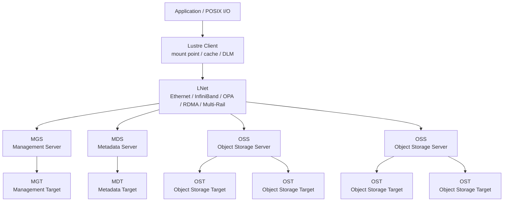
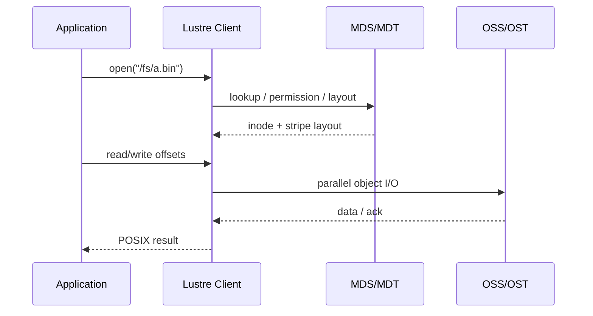
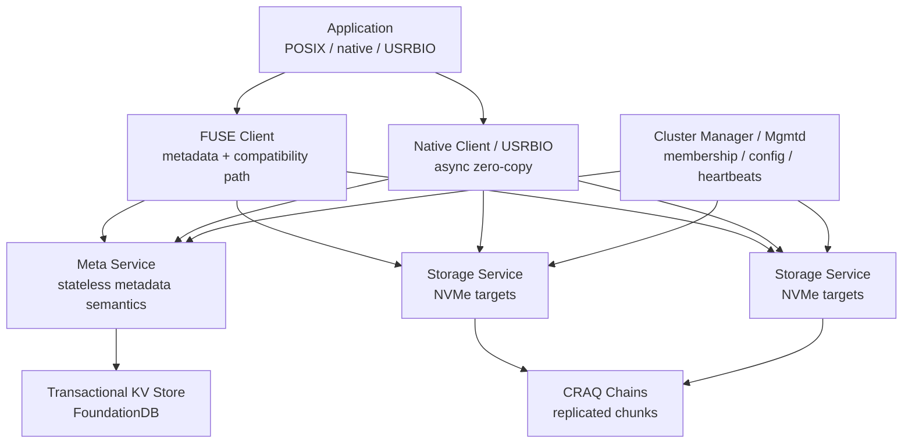
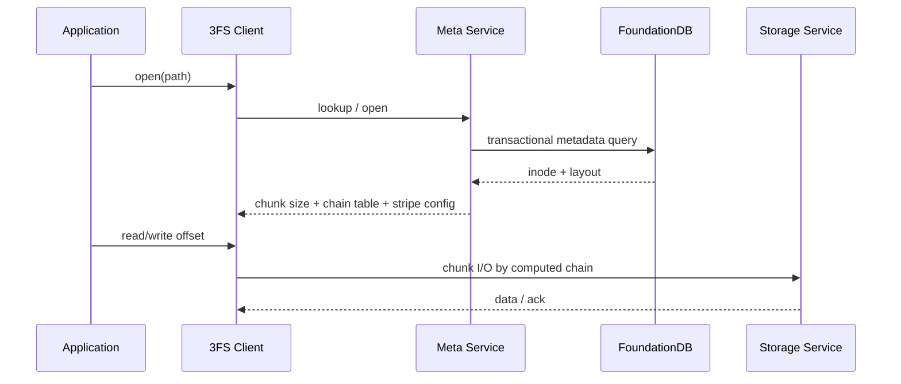
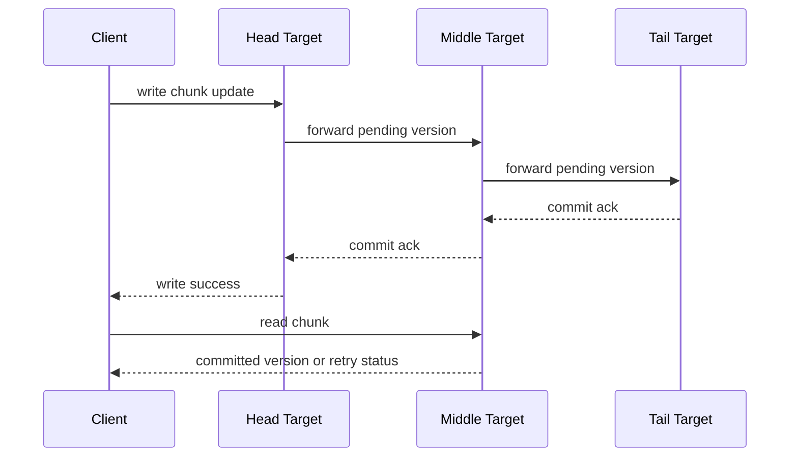
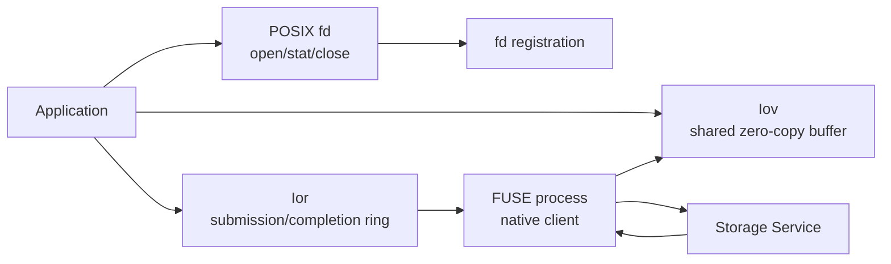

# Lustre 与 3FS 深度技术文档

> **HPC 并行文件系统与 AI 原生分布式文件系统架构对比**
>
> 基于 Lustre Wiki、DeepSeek 3FS 官方仓库、3FS Design Notes、USRBIO API Reference 与 Fire-Flyer AI-HPC 论文整理
>
> 文档快照：deepseek-ai/3fs main@22fca04 · 2026-07-10

---

## 目录

- [自动生成目录占位](#自动生成目录占位)

---

## 第一章：为什么要把 Lustre 和 3FS 放在一起看

### 1.1 两者解决的是同一类底层矛盾

AI 基础设施中的存储问题已经不只是“容量够不够”。大模型训练、推理和数据处理同时要求：

- 多节点看到同一个命名空间。
- 单文件或单任务可以吃到多块盘、多台存储服务器和多条网络链路的带宽。
- 元数据路径不能被海量小文件、数据集 shuffle、checkpoint 目录和缓存清理拖垮。
- 存储层既要能服务传统 POSIX 程序，也要给性能敏感 runtime 提供绕过通用路径的高速接口。
- 故障恢复不能把训练或推理集群拖入长时间不可用状态。

Lustre 和 3FS 都试图把一组存储服务器聚合成一个可共享、高吞吐的文件系统，但两者的出发点不同：

| 系统 | 一句话定位 | 核心假设 |
|------|------------|----------|
| Lustre | 成熟的 HPC 并行文件系统 | 应用需要 POSIX，全局命名空间和大规模并行 I/O；可靠性通常由后端存储、HA 与运维体系共同承担 |
| 3FS | 面向 AI 训练和推理的高性能分布式文件系统 | 集群有 NVMe SSD、RDMA 网络和 AI workload；文件接口仍重要，但性能关键路径需要 native/USRBIO |

### 1.2 不应该简单问“谁更快”

“Lustre vs 3FS”容易被误解成单维性能比较。更准确的问题是：

| 问题 | 为什么重要 |
|------|------------|
| workload 是大文件顺序 I/O，还是小块随机读？ | Lustre 的经典强项是大规模并行文件 I/O；3FS 明确面向 AI dataloader、checkpoint 和 KVCache |
| 是否强依赖 POSIX 兼容和成熟生态？ | Lustre 生态和运维经验更成熟；3FS 更年轻，需要更多工程验证 |
| 是否有 RDMA 和全闪 SSD 池？ | 3FS 的设计收益高度依赖 NVMe + RDMA；没有这些条件时收益会明显下降 |
| 是否愿意适配 native API？ | 只走 FUSE/POSIX 可能无法发挥 3FS 的性能目标 |
| 故障域和一致性由谁负责？ | Lustre 和 3FS 在复制、HA、恢复路径上差异很大 |

### 1.3 在 LLM 系统里的位置

把存储层放进 LLM 推理栈，可以按缓存层级理解：

```text
GPU HBM
  -> CPU DRAM / pinned memory
  -> local NVMe / GDS / io_uring
  -> shared DFS: Lustre / 3FS / NFS / CephFS / object storage
```

Lustre 更常作为成熟共享 POSIX 文件系统，承担模型权重、checkpoint、训练数据集和远端存储层职责。3FS 则更像面向 AI 场景重做的共享 SSD/RDMA 存储底座，官方资料明确把 dataloader、checkpoint 和 KVCache for inference 作为目标 workload。

---

## 第二章：Lustre 架构总览

### 2.1 设计定位

Lustre 是开源、全局单命名空间、POSIX 兼容的分布式并行文件系统，长期服务于 HPC 和超算场景。它的关键设计是将**元数据服务**和**文件内容服务**拆开，并让客户端在获得文件 layout 后直接访问对象存储服务器。

### 2.2 核心组件



| 组件 | 职责 |
|------|------|
| Client | 挂载 Lustre，向应用暴露 POSIX 文件系统，维护缓存和分布式锁状态 |
| MGS/MGT | 管理并持久化 Lustre 文件系统配置 |
| MDS/MDT | 处理 namespace、目录、权限、open/close、rename、unlink、layout 等元数据 |
| OSS/OST | 处理文件内容对象的读写；OST 容量之和构成文件系统数据容量 |
| LNet | Lustre 网络层，抽象底层网络并支持 RDMA、路由和 Multi-Rail |

### 2.3 元数据路径和数据路径分离

Lustre 的读写可以分成两段：

1. 客户端访问 MDS，解析路径、检查权限、获取文件 layout。
2. 客户端根据 layout 直接访问对应 OSS/OST，执行数据 I/O。



这个设计避免 MDS 参与大文件数据面。MDS 仍然是元数据操作的关键路径，但文件内容吞吐主要由 OSS、OST、网络和客户端并发决定。

### 2.4 Striping：单文件并行 I/O 的关键

Lustre 文件内容被拆成对象并分布在多个 OST 上。典型 layout 包括：

| 参数 | 含义 |
|------|------|
| stripe count | 一个文件跨多少个 OST |
| stripe size | 连续多少字节后切到下一个 OST |
| stripe offset | 从哪个 OST 开始分布 |

示例：

```text
file offset: 0      1MB     2MB     3MB     4MB
             |       |       |       |       |
target:      OST0    OST1    OST2    OST3    OST0
```

大文件顺序读写可以通过更多 OST 并行提升带宽；但 stripe 并不是越大越好。小文件跨太多 OST 会增加 RPC 和元数据/锁协调成本；单目录下海量小文件则可能让 MDS/MDT 成为瓶颈。

### 2.5 分布式锁与 POSIX 语义

Lustre 客户端通过分布式锁管理器维护缓存一致性和 POSIX 并发语义。多个客户端可以并发读写同一文件，但系统必须协调：

- 元数据锁：目录项、inode 属性、权限、rename/unlink。
- 数据锁：文件范围、缓存失效、并发写入。
- Layout 锁：文件对象分布和 layout 变更。

这让 Lustre 能服务普通 POSIX 程序，但也意味着极端并发写同一文件、频繁 rename/unlink、海量小文件创建等 workload 会触发大量锁和元数据协调。

### 2.6 HA 与可靠性模型

Lustre 常见可靠性模型是：

- MDS/MGS 和 OSS 使用 HA pair 或更复杂 HA building block。
- MDT/OST 位于共享存储、RAID、ZFS 或后端阵列上。
- 服务器故障时，由 surviving server 接管对应 target。
- 数据是否有多副本，通常由底层 RAID/ZFS/阵列/运维策略决定，而不是 Lustre 在每次写入时自动跨 OSS 复制。

这是一种典型 HPC 存储工程取舍：Lustre 层专注并行文件系统语义和吞吐，底层块设备与 HA 体系负责持久化可靠性和服务连续性。

---

## 第三章：3FS 架构总览

### 3.1 设计定位

3FS，全称 Fire-Flyer File System，是 DeepSeek 开源的高性能分布式文件系统。官方 README 将它定义为面向 AI training 和 inference workload 的共享存储层，目标是利用现代 SSD 和 RDMA 网络，降低分布式应用开发复杂度。

它特别强调四类 workload：

| Workload | 3FS 关注点 |
|----------|------------|
| Data Preparation | 大量中间产物、目录化组织、批处理读写 |
| Dataloaders | 跨节点随机访问训练样本，减少预取和 shuffle 复杂度 |
| Checkpointing | 大规模训练的高吞吐并行 checkpoint |
| KVCache for Inference | 用更大容量、更低成本的 SSD 层替代部分 DRAM cache |

### 3.2 核心组件



| 组件 | 职责 |
|------|------|
| Cluster Manager / mgmtd | 管理成员、配置、心跳和 chain table，多个实例中选主 |
| Meta Service | 实现文件系统元数据语义，本身尽量无状态 |
| FoundationDB | 保存 inode、目录项、layout、事务状态等元数据 |
| Storage Service | 管理本地 SSD 上的 storage targets，提供 chunk store 接口 |
| FUSE Client | 提供低接入门槛的文件系统挂载路径 |
| Native Client / USRBIO | 为性能敏感应用提供异步、零拷贝、高并发 I/O 路径 |

### 3.3 和对象存储的边界

3FS 仍选择文件系统接口，而不是只暴露对象 API，原因是 AI 和数据处理系统仍大量依赖：

- 原子目录 rename。
- 递归目录删除。
- 符号链接和硬链接。
- CSV、Parquet、checkpoint shard 等文件组织方式。
- 现有 dataloader 和分析工具的文件路径语义。

因此 3FS 不是“不要文件系统”，而是保留文件接口，同时为关键 I/O 路径提供 native/USRBIO。

---

## 第四章：3FS 元数据模型

### 4.1 Stateless Meta Service + FoundationDB

3FS 的 metadata service 不把完整元数据状态放在本地内存或本地磁盘，而是把文件系统元数据持久化到事务 KV。公开设计文档以 FoundationDB 为例，依赖其事务能力和 Serializable Snapshot Isolation。

核心结构：

| 结构 | 内容 |
|------|------|
| inode table | 文件、目录、符号链接的 inode 属性 |
| directory entry table | `(parent_inode_id, entry_name) -> target_inode_id` |
| file inode attributes | 文件长度、chunk size、chain table 选择、stripe 范围、shuffle seed |
| directory inode attributes | 父目录、默认 layout、子目录/文件的继承配置 |
| symlink inode attributes | 目标路径字符串 |

Meta service 可以水平运行多个实例。客户端请求失败或超时时，可以切换到其他 meta service；并发元数据更新由 FoundationDB 事务冲突检测和重试处理。

### 4.2 文件 layout 如何进入数据路径

当应用打开文件：

1. Client 向 meta service 查询 inode 和 layout。
2. Meta service 返回 chunk size、chain table、stripe size、offset、shuffle seed 等信息。
3. Client 可以根据 inode id 和 chunk index 计算 chunk ID。
4. 后续数据 I/O 直接访问 storage service，meta service 不在每个数据块读写的热路径上。



### 4.3 动态文件属性

3FS 对一些 POSIX 细节做了工程取舍。公开 design notes 提到：

- 只读打开的文件描述符不被完整追踪，因为训练任务启动时可能打开大量文件。
- 写打开的 fd 会维护 file session，避免删除正在写入的文件时产生不可回收垃圾 chunk。
- 文件长度可能由客户端周期上报最大写位置，并在 close/fsync 时精确查询最后 chunk。
- 并发写同一文件长度会触发更多协调，因此高性能路径更适合“多文件、多 shard、少共享写热点”的写入模式。

这说明 3FS 并不是为了支持任意 POSIX corner case 的最优性能，而是围绕 AI workload 常见读写模式做取舍。

---

## 第五章：3FS 数据放置与一致性

### 5.1 Chunk、Target、Chain 和 Chain Table

3FS 文件内容被拆成等长 chunk。每个 chunk 复制到一条 replication chain 上。每条 chain 是一组有序 storage targets：

```text
chain 1: target A1 -> target B1 -> target C1
chain 2: target D1 -> target E1 -> target F1
chain 3: target A2 -> target B2 -> target C2
```

概念对应关系：

| 概念 | 含义 |
|------|------|
| chunk | 文件内容切分后的固定大小数据块 |
| storage target | 位于某个 storage service / SSD 上的逻辑存储目标 |
| chain | 一组有序 targets，承载 chunk 副本 |
| chain table | 多条 chain 的集合，供目录或文件 layout 选择 |
| stripe size | 一个文件会使用多少条连续 chain 分布 chunk |

Meta service 创建文件时，会从目录默认或指定 chain table 中选择连续 chain，并生成 shuffle seed，使 chunk 分布在 chain 和 SSD 上更均衡。

### 5.2 CRAQ：write-all-read-any

3FS storage service 使用 CRAQ（Chain Replication with Apportioned Queries）提供强一致性。简化读写流程如下：



关键点：

- 写请求从 head target 进入，沿 chain 传播到 tail。
- 每个 target 维护 committed/pending 版本。
- tail commit 后 ack 反向传播。
- 读请求可以发到任意可服务副本；如果副本同时有 pending 状态，会通知客户端等待、重试或使用 relaxed read。

这种模型的目标是让所有副本都能贡献读吞吐，而不是只有 tail 能读。

### 5.3 故障与恢复

Cluster manager 通过心跳维护 storage service 和 storage target 状态。公开设计中，target public state 包括 serving、syncing、waiting、lastsrv、offline 等。

当 storage service 或 SSD 故障：

- 对应 target 被标记 offline，并被移动到 chain 末尾。
- Chain version 增加，客户端和服务端收到新 chain table。
- 返回的 storage service 需要先进入 recovery/syncing。
- 恢复期间，前驱 target 通过 full-chunk-replace write 把缺失状态同步给返回 target。
- 恢复过程与正常服务重叠，以降低停机影响。

这和 Lustre 常见 HA 接管不同。Lustre 更常是 target 由另一台服务器接管；3FS 则在文件系统层维护 chunk 复制链和 target 状态，并做数据恢复。

---

## 第六章：客户端 I/O 路径：POSIX、FUSE、Native、USRBIO

### 6.1 FUSE 路径的价值与瓶颈

FUSE 的价值是兼容性：应用只需要看到挂载点，不必改代码。但 FUSE 也带来明显开销：

- 应用内存和用户态文件系统进程之间需要额外数据搬运。
- FUSE 请求队列和锁竞争限制小 I/O 扩展能力。
- Linux 5.x 的 FUSE 对同一文件并发写支持有限。
- 小随机读、非 4K 对齐样本读取容易无法吃满 SSD/RDMA。

因此 3FS 的设计不是“只靠 FUSE 打天下”，而是把 FUSE 作为兼容入口，把高性能路径交给 native API。

### 6.2 Native Client 与异步零拷贝

3FS native API 借鉴 `io_uring` 模型，核心是两类共享结构：

| 结构 | 作用 |
|------|------|
| Iov | 大块共享内存区域，用于 zero-copy read/write，IB memory registration 由客户端管理 |
| Ior | 小型共享 ring buffer，应用提交 I/O 请求，native client 批量取出并完成 |

应用流程：

1. 正常 `open()` 文件，获取 Linux fd。
2. 调用 native API 注册 fd。
3. 创建 Iov/Ior。
4. 将 read/write 请求准备到 ring 中。
5. native client 批量发送到 storage service。
6. 应用等待 completion queue。



### 6.3 USRBIO

USRBIO 是 3FS 暴露给用户应用的高速 I/O API。它允许应用直接向 FUSE 进程中的 3FS I/O 队列提交请求，绕开 FUSE 的部分限制，尤其适合：

- 高并发随机读。
- 大块读取，避免单次 I/O 大小限制。
- 多线程 dataloader。
- KV cache page/block 读取。
- checkpoint shard 批量读写。

但 USRBIO 也意味着应用需要显式适配 API。对通用程序，FUSE 路径最易用；对性能关键程序，native/USRBIO 才是 3FS 的核心价值。

---

## 第七章：网络模型与拥塞控制

### 7.1 Lustre LNet

LNet 是 Lustre 网络层。它将文件系统服务和底层网络隔离开，支持 Ethernet、InfiniBand、Omni-Path、Cray Gemini 等网络，并可在可用时使用 RDMA 和 zero-copy。LNet 还支持路由和 Multi-Rail，使不同网络拓扑和多网卡配置可以接入同一个 Lustre 文件系统。

Lustre 的网络调优重点通常包括：

- 客户端到 OSS/MDS 的链路带宽和延迟。
- Multi-Rail 是否均衡。
- LNet router 是否成为瓶颈。
- OSS/OST 分布是否与网络拓扑匹配。
- 单客户端、单 OSS、单 OST 的瓶颈定位。

### 7.2 3FS 的 RDMA-first 假设

3FS 公开设计明确假设所有组件运行在 RDMA 网络中，通常是 InfiniBand 或 RoCE。存储节点使用多块 NVMe SSD 和 RDMA NIC，客户端可以访问所有 storage service。

Fire-Flyer 论文中的 3FS 网络经验包括：

- 存储网络采用高 bisection bandwidth 的 Fat-Tree。
- 存储流量和训练通信流量需要隔离，避免互相制造 head-of-line blocking。
- 高吞吐读会出现 incast：多个 storage service 同时向同一个 client 发数据。
- 3FS 使用 request-to-send 机制限制并发发送者，牺牲部分端到端延迟换取可持续吞吐。

### 7.3 request-to-send 机制

读请求简化流程：

1. Client 向多个 storage service 发 read。
2. Storage service 从 SSD 读出数据。
3. Storage service 不立即把数据推给 client，而是请求发送许可。
4. Client 控制同时发送者数量。
5. 获得许可的 storage service 通过 RDMA WRITE 传输数据。
6. Storage service 用 RDMA SEND 通知完成。

这个机制的本质是：在 client 入方向成为热点时，用应用层调度控制 incast，避免 RDMA 网络在微突发下扩散拥塞。

---

## 第八章：Lustre 与 3FS 关键差异

| 维度 | Lustre | 3FS |
|------|--------|-----|
| 主要来源 | HPC/超算并行文件系统 | DeepSeek/High-Flyer AI-HPC 存储系统 |
| 核心目标 | POSIX 兼容、全局命名空间、大规模并行 I/O | AI training/inference 的共享 SSD/RDMA 存储层 |
| 元数据服务 | MDS/MDT，可多 MDT 扩展 | Stateless meta service + FoundationDB |
| 数据服务 | OSS/OST | Storage service / storage target / chain |
| 数据分布 | 文件对象按 stripe 分布到 OST | 文件 chunk 分布到 replication chains |
| 一致性 | POSIX 语义 + 分布式锁 | 公开设计强调 CRAQ 强一致性 |
| 复制/可靠性 | 常依赖后端 RAID/ZFS/HA target failover | chunk 在 chain 上复制，target 状态和恢复由 3FS 管理 |
| 网络层 | LNet，支持多种网络和 Multi-Rail | RDMA-first，围绕 NVMe/RDMA 和 incast 控制设计 |
| 客户端路径 | Kernel client / POSIX mount | FUSE + native client + USRBIO |
| 生态成熟度 | 成熟，HPC 资料和经验丰富 | 较新，AI 场景明确但生产经验更集中 |
| 最强场景 | 大文件并行 I/O、HPC checkpoint、共享 POSIX 工作区 | AI dataloader、checkpoint、KVCache、随机读和全闪共享存储 |

### 8.1 元数据扩展方式不同

Lustre 的元数据扩展依赖 MDS/MDT、DNE、多 MDT、目录布局等机制。它保留强 POSIX 语义，适合多用户共享文件系统，但元数据调优和目录规划非常关键。

3FS 把元数据状态放到 FoundationDB 这类事务 KV 中，meta service 本身可无状态横向扩展。它的优势是服务升级、failover 和并行处理更直接；代价是把元数据一致性和性能强依赖转移给 FoundationDB。

### 8.2 数据可靠性职责不同

Lustre 中，一个 OST 通常由底层块设备、RAID/ZFS、共享存储和 HA pair 保护。Lustre 服务失败时，另一个服务器接管 target。

3FS 中，每个 chunk 有多个副本，副本位于 chain 的多个 storage targets 上。系统通过 chain version、target state、CRAQ 和 recovery 流程维护一致性和恢复。

### 8.3 高性能路径不同

Lustre 对应用暴露内核文件系统客户端，应用通常无需修改。性能调优主要在 striping、LNet、OSS/OST、客户端缓存、RPC 参数和后端盘阵。

3FS 同时提供 FUSE 和 native/USRBIO。FUSE 提供可用性，native/USRBIO 提供性能。性能敏感 workload 通常需要显式适配。

---

## 第九章：AI 训练场景分析

### 9.1 Dataloader

AI dataloader 的关键问题是随机性和并发：

- 样本可能大小不一。
- 读取不一定 4K 对齐。
- 多 worker 同时读取不同 shard。
- shuffle 可能打散顺序 I/O。

Lustre 可以通过大文件打包、合理 stripe、客户端缓存和预取改善表现，但它不是专门为小随机样本读取设计。

3FS README 明确把 dataloader 作为目标场景。它希望通过随机访问能力和 native/USRBIO 让训练节点直接读取样本，减少复杂预取和数据本地化逻辑。

### 9.2 Checkpoint

Checkpoint 的 I/O 模式通常是：

- 多节点同时写大块参数和 optimizer state。
- 写入必须尽快完成，避免阻塞训练。
- 恢复时需要高吞吐并行读取。
- 文件数量、目录层级、rename 原子性和完整性标记很重要。

Lustre 是 HPC checkpoint 的经典选择。它适合大文件并行写，但需要避免所有 rank 写一个共享文件造成锁和写热点，常见做法是每 rank 或每 shard 独立文件。

3FS 在 Fire-Flyer 论文中把 checkpoint 作为重要场景，并描述 batch write/read API 让单节点 checkpoint 写入可达到很高吞吐。这里的关键不是“文件系统自动让 checkpoint 最优”，而是 checkpoint manager 和 3FS API 协同设计。

### 9.3 数据准备与中间产物

数据清洗、过滤、排序、分桶和 Parquet/CSV 产物管理都需要目录语义。对象存储可以模拟目录，但原子 rename、递归删除、硬链接/符号链接等文件系统能力仍有价值。

Lustre 和 3FS 都保留文件系统接口。差异在于 Lustre 更像通用共享 POSIX 工作区，3FS 更强调在 AI 数据处理管线中让海量 SSD 和 RDMA 带宽直接服务上层任务。

---

## 第十章：LLM 推理与 KV Cache 场景

### 10.1 KV Cache 为什么会碰到文件系统

长上下文和多轮会话让 KV Cache 成为主要内存压力来源。典型层级是：

| 层级 | 特点 |
|------|------|
| GPU HBM | 延迟最低，容量最贵 |
| CPU DRAM / pinned memory | 容量更大，可通过 RDMA/NVLink/PCIe 搬运 |
| 本地 NVMe | 成本低，适合冷 KV 或二级缓存 |
| 共享 DFS | 支持跨节点复用、持久化、容量扩展 |

文件系统进入 KV Cache 场景，是因为系统希望把部分 KV block/page 写到更大容量的共享层，降低重复 prefill 和 GPU 显存压力。

### 10.2 Lustre 作为远端存储层

Lustre 可以作为 G4 remote storage 或 DFS persistence 层：

- 共享模型权重。
- 保存 checkpoint 和推理中间产物。
- 作为 KV cache 的冷层或持久化层。
- 提供 POSIX 路径，便于现有 runtime 接入。

但要注意：KV cache 通常是大量 page/block 对象，具有随机读写、生命周期短、删除频繁、热点变化快等特点。直接把每个 KV block 映射为小文件，可能制造元数据风暴和小文件问题。更合理的做法通常是：

- 多 KV block 合并成 bucket/blob。
- 用 manifest 或索引服务管理 key 到 offset。
- 批量读写和批量删除。
- 外部 GC 负责生命周期和容量治理。

### 10.3 3FS 作为 KV cache 友好层

3FS 官方 README 明确把 KVCache for inference 作为目标场景，并展示 KVCache 读吞吐和 GC remove IOPS 的 benchmark 图。Fire-Flyer 论文还提到 3FS-KV 支持 DeepSeek 的 KV Context Caching on Disk 技术。

这意味着 3FS 的定位更贴近“共享 SSD/RDMA cache substrate”：

- 使用 native/USRBIO 降低 FUSE/POSIX 开销。
- 大量 SSD 聚合提供容量。
- RDMA 网络提供跨节点吞吐。
- CRAQ 副本提供一致性和读扩展。
- 上层 3FS-KV 或 runtime 负责 key/value 语义。

但仍要强调：3FS 本身不是完整 KV cache 策略。缓存命中率、prefix index、TTL、eviction、tenant quota、冷热迁移、GC 仍然需要上层 runtime 或服务配合。

---

## 第十一章：性能模型

### 11.1 Lustre 性能瓶颈定位

Lustre 性能通常由以下链路决定：

```text
Application threads
  -> Lustre client cache / RPC
  -> LNet / NIC / network topology
  -> OSS CPU / RPC threads
  -> OST backend filesystem / RAID / ZFS / SSD/HDD
```

常见瓶颈：

| 现象 | 可能原因 |
|------|----------|
| 单文件吞吐低 | stripe count 太小、客户端并发不足、单 OST/OSS 瓶颈 |
| 小文件创建慢 | MDS/MDT 压力、单目录热点、锁竞争 |
| 多客户端吞吐不线性 | OSS/OST 不均衡、LNet 路由瓶颈、后端盘阵瓶颈 |
| 延迟毛刺 | HA failover、锁冲突、OST 拥塞、客户端 cache invalidation |
| 空间不均衡 | 文件 layout 固定、旧数据未 rebalance、OST 容量差异 |

### 11.2 3FS 性能瓶颈定位

3FS 性能链路更接近：

```text
Application
  -> FUSE or USRBIO
  -> RDMA network
  -> Storage service
  -> NVMe SSD
  -> CRAQ chain / recovery state
```

常见瓶颈：

| 现象 | 可能原因 |
|------|----------|
| FUSE 路径小随机读上不去 | FUSE copy、队列锁竞争、batch 不足 |
| native/USRBIO 吞吐不稳 | io_depth、Ior 数量、Iov 注册、NUMA、client CPU |
| 大读出现尾延迟 | client incast、request-to-send 排队、网络拥塞 |
| 写吞吐低 | CRAQ chain 写放大、副本数、head target 热点 |
| 恢复期间性能下降 | offline target 重定向、syncing target 回填、chain table 变化 |
| 元数据延迟高 | FoundationDB 事务冲突、热点目录、meta service 和 FDB 网络延迟 |

### 11.3 Benchmark 数字如何解读

3FS README 给出的大规模读压测条件是：180 个 storage nodes，每个节点 2×200Gbps InfiniBand NIC 和 16 块 14TiB NVMe SSD，500+ client nodes，聚合读吞吐约 6.6 TiB/s，且存在训练背景流量。

Fire-Flyer 论文给出相近规模下约 8TB/s 总读吞吐的描述，并说明该系统包含 180 个存储节点、2880 块 NVMe SSD、超过 20PiB 存储空间和镜像冗余。

这些数字说明 3FS 能在特定大规模硬件和网络设计下达到极高吞吐，但不能直接外推到任意集群。影响结果的变量包括：

- 存储节点数量。
- 每节点 SSD 数和 SSD 型号。
- RDMA NIC 带宽。
- Fat-Tree bisection bandwidth。
- Client 数量和 I/O depth。
- FUSE 还是 USRBIO。
- 后台训练流量和网络隔离策略。
- Chunk size、stripe size、chain table、replica factor。

---

## 第十二章：运维与故障域

### 12.1 Lustre 运维重点

Lustre 的生产运维重点包括：

- MDS/MGS/OSS HA 设计。
- MDT/OST 后端 RAID/ZFS/阵列可靠性。
- LNet 路由和 Multi-Rail 配置。
- OST 容量均衡和文件 layout 管理。
- 大目录、小文件和元数据热点治理。
- Quota、用户/组权限和项目目录规划。
- failover 演练和恢复时间评估。

Lustre 的优势是资料、工具和运维经验成熟；代价是组件多、调优面广，需要 HPC 存储经验。

### 12.2 3FS 运维重点

3FS 的生产运维重点包括：

- RDMA 网络连通性和拥塞控制。
- FoundationDB 版本、容量、延迟和事务冲突。
- mgmtd/cluster manager 选主和配置分发。
- chain table 设计、replica factor、chunk size、stripe size。
- storage target 状态、recovery、syncing 进度。
- FUSE/native client 版本和兼容性。
- ClickHouse/monitoring 等监控链路。
- 编译兼容性，例如官方 README 提到 shuffle method 需要在集群生命周期内保持一致。

3FS 的优势是架构更贴近 AI 全闪/RDMA 场景；代价是生态更年轻，部署和调优更依赖官方实现细节和硬件环境。

---

## 第十三章：选型建议

### 13.1 优先选择 Lustre 的场景

| 场景 | 理由 |
|------|------|
| 已有 HPC/超算环境 | Lustre 与调度、用户目录、MPI 应用、checkpoint 工具生态匹配 |
| 强 POSIX 兼容和多用户共享 | Lustre 客户端和权限/配额/目录语义成熟 |
| 大文件顺序读写为主 | Lustre striping 和 OSS/OST 扩展模型适合 |
| 企业更重视成熟运维流程 | Lustre 的 HA、监控、故障处理经验更丰富 |
| AI 平台只需要 RWX 共享目录 | Lustre 比引入 3FS native 路径更直接 |

### 13.2 优先评估 3FS 的场景

| 场景 | 理由 |
|------|------|
| AI 训练数据随机读瓶颈明显 | 3FS 明确面向 dataloader 和随机样本访问 |
| checkpoint 保存/恢复占用训练时间 | 3FS 与 batch I/O、全闪/RDMA 设计更贴近 |
| LLM KV cache 需要大容量共享 SSD 层 | 官方把 KVCache for inference 列为目标 workload |
| 集群已有 RDMA 和大量 NVMe | 3FS 的架构收益依赖这些硬件 |
| 应用可以适配 native/USRBIO | 能绕开 FUSE/POSIX 路径限制 |

### 13.3 不建议盲目选择 3FS 的场景

- 没有 RDMA 网络。
- 存储节点不是 NVMe 全闪。
- 主要需求只是普通共享目录。
- 团队缺少 FoundationDB、RDMA、Linux I/O 和分布式存储经验。
- 无法修改 runtime，只能走 FUSE，并且 workload 是高并发小随机读。
- 需要非常成熟的企业运维生态和长期兼容性承诺。

### 13.4 混合使用模式

在大型 AI 平台中，Lustre 和 3FS 并不必然互斥：

| 层级 | 可选系统 | 用途 |
|------|----------|------|
| 用户共享工作区 | Lustre | 稳定 POSIX、权限、目录、脚本和工具 |
| 训练数据热路径 | 3FS | 随机读、dataloader、shuffle 产物 |
| Checkpoint 高速层 | Lustre 或 3FS | 取决于现有生态和 checkpoint manager 适配 |
| LLM KV cache 共享层 | 3FS / 3FS-KV / specialized KV store | 更贴近 KV block/page 访问模式 |
| 长期归档 | Object Storage | 成本、生命周期、跨区域复制 |

---

## 第十四章：和现有 AI 基础设施文档的关系

### 14.1 和 Mooncake 的关系

Mooncake Store 的 DFS persistence、SSD offload、NVMe-oF 和 3FS USRBIO 路径都说明：LLM KV cache 正在把“存储系统”推入推理热路径。

Lustre 可以作为通用 DFS 持久化路径；3FS USRBIO 则代表更贴近高性能 AI cache 的用户态 I/O 路径。两者都需要上层处理对象 key、生命周期、eviction、manifest 和 GC。

### 14.2 和 Dynamo 的关系

Dynamo KVBM 将 KV 存储抽象为 GPU、Host、SSD、Remote Storage 等层。Lustre 更适合作为 Remote Storage 的成熟 POSIX 后端；3FS 更适合作为高吞吐 SSD/RDMA remote storage 或 KV cache backend 候选。

Router 和 KV-aware scheduling 不应与存储后端混淆：Router 决定请求去哪，KVBM/LMCache/FlexKV/3FS 等后端决定 KV block 如何存储、读取和清理。

### 14.3 和 KServe/Kubeflow 的关系

KServe/Kubeflow 更关注 Kubernetes 控制面、模型服务声明、Notebook、Pipeline 和多租户 MLOps。它们需要底层共享存储，但不替代存储系统本身。

在 Kubernetes 中接入 Lustre 或 3FS，要额外考虑：

- CSI/PV/PVC 支持成熟度。
- Pod 调度和存储拓扑亲和。
- RDMA device plugin 和网络隔离。
- 多租户 quota 和目录权限。
- 模型权重、数据集、checkpoint、KV cache 是否应该使用同一类存储。

---

## 第十五章：结论

Lustre 和 3FS 都是高性能共享文件系统，但它们的工程重心不同：

1. **Lustre 是成熟 HPC POSIX 并行文件系统。** 它通过 MDS/MDT 与 OSS/OST 分离、LNet 网络层、OST striping 和 HA building blocks 提供大规模并行 I/O。它适合通用 HPC、大文件、checkpoint、共享工作区和需要成熟运维生态的场景。

2. **3FS 是 AI-first 的全闪/RDMA 分布式文件系统。** 它通过 stateless meta service + FoundationDB、CRAQ replication chains、native/USRBIO、request-to-send 控制和 NVMe/RDMA 设计服务 AI dataloader、checkpoint 和 KVCache 场景。它更贴近现代 LLM 集群的热路径需求，但也更依赖硬件和 runtime 适配。

3. **选型要以访问模式为中心。** 如果只是需要稳定共享 POSIX 目录，Lustre 更直接；如果瓶颈在随机样本读取、checkpoint 秒级保存恢复或 KV cache on disk，3FS 更值得评估。

4. **文件系统不替代缓存治理。** 无论选 Lustre 还是 3FS，LLM KV cache 的 key 设计、prefix index、TTL、eviction、GC、tenant quota 和观测都必须由上层系统设计。

5. **不要把 benchmark 当 SLA。** 3FS 的公开性能数字来自特定大规模硬件、网络和客户端条件；Lustre 的实际性能也强依赖 stripe、OSS/OST、LNet、客户端并发和后端盘阵。生产前必须按自己的 workload 压测。

---

## 附录：资料来源

| 资料 | 链接 | 用途 |
|------|------|------|
| Lustre Wiki: Introduction to Lustre | <https://wiki.lustre.org/Introduction_to_Lustre> | Lustre 定位、MDS/MDT、OSS/OST、MGS/MGT、Client、LNet、HA building blocks |
| DeepSeek 3FS GitHub README | <https://github.com/deepseek-ai/3fs> | 3FS 定位、目标 workload、性能数据、构建依赖 |
| 3FS Design Notes | <https://github.com/deepseek-ai/3fs/blob/main/docs/design_notes.md> | 3FS 组件、metadata store、CRAQ、chain table、FUSE 限制、native client |
| 3FS USRBIO API Reference | <https://github.com/deepseek-ai/3fs/blob/main/src/lib/api/UsrbIo.md> | Iov、Ior、fd registration、异步 I/O API |
| 3FS Setup Guide | <https://github.com/deepseek-ai/3fs/blob/main/deploy/README.md> | 部署组件、mgmtd/meta/storage/client、FoundationDB、ClickHouse、RDMA 前提 |
| Fire-Flyer AI-HPC Paper | <https://arxiv.org/html/2408.14158v1> | Fire-Flyer 中 3FS 的硬件规模、网络设计、request-to-send、3FS-KV、checkpoint 经验 |

