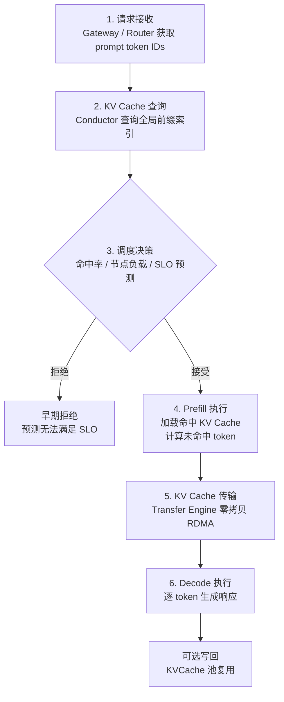
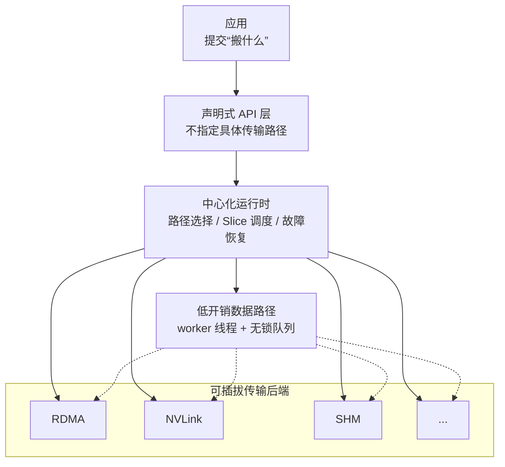
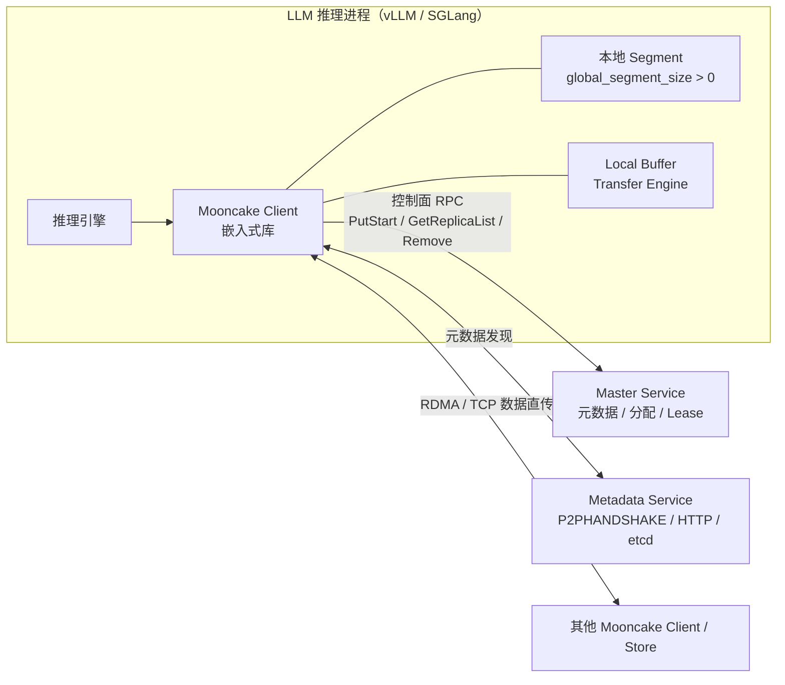
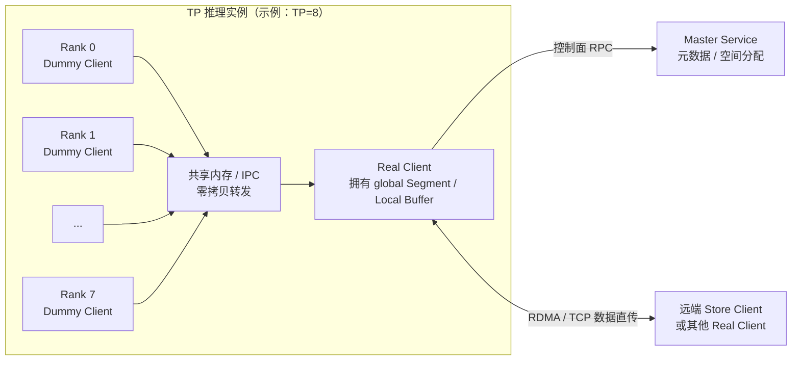
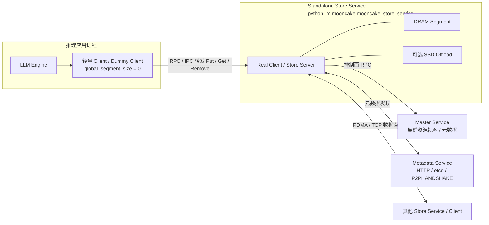
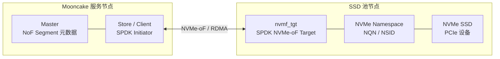
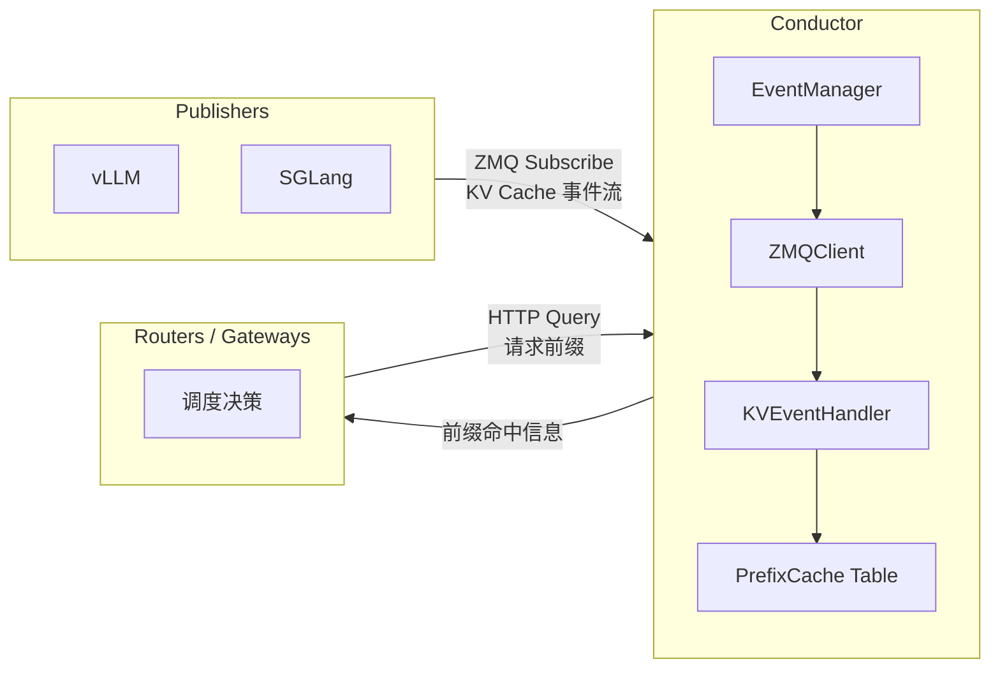
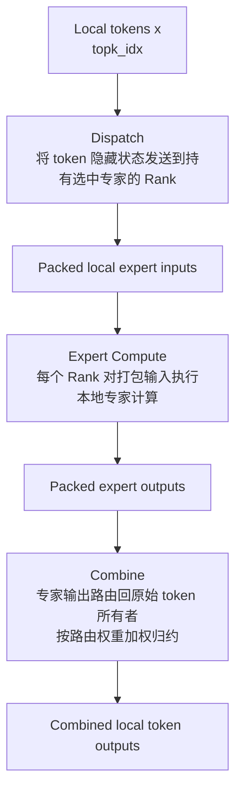

# Mooncake 深度技术文档

> **以 KVCache 为中心的分离式 LLM 推理架构全面解析**
>
> 基于 Mooncake 官方文档 (https://kvcache-ai.github.io/Mooncake) 整理编写
>
> 稳定版本基线：`v0.3.11.post1@e9c61075720039bcfc5fffd19f847608402be3d0`，审校日期：2026-07-16。论文结论与软件实现会明确区分。
>
> FAST 2025 最佳论文 | Moonshot AI 的 Kimi 服务平台

---

## 目录

- [第一章：引言 — 为什么需要 Mooncake](#第一章引言--为什么需要-mooncake)
- [第二章：架构总览 — 分离式 KVCache 中心架构](#第二章架构总览--分离式-kvcache-中心架构)
- [第三章：Transfer Engine — 零拷贝数据移动基石](#第三章transfer-engine--零拷贝数据移动基石)
- [第四章：TENT — 传输引擎下一代演进](#第四章tent--传输引擎下一代演进)
- [第五章：Mooncake Store — 分布式 KV 缓存存储引擎](#第五章mooncake-store--分布式-kv-缓存存储引擎)
- [第六章：SSD 自由比优先分配](#第六章ssd-自由比优先分配)
- [第七章：Conductor — 缓存感知路由的 KV 索引器](#第七章conductor--缓存感知路由的-kv-索引器)
- [第八章：HiCache — 与 SGLang 深度集成的分层 KV 缓存](#第八章hicache--与-sglang-深度集成的分层-kv-缓存)
- [第九章：Mooncake EP — 专家并行通信运行时](#第九章mooncake-ep--专家并行通信运行时)
- [第十章：Mooncake Backend (PG) — 容错分布式执行后端](#第十章mooncake-backend-pg--容错分布式执行后端)
- [第十一章：P2P Store — 去中心化检查点分发引擎](#第十一章p2p-store--去中心化检查点分发引擎)
- [第十二章：EngramStore 后端 — 嵌入表存储](#第十二章engramstore-后端--嵌入表存储)
- [第十三章：统一并行张量 IO](#第十三章统一并行张量-io)
- [第十四章：过载调度 — 预测性早期拒绝](#第十四章过载调度--预测性早期拒绝)
- [第十五章：Prefill 池优化](#第十五章prefill-池优化)
- [第十六章：集成生态](#第十六章集成生态)
- [第十七章：性能基准与生产实践](#第十七章性能基准与生产实践)
- [第十八章：总结与未来方向](#第十八章总结与未来方向)
- [附录](#附录)

---

## 第一章：引言 — 为什么需要 Mooncake

### 1.1 大模型服务的核心矛盾

大语言模型（LLM）推理服务面临三大结构性挑战：

**KV Cache 内存墙。** 随着上下文长度从 4K 扩展到 128K 甚至 1M，KV Cache 占用的内存急剧增长。以 LLaMA-3-70B 为例，128K 上下文的 KV Cache 需要约 32 GB 内存——几乎等同于模型权重本身。GPU 显存已难以同时容纳模型权重和长上下文 KV Cache。

**Prefill 与 Decode 的资源需求不对称。** Prefill 阶段需要大规模并行计算处理输入 token，是计算密集型；Decode 阶段逐 token 生成，对延迟极度敏感，是内存带宽密集型。将两者混合部署在同一集群意味着无法为任一阶段独立优化资源配置。

**过载场景的真实困境。** 当请求量超出系统容量时，传统的"尽力服务"策略导致所有请求的延迟同时劣化，无一满足 SLO——而已经在 Prefill 上消耗的 GPU 计算资源无法回收，形成巨大的浪费。

### 1.2 Mooncake 的核心洞察

Mooncake 提出了三个关键洞察，从根本上重塑了 LLM 推理架构：

1. **以 KVCache 为中心而非以计算为中心。** 传统架构围绕 GPU 计算组织系统；Mooncake 将 KV Cache 视为一级资源，围绕数据的存储、传输和复用重新设计整个架构。

2. **GPU 集群中被忽视的闲置资源。** 典型 GPU 集群中，CPU、DRAM 和 SSD 的利用率远低于 GPU。Mooncake 利用这些闲置资源构建分布式 KVCache 池，无需额外的专用缓存硬件。

3. **从"尽力服务"到"智能拒绝"。** 与其在过载时让所有请求延迟劣化，不如提前预测无法满足 SLO 的请求并尽早拒绝，节省计算资源用于可以成功服务的请求。

### 1.3 核心成果一览

| 指标 | 结果 |
|------|------|
| 长上下文模拟场景吞吐提升 | **525%** |
| 真实生产负载请求增长 | **75%** |
| 学术认可 | **FAST 2025 最佳论文** |
| Kimi K2 部署 | 128×H200, 224k tok/s prefill / 288k tok/s decode |

---

## 第二章：架构总览 — 分离式 KVCache 中心架构

### 2.1 三大集群

Mooncake 的核心架构由三个逻辑上分离的集群组成：

**Prefill 集群** — 专门处理输入 token 的 Prefill 计算。该集群由大量 GPU 节点组成，目标是最小化 Prefill 延迟（Time to First Token, TTFT）。由于 Prefill 是计算密集型的，节点可以采用较高的 GPU 占用率。

**Decode 集群** — 专门处理逐 token 生成的 Decode 计算。该集群追求最小化每 token 生成延迟（Time per Output Token, TPOT），是内存带宽密集型，GPU 占用率通常较低（约 30-50%），大量 GPU 显存用于存储 KV Cache。

**KVCache 池** — 利用 GPU 集群中闲置的 CPU、DRAM 和 SSD 资源构建的分布式缓存池。该池集中管理所有 Prefill 和 Decode 节点间的 KV Cache 数据，是整个架构的数据中枢。

> **设计决策：** 为什么要分离 Prefill 和 Decode？ 因为其资源需求本质不同——Prefill 需要高 GPU 利用率和大 batch 的计算吞吐，Decode 需要低延迟和小 batch 的内存带宽。分离后每个集群可以独立配置硬件和调度策略。

### 2.2 请求生命周期

一个典型请求在 Mooncake 中的完整生命周期如下：



### 2.3 生态组件地图

Mooncake 的完整技术生态可按层次划分为：

| 层次 | 组件 | 职责 |
|------|------|------|
| **传输层** | Transfer Engine / TENT | 高性能零拷贝数据移动 |
| **存储层** | Mooncake Store / EngramStore / P2P Store | 分布式 KV 缓存、嵌入表、检查点分发 |
| **调度层** | Conductor / KVCache-centric Scheduler | 全局前缀索引、负载均衡、SLO 管理 |
| **分层缓存** | HiCache | L1(GPU) / L2(CPU) / L3(分布式) 三级缓存 |
| **分布式执行** | Mooncake EP / Mooncake Backend (PG) | MoE 专家并行、容错集体通信 |
| **统一抽象** | Unified Parallel Tensor IO | 跨并行方式统一张量 IO 接口 |

### 2.4 关键架构决策

**为什么用闲置资源而非专用缓存节点？** 专用缓存节点增加了硬件成本和运维复杂度。GPU 集群中每台服务器通常配备 512 GB–2 TB DRAM 和数十 TB SSD，这些资源的利用率极低。复用它们构建缓存池既经济又高效。

**为什么选择零拷贝 RDMA？** 传统的基于 TCP 的数据传输需要多次内存拷贝（用户态→内核态→网卡），对大块 KV Cache 传输效率极低。RDMA 绕过 CPU 和操作系统内核，实现 DRAM/VRAM 间的直接传输——对于数百 MB 的 KV Cache 块，这是唯一可行的高性能方案。

---

## 第三章：Transfer Engine — 零拷贝数据移动基石

> Transfer Engine 是 Mooncake 所有组件的传输基础设施。2024 年 11 月开源，已集成到 vLLM、SGLang、TensorRT-LLM、NIXL 等主流推理框架，并于 2026 年 2 月正式加入 PyTorch 生态。

### 3.1 设计哲学与核心抽象

Transfer Engine 围绕两大核心抽象构建：

**Segment（段）** — 代表一个可被远程读写的连续地址空间：

- **RAM Segment（DRAM + VRAM）：** 每个进程启动时自动创建一个以主机名命名的 Segment（必须全局唯一）。它逻辑上覆盖整个内存地址空间，引擎内部将其划分为多个 **Buffer**（位于同一设备上的连续地址空间）。内存范围不必连续——多个 DRAM/VRAM 区域可以同属一个 Segment。每个进程有且仅有一个 Segment，远程进程通过 `openSegment` 访问。还支持注册仅用于本地存储的 DRAM 区域（如 vLLM 的 DRAM PageCache），不可被远程打开。

- **NVMeoF Segment：** 将远程存储节点上的文件通过 NVMe-oF 挂载到本地，实现从 NVMe 到 DRAM/VRAM 的直接传输（绕过 CPU，零拷贝）。用户通过 `openSegment` 引用挂载路径。

**BatchTransfer（批量传输）** — 封装一组非连续数据空间之间的同步操作，支持双向 Read/Write，功能类似于异步的 AllScatter/AllGather。

### 3.2 传输矩阵

Transfer Engine 支持以下源-目标组合：

| 远程↓ / 本地→ | DRAM | VRAM |
|------------|------|------|
| **DRAM** | ✓ | ✓ |
| **VRAM** | ✓ | ✓ |
| **NVMe-oF** | ✓ | ✓ |

### 3.3 传输后端

| 后端 | 适用场景 |
|------|---------|
| **Local memcpy** | 同节点 DRAM/VRAM 间 |
| **TCP** | DRAM↔DRAM（无 RDMA 环境的回退） |
| **RDMA** | DRAM/VRAM↔DRAM，多 NIC 池化 + 重试 |
| **HIP** | AMD GPU 同节点 GPU↔GPU 和 GPU↔CPU（ROCm IPC/Shareable handles） |
| **cuFile (GPUDirect Storage)** | DRAM/VRAM↔NVMeoF |
| **NVLink / IntraNodeNvlink** | NVIDIA GPU 节点内高速互联 |
| **EFA** | AWS Elastic Fabric Adapter |

超过 64KB 的请求会被自动切成多个 Slice，每个 Slice 可能走不同路径以利用所有 RDMA NIC 的聚合带宽。

### 3.4 拓扑感知路径选择

现代多路服务器中，CPU、DRAM、GPU 和 RDMA NIC 之间的带宽受 UPI 链路和 PCIe 交换机的拓扑约束。Transfer Engine 实现了拓扑感知算法：

1. **拓扑矩阵生成：** 每台服务器生成描述其 NUMA/PCIe 拓扑的矩阵并广播到整个集群
2. **NIC 分类：** 基于拓扑数据将 NIC 分为 **preferred**（首选，同一 NUMA 节点或可通过本地 PCIe 交换机实现 GPU Direct RDMA）和 **secondary**（次选）两级
3. **路径选择：** 优先选择 preferred NIC；仅在首选不可用时使用 secondary NIC

**示例：** 从本端 cpu:0 上的 Buffer 传输到远端 cpu:1 时，根据双方的优先级矩阵，选择本端 NIC mlx5_1 和目标端 NIC mlx5_3 组成最优路径。

### 3.5 多 NIC 聚合与切片策略

- 单个请求超过 64KB 自动分片为多个 Slice
- 不同 Slice 可走不同 NIC 路径实现带宽聚合
- 性能实测：4×200 Gbps 达 87 GB/s，8×400 Gbps 达 190 GB/s

### 3.6 端点管理

- **按需建连：** 端点对（local NIC ↔ remote NIC）包含一个或多个 RDMA QP 对象，首次请求时才建立连接
- **端点池上限：** 通过 `MC_MAX_EP_PER_CTX` 控制（默认 65536），超过上限使用 **SIEVE 算法**驱逐过期端点
- **故障清理：** 失败的连接从双端移除，下次传输时重建
- **异步回收：** 被驱逐/删除的端点进入 `waiting_list_`，待已完成 Slice 完成后回收（~1Hz 心跳监控）

### 3.7 容错与自动恢复

| 故障类型 | 处理策略 |
|---------|---------|
| NIC 临时不可用 | 自动识别替代可达路径，重提交到其他 RDMA NIC |
| RDMA Context/CQ 异常 | 临时规避该资源，直至问题解决 |
| 端点级故障 | 双端移除，按需重建 |

### 3.8 运行时调优参数

#### QP 与连接配置

| 环境变量 | 用途 | 默认值 |
|---------|------|-------|
| `MC_NUM_QP_PER_EP` | 每个端点的 QP 数量（更高=更细粒度 IO） | 2 |
| `MC_MAX_EP_PER_CTX` | 每设备最大活跃端点 | 65536 |
| `MC_MAX_SGE` | 最大 Scatter/Gather 元素数 | — |
| `MC_MAX_WR` | 最大 Work Request 数 | — |

#### 网络参数

| 环境变量 | 用途 | 默认值 |
|---------|------|-------|
| `MC_MTU` | 每设备 MTU | 4096 |
| `MC_IB_TC` | RDMA Traffic Class（流量规划） | -1 |
| `MC_IB_SL` | InfiniBand Service Level（0-15，QoS/VL 映射） | -1 |
| `MC_GID_INDEX` | 每设备 GID 索引 | 3（或最大支持值） |
| `MC_PKEY_INDEX` | QP 分区键索引 | 0 |

#### 性能调优

| 环境变量 | 用途 | 默认值 |
|---------|------|-------|
| `MC_SLICE_SIZE` | 请求分片粒度 | — |
| `MC_RETRY_CNT` | 最大重试次数 | — |
| `MC_ENABLE_PARALLEL_REG_MR` | 跨 NIC 并行 MR 注册（-1=自动） | -1 |
| `MC_FRAGMENT_RATIO` | 尾部小片段合并阈值 | 4 |

#### 连接与传输控制

| 环境变量 | 用途 | 默认值 |
|---------|------|-------|
| `MC_ENDPOINT_STORE_TYPE` | 端点存储策略：FIFO 或 SIEVE | SIEVE |
| `MC_TCP_SLICE_SIZE` | TCP 分片粒度(bytes) | 65536 |
| `MC_IB_PCI_RELAXED_ORDERING` | PCIe Relaxed Ordering | 0 |
| `MC_FORCE_HCA/TCP/MNNVL` | 强制特定传输方式 | — |

#### ECMP/LAG 优化

| 环境变量 | 用途 | 默认值 |
|---------|------|-------|
| `MC_MLX5_QP_UDP_SPORTS` | 覆盖 RoCEv2 UDP 源端口（ECMP/LAG 负载均衡） | 空（驱动自选） |
| `MC_MLX5_QP_LAG_PORT_BALANCE` | 自动 LAG 端口负载均衡 | 禁用 |
| `MC_ENABLE_DEST_DEVICE_AFFINITY` | 优先同名称远端 NIC（Rail-Optimized 拓扑） | false |

#### GPU 内存注册

| 环境变量 | 用途 | 默认值 |
|---------|------|-------|
| `WITH_NVIDIA_PEERMEM` | 使用 `ibv_reg_mr()` 注册 GPU 内存（需 nvidia-peermem）；默认采用 DMA-BUF | 0 |

---

## 第四章：TENT — 传输引擎下一代演进

> TENT (Transfer Engine NEXT) 是 Mooncake 经典 Transfer Engine 的继任者，定位为"异构 AI 集群中点到点数据移动的运行时"。

### 4.1 经典 TE 的局限

经典 Transfer Engine 假设每个进程绑定单一传输后端（RDMA 或 NVLink）。这在同构环境中运作良好，但在现代集群中暴露两个根本问题：

1. **无适应性** — 传输无法适应连接质量的变化。静态后端选择意味着一旦选定 RDMA，即使该路径拥塞或故障，也无法切换。
2. **尾部延迟劣化** — 静态多 Rail 条带化下，一条慢速或降级的链路就会拖累整个传输的尾部延迟，降低有效带宽。

### 4.2 三大核心支柱

**支柱一：动态传输选择**

应用不再挑选传输后端。它们只需声明搬运什么数据，运行时决定怎么搬。如果没有直接路径，TENT 自动构建中转路径（如经 Host Memory 中转），无需应用修改任何代码。

**支柱二：细粒度遥测驱动调度**

大传输被切分为独立的细粒度 Slice，每个 Slice 独立调度。运行时利用简单遥测数据（观测完成时间、队列深度）来路由 Slice。慢速或拥塞路径自然接收更少 Slice，快速路径接收更多——避免了单条慢速路径导致的队头阻塞。

**支柱三：运行时内故障处理**

部分故障在运行时内部处理，不暴露给应用。路径降级时暂停调度该路径，其余路径继续；后端级故障自动切换到另一后端。Slice 按需重试，恢复路径稳定后自动重新加入。从应用视角看，传输持续进行——"可能在短期内性能有所降低"。

### 4.3 TENT 架构



### 4.4 经典 TE vs TENT 对比

| 维度 | 经典 TE | TENT |
|------|---------|------|
| 传输选择 | 应用管理，静态 | 运行时管理，动态 |
| 多 Rail 调度 | 静态条带化 | 遥测驱动 Slice 喷射 |
| 故障处理 | 上报给应用 | 运行时内重试 + 路径恢复 |
| 混合互联 | 每进程单后端 | 自动多后端 + 中转回退 |
| 适应性 | 无 | 运行时持续重评估 |

---

## 第五章：Mooncake Store — 分布式 KV 缓存存储引擎

> 2025 年 3 月开源，2026 年 5 月被 vLLM 官方采用为分布式 KV 缓存池后端。

### 5.1 设计动机与定位

Mooncake Store 不是通用缓存（如 Redis/Memcached）的替代品。它针对 LLM 推理场景做了关键特化：

- **键不是值的哈希派生** — 对象插入后不可变，直到显式删除
- **大对象** — 单个 KV Cache 块可达数 MB 到数百 MB
- **低延迟高带宽** — Prefill/Decode 节点间需要快速传输完整 KV Cache
- **轻量级设计** — 不保证高可用（由上层冗余覆盖）
- **写原子性** — `Get` 操作始终读取一致版本（不一定最新）

### 5.2 整体架构：Master 与 Client 双角色

系统由两大组件构成：

**Master Service** — 独立进程，集中管理集群逻辑存储池：
- 管理节点生命周期事件
- 处理对象空间分配决策
- 维护对象到 VRAM/DRAM/NVM 缓冲区的映射
- **绝不参与数据流** — 仅提供元数据信息

**Client** — 双重角色设计：
1. **作为客户端**：应用程序通过它发起 Put / Get / Remove 请求
2. **作为存储服务端**：贡献连续内存构成分布式 KV Cache 池，数据在 Client 之间直接传输

角色配置：
- `global_segment_size = 0` → 纯客户端（不贡献内存）
- `local_buffer_size = 0` → 纯服务端（不发起请求）

Worker → Master 的心跳机制用于监测 Client 健康状态，恢复的 Client 自动重新加入。

**Transfer Group Metadata** — 每个后端维护的共享元数据包括：
- 当前 rank 和后端索引
- 容量（`size`）与可见活跃大小（`activeSize`）
- 主机/设备活跃 Rank 掩码
- 对等连接状态、rank-local/rank-global 映射
- Store 句柄与扩展状态
- P2P 代理与连接轮询器状态

### 5.3 三种部署模式

#### 模式一：嵌入模式（Embedded）

Client 与 LLM 推理引擎（如 vLLM）运行在**同一进程**中，作为共享库导入。嵌入模式的 Client 直接发起请求，当 `global_segment_size > 0` 时同时贡献内存资源。这是最简单的模式，无需额外进程。



```python
from mooncake.store import MooncakeDistributedStore
store = MooncakeDistributedStore()
store.setup(
    local_hostname="localhost",
    metadata_server="P2PHANDSHAKE",
    global_segment_size=3200 * 1024 * 1024,  # 贡献 3.2 GB DRAM
    local_buffer_size=512 * 1024 * 1024,     # Transfer Engine 缓冲区
    protocol="tcp",
    rdma_devices="",
    master_server_addr="127.0.0.1:50051",
)
# 直接使用 store.put() / store.get() / store.remove()
```

**适用场景**：单机调试、vLLM 集成、小规模部署

#### 模式二：嵌入 + Dummy-Real 分离模式

在 Tensor Parallelism 场景下（如 TP=8），每个 TP Rank 持有一个**Dummy Client**（零资源），而每个推理实例有一个**Real Client**拥有全部资源。Dummy Client 将所有请求通过 RPC 转发给 Real Client，Real Client 负责全局 Segment 管理、RPC 处理、内存管理和数据传输。Dummy→Real 通信使用**共享内存/零拷贝**机制，数据路径保持高效。



**适用场景**：Tensor Parallel（8 Dummy + 1 Real），避免每 Rank 重复注册内存

#### 模式三：独立存储服务（Standalone Store Service）

通过 `python -m mooncake.mooncake_store_service` 启动独立进程，提供全局 DRAM/SSD 资源池。嵌入 Client 设 `global_segment_size=0` 仅贡献 NIC 网络资源。可部署在推理引擎同机或异机。



```bash
# 启动独立存储服务
MOONCAKE_MASTER=127.0.0.1:50051 \
MOONCAKE_TE_META_DATA_SERVER=P2PHANDSHAKE \
python -m mooncake.mooncake_store_service

# 或指定 HTTP 元数据服务
MOONCAKE_MASTER=127.0.0.1:50051 \
MOONCAKE_TE_META_DATA_SERVER=http://127.0.0.1:8080/metadata \
python -m mooncake.mooncake_store_service --port=8081
```

**独立 RPC 客户端** (`mooncake_client`)：提供独立进程的 RPC 接口，应用进程使用轻量级 Dummy Client 转发请求。

```bash
mooncake_client \
  --global_segment_size="4GB" \
  --master_server_address="127.0.0.1:50051" \
  --metadata_server="http://127.0.0.1:8080/metadata" \
  --protocol=tcp --port=50052
```

| 参数 | 默认值 | 说明 |
|------|-------|------|
| `--host` | 0.0.0.0 | 绑定地址 |
| `--port` | 50052 | 监听端口 |
| `--global_segment_size` | 4 GB | 贡献 DRAM |
| `--master_server_address` | 127.0.0.1:50051 | Master 地址 |
| `--metadata_server` | http://127.0.0.1:8080/metadata | 元数据服务 |
| `--protocol` | tcp | 传输协议 |
| `--device_names` | 空 | 设备名（逗号分隔） |
| `--threads` | 1 | 工作线程数 |
| `--enable_offload` | false | 客户端侧 SSD 卸载 |
| `--start_offload_rpc_server` | true | 启动卸载 RPC 服务（供 Dummy Client 使用） |

**适用场景**：生产环境全局缓存池、多框架共享存储池

#### 三种模式对比

| 维度 | 嵌入模式 | Dummy-Real 分离 | 独立存储服务 |
|------|---------|----------------|-------------|
| 进程拓扑 | 同进程 | 同实例多进程 | 独立进程 |
| 内存贡献 | Client 自身 | Real Client | 存储服务进程 |
| 请求路径 | 直接调用 | Dummy→Real RPC | Dummy→RPC 进程 |
| TP 支持 | 需自行管理 | 天然适配 | 天然适配 |
| 部署复杂度 | 最低 | 中 | 较高 |
| 资源隔离 | 无 | 进程级 | 完全隔离 |
| 适用规模 | 单机/调试 | 多 GPU 推理 | 生产集群 |

### 5.4 支持的协议类型

| 协议 | 传输方式 | 关键配置 |
|------|---------|---------|
| `tcp` | TCP/IP | 默认，无需 RDMA 设备 |
| `rdma` | RDMA | 需指定 `rdma_devices` 或 `MC_MS_AUTO_DISC=1` 自动发现 |
| `efa` | AWS EFA | 自动发现默认开启（未指定设备时） |
| `cxl` | CXL 内存 | 客户端需设 `MC_CXL_DEV_SIZE`（必填） |
| `ascend` | 昇腾 NPU | 昇腾硬件传输 |

通过 `setup(protocol=...)`、`MOONCAKE_PROTOCOL` 环境变量或 `--protocol` CLI 参数指定。

### 5.5 客户端配置三种方法

#### 方法 A：编程 `setup()`

```python
from mooncake.store import MooncakeDistributedStore
store = MooncakeDistributedStore()
store.setup(
    # ── 7 个必填参数（无 Python 默认值）──
    local_hostname="10.0.0.1",           # 可达的主机名/IP
    metadata_server="P2PHANDSHAKE",       # 元数据服务地址
    global_segment_size=3200*1024*1024,   # 贡献的 DRAM 大小
    local_buffer_size=512*1024*1024,      # Transfer Engine 缓冲区
    protocol="rdma",                      # 传输协议
    rdma_devices="mlx5_0,mlx5_1",        # RDMA 设备（注意：非 device_name）
    master_server_addr="10.0.0.1:50051", # Master 地址（注意：非 master_server_address）
    # ── 4 个可选参数 ──
    engine=None,                          # 复用已有 Transfer Engine
    enable_ssd_offload=False,             # 客户端侧 SSD 卸载
    ssd_offload_path="",                  # SSD 卸载路径
    tenant_id="default",                  # 租户 ID
)
```

> **⚠️ 常见陷阱**：参数名是 `rdma_devices`（非 `device_name`）和 `master_server_addr`（非 `master_server_address`）。使用此方法时 `MOONCAKE_*` 环境变量**不生效**。

#### 方法 B：`MOONCAKE_*` 环境变量

解析优先级：`--config <path>` → `MOONCAKE_CONFIG_PATH` → `MOONCAKE_*` 变量 → `-D key=value` 覆盖

| 变量 | 映射 | 默认值 |
|------|------|-------|
| `MOONCAKE_MASTER` | master_server_addr | 必填 |
| `MOONCAKE_TE_META_DATA_SERVER` | metadata_server | P2PHANDSHAKE |
| `MOONCAKE_PROTOCOL` | protocol | tcp |
| `MOONCAKE_DEVICE` | rdma_devices | 空 |
| `MOONCAKE_GLOBAL_SEGMENT_SIZE` | global_segment_size | 3.125 GiB（接受 `500gb` 等后缀） |
| `MOONCAKE_LOCAL_BUFFER_SIZE` | local_buffer_size | 1 GiB |
| `MOONCAKE_LOCAL_HOSTNAME` | local_hostname | localhost |
| `MOONCAKE_OFFLOAD_ENABLED` | enable_ssd_offload | false |
| `MOONCAKE_OFFLOAD_FILE_STORAGE_PATH` | ssd_offload_path | 空 |
| `MOONCAKE_CONFIG_PATH` | — | 未设置 |

JSON 配置文件示例：
```json
{
  "local_hostname": "10.0.0.1",
  "metadata_server": "http://10.0.0.1:8080/metadata",
  "global_segment_size": 268435456,
  "local_buffer_size": 268435456,
  "protocol": "tcp",
  "device_name": "",
  "master_server_address": "10.0.0.1:50051"
}
```

#### 方法 C：`mooncake_client` 独立 RPC 进程

应用进程使用轻量级 Dummy Client 转发请求到独立 RPC 进程。见 5.3 模式三中的完整参数表。

### 5.6 高可用部署

**单 Master 模式**：简单但有单点故障风险。

**多 Master + etcd 模式**：
```bash
mooncake_master --enable_ha=true \
  --etcd_endpoints="10.0.0.1:2379;10.0.0.2:2379;10.0.0.3:2379" \
  --rpc_address=10.0.0.1
```
客户端使用 `etcd://IP:Port;...` 格式的 `master_server_addr`。

**多 Master + Redis 模式**：
```bash
mooncake_master --enable_ha=true \
  --ha_backend_type=redis \
  --ha_backend_connstring="redis://127.0.0.1:6379" \
  --rpc_address=10.0.0.1
```
客户端使用 `redis://connstring` 格式。

**快照与恢复**（实验性）：
```bash
export MOONCAKE_SNAPSHOT_LOCAL_PATH=/data/mooncake_snapshots
mooncake_master --enable_snapshot=true --snapshot_interval_seconds=300 \
  --snapshot_retention_count=5 --snapshot_object_store_type=local \
  --enable_snapshot_restore=true
```

### 5.7 分层存储架构总览

本节统一整理 Mooncake Store 的分层存储能力。阅读顺序建议如下：

| 小节 | 关注点 |
|------|--------|
| 5.7 | 快速理解 DRAM、DFS、SSD offload、NVMe-oF、CXL 和 Local Hot Cache 的整体关系 |
| 5.7.1 | 各类存储后端的介质、协议、配置和部署差异 |
| 5.7.2 | DFS persistence 为什么不支持自动文件驱逐，以及它和 SSD offload 的边界 |
| 5.7.3 | DFS、SSD offload、NVMe-oF 的使用场景与容量治理策略 |
| 5.7.4 | DFS 外部文件生命周期清理的安全流程、GC 架构和监控指标 |

Mooncake Store 的分层存储可以分成三类：主存储层、持久化/卸载层、扩展介质层。主存储层承担低延迟读写；持久化/卸载层负责在 DRAM 压力下保留或迁移 KV Cache；扩展介质层提供更大容量或更低成本的硬件选项。

```text
DRAM / VRAM 主存储层
  -> Put 的入口，Get 的优先读取位置
  -> 内存压力下触发 approximate LRU eviction

DFS persistence / SSD offload / NVMe-oF
  -> 内存 miss 后的回源或冷层缓存
  -> 各自容量治理能力不同

CXL / 3FS / Local Hot Cache
  -> 面向特定硬件或读热点优化的补充能力
```

| 路径 | 启用方式 | 主要用途 | 容量治理 |
|------|----------|----------|----------|
| DRAM/VRAM 主存储 | `global_segment_size` / `MountSegment` | 热 KV Cache、低延迟传输 | Master 内存 eviction，近似 LRU |
| DFS persistence | `--root_fs_dir` | 共享持久化备份、内存 miss 回源 | Mooncake 不自动清理，依赖外部治理 |
| SSD offload | `--enable_offload=true` + `MOONCAKE_OFFLOAD_FILE_STORAGE_PATH` | 本地 SSD 冷层缓存、DRAM 扩容 | 本地后端支持 bucket/file/offset 管理 |
| NVMe-oF SSD pool | `--enable_mooncake_nof_pool` / NoF 注册 | 远程 SSD 块存储池 | Master 侧 NoF tier 驱逐 |
| CXL memory | `--enable_cxl=true` / `--allocation_strategy=cxl` | 大容量低延迟扩展内存 | 作为指定 CXL Segment 分配 |
| 3FS USRBIO | `USE_3FS=ON` + 3FS 挂载 | 高性能 DFS 原生用户态 I/O | 仍遵循 DFS persistence 的清理边界 |
| Local Hot Cache | `MC_STORE_LOCAL_HOT_CACHE_SIZE` | SSD-resident 对象的本地 DRAM 读缓存 | CountMinSketch 准入，缓存大小受环境变量控制 |

两个最容易混淆的边界：

- `--root_fs_dir` 是 DFS persistence 路径，用于共享持久化和回源；它不是 SSD offload 的本地磁盘路径。
- `MOONCAKE_OFFLOAD_FILE_STORAGE_PATH` 是 SSD offload 路径，用于 Real Client 本地磁盘冷层缓存；开启 `--enable_offload=true` 时应使用它，而不是 `--root_fs_dir`。

### 5.7.1 存储类型详解

Mooncake Store 支持 5 种存储类型，从高速内存到持久化存储，覆盖不同延迟、容量和持久化需求。

#### 存储类型全景图

| 存储类型 | 访问方式 | 介质 | 访问协议 | 延迟 | 持久化 | 状态 |
|---------|---------|------|---------|------|--------|------|
| **内存存储** (DRAM/VRAM) | 对象级 | 本地内存 | RDMA/TCP | 最低 | ✗ | 稳定 |
| **文件存储** (DFS/本地SSD) | 文件级 | 本地 SSD / DFS | POSIX / io_uring | 中 | ✓ | 稳定 |
| **块存储** (NVMe-oF) | 块级 | 远程 NVMe SSD | NVMe-oF / RDMA | 低 | ✓ | 实验性 |
| **CXL 内存存储** | 对象级 | CXL 扩展内存 | CXL / DAX | 低 | ✗ | 稳定 |
| **3FS USRBIO** | 用户态原生 | 3FS 分布式文件系统 | USRBIO 原生 API | 低 | ✓ | 实验性 |

#### 内存存储（DRAM/VRAM）— 主存储层

对象级语义存储，是所有数据的入口。Client 通过 `MountSegment` 注册 DRAM/VRAM 内存段，Master 通过 Buffer Allocator 管理分配。

- **VRAM 支持**：通过 GPUDirect RDMA 实现 GPU 显存直接访问，零拷贝传输
- **OffsetBufferAllocator（推荐）**：O(1) 实时分配，bin-based 策略，低碎片
- **CachelibBufferAllocator（已弃用）**：Slab 分配，不适应可变对象尺寸
- **对象不可变**：Put 成功后数据不可修改，直到显式 Remove
- **写原子性**：Get 始终读取一致版本（不一定最新）
- **适用场景**：热数据、低延迟访问、Prefill/Decode 节点间 KV Cache 传输

#### 文件存储 — DFS/本地 SSD Offload

文件存储分为两种模式：DFS 持久化存储和 SSD 卸载存储。两者都基于文件系统，但用途和实现不同。

##### DFS 持久化存储

通过 `--root_fs_dir` 启用，数据异步持久化到分布式文件系统。

- **文件组织**：key → 文件名映射，每个文件对应一个 KV Cache 对象
- **写入路径**：Put 同步写内存 + 异步写 DFS
- **读取路径**：内存未命中时回源 DFS
- **空间控制**：`--global_file_segment_size`（默认 int64 max，即无限）
- **限制**：不支持 DFS 驱逐。DFS 文件不会因空间压力被 Mooncake 自动按 LRU/FIFO/TTL 清理
- **必须确保** DFS 挂载目录在所有 Client 主机上有效且一致

##### SSD 卸载存储

通过 `--enable_offload=true` 启用，将 KV Cache 从 DRAM 卸载到本地 SSD。SSD 读写均在 Real Client 进程内完成。

**三种存储后端实现：**

**1. `bucket_storage_backend`（推荐）**

将多个对象合桶存储到 `.bucket` 文件（数据）+ `.meta` 文件（元数据），减少文件系统开销，支持高效批量 I/O。文件名采用时间戳命名（如 `1710000000000-0.bucket`）。

| 配置变量 | 默认值 | 说明 |
|---------|-------|------|
| `MOONCAKE_OFFLOAD_BUCKET_SIZE_LIMIT_BYTES` | 256 MB | 每桶最大大小 |
| `MOONCAKE_OFFLOAD_BUCKET_KEYS_LIMIT` | 500 | 每桶最大 key 数 |
| `MOONCAKE_OFFLOAD_BUCKET_MAX_TOTAL_SIZE` | 0（磁盘容量 90%） | 驱逐阈值（字节） |
| `MOONCAKE_OFFLOAD_BUCKET_EVICTION_POLICY` | fifo | 驱逐策略：`none` / `fifo` / `lru` |

> 官方部署页的环境变量表把 `MOONCAKE_OFFLOAD_BUCKET_EVICTION_POLICY` 默认值写为 `fifo`，设计页同时说明 `BucketEvictionPolicy::NONE` 是后端内部默认。实际部署应显式设置该变量，并以目标版本的配置解析结果为准。

**适用场景**：通用大规模部署

**2. `file_per_key_storage_backend`**

每个对象存储为独立文件。简单直观、易于检查，但大规模时产生大量小文件。

| 配置变量 | 默认值 | 说明 |
|---------|-------|------|
| `MOONCAKE_OFFLOAD_FSDIR` | file_per_key_dir | 存储路径下的子目录 |
| `MOONCAKE_OFFLOAD_ENABLE_EVICTION` | true | 启用本地存储驱逐 |

**适用场景**：调试、小规模部署

**3. `offset_allocator_storage_backend`**

预分配单个大文件，通过偏移量分配管理空间，使用 1024-shard 元数据实现高并发。

> ⚠️ **关键限制**：不支持重启元数据恢复。进程初始化时数据文件被截断，所有内存元数据清空——之前卸载的对象在重启后不可访问。

| 配置变量 | 默认值 | 说明 |
|---------|-------|------|
| `MOONCAKE_OFFLOAD_TOTAL_SIZE_LIMIT_BYTES` | 2 TB | 预分配文件大小（= 磁盘使用上限，无安全余量） |

**适用场景**：高并发、小对象密集、无需重启持久化

**三种文件存储后端对比：**

| 维度 | bucket | file_per_key | offset_allocator |
|------|--------|-------------|-----------------|
| 文件组织 | 多对象合桶 | 一对象一文件 | 预分配单文件 + 偏移管理 |
| 文件系统开销 | 低 | 高 | 最低 |
| 并发性能 | 高 | 中 | 最高（1024-shard） |
| 驱逐策略 | FIFO / LRU / None | 布尔开关 | 无 |
| 重启恢复 | ✓ 扫描元数据 | ✓ 扫描元数据 | ✗ 数据截断 |
| 适用场景 | 通用大规模 | 调试/小规模 | 高并发、无需持久 |

**SSD 卸载核心配置：**

| 变量 | 默认值 | 说明 |
|------|-------|------|
| `MOONCAKE_OFFLOAD_FILE_STORAGE_PATH` | /data/file_storage | SSD 存储目录（必须绝对路径，无符号链接/`..`） |
| `MOONCAKE_OFFLOAD_STORAGE_BACKEND_DESCRIPTOR` | bucket_storage_backend | 后端类型 |
| `MOONCAKE_OFFLOAD_LOCAL_BUFFER_SIZE_BYTES` | 1.25 GB | 客户端暂存缓冲区 |
| `MOONCAKE_OFFLOAD_TOTAL_SIZE_LIMIT_BYTES` | 2 TB | 最大磁盘使用量 |
| `MOONCAKE_OFFLOAD_TOTAL_KEYS_LIMIT` | 10,000,000 | 最大磁盘对象数 |
| `MOONCAKE_OFFLOAD_HEARTBEAT_INTERVAL_SECONDS` | 10 | 卸载心跳间隔 |
| `MOONCAKE_OFFLOAD_USE_URING` | false | 启用 io_uring 异步文件 I/O |

**io_uring 注意事项**：启用后使用固定缓冲区注册。若 `MOONCAKE_OFFLOAD_LOCAL_BUFFER_SIZE_BYTES` 超过 `RLIMIT_MEMLOCK`，注册失败。解决：`ulimit -l unlimited` 或降低缓冲区大小。失败不中止启动，但回退到非固定缓冲区模式，性能可能降低。

**两阶段驱逐**：
1. 先从元数据移除桶并通知 Master（其他节点副本不受影响）
2. 等 in-flight 读取完成后再删除文件

**重启恢复**：`bucket_storage_backend` 和 `file_per_key_storage_backend` 启动时扫描已有 SSD 元数据并报告 Master，之前卸载的对象保持可访问。

#### 块存储 — NVMe-oF SSD 池（实验性）

块存储通过 **NVMe-oF（NVMe over Fabrics）** 协议实现，核心区别是**无文件系统层**——SPDK 用户态驱动直接访问远程 NVMe 块设备，绕过操作系统内核。

##### 架构



- SSD 池节点运行 `nvmf_tgt`（SPDK NVMe-oF Target 进程）
- 每块 SSD 暴露为 NQN（NVMe Qualified Name）子系统内的命名空间
- 客户端通过 NVMe-oF 协议 + RDMA 传输直接访问
- Master 追踪命名空间和 NQN，而非文件路径

##### 部署步骤

**1. 编译**（需安装 SPDK 依赖）：
```bash
cmake -DUSE_NOF=ON .. && make -j
```

**2. 启动服务**：
```bash
# Master
mooncake_master --rpc_address=192.168.65.81

# Metadata
python3 -m mooncake.http_metadata_server --host=192.168.65.81 --port=8080

# Store（需 RDMA）
python3 -m mooncake.mooncake_store_service --config=store_service.json --port=8081
```

**3. 配置 Hugepages**（Store 服务启动 SPDK 环境时需要）：
```bash
echo 512 > /proc/sys/vm/nr_hugepages  # 通常 512 足够
```

**4. 创建 NVMe-oF Target**：
```bash
python3 -m mooncake.spdk_tgt_create \
    --spdk_target_info="ip:192.168.65.56 path:/home/spdk pci:0000:01:00.0,0000:02:00.0" \
    --spdk_target_info="ip:192.168.65.57 path:/home/spdk" \
    --core-mask=0xff \
    --transport-type=RDMA \
    --max-queue-depth=128 \
    --max-io-qpairs-per-ctrlr=127 \
    --max-io-size=4096 \
    --in-capsule-data-size=131072 \
    --io-unit-size=131072
```

Target Info 参数：`ip`（节点 IP）、`path`（SPDK 安装路径）、`pci`（SSD PCI 地址，逗号分隔；省略则自动注册所有未挂载 NVMe 设备）

**5. 注册到 Master**：
```bash
python3 -m mooncake.mooncake_ssd_register \
    --master_server_address=192.168.65.81:50051 \
    --spdk_target_info="ip:192.168.65.56 path:/home/spdk" \
    --spdk_target_info="ip:192.168.65.57 path:/root/spdk"
```

**6. 注销 SSD**：
```bash
python3 -m mooncake.mooncake_ssd_unregister \
    --master_server_address=192.168.65.81:50051 \
    --spdk_target_info="ip:192.168.65.56 ns:1 nqn:nqn.2016-06.io.spdk:cnode1"
```

##### 客户端 QoS 控制

| 变量 | 默认值 | 说明 |
|------|-------|------|
| `MC_NOF_WORKERS` | 4 | SPDK NoF I/O 工作线程数 |
| `MC_NOF_SUBMIT_CHUNK_BYTES` | 128 KB | 每次提交到 SPDK 的 I/O 大小 |
| `MC_NOF_INFLIGHT_BYTES_LIMIT` | 32 MB | 系统级最大在途 I/O 字节数 |

三个参数共同提供 SPDK NoF I/O 的 QoS 控制。

##### Master 侧 NoF 参数

| 参数 | 默认值 | 说明 |
|------|-------|------|
| `--nof_eviction_ratio` | 0.05 | NoF SSD 满时驱逐比例 |
| `--nof_eviction_high_watermark_ratio` | 0.95 | 触发驱逐的使用率 |
| `--nof_heartbeat_interval_sec` | 10 | 探活间隔 |
| `--nof_heartbeat_probe_timeout_ms` | 1000 | 探活超时 |
| `--nof_heartbeat_failures_threshold` | 3 | 连续失败后卸载段 |

##### 性能测试

```bash
./build/mooncake-store/benchmarks/nof_worker_pool_bench \
    --endpoints='traddr:192.168.65.56 trsvcid:4420 subnqn:nqn.2016-06.io.spdk:cnode1 trtype:RDMA adrfam:IPv4 ns:1' \
    --op=read --io_size=1048576 --iodepth=8 --warmup_sec=3 --duration_sec=30
```

Endpoint 格式：`traddr`（目标地址）、`trsvcid`（端口）、`subnqn`（子系统 NQN）、`trtype`（传输类型）、`adrfam`（地址族）、`ns`（命名空间 ID）。

##### vLLM + LMCache 集成示例

```yaml
# vllm-lmcache-mooncake-config.yaml
chunk_size: 256
remote_url: "mooncakestore://192.168.65.81:50051/"
remote_serde: "naive"
local_cpu: True
max_local_cpu_size: 8
enable_mooncake_nof_pool: True
extra_config:
  local_hostname: "localhost"
  metadata_server: "http://192.168.65.81:8080/metadata"
  master_server_address: "192.168.65.81:50051"
  global_segment_size: 0       # 推理进程不贡献内存段
  local_buffer_size: 1073741824  # 仍需本地暂存缓冲区
  protocol: "rdma"
  device_name: "mlx5_0"
```

#### CXL 内存存储

CXL（Compute Express Link）扩展内存通过 DAX 设备直访，提供比 DRAM 更大容量但延迟略高的内存层。

- **设备路径**：`/dev/dax0.0`（DAX 设备）
- **CxlAllocationStrategy**：仅从指定 CXL Segment 分配（`preferred_segments` 首元素），单副本
- **类型标记**：分配的缓冲区通过 `change_to_cxl()` 标记为 CXL 类型，下游可区分 CXL 数据与普通 DRAM
- **与 DRAM 的区别**：容量更大、延迟略高、类型可区分
- **Master 配置**：`--enable_cxl=true --cxl_path=/dev/dax0.0 --cxl_size=<bytes> --allocation_strategy=cxl`
- **Client 必填**：`MC_CXL_DEV_SIZE`（`protocol="cxl"` 时未设则启动中止）

#### 3FS USRBIO 原生存储（实验性）

3FS 是 DeepSeek 开源的分布式文件系统。Mooncake 通过其原生用户态 I/O 接口（USRBIO）实现高性能持久化存储，**绕过 POSIX 内核栈**。

- **编译**：`cmake -DUSE_3FS=ON ..`
- **依赖**：安装 `libhf3fs_api_shared.so` 到 `/usr/lib/`，`hf3fs_usrbio.h` 到 `/usr/include/`
- **部署**：`mooncake_master --root_fs_dir=/path/to/3fs_mount_point`
- **自动降级**：若指定路径非 3FS 挂载点，自动回退到 POSIX API（不报错，但性能降低）
- **与 DFS 的区别**：DFS 走 POSIX 系统调用（read/write）经内核；3FS USRBIO 直接用户态 I/O，绕过内核，延迟更低

#### 文件存储 vs 块存储对比

| 维度 | 文件存储 (DFS/SSD Offload) | 块存储 (NVMe-oF) |
|------|--------------------------|------------------|
| 存储抽象 | 文件系统 | 原始块设备 |
| 访问协议 | POSIX / io_uring | NVMe-oF (RDMA) |
| 存储位置 | 本地 SSD / DFS 挂载 | 远程 SSD 池节点 |
| 驱动方式 | 内核文件系统 | SPDK 用户态 |
| 数据路径 | read/write 系统调用 | NVMe 命令 + RDMA |
| 部署复杂度 | 低 | 高（需 SPDK、Hugepages、SSH） |
| 数据持久化 | ✓ | ✓ |
| 重启恢复 | ✓（bucket/file_per_key） | ✓（Master 注册） |
| 适用场景 | 通用卸载、本地存储 | 远程 SSD 池、网络存储 |

### 5.7.2 DFS 持久化存储限制：不支持 DFS 驱逐

Mooncake 的 DFS 持久化路径通过 `--root_fs_dir` 启用，定位是**持久化备份与冷数据回源**，不是一个带自动替换策略的有界缓存层。Put 路径会先写入内存池，再异步把对象写到 DFS；Get 路径先查内存副本，内存 miss 时再尝试从 DFS 文件回源。

```text
Put / BatchPut
  -> 同步写入 Mooncake 内存池
  -> 异步写入 DFS 文件

Get / BatchGet
  -> 优先读取内存 replica
  -> 内存 miss 时尝试读取 DFS 文件
```

“不支持 DFS 驱逐”的准确含义是：Mooncake 当前不会在 DFS 空间紧张、达到容量上限，或新对象需要写入时，自动选择旧 DFS 文件删除来腾出空间。

| 能力 | DFS 持久化路径 |
|------|----------------|
| 按 LRU 删除最冷 DFS 文件 | 不支持 |
| 按 FIFO 删除最早 DFS 文件 | 不支持 |
| 按高水位线自动清理 DFS 文件 | 不支持 |
| 按 `--eviction_ratio` 回收 DFS 空间 | 不支持 |
| 按 TTL 自动过期删除 DFS 文件 | 不支持 |
| 感知 Lease / Soft Pin / Hard Pin 做 DFS 文件淘汰 | 不支持 |
| 内存 miss 后从 DFS 回源 | 支持 |
| 显式 `Remove` / `RemoveByRegex` 删除对象 | 支持，但这是主动删除，不是自动 eviction |

`--global_file_segment_size` 也不是 DFS eviction policy。它表达的是 DFS 文件层的容量边界或容量视图，默认接近无限；达到边界或底层文件系统写满时，Mooncake 不会自动执行“删除旧 DFS 文件 -> 腾出空间 -> 继续写入新 DFS 文件”的闭环。因此 DFS 目录需要外部容量治理。

这与内存层 eviction 的语义不同：

```text
内存 eviction
  -> 回收 DRAM/VRAM Segment 空间
  -> 近似 LRU，受 Lease / Pin / group 安全规则约束
  -> 不等于删除 DFS 持久化文件

DFS 持久化
  -> 保留内存副本被回收后的回源能力
  -> 当前没有自动文件淘汰策略
```

它也不同于 SSD offload。SSD offload 是专门的 DRAM 到 SSD 分层缓存路径，通过 `--enable_offload=true` 和 `MOONCAKE_OFFLOAD_FILE_STORAGE_PATH` 启用；bucket 后端可以配置本地磁盘空间淘汰策略（`none` / `fifo` / `lru`），并支持 promotion 把热 SSD 对象拉回 DRAM。DFS 持久化路径则由 `--root_fs_dir` 启用，属于 DFS persistence，不应与 `--enable_offload=true` 混用。

生产使用时需要注意：

- DFS 文件可能随新 key 持续增长，默认不会由 Mooncake 自动清理。
- 冷数据即使长期不访问，只要没有显式删除或外部清理，DFS 文件仍可能保留。
- 底层 DFS 配额、磁盘容量、inode 数量和写入失败需要独立监控。
- 如需清理，应使用业务级 `Remove` / `RemoveByRegex`，或在 DFS/运维层配置目录配额和安全清理任务。
- 如果目标是“有限容量冷层 + 自动 LRU/FIFO 淘汰 + 热数据提升回 DRAM”，应优先使用 SSD offload 或 NVMe-oF SSD 池，而不是 DFS 持久化路径。

推荐配置原则：

```bash
# DFS persistence：用于共享持久化备份和回源
mooncake_master \
  --root_fs_dir=/mnt/dfs \
  --cluster_id=mooncake_cluster \
  --global_file_segment_size=<合理容量上限>

# SSD offload：用于可管理的本地磁盘分层缓存
export MOONCAKE_OFFLOAD_FILE_STORAGE_PATH=/mnt/local_ssd/mooncake
mooncake_master \
  --enable_offload=true \
  --offload_on_evict=true
```

一句话总结：**DFS 持久化路径负责把 KV Cache 对象落到共享文件系统并在内存 miss 时回源；它不负责在 DFS 空间压力下自动删除旧对象。DFS 容量治理要依赖外部配额、监控、显式 Remove 或运维清理；需要自动磁盘缓存淘汰时，应使用 SSD offload / NoF 这类专门的分层缓存路径。**

### 5.7.3 使用场景与容量治理：DFS、SSD Offload、NVMe-oF

Mooncake 的文件/块存储路径容易混淆。可以按两条主线区分：

1. **使用场景**：是要“共享持久化回源”，还是要“本地/远程 SSD 分层缓存”。
2. **容量治理**：空间满时由谁清理，是外部运维清理、Mooncake 本地磁盘淘汰，还是 NoF SSD tier 的 Master 侧驱逐。

#### DFS 持久化存储 vs SSD 卸载存储

| 维度 | DFS 持久化存储 | SSD 卸载存储 |
|------|----------------|--------------|
| 启用方式 | `--root_fs_dir=/mnt/dfs` | `--enable_offload=true` + `MOONCAKE_OFFLOAD_FILE_STORAGE_PATH` |
| 存储位置 | 所有 Client 可见的一致 DFS 挂载目录 | 每个 Real Client 的本地 SSD 目录 |
| 核心定位 | 持久化备份、内存 miss 后回源 | DRAM 到 SSD 的分层缓存扩容 |
| 写入路径 | Put 同步写内存，异步写 DFS | Put 后异步 offload，或内存 eviction 时 offload |
| 读取路径 | 内存 miss 后尝试读 DFS 文件 | 内存 miss 后读 `LOCAL_DISK` replica |
| 容量策略 | Mooncake 不提供 DFS 文件自动驱逐 | 本地 SSD 后端可做磁盘淘汰 |
| 替换策略 | 无 LRU/FIFO/TTL 自动清理 | bucket 后端支持 `none` / `fifo` / `lru` |
| 热数据回迁 | 无专门 promotion 机制 | 支持 `--promotion_on_hit` |
| 重启恢复 | 依赖 DFS 文件与 Master 元数据/快照恢复路径 | bucket/file_per_key 可扫描恢复；offset_allocator 不恢复 |
| 适合场景 | 有共享 DFS、需要回源副本、容量由外部治理 | 需要受控冷层缓存、降低 DRAM 压力、利用本地 NVMe |

**DFS 持久化适合：**

- 已有稳定 DFS/3FS/NFS/HDFS 类共享文件系统，所有 Store Client 能看到一致路径。
- 业务希望 KV Cache 在内存副本被回收后仍有一个共享回源副本。
- 容量、配额、清理、审计已经由外部文件系统或运维平台负责。
- 对磁盘层自动 LRU/FIFO 替换、promotion 回 DRAM 没有强需求。

**DFS 持久化不适合：**

- 希望 Mooncake 自动控制 DFS 目录大小。
- 希望 DFS 空间满时自动删除旧 KV Cache 文件。
- 希望按 Lease/Pin/group 语义精确清理 DFS 文件。
- 希望构建“有限容量冷层 + 自动替换 + 热数据回迁”的缓存闭环。

**SSD offload 适合：**

- 每台 Store 节点有本地 NVMe/SSD，希望把 DRAM 中较冷的 KV Cache 下沉到本地磁盘。
- 需要在内存压力下把对象 offload，而不是直接丢弃。
- 需要本地磁盘层的容量上限、bucket 淘汰和热数据 promotion。
- 对性能更敏感，希望使用本地 SSD、io_uring、bucket 合并等优化。

**SSD offload 不适合：**

- 需要所有节点共享同一个文件系统视图。
- 本地磁盘容量很小，或节点生命周期短且不希望依赖本地盘。
- 需要强持久化语义；SSD offload 的定位仍是缓存层，不是业务事实源。

#### 容量治理一：DFS persistence

DFS 路径的容量治理原则是：**Mooncake 只记录和使用 DFS 文件，不负责自动清理 DFS 文件**。

| 治理项 | 建议 |
|--------|------|
| 容量上限 | 显式设置 `--global_file_segment_size`，不要默认无限增长 |
| 文件系统配额 | 在 DFS 层配置目录配额、租户配额、inode 配额 |
| 告警 | 监控 DFS 目录容量、inode、写入失败、回源失败 |
| 清理入口 | 优先用 `Remove` / `RemoveByRegex` 做对象级清理 |
| 外部清理 | 只在确认对象生命周期结束后执行；避免直接删除仍被 Master 元数据引用的文件 |
| 命名规划 | key 建议包含模型、租户、日期/会话等前缀，便于正则清理 |
| 隔离 | 用不同 `cluster_id` 或目录隔离环境、集群和租户 |

推荐的 DFS 清理策略：

```text
业务或运维系统确定一批 key 已过期
  -> 调用 Remove / RemoveByRegex 删除 Mooncake 对象元数据与副本
  -> 再由 DFS 层的目录配额/生命周期任务清理落盘文件
  -> 通过 metrics 和日志确认写入失败、回源失败没有上升
```

不推荐的 DFS 清理策略：

```text
底层定时任务直接 rm DFS 文件
  -> Master 仍可能认为该 key 有 DFS 回源能力
  -> 后续内存 miss 时回源失败
  -> 形成“元数据存在、文件不存在”的不一致状态
```

如果必须做外部文件生命周期清理，建议把它设计成“先删 Mooncake 对象、再删文件”的两阶段流程，而不是直接扫描目录删除旧文件。

#### 容量治理二：SSD offload

SSD offload 的容量治理由 Mooncake 本地磁盘后端承担，尤其是 bucket 后端：

| 后端 | 治理方式 |
|------|----------|
| `bucket_storage_backend` | 设置 bucket 总容量上限后，可按 `none` / `fifo` / `lru` 淘汰 bucket |
| `file_per_key_storage_backend` | 一对象一文件，适合调试/小规模；大规模文件数压力较大 |
| `offset_allocator_storage_backend` | 预分配大文件，重启会截断，不适合需要恢复的场景 |

关键治理点：

- `MOONCAKE_OFFLOAD_FILE_STORAGE_PATH` 必须指向本地 SSD 路径。
- `MOONCAKE_OFFLOAD_BUCKET_MAX_TOTAL_SIZE` 控制 bucket 后端容量上限。
- `MOONCAKE_OFFLOAD_BUCKET_EVICTION_POLICY` 控制 bucket 淘汰策略，典型值是 `none` / `fifo` / `lru`。
- `--offloading_queue_limit` 和 `--offload_cap_ratio` 控制每轮内存 eviction 可排队 offload 的对象数量。
- `--offload_force_evict=true` 时，超出 offload 能力的对象可能被直接丢弃；关闭时，对象可能继续留在内存中等待后续机会。
- `--promotion_on_hit=true` 可让 SSD-only 热对象在命中后回到 DRAM。

SSD offload 的清理顺序比直接删文件更安全：bucket 后端先从本地元数据移除 bucket，通知 Master 删除对应 `LOCAL_DISK` replica，再等待 in-flight read 完成后删除 `.bucket` 和 `.meta` 文件。这样可以避免 Master 返回一个已经被删除的磁盘副本位置。

#### 容量治理三：NVMe-oF 块存储

NVMe-oF SSD 池是实验性块存储路径。它和 DFS/本地 SSD 最大的区别是：**没有文件系统语义**。Mooncake/Store 通过 SPDK 和 NVMe-oF 访问远程 SSD 块设备，Master 追踪的是 NoF SSD segment、namespace/NQN 和对象放置，而不是目录和文件。

| 维度 | NVMe-oF SSD 池 |
|------|----------------|
| 存储抽象 | 原始块设备 / namespace |
| 数据路径 | SPDK 用户态 NVMe-oF I/O |
| 容量治理主体 | Mooncake Master 的 NoF SSD tier 策略 |
| 清理方式 | 对象/副本级 eviction，释放块空间 |
| 文件清理 | 无 `rm` 文件这种操作 |
| 状态 | 实验性 |

Master 侧 NoF 容量治理参数：

| 参数 | 默认值 | 说明 |
|------|-------|------|
| `--nof_eviction_high_watermark_ratio` | 0.95 | NoF SSD tier 使用率达到该比例后触发驱逐 |
| `--nof_eviction_ratio` | 0.05 | NoF SSD 空间满或达到水位线时，每轮驱逐比例 |
| `--nof_heartbeat_interval_sec` | 10 | 探测 NoF segment 的周期 |
| `--nof_heartbeat_probe_timeout_ms` | 1000 | 单次探测超时 |
| `--nof_heartbeat_failures_threshold` | 3 | 连续失败后卸载 NoF segment |

NoF 的清理策略应按“块设备上的对象副本生命周期”理解，而不是按“文件目录生命周期”理解：

```text
NoF SSD 使用率达到高水位线
  -> Master 在 NoF SSD tier 中选择可回收对象/副本
  -> 遵守对象状态与安全约束
  -> 移除对应 NoF 副本元数据
  -> 释放块存储空间
```

运维上不要尝试在 NoF 路径做文件级清理，因为没有 DFS 目录和文件名可清理。容量治理重点应放在：

- 合理设置 NoF 高水位线和每轮驱逐比例。
- 监控 NoF segment 使用率、驱逐量、写入失败、读回失败。
- 监控 NVMe-oF target 的 namespace 容量、SPDK 进程、RDMA 链路和 heartbeat 状态。
- 对实验性功能设置更保守的容量余量，例如把高水位线设得低于默认 0.95。
- 确保 NoF segment 掉线时，Master 能通过 heartbeat 卸载不可用 segment，避免继续分配到坏路径。

#### 选型建议

| 目标 | 推荐路径 |
|------|----------|
| 共享 DFS 上保留回源副本，外部系统负责容量 | DFS persistence |
| 本地 NVMe 扩展缓存容量，允许自动磁盘淘汰 | SSD offload |
| 希望磁盘层支持 FIFO/LRU 替换 | SSD offload bucket backend |
| 希望远程 SSD 池集中供给容量 | NVMe-oF SSD pool |
| 需要文件级可检查性和简单排障 | DFS 或 file_per_key offload |
| 需要高性能块设备、绕过文件系统 | NVMe-oF |
| 不希望自己写清理任务 | 避免 DFS persistence，优先 SSD offload / NoF |

最实用的判断标准：

```text
需要“共享持久化回源”：
  选 DFS persistence，但必须自带容量治理和清理流程

需要“自动管理的本地 SSD 冷层缓存”：
  选 SSD offload，优先 bucket backend

需要“远程 SSD 池 + 块设备性能 + Mooncake 侧 NoF 驱逐”：
  评估 NVMe-oF SSD pool，但按实验性功能保守上线
```

### 5.7.4 DFS 外部文件生命周期清理

“外部文件生命周期清理”指 Mooncake 之外的业务系统、运维任务、文件系统策略或独立 GC 服务，负责判断 DFS persistence 中哪些对象/文件已经过期，并释放 DFS 空间。它存在的原因是：Mooncake 的 `--root_fs_dir` DFS 路径当前不提供自动文件 eviction，不能依赖 Mooncake 在 DFS 空间满时自动删除旧文件。

这里的外部清理不应等同于简单执行 `find ... -mtime +N -delete`。DFS 文件仍然可能被 Mooncake 元数据引用，直接按文件时间删除会导致“Master 认为可回源，但文件已经不存在”的不一致。

#### 外部清理要解决的问题

| 问题 | 说明 |
|------|------|
| 容量增长 | 新 key 持续写入，DFS 文件持续增加 |
| 冷数据堆积 | 长期未访问的 KV Cache 文件仍保留 |
| 模型版本残留 | 老模型、老 tokenizer、老 cache key 空间未清理 |
| 租户挤占 | 单个租户占满共享 DFS 目录 |
| 会话过期 | 已结束会话的 prefix/KV 文件仍占用空间 |
| 孤儿文件 | Mooncake 元数据已无引用，但 DFS 文件残留 |
| 不一致文件 | 文件被外部误删，但 Mooncake 元数据仍认为可回源 |

清理目标是：**在不破坏 Mooncake 对象一致性的前提下释放 DFS 空间**。

#### 不建议直接按文件时间删除

危险做法：

```bash
find /mnt/dfs/mooncake_cluster -type f -mtime +7 -delete
```

主要风险：

- 文件 `mtime` 代表写入时间，不代表 KV Cache 最近访问时间。
- Master 可能仍持有 key 到 DFS 文件的元数据引用，内存 miss 后会回源失败。
- 文件可能正在被 DFS 回源读取。
- 文件可能属于异步持久化中的对象或刚完成写入的对象。
- 一个逻辑 KV cache 可能拆成 K/V、layer、shard 多个文件，按单文件删除会破坏 group 完整性。

mtime 或文件大小只能作为辅助信号，不应作为唯一删除依据。

#### 推荐清理层级

| 层级 | 清理方式 | 安全性 | 建议 |
|------|----------|--------|------|
| 对象级清理 | 通过 Mooncake `Remove` / `RemoveByRegex` 删除对象 | 最高 | 首选 |
| 元数据感知 GC | 对比 active keys 与 DFS 文件，清理孤儿文件 | 高 | 推荐，但需要实现 |
| Manifest 驱动清理 | 业务侧记录 key 生命周期，按过期状态清理 | 高 | 推荐用于生产 |
| 文件级 TTL 清理 | 直接按目录、mtime、大小删除文件 | 低 | 仅应急或可接受 miss 场景 |

核心原则：

```text
优先清理 Mooncake 对象生命周期
再清理 DFS 物理文件残留
不要绕过 Mooncake 元数据直接删除仍可能有效的文件
```

#### 方案一：业务驱动的对象级清理

业务系统通常最清楚 cache key 的生命周期。推荐在 key 命名中包含租户、模型、版本、会话、任务等维度：

```text
tenant/{tenant_id}/model/{model_id}/version/{version}/session/{session_id}/block/{block_id}
tenant/{tenant_id}/model/{model_id}/version/{version}/prefix/{hash}/layer/{layer}/shard/{shard}
```

典型清理事件：

| 生命周期事件 | 清理动作 |
|--------------|----------|
| 会话结束 | 删除该 session prefix 下的 cache key |
| 模型下线 | 删除该 model version 下所有 cache key |
| 租户退租 | 删除 tenant prefix 下所有 cache key |
| 批处理任务完成 | 删除 job prefix 下所有 cache key |
| 实验过期 | 删除 experiment prefix 下所有 cache key |

示例：

```text
RemoveByRegex("^tenant/a/model/qwen3/version/v1/")
RemoveByRegex("^tenant/a/.*/session/sess_123/")
RemoveByRegex("^tenant/a/.*/job/job_20260707/")
```

推荐流程：

```text
业务判断对象过期
  -> 调用 Remove / RemoveByRegex
  -> Mooncake 删除对象元数据及相关副本语义
  -> DFS 文件如仍有残留，交给后续孤儿文件 GC
```

#### 方案二：元数据感知的 mark-and-sweep GC

如果 DFS 已有大量残留，或者无法完全依赖业务主动 Remove，可以构建独立 GC 服务：

```text
Mark：从 Mooncake/业务 manifest 获取仍然有效的 key 集合
Sweep：扫描 DFS 文件，只删除不在有效 key 集合中的孤儿文件
```

安全流程：

```text
1. 导出 active keys
2. 扫描 DFS 目录得到 file keys
3. candidate_orphans = file keys - active keys
4. 等待 grace period，例如 24h / 72h
5. 再次导出 active keys 并重新扫描 DFS
6. confirmed_orphans = 两次都确认无引用的文件
7. 移动到 quarantine/trash 目录
8. 观察无回源失败后再永久删除
```

二次确认和宽限期可以降低以下风险：

- 异步 DFS 写入尚未完成。
- Master failover 或元数据短暂不可用。
- 扫描期间有新 Put。
- DFS list 有延迟。
- 文件系统和服务端时钟存在偏差。

#### 方案三：Manifest 驱动清理

生产中更稳妥的方式是在业务层维护一份生命周期 manifest。每次 Put 记录 key、租户、模型版本、创建时间、过期时间、group id 和状态：

```json
{
  "key": "tenant/a/model/qwen3/version/v1/session/s1/block/42",
  "tenant": "a",
  "model": "qwen3",
  "version": "v1",
  "session": "s1",
  "created_at": "2026-07-07T00:00:00Z",
  "expire_at": "2026-07-14T00:00:00Z",
  "group_id": "s1-block-42",
  "state": "active"
}
```

清理服务只选择 manifest 中明确过期或已 removed 的对象：

```text
manifest 中 expire_at < now
  -> 调用 Mooncake Remove
  -> manifest 标记 removed/removing
  -> 等待 grace period
  -> 扫描 DFS 残留文件并作为 orphan 处理
```

Manifest 的优点是可以按租户、模型、会话、实验和 group 做审计与批量删除，不依赖文件系统时间猜测。

#### Quarantine 优先于直接删除

外部文件清理建议先隔离再删除：

```text
/mnt/dfs/mooncake_cluster/
  active/
  quarantine/YYYYMMDD/
```

推荐流程：

```text
confirmed_orphan file
  -> mv 到 quarantine
  -> 观察 3-7 天
  -> 如果 DFS read failure 没有上升，再永久删除
```

这样即使误判，也可以把文件从 quarantine 恢复。直接 `rm` 不可逆，尤其 KV Cache 文件较大、重建成本高时风险更高。

#### 并发与一致性防护

| 风险 | 防护 |
|------|------|
| 正在 Put | 只处理超过 grace period 的候选文件 |
| 正在 Get 回源 | 先逻辑删除，延迟物理删除 |
| 新对象复用同 key | key 中加入 generation/version，避免旧文件误匹配 |
| 多个 GC 并发 | 全局 GC lock 或按租户/前缀分区锁 |
| DFS list 延迟 | 两次扫描确认 |
| Master failover | 避免 failover 窗口做强删除 |
| Client mount 不一致 | 定期校验所有 Client 看到同一 DFS 挂载 |
| 时钟漂移 | 使用 manifest/service 时间，不单靠文件 mtime |

#### 监控与告警

外部清理必须配监控，否则很难发现误删或清理滞后：

| 指标 | 意义 |
|------|------|
| DFS used bytes | 总容量压力 |
| DFS inode count | 小文件数量压力 |
| DFS write failures | 持久化失败 |
| DFS read fallback count | 内存 miss 后 DFS 回源次数 |
| DFS read failures | 回源失败，可能误删或文件损坏 |
| orphan candidate count | 候选孤儿文件数量 |
| orphan confirmed count | 二次确认后的孤儿文件数量 |
| quarantine bytes | 待最终删除容量 |
| permanent delete bytes | 实际释放容量 |
| Remove / RemoveByRegex latency | 逻辑删除性能 |
| per-tenant DFS bytes | 租户容量治理 |

清理任务上线后尤其要观察 `DFS read failures`。如果清理后该指标升高，说明清理过激，或 Mooncake 元数据与 DFS 文件状态出现不一致。

#### 最小可行实践

```text
1. 规范 key 命名：tenant/model/version/session/job 前缀
2. 维护业务 manifest：记录 key、生命周期、过期时间和状态
3. 清理只从 manifest 选候选，不直接从 DFS mtime 选候选
4. 先调用 Mooncake Remove / RemoveByRegex 结束逻辑生命周期
5. 扫描 DFS，只处理不再被 active keys 引用的 orphan 文件
6. 先移动到 quarantine，观察 3-7 天
7. 再永久删除释放容量
8. 配置 DFS 容量、inode、回源失败率和清理失败告警
```

应急容量打满时，也应优先按明确废弃的 tenant/model/version/job 前缀做 `RemoveByRegex` 和 quarantine 清理；不要跨整个 `root_fs_dir` 用 mtime 做大范围删除。

结论：**DFS 外部文件生命周期清理本质是 Mooncake 之外的容量治理与物理 GC。安全做法是先结束 Mooncake 对象生命周期，再清理 DFS 孤儿文件；先隔离，再删除；能按 key/prefix/manifest 清理，就不要按文件 mtime 猜。**

### 5.8 对象生命周期管理

**Lease（租约）：**
- 在 `ExistKey` 或 `GetReplicaList` 成功时授予
- 保护对象在 TTL 内不被 Remove 或驱逐
- 默认 TTL：5 秒（`--default_kv_lease_ttl`）
- 过期租约使进行中的 Get 失败（而非冒险读取损坏数据）

**Soft Pin（软钉住）：**
- 适用于重要/频繁访问的对象（如系统 prompt）
- 非钉住对象优先被驱逐
- 默认 TTL：30 分钟（`--default_kv_soft_pin_ttl`）
- 每次后续访问自动刷新
- `--allow_evict_soft_pinned_objects`（默认 true）控制最后手段时是否可驱逐

**Hard Pin（硬钉住）：**
- 对象"在任何情况下都绝不可被驱逐"
- 通过 `with_hard_pin` 在创建时设置，之后不可变
- 仅通过显式 Remove / RemoveAll 释放

| 保护级别 | 默认 TTL | 可刷新 | 可驱逐 | 设置时机 |
|---------|---------|--------|--------|---------|
| Lease | 5s | ✗ | ✗ | 读取时授予 |
| Soft Pin | 30min | ✓（访问时） | 仅最后手段 | 创建时或运行时 |
| Hard Pin | 永久 | — | ✗ | 仅创建时 |

**ReplicateConfig 结构体**：

```cpp
struct ReplicateConfig {
    size_t replica_num{1};              // 总副本数
    bool with_soft_pin{false};          // 启用软钉住
    bool with_hard_pin{false};          // 启用硬钉住（永不驱逐）
    std::string preferred_segment{};    // 首选存储 Segment
    std::vector<std::string> group_ids; // 可选分组 ID（批量时与 key 列表同长）
};
```

`preferred_segment` 优化数据局部性：先尝试从首选 Segment 分配，失败后回退随机分配（最多 10 次重试）。

### 5.8.1 缓存管理详解

Mooncake Store 的缓存管理不是 Redis/Memcached 式的通用 key-value 过期缓存，而是面向 LLM KV Cache 的对象级生命周期管理。它把缓存对象的**放置、读写保护、淘汰、分层、恢复和租户隔离**放在同一套 Master 元数据控制面里处理；实际 KV 数据仍然在 Client/Store 节点之间通过 Transfer Engine 直接传输，Master 不进入数据面。

#### 缓存对象模型

Mooncake 以对象为基本缓存单位。对象通常对应一个 KV Cache block、某层 K/V tensor、某个 shard，或上层框架拆分出来的 prefix cache 片段。对象写入后默认不可变，直到被显式 Remove、被 eviction 标记删除，或在分层存储中从 DRAM 释放只保留 SSD 副本。

典型写入生命周期：

```text
PutStart(key, size, ReplicateConfig)
  -> Master 做配额检查、选择 Segment、分配 offset/replica
  -> Client 直接把数据写入目标 Store 节点内存
PutEnd(key)
  -> Master 将对象标记为 COMPLETE，可被后续 Get 查询
```

典型读取生命周期：

```text
GetReplicaList / ExistKey
  -> Master 返回可用 replica，并刷新 Lease
  -> Client 通过 RDMA/TCP/其他 Transfer Engine 从目标节点拉取数据
  -> 读取过程中 Lease 保护对象不被 Remove 或 eviction 回收
```

这套状态机的核心目标是：**Get 永远读取完整对象，不读取半写入或已经被安全回收的对象**。

#### 缓存管理控制面

Master 维护全局逻辑缓存池视图，包括：

| 元数据 | 作用 |
|--------|------|
| Segment 注册信息 | 每个 Client 贡献的 DRAM/VRAM/CXL/SSD 资源 |
| Buffer allocator 状态 | 对象 offset、大小、空闲空间、碎片情况 |
| Object / Replica 状态 | key 到 replica 列表、完成状态、删除状态 |
| Lease / Pin 状态 | 读写安全保护、热点保护、不可淘汰对象 |
| Group membership | 多个物理对象共享生命周期提示 |
| Offload / disk replica | 对象是否仍在 DRAM，是否有 LOCAL_DISK 副本 |
| Tenant quota | 多租户资源准入和租户内 eviction |

Client/Store 节点负责实际缓存数据：

- `global_segment_size > 0`：向全局缓存池贡献内存段。
- `local_buffer_size > 0`：为本地 Get/Put/SSD 读写提供 Transfer Engine 注册缓冲区。
- 开启 SSD offload 时，Real Client 还负责本地文件 I/O、offload heartbeat、SSD 对象读取和 promotion。

#### DRAM 主缓存层

DRAM/VRAM 是 Mooncake 的主缓存层，也是所有对象进入系统的入口。Client 通过 `MountSegment` 注册连续内存段，Master 用 allocator 管理这段空间。

| 机制 | 行为 |
|------|------|
| `OffsetBufferAllocator` | 默认推荐，基于 offset 的低碎片分配，适合 LLM KV Cache 可变大小对象 |
| `CachelibBufferAllocator` | 已弃用，slab 风格，对高度可变对象尺寸不够理想 |
| `allocation_strategy` | 决定对象放到哪个 Segment，例如 `random`、`free_ratio_first`、`local_first` |
| `replica_num` | 决定对象副本数，提升热点读取能力和容错余量 |

主缓存层的淘汰触发条件有两个：

1. `PutStart` 分配失败，说明当前没有足够连续空间或可用空间。
2. 后台 eviction 线程发现使用率超过 `--eviction_high_watermark_ratio`。

#### 内存淘汰：近似 LRU + 安全过滤

Mooncake 当前主内存层采用**近似 LRU**。它优先选择最近较少访问的对象作为候选，但不会为了严格 LRU 破坏读写安全。

```text
内存压力出现
  -> 选择 approximate LRU 候选
  -> 展开 grouped objects 的当前成员
  -> 过滤 Lease / Pin / 未完成写入 / busy replica 等不可回收对象
  -> 标记对象删除，释放对应 allocator 空间
```

关键参数：

| 参数 | 默认值 | 含义 |
|------|-------|------|
| `--eviction_high_watermark_ratio` | 0.95 | 缓存使用率达到该比例触发后台 eviction |
| `--eviction_ratio` | 0.05 | 每轮 eviction 目标回收比例 |
| `--allow_evict_soft_pinned_objects` | true | 没有普通候选时，是否允许淘汰 soft-pinned 对象 |

不可直接淘汰的对象：

- 仍有活跃 Lease 的对象。
- `PutEnd` 尚未完成的对象。
- Hard Pin 对象。
- Soft Pin 对象，且当前策略不允许淘汰 soft-pinned objects。
- 正在被 copy/move/offload/promotion 等任务占用的 replica。
- grouped object 中不满足安全条件的成员。

因此 Mooncake 的 LRU 语义应理解为：**在可安全回收对象集合上的近似 LRU**，不是通用缓存系统里的严格全局 LRU 队列。

#### TTL、Lease 和 Pin 的真实语义

Mooncake 支持 TTL，但 TTL 主要用于保护和生命周期控制，不是 Redis 式 per-key 自动过期删除。

| 机制 | 默认值 | 作用 | 是否等同 key 过期 |
|------|-------|------|------------------|
| Lease TTL | 5s | 保护正在读取的对象不被 Remove/eviction | 否 |
| Soft Pin TTL | 30min | 热点或重要对象的软保护窗口 | 否 |
| Hard Pin | 永久 | 永不被 eviction 选择 | 否 |
| Client TTL | 10s | 判断 Client 是否失联 | 否 |
| PutStart timeout | 30s / 10min | 清理未完成写入造成的僵尸对象 | 否 |

Lease 在 `ExistKey` 或 `GetReplicaList` 成功时授予。Lease 有效期内对象不能被 Remove 或 eviction；如果 Get 在 Lease 过期后仍未完成，操作会失败以避免读取损坏数据。

Soft Pin 适合系统 prompt、热门 prefix、多轮会话共享上下文等重要对象。它会让普通对象优先被淘汰；如果对象长时间不访问，soft pin 状态会超时消失，后续访问可再次刷新。

Hard Pin 适合极少数必须常驻的关键对象。它永不过期，eviction 永远跳过，只能通过显式 Remove/RemoveAll 释放。生产中不应滥用 Hard Pin，否则内存压力下容易导致 PutStart 失败。

#### 分层缓存：DRAM 到 SSD

开启 SSD offload 后，Mooncake 形成两层缓存：

```text
DRAM/VRAM 热层
  -> 低延迟、RDMA 直接访问、容量有限
  -> 内存压力下被 eviction 选中

Local SSD 容量层
  -> 容量更大、延迟更高
  -> 保存被 offload 的对象作为 LOCAL_DISK replica
  -> 命中后可 promotion 回 DRAM
```

两种 offload 模式：

| 模式 | 配置 | 行为 |
|------|------|------|
| eager offload | `--enable_offload=true` | Put 完成后异步持久化到 SSD |
| eviction-driven offload | `--enable_offload=true --offload_on_evict=true` | 对象被内存 eviction 选中时才写 SSD |

SSD offload 的控制参数：

| 参数 | 默认值 | 说明 |
|------|-------|------|
| `--offloading_queue_limit` | 50000 | 每个本地磁盘 Segment 的 offload 队列上限 |
| `--offload_cap_ratio` | 0.5 | 单轮 eviction 最多排队 `limit * ratio` 个对象 |
| `--offload_force_evict` | false | 超出 offload 能力时是否直接丢弃对象 |
| `--promotion_on_hit` | false | SSD-only 对象命中后是否提升回 DRAM |
| `--promotion_admission_threshold` | 2 | promotion 的 CountMinSketch 热度门槛 |

如果希望提升缓存容量和命中率，通常优先开启 `--enable_offload=true`；如果 SSD 写入压力过大，可用 `--offload_on_evict=true` 把 SSD 写入推迟到内存确实需要回收时。

#### SSD 本地缓存后端和磁盘淘汰

SSD offload 的本地文件后端也有自己的空间管理，和 DRAM 层 eviction 是两套不同机制。

| 后端 | 文件组织 | 重启恢复 | 磁盘淘汰 |
|------|----------|----------|----------|
| `bucket_storage_backend` | 多对象合并成 bucket + meta 文件 | 支持 | 支持 `none` / `fifo` / `lru` |
| `file_per_key_storage_backend` | 一个对象一个文件 | 支持 | 布尔开关 |
| `offset_allocator_storage_backend` | 预分配大文件 + offset 管理 | 不支持，重启截断 | 无 |

Bucket 后端的 LRU 是**桶级 LRU**，基于 bucket 的 `last_access_ns_` 选择最久未读的 bucket；从未读取过的 bucket 会优先被淘汰，因此未读 bucket 之间接近 FIFO。它不同于 DRAM 层对象级 approximate LRU。

#### Local Hot Cache

Local Hot Cache 是 SSD-resident objects 之上的本地 DRAM 读缓存，用来减少频繁 SSD 读取。它由环境变量启用：

| 变量 | 说明 |
|------|------|
| `MC_STORE_LOCAL_HOT_CACHE_SIZE` | 设置为正整数启用；只接受原始字节数 |
| `MC_STORE_LOCAL_HOT_BLOCK_SIZE` | 热缓存块大小；只接受原始字节数 |
| `MC_STORE_LOCAL_HOT_CACHE_USE_SHM` | 设为 `1` 使用 memfd 共享内存 |
| `MC_STORE_LOCAL_HOT_ADMISSION_THRESHOLD` | CountMinSketch 计数达到阈值才准入 |

这相当于在 SSD 层之上再加一个本地读热点层：

```text
远端/本地 SSD 对象
  -> 读取时进入 local hot cache
  -> 高频 key 后续从本地 DRAM 命中
```

#### 对象分组对缓存管理的影响

对于 K/V tensor 分离、layer/shard 分离等场景，多个物理对象共同构成一个逻辑缓存条目。`group_ids` 给 Master 一个生命周期提示：

- `ExistKey` / `GetReplicaList` 会刷新当前 group 成员的 Lease。
- eviction 选择候选时会展开 group 当前成员并一起做安全检查。
- group 元数据是 best-effort，不保证成员原子创建、原子可见或原子淘汰。

这能降低“K 还在但 V 被淘汰”“某个 shard 还在但另一个 shard 被回收”的概率，但不是事务语义。

#### 多租户缓存管理

启用多租户后，缓存准入和 eviction 会带 tenant 维度：

```text
PutStart / UpsertStart
  -> 先做 tenant quota reservation
  -> 配额不足时只扫描目标 tenant 的对象
  -> 在该 tenant 内做 eviction，最多重试两轮
```

租户内 eviction 仍遵守全局安全规则：跳过 Hard Pin，遵守 Soft Pin 配置，保护活跃 Lease，并处理 grouped objects 的生命周期检查。

#### 调优思路

| 现象 | 优先检查 | 调优方向 |
|------|----------|----------|
| `PutStart` 分配失败 | 内存使用率、碎片、eviction 是否触发 | 降低 `--eviction_high_watermark_ratio`，增加 DRAM Segment |
| 热 prefix 频繁 miss | 是否启用 Soft Pin / group | 写入时设置 `with_soft_pin=true`，延长 soft pin TTL |
| SSD 有数据但 DRAM 命中率低 | promotion 是否启用 | 开启 `--promotion_on_hit=true`，调低/调高 admission threshold |
| SSD 写入跟不上 eviction | offload 队列和 cap | 增大 `--offloading_queue_limit`、`--offload_cap_ratio` |
| 内存长期被关键对象占满 | Hard Pin 使用量 | 减少 Hard Pin，改用 Soft Pin |
| 多租户互相挤占 | tenant quota 指标 | 开启/调整 `--enable_multi_tenants` 和配额策略 |

总体上，Mooncake 的缓存管理可以概括为：**DRAM 层用近似 LRU 管理热 KV 对象，用 Lease/Pin 保证安全和热点保护，用 SSD offload 扩展容量，用 promotion/local hot cache 把再次变热的数据拉回快路径，用 group 和 tenant quota 处理 LLM 对象结构和生产隔离问题。**

### 5.9 僵尸对象清理

当 Client 在 `PutStart` 后但 `PutEnd`/`PutRevoke` 之前崩溃，对象变为僵尸：

- **`put_start_discard_timeout`**（默认 30s）：此后新的 `PutStart` 对同一 key 可以抢占旧的（分配新空间，旧空间延迟回收）
- **`put_start_release_timeout`**（默认 10min）：此后分配的 Replica 空间变为可释放，优先在驱逐触发回收时使用

### 5.10 分配策略

| 策略 | 适用场景 | 核心行为 |
|------|---------|---------|
| `random`（默认） | 稳定集群，追求最大吞吐 | 随机选择 Segment，100 次迭代上限 |
| `free_ratio_first` | 动态扩缩容，均衡利用 | "Best-of-N"：采样候选→按自由比排序→优先选择更空闲的 |
| `ssd_free_ratio_first` | SSD 卸载感知 | 按 SSD 自由比排序（详见第六章） |
| `local_first` | Worker 与存储同城部署 | 优先写入者同主机 Segment，循环 host-id 排序 |
| `cxl` | CXL 内存硬件 | 仅从指定 CXL Segment 分配，单副本 |

**local_first 细节**：Master 从请求的 client host identity 推导写入者 host id，构建有序首选 Segment 列表。活跃主机按循环字典序 host-id 排序，从写入者主机开始。同主机内 Segment 名排序后按 key hash 旋转。`localhost`、`127.0.0.1`、`0.0.0.0`、`::1` 被视为 unknown，**不触发自动 local-first 放置**。

`free_ratio_first` 的加速收敛：如果采样到新的/空的 Segment，"它几乎必然因最高自由比而排名第一"。

### 5.11 驱逐策略

**触发条件：**
- PutStart 因内存不足而失败
- 存储使用率达到高水位线（默认 95%，`--eviction_high_watermark_ratio`）

**算法：** 近似 LRU
- 每次驱逐周期默认驱逐 5% 的对象（`--eviction_ratio`）
- 持有活跃 Lease 或未完成 PutEnd 的对象受保护
- 分组对象一起解析驱逐

### 5.12 对象分组

对于单个逻辑缓存条目跨多个对象的场景（如 K 和 V 张量分离），Group ID 提供最佳努力的共享生命周期行为：
- 分组成员共享 Lease 刷新
- 驱逐时一起考虑
- 设计上"轻量级且向后兼容"——非事务性原子性保证

### 5.13 租户配额

可选的严格多租户准入控制（默认禁用）：
```bash
mooncake_master --enable_multi_tenants=true \
  --tenant_quota_connector_type=file \
  --tenant_quota_connector_uri=/etc/mooncake/tenant_quotas.yaml
```

配额 YAML 定义：
```yaml
version: 1
tenants:
  - name: tenant-a
    quota: 200GB
  - name: tenant-b
    quota: 500GB
```

租户名约束：非空、唯一、不可以 `_` 开头、无 NUL/控制字符。配额：正整数 + B/KB/MB/GB/TB 单位。

配额动态按注册内存容量比例缩放。PutStart 和 UpsertStart 在分配前扣减配额；不足时尝试租户范围驱逐（限两轮迭代）。

**Admin HTTP API**（同 Metrics 端口）：

| 操作 | 方法/路径 |
|------|---------|
| 列出所有租户 | `GET /api/v1/tenant_quotas` |
| 查询单个租户 | `GET /api/v1/tenant_quotas?tenant_id=tenant-a` |
| 创建/更新配额 | `PUT /api/v1/tenant_quotas?tenant_id=tenant-a` + JSON `{"requested_quota_bytes":...}` |
| 删除配额 | `DELETE /api/v1/tenant_quotas?tenant_id=tenant-a` |

HA 模式下仅 active master 服务请求，standby 返回 503。删除非空租户返回 409 `TENANT_NOT_EMPTY`。

### 5.14 Python BufferPool

每个 Store Client 通过 `local_buffer_size` 创建一个在 setup 时注册到 Transfer Engine 的本地缓冲区，由 `ClientBufferAllocator` 管理短期客户端侧暂存。

Python `BufferPool` 复用此已有本地缓冲区而非分配第二个注册区域：

- **池租约 = `client_buffer_allocator_` 的子分配**，常见路径免 `register_buffer()` / `unregister_buffer()` 调用
- 池保持 Python 侧租约 API、memoryview 生命周期检查、阻塞获取语义
- 可选 `max_regions` 并发限制
- **软隔离策略**：内部 Store 路径与外部 Python 租约共享同一本地注册缓冲区
- **溢出缓冲区**：临时耗尽时 BufferPool 可分配并注册短期溢出缓冲区，避免突发请求报错；溢出在租约释放时注销
- 调用者如需限制长期外部压力，使用池级控制（`max_regions`、`max_bytes`、acquire 超时）

### 5.15 客户端 API 完整参考

#### C++ 客户端 API

| API | 描述 |
|-----|------|
| `Init` | 初始化客户端（元数据服务、协议、Master 地址） |
| `Get` | 从预注册的本地内存切片中检索对象数据 |
| `Put` | 存储对象数据，可配置复制和持久化 |
| `Upsert` / `BatchUpsert` | 插入或更新（复用已有放置） |
| `Remove` | 删除对象及其所有副本 |
| `CreateCopyTask` / `CreateMoveTask` | 异步跨节点数据传输 |
| `QueryTask` | 监控异步 copy/move 任务状态 |
| `BatchQueryIp` | 发现存储节点的网络位置 |
| `BatchReplicaClear` | 批量清除指定 Segment 上的副本 |
| `QueryByRegex` / `RemoveByRegex` | 正则匹配查询/删除对象 |

#### Master Protobuf RPC API

**BufHandle 消息**：`segment_name` + `size` + `buffer`(指针) + `BufStatus` 枚举（`INIT=0`, `COMPLETE=1`, `FAILED=2`, `UNREGISTERED=3`）

**ReplicaInfo 消息**：重复 `BufHandle` + `ReplicaStatus` 枚举（`UNDEFINED=0`, `INITIALIZED=1`, `PROCESSING=2`, `COMPLETE=3`, `REMOVED=4`, `FAILED=5`）

| RPC 方法 | 描述 |
|---------|------|
| `GetReplicaList` | 取 key 的所有可用副本 |
| `GetReplicaListByRegex` | 正则匹配 key，返回 map |
| `BatchQueryIp` | 按 client ID 批量查询 IP |
| `BatchReplicaClear` | 批量清除副本（仅清除指定 client_id 且 Lease 过期的对象） |
| `PutStart` | 分配副本空间，返回 `replica_list`（保证每 slice 在不同 Segment） |
| `PutEnd` | 标记副本状态为 COMPLETE |
| `Remove` | 删除对象及所有副本 |
| `RemoveByRegex` | 正则删除，返回 `removed_count` |
| `MountSegment` | Client 注册内存段 |
| `UnmountSegment` | Client 注销内存段 |

#### Upsert 生命周期

Upsert 镜像 Put 生命周期但操作**插入或更新**语义：

- `UpsertStart` / `BatchUpsertStart`：key 不存在时行为同 `PutStart`；key 存在时 Master 可能复用当前分配（原地更新）或布局变化时分配新空间
- `UpsertEnd` / `BatchUpsertEnd`：标记完成
- `UpsertRevoke` / `BatchUpsertRevoke`：撤销未完成的 Upsert

### 5.16 快照与恢复

Master 支持基于 fork 的写时复制快照，序列化与反序列化内存元数据：
- `--enable_snapshot=true --snapshot_interval_seconds=300`
- `--snapshot_retention_count=5`
- 减少重启后的预热时间

快照路径是"托管目录"——超出保留数量的旧快照会自动删除。

### 5.17 元数据服务

**开发环境：** 内置 HTTP 元数据服务器（`--enable_http_metadata_server=true`），无需额外部署，但缺乏 HA 特性。支持 `--enable_metadata_cleanup_on_timeout` 在客户端心跳超时后删除陈旧元数据键。

**生产环境：** 推荐 etcd。

**P2P Handshake 模式（推荐起点）：** 使用字符串 `P2PHANDSHAKE` 作为 `metadata_server`，无需任何中心化元数据服务——元数据存储在每个节点的本地。

### 5.18 监控与可观测性

**Master Metrics**（Prometheus 格式，端口 9003）：
```bash
curl -s http://<master_host>:9003/metrics          # Prometheus 格式
curl -s http://<master_host>:9003/metrics/summary    # 人类可读摘要
```

**租户配额指标**（启用多租户时）：
- `mooncake_tenant_quota_requested_bytes{tenant_id}`
- `mooncake_tenant_quota_effective_bytes{tenant_id}`
- `mooncake_tenant_quota_used_bytes{tenant_id}`
- `mooncake_tenant_quota_over_quota{tenant_id}`
- `mooncake_tenant_quota_reject_total{tenant_id,reason}`
- `mooncake_tenant_evict_bytes_total{tenant_id}`

**Transfer Engine 指标**：`MC_TE_METRIC=1` 启用（默认禁用，不支持 TENT）

**Client 指标**：`MC_STORE_CLIENT_METRIC=1`（默认启用），`MC_STORE_CLIENT_METRIC_INTERVAL` 报告间隔

### 5.19 运行时调优环境变量

#### RPC 调优

| 变量 | 默认值 | 说明 |
|------|-------|------|
| `MC_RPC_PROTOCOL` | tcp | Master↔Client RPC 传输：tcp 或 rdma |
| `MC_RPC_TIMEOUT_MS` | 30000 | 每请求超时 |
| `MC_RPC_CONNECT_TIMEOUT_MS` | 30000 | 建连超时 |

#### 传输引擎

| 变量 | 默认值 | 说明 |
|------|-------|------|
| `MC_USE_TENT` / `MC_USE_TEV1` | 未设置 | 设任意值启用下一代 TENT 传输引擎 |
| `MC_MS_AUTO_DISC` | 未设置 | NIC/GPU 自动发现：1=强制开，0=手动。rdma/efa 默认开 |
| `MC_MS_FILTERS` | 空 | NIC 白名单（逗号分隔） |
| `MC_TE_METRIC` | 0 | 设 1 启用引擎指标 |
| `MC_TE_METRIC_INTERVAL_SECONDS` | 5 | 指标报告间隔 |

#### 内存优化

| 变量 | 默认值 | 说明 |
|------|-------|------|
| `MC_STORE_MEMCPY` | auto | 同 Client 操作优先本地 memcpy；按传输方式自动检测 |
| `MC_STORE_USE_HUGEPAGE` | 未设置 | 设 1 启用 HugeTLB 后备 mmap |
| `MC_STORE_HUGEPAGE_SIZE` | 2MB | 支持 2MB / 1GB |
| `MC_MMAP_ARENA_POOL_SIZE` | 未设置 | 预分配 mmap 竞技场大小（如 `8gb`）。~50ns/分配 vs ~1000ns/直接 mmap |
| `MC_DISABLE_MMAP_ARENA` | 未设置 | 设 1 禁用竞技场，回退每次 mmap |

#### 端口与日志

| 变量 | 默认值 | 说明 |
|------|-------|------|
| `MC_STORE_CLIENT_MIN_PORT` | 12300 | Client 连接最小端口（1024-32767 或 61000-65535） |
| `MC_STORE_CLIENT_MAX_PORT` | 14300 | 最大端口（须 ≥ min） |
| `MC_STORE_CLIENT_SETUP_RETRIES` | 20 | 注册重试次数 |
| `MC_CXL_DEV_SIZE` | 未设置 | CXL 设备大小（protocol="cxl" 时必填） |
| `MC_YLT_LOG_LEVEL` | warn | 日志级别：trace/debug/info/warn/error/critical |

### 5.20 压力测试

使用 `mooncake-store/tests/stress_cluster_benchmark.py` 验证 prefill/decode 双角色数据传输：

```bash
# 基础测试（TCP）
python3 mooncake-store/tests/stress_cluster_benchmark.py --role prefill
python3 mooncake-store/tests/stress_cluster_benchmark.py --role decode

# RDMA + 拓扑自动发现 + NIC 过滤
MC_MS_AUTO_DISC=1 MC_MS_FILTERS="mlx5_1,mlx5_2" \
  python3 mooncake-store/tests/stress_cluster_benchmark.py --role prefill
```

**验证命令**：
```bash
curl -s http://localhost:9003/metrics/summary   # 健康检查
```

Python 集成测试：`mooncake-store/tests/distributed_object_store_provider.py`
C++ 集成测试：`build/mooncake-store/tests/client_integration_test`

---

## 第六章：SSD 自由比优先分配

> 本章是第五章的深入扩展，专门分析混合存储场景下分配策略的设计。

### 6.1 问题：DDR-only 策略对 SSD 的盲区

在混合部署中，部分 Segment 配置了 SSD 卸载，而部分没有。标准策略（`random`、`free_ratio_first`）仅考虑 DRAM 使用率，完全无视 SSD 状态。这导致流量集中在 SSD 容量很快耗尽的 Segment 上，而 SSD 充裕的 Segment 反而闲置。

### 6.2 SSD 自由比计算

```
ssd_free_ratio = (ssd_total_capacity - ssd_used_bytes) / ssd_total_capacity
```

示例：1 TB 总量，200 GB 已用 → 自由比 = 0.80。SSD 满时比例为 0.0。

**关键防护：** `ssd_used_bytes` 被 Clamp 到 `[0, ssd_total_capacity]` 区间，防止瞬态计数漂移产生越界比值。若无 SSD 指标提供者或总容量非正，该 Segment 被视为完全空闲。

### 6.3 有界候选采样

每次请求采样 `min(6 × replica_num, total_segments)` 个候选 Segment。6 倍系数在统计多样性与排序成本之间取得平衡。

### 6.4 SsdMetricsProvider 接口

```cpp
class SsdMetricsProvider {
    int64_t getSsdTotalCapacity();  // 总配置 SSD 容量（字节）
    int64_t getSsdUsedBytes();      // 当前 SSD 使用量
};
```

`ScopedLocalDiskSegmentAccess` 实现此接口，实现策略与 Segment 实现的解耦。Master 仅在 `SSD_FREE_RATIO_FIRST` 策略生效时传递 SsdMetricsProvider，其他策略传 `nullptr`。

### 6.5 SSD 使用量追踪

- **增量更新（NotifyOffloadSuccess）：** Master 成功添加 `LOCAL_DISK` 副本到元数据后才增加计数器。若对象已从元数据消失，通知被忽略
- **减量更新（ReleaseLocalDiskUsage）：** Master 在 `LOCAL_DISK` 副本移除时减少——全对象删除、部分副本移除、本地磁盘驱逐
- **语义：** 最终一致的放置信号

### 6.6 完整流程

1. 采样候选 Segment
2. 计算各候选的 SSD 自由比
3. 按自由比降序排序
4. 优先从顶部候选分配
5. 剩余未满足的副本回退到 `random` 策略

启用方式：`--allocation_strategy=ssd_free_ratio_first`

---

## 第七章：Conductor — 缓存感知路由的 KV 索引器

> Conductor 解决的核心调度问题是：**给定请求前缀，哪个注册实例拥有最优的 KV Cache 局部性？**

### 7.1 三层架构



### 7.2 核心组件

**EventManager** — 拥有 Conductor 生命周期、HTTP 服务器、动态注册，维护活跃服务映射和租户-实例映射。

**ZMQClient** — 连接到 Publisher 端点，解码事件批次，追踪序列号，支持断线重连后请求重播。

**KVEventHandler** — 将引擎事件转换为 Conductor 的 store/remove 事件，注入注册元数据（model、LoRA、tenant、instance、block_size、salt）。

**PrefixCacheTable** — 维护模型上下文作用域的前缀映射、引擎-Conductor 哈希映射、介质元数据、DP Rank 元数据，在查询时执行命中计算。

### 7.3 数据模型：ModelContext

前缀索引的作用域由 **ModelContext** 确定：

```
(tenant_id, model_name, lora_name, block_size, additional_salt, instance_id)
```

在每个 Context 内，系统存储：
- 引擎块哈希 → Conductor 前缀哈希的映射
- 前缀哈希映射：副本计数 + 每实例访问元数据
- DP Rank 集合

**关键：** 查询时忽略尾部不完整块，仅使用由 token IDs 计算的完整块前缀哈希。

### 7.4 事件流

1. 服务静态配置或通过 `POST /register` 动态注册
2. EventManager 为每个 `(instance_id, tenant_id, dp_rank)` 键创建一个 ZMQClient
3. ZMQClient 订阅并消费帧：`[topic, sequence, payload]`
4. Payload 解码为引擎事件批次（当前为 vLLM 的 `BlockStored` / `BlockRemoved` msgpack 格式）
5. KVEventHandler 注入注册元数据
6. PrefixCacheTable 更新前缀映射
7. 断线重连时，重播端点获取缺失序列号的事件

### 7.5 查询流

1. Router 通过引擎的 tokenizer 端点获取 prompt token IDs
2. Router 调用 `POST /query`，参数包括 model、token_ids、block_size 和可选的 tenant/instance/lora/salt
3. Conductor 计算完整块前缀哈希
4. 前缀表按序扫描——**首次缺失即终止扫描**，保证前缀连续性
5. 返回每个实例的 `longest_matched`、介质命中计数和 DP Rank 命中计数
6. Router 选定最优目标实例并转发请求

---

## 第八章：HiCache — 与 SGLang 深度集成的分层 KV 缓存

> HiCache 将 SGLang 的本地 GPU 缓存与 Mooncake 的分布式存储统一为三级缓存层次，对 Agentic Coding 等长上下文工作负载带来显著加速。

### 8.1 三级缓存层次

类比 CPU 缓存设计：

| 层级 | 位置 | 特性 | 作用域 |
|------|------|------|--------|
| **L1** | GPU 显存 | 小、快 | 私有（每推理实例） |
| **L2** | 主机 CPU 内存 | 较大 | 私有（每推理实例） |
| **L3** | Mooncake 分布式存储 | 最大、共享 | 全局（集群内所有实例） |

### 8.2 HiRadixTree

HiCache 基于 SGLang 的 RadixAttention RadixTree 构建 **HiRadixTree**：

- 每个节点映射到一段连续 token 的 KV Cache，并追踪存储位置（GPU / CPU / L3 / 多层）
- L1/L2 维护**精确元数据**（精确存储地址）
- L3 **不持续同步元数据**——而是实时查询后端获取数据存在性与位置

当 `page_size > 1` 时匹配使用页粒度；匹配停止于节点中间时，该节点**自动分裂**以创建精确边界。

### 8.3 三大核心工作流

#### 8.3.1 本地匹配

1. 从根节点遍历 HiRadixTree，匹配 token 序列前缀
2. 结果产生一段连续前缀——前段在 L1，后段在 L2
3. **不发生任何数据拷贝**——仅通过元数据确定哪些 KV Cache 已在本地可用

#### 8.3.2 L3 预取

**触发条件：** 本地匹配后，未匹配部分的 L3 命中长度超过阈值（默认 256 tokens）

**前缀感知：** 预取部分构成完整连续前缀，重算部分构成完整连续后缀——简化后续计算阶段

**双线程流水线：**
- `prefetch_thread_func`：持续查询 L3 后端获取命中前缀长度
- `prefetch_io_aux_func`：将符合条件的请求提交给 L3 后端执行
- Mooncake 使用 **RDMA** 从多个远程存储节点并行读取

**三种终止策略：**

| 策略 | 行为 | 适用场景 |
|------|------|---------|
| `best_effort` | GPU 可执行 prefill 时立即终止 | 延迟敏感 |
| `wait_complete` | 等待所有预取完成 | 高命中率要求 |
| `timeout` | 超时或完成后终止 | 均衡 |

**动态超时公式：**
```
timeout = prefetch_timeout_base + prefetch_timeout_per_ki_token × num_token_to_fetch / 1024
```

#### 8.3.3 数据写回

| 策略 | 行为 | 适用场景 |
|------|------|---------|
| `write_through` | 每次访问立即写下级 | 带宽充足，缓存一致性最强 |
| `write_through_selective` | 仅频率超阈值的热数据写回 | 减少 IO |
| `write_back` | 仅上层驱逐时写下级 | 内存受限，利用率最高 |

**异步并行实现：**
- L1→L2：`write_backup` 函数异步传输，不阻塞主调度
- L2→L3：任务放入 `backup_queue`，由独立 `backup_thread_func` 线程处理；Mooncake 通过 RDMA 并行完成传输

**跨实例共享：** 仅不在 Moonstore 中已有的数据才会被传输。存储的 KV Cache 在集群内所有 SGLang 实例间共享。

### 8.4 数据传输优化

**零拷贝 RDMA：** L2↔L3 全程零拷贝——HiCache 直接传递内存地址和大小，Mooncake 提供零拷贝 RDMA 读写接口。

**页粒度批量 IO：** 数据以 **page** 为粒度存储和传输，三种布局：
- `layer_first`：GPU 自然布局（逐层）
- `page_first`：同一页所有 KV 数据连续存放——支持单对象零拷贝传输到 L3
- `page_first_direct`：页内同层 token 分组——便于 L2→GPU 聚合传输

批量上限 128 页（经验值）；更大请求自动拆分，确保 `best_effort`/`timeout` 模式下已完成的批量数据可用。

**计算传输重叠：** Prefill 阶段，Layer N+1 的 KV Cache 加载与 Layer N 的计算并行——隐藏传输延迟。

**GPU 辅助 IO 内核：** 自定义 CUDA 内核（基于 `cudaMemcpyAsync`），实现 CPU↔GPU KV Cache 传输，**最高达 3 倍提速**。

### 8.5 MLA 写回优化

在 MHA（Multi-Head Attention）+ TP 场景下，每个 Rank 持有单个 token 的 1/tp_size KV 数据。但在 **MLA**（Multi-Layer Attention）中，所有 Rank 持有相同的完整 KV 数据。HiCache 优化：**仅一个 Rank 发起写回**，避免冗余跨 Rank 存储。

### 8.6 多 Rank 同步

在 Tensor Parallelism 下，HiCache 在关键点使用 `all_reduce(op=min)`：
- 预取期间：确保所有 Rank 对 L3 命中数达成一致（避免不一致的阈值判断）
- 预取后：保证所有 Rank 对成功获取的 KV Cache 前缀长度达成共识

### 8.7 PD 分离集成

- **Prefill 节点：** 启用 HiCache 优化 prefill（长上下文和多轮对话场景）
- **Decode 节点：** 将计算结果写回 L3
- 单一 Mooncake 集群部署即可同时支撑全部特性

---

## 第九章：Mooncake EP — 专家并行通信运行时

> Mooncake EP 是用于 MoE Token Dispatch 和 Combine 的专家并行通信运行时，采用 DeepEP 的低延迟编程模型并增加了 Mooncake 传输层集成与 Rank 活跃度感知。

### 9.1 MoE 推理三阶段流程



### 9.2 运行时对象

**Python Wrapper** (`mooncake.mooncake_ep_buffer.Buffer`)
- 拥有 Process Group、Native EP Buffer 运行时、Fallback 标志和 Python 回退缓冲区

**Native Buffer** (`MooncakeEpBuffer`)
- 拥有或引用 Rank/World Size 元数据
- GDR 工作空间缓冲区
- P2P 和 RDMA 设备传输
- 通信流和 Dispatch/Combine 临时工作空间

**双缓冲布局：** 每对包含：
- RDMA Send Signal Buffer + RDMA Receive Signal Buffer
- RDMA Send Data Buffer + RDMA Receive Data Buffer

工作空间大小通过 `Buffer.get_ep_buffer_size_hint()` 获取，取决于 `num_max_dispatch_tokens_per_rank`、`hidden`、`num_ranks` 和 `num_experts`——**应以峰值 Dispatch 需求为准，而非平均请求量**。

### 9.3 三条执行路径

| 路径 | 条件 | 特点 |
|------|------|------|
| **IBGDA/RDMA 快速路径** | RDMA 环境 + 成功的元数据/QP 交换 | 跨节点 GPU 内存直传，最低延迟 |
| **P2P/IPC 快速路径** | 节点内 + Peer 可达 + IPC 句柄交换 | NVLink 直传，同节点最快 |
| **Python 回退** | 快速路径不可用 | PyTorch 集体通信，较慢，用于正确性验证 |

`Buffer.connect()` 的优先级：先尝试 RDMA/IBGDA → 再尝试 IPC 句柄 → 最终回退 PyTorch 集体通信。

### 9.4 元数据交换

`connect()` 期间交换：
- RDMA 内存区域地址和密钥
- 本地 QP 编号
- LID/GID 信息
- 子网前缀和接口 ID
- CUDA IPC 句柄（本地对等访问）
- 当前活跃 Rank 掩码（来自 Backend）

交换基于 `dist.all_gather()` 和 `dist.all_to_all()`，需 Process Group 已初始化且健康。

### 9.5 Dispatch 内部机制

**输入：**
- `x`: `[num_tokens, hidden]` token 隐藏状态
- `topk_idx`: `[num_tokens, top_k]` 全局专家 ID
- `active_ranks`: `[num_ranks]` int32 健康张量
- `num_max_dispatch_tokens_per_rank`: 每源 Rank 接收容量
- `num_experts`: 全局专家数，必须可被 `num_ranks` 整除
- `timeout_us`: 失败检测超时

**输出：**
- 打包的本池专家输入张量
- 每本池专家的接收计数
- 源/布局元数据 handle（供 `combine()` 消费）
- 事件/钩子同步辅助

**FP8 模式：** `use_fp8=True` 时，dispatch 返回打包的 FP8 数据 + FP32 缩放因子。专家代码需直接消费该格式或先反量化。

### 9.6 Combine 内部机制

`combine()` 将本地专家输出发回 token 所有者 Rank 并应用路由权重。消费匹配 `dispatch()` 返回的 handle。

**零拷贝 Combine：**
1. 调用 `get_next_combine_buffer(handle)` 获取目标缓冲区
2. 将专家输出写入该缓冲区
3. 调用 `combine(..., zero_copy=True)`

Handle 不可跨不相关的 dispatch/combine 对复用。

### 9.7 Rank 活跃度与超时

EP 的 `active_ranks` 在 dispatch 和 combine 中均接收。原生内核轮询源 Rank 的接收信号：

- 若 `timeout_us ≠ -1` 且源 Rank 在超时前无法推进，**内核将 `active_ranks[src_rank] = 0` 并跳过该源**
- 此 EP 级张量与 Backend 级 active-rank 掩码相关但不自动一致——集成代码需一致传播健康更新

### 9.8 流同步模型

EP 操作返回 `EventOverlap` 对象和可选钩子：

| 模式 | 用法 |
|------|------|
| 无 `return_recv_hook` | 调用 `event.current_stream_wait()` 后再使用输出 |
| `return_recv_hook=True` | 在选定重叠点调用返回的 `hook()` |
| `async_finish=True` | 封装器记录额外张量以安全管理异步生命周期 + CUDA Graph 场景 |

### 9.9 恢复集成

Rank 故障时的四层更新：

1. **PG 活跃 Rank 状态** — 停止集体通信等待失败 Rank
2. **调度器/MoE 路由** — 停止向不可用专家分配 token
3. **替换 Rank** — 通过 PG 弹性协议加入
4. **EP Buffer** — PG 激活恢复 Rank 后调用 `update_ep_member()` 刷新对等元数据

---

## 第十章：Mooncake Backend (PG) — 容错分布式执行后端

> Mooncake Backend 是一个 `torch.distributed` ProcessGroup 后端，提供集体通信、点对点通信、Rank 健康追踪和弹性恢复钩子，使推理系统在部分 Rank 故障后仍能继续服务。

### 10.1 后端注册

扩展模块导入时注册两个后端：
- **`mooncake-cpu`**：CPU 设备
- **`mooncake`**：加速器设备（CUDA 或 MUSA，取决于编译选项）

应用使用标准 PyTorch API：`dist.init_process_group()`, `dist.all_reduce()`, `dist.new_group()`, `dist.batch_isend_irecv()` 等。

### 10.2 MooncakeBackendOptions

| 字段 | 用途 |
|------|------|
| `activeRanks_` | 健康张量，暴露给集体通信和用户代码。必须为 `torch.int32`，`mooncake-cpu` 在 CPU 上，`mooncake` 在加速器上 |
| `isExtension_` | 标识是否为加入/替换 Rank |
| `maxWorldSize_` | 可选预留容量；设此后 `activeRanks_` 必须匹配此大小 |

### 10.3 Transfer Engine 集成

默认情况下 Backend 自己初始化 Transfer Engine。高级集成可在 `init_process_group()` 前通过 `pg.set_transfer_engine(engine)` 注入外部引擎，此时调用方拥有引擎所有权并须保证其生命周期。

### 10.4 初始化生命周期

```
Python导入mooncake.pg → 加载原生扩展 → 注册mooncake/mooncake-cpu
  → dist.init_process_group() → 调用后端工厂 → 活跃Rank掩码初始化
  → 非扩展Rank: 发布本地对等元数据，等待连接
  → 扩展Rank: 进入local-only模式，等待join协议
```

**关键：** `max_world_size` 预留容量不会自动激活新 Rank。新 Rank 被掩码排除直到 `recover_ranks()` 激活。

### 10.5 size 与 activeSize 的区别

| 概念 | 含义 |
|------|------|
| `size` | 预留容量（含不活跃槽位） |
| `activeSize` | 可见活跃组大小，`dist.get_world_size()` 返回此值 |

`max_world_size` 使 `size` 可大于 `activeSize`；不活跃槽位被掩码排除。

### 10.6 两阶段弹性恢复协议

**健康 Rank 职责：**
1. 通过 `max_world_size` 或 `extend_group_size_to()` 预留容量
2. 一致调用 `get_peer_state(backend, ranks)》` 轮询
3. 候选连通后调用 `recover_ranks(backend, ranks)》` 激活
4. 刷新高层组件（如 EP Buffer 的传输元数据）

**加入 Rank 职责：**
1. 以 `is_extension=True` 初始化
2. 通过后端 init 路径发布本地对等元数据
3. 调用 `join_group(backend)`，阻塞直到健康 Rank 发布扩展状态
4. `join_group()` 返回后重入正常集体通信

### 10.7 集合通信行为

| 操作 | 状态 |
|------|------|
| all-reduce, broadcast, all-gather, reduce-scatter, all-to-all | ✓ 已实现 |
| barrier, reduce, gather, scatter | ✓ 已实现 |
| P2P send/recv (via shim) | ✓ 已实现 |

**关键行为：** 活跃 Rank 参与，非活跃 Rank 被跳过。通信故障将更新 active-rank 状态。

**恢复边界：** PG 仅暴露低层恢复原语——上层系统负责替换策略、路由停止、模型状态重建等决策。`recover_ranks()` 不重建高层状态（模型权重、KV Cache、路由策略等）。

---

## 第十一章：P2P Store — 去中心化检查点分发引擎

> P2P Store 基于 Transfer Engine 构建，实现了 BitTorrent 式的去中心化文件分发。2025 年 9 月以 "checkpoint-engine" 名义开源。

### 11.1 设计动机

分布式训练中检查点分发的瓶颈在于中心化源站的出站带宽饱和。当数千个 GPU 同时拉取同一个检查点时，单一源节点无法承受。

Mooncake 在 K1.5 和 K2 训练中的应用结果：**1 万亿参数模型在数千 GPU 间约 20 秒完成分发**。分布式 RL 权重同步场景下，Kimi-K2 的 1T 参数模型更新实现 **7 倍提速**。

### 11.2 BitTorrent 式架构

**无中心化 Master：** 全局元数据由外部元数据服务（etcd）维护。

核心语义直接类比 BitTorrent：

| BitTorrent | P2P Store | 说明 |
|------------|-----------|------|
| 做种（Seeding） | `Register` | 本地文件注册到全局元数据，**不发生任何数据传输** |
| 下载（Leeching） | `GetReplica` | 搜索元数据并从已有节点克隆数据 |
| — | 自动反馈 | 拉取数据的节点**本身也成为数据源**（除非 `Unregister` 或 `DeleteReplica》） |

节点越多，聚合上传带宽越大，防止单一源节点成为瓶颈。

### 11.3 核心 API

| API | 用途 |
|-----|------|
| `NewP2PStore(metadataUri, localSegmentName)` | 创建实例，内部启动 Transfer Engine |
| `Register(name, addrList, sizeList, maxShardSize, location)` | 注册本地内存范围供对等下载。建议 64MB 分片粒度 |
| `GetReplica(name, addrList, sizeList)` | 拉取副本到本地内存 |
| `Unregister(name)` | 移除注册，释放内存 |
| `DeleteReplica(name)` | 停止向对等提供该文件 |
| `List(namePrefix)` | 枚举已注册文件 |

### 11.4 RDMA 分片传输

- 推荐 64MB 分片大小——在并行度与调度开销间取得平衡
- 不同分片可从不同源节点并行拉取
- 当前仅支持 RDMA 协议

### 11.5 典型工作流

```
训练节点:  Register("k2-checkpoint-42", addr, size, 64MB, location)
           → 仅元数据注册，零数据传输

推理节点1: GetReplica("k2-checkpoint-42", addr, size)
           → 从训练节点拉取数据

推理节点2: GetReplica("k2-checkpoint-42", addr, size)
           → 从训练节点 + 推理节点1 并行拉取

推理节点3: GetReplica("k2-checkpoint-42", addr, size)
           → 从训练节点 + 推理节点1 + 推理节点2 并行拉取
           → 聚合带宽持续增长
```

---

## 第十二章：EngramStore 后端 — 嵌入表存储

> EngramStore 展示了 Mooncake Store 接口向不同数据类型（嵌入表）的扩展。

### 12.1 定位与边界

**极窄的职责：** 上传一张表、按行 ID 检索。Mooncake **不负责** tokenizer 压缩、N-gram 哈希、查询逻辑——这些由调用方实现。

### 12.2 配置

```python
EngramStoreConfig(
    table_vocab_sizes=[N_0, N_1, ..., N_{H-1}],  # 每头表的行数
    embedding_dim=D                                 # 行宽
)
```

Store 键模式：`engram:l{layer_id}:h{head_idx}`，每个键存储 `float32` 形状 `[N_h, D]` 的表。

### 12.3 Populate 流程

1. 验证每个 head 提供一张表且形状为 `[N_h, D]`
2. 验证目标 head 表键不存在
3. 注册每个嵌入表缓冲区
4. 通过 `batch_put_from(...)` 上传所有 head 表
5. 注销暂存缓冲区

**严格仅创建语义：** 复用 `layer_id` 必须先调用 `remove_from_store(...)`。失败时最佳努力清理已写入的键。

### 12.4 Lookup 流程

1. 验证 `row_ids` 形状与边界
2. 为请求的行构建字节范围
3. 通过 `get_into_ranges(...)` 一次性物化行到输出缓冲区

NumPy 连续输入可直接从张量构建范围（免转换快速路径）。

### 12.5 数据契约

| 方向 | 形状 | 类型 |
|------|------|------|
| Populate 输入 | `[N_h, D]`（每头一张） | float32 |
| Lookup 输入 | `[B, L, H]` | int64 |
| Lookup 输出 | `[B, L, H, D]` | float32 |

---

## 第十三章：统一并行张量 IO

> 设计目标：成为 Mooncake 下一代张量 IO API 的**唯一真相来源**，防止漂移为并行方式特定的接口。

### 13.1 问题：API 膨胀的危机

随着 Mooncake 支持的并行方式增多，接口呈组合爆炸：
- `*_with_tp` / `*_with_ep` / `*_with_pp` / `*_with_dp`...
- `kind="mixed"` 的模糊语义

### 13.2 核心模型：并行即轴列表

**ParallelAxis**：每个轴持有 `kind`（tp/dp/ep/pp）、`rank`、`size`，以及可选字段如 `split_dim`、`expert_id`、`stage_id`。

**TensorParallelism**：包含 `axes: list[ParallelAxis]`。

单轴场景纯 TP 或纯 EP 仅是列表长度为一的特例。多轴场景——如 `[DP, PP, EP, TP]`——自然而直接地表达。

**关键区分：** TP 和 EP"直接影响张量的物理布局"；PP 和 DP 更像"所有权或作用域标签"，可能不改变本地分片的字节布局。

### 13.3 写入侧统一

一个 API 族覆盖所有写场景：`put_tensor_with_parallelism` / `upsert_tensor_with_parallelism` + 批量变体。

`parallelism` 参数编码被存储对象的身份，而非要求每种并行方式不同方法名。

| 调用者持有 | 想要存储 | 所需 parallelism |
|-----------|---------|-----------------|
| 全量张量 | 全量张量 | `None` |
| 全量张量 | TP 分片 | `axes=[TP(rank,size,split_dim)]` |
| 全量张量 | EP 分片 | `axes=[EP(rank,size,expert_id)]` |
| 全量张量 | 组合分片 | 显式轴列表，如 `[PP(...), TP(...)]` |
| 分片张量 | 分片对象 | 描述该分片身份的轴列表 |

对于含 TP 的多轴布局，"调用者可以传入完整源张量，提供的 TP rank/layout 让 Mooncake 知道该均匀分片物化并持久化哪个分片"——无需调用者预先拆分。

### 13.4 读取侧统一：ReadTarget

读取需要显式 `ReadTarget`，因为单凭 parallelism 有歧义：

| mode | 含义 |
|------|------|
| `as_stored` | 返回存储时的本地对象 |
| `shard` | 返回指定 parallelism 坐标的目标分片 |
| `full` | 从存储分片重建全量张量 |

**为什么必需？** 若张量以 TP 分片存储，仅凭 TP 坐标无法区分：要本地存储分片？其他分片？还是重建全量？

### 13.5 源-目标布局矩阵

| 源→目标 | 说明 |
|---------|------|
| TP→TP / EP→EP | 直接获取快速路径 |
| TP→full / EP→full | 从分片重建 |
| TP→EP / mixed→TP | 规划器驱动重映射 |

这些组合**不得造成公共 API 爆炸**——统一接口签名覆盖所有情况，内部通过规划器降级到 `get_into_ranges`。

### 13.6 兼容性封装

现有 TP 方法通过统一路径降级执行，保持接口稳定，但不再作为主要扩展方向。"薄兼容封装"。

---

## 第十四章：过载调度 — 预测性早期拒绝

> 回到论文的核心调度创新——如何在过载时保护系统 SLO。

### 14.1 尽力服务的陷阱

传统系统在过载时采用"尽力服务"策略：接受所有请求，按到达顺序处理。后果是所有请求的延迟同时劣化——TTFT 和 TPOT 全面超出 SLO。更严重的是，已经在 Prefill 阶段消耗的 GPU 计算资源完全无法回收，形成了纯粹的计算浪费。

### 14.2 朴素早期拒绝与反相波动

最直觉的改进是在检测到过载时拒绝新请求。但朴素拒绝导致严重的负载振荡：

1. 系统过载 → 大量拒绝
2. 被拒绝请求消失 → 队列迅速清空
3. 队列空 → 系统接受大量新请求
4. 大量涌入 → 再次过载 → 再次拒绝

这种"反相波动"使负载曲线剧烈震荡，被拒绝的请求总数反而更多——论文实验显示朴素拒绝导致 4183 个请求被拒。

### 14.3 基于预测的早期拒绝

Mooncake 的解决方案是**预测性早期拒绝**：

1. **系统级负载预测**：基于当前系统状态（排队深度、活跃请求数、各节点负载）建立负载预测模型
2. **SLO 违规预判**：在请求尚未进入 Prefill 之前，预测其完成时间是否可能超出 SLO
3. **提前拒绝**：只对很可能违反 SLO 的请求执行拒绝，将其余请求正常调度

**效果验证：**
- 被拒绝请求数从 4183 降至 3589（减少 14.2%）
- TTFT 和 TPOT 的 SLO 达标率显著提升

核心思想转变：**不是"能服务就服务"，而是"不能按时完成就尽早拒绝"**——把资源留给能按时完成的请求。

---

## 第十五章：Prefill 池优化

### 15.1 多节点 Prefill：分块流水线并行 (Chunked Pipeline Parallelism)

对于超出单节点 GPU 显存容量的超长上下文，Mooncake 采用分块流水线并行（CPP）替代序列并行（Sequence Parallelism）：

- **CPP 的优势**：减少网络通信量（仅需发送激活值而非完整 KV Cache），简化弹性扩展逻辑
- **流水线并行在 Prefill 阶段的天然适配**：Prefill 本身具有逐层处理的流水线特性，与流水线并行的计算模式完美匹配

### 15.2 层级 Prefill：计算与传输重叠

在 Prefill 过程中，逐层将生成的 KV Cache 传输到目标 Decode 节点：

- **重叠机制**：计算 Layer N 的 Prefill 时，并行传输 Layer N-1 的 KV Cache
- **VRAM 占用降低**：由于传输与计算重叠，KV Cache 不需要在 VRAM 中完整缓存
- **调度简化**：启用层级 Prefill 后，调度器可以忽略 VRAM 容量约束——每层的 KV Cache 在计算完即刻传输出去

### 15.3 与调度器的协同

层级 Prefill 消除了 VRAM 容量作为调度约束的必要性：

- 传统模式下，调度器必须确保目标 Decode 节点有足够 VRAM 存放完整 KV Cache
- 层级 Prefill 模式下，KV Cache 边计算边传输，调度决策简化为仅考虑计算资源和网络带宽

---

## 第十六章：集成生态

### 16.1 框架集成矩阵

| 框架 | 集成功能 |
|------|---------|
| **SGLang** | PD 分离（Transfer Engine）/ HiCache 分层缓存 / EPD 分离 / 编码器全局缓存 / RDMA P2P 权重传输（Kimi-K2 7x 提速） |
| **vLLM** | MooncakeStoreConnector（分布式 KV 缓存池）/ MooncakeTransferEngineConnector（PD 分离）/ vLLM-Omni 阶段通信 |
| **TensorRT-LLM** | PD 分离 KV Cache 传输 |
| **LMCache** | 远端连接器（支持 Mooncake Store） |
| **LMDeploy** | PD 分离后端 |
| **NIXL** | 后端插件 |
| **vLLM-Ascend** | KV Cache 注册与分离式 Prefill |
| **FlexKV** | 分布式 KV Cache 复用 |
| **TorchSpec** | 推理/训练解耦（隐藏状态管理） |
| **ROLL** | 分布式 RL 协作 |
| **LightX2V** | 编码器/变换器分离部署 |
| **xLLM** | 混合 KV 缓存管理与智能卸载/预取 |

### 16.2 多硬件生态

Mooncake 已适配以下硬件平台：

- NVIDIA GPU（全系列支持）
- 华为昇腾（vLLM-Ascend 集成）
- AMD GPU（HIP 传输后端）
- 寒武纪 MLU
- 摩尔线程 MTT
- AWS（EFA 传输后端）
- MetaX GPU
- 平头哥
- 阿里云
- 算能
- 海光 DCU

2026 年 2 月正式加入 **PyTorch 生态**。

---

## 第十七章：性能基准与生产实践

### 17.1 Transfer Engine 性能

| 场景 | 数据 |
|------|------|
| RDMA vs TCP | 2.4× 和 4.6× 提速 |
| 4×200 Gbps | 87 GB/s 聚合带宽 |
| 8×400 Gbps | 190 GB/s 聚合带宽 |

### 17.2 端到端推理性能

| 场景 | 结果 |
|------|------|
| 公开数据集 | 20-40% 吞吐提升 |
| 模拟长上下文 | **525% 吞吐提升** |
| 真实生产负载 | **75% 更多请求** |

### 17.3 Kimi K2 生产部署

128 张 H200 GPU 部署，PD 分离 + 大规模专家并行：
- Prefill 吞吐：**224k tokens/sec**
- Decode 吞吐：**288k tokens/sec**

### 17.4 P2P Store 性能

| 场景 | 结果 |
|------|------|
| K1.5/K2 检查点分发 | 1T 参数约 20 秒 |
| Kimi-K2 RL 权重同步 | **7× 提速** |

### 17.5 HiCache 性能

- GPU 辅助 IO 内核：较 `cudaMemcpyAsync` 基线 **最高 3× 传输提速**
- 计算传输重叠：有效隐藏 L2↔L3 传输延迟

---

## 第十八章：总结与未来方向

### 18.1 核心设计原则回顾

| 原则 | 体现 |
|------|------|
| **KVCache 中心** | 围绕数据的存储和复用重构系统，而非围绕 GPU 计算 |
| **分离架构** | Prefill/Decode/缓存池解耦，各自独立扩展优化 |
| **分层缓存** | 借鉴 CPU 缓存智慧，L1/L2/L3 私有→共享递进 |
| **零拷贝传输** | RDMA 作为性能基石，消除不必要的内存拷贝 |
| **预测性调度** | 从尽力服务到智能拒绝，确保 SLO 承诺 |
| **弹性容错** | PG 级 Rank 健康追踪 + 弹性恢复，规模下优雅处理部分故障 |
| **接口统一** | ParallelAxis + ReadTarget 统一并行张量 IO，遏制 API 膨胀 |

### 18.2 开放问题与演进方向

1. **更智能的缓存策略** — 当前近似 LRU 是保守选择，基于请求模式的学习型替换策略可能带来显著收益
2. **CXL 内存深度集成** — `cxl` 分配策略已实现基础支持，但 CXL 硬件的性能特性尚未完全利用
3. **跨数据中心 KV Cache 迁移** — 当前假设同数据中心，跨 DC 场景的延迟和一致性挑战尚未解决
4. **从缓存共享到计算卸载** — 未来可能将部分计算（如 prefix prefill）卸载到缓存池节点
5. **TENT 的成熟与全面替代** — 经典 TE 向 TENT 的迁移是一个渐进过程，需要更多生产验证

### 18.3 社区与开源

- GitHub 仓库：https://github.com/kvcache-ai/Mooncake
- 开源追踪数据集（KV Cache 复用分析）：`FAST25-release/traces/` 目录
- 贡献指南与治理模型：官方文档 Community 章节
- 学术合作：ROLL 论文 (arxiv:2512.22560)

---

## 附录

### 附录 A：Mooncake Store Master 启动参数速查

<details>
<summary>展开完整参数表</summary>

#### RPC 参数
| 参数 | 默认值 | 说明 |
|------|-------|------|
| `--rpc_port` | 0→50051 | RPC 监听端口 |
| `--rpc_thread_num` | 0→min(4, CPU) | 工作线程数 |
| `--rpc_address` | 0.0.0.0 | 绑定地址 |
| `--rpc_interface` | 空 | 从网络接口解析地址 |
| `--rpc_conn_timeout_seconds` | 0 | 空闲连接超时（0=禁用） |
| `--rpc_enable_tcp_no_delay` | true | TCP_NODELAY |

#### 元数据服务
| 参数 | 默认值 | 说明 |
|------|-------|------|
| `--enable_http_metadata_server` | false | 启用内置 HTTP 元数据服务 |
| `--http_metadata_server_host` | 0.0.0.0 | |
| `--http_metadata_server_port` | 8080 | |

#### 内存与分配
| 参数 | 默认值 | 说明 |
|------|-------|------|
| `--memory_allocator` | offset | offset（推荐）或 cachelib |
| `--allocation_strategy` | random | random/free_ratio_first/ssd_free_ratio_first/cxl/local_first |

#### 过载与 TTL
| 参数 | 默认值 | 说明 |
|------|-------|------|
| `--default_kv_lease_ttl` | 5000ms | |
| `--default_kv_soft_pin_ttl` | 1800000ms（30min） | |
| `--allow_evict_soft_pinned_objects` | true | |
| `--eviction_ratio` | 0.05 | |
| `--eviction_high_watermark_ratio` | 0.95 | |

#### 租户配额
| 参数 | 默认值 | 说明 |
|------|-------|------|
| `--enable_multi_tenants` | false | |
| `--tenant_quota_connector_type` | file | |
| `--tenant_quota_connector_uri` | 空 | YAML 策略路径 |

#### 高可用
| 参数 | 默认值 | 说明 |
|------|-------|------|
| `--enable_ha` | false | |
| `--ha_backend_type` | etcd | etcd/redis/k8s |
| `--cluster_id` | mooncake_cluster | |

#### 分层存储
| 参数 | 默认值 | 说明 |
|------|-------|------|
| `--enable_offload` | false | |
| `--offload_on_evict` | false | |
| `--promotion_on_hit` | false | |
| `--promotion_admission_threshold` | 2 | |
| `--root_fs_dir` | 空 | DFS 挂载目录 |
| `--enable_cxl` | false | |
| `--cxl_path` | /dev/dax0.0 | |
| `--cxl_size` | 8589934592 | |

</details>

### 附录 B：Transfer Engine 关键环境变量

| 变量 | 用途 | 默认值 |
|------|------|-------|
| `MC_NUM_QP_PER_EP` | 每端点 QP 数 | 2 |
| `MC_MAX_EP_PER_CTX` | 每设备最大端点 | 65536 |
| `MC_SLICE_SIZE` | 请求分片粒度 | — |
| `MC_MTU` | MTU（512/1024/2048/4096） | 4096 |
| `MC_IB_TC` | RDMA Traffic Class | -1 |
| `MC_IB_SL` | IB Service Level | -1 |
| `MC_GID_INDEX` | GID 索引 | 3 |
| `MC_LOG_LEVEL` | 日志级别 | — |
| `MC_ENDPOINT_STORE_TYPE` | SIEVE 或 FIFO | SIEVE |
| `MC_TCP_SLICE_SIZE` | TCP 分片粒度 | 65536 |
| `MC_ENABLE_DEST_DEVICE_AFFINITY` | Rail-Optimized 同名 NIC 优先 | false |
| `MC_ENABLE_PARALLEL_REG_MR` | 并行 MR 注册 | -1(auto) |

### 附录 C：客户端三种配置方式对比

| 方式 | 优点 | 缺点 |
|------|------|------|
| 编程 setup() | 类型安全、IDE 友好 | 代码耦合 |
| MOONCAKE_* 环境变量 | 零代码、运维友好 | 需记忆变量名 |
| mooncake_client 独立进程 | 进程完全隔离 | 多一次 RPC 开销 |

### 附录 D：故障排查要点

| 症状 | 可能原因 | 排查方向 |
|------|---------|---------|
| PutStart 失败 | 内存不足/超限 | 检查 `--eviction_high_watermark_ratio`，查看 `/metrics/summary` |
| 传输超时 | RDMA 连接异常 | 检查 `MC_LOG_LEVEL=TRACE`，验证 NIC 状态 `ibstat` |
| 僵尸对象堆积 | Client 崩溃残留 | 检查 `--put_start_discard_timeout_sec` 和 `--put_start_release_timeout_sec` |
| EP Dispatch 超时 | Rank 不活跃 | 检查 `active_ranks` 张量一致性，确认 PG 健康状态 |
| SSD 容量倾斜 | 分配策略不当 | 切换至 `--allocation_strategy=ssd_free_ratio_first` |
| Conductor 查询命中率低 | 事件断流 | 检查 ZMQ 连接、序列号连续性、Publisher 健康状态 |

---

> **文档版本**：基于 Mooncake `v0.3.11.post1@e9c61075720039bcfc5fffd19f847608402be3d0` 与该版本官方文档审校，2026-07-16
>
> **项目源码**：https://github.com/kvcache-ai/Mooncake/tree/v0.3.11.post1
>
> **官方文档**：https://kvcache-ai.github.io/Mooncake/
