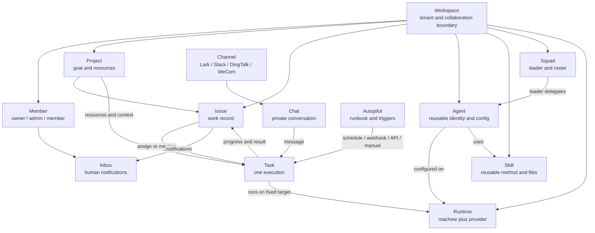
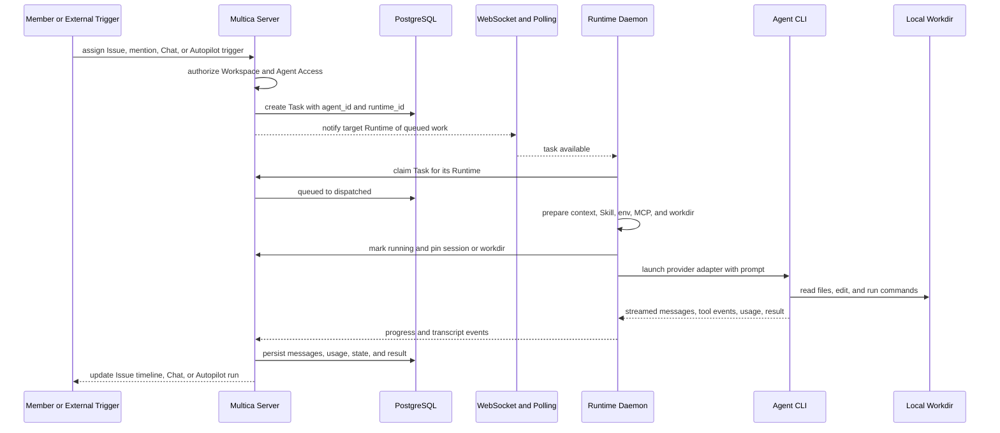
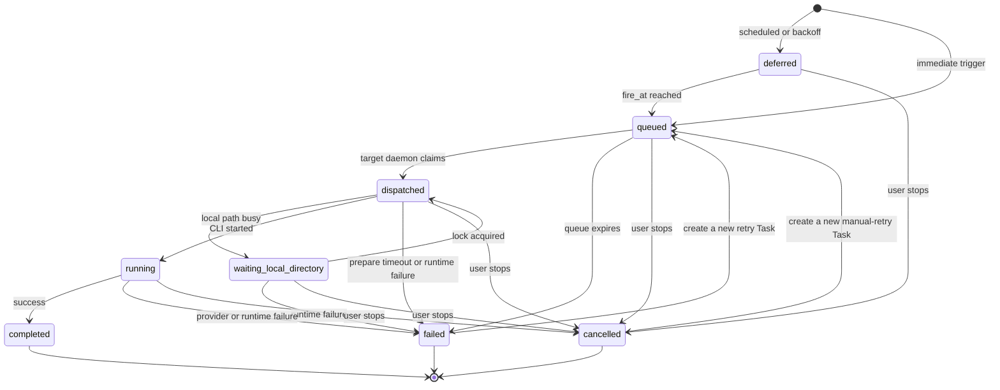
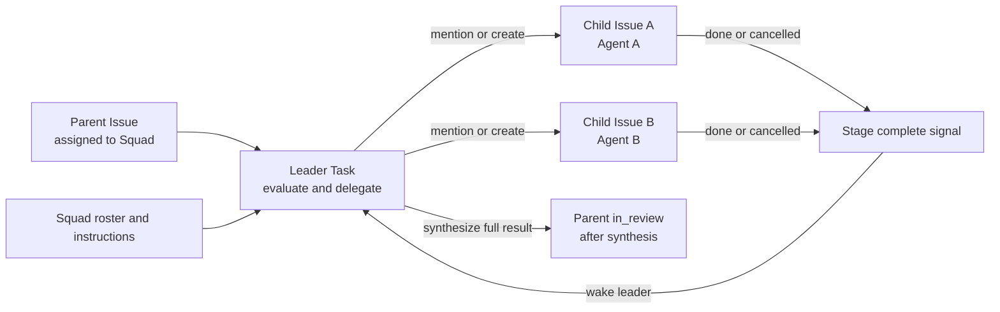
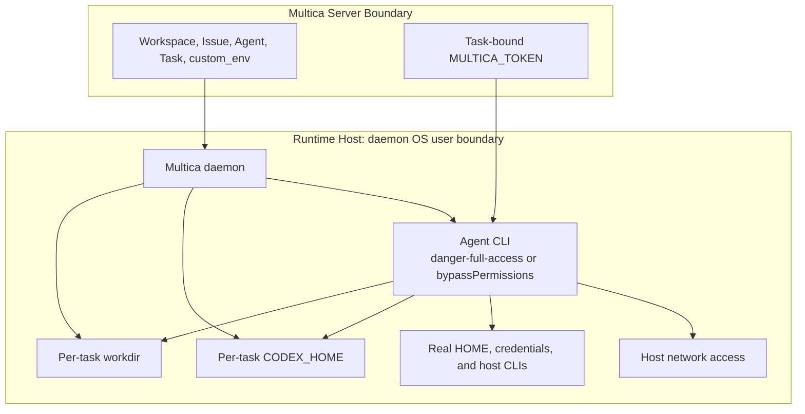
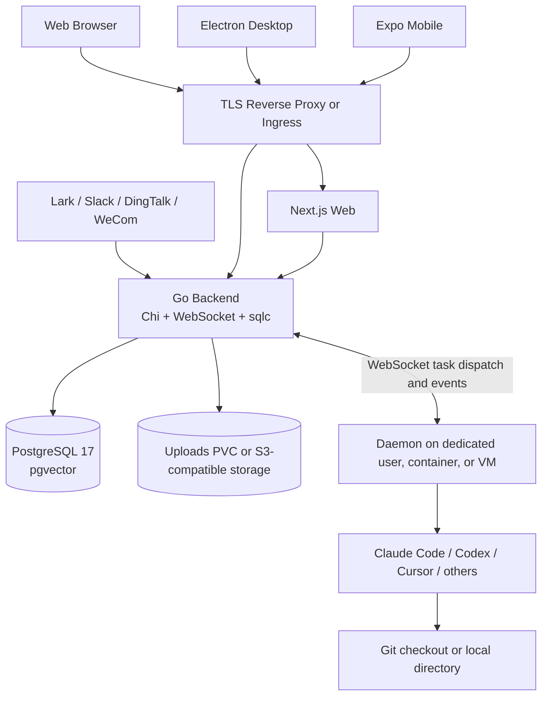

# Multica 深度技术文档

> **AI-native 团队任务管理、coding agent 协作编排、本地执行与自托管架构解析**
>
> 基于 Multica 官方仓库和官方文档整理：<https://github.com/multica-ai/multica>
>
> 稳定版本基线：annotated tag `v0.4.21` 解引用后的 `0dfaac266eed3b7ac710de33d8207e4f71cfb20b`；发布后快照：`main@47f6e970f6a00c3da3a75172e156f9edd75fa380`；审校日期：2026-08-07。正文的产品契约、默认参数和部署行为只以 `v0.4.21` 的 peeled source commit 为准；发布后快照只记录审校时的分支边界，不纳入稳定版兼容承诺。项目使用自定义 Multica License，许可证边界见第十一章。


> 图片来源：Multica 官方仓库 [`docs/assets/hero-board.png`](https://github.com/multica-ai/multica/blob/0dfaac266eed3b7ac710de33d8207e4f71cfb20b/docs/assets/hero-board.png)，固定到 `v0.4.21` exact source commit；本仓库不复制该二进制文件。

---

## 目录

- [自动生成目录占位](#自动生成目录占位)

---

## 第一章：产品定位与证据边界

### 1.1 一句话定位

Multica 是一个 **AI-native 团队任务管理与 coding agent 编排平台**。它把人、Agent、Issue、Project、评论、执行记录和自动化放在同一个 Workspace 中，再把每次 Agent 执行调度到团队连接的 Runtime。

一句话概括：

> **Multica 在服务端保存协作状态和执行计划，在连接电脑的 daemon 中启动本地 coding agent CLI；它管理“谁因为什么工作、在哪个 Runtime 上执行”，但不提供通用执行 Sandbox。**

这个定位有三层含义：

| 层次 | Multica 负责什么 | 不负责什么 |
| --- | --- | --- |
| 团队工作层 | Workspace、Project、Issue、评论、状态、成员、Inbox | 不替团队定义验收标准，不自动判断 Issue 是否真正完成 |
| Agent 编排层 | Agent 配置、Skill、Squad、Autopilot、Task、Access、Runtime 绑定 | Agent 不是常驻进程，Squad 也不是同时启动所有成员的分布式执行器 |
| 本地执行层 | daemon 领取 Task、准备上下文、启动 provider CLI、流式回传记录 | 不提供 microVM、容器逃逸防护或宿主机文件系统安全边界 |

Multica 的核心产品价值不是“给模型一台隔离机器”，而是把 coding agent 变成有身份、负责人、上下文、历史和调用权限的团队协作者。实际命令仍由用户已经安装并登录的 Claude Code、Codex、Cursor 等 CLI 在 Runtime 所在机器执行。

### 1.2 适合的使用场景

| 场景 | 使用方式 | 形成的记录 |
| --- | --- | --- |
| 持续交付一项工程工作 | 把 Issue 分配给 Agent 或 Squad | Issue 时间线、状态、每次 Task transcript |
| 临时请 Agent 处理新信息 | 在 Issue 评论中 @Agent | 不改变负责人，新增一次 Task |
| 私人探索或快速提问 | Chat 中发送消息 | 私有 Chat session 与逐轮 Task |
| 周期性或事件驱动工作 | Autopilot 的 schedule、webhook、API 或手动触发 | Autopilot run，按模式可附带 Issue |
| 在现有聊天工具中调用 | 飞书/Lark、Slack、钉钉、企业微信 Channel | 外部会话映射到 Multica Chat 与 Task |
| 多角色协作 | 把 Issue 分配给 Squad | leader 评估、委派评论、成员 Task、父子 Issue |

### 1.3 不应混淆的边界

1. **Issue 不是 Task。** Issue 是持续存在的工作记录；Task 是某个 Agent 的一次执行。
2. **Agent 不是 Runtime。** Agent 是可复用身份与配置；Runtime 是一台连接电脑上的一种 provider 执行环境。
3. **Runtime 不是 Sandbox。** daemon 直接以其操作系统用户启动 CLI，默认继承该用户可访问的文件、凭据和网络。
4. **Squad 不是并行执行开关。** Squad 先运行 leader，由 leader 通过评论提及或子 Issue 委派成员。
5. **Task `completed` 不是 Issue `done`。** 前者只说明一次进程执行正常结束，后者表达团队对工作结果的最终状态判断。

### 1.4 本文的版本与证据规则

本文使用以下优先级：

1. `v0.4.21` peeled commit 中的数据库 migration、Go 服务端、daemon 和 provider adapter 源码；
2. 同一 commit 中的中文官方文档、`README.zh.md` 和自托管指南；
3. annotated tag 与 GitHub Release 元数据；
4. 发布后 `main@47f6e970...` 只用于说明“审校时 main 已经前进”，不证明任何稳定行为。

本文所有 GitHub 稳定行为链接都固定到 tag 或 40 位 exact commit，不使用浮动 `main`/`master` URL。官网路由适合日常阅读，但未来可能随发布更新；需要审计时应回到附录 E 的固定源码链接。

---

## 第二章：核心对象模型

### 2.1 十三个核心对象

| 对象 | 所属范围 | 核心职责 | 关键关系 |
| --- | --- | --- | --- |
| Workspace | 顶层租户边界 | 容纳成员、工作、Agent 和共享设置 | Project、Issue、Agent、Skill 等均归属于一个 Workspace |
| Project | Workspace | 组织共同目标下的 Issue，提供描述和仓库/目录资源 | 一个 Issue 最多属于一个 Project |
| Issue | Workspace/Project | 保存目标、讨论、负责人、状态和历史 | 可分配给 member、Agent 或 Squad；可形成父子关系 |
| Agent | Workspace | 保存身份、指令、模型、Skill、Access 和执行配置 | 绑定一个 Runtime；每次触发生成 Task |
| Runtime | Workspace | 表示一台连接电脑上的某个 provider 或自定义协议实例 | daemon 注册；Agent 和 Task 通过 `runtime_id` 绑定 |
| Task | Workspace | 记录 Agent 的一次具体执行及其状态、消息、用量和结果 | 由 Issue、评论、Chat 或 Autopilot 触发，在一个 Runtime 执行 |
| Skill | Workspace | 保存可复用的 `SKILL.md`、脚本、模板和参考资料 | 可挂载给多个 Agent，后续 Task 获取其内容 |
| Squad | Workspace | 由 leader Agent 协调多名 Agent 或成员 | 分配后先触发 leader，再由 leader 委派 |
| Autopilot | Workspace | 保存 Runbook、执行方、触发器和输出模式 | schedule/webhook/API/manual 生成 run 与 Task/Issue |
| Chat | 用户私有会话 | 提供不依附 Issue 的一对一多轮交互 | 每条输入产生 Task，尽量延续同一 CLI session |
| Channel | Workspace 集成 | 把外部聊天消息映射到 Multica Chat/命令 | 支持飞书/Lark、Slack、钉钉、企业微信 |
| Inbox | 人类成员 | 汇总分配、提及、评论、失败和自动化通知 | 只服务人类；Agent 不读取 Inbox，`@all` 不包含 Agent |
| Member | Workspace | 以 owner/admin/member 角色参与协作和管理 | 工作区角色与 Agent Access 是两套权限轴 |

### 2.2 对象关系图



这张图中最重要的分离是：**协作对象保存在服务端，执行发生在 Runtime，Task 把二者连接起来。** Workspace 是数据边界，但不是 daemon 主机上的操作系统权限边界。

### 2.3 Workspace 与 Project

Workspace 是顶层隔离范围。成员、Issue、Project、Agent、Skill、Runtime、Autopilot 和执行记录都带 Workspace 归属。成员切换 Workspace 只改变当前视图，不会移动数据。

Project 是组织层而不是执行器：

- Project 描述会进入其中 Task 的上下文；
- Project 可以绑定 Git 仓库或指定 Runtime 上的本地目录；
- Project lead 可以是成员或 Agent，但设置 lead 不会自动触发 Agent；
- Project 状态与其 Issue 状态彼此独立；
- 本地目录资源会被直接修改，因此会引出目录锁和更强的安全风险。

### 2.4 Issue 的七种状态

`v0.4.21` 固定七种 Issue 状态：

| 状态 | 产品语义 |
| --- | --- |
| `backlog` | 暂不启动；已分配 Agent/Squad 的 Issue 离开 backlog 后才触发 |
| `todo` | 工作已明确，等待开始 |
| `in_progress` | 正在处理 |
| `in_review` | 已有结果，等待检查 |
| `done` | 已完成 |
| `blocked` | 暂时无法继续 |
| `cancelled` | 不再继续，但保留记录 |

服务端只验证状态值是否属于这个全集，**没有强制的 Issue 状态机**。成员和 Agent 可以直接从任意有效状态改到另一有效状态；常见的 `todo -> in_progress -> in_review -> done` 是协作约定，不是 API 转换图。

服务端也不会因为 Task 开始或完成就一般性地自动推进 Issue。固定版本存在两个明确的系统例外：

- 最后一条活动 Task 失败且没有后续重试时，`in_progress` 可回到 `todo`；
- 带关闭意图的关联 GitHub PR 合并，且没有其他 open/draft 关联 PR 时，Issue 可变为 `done`。

因此，**Task 完成不等于 Issue 完成**。应由 Agent 按指令把交付推进到 `in_review`，再由人类或既有集成确认 `done`。

### 2.5 Issue 的父子关系

父 Issue 保存整体目标，子 Issue 独立拥有负责人、状态和执行记录。父子状态不会简单级联：子 Issue `done` 不会直接把父 Issue 标记为 `done`。

子 Issue 可以设置 stage。某一 stage 的子 Issue 全部进入 `done` 或 `cancelled` 后，系统向父 Issue 发出协调信号；若父负责人是 Agent 或 Squad leader，会触发它重新综合结果、推进下一阶段或把父 Issue 移到 `in_review`。这是一条 **通知与再评估链路**，不是自动完成链路。

---

## 第三章：从触发到结果的完整执行链

### 3.1 四类触发入口

| 入口 | 触发语义 | 是否依附 Issue | 是否改变负责人 |
| --- | --- | --- | --- |
| Issue 分配 | Agent/Squad 持续负责；非 backlog 时创建 Task | 是 | 是 |
| 评论提及或回复路由 | 处理本条新信息，可一次提及多个目标 | 是 | 否 |
| Chat/Channel 消息 | 每条输入触发一轮 Agent 执行 | 否 | 不适用 |
| Autopilot | schedule、webhook、API 或手动运行 Runbook | 取决于输出模式 | 取决于输出模式 |

Agent 不会自己轮询看板决定开工。每次执行都必须能追溯到明确触发源，并产生一条独立 Task 记录。

### 3.2 端到端时序



### 3.3 服务端的调度职责

触发发生后，服务端依次处理：

1. 确认用户属于 Workspace，且触发面允许这类操作；
2. 根据 Agent Access 判断调用者能否运行目标 Agent；
3. 读取 Agent 当时绑定的 `runtime_id`；
4. 把 Agent、Runtime、Issue/Chat/Autopilot、触发证据和上下文快照写入 Task；
5. 通过 WebSocket 通知目标 daemon，并保留轮询/心跳补偿路径；
6. 接受 daemon 的 claim、start、message、usage、complete/fail/cancel 更新；
7. 把状态和结果广播给 Web/Desktop/Mobile/Channel 客户端。

数据库里的 Task 自创建起就带 `runtime_id`。它不是“找任意空闲机器”的无目标队列。

### 3.4 daemon 的执行职责

daemon 运行在用户连接的电脑上，负责：

- 探测 PATH 中可用的 provider CLI 并注册 Runtime；
- 保持 WebSocket、心跳和轮询补偿；
- 只领取属于本 daemon Runtime 的 Task；
- 准备 per-task workdir、上下文文件、Skill、环境变量、MCP 和会话状态；
- 通过统一 adapter 启动 CLI 子进程；
- 标准化文本、工具调用、usage、session ID、错误和终态；
- 响应取消，结束进程树并回传最终状态。

服务端不代替 daemon 运行 shell 命令，也不会自动上传整个工作目录。不过 Agent 主动写回的代码片段、日志、评论、附件或结果会成为 Multica 服务端数据。

### 3.5 Runtime 固定绑定与不迁移语义

**Task 与目标 Runtime 固定绑定且不会自动迁移。** 如果 Agent 绑定在 laptop A 的 Codex Runtime，Task 就写入 A 对应的 `runtime_id`；A 离线后，Task 会等待 A 恢复或按规则失败，不会偷偷转移到 server B 的 Codex Runtime。

这个设计保护三类局部状态：

- 本地仓库、未提交文件和指定目录只存在于目标机器；
- provider CLI 的登录凭据和 session 文件属于该机器；
- Task 级 workdir 和 `CODEX_HOME` 可能只存在于原 daemon。

修改 Agent 的 Runtime 影响之后新建的 Task，不会重写已存在 Task 的目标。手动重试历史 Task 也优先保留原 Agent、Runtime、workdir 和安全可恢复的 session；若本地目录已经不存在，才创建新目录。

---

## 第四章：Task 生命周期、超时与重试

### 4.1 Task 的八种状态

`v0.4.21` 的 Task 状态全集是：

| 状态 | 含义 | 是否可由 daemon 领取 |
| --- | --- | --- |
| `deferred` | 已安排在未来触发或等待持久化条件，达到 `fire_at` 后转为 queued | 否 |
| `queued` | 等待目标 Runtime 领取 | 是 |
| `dispatched` | daemon 已领取，正在准备上下文和 CLI | 已领取 |
| `waiting_local_directory` | 目标本地目录被其他 Task 持锁，等待释放 | 已领取但未启动 CLI |
| `running` | provider CLI 正在执行 | 正在执行 |
| `completed` | 本次执行正常结束 | 终态 |
| `failed` | 执行出错、Runtime 丢失或超时 | 终态 |
| `cancelled` | 用户或生命周期操作取消 | 终态 |

### 4.2 状态图



### 4.3 排队、启动与心跳

默认规则如下：

- `queued` 超过 **2 小时**仍未领取，会变为 `failed`，原因为 `queued_expired`，且 queue expiry 本身不自动重试；
- `dispatched` 停留超过 **5 分钟**会按失败处理；
- `waiting_local_directory` 没有独立时长上限，目录锁释放后回到启动流程；
- `running` 没有固定服务端执行上限，只要 Runtime 心跳正常，长任务不会仅因运行时间长被杀死；
- daemon 默认每 **15 秒**发送心跳；服务端 stale threshold 为 150 秒，加上 sweeper 周期后，异常退出通常最迟约 **3 分钟**显示离线；
- daemon 自身的绝对 `agent_timeout` 默认是 0，即不设硬上限，但无消息 idle watchdog 默认 30 分钟、单个工具调用 watchdog 默认 2 小时。

`running` 的“没有固定上限”不等于永不失败。daemon 会按 provider 事件和 watchdog 判断停滞；Runtime 离线时，关联运行中 Task 会失败并进入统一重试判定。

### 4.4 本地目录锁

Project 可以把 Task 指向 Runtime 上的现有本地目录。两个并发 Task 同时修改同一路径容易破坏 checkout，因此 daemon 对本地目录加锁：

1. Task 已从队列领取，先进入 `dispatched`；
2. 若目录正被其他 Task 使用，切为 `waiting_local_directory` 并记录 `wait_reason`；
3. 锁释放后继续准备，进入 `running`；
4. 用户可以在等待期间取消 Task。

目录锁是并发协调，不是文件系统安全隔离。拿到锁的 Agent 仍拥有 daemon OS 用户对该目录以及其他可访问路径的权限。

### 4.5 取消语义

用户可从执行日志停止 deferred、queued、dispatched、waiting 或 running Task。对于正在运行的 CLI，daemon 会取消上下文并尝试终止整个进程组，避免只杀父进程而遗留工具子进程。

以下两个产品语义必须单独记住：

- **修改负责人不会停止活动 Task。** 新负责人可产生新 Task，并与旧 Task 并行；
- **修改 Issue 状态不会停止活动 Task。** 即使把 Issue 改成 `cancelled`，也不会隐式取消进程。

需要停止执行时必须显式取消对应 Task。删除 Issue、归档 Agent 或移除 Runtime 所有者等生命周期操作会取消关联活动 Task，因为其所属对象不再可执行。

### 4.6 自动重试预算

普通 Task 的 `max_attempts` 默认是 2，因此 **普通任务最多两次执行**：首次执行加一次自动重试。自动重试只覆盖明确的临时故障：

| 失败原因 | 默认执行次数上限 | 会话处理 |
| --- | --- | --- |
| `runtime_offline` | 2 | 尽量复用安全 session/workdir |
| `runtime_recovery` | 2 | daemon 重启回收后重试 |
| `timeout` | 2 | 按失败原因决定是否复用 |
| `codex_semantic_inactivity` | 2 | 会话被视为污染，原 workdir 上开启新会话 |
| `agent_error.skill_bundle_unavailable` | 2 | CLI 尚未启动，已下载 bundle 可走缓存 |
| `agent_error.provider_network` | 3 | 第一次失败后立即重试；第二次失败后约 5 秒再进行最终尝试 |

因此，**工具网络中断最多三次执行**。provider 鉴权、配额、模型不存在、配置错误、上下文溢出、普通进程失败等不会一般性自动重试，应先修正根因再手动重试。

Autopilot 的 **“仅运行”模式不自动重试**。其 Task 带 `autopilot_run_id`，共享重试函数会排除它，避免与下一次计划运行重叠。Autopilot 的“创建 Issue”模式生成普通 Issue Task，仍适用上述基础设施故障重试规则。

### 4.7 手动重试与重新运行

执行日志中的“重试”针对一条历史 Task：

- 使用当时执行该 Task 的 Agent，即使 Issue 后来换了负责人；
- 尽量复用原 workdir；
- 仅在 session 安全且仍能由原 Runtime 访问时继续会话；
- 对上下文溢出、无效请求、语义停滞等污染会话的失败，在原目录创建新会话；
- 原目录丢失时创建新工作目录。

`multica issue rerun <issue-id>` 的语义不同：它没有指定历史 Task，使用 Issue 当前 Agent 负责人，并从新 session 和新 workdir 开始。

### 4.8 Task 与 Issue 的状态分离

不要把以下事件画成同一个状态机：

| 事件 | Task | Issue |
| --- | --- | --- |
| Agent 进程成功退出 | `completed` | 保持当前状态，除非 Agent 自己显式更新 |
| Agent 提交结果等待检查 | `completed` | 常见约定是 Agent 写为 `in_review` |
| Task 被取消 | `cancelled` | 不自动改成 `cancelled` |
| Issue 被改成 `cancelled` | 活动 Task 继续 | `cancelled` |
| 最后一个 Task 失败且无重试 | `failed` | 若原为 `in_progress`，系统可回滚到 `todo` |

这也是 Multica 保留多条 Task transcript 的原因：Issue 是协作主记录，每次尝试只是它的一段执行历史。

---

## 第五章：Agent 配置与权限模型

### 5.1 Agent 是配置，不是进程

Agent 是一套可复用的团队身份与执行配置。没有工作时，它不会在后台保持一个模型会话或 CLI 进程；触发时才产生 Task，由 daemon 启动子进程。

主要配置包括：

| 配置域 | 内容 | 生效时机 |
| --- | --- | --- |
| 身份 | 名称、头像、描述、owner | 展示和归属；描述不自动进入 prompt |
| 行为 | instructions | 每次执行 |
| 知识与方法 | Workspace context、Project context、Skill | daemon 准备 Task 上下文时 |
| 推理 | provider、model、thinking level/service tier | adapter 启动 CLI 时 |
| 执行目标 | Runtime | Task 入队时快照为 `runtime_id` |
| 能力 | MCP、connected apps、CLI custom args | daemon 生成运行配置时 |
| 环境 | `custom_env` | 服务端保存，执行时发送给 daemon |
| 并发 | `max_concurrent_tasks` | 服务端 claim 与 daemon 总容量共同约束 |
| 调用权限 | Access | 每个分配、提及、Chat、Autopilot 等触发面 |

修改模型、指令或 Skill 不会生成新 Agent，也不会改写历史 Task；后续 Task 使用新配置。

### 5.2 工作区角色与 Agent Access 是两条轴

工作区角色控制管理权限：

| 角色 | 典型能力 |
| --- | --- |
| `owner` | 全部工作区设置、成员 owner 变更、删除 Workspace |
| `admin` | 大部分设置、成员管理、查看和管理 Agent |
| `member` | 日常协作，按各资源规则创建和使用 |

Agent Access 控制 **谁能触发这个 Agent**：

| UI Access | 固定版本底层模型 | 谁可以运行 |
| --- | --- | --- |
| 仅自己（Only me） | `permission_mode=private` | 只有 Agent owner |
| 整个工作区（Entire workspace） | `public_to` + workspace target | 所有 Workspace member |
| 指定成员（Specific people） | `public_to` + member targets | Agent owner 与指定成员 |

工作区 `owner` 和 `admin` 可以查看、编辑或归档 Agent，但 **owner/admin 不能绕过 Access** 去运行别人设置为“仅自己”的 Agent。管理权不等于调用权，这是为了防止管理员借私有 Agent 读取其 owner 的连接应用或执行上下文。

Access 在分配、@提及、Chat、Autopilot 和 Squad leader 等入口统一校验。把 Agent 加入 Squad 也不会扩大其调用权限。

### 5.3 Skill 的交付模型

Skill 以 `SKILL.md` 为主文件，可附带 `references/`、`templates/` 和 `scripts/`。它适合保存可复用的工作方法，而 Agent instructions 保存该身份长期不变的职责与边界。

Skill 有两类来源：

- Workspace Skill：保存在 Multica 服务端，可绑定给多个 Agent；
- Runtime/repository local Skill：例如 `.claude/skills/`、`.agents/skills/`，由本地 CLI 或 daemon 按 provider 规则发现。

外部 Skill 可能携带脚本和不安全指令。Multica 不替用户审查、签名或隔离导入内容；Skill 的信任边界最终仍落在 daemon OS 用户上。

### 5.4 `custom_env` 与 MCP

`custom_env` 用于把 provider key、base URL、云凭据或工具变量传给 Agent 子进程。固定版本 migration 把它定义为 `agent.custom_env JSONB NOT NULL DEFAULT '{}'`，管理 API 可在授权和审计后返回 plaintext map。

因此必须明确：**`custom_env` 值会以明文 JSONB 存入 Multica 服务端 PostgreSQL 数据库。** UI 遮罩、专用读取 endpoint 和读取审计可以降低误暴露概率，但不等于数据库加密。数据库备份、只读副本、管理员查询和泄漏响应都必须把它当 secret 处理。

MCP 配置同样可能包含凭据或远端 endpoint。Agent owner 与管理者的“可编辑”能力、Agent Access 的“可触发”能力，以及任务进程最终获得的环境权限，应在生产 threat model 中分别审查。

### 5.5 并发上限

Agent 默认 `max_concurrent_tasks=6`，允许配置范围是 1 到 50。daemon 默认最多并行 20 条 Task。实际可运行并发取多个约束中的较小值：

```text
effective concurrency
  = min(agent max_concurrent_tasks,
        daemon max concurrent slots,
        target runtime available work,
        local directory lock availability)
```

提高数字会同时放大 CPU/内存/磁盘压力、provider 账号并发、token 成本、仓库冲突和宿主凭据暴露面，不能只按队列长度调优。

---

## 第六章：Runtime、daemon 与 provider adapter

### 6.1 Runtime 注册模型

一台机器运行一个 daemon，可以连接多个 Workspace，并为检测到的每个 provider 注册 Runtime。Runtime 记录：

- Workspace、daemon ID、机器名称和 owner；
- provider/protocol family 与 CLI 版本元数据；
- online/offline、`last_seen_at` 和可见性；
- 内置 provider 或自定义 Runtime Profile；
- 本地 Skill、模型列表和连接能力探测结果。

同一 daemon 可同时注册 Claude Code、Codex、Cursor 等多个 Runtime。重启 daemon 会更新原 Runtime 记录，不应无限创建重复行。

### 6.2 私有与公开 Runtime

本地 Runtime 默认是 private：Runtime owner 和 Workspace owner/admin 可以在其上创建或绑定 Agent。Runtime 可改为 public，让其他 Workspace member 选择该执行环境。

“public”只放宽 **绑定 Agent 到该 Runtime** 的权限，不会把 CLI 登录凭据复制给其他用户。但一旦他们有权触发绑定的 Agent，Task 进程会在那台机器上执行，因此 Runtime owner 必须把主机权限和 Agent Access 一并审查。

### 6.3 默认工作目录

daemon 的 Task 环境默认位于 `~/multica_workspaces/` 之下，并按 Workspace/Issue/Task 管理 workdir、session 和可回收 artifact。Git 资源通常生成独立 checkout；显式 local-directory 资源则直接使用既有路径并加目录锁。

这些路径主要解决并发和状态复用：

- 不同 Task 避免在同一 checkout 上互相覆盖；
- 重试可以复用原目录中的未提交工作；
- Codex 使用 Task 级 `CODEX_HOME` 保存 rollout、配置和 Skill；
- daemon GC 可按完成状态和 TTL 回收缓存、artifact 与孤儿目录。

它们不限制进程读取 `~/multica_workspaces/` 之外的文件。

### 6.4 单 daemon 并发与隔离

`MULTICA_DAEMON_MAX_CONCURRENT_TASKS` 默认是 20。daemon 使用 slot semaphore 控制总并发，并为每个 Runtime 启动独立心跳/领取路径，避免一个 provider 的慢请求阻塞同机其他 Runtime。

但“每个 Task 一个目录”不等于“每个 Task 一个操作系统用户”。同一 daemon 的所有 Task 默认共享：

- daemon OS 用户；
- 真实 `HOME` 和 `XDG_*`；
- PATH 中 CLI 与其全局登录状态；
- 主机网络命名空间；
- 未被外层容器/VM 隔开的设备和挂载。

### 6.5 provider adapter 的职责边界

daemon 内部的统一 `Backend.Execute()` 接口接收 prompt、cwd、model、timeout、env、MCP、session 等选项。每个 provider adapter 负责：

1. 构造该 CLI 的无人值守参数和输入方式；
2. 启动进程并管理取消/超时；
3. 解析 provider 特有的 JSON/ACP/stream 输出；
4. 归一化 text、tool use/result、status、usage、session ID 和 error；
5. 按 provider 能力处理 resume、Skill、MCP 和 thinking/model 参数。

adapter **不提供模型、不代替用户购买额度、不自动完成 CLI 登录，也不构成 Sandbox**。CLI 的版本兼容、认证文件、云网络和 provider 服务可用性仍属于 Runtime 运维。

### 6.6 自定义 Runtime Profile

自定义 Runtime Profile 允许团队把内部 wrapper 或固定命令映射到已有协议族。它包含 display name、protocol family、command name、fixed args、visibility 和 enabled 状态。

它不会创造第 21 种通信协议。自定义命令必须兼容所选的 20 种 protocol family 之一；配置字段不是 shell script，pipe、重定向、`&&`、`;`、反引号和环境变量展开应放进受审计的 wrapper script。

---

## 第七章：Squad、Chat、Autopilot 与 Channel 协作

### 7.1 Squad 的 leader 委派模型

Squad 由一个必需的 leader Agent 和若干 Agent/member 组成。把非 backlog Issue 分配给 Squad 后，只给 leader 创建 Task，不会直接 fan-out 全体成员。

leader 的工作流是：

1. 读取父 Issue、Squad roster、角色说明和 Squad instructions；
2. 首次接单时按约定把父 Issue 推到 `in_progress`；
3. 选择成员，通过带 `mention://` 的评论或创建子 Issue 委派；
4. 记录 squad activity/evaluation；
5. 停止本轮，等待成员进展；
6. 被成员回复或子 Issue stage 完成信号再次唤醒；
7. 综合交付，整体目标达成时把父 Issue 推到 `in_review`。

leader 第一次成功派活不代表父 Issue 完成。Squad 通过 Issue/评论协议协作，而不是共享一个隐式内存或同一 CLI 进程。

### 7.2 父子 Issue 协作



stage 是有序 barrier，而非自动 DAG scheduler。leader 仍需检查子 Issue 描述和真实依赖，再决定是否把下一 stage 从 `backlog` 提升到 `todo`。

### 7.3 Chat

Chat 是用户与一个 Agent 的一对一私有会话：

- 不默认绑定 Issue，也不自动得到看板上下文；
- 可以挂 Project context；
- 每条消息创建一条 Task；
- 后续消息尽量复用原 CLI session，并路由到持有该 session 的 Runtime；
- Workspace 其他成员和管理员不能读取该 Chat；
- Agent 仍可按调用者权限通过 Multica CLI 查询或修改 Workspace 对象。

Chat 适合探索和私有草稿；需要负责人、状态、团队可见历史和交付确认时，应使用 Issue。

### 7.4 Autopilot

Autopilot 保存 Runbook、Agent/Squad 执行方、可选 Project、输出模式、订阅者和触发器。触发器支持：

- 五字段 cron schedule 和 IANA timezone；
- webhook，支持 token、可选签名、256 KiB body 上限和幂等键；
- API 触发；
- UI/CLI 手动立即运行。

两种输出模式的差异：

| 模式 | 生成对象 | Runtime 离线 | 自动重试 |
| --- | --- | --- | --- |
| 创建 Issue（`create_issue`） | Issue + 普通 Task | Task 可排队等待 | 临时基础设施故障按普通 Task 规则 |
| 仅运行（`run_only`） | Autopilot run + Task，无 Issue | 触发时不可用则可跳过 | 不自动重试 |

持续失败保护会检查过去 7 天至少 50 次终态运行；失败率达到 90% 时暂停 Autopilot 并通知创建者。

### 7.5 Channel

固定版本支持飞书/Lark、Slack、钉钉和企业微信：

| Channel | 私聊 | 群聊触发 | 连接方式 | 会话粒度 |
| --- | --- | --- | --- | --- |
| 飞书/Lark | 直接消息 | 必须 @Bot | 平台长连接 | 按 chat |
| Slack | 直接消息 | 必须 @Bot | Socket Mode | 私聊按 channel，群聊按 thread |
| 钉钉 | 直接消息 | 必须 @Bot | Stream 模式 | 按 conversation |
| 企业微信 | 直接消息 | 必须 @Bot | 平台 WebSocket 长连接 | 按 chat |

消息先完成外部账号绑定和 Workspace member 校验，再进入映射 Chat 并创建 Task。群聊中没有 @Bot 的消息不会触发，也不会加入 Agent 上下文。`/issue` 是创建命令，不是普通 Chat turn。

自托管需要为各 Channel 配置独立的 32 字节加密 key，以加密 Bot 凭据。企业微信还有后端单副本限制，见第十章。

### 7.6 Inbox 只服务人类

Inbox 汇总 Issue 分配、订阅动态、评论、成员提及、Agent 执行失败和 Autopilot 通知。它不是完整审计日志，详情仍在 Issue 或 run 中。

Agent 不读取 Inbox，也不会收到 `@all`。对 Agent 的 @提及不是通知，而是直接创建 Task。这避免了“Agent 自己何时处理通知”的模糊后台循环：执行始终由可审计触发动作产生。

---

## 第八章：安全模型与无 Sandbox 边界

### 8.1 真正的边界是 daemon OS 用户

默认情况下，Task 继承 daemon 操作系统用户的文件、凭据和网络权限：

- 该用户可读写的文件，Agent 进程原则上都可读写；
- `gh`、`aws`、`kubectl`、`gcloud`、`glab`、SSH 等宿主 CLI 的登录状态可被使用；
- 真实 `HOME`、`XDG_*` 和网络访问默认保留；
- Agent 可以安装依赖、运行构建，也可能读取无关 secret 并通过网络外传。

Multica 不对文件系统 Sandbox 作通用保证。把 daemon 跑在个人日常账号下，意味着 Task 可能读取个人 SSH 私钥、修改 shell 配置或删除该用户有权限删除的文件。

### 8.2 默认 provider 权限模式

为了无人值守执行，固定版本主动配置宽松权限：

- Codex 默认写入 `sandbox_mode = "danger-full-access"`；
- Claude Code 默认带 `--permission-mode bypassPermissions`；
- daemon 还会自动处理无法交互的审批流程。

Windows 上存在一个窄例外：若用户明确配置 Codex 原生 `windows.sandbox`，daemon 会保留 `workspace-write`；配置不可判定时也 fail closed。这个 opt-in 不改变跨平台的部署结论：生产上仍应把每个 Task 视为无 Sandbox，并在 daemon 外层建立边界。

### 8.3 影响面收敛不等于防逃逸



以下机制是有价值的影响面收敛，但 **不构成防逃逸边界**：

| 机制 | 能解决什么 | 不能解决什么 |
| --- | --- | --- |
| Task 级 workdir | 减少并发 checkout 冲突，支持重试复用 | 不能阻止进程访问目录外文件 |
| Task 级 `CODEX_HOME` | 隔离 Codex rollout、配置和 Skill | 不能隔离真实 HOME 中其他凭据 |
| Task 级 `MULTICA_TOKEN` | 把 Multica API 身份绑定到 Agent 与 Task | 不能限制宿主文件和外部网络，也不是通用 capability sandbox |
| Agent Access | 限制谁能触发 Agent | 不能在进程启动后约束 OS 权限 |
| Channel/secret UI 遮罩 | 降低界面误展示 | 不能加密 `custom_env` 数据库值 |
| 本地目录锁 | 防止同路径并发修改 | 不是安全 ACL |

### 8.4 `custom_env` 的明文风险

`custom_env` 在服务端数据库中是普通 JSONB。授权 endpoint 可以取回真实值，并记录 reveal/update activity；这说明它的保护依赖应用鉴权、数据库访问控制、传输安全和备份治理，而不是字段级密文。

生产原则：

1. 不把“本地执行”误解成“所有 secret 都只留本机”；
2. 能通过 Runtime 本地 credential chain 提供的 secret，不重复放入 `custom_env`；
3. 必须放入时使用最小权限、短期、可轮换凭据；
4. 数据库备份与日志导出不得进入普通开发者可读位置；
5. 轮换 secret 时同时审计 Agent env、MCP、Channel key、VCS token 和 daemon 用户 home。

### 8.5 推荐隔离层级

| 层级 | 部署方式 | 适合场景 | 注意事项 |
| --- | --- | --- | --- |
| 基础 | 专用 Unix 用户 | 受信团队、单机 Runtime | 只授予需要的仓库与凭据，禁止使用个人 home |
| 中等 | 容器内运行 daemon | 需要限制挂载和进程可见性 | 只挂载必要目录/secret；rootless、seccomp、只读层和网络策略需单独配置 |
| 强 | 专用 VM | 不可信输入、高价值凭据、强故障域 | 使用短期实例、独立磁盘/网络、最小云 IAM |

无论选择哪一层，都应使用专用部署 key、只读或按仓库细分的 VCS token、受限云 IAM、独立 Kubernetes service account 和 egress allowlist。不要把个人 SSH key、云管理员凭据或无关生产 kubeconfig 留在 daemon 用户可达路径。

### 8.6 安全评审问题

- 谁可以通过 Agent Access 触发这个 Runtime 上的进程？
- Task 内容是否来自外部 webhook、公共 Issue、Channel 或不可信附件？
- daemon 用户能访问哪些仓库、socket、设备、云 metadata 和内网 endpoint？
- `custom_env`、MCP、VCS 和 Channel 凭据存在哪里，谁能读取备份？
- provider CLI 的默认权限和当前版本是否与固定基线一致？
- 容器/VM 被攻破后，横向移动的 IAM 和网络路径是什么？
- 是否能按 Task、Agent、Runtime 和负责人关联 transcript、用量与系统日志？

---

## 第九章：自托管架构与部署

### 9.1 技术栈

| 层 | 固定版本仓库实现 |
| --- | --- |
| Web | Next.js 16 App Router |
| Desktop | Electron，复用 Web UI packages |
| Mobile | Expo / React Native（iOS） |
| Backend | Go、Chi router、sqlc、gorilla/websocket |
| Database | PostgreSQL 17 + pgvector |
| Local execution | Go daemon + 20 种 provider adapter |
| Packaging | Docker Compose、OCI Helm Chart |

服务端和 Runtime 不在同一个安全域：Backend 可以部署在数据中心或 Kubernetes，daemon 则运行在靠近代码与 CLI 凭据的工作站、构建机、容器或 VM。

### 9.2 自托管拓扑



### 9.3 Docker Compose

官方 Compose 启动三个服务：

- `pgvector/pgvector:pg17` PostgreSQL，数据卷 `pgdata`；
- `multica-backend`，挂载 `backend_uploads`；
- `multica-web` Next.js frontend。

固定生产版本时不要使用 Compose 默认的 mutable `latest`。应在 `.env` 中显式设置：

```dotenv
MULTICA_IMAGE_TAG=v0.4.21
```

Backend entrypoint 先运行 `./migrate up`，成功后再启动 server。Compose 默认只把 frontend/backend 绑定到 `127.0.0.1`；对外访问应由 TLS reverse proxy 转发，不能为了省事直接把原始端口改成 `0.0.0.0`。

### 9.4 Helm

官方 Helm Chart 部署：

- backend Deployment/Service 与可选 5 GiB uploads PVC；
- frontend Deployment/Service；
- 内置 `pgvector/pgvector:pg17` 与默认 10 GiB PVC，或外接 PostgreSQL；
- Ingress、ConfigMap、外部预创建 Secret 和可选 PrometheusRule。

生产应安装与应用版本匹配的 OCI Chart，并再次显式固定镜像：

```yaml
images:
  backend:
    tag: v0.4.21
  frontend:
    tag: v0.4.21
```

Secret 由 `existingSecret` 引用，真实值不应进入 values 文件和 Git。默认 uploads PVC 是 `ReadWriteOnce`；需要多个 backend replica 时，应使用 S3-compatible storage、支持 `ReadWriteMany` 的存储，或明确设计附件共享。

### 9.5 数据存放位置

| 数据 | 默认位置 | 备份对象 |
| --- | --- | --- |
| Workspace/Issue/Agent/Task/Chat/配置 | PostgreSQL | 全量/增量数据库备份与恢复演练 |
| `custom_env`、MCP/Channel/VCS 配置元数据 | PostgreSQL | 按 secret 级别保护数据库备份 |
| 本地附件 | Compose volume 或 Helm uploads PVC | 文件级/PV snapshot，必须与 DB 一致 |
| S3 附件 | S3-compatible bucket | versioning、replication、lifecycle 与恢复演练 |
| 本地代码/workdir/session | daemon Runtime 主机 | 按业务决定；不是服务端数据库备份的一部分 |

服务端备份不能恢复 Runtime 本地未提交代码。需要保留执行产物时，应要求 Agent 提交到 VCS、上传 artifact，或为 Runtime 工作盘建立独立策略。

---

## 第十章：生产运维、可观测性与升级

### 10.1 固定版本与升级顺序

Compose、Chart 和源码示例中的 `latest` 适合快速体验，不适合作为生产变更控制。生产基线应同时固定：

- backend image `v0.4.21`；
- frontend image `v0.4.21`；
- matching Helm Chart version 或固定 Chart digest；
- daemon/CLI `v0.4.21`；
- provider CLI 版本与登录方式；
- PostgreSQL 17/pgvector、附件存储和 reverse proxy 配置。

升级顺序建议：备份 -> staging 恢复验证 -> 检查 migration -> 升级 backend -> 等待 readiness -> 升级 frontend -> 分批升级 daemon -> 运行端到端 Task。回滚不能只回滚 Web 镜像；数据库 migration 的向后兼容与 daemon protocol 也要验证。

### 10.2 自动 migration

容器 entrypoint 在 server 前自动执行 `migrate up`。migrate 命令用 PostgreSQL session-level advisory lock 串行化并发启动 migration；后启动的 replica 等待并在 schema 已更新后 no-op。

这降低了多副本启动竞争，但不取消以下要求：

- 先备份数据库；
- 在 staging 使用真实数据量测试 migration 时间；
- 为 startup probe 留足窗口；
- 阅读 release notes 中的历史 backfill 或 fail-closed guard；
- 确认应用镜像与 schema 版本配套。

### 10.3 Readiness 与 liveness

Backend 同时注册 `/readyz` 和 `/healthz` 到同一个 readiness handler。它检查：

1. PostgreSQL `Ping`；
2. 当前 binary 所需的全部 migration version 是否都存在于 `schema_migrations`。

成功返回：

```json
{"status":"ok","checks":{"db":"ok","migrations":"ok"}}
```

数据库不可用或 migration 缺失时返回 503。Helm 的 startup/readiness/liveness probe 使用 `/healthz`；外部负载均衡也可使用 `/readyz`。注意固定版本的 `/healthz` 不是只检查进程存活，它和 `/readyz` 一样是就绪检查。

### 10.4 数据与附件备份

备份必须同时覆盖 PostgreSQL 与附件：

| 部署 | PostgreSQL | 附件 | 恢复验证 |
| --- | --- | --- | --- |
| Compose | `pgdata` 的一致性快照或 `pg_dump` | `backend_uploads` volume | 恢复到隔离环境，打开 Issue/附件并创建 Task |
| Helm 内置 PG | PostgreSQL PVC snapshot 或逻辑备份 | uploads PVC snapshot | 验证 Secret、schema、附件 key 和 Ingress |
| 外部 PG + S3 | 数据库服务 PITR | bucket versioning/replication | 按同一恢复点核对 DB attachment row 与 object |

`custom_env` 明文存在数据库中，因此备份加密、访问审计、跨区域复制和销毁策略必须按 secret 数据设计。只备份 PostgreSQL 会丢本地附件；只备份 volume 会丢附件元数据与授权关系。

### 10.5 Usage rollup 与调度审计

Usage/Runtime dashboard 读取 `task_usage_hourly`。Backend 内置 scheduler 每 30 秒尝试 claim 当前 5 分钟 UTC plan，并通过 `sys_cron_executions` 的唯一键保证多 replica 只有一个 winner；rollup SQL 还使用 advisory lock 4246 防止重复写入。

生产巡检应查询：

```sql
SELECT job_name, plan_time, status, started_at, finished_at, error
  FROM sys_cron_executions
 WHERE job_name = 'rollup_task_usage_hourly'
 ORDER BY plan_time DESC
 LIMIT 20;
```

同时检查 `task_usage_hourly` 最新 bucket 是否持续推进。新部署不需要额外安装 `pg_cron`；历史外部 scheduler 可作为兼容路径，但确认内置 scheduler 稳定后应避免不必要的双重运维。

### 10.6 企业微信单副本限制

启用 `MULTICA_WECOM_SECRET_KEY` 时，**企业微信后端必须只部署单个副本**。固定版本的企业微信回复只有某个进程持有的 WebSocket 长连接出站路径；在其他 replica 产生的回复无法路由到持 lease 的连接，会被静默丢弃。

Slack 和飞书/Lark 的无状态 HTTP 出站不受这个特定限制，usage rollup scheduler 也支持多 replica。不要把“其他组件可多副本”推导成“企业微信连接可多副本”。

### 10.7 Runtime 运维

日常需要同时观察服务端与本地 daemon：

```bash
multica daemon status
multica daemon logs -f
multica daemon restart
```

排查 Task 不启动时按顺序确认：

1. Task 的 `runtime_id` 是否仍对应预期机器/provider；
2. daemon 是否运行，WebSocket/HTTP 能否访问 Backend；
3. Runtime 的 `last_seen_at` 和 online 状态；
4. provider CLI 是否还在 PATH，版本探测是否成功；
5. provider CLI 是否已登录、额度和模型是否可用；
6. Agent 与 daemon 并发是否已满；
7. Task 是否在 `waiting_local_directory`；
8. transcript 的结构化 failure reason 与 daemon 日志。

### 10.8 生产告警建议

| 信号 | 告警条件示例 | 可能问题 |
| --- | --- | --- |
| `/readyz` 503 | 连续 2 到 5 分钟 | PostgreSQL、migration 或连接池故障 |
| `queued` age | 接近 2 小时 | Runtime 离线、并发不足或目标绑定错误 |
| `queued_expired` | 短时间突增 | daemon 群体离线或版本/网络事故 |
| Runtime offline | 超过维护窗口 | daemon 退出、凭据或网络问题 |
| `provider_network` | 多 Agent 同时上升 | provider 或出口网络故障 |
| `task_usage_hourly` lag | 超过多个 5 分钟 bucket | scheduler/rollup 或数据库问题 |
| `sys_cron_executions` failed | 连续失败 | migration、SQL、锁或 DB 资源问题 |
| WeCom 无回复 | Backend replica > 1 或连接 lease 异常 | 违反单副本限制 |
| workdir disk usage | 趋势接近容量 | GC、长期开放 Issue 或大依赖目录 |

---

## 第十一章：许可证与合规边界

### 11.1 准确表述

Multica 不是简单的 Apache-2.0 项目。准确表述是：

> **自定义 Multica License，纳入 Apache 2.0 条款并附加托管服务、商业嵌入、品牌和署名条件。**

`LICENSE` 的 Part I 与 Part II 共同构成 Multica License；Part II 是完整纳入的 Apache License 2.0 文本，冲突时 Part I 优先。只分发 Part II 不能满足许可证要求。

### 11.2 主要附加条件

固定版本许可证文本至少要求关注：

- 未获得商业许可证时，不得用 Multica 源码向第三方提供 hosted service；免费公开实例也在该限制范围；
- 未获得商业许可证时，不得把 Multica 作为出售、许可或商业分发产品/服务的嵌入组件；
- 单一组织内部使用，包括多个 Workspace，不要求商业许可证；
- 未获得书面 branding waiver 时，不得移除或修改 Multica Logo、产品名以及 UI 中的版权/署名信息；
- 只使用 backend、daemon 或 CLI 而没有 Multica UI 时，仍需保留 NOTICE/源码中的通知，并在面向用户的文档中说明 built on Multica 和链接官方仓库；
- 商业许可证与 branding waiver 是两个独立授权，不能互相推定；
- 再分发必须交付完整 `LICENSE`，并遵守 `NOTICE` 与适用署名条件。

### 11.3 固定官方文本

- [`LICENSE`](https://github.com/multica-ai/multica/blob/0dfaac266eed3b7ac710de33d8207e4f71cfb20b/LICENSE)
- [`NOTICE`](https://github.com/multica-ai/multica/blob/0dfaac266eed3b7ac710de33d8207e4f71cfb20b/NOTICE)
- [`README.zh.md`](https://github.com/multica-ai/multica/blob/0dfaac266eed3b7ac710de33d8207e4f71cfb20b/README.zh.md)

本文只说明固定版本文本中的工程边界，不提供法律意见。对外托管、产品嵌入、品牌修改、再分发或商业使用前，应让有资质的法律顾问审查你的具体使用方式和当时有效许可证。

---

## 第十二章：落地架构建议

### 12.1 小团队的默认起点

一个风险可控的起点是：

1. 一个 Workspace，按产品/仓库建立 Project；
2. 每种职责建立独立 Agent，默认 Access 为 Only me，验证后再逐步分享；
3. 一台专用 VM 或专用 Unix 用户运行 daemon，不使用个人账号；
4. 每个 Runtime 只放必要 VCS/deployment 凭据；
5. Issue 交付统一到 `in_review`，由人类确认 `done`；
6. 重复工作先使用 `create_issue` Autopilot，保留协作记录；
7. 只有不需要人工确认、幂等且失败可等下一周期的工作才使用 `run_only`；
8. 先观察 6/20 默认并发和 provider 限额，再调整。

### 12.2 多 Agent 协作原则

- 单一明确工作直接分配给 Agent，不必套 Squad；
- 只有路由在执行前无法确定时才引入 Squad leader；
- leader 通过父子 Issue 和显式 mention 协作，不依赖隐式共享记忆；
- 在 instructions 中写清终止条件，避免 Agent 互相 @mention 形成循环；
- 父 Issue 保持 `in_progress`，所有成员交付被综合后才进入 `in_review`；
- 使用 stage 表达顺序 barrier，但仍由 leader 验证真实依赖。

### 12.3 安全优先的 Runtime 分层

| Runtime 池 | 凭据 | 网络 | 典型 Agent |
| --- | --- | --- | --- |
| 只读分析 | 只读仓库 token | 无生产网络 | review、解释、文档 Agent |
| 开发修改 | 限定仓库写权限 | package registry、测试服务 | coding、test Agent |
| 部署 | 短期 deployment credential | 仅目标环境 endpoint | release Agent |
| 高风险输入 | 无长期凭据 | 严格 egress allowlist | webhook/Channel 驱动 Agent |

不要让一个“全能 Runtime”同时持有全部仓库写权限、生产集群管理员、云管理员和自由互联网出口。Agent Access 决定谁可触发，Runtime 分层决定触发后最多能影响什么。

### 12.4 最终判断

Multica 的技术核心是一个清晰的两端协议：服务端把团队工作转换成固定 Agent/Runtime 的 Task，daemon 把 Task 转换成 provider CLI 子进程，再把可观察结果还原成协作记录。它适合需要把 coding agent 纳入真实团队流程、权限、历史和自动化的平台团队。

它的生产风险也来自同一设计：本地 CLI 能直接使用现有代码和凭据，所以能力强，但默认没有 Sandbox。成功落地的关键不是隐藏这一点，而是把 Agent Access、专用 Runtime 用户、容器/VM、最小凭据、固定版本、数据库/附件备份和 transcript 审计一起设计。

---

## 附录 A：版本与证据矩阵

| 对象 | 固定值 | 本文用途 | 兼容承诺 |
| --- | --- | --- | --- |
| Stable tag | `v0.4.21` | 官方最新稳定基线 | 是 |
| Annotated tag object | `3cea3da03a4ae86e7d2d5c3532a04d00be2a60ee` | 证明 tag 是 annotated tag | 元数据，不是源码 commit |
| Peeled source commit | `0dfaac266eed3b7ac710de33d8207e4f71cfb20b` | 正文所有稳定实现与文档证据 | 是 |
| 审校日期 | `2026-08-07` | 本文证据截止日 | 不代表未来版本 |
| 发布后 main 快照 | [`main@47f6e970f6a00c3da3a75172e156f9edd75fa380`](https://github.com/multica-ai/multica/tree/47f6e970f6a00c3da3a75172e156f9edd75fa380) | 只记录审校时分支已越过 release | 否，不纳入 v0.4.21 稳定兼容承诺 |
| Release | [`v0.4.21`](https://github.com/multica-ai/multica/releases/tag/v0.4.21) | Release notes 与分发入口 | 以 peeled commit 为源码准绳 |

版本升级时应重新解引用 tag，并分别记录 tag object、source commit、Chart、backend/frontend image digest 和 daemon/CLI 版本。

---

## 附录 B：20 种 agent CLI/provider

以下是 `v0.4.21` 的 20 种 protocol family。命令名、会话恢复和 MCP 能力来自固定 README、provider 文档与 adapter 源码；“Multica 管理 MCP”是指 Agent 配置中的 MCP server 会在执行前传给该工具，不代表该工具自身不能通过其他方式配置 MCP。实际支持模型、版本、Skill 和 usage 解析能力仍应以目标 CLI 的当前兼容性检查为准。

| # | 产品/CLI | provider key | 默认命令 | 会话恢复 | Multica 管理 MCP |
| ---: | --- | --- | --- | :---: | :---: |
| 1 | Claude Code | `claude` | `claude` | 是 | 是 |
| 2 | OpenAI Codex | `codex` | `codex` | 是 | 是 |
| 3 | Cursor Agent | `cursor` | `cursor-agent` | 是 | 是 |
| 4 | GitHub Copilot CLI | `copilot` | `copilot` | 是 | 否 |
| 5 | OpenCode | `opencode` | `opencode` | 是 | 是 |
| 6 | OpenClaw | `openclaw` | `openclaw` | 是 | 是 |
| 7 | Hermes | `hermes` | `hermes` | 是 | 是 |
| 8 | Pi | `pi` | `pi` | 是 | 否 |
| 9 | Antigravity | `antigravity` | `agy` | 是 | 否 |
| 10 | CodeBuddy | `codebuddy` | `codebuddy` | 是 | 是 |
| 11 | DevEco Code | `deveco` | `deveco` | 是 | 否 |
| 12 | Grok | `grok` | `grok` | 是 | 是 |
| 13 | Kimi CLI | `kimi` | `kimi` | 是 | 是 |
| 14 | Kiro CLI | `kiro` | `kiro-cli` | 是 | 是 |
| 15 | Qoder CLI | `qoder` | `qodercli` | 是 | 是 |
| 16 | Qoder CN CLI | `qoderclicn` | `qoderclicn` | 是 | 是 |
| 17 | Qwen Code | `qwen` | `qwen` | 是 | 是 |
| 18 | QwenPaw | `qwenpaw` | `qwenpaw` | 是 | 是 |
| 19 | Reasonix | `reasonix` | `reasonix` | 是 | 是 |
| 20 | Trae CLI | `traecli` | `traecli` | 是 | 是 |

自定义 Runtime 只能选择上述 protocol family 作为兼容协议。wrapper 可以改变命令位置和固定参数，但不能让不兼容输出自动变成受支持协议。

---

## 附录 C：默认超时与并发参数

| 参数/行为 | v0.4.21 默认值 | 作用与边界 |
| --- | ---: | --- |
| daemon heartbeat | 15 秒 | Runtime 存活信号 |
| runtime stale threshold | 150 秒 | 加 30 秒 sweeper 周期，最迟约 3 分钟判离线 |
| daemon poll interval | 30 秒 | WebSocket 通知之外的领取补偿 |
| queued expiry | 2 小时 | 未领取后 `failed/queued_expired`，不自动重试 |
| dispatched timeout | 5 分钟 | CLI 长时间未启动则失败 |
| running server backstop | 9000 秒，但要求 Runtime 心跳也 stale | 健康心跳的长任务不会按此墙钟被杀 |
| absolute `agent_timeout` | 0，不限制 | 可用 `MULTICA_AGENT_TIMEOUT` 设置硬上限 |
| idle watchdog | 30 分钟 | 无 daemon-visible message 且队列为空时判停滞 |
| tool watchdog | 2 小时 | tool_use 后长期没有 tool_result 的后备限制 |
| Codex semantic inactivity | 10 分钟 | 无有效语义进展时失败并使用新 session 重试 |
| daemon max concurrency | 20 | `MULTICA_DAEMON_MAX_CONCURRENT_TASKS` |
| Agent max concurrency | 默认 6，范围 1 到 50 | 与 daemon slot 共同限制 |
| generic auto attempts | 2 | 首次执行 + 一次自动重试 |
| provider network attempts | 3 | 第三次约延迟 5 秒 |
| local directory wait | 无独立超时 | 等锁释放；Runtime 故障和用户取消仍生效 |
| offline unused Runtime cleanup | 7 天 | 仅清理无绑定 Agent 的离线 Runtime |

这些是代码默认，不是服务等级承诺。环境变量、CLI config、未来 release 和 provider 行为都可能改变实际结果。

---

## 附录 D：生产检查清单

### D.1 版本与供应链

- [ ] Backend、frontend、daemon/CLI 全部固定 `v0.4.21` 或 image digest，不使用 `latest`。
- [ ] 记录 annotated tag peeled commit `0dfaac266eed3b7ac710de33d8207e4f71cfb20b`。
- [ ] 固定 Helm Chart version/digest、PostgreSQL/pgvector 和 provider CLI 版本。
- [ ] 检查镜像来源、SBOM/CVE、TLS reverse proxy 和依赖 registry。

### D.2 数据与恢复

- [ ] PostgreSQL 定期备份，并在隔离环境完成恢复演练。
- [ ] Compose uploads volume、Helm PVC 或 S3 bucket 与数据库一起备份。
- [ ] 备份按 secret 级别加密，因为包含明文 `custom_env`。
- [ ] 验证恢复后的 Issue、Task transcript、附件、Agent Access 和 Channel/VCS 配置。
- [ ] 明确 Runtime 本地 workdir/session 不属于服务端备份。

### D.3 Runtime 安全

- [ ] daemon 使用专用 Unix 用户、容器或 VM，不使用个人日常账号。
- [ ] 不把个人 SSH key、云管理员凭据和无关 kubeconfig 暴露给 daemon。
- [ ] VCS、云和部署凭据最小权限、可轮换、按 Runtime 池拆分。
- [ ] 把 Codex `danger-full-access` 和 Claude Code `bypassPermissions` 纳入 threat model。
- [ ] 对 webhook/Channel/外部附件驱动的 Agent 使用更严格 egress 和低权限 Runtime。
- [ ] 审计 Skill、MCP、custom args 和 wrapper script 来源。

### D.4 权限与工作流

- [ ] 新 Agent 默认 Only me，验证后再扩大 Access。
- [ ] 确认 owner/admin 不能绕过 Agent Access 的产品预期。
- [ ] 明确 `completed != done`，由 Agent 交付 `in_review`，人类确认 `done`。
- [ ] 明确改负责人或 Issue 状态不会停止活动 Task。
- [ ] Squad leader 的委派、终止和父 Issue 综合规则写入 instructions。
- [ ] `run_only` 只用于无需自动重试且可接受下个周期再运行的工作。

### D.5 运维与告警

- [ ] `/readyz` 或 `/healthz` 纳入负载均衡与告警，确认 DB/migrations 都为 `ok`。
- [ ] 监控 queued age、`queued_expired`、Runtime offline 和 failure reason。
- [ ] 检查 `task_usage_hourly` 新鲜度与 `sys_cron_executions`。
- [ ] 容量规划同时覆盖 daemon 20、Agent 6、provider 配额、磁盘和目录锁。
- [ ] 启用企业微信时固定 backend 单副本。
- [ ] migration、升级、daemon 分批发布和回滚都先在 staging 验证。

---

## 附录 E：官方文档与源码证据

以下链接均固定到 `v0.4.21` peeled commit `0dfaac266eed3b7ac710de33d8207e4f71cfb20b`，用于复核本文各章结论。

### E.1 产品定位与对象模型

- [中文 README 与 20 种 Runtime、技术栈](https://github.com/multica-ai/multica/blob/0dfaac266eed3b7ac710de33d8207e4f71cfb20b/README.zh.md)
- [核心概念](https://github.com/multica-ai/multica/blob/0dfaac266eed3b7ac710de33d8207e4f71cfb20b/apps/docs/content/docs/concepts.zh.mdx)
- [Workspace](https://github.com/multica-ai/multica/blob/0dfaac266eed3b7ac710de33d8207e4f71cfb20b/apps/docs/content/docs/workspaces.zh.mdx)
- [Project](https://github.com/multica-ai/multica/blob/0dfaac266eed3b7ac710de33d8207e4f71cfb20b/apps/docs/content/docs/projects.zh.mdx)
- [Issue 七状态与无固定流转](https://github.com/multica-ai/multica/blob/0dfaac266eed3b7ac710de33d8207e4f71cfb20b/apps/docs/content/docs/issues.zh.mdx)
- [`IssueStatus` TypeScript 类型](https://github.com/multica-ai/multica/blob/0dfaac266eed3b7ac710de33d8207e4f71cfb20b/packages/core/types/issue.ts)
- [Issue update、触发与不隐式取消活动 Task](https://github.com/multica-ai/multica/blob/0dfaac266eed3b7ac710de33d8207e4f71cfb20b/server/internal/handler/issue.go)

### E.2 执行、Task 与重试

- [Multica 完整执行链](https://github.com/multica-ai/multica/blob/0dfaac266eed3b7ac710de33d8207e4f71cfb20b/apps/docs/content/docs/how-multica-works.zh.mdx)
- [Task 八状态、超时和重试官方文档](https://github.com/multica-ai/multica/blob/0dfaac266eed3b7ac710de33d8207e4f71cfb20b/apps/docs/content/docs/tasks.zh.mdx)
- [Issue 分配与 Runtime 固定绑定](https://github.com/multica-ai/multica/blob/0dfaac266eed3b7ac710de33d8207e4f71cfb20b/apps/docs/content/docs/assigning-issues.zh.mdx)
- [Task enqueue、`runtime_id` 快照和重试服务](https://github.com/multica-ai/multica/blob/0dfaac266eed3b7ac710de33d8207e4f71cfb20b/server/internal/service/task.go)
- [Task 默认 attempt/max_attempts migration](https://github.com/multica-ai/multica/blob/0dfaac266eed3b7ac710de33d8207e4f71cfb20b/server/migrations/055_task_lease_and_retry.up.sql)
- [`waiting_local_directory` 状态 migration](https://github.com/multica-ai/multica/blob/0dfaac266eed3b7ac710de33d8207e4f71cfb20b/server/migrations/109_agent_task_waiting_local_directory.up.sql)
- [`deferred` 状态 migration](https://github.com/multica-ai/multica/blob/0dfaac266eed3b7ac710de33d8207e4f71cfb20b/server/migrations/128_comment_routing_escalation.up.sql)
- [Runtime/Task sweeper 默认阈值](https://github.com/multica-ai/multica/blob/0dfaac266eed3b7ac710de33d8207e4f71cfb20b/server/cmd/server/runtime_sweeper.go)

### E.3 Agent、权限与 provider

- [Agent 概念、配置和三档 Access](https://github.com/multica-ai/multica/blob/0dfaac266eed3b7ac710de33d8207e4f71cfb20b/apps/docs/content/docs/agents.zh.mdx)
- [工作区角色与 Access 分离](https://github.com/multica-ai/multica/blob/0dfaac266eed3b7ac710de33d8207e4f71cfb20b/apps/docs/content/docs/members-roles.zh.mdx)
- [Agent invocation permission 实现](https://github.com/multica-ai/multica/blob/0dfaac266eed3b7ac710de33d8207e4f71cfb20b/server/internal/handler/agent_permission.go)
- [Agent Access migration](https://github.com/multica-ai/multica/blob/0dfaac266eed3b7ac710de33d8207e4f71cfb20b/server/migrations/130_agent_invocation_permission.up.sql)
- [Skill 模型](https://github.com/multica-ai/multica/blob/0dfaac266eed3b7ac710de33d8207e4f71cfb20b/apps/docs/content/docs/skills.zh.mdx)
- [20 种 provider 与统一 Backend 接口](https://github.com/multica-ai/multica/blob/0dfaac266eed3b7ac710de33d8207e4f71cfb20b/server/pkg/agent/agent.go)
- [daemon 默认参数与 20 并发](https://github.com/multica-ai/multica/blob/0dfaac266eed3b7ac710de33d8207e4f71cfb20b/server/internal/daemon/config.go)
- [Agent 默认并发和 1 到 50 范围](https://github.com/multica-ai/multica/blob/0dfaac266eed3b7ac710de33d8207e4f71cfb20b/server/internal/agentconfig/concurrency.go)

### E.4 协作入口

- [评论提及与回复路由](https://github.com/multica-ai/multica/blob/0dfaac266eed3b7ac710de33d8207e4f71cfb20b/apps/docs/content/docs/mentioning-agents.zh.mdx)
- [Squad leader 委派协议](https://github.com/multica-ai/multica/blob/0dfaac266eed3b7ac710de33d8207e4f71cfb20b/apps/docs/content/docs/squads.zh.mdx)
- [Chat 私有会话](https://github.com/multica-ai/multica/blob/0dfaac266eed3b7ac710de33d8207e4f71cfb20b/apps/docs/content/docs/chat.zh.mdx)
- [Autopilot 两种模式和触发器](https://github.com/multica-ai/multica/blob/0dfaac266eed3b7ac710de33d8207e4f71cfb20b/apps/docs/content/docs/autopilots.zh.mdx)
- [Channel 支持与企业微信单副本说明](https://github.com/multica-ai/multica/blob/0dfaac266eed3b7ac710de33d8207e4f71cfb20b/apps/docs/content/docs/channels.zh.mdx)
- [人类专用 Inbox](https://github.com/multica-ai/multica/blob/0dfaac266eed3b7ac710de33d8207e4f71cfb20b/apps/docs/content/docs/inbox.zh.mdx)

### E.5 安全与 secret

- [官方安全模型](https://github.com/multica-ai/multica/blob/0dfaac266eed3b7ac710de33d8207e4f71cfb20b/apps/docs/content/docs/security-model.zh.mdx)
- [Codex sandbox policy](https://github.com/multica-ai/multica/blob/0dfaac266eed3b7ac710de33d8207e4f71cfb20b/server/internal/daemon/execenv/codex_sandbox.go)
- [Claude Code `bypassPermissions` adapter](https://github.com/multica-ai/multica/blob/0dfaac266eed3b7ac710de33d8207e4f71cfb20b/server/pkg/agent/claude.go)
- [`custom_env` plaintext JSONB migration](https://github.com/multica-ai/multica/blob/0dfaac266eed3b7ac710de33d8207e4f71cfb20b/server/migrations/040_agent_custom_env.up.sql)
- [`custom_env` plaintext reveal 与审计 endpoint](https://github.com/multica-ai/multica/blob/0dfaac266eed3b7ac710de33d8207e4f71cfb20b/server/internal/handler/agent_env.go)
- [Task-bound `MULTICA_TOKEN` 与 daemon 执行](https://github.com/multica-ai/multica/blob/0dfaac266eed3b7ac710de33d8207e4f71cfb20b/server/internal/daemon/daemon.go)

### E.6 自托管、运维与许可证

- [Self-Hosting Guide](https://github.com/multica-ai/multica/blob/0dfaac266eed3b7ac710de33d8207e4f71cfb20b/SELF_HOSTING.md)
- [Advanced Self-Hosting Guide](https://github.com/multica-ai/multica/blob/0dfaac266eed3b7ac710de33d8207e4f71cfb20b/SELF_HOSTING_ADVANCED.md)
- [Docker Compose](https://github.com/multica-ai/multica/blob/0dfaac266eed3b7ac710de33d8207e4f71cfb20b/docker-compose.selfhost.yml)
- [Backend migration entrypoint](https://github.com/multica-ai/multica/blob/0dfaac266eed3b7ac710de33d8207e4f71cfb20b/docker/entrypoint.sh)
- [Helm values](https://github.com/multica-ai/multica/blob/0dfaac266eed3b7ac710de33d8207e4f71cfb20b/deploy/helm/multica/values.yaml)
- [Helm backend probes、PVC 与 migration](https://github.com/multica-ai/multica/blob/0dfaac266eed3b7ac710de33d8207e4f71cfb20b/deploy/helm/multica/templates/backend.yaml)
- [`/readyz` 与 `/healthz` readiness 实现](https://github.com/multica-ai/multica/blob/0dfaac266eed3b7ac710de33d8207e4f71cfb20b/server/cmd/server/health.go)
- [`task_usage_hourly` 与 scheduler 启动](https://github.com/multica-ai/multica/blob/0dfaac266eed3b7ac710de33d8207e4f71cfb20b/server/cmd/server/main.go)
- [`sys_cron_executions` migration](https://github.com/multica-ai/multica/blob/0dfaac266eed3b7ac710de33d8207e4f71cfb20b/server/migrations/113_sys_cron_executions.up.sql)
- [Multica License](https://github.com/multica-ai/multica/blob/0dfaac266eed3b7ac710de33d8207e4f71cfb20b/LICENSE)
- [NOTICE](https://github.com/multica-ai/multica/blob/0dfaac266eed3b7ac710de33d8207e4f71cfb20b/NOTICE)

本文固定的是 2026-08-07 的 `v0.4.21`。未来 release 可能改变 provider 数量、默认 sandbox policy、状态、重试、部署清单或许可证；升级时必须重新审计 release tag、peeled source commit、migration、daemon 与许可证文本。
