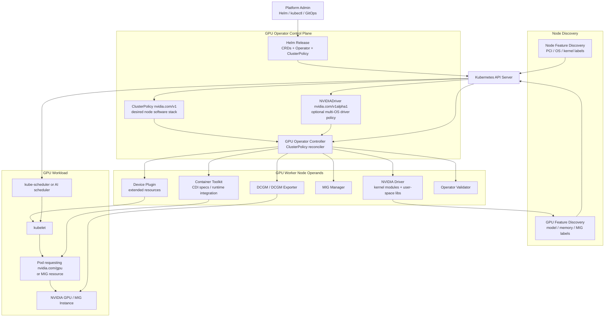
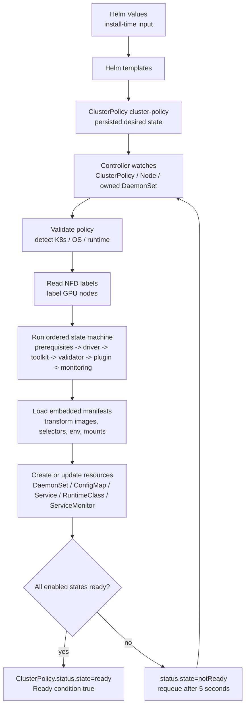
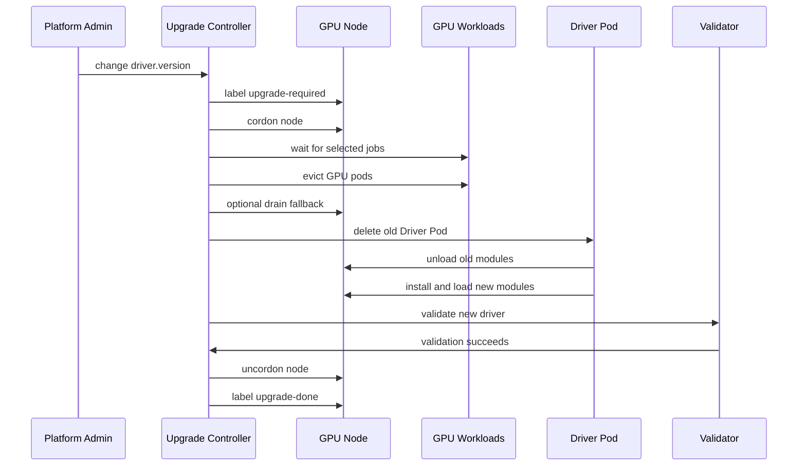
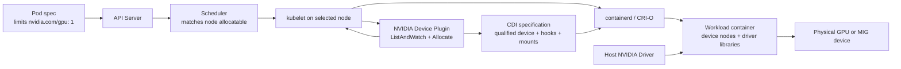
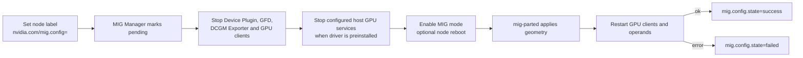

# NVIDIA GPU Operator 深度技术文档

> **Kubernetes GPU 节点软件栈、`ClusterPolicy` 调谐、设备暴露、共享隔离与生产运维解析**
>
> 基于 NVIDIA GPU Operator 官方仓库与 26.7 官方文档整理：<https://github.com/NVIDIA/gpu-operator>
>
> 文档快照：GPU Operator `v26.7.0`，源码提交 `10ee5b3638b89e11e949412aafa5ba99279c3721`，审校日期：2026-09-01；本轮复核稳定 Release 未变化

---

## 目录

- [自动生成目录占位](#自动生成目录占位)

---

## 第一章：定位与边界

### 1.1 GPU Operator 是什么

Kubernetes 的 Device Plugin 框架允许厂商向 kubelet 注册 GPU 等扩展资源，但它不负责安装内核驱动、配置容器运行时、发现设备特征、部署监控或协调 MIG。直接维护 GPU 节点通常需要人工拼装多个版本相关的组件，节点扩容、内核升级和驱动升级也容易产生配置漂移。

NVIDIA GPU Operator 使用 Kubernetes Operator 模式，把这套节点软件栈声明为一个集群级策略并持续调谐：

| 层次 | Operator 管理的典型能力 |
|------|-------------------------|
| 硬件发现 | Node Feature Discovery（NFD）发现 NVIDIA PCI 设备 |
| 内核与主机 | NVIDIA Driver、可选 GDS/GDRCopy、驱动升级控制器 |
| 容器运行时 | NVIDIA Container Toolkit、CDI、可选 NRI、RuntimeClass |
| Kubernetes 设备 | NVIDIA Device Plugin 注册 `nvidia.com/gpu` 或 MIG 资源 |
| 节点元数据 | GPU Feature Discovery（GFD）发布型号、显存、MIG 等标签 |
| 监控与验证 | DCGM、DCGM Exporter、Operator Validator、Operator metrics |
| GPU 分区 | MIG Manager、Device Plugin time-slicing、实验性 MPS |
| 虚拟化与机密计算 | 可选 KubeVirt/vGPU/VFIO、Kata、CC Manager |

一句话概括：

> **GPU Operator 是 NVIDIA GPU 节点软件栈的生命周期控制面；它让 GPU 可被 Kubernetes 使用，但不替 Kubernetes 决定业务队列、公平性或复杂作业拓扑。**

### 1.2 它解决哪些生产问题

| 问题 | 手工管理时的风险 | GPU Operator 的处理方式 |
|------|------------------|-------------------------|
| 新 GPU 节点上线 | 驱动、Toolkit、Device Plugin 步骤不一致 | 依据 NFD 标签自动部署节点 Operand |
| 版本组合 | 驱动、Toolkit、插件、DCGM 各自漂移 | Chart 固定并交付经过组合的组件版本 |
| 内核变化 | 模块编译失败或驱动与内核不匹配 | Driver 容器按节点 OS/内核构建，或使用预编译驱动 |
| GPU 不可调度 | kubelet 没有 `nvidia.com/gpu` | Device Plugin 注册并持续报告设备健康 |
| MIG 重配置 | 需要停 GPU 客户端、改几何并可能重启 | MIG Manager 以节点标签驱动状态机 |
| 可观测性 | 指标与节点/Pod 关系分散 | DCGM Exporter 暴露 Prometheus 指标 |
| 驱动滚动升级 | 卸载模块前必须停止客户端 | Upgrade Controller 逐节点 cordon、驱逐、验证、uncordon |

### 1.3 它不是什么

| 不属于 GPU Operator 的职责 | 正确的责任方 |
|----------------------------|--------------|
| 队列准入、配额借用、公平共享、Gang Scheduling | Kueue、Volcano、KAI-Scheduler、Koordinator 等 |
| 按显存/算力做细粒度调度和通用软件限额 | HAMi 或其他 GPU 虚拟化/调度系统 |
| 训练、推理、Notebook 与 Pipeline | Kubeflow、KServe、训练框架、推理引擎 |
| 应用级 CUDA 正确性和模型性能 | 应用、框架和性能工程体系 |
| 网络设备驱动与 RDMA Device Plugin 的完整部署 | NVIDIA Network Operator 或主机网络栈 |
| 云厂商 GPU 节点池、IOMMU、BIOS 和物理 Fabric 的创建 | 云平台、裸金属平台与集群生命周期系统 |

GPU Operator 与 HAMi 也不是简单替代关系。GPU Operator 擅长部署 NVIDIA 的底层驱动、Toolkit、Device Plugin、MIG 和监控栈；HAMi 在此基础上补充细粒度显存/算力调度与软件隔离。若 HAMi 接管 NVIDIA Device Plugin 或容器注入链路，必须按 HAMi 的集成文档禁用冲突组件，不能让两个系统同时注册同名资源。

### 1.4 快照与阅读约定

本文固定到以下事实基线，不把 `latest` 页面未来可能新增的行为倒灌进正文：

- GPU Operator Release：`v26.7.0`。
- Git 标签解引用提交：`10ee5b3638b89e11e949412aafa5ba99279c3721`。
- 官方 Chart：`gpu-operator-v26.7.0.tgz`，`version` 与 `appVersion` 均为 `v26.7.0`。
- 官方文档：NVIDIA GPU Operator 26.7 版本路径。
- 组件默认版本以 `v26.7.0` Chart `values.yaml` 为准。

文中的“默认启用”有两层含义：Helm Values 中的布尔值，以及满足父级功能门控和节点选择器后真正创建/运行的 Operand。两者不总是相同，例如 `ccManager.enabled=true`，但默认 `sandboxWorkloads.enabled=false`，所以默认容器工作负载安装不会实际运行 CC Manager。

### 1.5 v26.7.0 的 DRA 与升级行为

`v26.7.0` 把 NVIDIA DRA Driver 纳入 GPU Operator 的正式管理面：新增 `GPUCluster` 自定义资源，可管理 DRA driver、ComputeDomain（含 Multi-Node NVLink）、DCGM、DCGM Exporter 和 DRA validation workload。`ResourceClaim` 可以申请整卡或预配置 MIG，并按设备属性选择。`GPUCluster` 使用 Operator 管理的 `NVIDIADriver`，或引用主机预装的 driver；同一集群不能同时使用 `GPUCluster` 和 `ClusterPolicy`。

这条路径有明确前置条件：Kubernetes `v1.34.2+`、NVIDIA driver `580+` 和 CDI-compatible container runtime；部分 DRA 能力仍是 Alpha、默认关闭。KubeVirt 也可以通过 DRA `ResourceClaim` 申请整卡做 VFIO passthrough，但需要单独核对 Fabric Manager、IOMMU 和虚拟机安全边界。

v26.7.0 还新增 `nvidia.com/gpu.deploy.client` node label，允许 Operator 在 driver upgrade 或 MIG 变更时重启持有 GPU handle 的第三方 client DaemonSet；当 driver 配置 digest 未变化时，driver-upgrade controller 会原地重启 driver Pod，不驱逐业务 workload。`NVIDIADriver` CRD 的 `upgradePolicy` 可以逐资源覆盖 Helm 默认策略，`hostPaths.kubeletRootDir` 支持非 `/var/lib/kubelet` 根目录。

NRI 开启时，`NRI_MANAGEMENT_CDI_DEVICE_NAMESPACES` 默认只允许 Operator 所在 namespace 请求 management CDI device；immutable host 上不要再挂载 NRI 不需要的 containerd 配置路径。`devicePlugin.config.create=true` 但 name/data 为空现在会被 chart 拒绝，避免产生引用不存在 ConfigMap 的 Pod。

---

## 第二章：总体架构与组件依赖

### 2.1 控制面、节点面与工作负载面



这三层的故障含义不同：

- Operator Controller 不健康：新策略和节点变化不能继续收敛。
- Operand 不健康：对应节点的驱动、注入、注册、监控或验证链路不可用。
- 已运行 GPU Pod：可能在控制器短暂故障时继续运行，但驱动重载、节点重启或运行时配置变化会中断它。

### 2.2 核心组件

| 组件 | Kubernetes 形态 | 主要职责 | 默认状态 |
|------|-----------------|----------|----------|
| GPU Operator | Deployment | watch `ClusterPolicy`、Node、受管 DaemonSet，生成并更新 Operand | 启用 |
| NFD master/worker/GC | Deployment/DaemonSet | 发现 PCI、OS、kernel 等节点特征 | `nfd.enabled=true` |
| NVIDIA Driver | DaemonSet，或每 CR/OS 一个 DaemonSet | 安装用户态库和内核模块，提供 `/run/nvidia/driver` | `driver.enabled=true` |
| Container Toolkit | DaemonSet | 生成 CDI 规范并配置 containerd/CRI-O 或 NRI | `toolkit.enabled=true` |
| Device Plugin | DaemonSet | 向 kubelet 注册整卡/MIG/共享资源，执行 Allocate | `devicePlugin.enabled=true` |
| GFD | DaemonSet | 通过 NFD/GFD 机制发布 GPU 属性标签 | `gfd.enabled=true` |
| DCGM | DaemonSet/Service | 独立 `nv-hostengine` | `dcgm.enabled=false` |
| DCGM Exporter | DaemonSet/Service | 默认内嵌 hostengine，导出 Prometheus 指标 | `dcgmExporter.enabled=true` |
| Validator | DaemonSet + validation Pod | 分阶段验证 driver、toolkit、plugin、CUDA | 始终调谐 |
| MIG Manager | DaemonSet | 监听 MIG 配置标签，协调重配置 | `migManager.enabled=true`，仅 MIG 节点运行 |
| MPS Control Daemon | DaemonSet | 为配置了 MPS 的整卡启动 CUDA MPS 服务 | 随 Device Plugin 状态调谐，未配置 MPS 时不提供共享 |
| Node Status Exporter | DaemonSet/ServiceMonitor | 导出节点状态相关指标 | `nodeStatusExporter.enabled=false` |

### 2.3 关键依赖顺序

GPU 节点不是一组互不相关的 DaemonSet。最实用的依赖顺序是：

```text
NFD labels
  -> Operator identifies GPU node and applies deploy labels
  -> Driver loads modules and exposes libraries
  -> Toolkit configures CDI/runtime integration
  -> Validator checks driver and toolkit
  -> Device Plugin discovers devices and registers resources
  -> GFD publishes detailed labels
  -> MIG Manager/DCGM Exporter/other GPU clients converge
  -> CUDA workload can start
```

因此“其他 Pod 全部卡在 Init”往往不是多个独立问题，而是上游 Driver 或 Toolkit 未就绪的结果。排障应沿依赖链从前到后，而不是同时重启所有 Pod。

### 2.4 节点标签是部署契约

NFD 检测到 NVIDIA PCI Vendor ID `10de` 后发布类似标签：

```text
feature.node.kubernetes.io/pci-10de.present=true
```

Controller 再为节点维护 `nvidia.com/gpu.present=true` 及各 Operand 的 deploy 标签。常见控制标签包括：

| 标签 | 作用 |
|------|------|
| `nvidia.com/gpu.present=true` | Controller 识别出的 GPU 节点 |
| `nvidia.com/gpu.deploy.operands=false` | 禁止该节点部署全部通用 GPU Operand |
| `nvidia.com/gpu.deploy.driver=false` | 仅禁止 Operator Driver |
| `nvidia.com/gpu.deploy.device-plugin=true` | 允许 Device Plugin 运行 |
| `nvidia.com/gpu.deploy.gpu-feature-discovery=true` | 允许 GFD 运行 |
| `nvidia.com/gpu.deploy.mig-manager=true` | MIG-capable 节点运行 MIG Manager |
| `nvidia.com/gpu.workload.config` | `container`、`vm-passthrough` 或 `vm-vgpu` |

这些标签属于 Operator 的控制协议。生产自动化可以观察它们，但不要用另一个控制器无条件覆盖，否则两个调谐循环会反复争夺状态。

---

## 第三章：从 ClusterPolicy 到节点收敛

### 3.1 Helm 交付了什么

默认 Helm 安装至少完成四件事：

1. 安装 `clusterpolicies.nvidia.com` 和 `nvidiadrivers.nvidia.com` CRD。
2. 创建 GPU Operator Deployment、RBAC 和 ServiceAccount。
3. 从 Helm Values 渲染单例 `ClusterPolicy/cluster-policy`。
4. 默认安装 NFD 子 Chart。

Helm 不直接为每个 GPU 节点静态生成全部 Driver/Toolkit/Plugin Pod；后续节点软件栈由 Controller 根据 `ClusterPolicy`、节点标签和运行环境动态调谐。

### 3.2 Controller 调谐流程



源码中的主要 state 顺序为：

```text
pre-requisites
state-operator-metrics
state-driver
state-container-toolkit
state-operator-validation
state-device-plugin
state-mps-control-daemon
state-dcgm
state-dcgm-exporter
gpu-feature-discovery
state-mig-manager
state-node-status-exporter
...sandbox/vGPU/VFIO/Kata/CC states
```

每个 state 都有功能开关。禁用 Driver、Toolkit 或 Device Plugin 时，对应 state 不创建 Operand；启用 `NVIDIADriver` CRD 路径时，`ClusterPolicy` Controller 跳过并清理自己拥有的 Driver DaemonSet，由独立 `NVIDIADriver` Controller 管理驱动。

### 3.3 触发调谐的事件

| 事件 | 为什么需要重新调谐 |
|------|--------------------|
| `ClusterPolicy.spec` generation 变化 | 应用新镜像、开关、环境变量、资源和策略 |
| 新 Node 或 GPU/NFD 标签变化 | 为新 GPU 节点补齐 Operand，或更新 workload 类型 |
| 受管 DaemonSet 变化 | 检查 Operand 是否 Ready，修复配置漂移 |
| 定时 requeue | 等待尚未 Ready 的资源，或轮询尚无 NFD 标签的集群 |

Controller 只允许一个主 `ClusterPolicy`；额外实例会被标记为 `ignored`。平台应把 `cluster-policy` 当作集群单例，而不是为每个租户创建一份。

### 3.4 Ready 不等于 CUDA 一定可用

源码允许在“没有 GPU 节点”或“NFD 标签缺失”时把已经创建的控制资源标为 Ready，并在条件中记录 `NoGPUNodes` 或 `NFDLabelsMissing`。因此必须分三层验收：

| 层次 | 检查 | 能证明什么 |
|------|------|------------|
| Operator 健康 | Operator Deployment、日志、`ClusterPolicy.status` | Controller 可以完成调谐 |
| Operand 就绪 | GPU 节点上的 Driver/Toolkit/Plugin/GFD/DCGM/Validator | 节点软件链路基本收敛 |
| 工作负载可用 | allocatable 资源、实际 CUDA Pod、应用日志 | 调度、注入、驱动和 CUDA 端到端可用 |

只检查 `kubectl get clusterpolicy` 不足以作为 GPU 平台验收。

---

## 第四章：ClusterPolicy API 与 Helm Values

### 4.1 两个配置层不要混淆

`values.yaml` 是 Helm Chart 的输入；`ClusterPolicy.spec` 是运行时 Controller 的 API。Chart 模板会把一部分 Values 转成 `ClusterPolicy`，还会用另一些 Values 生成 Operator Deployment、NFD 子 Chart、ConfigMap 或 Helm Hook。

| 配置 | 所在位置 | 谁读取 | 典型例子 |
|------|----------|--------|----------|
| Helm Values | release values | Helm templates | `nfd.enabled`、`operator.resources`、`operator.upgradeCRD` |
| `ClusterPolicy.spec` | Kubernetes API | GPU Operator Controller | `driver.enabled`、`toolkit.enabled`、`mig.strategy` |
| Device Plugin Config | ConfigMap data 中的插件 `version: v1` 配置 | Device Plugin 与 GFD | `sharing.timeSlicing`、`sharing.mps` |
| MIG Parted Config | ConfigMap `config.yaml` | MIG Manager/mig-parted | MIG profile 与几何 |
| `NVIDIADriver.spec` | 独立 `nvidia.com/v1alpha1` CR | NVIDIADriver Controller | 每组节点的驱动类型、版本和 selector |

例如 `nfd.enabled=false` 不会成为 `ClusterPolicy.spec.nfd.enabled=false`，因为 `ClusterPolicy` 根本没有 `nfd` 字段；它只控制 Helm 是否安装 NFD 子 Chart。

### 4.2 顶层字段地图

`nvidia.com/v1` 的 `ClusterPolicy.spec` 在该快照中的主要字段如下：

| 字段 | 作用 | 默认有效状态 |
|------|------|--------------|
| `operator` | RuntimeClass、OpenShift Driver Toolkit 等控制器行为 | 启用，`runtimeClass=nvidia` |
| `hostPaths` | 主机根目录与驱动安装目录 | `/`、`/run/nvidia/driver` |
| `daemonsets` | Operand 公共 labels、annotations、tolerations、更新策略 | `RollingUpdate`；Driver 始终 `OnDelete` |
| `driver` | Driver 镜像、版本、内核模块、RDMA、升级策略 | 启用，`580.126.20`，`kernelModuleType=auto` |
| `toolkit` | Container Toolkit 与运行时集成 | 启用，`v1.19.1` |
| `devicePlugin` | Device Plugin 与共享配置引用 | 启用，`v0.19.3` |
| `gfd` | GPU 标签发现 | 启用，`v0.19.3` |
| `dcgm` | 独立 DCGM hostengine | 禁用 |
| `dcgmExporter` | Prometheus GPU 指标 | 启用，ServiceMonitor 默认禁用 |
| `validator` | driver/toolkit/plugin/CUDA 等验证 | 始终调谐 |
| `mig` | Device Plugin 的 MIG 策略 | `single` |
| `migManager` | MIG 几何管理和 ConfigMap | 启用，仅匹配 MIG 节点 |
| `cdi` | CDI 与可选 NRI | CDI 启用，NRI 禁用 |
| `gds` | GPUDirect Storage sidecar | 禁用，实验性 API 注释 |
| `gdrcopy` | GDRCopy 内核模块 sidecar | 禁用 |
| `nodeStatusExporter` | 节点状态 exporter | 禁用 |
| `sandboxWorkloads` | KubeVirt/Kata 工作负载总开关和模式 | 禁用，默认 workload 为 `container` |
| `vgpuManager` | vGPU host manager | 禁用 |
| `vfioManager` | GPU passthrough 的 VFIO 管理 | Values 为启用，但受 sandbox 总开关门控 |
| `sandboxDevicePlugin` | KubeVirt GPU Device Plugin | Values 为启用，但受 sandbox/KubeVirt 门控 |
| `kataSandboxDevicePlugin` | Kata sandbox device plugin | Values 为启用，但受 sandbox/Kata 门控 |
| `kataManager` | 准备 NVIDIA Kata runtime | 禁用 |
| `ccManager` | Confidential Computing GPU 模式 | Values 为启用，但受 sandbox/Kata 门控 |

### 4.3 公共 DaemonSet 配置

以下是 Chart Values 片段，不是完整 `ClusterPolicy` 清单：

```yaml
daemonsets:
  priorityClassName: system-node-critical
  updateStrategy: RollingUpdate
  rollingUpdate:
    maxUnavailable: "1"
  tolerations:
    - key: nvidia.com/gpu
      operator: Exists
      effect: NoSchedule
```

这组值会进入 `spec.daemonsets` 并应用到多个 Operand。需要注意：

- `daemonsets.tolerations` 是完整列表，生产覆盖时要保留已有 GPU taint 容忍。
- Driver DaemonSet 为避免无意中断，固定使用 `OnDelete`；驱动更新由专用 Upgrade Controller 协调。
- 业务节点还有自定义 taint 时，必须补齐 toleration，否则 DaemonSet `DESIRED=0`。

### 4.4 Driver 配置与 NVIDIADriver CRD

默认路径使用 `ClusterPolicy.spec.driver`，适用于 GPU 节点 OS 版本一致且全局使用同一驱动类型/版本的集群：

```yaml
apiVersion: nvidia.com/v1
kind: ClusterPolicy
metadata:
  name: cluster-policy
spec:
  driver:
    enabled: true
    version: "580.126.20"
    kernelModuleType: auto
    useNvidiaDriverCRD: false
```

独立 Driver CRD 路径通过 Helm 开启：

```bash
helm upgrade --install gpu-operator nvidia/gpu-operator \
  --namespace gpu-operator \
  --create-namespace \
  --version=v26.7.0 \
  --set driver.nvidiaDriverCRD.enabled=true
```

开启后，Chart 默认创建一个匹配全部 GPU 节点的 `NVIDIADriver/default`。若要自己创建互斥的节点选择器，应同时设置：

```text
--set driver.nvidiaDriverCRD.deployDefaultCR=false
```

自定义资源使用不同 API：

```yaml
apiVersion: nvidia.com/v1alpha1
kind: NVIDIADriver
metadata:
  name: ubuntu22-gpu
spec:
  driverType: gpu
  version: "580.126.20"
  repository: nvcr.io/nvidia
  image: driver
  kernelModuleType: auto
  nodeSelector:
    driver.config: ubuntu22
```

两条路径不能同时管理同一节点。官方 26.7 文档明确不支持把已有集群从 `ClusterPolicy` Driver 原地迁移到 `NVIDIADriver` 而不中断；切换会立即终止旧 Driver Pod 并重新部署，应当作为新集群设计或维护窗口变更。

### 4.5 直接编辑与 GitOps

可以执行 `kubectl edit clusterpolicy cluster-policy`，Controller 会动态应用变更。但如果 Helm/GitOps 仍把 Values 当作源，下一次 `helm upgrade` 可能把在线修改覆盖。

生产建议明确单一事实源：

1. 用版本化 Values 管理长期策略。
2. 紧急在线 patch 后，把同样变更立即回写 Values/Git。
3. 用 `helm get values` 与 `kubectl get clusterpolicy -o yaml` 分别审计安装输入和运行时结果。
4. 共享 ConfigMap、MIG ConfigMap 和 `NVIDIADriver` 也纳入 GitOps，不只备份 ClusterPolicy。

---

## 第五章：安装、运行时配置与三层验证

### 5.1 前置条件与支持边界

安装前至少确认：

- `kubectl`、Helm 3 与集群管理员权限可用。
- GPU 节点和 GPU 型号在 26.7 [Platform Support](https://docs.nvidia.com/datacenter/cloud-native/gpu-operator/26.7/platform-support.html) 范围内。
- 一般 Kubernetes 验证范围为 1.32 到 1.36；平台发行版、OS 和内核仍须逐项查矩阵。
- 节点使用受支持的 containerd 或 CRI-O；26.7 表中 containerd 范围为 1.7 到 2.2。
- 默认 `ClusterPolicy` Driver 路径要求所有 GPU 节点使用相同 OS 版本；混合 OS 应使用预装驱动或 `NVIDIADriver` CRD。
- Driver 容器能获得匹配运行内核的 headers/devel 包和构建依赖，或选用受支持的预编译 Driver。
- `nouveau` 不占用设备；Secure Boot、代理、离线仓库、vGPU、Kata 等场景先满足专门文档的前置条件。
- Operator Namespace 允许特权 Pod。启用 Pod Security Admission 的集群需要 `privileged` enforcement。

```bash
kubectl create namespace gpu-operator
kubectl label --overwrite namespace gpu-operator \
  pod-security.kubernetes.io/enforce=privileged
```

### 5.2 NFD 去重

GPU Operator 默认安装 NFD。集群已有 NFD 时必须禁用子 Chart，防止两套 master/worker 争夺标签和资源：

```bash
kubectl get nodes -o json \
  | jq '.items[].metadata.labels | keys | any(startswith("feature.node.kubernetes.io"))'
```

如果确认已有 NFD：

```bash
helm upgrade --install gpu-operator nvidia/gpu-operator \
  --namespace gpu-operator \
  --create-namespace \
  --version=v26.7.0 \
  --set nfd.enabled=false
```

不要因为看到任意 `feature.node.kubernetes.io/*` 标签就盲目禁用；还应确认现有 NFD worker 覆盖 GPU 节点、PCI source 包含 NVIDIA 设备类别，并且 master 允许 `nvidia.com` 标签命名空间。

### 5.3 固定版本的默认安装

```bash
helm repo add nvidia https://helm.ngc.nvidia.com/nvidia
helm repo update nvidia

helm upgrade --install gpu-operator nvidia/gpu-operator \
  --namespace gpu-operator \
  --create-namespace \
  --version=v26.7.0 \
  --wait
```

生产不要省略 `--version`。Chart 版本固定并不等于所有外部依赖永久可拉取，还应在发布前锁定镜像 digest、镜像仓库策略和离线缓存。

### 5.4 预装驱动与 Toolkit

仅预装 Driver：

```bash
helm upgrade --install gpu-operator nvidia/gpu-operator \
  --namespace gpu-operator \
  --create-namespace \
  --version=v26.7.0 \
  --set driver.enabled=false \
  --wait
```

Driver 与 Container Toolkit 都已预装：

```bash
helm upgrade --install gpu-operator nvidia/gpu-operator \
  --namespace gpu-operator \
  --create-namespace \
  --version=v26.7.0 \
  --set driver.enabled=false \
  --set toolkit.enabled=false \
  --wait
```

这两个布尔值表达不同边界：

- `driver.enabled=false` 只阻止 Operator 管理驱动；节点仍必须有兼容 Driver。
- `toolkit.enabled=false` 只阻止 Operator 配置运行时/CDI；节点仍必须有正确的 Toolkit 和运行时配置。
- 两者都禁用时，Operator 仍可部署 Device Plugin、GFD、DCGM Exporter 和 Validator，但它们依赖主机软件先正确工作。

### 5.5 containerd、CRI-O、CDI 与 NRI

`v26.7.0` 默认 `cdi.enabled=true`。标准 Device Plugin 工作负载仍然请求 `nvidia.com/gpu`，设备注入由支持 CDI 的 containerd/CRI-O 处理，对应用通常透明。

默认 NRI 关闭。开启 NRI 需要 CDI，并要求 containerd `v1.7.30+`、`v2.1.x`、`v2.2.x`，或 CRI-O `v1.34+`：

```bash
helm upgrade --install gpu-operator nvidia/gpu-operator \
  --namespace gpu-operator \
  --create-namespace \
  --version=v26.7.0 \
  --set cdi.nriPluginEnabled=true \
  --wait
```

NRI 模式下，Toolkit 不再修改运行时配置，不创建 `nvidia` RuntimeClass；NRI 主要为绕开 Device Plugin/DRA 分配、通过 `NVIDIA_VISIBLE_DEVICES` 访问 GPU 的管理容器注入 CDI 设备。普通业务不应靠 `NVIDIA_VISIBLE_DEVICES=all` 绕过 Kubernetes 分配。

对于非标准 containerd 路径，未采用 NRI 时可以给 Toolkit 指定配置和 socket：

```bash
helm upgrade --install gpu-operator nvidia/gpu-operator \
  --namespace gpu-operator \
  --create-namespace \
  --version=v26.7.0 \
  --set toolkit.env[0].name=CONTAINERD_CONFIG \
  --set toolkit.env[0].value=/etc/containerd/config.toml \
  --set toolkit.env[1].name=CONTAINERD_SOCKET \
  --set toolkit.env[1].value=/run/containerd/containerd.sock \
  --set toolkit.env[2].name=RUNTIME_CONFIG_SOURCE \
  --set toolkit.env[2].value=command\,file
```

路径必须来自实际节点，不要照搬 RKE2、K3s 或 MicroK8s 的示例。修改前备份运行时配置，并确认 Toolkit 能使运行时重新加载。

### 5.6 节点范围控制

默认 Operand 运行于所有被识别的 GPU 节点。需要临时隔离某节点时：

```bash
kubectl label node gpu-worker-01 \
  nvidia.com/gpu.deploy.operands=false --overwrite
```

仅跳过 Driver：

```bash
kubectl label node gpu-worker-01 \
  nvidia.com/gpu.deploy.driver=false --overwrite
```

标签变化会触发 Controller。恢复前先确认主机驱动和 GPU 客户端状态；不要把这类标签当成业务排队机制。

### 5.7 第一层：Operator 健康

```bash
kubectl get deployment -n gpu-operator -l app=gpu-operator
kubectl get clusterpolicy cluster-policy
kubectl describe clusterpolicy cluster-policy
kubectl logs -n gpu-operator deployment/gpu-operator --tail=200
```

预期：Operator Deployment Ready，`ClusterPolicy` 状态为 `ready`，Conditions 没有持续的 `ReconcileFailed` 或 `OperandNotReady`。

### 5.8 第二层：Operand 与扩展资源

```bash
kubectl get pods -n gpu-operator -o wide
kubectl get daemonsets -n gpu-operator
kubectl get nodes -l nvidia.com/gpu.present=true \
  -o custom-columns=NAME:.metadata.name,GPU:.status.allocatable.nvidia\.com/gpu
```

默认安装应看到 Driver、Toolkit、Device Plugin、GFD、DCGM Exporter、Validator；MIG Manager 只在 MIG-capable 节点有期望副本。CUDA Validator 可能显示 `Completed`，这不是异常。

### 5.9 第三层：真实 CUDA Pod

```yaml
apiVersion: v1
kind: Pod
metadata:
  name: cuda-vectoradd
spec:
  restartPolicy: Never
  containers:
    - name: cuda-vectoradd
      image: nvcr.io/nvidia/k8s/cuda-sample:vectoradd-cuda12.5.0-ubuntu22.04
      resources:
        limits:
          nvidia.com/gpu: 1
```

```bash
kubectl apply -f cuda-vectoradd.yaml
kubectl wait --for=jsonpath='{.status.phase}'=Succeeded \
  pod/cuda-vectoradd --timeout=5m
kubectl logs pod/cuda-vectoradd
kubectl delete -f cuda-vectoradd.yaml
```

日志应包含 `Test PASSED`。若 Pod Pending，先看 scheduler event；若 Sandbox/ContainerCreating 失败，看 Toolkit/CDI；若容器启动后 CUDA 失败，看 Driver、设备注入与应用镜像兼容性。

---

## 第六章：驱动生命周期与 NVIDIADriver

### 6.1 容器化 Driver 的工作方式

Driver Pod 以特权方式访问主机内核、`/dev`、`/lib/modules` 等路径，在节点上构建或取得匹配的 NVIDIA kernel modules，加载模块，并把用户态 Driver 文件放到默认 `/run/nvidia/driver`。其他 Operand 通过该目录使用驱动库。

容器化不意味着驱动与主机内核解耦。以下仍然决定安装是否成功：

- OS 发行版及版本。
- 正在运行的 kernel release、headers/devel 包。
- 编译器、模块签名和 Secure Boot 策略。
- GPU 型号与 Driver 分支兼容性。
- `nouveau`、现有 NVIDIA 模块和活跃 GPU 客户端。
- 网络/代理/软件源是否允许 Driver 容器下载依赖。

### 6.2 open、proprietary 与 auto

`driver.kernelModuleType` 可取：

| 值 | 含义 | 使用注意 |
|----|------|----------|
| `auto` | 根据 Driver 分支和 GPU 自动选推荐模块 | 该 Chart 默认值；需要支持 auto 的 Driver 容器 |
| `open` | NVIDIA Open GPU Kernel Modules | GDS 新版本等场景可能要求；仍需硬件/Driver 支持 |
| `proprietary` | 闭源内核模块 | 用于不支持 open 的设备或明确兼容矩阵 |

旧字段 `driver.useOpenKernelModules` 在 25.3 起已废弃并成为 no-op，不要继续用它表达生产意图。

### 6.3 预编译 Driver

`driver.usePrecompiled=true` 选择已经针对特定 kernel 变体构建的镜像，可减少启动时编译和外部软件源依赖。但它不是“任意内核都可运行”的通用镜像：

- 只适用于支持矩阵列出的 OS、架构、kernel flavor/release 与 Driver branch。
- `driver.version` 需要按文档填写 Driver branch，例如 `580`，而不是普通容器路径中的完整版本。
- 节点 kernel 自动升级后，若没有对应预编译镜像，Driver Pod 会失败。
- 自建预编译镜像需要把镜像签名、SBOM 和重建流程纳入供应链治理。

### 6.4 默认 Driver 与多 OS Driver CRD

| 能力 | `ClusterPolicy.spec.driver` | `NVIDIADriver` CRD |
|------|-----------------------------|--------------------|
| 集群内 Driver 类型/版本 | 单一 | 可按 Node selector 多组 |
| GPU 节点 OS 版本 | 要求一致 | 可为每个 OS 生成 DaemonSet |
| 预编译镜像 | 全局 | 可按 CR/节点组选择 |
| driver type | 通常 `gpu` | `gpu`、`vgpu`、`vgpu-host-manager` |
| 新集群推荐场景 | 同质简单集群 | 混合 OS、Driver 类型或版本 |
| 原地互转 | 不支持无中断切换 | 不应与旧路径重叠 |

`NVIDIADriver` Controller 会为“CR × OS 版本”生成 Driver DaemonSet；使用预编译镜像时还会按 kernel version 区分。Node selector 必须互斥，默认 CR 没有 selector，会匹配全部 GPU 节点。

### 6.5 Driver 升级控制器

Driver Pod 重启不能像普通无状态 DaemonSet 那样直接滚动，因为必须先停止所有 GPU 客户端并卸载模块。默认 `driver.upgradePolicy.autoUpgrade=true`，关键默认值为：

```yaml
driver:
  upgradePolicy:
    autoUpgrade: true
    maxParallelUpgrades: 1
    maxUnavailable: 25%
    waitForCompletion:
      timeoutSeconds: 0
      podSelector: ""
    gpuPodDeletion:
      force: false
      timeoutSeconds: 300
      deleteEmptyDir: false
    drain:
      enable: false
      force: false
      podSelector: ""
      timeoutSeconds: 300
      deleteEmptyDir: false
```

`drain.enable` 是最后手段：它会逐个处理节点上的 GPU 与非 GPU Pod。优先调整 `gpuPodDeletion`，只有无法停止 GPU 客户端时才在维护窗口启用 drain。

### 6.6 驱动升级时序



节点通过 `nvidia.com/gpu-driver-upgrade-state` 暴露 `upgrade-required`、`cordon-required`、`pod-deletion-required`、`drain-required`、`pod-restart-required`、`validation-required`、`uncordon-required`、`upgrade-done` 或 `upgrade-failed`。

### 6.7 失败恢复

```bash
kubectl get nodes -l nvidia.com/gpu.present=true \
  -o custom-columns=NAME:.metadata.name,STATE:.metadata.labels.nvidia\.com/gpu-driver-upgrade-state

kubectl get nodes \
  -l nvidia.com/gpu-driver-upgrade-state=upgrade-failed
```

修复根因后可把节点重新置为待升级：

```bash
kubectl label node gpu-worker-01 \
  nvidia.com/gpu-driver-upgrade-state=upgrade-required --overwrite
```

先检查节点是否仍 cordon、旧 GPU Pod 是否残留、Driver 模块能否卸载、Validator 为什么失败。不要只反复删除 Driver Pod，否则可能扩大中断。

---

## 第七章：从 Pod 请求到 GPU 注入

### 7.1 Device Plugin 注册资源

Device Plugin 通过 kubelet Device Plugin gRPC API 报告设备与健康状态。默认整卡资源为：

```text
nvidia.com/gpu
```

这是整数扩展资源，通常只放在 `limits`；Kubernetes 会让 request 等于 limit。默认 scheduler 只比较可用数量，不理解显存剩余、GPU 利用率、NVLink 拓扑或队列公平。

### 7.2 端到端数据路径



故障定位可以按边界切分：

- Pod 一直 Pending 且 event 为 Insufficient：调度/资源注册问题。
- Pod 已绑定但 FailedCreatePodSandBox：RuntimeClass、Toolkit、CDI 或运行时问题。
- Pod ContainerCreating 卡住：Device Plugin Allocate、CDI spec、设备节点或镜像问题。
- Pod 运行后 `libcuda.so`/NVML 失败：Driver root、库挂载或镜像问题。
- `nvidia-smi` 正常但应用 CUDA kernel 失败：CUDA/Driver 兼容或应用问题。

### 7.3 CDI、RuntimeClass 与 legacy 路径

从 GPU Operator 25.10 起，CDI 默认为普通 workload 的设备注入机制。`v26.7.0` 中：

- `cdi.enabled=true`：Device Plugin 分配结果交给支持 CDI 的运行时。
- 未启用 NRI 时，仍创建 `nvidia` RuntimeClass，供 GPU 管理容器通过 `NVIDIA_VISIBLE_DEVICES` 访问设备；标准 Device Plugin Pod 不必显式写 RuntimeClass。
- `cdi.nriPluginEnabled=true`：NRI 处理管理容器注入，不再创建 `nvidia` RuntimeClass，也不修改 containerd 配置。
- `cdi.default` 已废弃；CDI 开关本身已经表达默认注入路径。

不要把 `runtimeClassName: nvidia` 当作 GPU 资源请求。它不执行调度记账；业务 Pod 仍应请求 Device Plugin 或 DRA 资源。

### 7.4 GFD 标签与调度

GFD 发布类似以下标签：

```text
nvidia.com/gpu.product=NVIDIA-H100-80GB-HBM3
nvidia.com/gpu.memory=81559
nvidia.com/cuda.driver.major=580
nvidia.com/mig.capable=true
nvidia.com/gpu.sharing-strategy=none
```

它们可用于 node affinity、队列 flavor 或资源分组，但标签是静态能力描述，不是实时空闲量。需要拓扑或队列语义时，把 GFD 标签作为上层调度器的输入，而不是误以为 GFD 自己会调度。

---

## 第八章：整卡、Time-Slicing、MPS 与 MIG

### 8.1 四种模式的边界

| 模式 | Kubernetes 资源 | 隔离 | 重配置影响 | 典型场景 |
|------|-----------------|------|------------|----------|
| 整卡 | `nvidia.com/gpu` | 独占设备，最简单 | 无共享重配置 | 训练、大模型推理、性能敏感任务 |
| Time-Slicing | 默认仍是 `nvidia.com/gpu`，可改成 `.shared` | 无显存/故障硬隔离 | 重启 Plugin/GFD，运行中 workload 不自动迁移 | 低风险开发、突发小任务、高并发轻载 |
| MPS | `nvidia.com/gpu` 或 `.shared` | 每 replica 等比例约束显存与计算；仍非 VM/MIG 安全边界 | 依赖 MPS control daemon；整节点同一策略 | 协作式 CUDA 多进程、小任务；实验性 |
| MIG | `single` 时通常仍为 `nvidia.com/gpu`；`mixed` 为 `nvidia.com/mig-<profile>` | 硬件级显存与故障隔离 | 停 GPU clients，可能重启节点 | 支持 MIG 的数据中心 GPU、多租户稳定切片 |

Operator 负责部署与配置 Device Plugin/MIG Manager，不提供队列公平、抢占策略、租户配额借用或跨节点 GPU topology scheduling。

### 8.2 Time-Slicing 配置

以下 ConfigMap 把每张整卡复制为 4 个共享访问槽，并用 `.shared` 显式区分资源：

```yaml
apiVersion: v1
kind: ConfigMap
metadata:
  name: nvidia-device-plugin-config
  namespace: gpu-operator
data:
  time-slicing: |-
    version: v1
    flags:
      migStrategy: none
    sharing:
      timeSlicing:
        renameByDefault: true
        failRequestsGreaterThanOne: true
        resources:
          - name: nvidia.com/gpu
            replicas: 4
```

让 Device Plugin/GFD 使用该配置：

```bash
kubectl apply -f nvidia-device-plugin-config.yaml
kubectl patch clusterpolicy cluster-policy --type=merge \
  -p '{"spec":{"devicePlugin":{"config":{"name":"nvidia-device-plugin-config","default":"time-slicing"}}}}'
```

业务请求改为：

```yaml
resources:
  limits:
    nvidia.com/gpu.shared: 1
```

关键语义：

- `replicas: 4` 是可分配访问槽数量，不是每个 Pod 保证 25% 算力。
- `failRequestsGreaterThanOne=true` 防止用户误以为请求两个 replica 就得到双倍算力。
- 不启用 `renameByDefault` 时，资源仍叫 `nvidia.com/gpu`，但 GFD product 通常追加 `-SHARED`；这容易让用户把共享槽误认为独占整卡。
- Operator 不监控外部 ConfigMap 的内容变化。修改后需要在维护窗口滚动重启 Device Plugin；当前运行 workload 不会因此自动重建。
- Time-Slicing 没有显存或故障隔离，同卡一个进程可能 OOM 或触发影响其他进程的错误。

### 8.3 MPS 配置

Device Plugin `v0.19.3` 的 MPS 仍标为实验性，与 Time-Slicing 互斥，不支持启用了 MIG 的设备，并且只支持完整 `nvidia.com/gpu` 资源。示例：

```yaml
apiVersion: v1
kind: ConfigMap
metadata:
  name: nvidia-device-plugin-mps
  namespace: gpu-operator
data:
  mps: |-
    version: v1
    flags:
      migStrategy: none
    sharing:
      mps:
        renameByDefault: true
        resources:
          - name: nvidia.com/gpu
            replicas: 4
```

```bash
kubectl apply -f nvidia-device-plugin-mps.yaml
kubectl patch clusterpolicy cluster-policy --type=merge \
  -p '{"spec":{"devicePlugin":{"config":{"name":"nvidia-device-plugin-mps","default":"mps"}}}}'
```

MPS Control Daemon 将每个 replica 的显存与计算能力限制为大致相等份额。该限制改善资源治理，但仍要评估 CUDA 应用兼容性、错误传播、MPS server 生命周期、监控归因和安全边界；不能把它描述为 MIG 等价物。

### 8.4 MIG 策略与资源名

| `mig.strategy` | 节点条件 | 暴露方式 |
|----------------|----------|----------|
| `none` | 不使用 MIG | 完整 `nvidia.com/gpu` |
| `single` | 节点上所有 MIG-capable GPU 使用一致 profile | 每个 MIG device 作为 `nvidia.com/gpu` |
| `mixed` | 节点可同时暴露不同 profile | `nvidia.com/mig-1g.10gb` 等 profile 资源 |

`single` 简化工作负载清单，但资源名隐藏 profile；平台应通过 node labels/队列 flavor 保证规格一致。`mixed` 更明确、更灵活，但上层调度和配额必须认识每种资源名。

### 8.5 MIG Manager 动态重配置

26.7 起，MIG Manager 会按节点硬件动态生成 `<node-name>-mig-config` ConfigMap，包含 `all-disabled`、`all-enabled`、`all-balanced` 与硬件支持的 profile。老 Driver 无法在 MIG disabled 时查询 profile 时，会回退到静态配置。

启用 mixed 策略：

```bash
helm upgrade --install gpu-operator nvidia/gpu-operator \
  --namespace gpu-operator \
  --create-namespace \
  --version=v26.7.0 \
  --set mig.strategy=mixed \
  --wait
```

选择节点 profile：

```bash
kubectl label node gpu-worker-01 \
  nvidia.com/mig.config=all-balanced --overwrite

kubectl get node gpu-worker-01 \
  -o jsonpath='{.metadata.labels.nvidia\.com/mig\.config\.state}{"\n"}'
```

成功后状态为 `success`，并出现 `nvidia.com/mig-<profile>.count` 标签。禁用 MIG：

```bash
kubectl label node gpu-worker-01 \
  nvidia.com/mig.config=all-disabled --overwrite
```

### 8.6 MIG 重配置不是无损操作



生产重配置前应 drain/迁移业务、确认 PDB 和队列准入、监控 `mig.config.state`，并为可能重启准备节点恢复流程。预装 Driver 时还要维护 MIG Manager 的 GPU client systemd service ConfigMap。

### 8.7 共享模式选择

| 需求 | 首选 | 原因 |
|------|------|------|
| 单任务稳定性能、训练或大模型 | 整卡 | 语义简单、干扰最少 |
| 硬件支持且需要可靠显存/故障隔离 | MIG | 硬件边界与显式 profile |
| 非 MIG 卡、开发环境、容忍干扰 | Time-Slicing | 部署简单、覆盖设备广 |
| 应用兼容且希望等份显存/计算治理 | MPS 试点 | 比 Time-Slicing 更强，但仍实验性 |
| 需要任意显存/算力粒度和调度语义 | HAMi | 软件限额和专用调度路径 |

---
## 第九章：GPUDirect、虚拟化、机密计算与 DRA

### 9.1 高级能力默认都不是“开箱即用”

高级字段存在于 `ClusterPolicy` 不代表环境已经具备硬件、内核、网络或虚拟化前提。应把它们看作 Operator 对特定节点软件的编排入口：

| 能力 | GPU Operator 管理部分 | 仍需外部提供 |
|------|-----------------------|--------------|
| GPUDirect RDMA | 可构建/加载 `nvidia-peermem`，或配合 DMA-BUF | NIC Driver、RDMA device plugin、拓扑、Network Operator |
| GPUDirect Storage | Driver Pod 中的 `nvidia-fs` sidecar | 支持的 Driver/open module、CUDA、文件系统和存储栈 |
| GDRCopy | Driver Pod 中的 `gdrdrv` sidecar | 兼容的 Driver、应用库与性能验证 |
| vGPU | vGPU Manager、vGPU Device Manager | NVIDIA AI Enterprise 许可、定制 vGPU Manager 镜像、支持的 hypervisor |
| KubeVirt passthrough | VFIO Manager、sandbox device plugin | IOMMU/VT-d/AMD-Vi、KubeVirt、PCI 资源配置 |
| Kata | Kata Manager、Kata sandbox device plugin | Kata runtime、hypervisor、节点 BIOS/IOMMU 配置 |
| Confidential Containers | CC Manager、NFD rules、Kata 路径 | 支持的 CPU/GPU、attestation 与参考架构 |
| DRA | Operator 安装 Driver/CDI/NFD/GFD 前提 | 独立 DRA Driver Chart、Kubernetes DRA API 和 ResourceClaim |

### 9.2 GPUDirect RDMA

现代支持路径优先使用 DMA-BUF，可能不需要 `driver.rdma.enabled=true`。只有必须使用 legacy peer-memory path 时才启用：

```text
--set driver.rdma.enabled=true
```

若 MLNX_OFED 已由主机安装，再根据官方矩阵设置 `driver.rdma.useHostMofed=true`。GPU Operator 不会自动把网络接口变成可分配的 RDMA 资源；通常要与 NVIDIA Network Operator 协同，且 GPU、NIC、PCIe/NUMA 拓扑必须在性能验收中验证。

### 9.3 GDS 与 GDRCopy

Chart 默认：

```yaml
gds:
  enabled: false
gdrcopy:
  enabled: false
```

GDS 使存储到 GPU memory 的 DMA 路径避免 CPU bounce buffer；26.7 Chart 的 GDS 版本要求 NVIDIA Open GPU Kernel Modules。GDRCopy 面向 CPU/GPU 小数据低延迟复制。这两项都会给 Driver Pod 增加内核相关 sidecar，必须先验证支持矩阵和 Driver 路径，再在小范围节点池启用。

### 9.4 KubeVirt、vGPU 与 Kata

沙箱工作负载总开关是：

```yaml
sandboxWorkloads:
  enabled: true
  defaultWorkload: container
  mode: kubevirt
```

节点的 `nvidia.com/gpu.workload.config` 决定软件栈：

- `container`：Driver、Toolkit、Device Plugin、GFD 等容器路径。
- `vm-passthrough`：VFIO Manager 与 sandbox device plugin 路径。
- `vm-vgpu`：vGPU Manager、vGPU Device Manager 与 sandbox device plugin 路径。

Kata 使用 `mode: kata`，并部署 Kata-specific device plugin；它不是把普通 GPU Pod 自动变成 VM。业务 Pod 仍需正确 RuntimeClass，节点还要满足 IOMMU、hypervisor 和 Kata 版本要求。

`ccManager.enabled=true` 的 Values 默认值也不会单独启用机密计算。源码 state gate 要求 `sandboxWorkloads.enabled=true` 且 mode 为 `kata`；此外还需要 `nfd.nodefeaturerules=true`、支持的硬件与 NVIDIA Confidential Containers 参考架构。

### 9.5 DRA 的位置

Dynamic Resource Allocation（DRA）通过 `DeviceClass`、`ResourceClaim` 等 API 表达更灵活的设备请求和动态配置。26.7 中 DRA Driver for NVIDIA GPUs 是独立安装的项目，不是 `ClusterPolicy.spec` 的一个内嵌 `dra.enabled` 字段。

典型集成边界：

1. GPU Operator 管理 Driver、CDI、NFD 和 GFD。
2. 安装 GPU Operator 时禁用传统 `devicePlugin.enabled`，避免两套系统同时负责 GPU allocation。
3. 单独安装指定版本的 NVIDIA DRA Driver。
4. 用 DRA Node label 和 Driver Manager eviction 环境变量解决驱动升级时 kubelet plugin 驱逐问题。
5. 用 ResourceClaim 申请 GPU；需要兼容传统 `nvidia.com/gpu` 时确认 Kubernetes `DRAExtendedResource` feature gate。

26.7 文档要求 DRA 集成使用 Kubernetes `v1.34.2+` 和 Driver `580+`。A100 的 MIG 变化不会自动驱逐 DRA kubelet plugin，重配置后需按文档重启插件。DRA 改变的是设备分配 API，不自动提供 Kueue/Volcano 的队列治理。

---

## 第十章：可观测性、安全与供应链

### 10.1 DCGM 指标链路

默认 `dcgm.enabled=false`、`dcgmExporter.enabled=true`。此时每个 Exporter 在本地启动 embedded `nv-hostengine` 并暴露 Prometheus 格式指标：

```text
GPU hardware / NVML
  -> embedded DCGM hostengine
  -> DCGM Exporter
  -> Kubernetes Service
  -> Prometheus scrape or ServiceMonitor
  -> dashboard / alert / capacity data
```

若启用 standalone DCGM，Exporter 会通过 `nvidia-dcgm:5555` 连接它；NetworkPolicy 或网络防火墙必须允许通信。不要同时误判 embedded 与 standalone 两条路径。

### 10.2 ServiceMonitor 与指标基数

Chart 默认只创建 Exporter Service，不默认创建 ServiceMonitor：

```text
--set dcgmExporter.serviceMonitor.enabled=true
```

启用前确认 Prometheus Operator CRD 已安装，并用 `additionalLabels` 匹配 Prometheus 的 selector。默认 `enablePodLabels=false`、`enablePodUID=false`；启用后 Operator 会创建可 `get/list/watch pods` 的集群级 RBAC，并增加指标维度。生产必须用 `podLabelAllowlistRegex` 控制 label cardinality，避免租户自定义 label 使 Prometheus 时序爆炸。

Time-Slicing 下，DCGM Exporter 不能可靠把指标关联到具体容器。共享卡的 GPU 利用率也不能直接等价为单 Pod 使用量，容量报表必须声明归因限制。

### 10.3 推荐监控信号

| 层次 | 关键对象/信号 | 典型告警 |
|------|---------------|----------|
| Controller | Deployment Ready、reconcile error、last success | Operator 不可用或持续 NotReady |
| Driver | Driver Pod、`nvidia-smi`、kernel log | 模块加载失败、Xid、GPU fallen off bus |
| 设备注册 | Node capacity/allocatable、Plugin log | GPU 数量下降、资源消失 |
| MIG | `mig.config.state` | 长期 pending/rebooting 或 failed |
| Driver upgrade | upgrade state labels、upgrade metrics | `upgrade-failed`、升级长期 pending |
| GPU telemetry | 温度、功耗、ECC、Xid、utilization、memory | 热/功耗异常、ECC/Xid、容量过载 |
| 工作负载 | Pending event、容器启动失败、CUDA smoke test | 调度不足、CDI 注入失败、CUDA 不可运行 |

只告警 Pod phase 会漏掉“DaemonSet Running 但 GPU 被 Device Plugin 标记 unhealthy”的情况。

### 10.4 特权与 hostPath 风险

官方安全文档明确指出多个 Operand 需要：

- `privileged: true`。
- `hostPID: true` 或 `hostIPC: true`（按组件需要）。
- 主机文件系统、设备节点、运行时 socket 和 systemd 访问。
- 加载/卸载 kernel modules。

这是 GPU 节点管理的功能需要，也意味着 Operator Namespace 是高权限安全域。攻击者若能修改 Operand DaemonSet、ConfigMap、镜像或 `ClusterPolicy`，影响可能扩大到所有 GPU 节点。

### 10.5 最小权限与最小部署面

生产基线建议：

1. 只允许平台管理员和受审计的 GitOps ServiceAccount 写 Operator Namespace、ClusterPolicy、NVIDIADriver 与 GPU Node labels。
2. Namespace 明确应用 PSA privileged，同时用 RBAC 和 NetworkPolicy 缩小访问面；不能靠 PSA 把 Driver Pod 降为 restricted。
3. 不用的 GDS、GDRCopy、sandbox、vGPU、Kata、NRI、standalone DCGM 维持关闭。
4. 集群已有 Driver/Toolkit/NFD 时禁用相应 Operator 部署，避免重复特权组件。
5. 镜像从批准的 registry mirror 拉取，固定 digest，扫描 CVE，保留 SBOM 与签名验证记录。
6. Secret 只通过 `imagePullSecrets`、Driver `secretEnv` 等引用，不写进 Values Git、命令历史或本文档。
7. 限制 `dcgmExporter.enablePodLabels` 带来的额外集群级 Pod 读取权限。
8. 为 Runtime socket、`/run/nvidia/driver`、CDI spec 目录和主机根目录建立文件完整性监控。

### 10.6 镜像和版本不是单一数字

GPU Operator Release 不是 Driver Release 的别名。`v26.7.0` Chart 默认组合包括：

| 组件 | 该 Chart 默认版本 |
|------|------------------|
| GPU Operator/Validator | `v26.7.0`（未覆写时使用 Chart AppVersion） |
| NVIDIA Driver | `595.91.07` |
| Driver Manager | `v0.12.0` |
| Container Toolkit | `v1.20.0` |
| Device Plugin | `v0.20.0` |
| DCGM | `4.6.0-1` |
| DCGM Exporter | `v4.6.0-4.8.3` |
| MIG Manager | `v0.15.0` |
| Node Feature Discovery | `v0.19.0` |
| GPU Feature Discovery | `v0.20.0` |
| GDS | `v2.29.4` |
| Confidential Computing Manager | `v0.4.3` |
| GDRCopy | `v2.6` |
| Kata Sandbox Device Plugin | `v0.0.5` |

升级或安全响应必须分别跟踪这些组件，而不是看到 Operator 版本新就假设所有 Operand 都满足目标 CVE 修复或硬件要求。

---

## 第十一章：升级、兼容与卸载

### 11.1 四个独立版本维度

| 维度 | 变更影响 |
|------|----------|
| Helm Chart/Operator | Controller、CRD、模板与默认 Values |
| ClusterPolicy/CRD schema | API 字段、默认值、validation 与 status |
| Driver | CUDA compatibility、内核模块、GPU/Fabric 支持 |
| Operand 镜像 | Toolkit、Device Plugin、DCGM、MIG、Validator 行为 |

因此一次“升级 GPU Operator”至少要回答：CRD 如何升级、Values 如何迁移、Driver 是否同时变化、哪些 Operand 会重启、GPU 业务是否被驱逐。

### 11.2 升级前检查

- 阅读目标版本 Release Notes、Platform Support、Known Issues 与组件矩阵。
- 保存 `helm get values gpu-operator -n gpu-operator`、当前 `ClusterPolicy`、`NVIDIADriver`、共享/MIG ConfigMap。
- 检查所有 GPU 节点 Ready、Driver Upgrade state 完成、MIG state 为 success。
- 对比新旧 `values.yaml`，不要把旧文件直接覆盖到新 Chart 而忽略新增默认值。
- 检查 CRD schema diff，尤其是 deprecated/no-op 字段和新 required/enum。
- 确认镜像已镜像/预拉取，Driver 依赖包在代理或离线源可用。
- 安排 CUDA canary、回滚版本与节点恢复步骤。

### 11.3 CRD 升级

Helm 对 `crds/` 下已有 CRD 不会自动升级。GPU Operator 从 24.9 起默认启用 pre-upgrade Hook（`operator.upgradeCRD=true`）。使用 Hook 升级 26.7.3 时，官方要求加入 `--disable-openapi-validation`：

```bash
helm repo update nvidia

helm upgrade gpu-operator nvidia/gpu-operator \
  --namespace gpu-operator \
  --version=v26.7.0 \
  --disable-openapi-validation \
  --reuse-values
```

`--reuse-values` 只适合已完成新旧 Values diff 且明确希望保留所有旧值的环境。更稳妥的做法是生成并评审目标版本 Values 文件：

```bash
helm show values nvidia/gpu-operator \
  --version=v26.7.0 > gpu-operator-v26.7.0-values.yaml
```

若组织不允许 Hook，先从固定 tag 手工 `kubectl apply` 两个 NVIDIA CRD 和 NFD CRD，再执行 Helm upgrade。不要从 `main` 或 `latest` 拉 CRD 配固定 Release。

### 11.4 Operator 升级和 Driver 升级解耦

可以先固定 `driver.version` 升级 Operator/Operand，再单独升级 Driver；这样把控制面变化与 GPU 客户端中断拆开。若目标 Chart 默认 Driver 与现有不同，必须显式保留旧 Driver 版本，否则 Helm 更新 ClusterPolicy 会触发 Driver Upgrade Controller。

推荐顺序：

1. canary 节点池或测试集群验证新 Chart。
2. 升级 CRD 与 Operator，观察所有非 Driver Operand 收敛。
3. 运行整卡、MIG/共享场景的 CUDA canary。
4. 在独立维护窗口修改 Driver version，限制并发升级。
5. 观察 upgrade state、Xid、业务 SLO，再扩大范围。

### 11.5 回滚边界

`helm rollback` 不能自动降级 CRD schema，也不能保证已经升级的 Driver modules 安全回退。回滚计划至少区分：

- Operator/Chart 回滚：旧 Controller 是否理解新 CRD/ClusterPolicy 字段。
- Operand 镜像回滚：运行时配置、CDI spec 或 ConfigMap 是否兼容。
- Driver 回滚：节点上 GPU 客户端停止、模块卸载、旧镜像可用和重新验证。
- MIG 回滚：目标 profile 是否仍存在，是否涉及重启。

### 11.6 卸载

```bash
helm uninstall gpu-operator --namespace gpu-operator
```

默认 `operator.cleanupCRD=false`，CRD 和 CR 可能保留。清理 CRD 是破坏性动作，会删除所有对应自定义资源，应在确认不再需要配置和状态后单独执行。

更重要的是 Driver 生命周期：如果业务仍运行或主机仍依赖容器化 Driver，直接卸载会移除 Driver DaemonSet 和节点软件，导致 GPU 访问中断。官方卸载流程提供保留 Driver 的操作顺序；生产前必须决定：

- 先停止全部 GPU workload。
- 迁移为主机预装 Driver，还是保留 Driver Pod。
- 清理 Toolkit 对 containerd/CRI-O 的配置是否会影响存量容器。
- 是否删除 NFD、CDI specs、RuntimeClass、共享/MIG ConfigMap 和节点标签。
- CRD/Namespace 是否由其他系统共用。

“Helm release 已删除”不等于节点已恢复到安装前状态。

---

## 第十二章：故障排查方法

### 12.1 严格按依赖顺序检查

```text
1. Node Ready / taints / NFD labels
2. Operator and ClusterPolicy conditions
3. Driver and kernel logs
4. Toolkit / CDI / container runtime
5. Device Plugin and allocatable resources
6. GFD labels
7. MIG or sharing configuration
8. DCGM / Validator
9. Scheduler events and real CUDA workload
```

建议先保存现场：

```bash
kubectl get nodes -o wide
kubectl get pods,daemonsets -n gpu-operator -o wide
kubectl describe clusterpolicy cluster-policy
kubectl get events -n gpu-operator --sort-by=.lastTimestamp
```

官方提供 `hack/must-gather.sh` 收集资源与日志。生产执行前审查脚本固定 tag、输出内容和敏感信息处理，不要直接运行漂移的 `main` 脚本后上传未脱敏归档。

### 12.2 NFD 或标签缺失

症状：没有 Driver/Operand Pod，DaemonSet `DESIRED=0`，ClusterPolicy 提示无 GPU 节点，Node 没有 `nvidia.com/gpu.present`。

```bash
kubectl get node gpu-worker-01 --show-labels
kubectl get pods -A -l app.kubernetes.io/name=node-feature-discovery
kubectl get node gpu-worker-01 \
  -o jsonpath='{.metadata.labels.feature\.node\.kubernetes\.io/pci-10de\.present}{"\n"}'
```

检查 NFD worker 是否覆盖该节点、PCI source/设备类别、RBAC 和 master allowlist。也检查 `nvidia.com/gpu.deploy.operands=false` 是否被遗留。

### 12.3 Driver Pod 失败

```bash
kubectl get pods -n gpu-operator -l app=nvidia-driver-daemonset -o wide
kubectl logs -n gpu-operator ds/nvidia-driver-daemonset \
  -c nvidia-driver-ctr --tail=300
kubectl logs -n gpu-operator ds/nvidia-driver-daemonset \
  -c k8s-driver-manager --tail=300
```

节点侧重点：

```bash
uname -r
lsmod | grep -E 'nvidia|nouveau'
sudo dmesg | grep -Ei 'NVRM|Xid|nvidia|nouveau'
```

常见根因：headers/devel 与运行 kernel 不匹配、软件源不可达、`nouveau` 已加载、Secure Boot 阻止未签名模块、旧 GPU client 让模块无法卸载、GPU/Driver branch 不兼容。

不要在不了解节点 OS 的情况下复制 `update-initramfs` 命令；Debian/Ubuntu、RHEL 系和不可变 OS 的 initramfs/模块管理方式不同。

### 12.4 “no runtime for nvidia” 或 Pod Sandbox 失败

症状通常是：

```text
failed to get sandbox runtime: no runtime for "nvidia" is configured
```

检查：

```bash
kubectl logs -n gpu-operator ds/nvidia-container-toolkit-daemonset \
  -c nvidia-container-toolkit-ctr --tail=300
kubectl get runtimeclass nvidia -o yaml
```

在节点上检查 containerd `config dump` 或 CRI-O `crio status config`，确认实际生效的 handler/CDI 配置，而不是只看磁盘模板。CDI+NRI 模式本来就不创建 RuntimeClass；如果旧 workload 强制写 `runtimeClassName: nvidia`，需按模式调整。

### 12.5 `nvidia.com/gpu` 未注册

```bash
kubectl get ds -n gpu-operator nvidia-device-plugin-daemonset
kubectl logs -n gpu-operator ds/nvidia-device-plugin-daemonset \
  -c nvidia-device-plugin --tail=300
kubectl describe node gpu-worker-01
```

区分三种情况：

- Device Plugin Pod 不存在：deploy labels、taint/toleration 或 `devicePlugin.enabled=false`。
- Pod 失败：Driver/NVML、CDI 配置或不合法的 sharing/MIG 配置。
- Pod Running 但数量少：Xid health event 使某 GPU 标记 unhealthy，或 MIG/sharing 改变了资源名和数量。

若启用了 `renameByDefault=true`，资源可能是 `nvidia.com/gpu.shared`；mixed MIG 则是 `nvidia.com/mig-<profile>`。此时查询 `nvidia.com/gpu` 得到空并不一定是插件故障。

### 12.6 Pod Pending

```bash
kubectl describe pod <pod-name>
kubectl get node -o custom-columns=NAME:.metadata.name,GPU:.status.allocatable.nvidia\.com/gpu
```

关注 event：

- `Insufficient nvidia.com/gpu`：资源真的不足、资源名错误或 Plugin 未注册。
- node affinity 不匹配：GFD product/MIG/shared label 与清单冲突。
- taint 不容忍：业务 Pod 缺 toleration。
- Kueue 未准入或 Volcano PodGroup 未满足：上层队列/调度器，不是 Operator。
- mixed MIG + full GPU 且使用已知受影响 R570 Driver：26.7 Troubleshooting 记录了 `570.124.06`、`570.133.20`、`570.148.08`、`570.158.01` 的 NVML regression，应按官方建议选择修复版本/规避版本。

### 12.7 MIG 卡在 pending/failed

```bash
kubectl get node gpu-worker-01 \
  -o jsonpath='{.metadata.labels.nvidia\.com/mig\.config}{"\t"}{.metadata.labels.nvidia\.com/mig\.config\.state}{"\n"}'
kubectl logs -n gpu-operator -l app=nvidia-mig-manager \
  -c nvidia-mig-manager --tail=300
```

检查 profile 是否存在于该节点的 `<node-name>-mig-config`、Driver 是否支持动态查询、GPU clients 是否成功停止、节点是否等待 reboot。不要在重配置中途反复改 label；先让状态机成功或按官方恢复步骤回到 `all-disabled`。

### 12.8 Time-Slicing/MPS 配置未生效

```bash
kubectl get clusterpolicy cluster-policy \
  -o jsonpath='{.spec.devicePlugin.config}{"\n"}'
kubectl get configmap -n gpu-operator nvidia-device-plugin-config -o yaml
kubectl get node gpu-worker-01 --show-labels \
  | grep -E 'replicas|sharing-strategy|SHARED'
```

外部 ConfigMap 内容更新不会触发 Operator 自动重启插件。确认 key 与 `default` 完全一致、ConfigMap 与 Operator 同 Namespace、插件配置是 `version: v1`。MPS 还需确认没有启用 MIG，且只配置完整 `nvidia.com/gpu`。

### 12.9 Validator 与 Fabric Manager

NVSwitch 系统上 Validator 报 `error code system not yet initialized`，通常意味着 Fabric Manager 未正确启动。检查：

```bash
kubectl exec -n gpu-operator ds/nvidia-driver-daemonset \
  -c nvidia-driver-ctr -- nvidia-smi -q
kubectl logs -n gpu-operator -l app=nvidia-operator-validator \
  --all-containers --tail=300
```

若 `Fabric State` 长期 `In Progress`，继续看 Driver Pod 的 Fabric Manager 安装与 `/var/log/fabricmanager.log`。DGX/HGX 的 NVSwitch/Fabric 初始化是 GPU 可用性的硬前提。

### 12.10 Xid 与 GPU 数量下降

Device Plugin 会监听 NVML event stream，并在关键 Xid 后把设备标为 unhealthy，使 Node allocatable 数量下降：

```bash
sudo dmesg | grep -i xid
kubectl logs -n gpu-operator ds/nvidia-device-plugin-daemonset \
  -c nvidia-device-plugin | grep -i xid
```

Xid 是硬件/Driver 诊断线索，不应简单通过重启插件清除。记录 PCI Bus ID、GPU UUID、Xid code、Driver/Firmware 版本和发生时 workload，按 NVIDIA Xid 文档决定 reset、节点隔离、固件/Driver 变更或硬件更换。

### 12.11 DCGM Exporter CrashLoop

默认 embedded 模式与 standalone DCGM 模式的检查不同：

- embedded：看 Exporter 自身 NVML/DCGM 初始化与 Driver。
- standalone：确认 `nvidia-dcgm:5555` Service/endpoints、NetworkPolicy 与跨节点网络。
- Time-Slicing：Pod 级归因缺失是已知限制，不是 Exporter CrashLoop 根因。
- ServiceMonitor 不存在：先确认 Prometheus Operator CRD 与 Helm value，不要重启 Exporter。

### 12.12 大集群 Operator OOM

官方 Troubleshooting 指出约 300+ 节点的大集群可能超过默认 Operator 内存限制（Chart 默认 limit `350Mi`）。不要长期直接 patch Deployment，因为 Helm 会覆盖；在 Values 中根据监控调整：

```yaml
operator:
  resources:
    requests:
      cpu: 200m
      memory: 600Mi
    limits:
      cpu: 500m
      memory: 1400Mi
```

用长期工作集设置 request，用 reconciliation 峰值设置 limit，并观察 Go runtime/容器 OOM 指标。

---

## 第十三章：生产设计与运维清单

### 13.1 分层节点池

不要把所有 GPU 功能塞进同一节点池。常见拆分：

| 节点池 | GPU 模式 | 主要策略 |
|--------|----------|----------|
| `gpu-full` | 整卡 | 稳定 Driver、禁止共享、训练/高性能推理 |
| `gpu-mig` | MIG | 固定 profile 或受控维护窗口重配置 |
| `gpu-shared` | Time-Slicing/MPS | 显式 `.shared` 资源、限制租户与 SLO |
| `gpu-vm` | KubeVirt/Kata | IOMMU、VFIO/vGPU/Kata 专用安全基线 |
| `gpu-canary` | 测试 | 新 Driver、Toolkit、Operator 首批验证 |

节点池标签/taint、Kueue ResourceFlavor、业务 node affinity 和 Operator 配置应保持同一语义。

### 13.2 安装基线

- [ ] 固定 `--version=v26.7.0`，保存 Chart digest 和所有镜像 digest。
- [ ] 核对硬件、OS、kernel、Kubernetes、containerd/CRI-O 支持矩阵。
- [ ] 选择 `ClusterPolicy` Driver 或 `NVIDIADriver`，不重叠管理。
- [ ] 确认 NFD 只有一套且覆盖 GPU 节点。
- [ ] Namespace PSA 设置为 privileged，并收紧 RBAC。
- [ ] 预装 Driver/Toolkit 时显式关闭对应 Operand。
- [ ] 记录 CDI/NRI 模式和运行时配置文件/socket。
- [ ] 配置 registry mirror、proxy、CA、imagePullSecrets，但不把 Secret 明文写进 Git。
- [ ] 默认关闭不使用的 GDS/GDRCopy/sandbox/vGPU/Kata/standalone DCGM。

### 13.3 验收基线

- [ ] Operator Deployment Ready，ClusterPolicy conditions 合理。
- [ ] 每个节点池至少一台节点完成 Driver/Toolkit/Plugin/GFD/Validator 检查。
- [ ] Node allocatable 与物理整卡/MIG/sharing 设计一致。
- [ ] 整卡、每种 MIG profile、每种 shared resource 都有 CUDA canary。
- [ ] DCGM 指标能被抓取，GPU UUID/Node/Pod 维度符合设计。
- [ ] 模拟 Xid/Plugin unavailable、Driver Pod restart、Node reboot 的告警路径。
- [ ] 上层 Kueue/Volcano/KServe workload 端到端验证，而不只运行裸 Pod。

### 13.4 变更基线

- [ ] Operator、Driver、Toolkit、Device Plugin、MIG profile 分开做变更单。
- [ ] 新 Chart 先 diff Values 和 CRD，后做 canary。
- [ ] Driver upgrade 并发不超过容量冗余，检查 PDB 与 `maxUnavailable`。
- [ ] `drain.enable` 仅在明确维护窗口开启。
- [ ] MIG 重配置前清空 GPU clients，并允许节点 reboot。
- [ ] sharing ConfigMap 更新后受控重启 Device Plugin/GFD。
- [ ] 回滚方案包含 CRD、Driver modules、runtime/CDI 和节点标签，不只 Helm revision。

### 13.5 日常巡检

```bash
kubectl get clusterpolicy cluster-policy
kubectl get pods,daemonsets -n gpu-operator
kubectl get nodes -l nvidia.com/gpu.present=true \
  -o custom-columns=NAME:.metadata.name,GPU:.status.allocatable.nvidia\.com/gpu,UPGRADE:.metadata.labels.nvidia\.com/gpu-driver-upgrade-state,MIG:.metadata.labels.nvidia\.com/mig\.config\.state
kubectl get events -n gpu-operator --sort-by=.lastTimestamp | tail -50
```

再结合 DCGM 的 Xid/ECC/温度/功耗与调度 Pending 率，形成“硬件健康—资源注册—调度—应用”四层巡检。

---

## 第十四章：生态关系与选型建议

### 14.1 与 Kubernetes 调度器

GPU Operator 让 kubelet 和 scheduler 看见资源；默认 scheduler 根据整数扩展资源和 node affinity 选节点。它不会读取实时 GPU utilization，也不会根据 NVLink/NUMA 组合做复杂放置。若只需要整卡和简单 affinity，原生 scheduler 足够；训练队列、Gang 或拓扑需要上层调度系统。

### 14.2 与 Kueue、Volcano 和其他 AI 调度器

| 系统 | 主要职责 | 与 GPU Operator 连接点 |
|------|----------|------------------------|
| Kueue | admission、quota、cohort borrowing、ResourceFlavor | 把 `nvidia.com/gpu`/MIG/shared 资源纳入 flavor/quota |
| Volcano | Queue、Gang、fair-share、batch scheduling | 消费 GPU 扩展资源，协调多 Pod 作业 |
| KAI-Scheduler | AI batch、GPU sharing/topology/fairness | 使用 GFD/资源信息做更复杂放置 |
| Koordinator | 混部、拓扑、设备调度与 QoS | 与底层 Device Plugin/DRA 资源协作 |

上层调度器不会替 GPU Operator 安装 Driver；GPU Operator 也不会替它们做队列准入。详见 [Kubernetes AI 调度器深度对比](Kubernetes-AI-Schedulers-Deep-Dive.md)。

### 14.3 与 HAMi

[HAMi](HAMi-Deep-Dive.md) 提供显存/算力粒度、设备选择、多厂商适配和容器内软件控制。组合设计常见两种：

1. GPU Operator 管 Driver/Toolkit/DCGM，禁用冲突的 NVIDIA Device Plugin/GFD，由 HAMi 接管注册、调度和注入。
2. 支持方提供明确集成 Chart/配置，由一个系统拥有每个资源名和 Device Plugin socket。

不能只“两个 Helm 都默认安装”。同一节点上两个 Device Plugin 注册 `nvidia.com/gpu`，或两个系统同时改写运行时注入链路，会造成资源抖动、Pod 启动失败和责任边界不清。

### 14.4 与 KServe、Kubeflow

[KServe](KServe-Deep-Dive.md) 的模型服务 Pod 和 [Kubeflow](Kubeflow-Deep-Dive.md) 的 Notebook/Trainer 最终都通过 Kubernetes resource limits 请求 GPU。它们依赖 GPU Operator 提供 Driver、设备注册和监控，但需要单独设计：

- 模型/训练 workload 的资源名与 MIG/shared 节点池。
- Kueue/Volcano 准入与队列。
- topology、P/D 分离、多节点训练放置。
- DCGM 指标与业务 SLO/成本归因。
- Driver/MIG 维护时的 PDB、迁移和发布策略。

### 14.5 与 Network Operator

GPU Operator 管 GPU 侧 Driver 与可选 `nvidia-peermem`/GDS；Network Operator 管 ConnectX/BlueField、OFED、RDMA Device Plugin 等网络侧组件。GPUDirect RDMA 成功需要两侧 Driver、拓扑和 workload resource request 全部正确。单看 `nvidia.com/gpu` 可用不能证明 RDMA data path 生效。

### 14.6 最终选型矩阵

| 场景 | 底层 GPU 模式 | GPU Operator | 上层建议 |
|------|--------------|--------------|----------|
| 单租户训练/大模型推理 | 整卡 | 默认 Driver/Toolkit/Plugin/GFD/DCGM | 原生 scheduler 或 Volcano/Kueue |
| 多租户、支持 MIG 的 H100/A100 | MIG | MIG Manager + mixed/single 策略 | 按 profile 建 quota/flavor |
| 非 MIG 卡的开发共享 | Time-Slicing | Device Plugin ConfigMap，推荐 `.shared` | 限制租户，接受弱隔离 |
| CUDA 应用可验证的等份共享 | MPS 试点 | MPS Config + Control Daemon | 小规模、实验性、专项监控 |
| 任意显存/算力粒度 | HAMi | 只保留不冲突的 Driver/Toolkit/监控部分 | HAMi Scheduler 与配额体系 |
| VM/vGPU | KubeVirt passthrough 或 vGPU | sandbox/VFIO/vGPU components | KubeVirt、许可与专用节点池 |
| 机密 GPU workload | Kata/CC | Kata Manager/CC Manager/NFD rules | Attestation 与参考架构 |
| 新式动态设备申请 | DRA | Driver/CDI/NFD/GFD，禁用传统 Plugin | 独立 NVIDIA DRA Driver + ResourceClaim |

推荐默认起点仍然是整卡：先把 Driver、CDI、Device Plugin、监控和升级运维做稳定，再根据明确的利用率与隔离目标引入 MIG、Time-Slicing、MPS、HAMi 或 DRA。共享机制越复杂，调度、监控归因、故障域和维护窗口就越需要一起设计。

---

## 附录 A：常用命令速查

### A.1 查看固定版本 Chart

```bash
helm show chart nvidia/gpu-operator --version=v26.7.0
helm show values nvidia/gpu-operator --version=v26.7.0
```

### A.2 查看策略与组件

```bash
kubectl get clusterpolicy cluster-policy -o yaml
kubectl get nvidiadrivers -o wide
kubectl get pods,daemonsets,services -n gpu-operator
kubectl get runtimeclass
```

### A.3 查看节点 GPU 能力

```bash
kubectl get nodes -l nvidia.com/gpu.present=true --show-labels
kubectl describe node gpu-worker-01
kubectl exec -n gpu-operator ds/nvidia-driver-daemonset \
  -c nvidia-driver-ctr -- nvidia-smi -L
```

### A.4 查看关键日志

```bash
kubectl logs -n gpu-operator deployment/gpu-operator --tail=300
kubectl logs -n gpu-operator ds/nvidia-driver-daemonset \
  -c nvidia-driver-ctr --tail=300
kubectl logs -n gpu-operator ds/nvidia-container-toolkit-daemonset \
  -c nvidia-container-toolkit-ctr --tail=300
kubectl logs -n gpu-operator ds/nvidia-device-plugin-daemonset \
  -c nvidia-device-plugin --tail=300
kubectl logs -n gpu-operator -l app=nvidia-mig-manager \
  -c nvidia-mig-manager --tail=300
```

---

## 附录 B：官方资料与源码入口

本文以以下官方资料交叉验证：

- [GPU Operator 26.7 Overview](https://docs.nvidia.com/datacenter/cloud-native/gpu-operator/26.7/overview.html)
- [Getting Started](https://docs.nvidia.com/datacenter/cloud-native/gpu-operator/26.7/getting-started.html)
- [Platform Support](https://docs.nvidia.com/datacenter/cloud-native/gpu-operator/26.7/platform-support.html)
- [GPU Sharing](https://docs.nvidia.com/datacenter/cloud-native/gpu-operator/26.7/gpu-sharing.html)
- [Multi-Instance GPU](https://docs.nvidia.com/datacenter/cloud-native/gpu-operator/26.7/gpu-operator-mig.html)
- [GPU Driver CRD](https://docs.nvidia.com/datacenter/cloud-native/gpu-operator/26.7/gpu-driver-configuration.html)
- [GPU Driver Upgrades](https://docs.nvidia.com/datacenter/cloud-native/gpu-operator/26.7/gpu-driver-upgrades.html)
- [CDI and NRI Support](https://docs.nvidia.com/datacenter/cloud-native/gpu-operator/26.7/cdi.html)
- [DRA Driver for NVIDIA GPUs](https://docs.nvidia.com/datacenter/cloud-native/gpu-operator/26.7/dra-intro-install.html)
- [GPUDirect RDMA and Storage](https://docs.nvidia.com/datacenter/cloud-native/gpu-operator/26.7/gpu-operator-rdma.html)
- [Security Considerations](https://docs.nvidia.com/datacenter/cloud-native/gpu-operator/26.7/security.html)
- [Upgrade](https://docs.nvidia.com/datacenter/cloud-native/gpu-operator/26.7/upgrade.html)
- [Uninstall](https://docs.nvidia.com/datacenter/cloud-native/gpu-operator/26.7/uninstall.html)
- [Troubleshooting](https://docs.nvidia.com/datacenter/cloud-native/gpu-operator/26.7/troubleshooting.html)
- [GPU Operator `v26.7.0` source snapshot](https://github.com/NVIDIA/gpu-operator/tree/10ee5b3638b89e11e949412aafa5ba99279c3721)
- [`ClusterPolicy` Go type](https://github.com/NVIDIA/gpu-operator/blob/10ee5b3638b89e11e949412aafa5ba99279c3721/api/nvidia/v1/clusterpolicy_types.go)
- [`v26.7.0` Helm Values](https://github.com/NVIDIA/gpu-operator/blob/10ee5b3638b89e11e949412aafa5ba99279c3721/deployments/gpu-operator/values.yaml)
- [NVIDIA Device Plugin `v0.19.3`](https://github.com/NVIDIA/k8s-device-plugin/tree/v0.19.3)

版本和平台支持会变化。落地时应同时检查目标 GPU 型号、Driver 分支、Linux kernel、Kubernetes 发行版、容器运行时与云平台的当前兼容矩阵；不要把本文的固定快照当作未来版本的兼容承诺。
