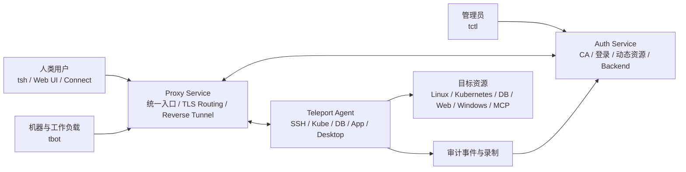
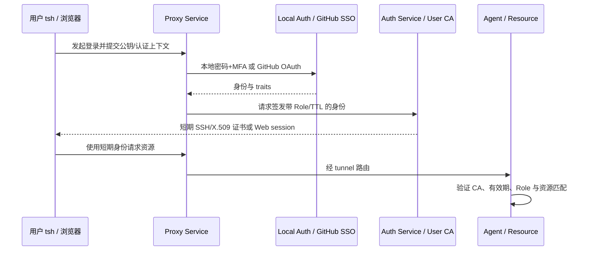
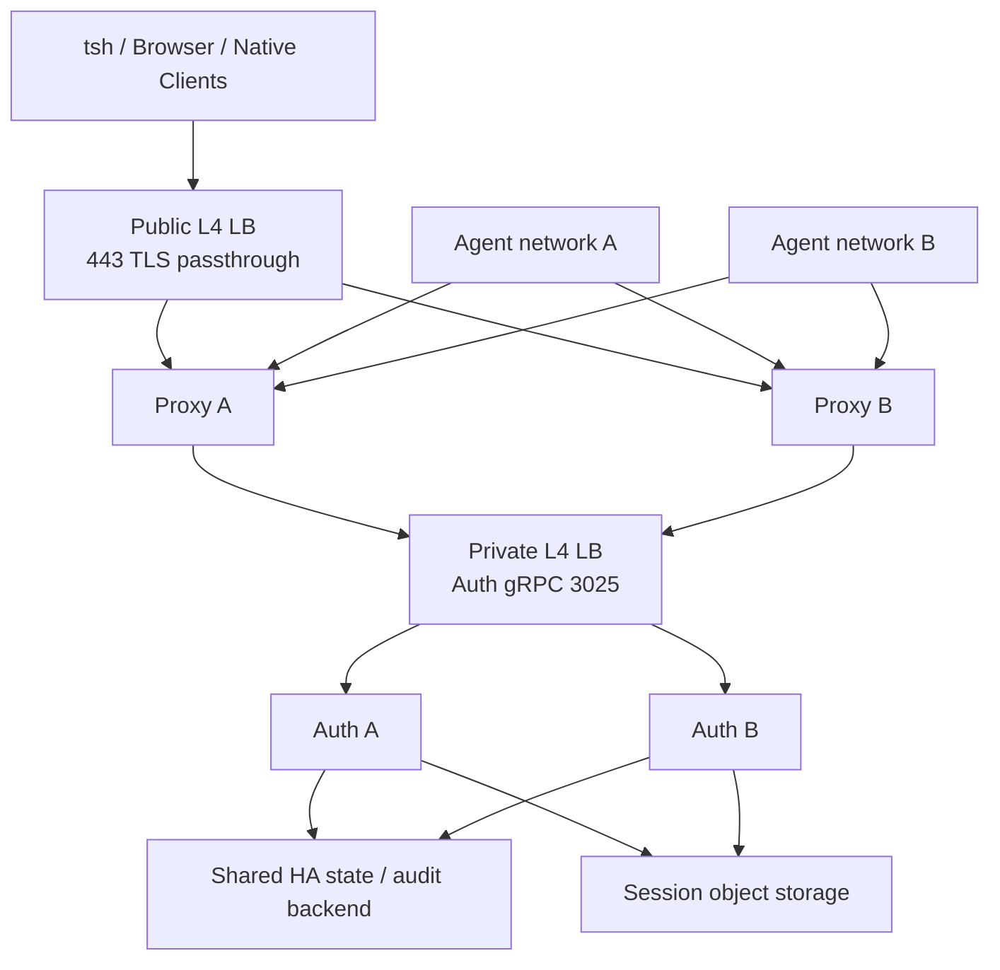

# Teleport OSS 深度技术文档

> **身份感知基础设施访问、短期证书、统一 RBAC、反向隧道与审计架构解析**
>
> 基于 Teleport 官方仓库、官方架构文档与 Feature Matrix 整理：<https://github.com/gravitational/teleport>
>
> 稳定版本基线：lightweight tag `v18.10.0` 直接指向 `ddaa46b8f4ee579d43480cd2d3b6a14b18e3ef7d`；Release 发布于 2026-07-09；审校日期：2026-09-06。正文只把该提交中可由 Teleport Community Edition/AGPL 源码自托管验证的能力纳入稳定承诺，Enterprise、Teleport Cloud、商业插件和 `master` 上未发布的 v19 开发内容仅作为边界说明。

---

## 目录

- [自动生成目录占位](#自动生成目录占位)

---

## 第一章：产品定位、许可证与证据边界

### 1.1 Teleport 解决什么问题

基础设施访问常被拆成多套彼此独立的系统：SSH key 管服务器，`kubeconfig` 管 Kubernetes，数据库账号和跳板机管数据层，VPN 提供网络可达性，Web SSO 只保护浏览器入口。结果是人员离职、权限变更、密钥轮换和审计检索都要跨系统完成，而且“能连到网段”常被误当成“有权访问资源”。

Teleport 把这组问题收敛为一个身份与证书控制面：

- Auth Service 维护用户 CA、主机 CA 和集群动态资源，完成登录、证书签发与授权决策；
- Proxy Service 暴露统一入口，承载 Web UI、协议路由和 Agent 反向隧道；
- 资源侧 Agent 解析 SSH、Kubernetes、数据库、应用、Desktop 与 MCP 等协议，执行资源匹配并产生审计事件；
- 人类通过 `tsh` 或 Web UI 获取短期身份，管理员使用 `tctl` 管理集群，机器身份由 `tbot` 持续获取和续期短期凭据；
- Role 把身份、标签、目标登录名、Kubernetes 用户/组、数据库用户/名和 MCP tool 等条件组合起来。

一句话概括：

> **Teleport 是身份感知访问代理、短期证书 CA、统一授权与审计系统；它缩短凭据寿命并集中访问路径，但不替代目标系统自己的授权、安全加固或终端防护。**

### 1.2 与常见接入方式的差异

| 方案 | 主要解决的问题 | 长期身份/密钥 | 资源级授权 | 协议审计 | Teleport 的差异 |
| --- | --- | --- | --- | --- | --- |
| VPN / ZTNA 网络接入 | 让终端到达网段或服务 | 常有设备证书或隧道凭据 | 通常停留在网络/应用层 | 通常是连接元数据 | Teleport 在会话建立时签发短期资源凭据并理解部分上层协议 |
| OpenSSH Bastion | SSH 跳转与集中入口 | 常见 authorized_keys 或代理转发 | 以 Unix login、SSH config 为主 | 可记录日志，完整性依赖额外组件 | Teleport 自带 SSH CA、角色/标签匹配、会话录制和资源库存 |
| 传统堡垒机/PAM | 账号托管、审批和录屏 | 可能保管目标账号密码 | 通常强，但产品与协议差异大 | 通常强 | Teleport 更强调证书、资源侧 Agent 与原生客户端协议；完整 PAM 治理不是 Community 承诺 |
| Kubernetes 原生 RBAC | 控制 Kubernetes API 对象 | kubeconfig/token/cert | 原生且最终生效 | API audit 由集群负责 | Teleport 负责入口、集群路由、身份映射和额外资源过滤，目标集群 RBAC 仍是第二道授权 |
| 数据库跳板机 | 建立数据库网络通道 | 数据库密码或云凭据 | 多依赖数据库自身账号 | 未必解析 query | Teleport 可签发数据库身份、代理原生 wire protocol 并按协议生成 query/RPC 事件 |
| Cloud IAM | 云资源权限 | 临时或长期云凭据 | 云厂商原生 | CloudTrail 等原生日志 | Teleport 可作为统一登录与本地代理入口，但最终云授权仍由 IAM 决定 |

Teleport 的价值不在于取代每个目标系统，而在于把“谁、以什么身份、从哪个入口、访问什么资源、持续多久、留下什么证据”统一起来。

### 1.3 本文中的 OSS 到底指什么

`v18.10.0` 存在三条必须分开的边界：

| 对象 | v18.10.0 官方证据 | 本文处理方式 |
| --- | --- | --- |
| GitHub 源码 | 仓库根 `LICENSE` 为 GNU AGPL-3.0 | 可以审计、构建和自托管；修改后通过网络提供服务时应评估 AGPL 第 13 条义务 |
| 官方 Community 二进制 | 同提交 Feature Matrix 标为 Teleport Community Edition License；许可文件限定为少于 100 名员工且年收入低于 1,000 万美元的组织 | 不能因为源码是 AGPL 就推断官方下载二进制也不受附加条件；部署前必须复核当期许可文本 |
| Enterprise / Cloud | 商业发行、托管控制面和额外 entitlement | 不纳入本文稳定兼容承诺，只在能力矩阵中标出边界 |

因此，本文使用“OSS”表示 **以 `v18.10.0` AGPL 源码和 Community 功能面为核心的自托管路径**，不是法律意见，也不替部署方判断官方下载包、商标、支持或再分发条件。

### 1.4 稳定版本证据

截至 2026-09-06，GitHub `releases/latest` 返回 `v18.10.0`，其 Release 状态为 `draft=false`、`prerelease=false`。该 tag 是 lightweight tag，直接指向 source commit：

```text
v18.10.0
└── commit ddaa46b8f4ee579d43480cd2d3b6a14b18e3ef7d
```

`master` 是下一个 major 的开发分支，仓库还存在多种 `v19.*-dev.*` tag；这些都不是本文的稳定能力证据。页面中的字段、默认值和兼容判断以 `ddaa46…` 为准，不把随后主线实现倒灌到 v18。

### 1.5 v18.10.0 与 OSS 直接相关的变化

| 变化 | 运维影响 |
| --- | --- |
| Windows Desktop 单次 RDP 会话可共享多个目录，并可在不中断会话时卸载 | 升级后应复测目录读写、卸载事件、磁盘占用和角色开关；AI session summary 属于 Identity Security，不是 OSS 承诺 |
| 修复 Redshift 通过 MCP 的连接问题 | 使用 MCP gateway 接数据库的环境应覆盖真实握手与查询，不应只测 `tools/list` |
| 修复 Application Access 会话过早到期以及长连接证书续期后的重复 403 | HTTP 长连接应在证书到期后收到 `Connection: close` 并重连；客户端仍需正确处理重连 |
| Kubernetes `kubernetes_resources.verbs` 中任意位置的 `*` 均应生效 | 模板展开和多 verb 角色要做回归；不要依赖旧版本的错误拒绝行为 |
| 添加 ephemeral container 要求同一 Role 同时有 `exec` 和 `patch`/`update` | 旧角色在升级后可能被拒绝，需显式核对 `pods/ephemeralcontainers` 权限 |
| 无效 Role expression、Access Request wildcard 与 session-join 字段在创建时加强校验 | 配置即代码流水线可能从“运行时失败”变成“创建时失败”，升级前应 dry-run/测试提交 |

---

## 第二章：总体架构

### 2.1 四个逻辑平面



可以把架构拆成四个逻辑平面：

| 平面 | 核心对象 | 关键职责 | 主要失败后果 |
| --- | --- | --- | --- |
| 身份面 | CA、用户、Agent host identity、Bot identity | 认证、签发、续期、CA 轮换、Trusted Cluster 信任 | 新登录/新连接失败，错误信任根可能扩大到全资源 |
| 控制面 | Auth Service、Backend、动态资源 | 保存 Role、User、Connector、资源库存、锁/请求等状态 | 配置变更、签发和库存更新受阻 |
| 数据面 | Proxy、Reverse Tunnel、各类 Agent | 协议路由、资源连接、部分协议解析 | 已有或新会话中断，资源不可达 |
| 审计面 | 事件 backend、session recording backend、导出器 | 事件检索、录制、回放、SIEM 导出 | “可连接但不可证明”，sync 模式还会主动终止会话 |

逻辑平面不是必须部署成四套进程。Teleport 是单一 Go 二进制，一个进程可以启用多个 Service；生产环境则应按权限、暴露面、扩缩容和故障域把角色拆开。

### 2.2 Auth Service

Auth Service 是信任根和持久状态入口，主要负责：

- 维护用户 CA、主机 CA、JWT CA、数据库/Windows 等签发所需密钥；
- 校验本地用户或 GitHub SSO 登录，生成短期用户证书；
- 保存 Role、User、Join Token、Trusted Cluster、资源定义等动态资源；
- 接收 Agent 心跳、审计事件和会话录制；
- 通过 gRPC API 为 Proxy、Agent、`tctl`、`tbot` 和集成提供控制面服务。

Auth Service 的 backend 不是普通业务缓存。拿到 backend 读写权限往往等价于能接触 CA、用户记录和授权配置；备份介质也应按最高敏感级别加密、限权和审计。

### 2.3 Proxy Service

Proxy Service 是面向客户端和 Agent 的入口：

- 接受 `tsh`、浏览器、原生 SSH、数据库客户端或本地 proxy 的连接；
- 提供 Web UI 和登录 API；
- 通过 ALPN/SNI 做 TLS Routing，常可把多协议收敛到外部 `443`；
- 接收 Agent 建立的反向 SSH 隧道，并按资源地址/集群路由到对应 Agent；
- 在需要时终止 TLS、WebSocket 或 Recording Proxy 流量。

Proxy 被称为“无状态”是指其持久业务状态位于 Auth/backend，不代表它没有高价值的瞬时数据。Web UI cookie、正在转发的明文、Recording Proxy 中的连接材料和流量元数据仍使它成为高优先级攻击面。

### 2.4 Teleport Agent 与资源服务

一个 `teleport` 进程可以启用多个服务：

| Agent Service | 上游资源 | 典型下游协议/身份 |
| --- | --- | --- |
| SSH Service（传统文档也称 Node Service） | 所在 Linux 主机或 OpenSSH 节点 | SSH host/user certificate |
| Kubernetes Service | Kubernetes API Server | HTTPS、impersonation header、ServiceAccount/kubeconfig |
| Database Service | 自托管或云数据库 | PostgreSQL/MySQL/MongoDB 等 wire protocol、mTLS、IAM |
| Application Service | HTTP、TCP、Cloud API、MCP | HTTPS/TCP、JWT/ID token、云签名、MCP transport |
| Desktop Service | Windows 主机 | Teleport Desktop Protocol 到 RDP，证书/智能卡认证 |
| Discovery Service | 云和平台 discovery API | 创建/更新动态资源，不直接等同于数据面代理 |

Agent 既是网络桥，也是授权和审计执行点。把 Agent 部署在资源附近可避免向公网开放目标端口，但 Agent 所在主机因此拥有到目标资源的网络路径和必要凭据，必须用主机权限、ServiceAccount、云 IAM 和网络策略限制其爆炸半径。

### 2.5 客户端分工

| 工具 | 身份对象 | 典型用途 | 安全注意事项 |
| --- | --- | --- | --- |
| `tsh` | 人类交互身份 | 登录、SSH、Kubernetes、数据库、App、MCP、本地 proxy | 私钥和证书保存在客户端 profile；终端失陷仍可能劫持有效会话 |
| `tctl` | 集群管理员 | 读取/写入动态资源、CA 与运维操作 | 通常需直连 Auth 或具管理员身份；不应分发给普通用户 |
| `tbot` | Bot / workload identity | 自动获取并续期 SSH、X.509、JWT、SPIFFE 等输出 | 初始 join 凭据、输出目录权限和续期进程均是信任边界 |
| Teleport Connect / Web UI | 人类交互身份 | 图形化资源访问、Desktop、录制查看 | 浏览器路径由 Proxy 终止并重编码，cookie/浏览器安全更重要 |

### 2.6 反向隧道与 NAT 后资源

默认推荐路径是 Agent 主动拨号到 Proxy，建立反向 SSH tunnel：

```text
用户 -> 公网/L4 LB -> Proxy
                     ^
                     | Agent 主动建立并维持出站 tunnel
                     |
               内网 Agent -> 目标资源
```

这带来三个结果：

1. 用户不需要直接路由到 Agent 或目标资源；
2. 防火墙通常只需允许 Agent 到 Proxy 的出站连接及 Agent 到资源的内网连接；
3. 断网、代理、TLS inspection、ALPN/SNI 过滤或空闲连接回收都可能表现为“资源离线”。

Self-hosted 仍有 direct mode，但只支持部分 Service，且需要 Proxy 直接拨 Agent。官方架构把它定位为 legacy 路径；新部署应优先反向隧道。

### 2.7 单机、拆分和 Kubernetes 拓扑

| 拓扑 | 适用范围 | 优点 | 主要风险 |
| --- | --- | --- | --- |
| 单进程同时启用 Auth/Proxy/SSH | 本地演示、PoC | 配置简单 | 单点故障；公网入口与 CA 共进程；本地 SQLite/录制容量有限 |
| 独立 Auth pool + Proxy pool | 常规生产 | 权限和暴露面分离，可独立扩缩 | 需要共享 backend、两个 L4 入口、TLS/DNS 与备份体系 |
| Kubernetes `teleport-cluster` Helm | 已有成熟 K8s 平台 | 声明式部署、滚动更新、Service/LB 集成 | 不能把 Kubernetes 高可用误当成 backend/CA 高可用；Secret 和 Pod 权限仍要治理 |
| 每个网络域部署资源 Agent | 多 VPC、IDC、边缘 | 仅需出站 tunnel，资源就近访问 | Agent 数量、版本漂移、网络策略和证书轮换复杂度上升 |

### 2.8 Backend、watch 与缓存不是同一层

Auth Service 通过 backend 持久化动态资源，并向 Proxy、Agent 和其他 Auth client 提供 watch/event stream；各 Service 使用本地 cache 减少热路径对 backend 的直接读取并维持资源视图。这里有三个容易混淆的结论：

- cache 命中能改善读延迟，不会把无持久 backend 的多 Auth 部署变成高可用；
- watch 中断后本地组件可能短暂继续使用已有视图，但新 Role、撤销、资源上下线和 CA 状态传播会延迟；
- backend 恢复、cache 重同步和 Agent tunnel 恢复是三条独立链路，健康检查必须分别覆盖。

所以“Proxy 无状态”和“Agent 有缓存”都不意味着控制面可长期离线运行。证书到期、新登录、动态策略传播、同步审计等操作仍需要 Auth/backend 可用。

---

## 第三章：身份、证书与信任链

### 3.1 人类登录链路



短期证书减少了长期 SSH key、静态 kubeconfig 和数据库密码的分发需求，但不等于无需撤销机制：证书在 TTL 内仍可被滥用，主动安全事件还需要缩短 TTL、终止会话或使用商业锁定能力。

### 3.2 CA 与证书类型

| 身份/用途 | 证书或签名 | 主要验证方 |
| --- | --- | --- |
| SSH 用户和主机 | OpenSSH certificate | Teleport SSH Service、兼容 OpenSSH 服务端/客户端 |
| Kubernetes、数据库、App、内部 Service | X.509 certificate | Proxy、Agent、目标资源或本地 proxy |
| Web/App/MCP 身份透传 | Teleport JWT CA 或 OIDC CA 签名的 JWT | 应用/MCP server 通过 JWKS/OIDC discovery 验证 |
| Agent 内部身份 | 含 host ID、cluster name、system role、expiry 的 host cert | Auth、Proxy 与其他集群组件 |
| Trusted Cluster | Root/Leaf CA 信任与角色映射 | Leaf Auth/Agent |

用户和 Bot 凭据通常短期并由客户端/`tbot` 续期；Teleport 内部 Service 初次加入后得到更长期的主机身份，不能把它与用户短期证书的风险模型混为一谈。内部身份失陷时通常要移除节点并进行 CA 轮换或使用额外的锁定能力。

### 3.3 Community 认证能力边界

| 能力 | v18.10.0 Community 边界 |
| --- | --- |
| 本地用户 | 支持密码与 MFA；密码、MFA 设备元数据位于 Auth backend |
| TOTP | 支持，可作为本地用户第二因素 |
| WebAuthn / FIDO2 / U2F authenticator | 支持作为本地 MFA/Passwordless authenticator；具体平台与浏览器兼容性需验证 |
| GitHub SSO | Community 唯一官方 SSO connector |
| OIDC / SAML | Enterprise；不能因源码中存在类型或文档示例就视为 Community 可用 |
| Per-session MFA | Feature Matrix 标为 Community 可用，可按集群或 Role 要求；协议支持细节不同 |
| Device Trust、IP pinning、硬件私钥强制 | Enterprise，不纳入本文承诺 |

WebAuthn authenticator 能用于 MFA，不等于 Enterprise 的“硬件私钥支持/强制硬件 key-backed client key”能力。两者都可能使用 YubiKey，但保护的密钥、执行位置和授权语义不同。

### 3.4 Agent 与 Bot 的 Join Method

加入集群是给一个尚未受信任的进程签发初始身份，选择错误会把短期证书体系重新退化成长秘密：

| Join Method | 典型环境 | 安全属性 | 生产建议 |
| --- | --- | --- | --- |
| Static token | 旧环境 | 长期可重放秘密 | 官方明确不推荐；只用于受控迁移并尽快删除 |
| Ephemeral token | 通用 | 默认短 TTL，可限制 system role | 最小化 token TTL 和角色；不要写入镜像或 Git |
| `bound_keypair` | 有持久盘的 on-prem/Bot；v18.8 起也可用于 Agent | 首次绑定公钥，后续不重复暴露 bearer secret | 适合不能使用云身份或 TPM 的环境，先核对 Agent 限制 |
| AWS IAM / EC2 | AWS | 以云实例/角色身份证明 | 优先 IAM；限制可加入的 account/role 和 token rules |
| Azure / GCP / Kubernetes / GitHub 等 delegated method | 对应平台 | 使用平台签发的工作负载身份 | 校验 issuer、audience、repository、namespace、ServiceAccount 等条件 |
| TPM | 具备 TPM 的主机/Bot | 设备绑定和硬件保护 | v18 Feature Matrix 将相关 HSM/TPM能力置于商业边界，Community 不作承诺 |

Join Token 不是普通安装参数。泄露的 token 若仍有效，攻击者可能注册具有 `node`、`app`、`db` 等 system role 的 Agent；审计中应监控 `join_token.create` 和新 host identity。

### 3.5 Machine & Workload Identity 与 `tbot`

`tbot` 代表非交互身份，循环执行“证明自身 → 获取短期身份 → 写入 destination → 到期前续期”。Community Feature Matrix 包含基础的机器/工作负载身份签发、轮换、RBAC/ABAC、审计，以及 JWT/SPIFFE/X.509 等开放格式；HSM/TPM bootstrap、外部 PKI issuer override 和 Sigstore attestation 不在 Community 承诺内。

生产落地应明确：

- Bot 是独立身份，不要让它复用人的 `tsh` profile；
- destination 目录只允许目标 workload 读取，避免同节点其他进程窃取证书；
- 输出格式和目标协议的 TTL 必须匹配，不能让下游缓存超过 Teleport 身份寿命；
- `tbot` 退出或网络隔离后，已有短期凭据可能继续有效到过期，但无法续期；
- 初始 join method 与后续凭据是两类不同秘密，必须分别轮换和监控。

### 3.6 Trusted Cluster

Self-hosted Teleport 可以让 root cluster 用户访问 leaf cluster 资源。Leaf 保留自己的 backend、用户、Role 和资源，并通过 role mapping 决定 root 身份能映射成哪些本地权限。

Trusted Cluster 不是简单的跨集群网络隧道：它建立 CA 级信任。官方架构特别提醒，leaf 的 `cluster_labels` 不能替代 role mapping 作为安全边界；持有 root CA 签发证书的用户可能绕过仅用于可见性筛选的 cluster label。应把 root CA、leaf role mapping 和反向 tunnel 一起纳入威胁建模。

---

## 第四章：授权模型与最小权限

### 4.1 Role 的求值规则

Teleport Role 同时表达平台 API 权限、目标身份和资源选择器。核心规则是：

1. 默认拒绝；
2. `deny` 先求值并优先于 `allow`；
3. 多个 Role 的 principals 通常合并，但部分 options 使用 OR、AND 或“最严格值”合并，不能一概视为 union；
4. `allow` 标签集合通常要求所有 key 匹配，`deny` 的标签匹配更贪婪；
5. wildcard、正则和 trait 模板会显著扩大匹配面，应在创建时和真实资源库存上同时测试。

常见资源字段如下：

| 字段 | 控制对象 | 还需要的目标身份/动作 |
| --- | --- | --- |
| `node_labels` | SSH nodes | `logins`、命令/端口转发等 Role option |
| `kubernetes_labels` | Kubernetes clusters | `kubernetes_users`、`kubernetes_groups`、`kubernetes_resources` |
| `db_labels` | Databases | `db_users`、`db_names`、可选数据库对象权限 |
| `app_labels` | Web/TCP/Cloud/MCP apps | MCP 还要 `mcp.tools`；云服务还受云 IAM 约束 |
| `windows_desktop_labels` | Windows desktops | `windows_desktop_logins`、clipboard/directory/recording option |
| `rules.resources` + `verbs` | Teleport 动态资源/API | 控制 list/read/create/update/delete 等管理操作 |

### 4.2 最小权限 Role 示例

下面的 Role 只允许工程师以 `ubuntu` 登录 `env=dev,team=ml` 的节点，只读访问 dev Kubernetes namespace，并调用指定 MCP tool。示例刻意不使用全局 `*:*`：

```yaml
kind: role
version: v8
metadata:
  name: ml-dev-access
spec:
  options:
    max_session_ttl: 4h
    require_session_mfa: true
    forward_agent: false
    ssh_port_forwarding:
      local:
        enabled: false
      remote:
        enabled: false
  allow:
    logins: [ubuntu]
    node_labels:
      env: dev
      team: ml
    kubernetes_labels:
      env: dev
    kubernetes_users: [ml-viewer]
    kubernetes_groups: [viewers]
    kubernetes_resources:
      - kind: pods
        namespace: ml-dev
        name: '*'
        verbs: [get, list, watch]
      - kind: deployments
        api_group: apps
        namespace: ml-dev
        name: '*'
        verbs: [get, list, watch]
    app_labels:
      env: dev
      class: mcp
    mcp:
      tools:
        - search-files
        - '^get_.*$'
  deny:
    node_labels:
      quarantine: 'true'
    mcp:
      tools:
        - delete_*
        - '*write*'
```

上线前至少验证：目标 labels 是否真实存在、无标签资源会怎样、trait 展开为空或多值时怎样、多个 Role 合并后有没有另一个 Role 重新放开端口转发，以及 v18.10 对 Role expression 的创建时校验是否会拒绝旧配置。

### 4.3 Kubernetes 的双层授权

Kubernetes 请求至少经过两层策略：

```text
Teleport Role
  ├─ kubernetes_labels：能选择哪个注册集群
  ├─ kubernetes_users/groups：允许 impersonate 成谁
  └─ kubernetes_resources：Teleport 代理允许哪些 API 对象/verb
                ↓
Kubernetes API Server
  └─ 原生 RBAC / admission / policy：最终是否接受 impersonated user/groups
```

Teleport 允许不代表 API Server 必然允许；Teleport 拒绝时，请求甚至不会到达 API Server。排障时应分别检查 Teleport audit、Role v8 语义、impersonation header 和目标集群 audit/RBAC。

v18.10.0 还有两个具体兼容点：`verbs` 中 `*` 的位置不再影响 wildcard 识别；添加 ephemeral container 需要 `exec` 与 `patch`/`update` 在同一个 Role 的 `kubernetes_resources` 中同时满足。把权限拆到两个 Role 不能假定等价。

### 4.4 Access Request、Session Join 与 Lock 的边界

| 能力 | Community v18.10.0 | Enterprise 边界 |
| --- | --- | --- |
| Access Request | `tsh` 可请求 Role；管理员需在 Auth 上用 `tctl` 审批 | 资源级请求、review rules、可搜索 UI、自动审批和完整 JIT workflow |
| Session Join / sharing | Feature Matrix 将 Session Sharing & Moderation 标为 Community 不可用，不纳入本文承诺 | Observer/Peer/Moderator、`join_sessions` 与 moderated session 工作流 |
| Session/Identity Lock | Feature Matrix 标为 Identity Governance，Community 不可用 | 对 user、role、session、host、MFA device、bot 等发 lock，并终止已有连接 |
| Dual authorization | Community 不可用 | 商业版可要求额外审查/参与者 |

Role schema 或 AGPL 源码里出现 `join_sessions`、`require_session_join`、`lock` 等类型，不代表官方 Community 二进制启用了对应产品能力。本文的 OSS 设计不能把它们当作应急阻断的唯一手段；Community 环境需要准备删除用户/Role、撤销 join token、缩短 TTL、隔离 Agent 和 CA 轮换等替代流程。

### 4.5 常见授权误配

| 误配 | 风险 | 修正方式 |
| --- | --- | --- |
| `'*': '*'` 同时覆盖 prod/dev | 新资源自动继承过宽权限 | 用明确 environment/team/owner labels，并对无标签资源默认拒绝 |
| 允许 `root` 或 `system:masters` 作为日常 principal | 绕过目标侧最小权限 | 创建专用 Unix login、Kubernetes user/group 和数据库 role |
| 只看 allow，不审计 deny 与多 Role 合并 | 实际权限与单文件阅读不同 | 用真实用户身份执行 allow/deny 正反案例 |
| 开启 SSH Agent Forwarding | 远端 root 或恶意进程可借用 agent 签名 | 默认关闭，仅对必须的兼容场景短期开启 |
| 广泛开启端口转发 | Teleport 变成通用内网跳板，协议审计被绕过 | 区分 local/remote forwarding；优先使用对应资源 Service |
| 用可变云标签直接授予高权 | 资源创建者可通过改标签提权 | 保护标签写入面，使用受控 discovery/IaC 和 deny guardrail |
| MCP tool 允许 `*` | 新增危险 tool 自动可用 | allowlist read-only tool，显式 deny 写/删类 tool，并审计参数 |

---

## 第五章：各类资源的访问路径

### 5.1 SSH Server Access

典型链路是 `tsh login` 获取短期 SSH user certificate，客户端连接 Proxy，再经 reverse tunnel 到目标 SSH Service。Agent 验证 user CA、TTL、Role、node label 和 Unix login 后创建 PTY 或执行非交互命令。

| 能力 | 访问/审计特点 | 边界 |
| --- | --- | --- |
| 交互 PTY | 录制终端输出和 resize 等事件 | 记录“用户看到的字节流”，不保证识别所有真实系统调用 |
| 单命令执行 | 产生 exec/session 事件 | 脚本内部命令可能只表现为脚本及其输出 |
| SFTP/SCP | 通过 SSH 通道传输 | 文件内容、路径和协议事件覆盖需按客户端与版本实测 |
| Local/Remote Port Forward | Role option 控制 | 代理只看到隧道，不等同于理解隧道内数据库/HTTP 操作 |
| SSH Agent Forwarding | 可按 Role 允许 | 提高被远端滥用签名能力的风险，Recording Proxy 旧路径尤其敏感 |
| Enhanced Recording | Linux BPF 事件补充进程/网络活动 | 不能阻止具高权限用户卸载探针；daemon、ptrace、内核边界仍有盲区 |

Teleport 与 OpenSSH certificate 兼容，但“兼容 OpenSSH”不等于所有 Teleport 会话控制和录制能力在 agentless OpenSSH 上都完全相同。上线必须按交互、非交互、SFTP、forwarding 和退出状态分别验证。

### 5.2 Kubernetes Access

用户运行 `tsh kube login` 后，本地 kubeconfig 指向 Teleport 并使用短期身份。Kubernetes Service 选择注册集群、校验 Teleport Role、写入允许的 impersonation user/group，再把 HTTPS 请求发往 API Server。

关键审计差异：

- 普通 API 请求产生 Kubernetes request 类事件；
- `kubectl exec` 的交互 PTY 可以录制，风险与 SSH PTY 相同；
- port-forward、attach、exec、ephemeralcontainers 都应做独立用例，不能用 `kubectl get pods` 代表全部；
- 最终 admission、Pod Security、OPA/Kyverno 和原生 Kubernetes audit 仍属于目标集群。

### 5.3 Database Access

`tsh db login/connect/proxy` 获取数据库专用短期证书或启动本地 proxy。Database Service 校验 Teleport identity 和 `db_labels`、`db_users`、`db_names`，再使用目标数据库支持的 mTLS、IAM 或服务凭据连接。

v18.10 官方文档覆盖 PostgreSQL、MySQL/MariaDB、MongoDB、CockroachDB、Redis、SQL Server、云托管数据库等多种协议；Community Feature Matrix 明确不包含 Oracle 支持，因此本文不把 Oracle 放入 OSS 稳定矩阵。

数据库审计不是“全协议录屏”：

- 所有受支持协议可输出 JSON 形式 session 事件；
- PostgreSQL session 可交互回放；
- `db.session.query` 可能包含 SQL 文本和 prepared statement 参数；
- Spanner 等 HTTP/RPC 协议使用专门 RPC 事件；
- 加密 payload、客户端扩展、存储过程内部动作或绕过 Database Service 的直连，不能假设被完整解析。

因此数据库审计仓库本身可能包含口令片段、PII 或业务数据，保留和 SIEM 导出必须做字段分类与访问控制。

### 5.4 Application、TCP 与 Cloud API Access

Application Service 可代理 HTTP、WebSocket 和 TCP 应用。Web 应用路径可把 Teleport-signed JWT 放在默认 `Teleport-Jwt-Assertion` 或管理员指定 header 中；目标应用必须从集群 JWKS 验证 signature、issuer、audience、expiry，不能只相信 header 存在。

TCP app 能把不受 Teleport 原生支持的协议接入统一入口，但会失去上层协议语义。若把数据库作为 generic TCP app，得到的是连接级审计，不应声称等价于 Database Service 的 query 审计。

Cloud API 路径通常由 `tsh proxy aws|azure|gcloud` 启动本地 listener，Application Service 使用 ambient credential、集成或 impersonation 为请求换取/签名短期云身份。Teleport Role 决定“可选择哪个云 app/role”，云 IAM 决定“该身份能对云资源做什么”，二者缺一不可。

v18.10.0 修复了长连接证书续期后反复 403 的问题：证书到期时 Proxy 用 `Connection: close` 促使客户端重建连接。这个修复不会替客户端自动重放非幂等请求，升级验证应区分 GET、stream/WebSocket 和有副作用的 POST。

### 5.5 Git Access 的保守边界

Git 流量可通过 SSH/OpenSSH、HTTPS Application Access 或 TCP app 接入，因而基础 clone/fetch/push 可以复用 Teleport 的网络入口与身份。但 v18.10.0 的专用 GitHub integration 指南同时要求 Teleport Enterprise v17.2+ 和 GitHub Enterprise Cloud；这与顶层 Feature Matrix 把 GitHub 列在 Community protected resources 的宽泛表述并不完全一致。

为避免扩大承诺，本文采用保守判定：

- Community 稳定承诺只包含用已有 SSH/App/TCP 机制保护 Git endpoint；
- 专用 GitHub 组织集成、GitHub SSH CA 自动化或细粒度 repository 映射不作为 OSS 能力；
- GitHub SSO connector 与 GitHub repository access 是两件事，前者是 Community 登录方式，后者要看具体接入实现和 GitHub 许可。

### 5.6 Windows Desktop Access

Desktop Service 把 Teleport Desktop Protocol 转为 RDP，并通过证书/智能卡路径登录 Windows。客户端使用 Web UI 或 Teleport Connect；Desktop Service 需要能访问 Windows `3389` 和相关目录/域服务。

v18.10.0 的 Community 关键边界：

- 可提供屏幕会话录制、clipboard 和 directory sharing 审计；
- local Windows user 的 passwordless access 最多 5 台 desktop；若 `static_hosts` 中 `ad:false` 超过 5 台，Community 会拒绝连接这些主机，而不是只拒绝第 6 台；
- Desktop 录制捕获屏幕变化和鼠标输入，不记录远程桌面的按键流；
- clipboard 事件只记录方向和字节数以避免内容泄漏；directory 事件会记录目录名、相对路径、offset 和长度，但不保存文件内容；
- v18.10 支持一次 RDP session 共享多个目录并单独卸载，应验证卸载后句柄、失败事件和目录 traversal 防护。

Windows 录制以屏幕变化 PNG 为主，容量明显高于终端字节流。1080p 大面积重绘可能产生约 250KB 数据，Desktop Service 本地异步录制目录和对象存储容量都要单独估算。

### 5.7 MCP Access

MCP server 在 v18 Feature Matrix 中是 Community 可用的一等资源。它复用 Application Service，并支持三类 transport：

| Transport | Agent 行为 | 版本/边界 |
| --- | --- | --- |
| stdio | Application Service 以配置的 `run_as_host_user` 启动命令并代理 stdin/stdout | v18.1+；启动命令直接获得 Agent 主机权限，必须隔离 host user/container |
| HTTP with SSE | Agent 建立 SSE 与消息通道 | MCP 2025-03-26 已弃用该 transport，优先迁移 |
| Streamable HTTP | 代理远端 HTTP MCP；`tsh proxy mcp` 可建本地 HTTP listener | v18.3+；适合现代 MCP 客户端 |

客户端先用 `tsh` 的短期身份建立 MCP session，Role 的 `app_labels` 选择 server，`mcp.tools` 对 literal、glob 或正则 tool name 做 allow/deny。未配置 allowed tools 时默认不允许任何 tool。

上游 MCP server 还可验证 Teleport 注入的两种 JWT：

- Classic JWT：由 Teleport JWT CA 签发，通过 `/.well-known/jwks.json` 验证；默认 header 为 `Teleport-Jwt-Assertion`，也可改写为 `Authorization: Bearer {{internal.jwt}}`；
- OIDC ID token：由 Teleport OIDC CA 签发，通过 `/.well-known/openid-configuration` 和 JWKS 验证，可用 `{{internal.id_token}}` 注入。

这两种是 Teleport 到上游 MCP 的 egress identity，不应与用户最初登录 Proxy 的 local/GitHub SSO 流程混淆。

MCP 产生 `mcp.session.start/end/request/notification/listen_sse_stream/invalid_http_request` 等事件。`request` 事件可包含 JSON-RPC method、id 和经过事件化处理的 params；成功的 `ping`、resources/prompts/tools list 等 discovery 调用会被跳过以减噪。因此“每个危险 tool 调用可审计”不等于“逐字记录所有 MCP frame”，也不等于审计 backend 适合存放未经脱敏的 prompt、secret 或 tool 参数。

---

## 第六章：会话记录、审计与数据治理

### 6.1 各协议到底记录什么

| 资源类型 | 结构化事件 | 会话/内容记录 | 关键盲区或敏感性 |
| --- | --- | --- | --- |
| SSH | login、session、exec、file/forwarding 等相关事件 | PTY 输出；可选 BPF enhanced events | 编码命令、脚本内部、daemon/ptrace 等可能不完整；终端可能显示 secret |
| Kubernetes | API request、session、exec 等 | `kubectl exec` PTY | 非 exec API 不是视频；最终行为还需 Kubernetes audit |
| Database | start/end/query/RPC | JSON；PostgreSQL 可交互回放 | query 与参数可能含敏感数据；协议支持粒度不同 |
| Application | `app.session.start`、按 5 分钟 chunk 聚合的 request 事件 | HTTP request stream 的结构化事件，不是页面视频 | generic TCP 只有有限语义；body/header 记录范围需实测 |
| Desktop | session、clipboard、directory read/write 等 | 屏幕变化与鼠标，不记录 keystroke | 容量大；屏幕仍可能显示 secret；clipboard 只记字节数 |
| MCP | session、JSON-RPC request/notification 等 | 协议事件，不是完整录屏 | 部分 discovery 调用减噪跳过；params 可能含 token/PII |

“支持资源”只说明可建立代理连接；“有事件”说明某些阶段可检索；“可回放”才说明存在 session artifact。这三层不能互相替代。

### 6.2 同步与异步录制

Teleport 有 `node-sync`、`node`、`proxy-sync`、`proxy` 四种集群级模式：

| 模式维度 | 语义 | 可用性与完整性取舍 |
| --- | --- | --- |
| sync | 录制组件持续把事件发往 Auth；发不出去视为 fatal | 审计失败会终止会话，适合强合规；依赖低延迟高可用 Auth/backend |
| async | 先写 Agent/Proxy 本地盘，会话后组装上传 | Auth 短暂不可用时会话可继续；本地盘可能满、被删或被篡改 |
| node | SSH 在资源侧录制，Proxy 看不到端到端 SSH 明文 | 降低 Proxy 权限，通常更安全 |
| proxy | Proxy 终止并重建 SSH 连接以录制 | Proxy 可见明文和瞬时 key material；兼容模式有更多限制 |

Windows、Database、Kubernetes 的“node/proxy”最终都由对应 Service 所在 host 录制，因为目标资源上没有 Teleport binary。所有模式可配置录制静态加密，HA Auth 实例必须访问同一 key backend，否则回放可用性会下降。

### 6.3 事件 backend 与录制 backend

三类数据不应混为一个“Teleport 数据库”：

| 数据 | 典型内容 | v18.10 OSS 可用 backend |
| --- | --- | --- |
| Core cluster state | CA、Role、User、Agent/Proxy membership、动态资源 | Local SQLite、etcd、PostgreSQL、DynamoDB、Firestore；CockroachDB 需 Enterprise |
| Audit events | 登录、RBAC 变更、session/query/tool event | Local、PostgreSQL、DynamoDB、S3/Athena、Firestore 等，按 backend 能力配置 |
| Session recordings | PTY、Desktop frame、session artifact | Local、S3/部分兼容实现、GCS、Azure Blob |

etcd 适合 core state，不适合大量时序 audit event；DynamoDB/Firestore 不保存 recording object；S3 不能作为 core state backend。高可用设计必须给三类数据分别选型和演练。

### 6.4 敏感数据治理

最少应定义以下控制：

- 谁能 `list/read` `event`、`session` 和录制对象；
- SIEM 导出是否把 SQL 参数、MCP params、URL query 或用户名扩散到更多系统；
- 对象存储版本控制、WORM/immutability、KMS key、生命周期和 legal hold 策略；
- 本地 async spool 的磁盘加密、容量告警和节点取证流程；
- 录制保留期与业务数据删除/隐私请求之间如何协调；
- NTP/时钟源、cluster name、session ID 和 event index 是否足以跨系统关联；
- 审计系统自身的配置变更、导出失败、backend throttling 和对象上传失败是否告警。

高合规环境应把“审计不可用时拒绝访问”作为显式 SLO，而不是默认认为打开 recording 就已实现 fail closed。

---

## 第七章：部署、高可用与迁移

### 7.1 单机 PoC 的正确用途

单机模式适合验证认证、Role 和资源路径，但不代表生产架构。一个最小概念配置通常同时开启 Auth、Proxy 和 SSH：

```yaml
version: v3
teleport:
  nodename: teleport-poc
  data_dir: /var/lib/teleport
  proxy_server: teleport.example.com:443
auth_service:
  enabled: true
  cluster_name: teleport.example.com
  authentication:
    type: local
    second_factors: [webauthn, otp]
proxy_service:
  enabled: true
  public_addr: teleport.example.com:443
  https_keypairs:
    - key_file: /etc/teleport/tls.key
      cert_file: /etc/teleport/tls.crt
ssh_service:
  enabled: true
  labels:
    env: poc
```

示例不包含 token、私钥或真实域名。不要把 PoC 的 `/var/lib/teleport` 目录、生成的 CA、邀请 token 或 `tsh` profile 提交到 Git。

### 7.2 生产 HA 拓扑



官方 HA 架构要求两个冗余 pool：Auth 和 Proxy。Public L4 LB 面向用户/Agent，Private L4 LB 面向 Auth gRPC。LB 应透明转发 TCP 而非终止多协议 TLS；TLS Routing 开启时，多协议通过外部 443 的 ALPN 分流。

### 7.3 DNS、TLS 与网络策略

生产检查项包括：

- `teleport.example.com` 指向所有健康 Proxy；Application Access 需要每应用 DNS 或 `*.teleport.example.com` wildcard；
- TLS certificate 覆盖 cluster public address 和应用域名，并有独立续期/告警机制；
- Public LB 使用 L4/TCP、合理 idle timeout，并保留 ALPN/SNI；企业 TLS inspection 若改写握手会破坏路由；
- Proxy 到 Auth gRPC、Agent 到 Proxy reverse tunnel、Agent 到目标资源、Auth 到 backend/object store 各自有最小网络策略；
- diagnostics `--diag-addr` 只监听受控管理网；`/readyz` 不应直接暴露公网；
- 多可用区部署不够，DNS、LB、backend、object store、KMS 和 CA key backend 也要跨故障域。

### 7.4 Backend、备份与恢复

| 层 | 备份对象 | 恢复验证 |
| --- | --- | --- |
| Cluster state | backend point-in-time snapshot/逻辑备份 | Role/User/CA/Agent inventory 能恢复，新证书可签发 |
| CA key | backend 或外部 key store 中的 CA material | 受控环境验证签发与旧证书兼容，审计每次 key access |
| Audit event | 数据库/table/object 与索引 | 指定时间窗口可查询，event UID/session ID 不丢失 |
| Session recording | object、版本和 encryption key | 能按 session ID 解密回放，不只检查对象存在 |
| Static config | 所有 Auth/Proxy/Agent 的 `teleport.yaml`、Helm values | 多实例 cluster name、storage、token rules 一致且无明文 secret |

`tctl get all` 是配置导出工具，不是完整 backend/CA/recording 备份。恢复演练必须在隔离环境验证 DNS、cluster identity 和证书信任，避免把同一 CA 的测试副本意外接入生产网络。

### 7.5 从 PoC 到生产的迁移清单

1. 固定 `v18.10.0@ddaa46…` 和 Community/源码构建来源，记录 SBOM、hash 与构建参数；
2. 把 Auth、Proxy 和资源 Agent 拆分为独立 service account/OS user；
3. 从单机 SQLite/本地 recording 迁移到受支持的 HA state/audit/object backend；
4. 建立 Public/Private L4 LB、DNS、TLS 续期、NTP 与 diagnostics；
5. 先导入最小 Role 和非生产资源，跑 allow/deny/MFA/audit 用例；
6. 迁移 Agent 时使用短 TTL 或 delegated join，迁移后删除旧 token；
7. 对 SSH、Kubernetes、DB、App、Desktop、MCP 分别验证连接和审计，不以单一 SSH 成功替代；
8. 演练单 Proxy、单 Auth、backend 延迟、object store 拒绝和 Agent tunnel 重连；
9. 演练 backup restore 与 CA rotation，再开放生产用户；
10. 保留旧入口的只读观察期和明确回滚窗口，最后撤销长期 key、旧 kubeconfig 和数据库跳板账号。

迁移不是“装完 Teleport 就立即删除所有旧入口”。在审计和恢复路径尚未验证前同时切断 break-glass，可能把控制面故障放大为全公司失去基础设施访问。

---

## 第八章：安全模型与威胁分析

### 8.1 核心信任资产

| 资产 | 一旦失陷 | 保护重点 |
| --- | --- | --- |
| User/Host/JWT CA private key | 可伪造用户、Agent 或应用身份 | Auth 隔离、backend/KMS 权限、备份加密、CA rotation |
| Auth backend | 可篡改 Role/User/CA/库存和审计 | mTLS、最小 DB/IAM 权限、PITR、写入审计 |
| Proxy | 可劫持登录/路由；某些模式可见明文 | 公网加固、无 shell、及时补丁、限制 Recording Proxy |
| Agent host | 获得到目标资源的网络和服务凭据 | 独立 OS user、只读 FS、SELinux/AppArmor、最小 IAM/SA、网络分区 |
| `tsh` profile / 活跃终端 | 可在证书 TTL 内冒用用户 | 磁盘权限、短 TTL、终端 EDR、MFA、及时登出 |
| Join token / Bot bootstrap | 可注册恶意 Agent/Bot | delegated method、短 TTL、约束 rules、创建/使用审计 |
| Audit/recording storage | 可删除证据或泄漏敏感内容 | WORM、独立管理员、KMS、保留策略、完整性验证 |

### 8.2 典型威胁与缓解

| 威胁 | 形成方式 | 缓解措施 | 剩余风险 |
| --- | --- | --- | --- |
| 长期 SSH key 泄漏 | 历史 key 未撤销 | 用短期 cert 替代、清理 authorized_keys、禁直连 | 有效 Teleport cert/会话仍可在 TTL 内被用 |
| 被盗 Agent identity | Agent 主机或 data dir 失陷 | 隔离主机、重建 host identity、撤销 join path、CA rotation | Community 缺少商业 Lock 时应急粒度更粗 |
| 标签提权 | 低权用户能给资源写 `env=prod` | 将 label authority 与资源 owner 分离、deny guardrail、IaC review | 云 discovery 与业务标签可能发生漂移 |
| Wildcard 过宽 | `'*':'*'`、tool `*` 或正则错误 | 逐资源 allowlist、创建时校验、negative test | 新资源/新 tool 仍可能意外落入范围 |
| 审计绕过 | 端口转发、generic TCP、直连或禁录制 | 关闭 forwarding、网络仅允许 Agent、sync recording、目标侧 audit | 高权限主机用户仍可能干扰观测 |
| Proxy compromise | 公网漏洞、错误 TLS 或 Recording Proxy | L4 passthrough、最小服务、WAF 只放 Web 专用路径、快速补丁 | Web UI 路径仍需要在 Proxy 解密并重编码 |
| MCP prompt/tool 泄密 | 参数被事件记录或 tool 可读取 secret | tool allowlist、参数脱敏、最小上游 scope、独立 MCP host user | 模型/客户端自身仍可能泄露数据 |
| 时钟漂移 | cert 尚未生效或提前过期 | 多源 NTP、漂移告警、统一 UTC | 大范围 NTP 故障可同时影响全部 Service |

### 8.3 Teleport 不替代什么

- **主机加固/EDR。** 获准 SSH 的用户仍在真实主机执行，Teleport 不是执行 Sandbox；
- **Kubernetes API 安全。** Admission、Pod Security、ServiceAccount、etcd encryption 和 API audit 仍由集群负责；
- **数据库原生授权。** Teleport 选择数据库用户/role 后，表、行、存储过程权限仍应由数据库控制；
- **Secrets Manager。** Teleport 管访问身份，不是业务 API key、模型 token 或数据库业务 secret 的通用保管库；
- **通用零信任网络。** 它代理注册资源和部分 TCP endpoint，不是任意东西向网络分段或 SD-WAN；
- **完整 PAM/IGA。** Community 没有完整资源级 JIT、Access List review、Device Trust、Lock 和行为分析；
- **终端安全。** 客户端 malware 可劫持已认证会话，MFA 不能修复被控制的终端；
- **应用授权。** JWT 透传只证明 Teleport 身份，应用仍要验证 token 并执行自己的业务权限。

### 8.4 安全默认值建议

```text
短用户 TTL + WebAuthn/TOTP + per-session MFA（高风险 Role）
明确 labels + 专用 principals + deny guardrail
禁 SSH agent forwarding + 禁不必要 port forwarding
Agent 只出站到 Proxy + 只到指定目标端口
Auth/CA 与公网 Proxy 分池 + backend/object store 最小权限
sync recording（强合规）或加密 async spool（容错优先）
独立 audit 管理员 + SIEM 失败告警 + 定期恢复演练
```

---

## 第九章：运维、升级与故障排查

### 9.1 先按链路定位，而不是盲目重启

```text
Client
  -> DNS / TLS / ALPN / Proxy
  -> Auth login / MFA / CA signing / Role
  -> Reverse Tunnel inventory
  -> Agent authorization / protocol adapter
  -> Target native auth and authorization
  -> Audit backend / session object storage
```

每一跳都要有独立证据。常用只读检查可从以下命令开始：

```bash
teleport version
tsh version
tsh status
tsh ls
tsh kube ls
tsh db ls
tsh apps ls
tsh mcp ls
tctl status
tctl inventory ls
curl --fail --silent http://127.0.0.1:3000/readyz
```

`tctl` 命令需要管理员上下文，不应为了排障临时把管理员凭据复制到普通客户端。日志收集也应在分享前清理 token、cookie、Authorization header、数据库 query 参数和内部域名。

### 9.2 常见故障矩阵

| 现象 | 优先检查 | 常见原因 | 验证方法 |
| --- | --- | --- | --- |
| 登录后立即过期/尚未生效 | Client、Proxy、Auth 时间 | NTP 漂移、TTL/证书 clock skew | 对比 UTC、证书 `notBefore/notAfter`、Auth 日志 |
| Agent 加不进集群 | Join method、token rule、Proxy 地址 | token 到期/角色不匹配、issuer/audience 错、TLS trust 错 | 查看 `join_token.create`、Agent join error、云身份 claims |
| 列表有资源但连接超时 | Proxy tunnel 与 Agent 到目标网络 | tunnel 抖动、LB idle timeout、Agent 防火墙、目标端口关闭 | inventory 心跳、Proxy/Agent 日志、从 Agent 做目标 TCP check |
| `tls: no application protocol` | ALPN 与中间设备 | L7 LB/TLS inspection 删除 ALPN、端口映射错 | 绕过中间层、抓 ClientHello、确认 L4 passthrough |
| App 404/路由错 | SNI/public_addr/DNS | 重复 public address、wildcard DNS/证书不一致 | `tsh apps ls`、Host/SNI、v18.10 duplicate address 修复验证 |
| Kubernetes AccessDenied | 两层 RBAC | Teleport Role 拒绝、impersonation 无权、Role v8/verb 语义 | 对照 Teleport 与 kube-apiserver audit；测 get/exec/ephemeralcontainer |
| DB 能连但 query 无事件 | 协议路径与 audit backend | 走 generic TCP/直连、协议不支持、backend 写失败 | 核对 `db.session.start/query`、连接 endpoint、Event Handler |
| MCP server 可见但无 tool | `mcp.tools` 和 labels | 默认没有 tool、deny 贪婪、trait 为空 | `tsh mcp ls` warning、Role 展开结果、允许/拒绝各测一个 tool |
| Desktop 黑屏/登录失败 | Desktop Service、Windows CA/RDP | CA 未信任、域/KDC/DNS、Community 数量限制 | Desktop audit start failure、Windows event、`ad:false` host 数量 |
| 会话因 audit 中断 | sync recording path | Auth/backend 延迟、IAM 拒绝、对象/事件写失败 | Event/recording error、backend latency、模拟恢复后重试 |

### 9.3 可观测性基线

至少监控：

- Auth/Proxy/Agent `/readyz` 与进程重启；
- Agent inventory 在线率、reverse tunnel 数量和重连频率；
- 登录成功/失败、MFA 失败、证书签发延迟；
- backend request latency、throttling、watch/change-feed lag；
- audit emit error、async spool backlog/磁盘、recording upload error；
- TLS certificate 剩余天数、CA rotation phase、系统时钟偏差；
- 版本分布，尤其是 Auth、Proxy、Agent 与 `tbot` major version 差距；
- Role、User、Connector、Join Token、Trusted Cluster 等高风险资源变更。

告警必须指向可执行 runbook。例如“Agent 离线”要能区分 Proxy 故障、DNS、证书、Agent 进程和目标资源故障，而不是只通知某个主机 ping 失败。

### 9.4 升级顺序与版本兼容

Self-hosted Teleport 的官方顺序是：

```text
备份并验证恢复点
  -> 升级所有 Auth Service
  -> 健康验证
  -> 升级所有 Proxy Service
  -> 健康验证
  -> 升级 Agents / tbot
  -> 按协议回归
```

约束是 Auth 应为最新组件，Proxy 版本不得高于 Auth，Agent 版本不得高于 Proxy。跨多个 major 必须逐个 major 升级，例如 v15 → v16 → v17 → v18，不能直接 v15 → v18。

升级到 v18.10.0 前应额外完成：

- 在隔离/测试 Auth 上提交全部 Role，发现新创建时校验拒绝；
- 检查 Kubernetes wildcard verb 和 ephemeral container Role；
- 统计 Desktop async spool/object storage 容量并复测多目录共享；
- 回归 Application Access 长连接续期和重复 public address；
- 回归 MCP Redshift 路径、tool allow/deny 与审计参数；
- 确认官方 Community binary 与源码构建的 edition/license 没有混装。

### 9.5 回滚边界

Patch 回滚也应先确认 backend schema 和写入兼容。跨 major 安全降级不是简单替换二进制：官方流程要求按升级相反顺序回退非 Auth 组件，停止新 major Auth，将 backend 恢复到升级前时间点，再恢复旧 Auth exact version。

所以真正的回滚前置条件是：

- 有升级前 backend snapshot/PITR，而不只是 YAML；
- 能找回旧版 exact package/source、Helm chart 和配置；
- 录制与事件迁移没有在回滚窗口内切断旧 backend；
- DNS/LB 可以把流量逐步切回；
- break-glass 不依赖正在回滚的 Teleport 控制面；
- 已定义回滚造成的审计窗口、证书重签和 Agent 重连影响。

---

## 第十章：选型、组合架构与能力边界

### 10.1 与相邻方案比较

| 方案 | 强项 | 相对 Teleport OSS 的不足/差异 | 更适合 |
| --- | --- | --- | --- |
| OpenSSH Bastion | 简单、成熟、组件少 | 跨协议身份、统一资源库存、数据库/MCP/Desktop 审计需自建 | 仅少量 SSH 主机、团队能严格管 CA/key |
| HashiCorp Boundary | 身份化 session broker、动态 credential 集成 | 具体协议解析、Teleport CA/客户端生态与能力模型不同 | 已有 Vault/HashiCorp 栈、偏 session broker |
| Cloud IAM + SSM/IAP | 云原生、少运维独立控制面 | 多云/on-prem 和跨协议统一性弱 | 单云且资源都能使用厂商原生接入 |
| VPN / Pritunl | 网络接入和网段可达性直接 | 通常不理解资源身份、Role、query/tool/PTY | 需要通用网络连接而非逐资源代理 |
| Kubernetes 原生 RBAC | 最终 API 授权、原生 admission/audit | 不覆盖 SSH/DB/App/Desktop，用户入口和 kubeconfig 生命周期另管 | 单纯 Kubernetes 权限控制 |
| 商业 PAM/IGA | 审批、Access Review、账号托管、合规流程成熟 | 成本、部署复杂度和自动化接口各异 | 需要完整治理、托管账号和审计工作流 |

### 10.2 适合使用 Teleport OSS 的场景

- 同时有 Linux、Kubernetes、数据库、Web/TCP、Desktop 或 MCP，需要统一短期身份入口；
- 资源位于多个私网，愿意部署只出站连接的 Agent；
- 团队能自己运营 CA、backend、对象存储、L4 LB、DNS/TLS 和升级恢复；
- GitHub SSO 或本地 MFA 足够，不依赖企业 OIDC/SAML、Device Trust 和完整 IGA；
- 能接受 Role 请求由 CLI 发起、管理员在 Auth 上用 `tctl` 审批；
- 愿意对目标系统继续维护原生 RBAC/IAM，而不是把 Teleport 当作唯一授权源。

### 10.3 不适合或需要 Enterprise/其他产品的场景

- 必须接 Okta/Entra/通用 OIDC/SAML，并自动 provisioning/deprovisioning；
- 需要资源级 JIT、审批规则、Access List review、自动审批、Dual Authorization；
- 需要 Session/Identity Lock、Device Trust、IP pinning、HSM/FIPS 或商业支持 SLA；
- 需要官方托管控制面、多区域商业 blueprint 或身份威胁分析/session AI summary；
- 需要通用零信任网络、EDR、Secrets Manager、microVM Sandbox 或完整账号密码托管；
- 组织希望使用官方 Community 预编译 binary 但不满足其当期许可条件。

### 10.4 v18.10.0 OSS 与商业边界矩阵

| 能力 | Community / AGPL 源码稳定范围 | 不纳入的商业/产品边界 |
| --- | --- | --- |
| 核心控制面 | Self-hosted Auth、Proxy、Agent、SQLite/etcd/PostgreSQL/DynamoDB/Firestore、对象录制存储 | Teleport Cloud 托管、多区域 CockroachDB backend |
| 用户身份 | Local、GitHub SSO、TOTP/WebAuthn、passwordless、per-session MFA | OIDC/SAML、SCIM、Device Trust、IP pinning、硬件私钥策略 |
| 资源访问 | SSH、Kubernetes、Database、App/TCP、Cloud API、MCP、有限 Desktop；Oracle 除外 | Oracle、专用 GitHub 集成按其 Enterprise 指南处理 |
| 机器身份 | 基础 `tbot` 签发/续期、JWT/SPIFFE/X.509、RBAC/审计 | TPM/HSM bootstrap、外部 PKI、Sigstore attestation |
| 授权 | Role/labels/traits/deny、Kubernetes resource、MCP tool | Access Lists、资源级 JIT、自动审批、完整 review rules |
| 会话控制 | 录制、回放、protocol event、SIEM export | Session Sharing/Moderation、Dual Authorization、Lock |
| 安全分析 | 原始事件和录制由运营方分析 | Access Graph、Identity Security、session summary/search、行为检测 |

### 10.5 与本仓库其他主题的组合

- Teleport 可以统一进入 Kubernetes 集群，但 [Kubernetes-Native-Scheduler-Deep-Dive.md](Kubernetes-Native-Scheduler-Deep-Dive.md) 和各 AI scheduler 仍决定工作负载如何调度；
- Teleport 可以保护 KServe/Kubeflow 管理 API 和内部 Web UI，但不替 KServe 的流量路由、模型 runtime 或 Kubeflow 多租户控制；
- Teleport MCP Access 约束 tool 身份和审计，Multica 负责 coding agent 协作编排，二者都不自动提供 Sandbox；
- Teleport 进入 E2B 管理面不等于 Teleport 提供 Firecracker 隔离，执行安全边界仍应由 E2B/Agent Sandbox 或其他 runtime 提供；
- Teleport 访问 GPU 节点不替 GPU Operator、HAMi、Kueue 或 Volcano 做设备管理和调度。

### 10.6 结论

Teleport OSS 最有价值的能力是把多协议访问统一到同一组 CA、短期证书、Role、资源标签、反向隧道和审计链路中。它减少长期 key 分发，并让基础设施访问从“先获得网络可达性”变成“先证明身份、再获取短期资源权限”。

它的生产成本也很明确：团队必须自己守住 Auth/CA、Backend、Proxy、Agent、DNS/TLS、录制和升级恢复；Community 又缺少完整身份治理与主动锁定。正确选型不是只看“能否连接”，而是逐协议验证：

```text
身份是否可信
  + Role 是否最小
  + 目标系统是否再次授权
  + 访问是否只能走受控路径
  + 审计失败时系统如何处置
  + 控制面故障后能否恢复
```

只有这六项都有可重复证据，Teleport 才从一个方便的代理入口变成可信的基础设施访问控制面。

---

## 附录 A：生产验收用例

| 类别 | 正向用例 | 负向/故障用例 | 通过条件 |
| --- | --- | --- | --- |
| 登录 | Local/GitHub + MFA 获取短期 cert | 错误 MFA、过期 cert、时钟偏差 | 正确事件、明确拒绝、TTL 与配置一致 |
| SSH | 允许 node/login 的 PTY 和 command | 错 label、root、forwarding | 允许最小路径，拒绝不留 tunnel，录制可回放 |
| Kubernetes | get/list 指定 namespace | exec、port-forward、ephemeralcontainer 越权 | Teleport 和 K8s 两层 audit 可关联 |
| Database | 指定 db/user 查询 | 错 db_name、直连、敏感参数 | Role 拒绝正确；query event/脱敏策略符合预期 |
| App | HTTP/WebSocket 与证书续期 | 重复 public addr、过期长连接 | v18.10 重连正常，无无限 403；非幂等请求不误重放 |
| Desktop | 连接、clipboard、多个目录 share/unmount | 第 6 台 local desktop、禁止 clipboard/record | Community 限制和 Role option 如预期，事件不含 clipboard 内容 |
| MCP | allowlist tool、JWT 验证 | 默认无 tool、deny tool、伪造 JWT | tool 拒绝发生在上游前；method/params 审计符合数据策略 |
| HA | 单 Proxy/Auth/Agent 故障 | backend throttling、object store deny | LB 摘除、tunnel 重连、sync/async 行为与 runbook 一致 |
| 恢复 | backend + CA + object 恢复 | 丢 encryption key、旧 DNS 接入 | 隔离环境可签发和回放，错误副本不会接入生产 |
| 升级 | Auth→Proxy→Agent 到 v18.10 | Role 校验失败、需要 major rollback | 每阶段有 gate，恢复点和旧 exact artifact 可用 |

---

## 附录 B：固定版本与官方来源

### B.1 Release 与源码

- GitHub Release：<https://github.com/gravitational/teleport/releases/tag/v18.10.0>
- Exact source：<https://github.com/gravitational/teleport/tree/ddaa46b8f4ee579d43480cd2d3b6a14b18e3ef7d>
- AGPL 源码许可证：<https://github.com/gravitational/teleport/blob/ddaa46b8f4ee579d43480cd2d3b6a14b18e3ef7d/LICENSE>
- Community binary license：<https://github.com/gravitational/teleport/blob/ddaa46b8f4ee579d43480cd2d3b6a14b18e3ef7d/build.assets/LICENSE-community>
- v18.10.0 Feature Matrix：<https://github.com/gravitational/teleport/blob/ddaa46b8f4ee579d43480cd2d3b6a14b18e3ef7d/docs/pages/feature-matrix.mdx>

### B.2 架构、部署与升级

- 官方架构：<https://goteleport.com/docs/reference/architecture/>
- Agent architecture：<https://goteleport.com/docs/reference/architecture/agents/>
- Authentication：<https://goteleport.com/docs/reference/architecture/authentication/>
- Authorization：<https://goteleport.com/docs/reference/architecture/authorization/>
- Session recording：<https://goteleport.com/docs/reference/architecture/session-recording/>
- Storage backends：<https://goteleport.com/docs/reference/deployment/backends/>
- High Availability：<https://goteleport.com/docs/admin-guides/deploy-a-cluster/high-availability/>
- Upgrade overview：<https://goteleport.com/docs/upgrading/overview/>

### B.3 资源与访问控制

- Role reference：<https://goteleport.com/docs/reference/access-controls/roles/>
- Kubernetes Access controls：<https://goteleport.com/docs/enroll-resources/kubernetes-access/controls/>
- Database Access：<https://goteleport.com/docs/enroll-resources/database-access/>
- Application Access：<https://goteleport.com/docs/enroll-resources/application-access/>
- Desktop Access：<https://goteleport.com/docs/enroll-resources/desktop-access/>
- MCP Access：<https://goteleport.com/docs/enroll-resources/mcp-access/>
- Community Role Access Requests：<https://goteleport.com/docs/identity-governance/access-requests/oss-role-requests/>

### B.4 证据解释规则

1. Release 页面证明正式发布状态与 release note；
2. lightweight tag 直接 commit `ddaa46…` 定义本文源码边界；
3. Feature Matrix 和具体功能页共同判定 edition，冲突时采用更保守边界；
4. 源码中存在类型、API 或 Enterprise stub，不自动证明 Community binary 可用；
5. `master`、`v19.*-dev.*`、Teleport Cloud 行为和商业插件不扩大 v18.10.0 OSS 兼容承诺；
6. 许可条款可能变化，生产使用应在获取源码或二进制时重新审查对应文件。
