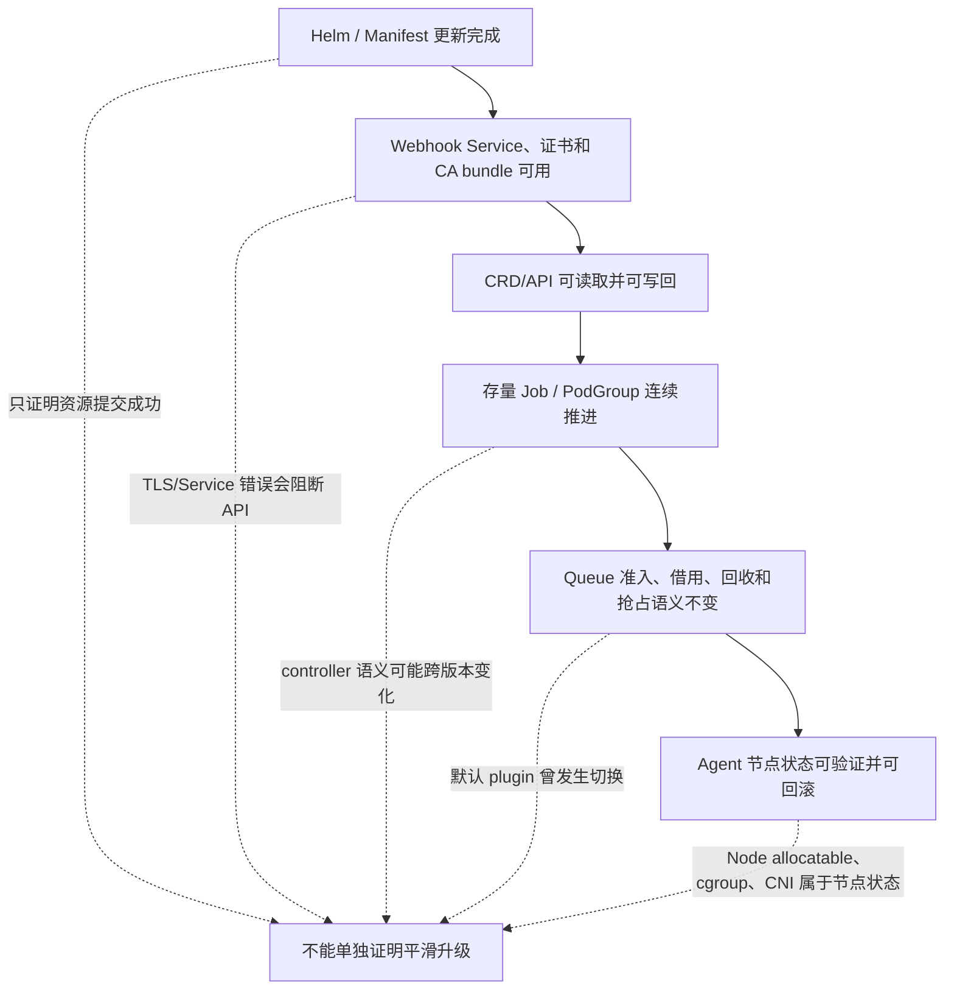
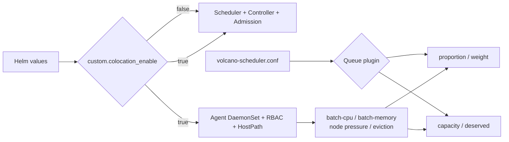

# Volcano 升级与 Feature 兼容性深度文档

> **从 v1.8.2 到 v1.15.0：Helm、Webhook、CRD、Queue 调度语义与 Cloud Native Colocation 的兼容边界**

---

> 稳定目标版本：Volcano `v1.15.0@8fc394c11e8db0d0ada5c17816b58bced9d7213d`；官方文档快照 `master@b9f7d29fe3528f184b2e17aa1159bb866c2c19c2`；Helm Charts `main@ad1fb303fbf057deb196e4e7947fabdbc2472fd0`；审校日期：2026-07-16。

---

## 目录

- [第一章：结论与适用范围](#第一章结论与适用范围)
- [第二章：升级成功的六个层次](#第二章升级成功的六个层次)
- [第三章：v1.8.2 到 v1.15.0 版本矩阵](#第三章v1-8-2-到-v1-15-0-版本矩阵)
- [第四章：Helm Chart 与 Release Manifest 差异](#第四章helm-chart-与-release-manifest-差异)
- [第五章：Queue 资源语义迁移](#第五章queue-资源语义迁移)
- [第六章：已确认的升级故障](#第六章已确认的升级故障)
- [第七章：Feature 组合兼容矩阵](#第七章feature-组合兼容矩阵)
- [第八章：Cloud Native Colocation 的通用 Linux 边界](#第八章cloud-native-colocation-的通用-linux-边界)
- [第九章：升级前兼容性检查](#第九章升级前兼容性检查)
- [第十章：分阶段升级与验证](#第十章分阶段升级与验证)
- [第十一章：失败后的定向处置](#第十一章失败后的定向处置)
- [附录：官方证据与最小命令](#附录官方证据与最小命令)

---

## 第一章：结论与适用范围

### 1.1 核心结论

Volcano v1.8.2 到 v1.15.0 不能被视为一次单纯的 Deployment 镜像替换。这个跨度同时经过了 Queue API 字段扩展、默认 Queue plugin 两次切换、admission 证书 Job 生命周期修复、Cloud Native Colocation/Volcano Agent 引入、更多 CRD 加入，以及 v1.15.0 的新抢占和 DRA quota 语义。

最需要提前锁定的结论是：

1. `helm upgrade` 返回成功，只能证明 Helm 管理的资源更新流程成功，不能证明 webhook、存量 Job、Queue 行为和节点侧 Agent 都兼容。
2. v1.10.0 的官方 chart 默认从 `proportion` 切换到 `capacity`，release notes 明确要求升级后为 Queue 设置 `deserved`；v1.11.0 默认配置又回到 `proportion`。实际运行配置必须从 scheduler ConfigMap 读取，不能根据版本或 Queue YAML 推测。
3. `capacity` 与 `proportion` 是互斥的 Queue 资源管理模型。前者使用显式 `deserved`，后者使用 `weight` 动态计算份额。字段被 API Server 接受不代表当前 plugin 会按该字段调度。
4. `custom.colocation_enable=true` 只为 Helm 安装增加 Volcano Agent、RBAC 和节点访问链路，不会自动切换 Queue plugin，也不会自动为 Queue 配置批资源配额。
5. v1.13.0 起可以把 Agent 限定为通用 Linux 可用的 `OverSubscription,Eviction,Resources`。CPU QoS、Memory QoS、CPU Burst 和 Network QoS 仍有内核、cgroup、BPF/CNI 或特定 OS 能力依赖。
6. v1.15.0 的 `gangPreempt`/`gangReclaim` 是显式启用的 Alpha actions，官方要求不要与旧 `preempt`/`reclaim` 同时配置。DRA Queue quota 只属于 `capacity` plugin 路径，并需要对应参数和 Kubernetes DRA 环境。

### 1.2 本文覆盖什么

本文只讨论以下官方交付路径：

- `volcano-sh/helm-charts` 发布的官方 Volcano chart。
- Volcano release tag 中的 `installer/volcano-development.yaml`。
- Volcano release tag 中与 chart、scheduler 配置、Queue CRD、Agent 和 release notes 直接相关的内容。
- 官方 Cloud Native Colocation 与 Queue Resource Management 文档。

本文不覆盖第三方 chart、Operator、云厂商发行版或企业内部二次封装。它提供兼容矩阵、检查命令和定向处置原则，但不替代包含变更窗口、审批、备份保留、SLO 和责任人的完整生产 Runbook。

### 1.3 四种兼容性不能混为一谈

| 兼容性层次 | 要回答的问题 | 常见误判 |
|---|---|---|
| API/schema 兼容 | 旧对象能否被新 CRD schema 读取、更新和重新写入 | `kubectl get` 成功就认为对象兼容 |
| 配置兼容 | 旧 values、ConfigMap、actions/plugins 和 feature 参数能否被新组件解析 | chart 渲染成功就认为配置语义未变 |
| 行为兼容 | 同一 Queue/PodGroup 输入是否仍得到相同准入、借用、回收和抢占结果 | Queue YAML 没变就认为行为没变 |
| 运行中工作负载兼容 | 已创建 Job/PodGroup 是否能被新 controller 继续推进、终止和重试 | CRD 可读就认为存量 Job 会继续运行 |

---

## 第二章：升级成功的六个层次

### 2.1 六层判定模型



| 层次 | 最小成功信号 | 还没有证明什么 |
|---|---|---|
| 1. Helm/Manifest | Helm release 为 `deployed`，或 `kubectl apply` 无错误 | webhook TLS、controller 业务行为 |
| 2. Webhook | Service 有 endpoints，admission Pod Ready，新建探针对象不会报 TLS/Service 错误 | 存量 CRD 对象能否继续推进 |
| 3. CRD/API | Queue、Job、PodGroup 可 list/get，目标版本 schema 已建立 | controller 对旧对象状态的处理一致 |
| 4. 存量 Job | 升级前 Pending/Inqueue/Running Job 均能继续创建 Pod、更新状态、结束或清理 | Queue 公平与抢占结果不变 |
| 5. Queue 行为 | 预设用例的入队、借用、reclaim/preempt victim 与升级前一致 | Agent 对节点的写入可回滚 |
| 6. Agent 节点状态 | DaemonSet 灰度成功，批资源、taint、cgroup/CNI 变化可观测且停用后清理完成 | 仍需长期稳定性和性能验证 |

### 2.2 为什么顺序重要

Webhook 位于 API Server 写入路径上。证书或 Service 失效时，问题不只影响 Volcano Job，还可能影响 webhook 匹配范围内的普通 Pod。Queue plugin 位于 scheduler 行为路径上，即使所有 Pod 都 Ready，也可能已经改变租户份额和回收次序。Agent 则会写 Node status、触发 eviction，并可能接触宿主机 cgroup、`/proc/sys`、CNI 和 BPF 文件，因此应最后单独灰度。

---

## 第三章：v1.8.2 到 v1.15.0 版本矩阵

### 3.1 主版本变化矩阵

| 版本 | 官方 chart 默认 Queue plugin | Queue/API 与调度变化 | Helm/Agent/CRD 变化 | 升级关注点 |
|---|---|---|---|---|
| v1.8.2 | `proportion` | Queue CRD 有 `weight`、`guarantee`、`capability`，尚无 `deserved`、`parent` | admission init Job 仍与主 admission 模板同处旧结构 | 基线必须导出实际 ConfigMap、Queue 和 admission Secret |
| v1.9.0 | `proportion` | 引入可选 `capacity` 和 Queue `deserved`；使用时必须启用 `capacity` 并关闭 `proportion`；tagged CRD 同时出现 `parent` | v1.8.2 到 v1.9.0 已确认会因 `volcano-admission-init` Job immutable field 导致 Helm upgrade 失败 | 不能直接跨过失败的 hook Job；若选 capacity，必须先补 Queue `deserved` |
| v1.10.0 | `capacity` | 官方 release notes 明确：默认改为 `capacity`，升级后必须为 Queue 设置 `deserved`；`capacity` 与 `proportion` 不兼容 | admission init 被拆成 pre-install/pre-upgrade Helm hook，并配置 `before-hook-creation,hook-succeeded`；Secret 更新逻辑改进 | 这是最显著的默认行为迁移点；还需验证 Job 清理和 Secret 轮换 |
| v1.11.0 | `proportion` | 引入 capacity hierarchical queue 的正式能力，但默认配置回到 `proportion` | Helm chart 新增可选 Volcano Agent；`custom.colocation_enable` 默认 `false`；主 release manifest 不含 Agent DaemonSet | 从 v1.10 默认值升级时尤其要防止 Queue plugin 被静默切回 |
| v1.12.x | `proportion` | 本文关注范围内无新的默认 Queue plugin 切换 | Agent 仍为可选；证书轮换与多副本 admission 的旧 Pod 证书并存风险仍需关注 | 作为中间升级站时也要执行 webhook 与存量 Job 验证 |
| v1.13.0 | `proportion` | Queue schema 延续 `weight`/`deserved`/`parent` | 新增 `agent_supported_features` 与批 CPU/内存资源名配置；admission Pod template 加入 Helm revision 触发滚动重启 | 通用 Linux 可只启用基础 Agent features；自定义资源名必须与 Queue/Pod 一致 |
| v1.14.0 | `proportion` | Queue 增加 `dequeueStrategy` 等验证；capacity/reclaim 实现继续修正 | 引入 `ColocationConfiguration` CRD、`agent_kube_cgroup_root`、cgroup v2/MemoryQoSV2、更多 Agent 安全配置 | 新 CRD 可被安装不等于 Agent 已启用；通用 OS 与增强内核能力要分开验证 |
| v1.15.0 | `proportion` | `capacity` 增加 DRA Queue quota；新增互斥于旧 action 的 `gangPreempt`/`gangReclaim` | chart `apiVersion` 升为 v2；DRA RBAC、feature 参数与更多 CRD/配置继续扩展 | 新能力都是显式配置项；默认配置不会自动启用 capacity、DRA quota 或 gang-aware eviction |

> v1.15.0 是本文的稳定目标版本。主线快照只用于核对文档整理时的后续代码方向，不把主线中晚于 v1.15.0 的能力写成 v1.15.0 已发布能力。

### 3.2 Queue CRD 字段不是 Queue 行为

tagged Queue CRD 的关键字段演进如下：

| 字段 | v1.8.2 | v1.9.0 | v1.10.0 到 v1.15.0 | 主要消费者 |
|---|---:|---:|---:|---|
| `weight` | 有 | 有 | 有 | `proportion` 根据权重动态计算份额 |
| `deserved` | 无 | 新增 | 有 | `capacity` 的显式应得资源 |
| `parent` | 无 | schema 中新增 | 有 | 层级 Queue；完整行为还依赖目标版本 plugin 与校验逻辑 |
| `guarantee.resource` | 有 | 有 | 有 | 资源预留语义，需与 plugin/action 组合一起验证 |
| `capability` | 有 | 有 | 有 | Queue 使用上限，包含 CPU、内存和扩展资源维度 |
| `priority` | 无 | 无 | v1.10.0 新增 | Queue 排序/回收决策的一部分 |
| `dequeueStrategy` | 无 | 无 | v1.14.0 新增 | Queue dequeue 行为 |

API Server 只根据 CRD schema 判断字段是否合法。scheduler 是否读取字段、如何计算内部 `deserved`、是否触发 reclaim，则由实际启用的 actions/plugins 决定。因此以下推断都不可靠：

- “Queue 有 `deserved`，所以集群一定在运行 `capacity`。”
- “Queue 有 `weight`，所以 `proportion` 一定启用。”
- “旧 Queue 能被 `kubectl get`，所以存量 Job 一定会继续创建 Pod。”
- “CRD 已经出现 `ColocationConfiguration`，所以节点上一定有 Agent。”

### 3.3 默认配置为什么不能代替现场配置

官方 tagged chart 的默认 `volcano-scheduler.conf` 已确认：

```text
v1.8.2  proportion
v1.9.0  proportion
v1.10.0 capacity
v1.11.0 proportion
v1.13.0 proportion
v1.14.0 proportion
v1.15.0 proportion
```

但生产集群可能通过 `custom.scheduler_config_override`、GitOps 覆盖、直接编辑 ConfigMap 或不同 chart 来源改变它。判断现场行为时，唯一可靠的入口是运行中的 ConfigMap以及对应 scheduler Pod 实际挂载内容。

---

## 第四章：Helm Chart 与 Release Manifest 差异

### 4.1 两条官方路径不是同一种生命周期

| 维度 | 官方 Helm chart | `installer/volcano-development.yaml` |
|---|---|---|
| 参数化 | values 控制 namespace、镜像、replica、配置覆盖和 feature | 静态资源，主要通过修改 YAML 实现定制 |
| admission init | v1.10.0 起使用 pre-install/pre-upgrade hook 和 hook delete policy | 普通 Job，由 `kubectl apply` 管理，不具备 Helm hook 生命周期 |
| 资源所有权 | Helm release annotations/labels 与 release history | Kubernetes apply field ownership |
| namespace | 由 Helm release namespace 决定 | release 文件通常固定 `volcano-system` |
| Agent | v1.11.0 起可由 `custom.colocation_enable=true` 增加 | 主 `volcano-development.yaml` 不部署 Agent，Agent 有独立 manifest |
| 回滚 | Helm 可回滚已记录模板，但不能自动回滚外部节点状态或所有 CRD 语义 | 需要重新 apply 旧 manifest，并自行处理状态兼容 |
| 切换路径 | 需要核对现有资源 Helm ownership | 需要核对 field manager、资源名和 namespace，不能直接假设可互换 |

不要在一次升级中同时完成“v1.8.2 到 v1.15.0”和“manifest 安装改成 Helm”两种迁移。两者同时发生会把版本差异、字段所有权、资源命名和 hook 生命周期混在同一个故障面中。

### 4.2 关键 chart 差异

| 版本边界 | 已确认差异 | 实际影响 |
|---|---|---|
| v1.8.2 -> v1.9.0 | admission init Job template 变化，但旧 Job 不能 patch immutable `spec.template` | Helm upgrade 在控制面更新早期失败，需定向删除可重建 Job 后重试 |
| v1.9.0 -> v1.10.0 | admission init 独立为 Helm hook；成功后删除；Secret 支持更新 | 降低后续 immutable Job 和残留 Secret 风险，但仍需验证 hook 是否实际成功 |
| v1.10.0 -> v1.11.0 | chart 增加可选 Agent 模板 | 默认不产生 DaemonSet；只有打开 colocation value 才进入节点侧变更 |
| v1.12.x -> v1.13.0 | admission Deployment 用 Helm revision annotation 强制滚动；Agent 增加 feature/resource name 参数 | 证书轮换后旧 admission Pod 不应继续持有旧证书；Agent 能限制通用功能集合 |
| v1.13.0 -> v1.14.0 | 增加 ColocationConfiguration、NodeShard 等 CRD/模板和更多 Agent 配置 | CRD 面扩大；启用 Agent/Agent Scheduler 前要单独评估 RBAC 和节点安全策略 |
| v1.14.0 -> v1.15.0 | chart metadata 改为 Helm API v2，并加入 DRA 与新 action 所需的配置/RBAC | Helm 客户端和内部 chart 依赖处理需纳入预演；新能力仍不会因升级自动启用 |

### 4.3 CRD 不能只看 Helm release 状态

官方 chart 将 Volcano CRD 文件作为 chart 内容并通过模板注册。切换 chart 版本时仍需显式比较目标 CRD，而不是只看 `helm status`。重点检查：

- `spec.versions`、served/storage version 和 schema required/default/enum 变化。
- Queue、Job、PodGroup 等已有对象能否通过目标 schema 的 server-side dry-run。
- 新 CRD 是否只是被安装，还是新 controller/feature 已实际启用。
- 从 Helm 切换到 manifest 或反向切换时，资源 ownership 是否冲突。
- 回滚旧 controller 时，新对象字段是否会被旧客户端丢弃或误解。

---

## 第五章：Queue 资源语义迁移

### 5.1 `proportion` 与 `capacity` 的根本区别

| 维度 | `proportion` | `capacity` |
|---|---|---|
| 主要输入 | Queue `weight` | Queue 各资源维度的 `deserved` |
| 份额计算 | 根据总资源、Queue 权重和当前请求动态计算 | 管理员显式给出应得资源量 |
| 集群扩缩适配 | 总资源变化后可重新计算份额 | `deserved` 不会自动随集群容量变化，需要外部管理 |
| 多资源维度 | 同一权重参与不同资源维度的份额计算 | 可分别配置 CPU、内存、GPU、批资源和其他扩展资源 |
| 典型优势 | 动态集群、弹性池、比例公平 | 固定配额、明确容量合同、YARN 风格层级管理 |
| 主要风险 | 权重是相对值，实际资源量会变化 | 配额总量与真实集群容量漂移，遗漏资源维度会产生意外行为 |

官方 Queue Resource Management 文档把 proportion 的核心计算概括为：

```text
queue_deserved = queue_weight / total_weight * total_resource
```

实际实现还会结合 Queue 请求量等状态调整内部份额。这里的公式用于理解动态性，不应替代 scheduler 指标和源码行为测试。

### 5.2 从 v1.8.2 迁移 Queue

升级前至少为每个 Queue 建立以下清单：

| 字段/维度 | 需要回答的问题 |
|---|---|
| `weight` | 当前是否真的由 `proportion` 使用？默认值与显式值是否一致？ |
| `deserved` | 目标是否启用 `capacity`？CPU、内存、GPU和扩展资源是否齐全？ |
| `guarantee.resource` | 是否满足 `guarantee <= deserved <= capability` 的逐维约束？ |
| `capability` | 上限是否覆盖所有可能被任务请求的资源名？ |
| `parent` | 是否使用层级 Queue？父子 `deserved`/`capability` 的总和与继承是否有效？ |
| `reclaimable` | Queue 是否允许其他 Queue 回收借出的资源？ |
| `priority` | Queue 优先级是否会改变 victim 和排序结果？ |
| 扩展资源 | `nvidia.com/gpu`、`kubernetes.io/batch-cpu`、`kubernetes.io/batch-memory` 或自定义名是否完全一致？ |

若保持 `proportion`，不要因为目标 CRD 接受 `deserved` 就批量写入该字段并期待它生效。若切换到 `capacity`，应先生成完整 `deserved`，再切 scheduler plugin；不要先切 plugin 后补 Queue。

### 5.3 Queue 字段的逐维约束

在 `capacity` 模式下，建议对每个资源名分别检查：

```text
guarantee[resource] <= deserved[resource] <= capability[resource]
```

还需要检查：

- 同级 Queue 的 `deserved` 总和是否与平台承诺的可分配总量一致。
- 层级 Queue 的子 Queue `deserved` 总和是否超过父 Queue。
- 子 Queue `capability` 是否超过父 Queue，或是否依赖版本特定的继承行为。
- 扩展资源不存在于部分 Node 时，Queue quota 与实际可放置性是否被错误等同。
- `guarantee` 是预留，不是简单的最小调度成功保证；Gang、节点拓扑、设备碎片仍可能阻止放置。

### 5.4 actions 与 plugins 是两条配置轴

Queue plugin 决定份额和 quota，action 决定调度周期执行什么。常见关系是：

| 配置 | 作用 | 兼容性要点 |
|---|---|---|
| `enqueue` | 判断 Job/PodGroup 能否进入可调度队列 | 对 Volcano Job，若 enqueue 阻止 PodGroup，controller 可能不创建待调度 Pod |
| `allocate` | 分配节点 | 是常规调度主路径 |
| `reclaim` | 在 Queue 之间收回超用资源 | 需要 Queue plugin 提供公平/应得判断，并需要已有 victims |
| `preempt` | 按优先级在相关范围选择 task victims | 旧的 task-centric action |
| `gangReclaim` | 以 gang/job 粒度做公平回收 | v1.15.0 Alpha；不能与旧 `reclaim` 同时配置 |
| `gangPreempt` | 以 gang/job 粒度做优先级抢占 | v1.15.0 Alpha；不能与旧 `preempt` 同时配置 |

官方 Queue Resource Management 文档明确提示 `enqueue` 与 `reclaim/preempt` 可能发生行为冲突：如果 enqueue 让 PodGroup 无法进入队列，Volcano Job controller 不创建 Pending Pods，后续 action 就没有 victims/preemptors 可处理。这个结论主要针对 Volcano Job controller 路径；外部 controller 已经创建 Pod 的场景应单独测试。

### 5.5 v1.15.0 DRA Queue quota

DRA Queue quota 没有增加一套独立 Queue CRD，而是复用 `capacity` 的 `capability`、`deserved` 和 `guarantee` ResourceList。资源键格式包括：

```yaml
spec:
  capability:
    deviceclass/gpu.nvidia.com: "8"
    cores.deviceclass/hami-core-gpu.project-hami.io: "800"
```

使用时至少满足：

1. Kubernetes DRA API 和目标 DRA driver 可用。
2. scheduler 的 predicates/DRA 集成与 Kubernetes 版本匹配。
3. Queue plugin 使用 `capacity`，而不是默认的 `proportion`。
4. `capacity.DynamicResourceAllocationEnable: true`；需要 consumable capacity 时再启用 `capacity.DRAConsumableCapacityEnable: true`。
5. Queue quota 只表达逻辑总量，不解决单设备容量碎片和 driver 的最终物理分配。

---

## 第六章：已确认的升级故障

### 6.1 v1.8.2 到 v1.9.0 Helm Job immutable field

官方 issue [#3496](https://github.com/volcano-sh/volcano/issues/3496) 给出了完整复现：默认 Helm 安装 v1.8.2 后升级到 v1.9.0，Helm 尝试 patch `volcano-admission-init`，因 Kubernetes Job 的 `spec.template` 不可变而失败。issue 同时记录了手工删除该 Job 后升级可继续。

这证明的是一个具体版本和安装路径故障，不应扩大为“Volcano 所有版本都不能原地升级”。它也说明 Helm 在资源 patch 阶段失败时，Deployment 尚未全部更新，不能只看部分新 Pod 判断版本状态。

定向原则：确认 Job 只负责生成/更新 admission Secret 且可重建后，删除该 Job，再按变更窗口重试升级。不要因此删除 Queue、Job、PodGroup 或 CRD。

### 6.2 admission Secret 残留和证书轮换

官方 issue [#2833](https://github.com/volcano-sh/volcano/issues/2833) 记录了卸载重装或 Helm upgrade 时，旧 `volcano-admission-secret` 残留导致 init Job 创建 Secret 报 `already exists`。v1.10.0 release notes 记录了 Secret 更新和 Helm hook 生命周期优化。

另一个边界是多副本 admission。官方 PR [#4396](https://github.com/volcano-sh/volcano/pull/4396) 描述了 Helm upgrade 生成新证书后，新 Pod 使用新证书、旧 Pod 仍持有旧证书，导致间歇性 `x509: certificate signed by unknown authority`。v1.13.0 chart 通过 Helm revision annotation 触发 admission Deployment 滚动重启。

因此证书检查必须同时覆盖：Secret 内容、webhook `caBundle`、Service endpoints 和全部 admission Pod 的启动时间/证书代际。

### 6.3 CRD 可读但存量 Job 不推进

官方 issue [#2962](https://github.com/volcano-sh/volcano/issues/2962) 记录了 v1.5.1 创建的旧 vcjob/PodGroup 在升级到 v1.7.0 后，PodGroup 虽进入 `Inqueue`，controller 仍不创建 Pod，也不能正确处理旧 PodGroup 的 kill 路径。

这个版本不在本文主升级起点内，但它提供了重要的兼容性证据：controller 对对象状态机的语义兼容独立于 CRD schema。升级 v1.8.2 到 v1.15.0 时，必须保留 Pending、Inqueue、Running、终止/重试等存量对象用例。

### 6.4 卸载后 webhook 配置残留

官方 issue [#2191](https://github.com/volcano-sh/volcano/issues/2191) 和 [#1488](https://github.com/volcano-sh/volcano/issues/1488) 记录了 Helm uninstall 后 webhook configuration 仍引用已不存在的 admission Service，导致 API Server 创建其他资源时报 `service not found`。

这类历史问题说明“卸载控制面再安装”不是天然更安全的升级方案。若确需卸载或修复，必须先列出 MutatingWebhookConfiguration/ValidatingWebhookConfiguration 与 Service 的引用关系，并准备在 admission Service 不可用时定向清理孤儿 webhook。不要默认删除全部 Volcano CRD 和业务对象。

### 6.5 故障与证据边界

| 故障 | 官方证据 | 能泛化的原则 | 不能泛化的结论 |
|---|---|---|---|
| v1.8.2 -> v1.9.0 immutable Job | issue #3496 | hook/Job 是独立升级门槛 | 所有 Helm upgrade 都失败 |
| Secret already exists | issue #2833 | Secret 生命周期必须纳入卸载/升级 | 永远应该先删 Secret |
| 多副本证书代际不一致 | PR #4396 | 证书更新后要验证全部 Pod 滚动 | 单副本也一定复现该问题 |
| 旧 Job/PodGroup 不推进 | issue #2962 | 运行中对象需要状态机测试 | v1.8.2 -> v1.15.0 必然复现 |
| 卸载后孤儿 webhook | issues #2191/#1488 | 卸载需要检查 cluster-scoped webhook | 新 chart 一定仍有相同 bug |

---

## 第七章：Feature 组合兼容矩阵

### 7.1 安装与 Queue feature 组合

| 组合 | API/部署兼容 | 行为结论 | 主要风险 |
|---|---|---|---|
| 标准安装 + `proportion` | 是，v1.15.0 默认路径 | Queue Resource Management 正常工作，按 `weight` 动态计算份额 | `deserved` 字段不会替代权重模型 |
| 标准安装 + `capacity` | 是，需覆盖 scheduler 配置 | 显式 `deserved`、借用和回收 | 必须关闭 `proportion`，并维护各资源维度配额 |
| 标准安装 + Agent 关闭 | 是，默认 | Queue、Gang、reclaim/preempt 与 Agent 无直接部署依赖 | 没有批资源动态上报和节点压力 eviction |
| `custom.colocation_enable=true` + `proportion` | 是 | Agent 上报的动态批资源可作为扩展资源参与 Pod 调度；Queue 份额随可见总量变化 | 批资源名、Pod request、Queue capability 必须一致 |
| `custom.colocation_enable=true` + `capacity` | 是，但需要主动设计 | 可对原生资源与批资源分别设置固定 `deserved` | 动态 Node allocatable 不会自动改固定 quota，容易漂移 |
| `capacity` + `proportion` | 否，官方明确互斥 | 不应部署 | 同一 Queue 注册两套份额/回收语义 |
| `enqueue` + `reclaim/preempt` | 配置可被接受，但存在官方行为冲突说明 | 必须用真实 Job controller 路径测试 | enqueue 阻止 Pod 创建时后续 action 无对象可处理 |
| `gangPreempt/gangReclaim` + 旧 actions | v1.15.0 官方明确禁止同列 | 二选一 | 重复或冲突的 eviction 控制流 |
| DRA quota + `capacity` 参数 | 是，v1.15.0 | Queue 可记账 DeviceClass 数量/容量 | 依赖 Kubernetes DRA、driver、键格式和物理可放置性 |
| DRA quota + 默认 `proportion` | 不是 v1.15.0 已发布的 quota 路径 | 不应期待 capacity DRA quota 生效 | Queue YAML 可被接受，但没有对应 quota plugin 语义 |

### 7.2 Colocation 开关不会改变 scheduler plugin

v1.15.0 chart 的 Agent 模板以 `custom.colocation_enable` 为条件，scheduler 配置仍来自独立的 `config/volcano-scheduler.conf` 或 `custom.scheduler_config_override`。两者没有自动联动。



### 7.3 `proportion` 与动态批资源

当 Agent 根据节点空闲量更新 `kubernetes.io/batch-cpu` 和 `kubernetes.io/batch-memory` 时，集群对 scheduler 可见的扩展资源总量会变化。`proportion` 更适合按权重随总量变化重新计算份额，但仍需满足：

- 离线 Pod request 使用 Agent 实际上报的资源名。
- Queue `capability` 若限制这些维度，配置使用相同资源名。
- 指标与容量评估区分原生 `cpu`/`memory` 和批资源，不能把两者相加后当作无条件可用物理容量。
- Agent 驱逐会让运行容量快速下降，Queue 份额变化不代表 workload 没有重试成本。

### 7.4 `capacity` 与动态批资源

该组合在 API 和调度架构上可行，但固定 `deserved` 不会自动跟随 Agent 动态上报。应分别管理：

```yaml
spec:
  deserved:
    cpu: "40"
    memory: 160Gi
    kubernetes.io/batch-cpu: "80000"
    kubernetes.io/batch-memory: "320Gi"
```

上述数值仅展示资源维度，不是推荐值。批 CPU/内存数量格式必须按 Node status 的实际 Quantity 校验。平台需要决定由谁在扩缩容、Agent 降级或节点标签变化后重算 Queue `deserved`，并避免自动控制器与人工 GitOps 同时写 Queue。

---

## 第八章：Cloud Native Colocation 的通用 Linux 边界

### 8.1 推荐的基础能力边界

v1.13.0 release notes 把通用 OS 的应用层共置能力明确为：

```text
OverSubscription,Eviction,Resources
```

这三个 feature 分别对应动态超卖计算、节点压力下驱逐离线 Pod、扩展资源管理。v1.15.0 Agent 也把它们作为默认 supported features。对通用 Linux 首次灰度，应显式设置同一列表，避免版本默认值或自定义镜像差异引入增强内核功能：

```yaml
custom:
  colocation_enable: true
  agent_supported_features: "OverSubscription,Eviction,Resources"
```

### 8.2 节点侧权限和路径

v1.15.0 chart 中 Agent DaemonSet 的节点接触面包括：

| 接触面 | chart/代码行为 | 平台约束 |
|---|---|---|
| 网络 | `hostNetwork: true`、`dnsPolicy: Default` | NetworkPolicy 不能等同于普通 Pod 隔离；端口与主机网络策略要检查 |
| HostPath | `/sys/fs`、`/proc/sys`、`/etc`、`/opt/cni/bin`、`/var/lib/kubelet`、日志和 BPF 工具路径 | Pod Security Restricted 通常不允许；路径在不同发行版/CNI 中可能不同 |
| init container | 以 UID 0 运行，触碰日志目录和部分 `/proc/sys` 接口 | 需要单独的安全审查和准入例外 |
| main capabilities | 包含 `BPF`、`SETUID`、`SETGID`、`SETFCAP`、`DAC_OVERRIDE` | 可能被 Pod Security、SELinux、Seccomp 或容器运行时阻止 |
| Node/RBAC | patch Node/status、读取 Pod、创建 eviction 和 Event | 影响 Node allocatable 与 workload 生命周期，权限不应扩散给普通工作负载 |
| cgroup | 挂载 `/sys/fs`，支持 cgroup v1/v2 与可配置 kube cgroup root | systemd/cgroupfs、cgroup 根路径和 kubelet 配置必须一致 |
| CNI/BPF | Network QoS 路径可向 `/opt/cni/bin` 安装插件并修改指定 conflist | 首次启用和停用都必须备份/核对 CNI 文件，不应假设删除 DaemonSet自动清理 |
| SELinux | chart 带默认 SELinux level，HostPath 仍受节点标签和策略影响 | Enforcing 环境需验证 AVC、文件 context 和允许规则 |

即使只启用三个基础 features，chart 仍会声明多组 HostPath 和安全上下文。`supported-features` 控制 handler 注册和运行能力，不等同于缩小 DaemonSet manifest 权限；需要通过 chart values、准入策略和节点池边界共同治理。

### 8.3 增强内核功能只说明依赖，不作为通用基线

| Feature | v1.15.0 代码中的依赖边界 | 本文建议 |
|---|---|---|
| `CPUQoS` | 注释限定 OpenEuler 能力 | 不纳入通用 Linux 基线 |
| `MemoryQoS` | 注释限定 OpenEuler 能力 | 不纳入通用 Linux 基线 |
| `MemoryQoSV2` | 需要启用 cgroup v2 | 在独立节点池验证 `memory.high/low/min` 后再启用 |
| `CPUBurst` | 需要 Linux kernel 5.14+ | 核对内核接口和争用模型后单独灰度 |
| `CPUThrottle` | v1.14.0 起面向通用 OS 的增强能力 | 先验证 cgroup driver、根路径和恢复行为 |
| `NetworkQoS` | 涉及 CNI、BPF、主机带宽标注和增强 OS 能力 | 不与首次 Agent 上线同时启用 |

本文不提供 openEuler 专项部署方案，也不把官网示例中的增强 OS 路径推广为所有 Linux 都可用。

### 8.4 为什么版本升级与 Agent 启用要分两阶段

如果一次变更同时升级 controller/scheduler/webhook、切换 Queue plugin并启用 Agent，故障可能来自四个不同控制环：

- Helm/CRD/webhook 控制面。
- Job/PodGroup controller 状态机。
- Queue 调度与 eviction actions。
- Agent 对 Node status、taint、cgroup 和 CNI 的写入。

建议第一阶段保持 `custom.colocation_enable=false`，完成 v1.15.0 控制面与 Queue 行为验证。第二阶段使用 `custom.agent_ns` 或等价 nodeSelector 只选择少量带标签节点，并显式限制 supported features。确认停用和清理路径后再扩大节点范围。

---

## 第九章：升级前兼容性检查

### 9.1 锁定安装身份

先记录源版本、chart 来源、release 名称、namespace 和实际镜像：

```bash
helm list -A
helm status volcano -n volcano-system
helm get values volcano -n volcano-system -a > volcano-values.before.yaml
helm get manifest volcano -n volcano-system > volcano-manifest.before.yaml
kubectl get deploy -n volcano-system -o jsonpath='{range .items[*]}{.metadata.name}{"\t"}{range .spec.template.spec.containers[*]}{.image}{" "}{end}{"\n"}{end}'
```

若不是 Helm 安装，不要强行执行 Helm upgrade。先从 labels、annotations 和 managedFields 确认资源所有者。

### 9.2 导出 API 与业务对象

```bash
kubectl get crd -o yaml > crds.before.yaml
kubectl get queues.scheduling.volcano.sh -o yaml > queues.before.yaml
kubectl get jobs.batch.volcano.sh -A -o yaml > vcjobs.before.yaml
kubectl get podgroups.scheduling.volcano.sh -A -o yaml > podgroups.before.yaml
kubectl get mutatingwebhookconfigurations,validatingwebhookconfigurations -o yaml > webhooks.before.yaml
kubectl get secret -n volcano-system volcano-admission-secret -o yaml > admission-secret.before.yaml
kubectl get cm -n volcano-system volcano-scheduler-configmap -o yaml > scheduler-config.before.yaml
```

这些文件含集群拓扑、证书、annotation 和业务信息，应进入受控的临时目录，不应提交到 Git。尤其不要把 Secret 的 `data`、私有 registry 凭据或内部 endpoint 写入本文仓库。

### 9.3 读取实际 actions/plugins

```bash
kubectl get cm -n volcano-system volcano-scheduler-configmap \
  -o jsonpath='{.data.volcano-scheduler\.conf}'

kubectl get deploy -n volcano-system volcano-scheduler \
  -o jsonpath='{.spec.template.spec.containers[0].args}'
```

检查：

- `capacity` 与 `proportion` 只能出现一个。
- `reclaim`/`preempt` 是否存在，还是使用 v1.15.0 gang actions。
- `enqueue` 是否与现有 Job controller 行为测试匹配。
- plugin arguments 是否包含 DRA、层级 Queue 或其他版本特定开关。
- ConfigMap 修改后 scheduler Pod 是否真的重启并挂载新内容。

### 9.4 Queue 静态审计

```bash
kubectl get queues.scheduling.volcano.sh \
  -o custom-columns='NAME:.metadata.name,PARENT:.spec.parent,WEIGHT:.spec.weight,RECLAIMABLE:.spec.reclaimable,STATE:.status.state'

kubectl get queues.scheduling.volcano.sh -o jsonpath='{range .items[*]}{.metadata.name}{"\t"}{.spec.deserved}{"\t"}{.spec.guarantee.resource}{"\t"}{.spec.capability}{"\n"}{end}'
```

逐 Queue 核对 `weight`、`deserved`、`guarantee`、`capability`、`parent`，并列出所有 ResourceList 键。不要只检查 CPU/内存；GPU、NPU、批资源和 DRA key 都是独立 quota 维度。

### 9.5 Webhook 与证书审计

```bash
kubectl get jobs,pods,svc,endpoints -n volcano-system | grep admission
kubectl get mutatingwebhookconfigurations,validatingwebhookconfigurations \
  -o custom-columns='KIND:.kind,NAME:.metadata.name,SERVICE:.webhooks[*].clientConfig.service.name,NAMESPACE:.webhooks[*].clientConfig.service.namespace'
kubectl logs -n volcano-system job/volcano-admission-init --all-containers=true
kubectl rollout status -n volcano-system deploy/volcano-admission
```

如果 hook Job 已按 `hook-succeeded` 删除，`kubectl logs job/...` 返回 NotFound 是正常生命周期结果，应转而查看 Helm hook 输出、Events 和 admission Pod。

### 9.6 Agent 审计

```bash
kubectl get ds,pods -n volcano-system -l name=volcano-agent -o wide
kubectl get nodes -L volcano.sh/colocation,volcano.sh/oversubscription
kubectl get nodes -o custom-columns='NAME:.metadata.name,BATCH_CPU:.status.allocatable.kubernetes\.io/batch-cpu,BATCH_MEM:.status.allocatable.kubernetes\.io/batch-memory'
kubectl get events -A --field-selector reason=Evicted --sort-by=.lastTimestamp
```

还需在灰度节点核对：

- kubelet 使用 cgroup v1 还是 v2，driver 是 systemd 还是 cgroupfs。
- `/sys/fs`、`/proc/sys`、`/var/lib/kubelet` 和 CNI conflist 的实际路径。
- `agent_supported_features` 与日志中已注册 handler 是否一致。
- 移除 `volcano.sh/oversubscription`/`volcano.sh/colocation` 标签后，批资源和 eviction taint 是否按预期收敛。
- 停用 Agent 前后 CNI 配置、BPF 文件和 Node status 是否有残留。

---

## 第十章：分阶段升级与验证

### 10.1 推荐阶段

| 阶段 | 变更 | 必须通过的门槛 |
|---|---|---|
| 0. 基线 | 只导出和运行兼容用例 | 能复现当前 Queue、Job、webhook 和 Agent 状态 |
| 1. 配置准备 | 选择 `proportion` 或 `capacity`，生成目标 ConfigMap/Queue | 所有 Queue 逐维校验通过；无互斥 plugins/actions |
| 2. staging 升级 | 用同一安装路径升级完整副本 | 六层成功模型前五层通过，含存量 Job |
| 3. 生产控制面 | Agent 保持关闭，只升级 CRD/webhook/controller/scheduler | webhook 无 TLS 错误，Queue 指标与 victim 结果符合预期 |
| 4. Agent 少量节点 | 显式基础 features + nodeSelector | Node allocatable、eviction、cgroup/CNI 和停用清理均可验证 |
| 5. 扩大范围 | 分批增加 Agent 节点 | SLO、驱逐率、Pending 原因与资源利用率稳定 |

### 10.2 Queue plugin 决策

保持 `proportion` 的条件：

- 现有租户合同以权重为主。
- 集群或批资源容量频繁变化。
- 平台没有可靠的自动化来维护每个资源维度的固定 `deserved`。

切换 `capacity` 的条件：

- 租户需要可审计的 CPU、内存、GPU或 DRA 固定配额。
- 能维护父子 Queue 的逐维约束。
- 能在扩缩容和 Agent 容量变化后更新 `deserved`。
- 已建立 reclaim/preempt 的 victim 成本与业务容忍度测试。

### 10.3 最小行为测试集

至少保留以下升级前创建、升级后观察的对象：

1. 一个处于 Pending 且尚未满足 Gang 的 Volcano Job。
2. 一个 PodGroup 已 Inqueue、controller 正在创建 Pod 的 Job。
3. 一个 Running 的多 Task Job，并测试单 Pod 失败与 Job 终止。
4. 两个 Queue 的借用和 reclaim 场景。
5. 同 Queue 高低优先级的 preempt 场景。
6. 一个由外部 controller 创建的 PodGroup。
7. 若启用层级 Queue，至少一个父 Queue 和两个子 Queue 的跨层回收场景。
8. 若启用 Agent，在线负载升高导致批资源下降和离线 Pod eviction 的灰度场景。

### 10.4 v1.15.0 新 actions 的独立变更

不要在版本升级当天把旧 actions 直接替换为 gang-aware actions。先完成 v1.15.0 默认/现有 action 链验证，再开独立变更：

```yaml
actions: "enqueue, allocate, backfill, gangPreempt, gangReclaim"
```

验证重点包括 incoming gang 是否整体可放置、victim 是否按 job/gang 聚合、HyperNode 范围和业务恢复成本。由于该能力在 v1.15.0 是 Alpha，回滚应只恢复 scheduler ConfigMap 和 scheduler Pod，不应删除 Queue 或 Job。

---

## 第十一章：失败后的定向处置

### 11.1 先按故障层次定位

| 症状 | 优先检查 | 定向处置 |
|---|---|---|
| Helm 报 Job immutable | `volcano-admission-init`、源/目标模板、Helm hooks | 确认可重建后只删除 hook/init Job，再重试 |
| init Job 报 Secret exists | Secret owner、证书有效期、目标脚本是否支持 patch | 先备份 Secret；按目标版本证书流程更新，不盲删所有 webhook |
| API Server 报 Service not found | webhook clientConfig 与 Service/endpoints | 恢复 admission Service，或只删除已确认孤儿的 webhook configuration |
| 间歇性 x509 unknown authority | Secret、`caBundle`、所有 admission Pod 启动时间 | 滚动重启 admission，确认所有副本读取同一证书代际 |
| Queue/CRD 可读但 Job 不建 Pod | Job/PodGroup phase、controller log、对象创建版本 | 回滚 controller 或修复对象状态迁移，保留证据，不先删 CRD |
| Queue 份额突变 | 实际 scheduler ConfigMap、plugin、Queue fields | 恢复升级前 scheduler config 与 Queue 配置 |
| 大量意外 eviction | actions、Queue reclaimable、Agent pressure events | 停止新 eviction 控制环，回滚 action/Agent 标签，保留运行对象 |
| Agent 停用后批资源残留 | Node status、标签、taint、Agent 日志 | 先停止提交新批资源 Pod，再按 Agent 清理路径移除状态和主机残留 |

### 11.2 不把卸载作为默认回滚

默认回滚顺序应从最可重建、状态最少的对象开始：

1. 恢复 scheduler ConfigMap 或目标 Deployment 镜像。
2. 重建 admission init hook、修复 Secret/`caBundle` 或滚动 admission Pods。
3. 恢复 controller 版本并验证存量 Job 状态机。
4. 缩小 Agent nodeSelector、移除灰度标签并清理节点状态。
5. 只有在资源 ownership 和业务对象保留策略明确时，才考虑卸载控制面。

不要默认删除 CRD、Queue、Job、PodGroup。CRD 删除会级联删除自定义资源，是升级故障处理中破坏性最大的操作之一。

### 11.3 何时停止继续升级

出现以下任一情况应停止扩大变更范围：

- webhook 错误开始影响非 Volcano 资源创建。
- 任一存量 Job 状态不能由新 controller 继续推进或终止。
- Queue allocated/deserved/share 指标与预演不一致。
- reclaim/preempt victim 超出已批准范围。
- Agent 导致 Node allocatable、taint 或 CNI 状态无法自动收敛。
- 回滚旧 scheduler/controller 后无法读取升级期间写入的对象。

---

## 附录：官方证据与最小命令

### A.1 仓库快照

| 仓库 | 分支 | 提交 |
|---|---|---|
| Volcano | `master` | `c3598d1927e12393490501b0b81a61982a8cddff` |
| Volcano Website | `master` | `b9f7d29fe3528f184b2e17aa1159bb866c2c19c2` |
| Volcano Helm Charts | `main` | `ad1fb303fbf057deb196e4e7947fabdbc2472fd0` |

### A.2 Release notes

| 版本 | 官方链接 |
|---|---|
| v1.8.2 | <https://github.com/volcano-sh/volcano/releases/tag/v1.8.2> |
| v1.9.0 | <https://github.com/volcano-sh/volcano/releases/tag/v1.9.0> |
| v1.10.0 | <https://github.com/volcano-sh/volcano/releases/tag/v1.10.0> |
| v1.11.0 | <https://github.com/volcano-sh/volcano/releases/tag/v1.11.0> |
| v1.12.0 | <https://github.com/volcano-sh/volcano/releases/tag/v1.12.0> |
| v1.13.0 | <https://github.com/volcano-sh/volcano/releases/tag/v1.13.0> |
| v1.14.0 | <https://github.com/volcano-sh/volcano/releases/tag/v1.14.0> |
| v1.15.0 | <https://github.com/volcano-sh/volcano/releases/tag/v1.15.0> |

### A.3 Feature 与源码证据

| 主题 | 官方链接 |
|---|---|
| Cloud Native Colocation | <https://volcano.sh/docs/keyfeatures/cloudnativecolocation/> |
| Queue Resource Management | <https://volcano.sh/docs/keyfeatures/queueresourcemanagement/> |
| v1.15.0 Capacity Plugin Guide | <https://volcano.sh/docs/userguide/user_guide_how_to_use_capacity_plugin/> |
| v1.15.0 Cloud Native Colocation 文档快照 | <https://github.com/volcano-sh/website/blob/b9f7d29fe3528f184b2e17aa1159bb866c2c19c2/versioned_docs/version-v1.15.0/KeyFeatures/cloudNativeColocation.md> |
| v1.15.0 Queue Resource Management 文档快照 | <https://github.com/volcano-sh/website/blob/b9f7d29fe3528f184b2e17aa1159bb866c2c19c2/versioned_docs/version-v1.15.0/KeyFeatures/QueueResourceManagement.md> |
| v1.8.2 scheduler 默认配置 | <https://github.com/volcano-sh/volcano/blob/v1.8.2/installer/helm/chart/volcano/config/volcano-scheduler.conf> |
| v1.10.0 scheduler 默认配置 | <https://github.com/volcano-sh/volcano/blob/v1.10.0/installer/helm/chart/volcano/config/volcano-scheduler.conf> |
| v1.11.0 scheduler 默认配置 | <https://github.com/volcano-sh/volcano/blob/v1.11.0/installer/helm/chart/volcano/config/volcano-scheduler.conf> |
| v1.15.0 scheduler 默认配置 | <https://github.com/volcano-sh/volcano/blob/v1.15.0/installer/helm/chart/volcano/config/volcano-scheduler.conf> |
| v1.15.0 DRA Queue quota guide | <https://github.com/volcano-sh/volcano/blob/v1.15.0/docs/user-guide/how_to_use_dra_quota.md> |
| v1.15.0 Gang-aware eviction design | <https://github.com/volcano-sh/volcano/blob/v1.15.0/docs/design/gang-aware-eviction-design.md> |
| Helm Charts | <https://github.com/volcano-sh/helm-charts> |

### A.4 已确认问题与修复

| 主题 | 官方链接 |
|---|---|
| v1.8.2 -> v1.9.0 Helm immutable Job | <https://github.com/volcano-sh/volcano/issues/3496> |
| admission Secret 残留 | <https://github.com/volcano-sh/volcano/issues/2833> |
| 存量 v1.5.1 Job/PodGroup 在 v1.7.0 不推进 | <https://github.com/volcano-sh/volcano/issues/2962> |
| uninstall 后 webhook 引用不存在 Service | <https://github.com/volcano-sh/volcano/issues/2191> |
| webhook 配置残留 | <https://github.com/volcano-sh/volcano/issues/1488> |
| admission 多副本证书轮换重启修复 | <https://github.com/volcano-sh/volcano/pull/4396> |

### A.5 目标资源 dry-run

在 staging 使用目标 CRD 和目标 API Server 执行，而不是只做本地 YAML 解析：

```bash
kubectl apply --server-side --dry-run=server -f queues.before.yaml
kubectl apply --server-side --dry-run=server -f vcjobs.before.yaml
kubectl apply --server-side --dry-run=server -f podgroups.before.yaml
```

备份文件通常包含 `status`、`resourceVersion`、`uid` 和 managedFields，不能直接作为恢复清单。dry-run 前应在受控副本中清理只读元数据，生产恢复则应使用经过验证的备份/恢复流程。

### A.6 最终验收信号

```bash
kubectl rollout status -n volcano-system deploy/volcano-admission
kubectl rollout status -n volcano-system deploy/volcano-controllers
kubectl rollout status -n volcano-system deploy/volcano-scheduler
kubectl get queues.scheduling.volcano.sh
kubectl get jobs.batch.volcano.sh,podgroups.scheduling.volcano.sh -A
kubectl get events -A --sort-by=.lastTimestamp
```

最终验收必须回到第二章的六层模型。只有 Helm、Pod Ready 或 CRD list 成功，都不足以单独证明 v1.8.2 到 v1.15.0 已实现行为兼容的平滑升级。
